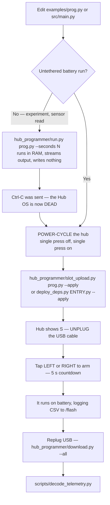

# sys301_minesweeper

## 🚨 DEMO DAY — upload and run in 60 seconds (no Claude needed)

```bash
cd ~/sys301_minesweeper
# 1. Plug in USB. If a program is running, press the hub's CENTER button to stop it.
#    (Used run.py / download.py / a probe since the hub last booted? Power-cycle the hub first.)
./hub_programmer/slot_upload.py examples/demo_day.py --apply
# 2. Hub shows "S". Unplug USB.
```

**Run it:**

1. Put the robot **inside** the square, at a corner on the border **opposite the wall**, facing
   **along** that border (parallel to the wall), sensors ~6 cm inside the tape.
2. Standing behind the robot, the wall is now on its left or its right. Tap that button (**LEFT** or
   **RIGHT**). 3-2-1 countdown, then it sweeps lanes and shifts one wheel-pivot (~95 mm) toward the wall each lane.
3. The live mine count shows on the light matrix with a beep per mine. Tap **LEFT/RIGHT** to end and
   show the final count. **CENTER** kills the program.

**If it fails:**

| Symptom | Fix |
|---|---|
| Upload aborts at the identity check | Power-cycle the hub (unplug, hold CENTER to turn off, turn on), then re-run the upload |
| Upload succeeds but nothing starts | A program is already running: press CENTER, re-run the upload |
| Demo program misbehaves | Fallback, proven: `./hub_programmer/slot_upload.py examples/find_note.py --apply`. Drives forward and stops on a note |

**Afterwards, get the log:** plug in USB and run `python3 hub_programmer/download.py --all`.

⚠ Never hold the CONNECT (Bluetooth) button while plugging in USB. Never accept a "Hub update" prompt.

---

ERAU **SYS 301 Systems Engineering — Introductory Project** (Fall 2026). A four-person team builds and
programs a LEGO Education SPIKE Prime robot to find sticky-note "mines" inside an arena outlined in blue
painters tape, and produces the graded course deliverables. This repository holds all of it: robot code,
engineering record, hardware record, journal, report drafts, budget ledger.
**Demo Day 10 SEP 2026 · Intro Report 18 SEP 2026.**

> ⚠ **[CLAUDE.md](CLAUDE.md) is the authority** — mission, BLACKLIST, hard facts, doc routing, working
> rules. This README is a **map**; it does not restate doctrine and must never contradict it.
> Read CLAUDE.md first, then [docs/todo.md](docs/todo.md) for where we are.
>
> ⚠ **The mission is still PARTIAL.** The briefing was verbal and one sentence long; **"10×10" has no
> units**, which is the single largest open question in the project.
> [docs/scope.md § Mission](docs/scope.md#mission--partial-verbal-briefing-captured-2026-08-25) ·
> [docs/plans/questions-for-the-professor.md](docs/plans/questions-for-the-professor.md)

## Start a session

```bash
./scripts/stack.sh up        # ollama -> docs-rag -> ResearchHub tunnel (nothing starts at boot)
./scripts/stack.sh status    # what is actually WORKING, proved not assumed
./scripts/check-docs.py      # the standing repo check — run it after touching docs/ or src/
./find_spike_prime.py        # is the hub enumerated and openable?  (read-only, sends nothing)
```

**docs-rag** answers questions over this repo's own `docs/` at `http://127.0.0.1:10060`
([runbook](docs/runbooks/docs-rag.md)) — use it before grepping a 120-file tree:

```bash
curl -s -X POST http://127.0.0.1:10060/api/ask \
  -H 'Content-Type: application/json' -d '{"question":"..."}'   # the field is `question`, not `query`
```

`/api/ask` needs the remote LLM: **ERAU VPN up**, then `./scripts/sky-ollama.sh up`. Expect ~80 s warm —
slow is not broken. `stack.sh status` reports **search and ask separately**; on 2026-09-08 it reported
search OK and **ask FAIL (tunnel down)**, in which case fall back to `/api/search` or grep.
Academic papers: `./scripts/rh-query.sh "question"` — never raw curl.

## Repo map

| Path | Why it exists |
|---|---|
| [`src/`](src/) | The mission code. **Flat, no packages** ([ADR-0004](docs/decisions/0004-flat-src-supersedes-package-split.md)). **Pure** modules — `config` `calibration` `detector` `sweep` `result` `odometry` `classify` `telemetry` `floor_anomaly` `event_filter` `motion_tuning` — import on the host with no robot. **Hub-facing** modules are named `hub_*.py`, one file per device, and are the **only** files allowed to import the LEGO API. `check-docs.py` enforces that boundary. `main.py` is the competition program: a state switchboard over both halves. |
| [`probes/`](probes/) | **Read-only** hub interrogation, one concern per file — `devices` `ports` `encoders` `filesystem` `whoami` `harvest` `hub_os_state` `import_check`, plus the BLE probes. They write nothing to the hub. |
| [`hub_programmer/`](hub_programmer/) | The deploy tooling — `upload.py` `run.py` `slot_upload.py` `download.py` `deploy_deps.py` `capture_ble.py`. See **Getting code onto the hub** below. |
| [`examples/`](examples/) | Throwaway on-hub programs, one demonstration each. Their **output** is the durable artifact and is filed in [`docs/findings/runs/`](docs/findings/runs/INDEX.md). |
| [`scripts/`](scripts/) | Host-side helpers. Script the ritual rather than re-improvising a shell pipeline. |
| [`docs/`](docs/README.md) | The engineering record. Every folder has an `INDEX.md`. |
| [`docs/course/budget.md`](docs/course/budget.md) | The Schrute Buck ledger and the **single source of truth** for the budget. Add a row and carry the balance down; never build a parallel table. *(Was a script, `inventory.py`, until 2026-09-08 — deleted by operator decision, recoverable from git history. Do not resurrect it.)* |
| `tmp/telemetry/` | Downloaded run logs. Gitignored — promote anything worth keeping into `docs/findings/`. |

`probes/`, `hub_programmer/` and `examples/` touch hardware **by design**. The `hub_*.py` filename rule
is scoped to `src/` only, so they do not violate it.

### docs/ routing

| Content | Folder |
|---|---|
| Discoveries about our own robot/code, with measurements | [`docs/findings/`](docs/findings/INDEX.md) |
| Study of things outside this repo (LEGO APIs, tools, techniques) | `docs/research/` |
| Rules distilled from our own mistakes (WHEN → DON'T → BECAUSE) | `docs/lessons_learned/` |
| Why we chose X over Y — ADRs, immutable | [`docs/decisions/`](docs/decisions/INDEX.md) |
| Repeatable operator procedures | [`docs/runbooks/`](docs/runbooks/INDEX.md) |
| Tactical "how" artifacts, dated | `docs/plans/` |
| Dated session narrative | `docs/session_records/` |
| Graded course artifacts | `docs/course/` |
| Port map, build record, design description | [`docs/hardware/`](docs/hardware/INDEX.md) |

**No `.md` in the repo root** except `README.md`, `CLAUDE.md`, [`MEMORY.md`](MEMORY.md),
[`test_methodology.md`](test_methodology.md) and `tmp*.md` — that exact allowlist is enforced by
`./scripts/check-docs.py`. Diagrams are **mermaid, never ASCII art**.

## Getting code onto the hub

There are **two write paths**, and picking the wrong one wastes a class period.

| Tool | Where the code lands | Use it for |
|---|---|---|
| `hub_programmer/run.py prog.py --seconds N [--save FILE]` | **RAM only** — paste mode over the USB REPL, streams output back, **writes nothing** to the hub | Experiments, sensor reads, anything tethered |
| `hub_programmer/slot_upload.py prog.py --apply [--slot N]` | A Hub OS **program slot**, then starts it | The robot running **untethered on battery** |
| `hub_programmer/upload.py FILE --apply` | A **module** in `/flash/lib`, SHA-256 verified by the hub on itself | Dependencies a slot program imports |
| `hub_programmer/deploy_deps.py ENTRY.py --apply` | Resolves `ENTRY.py`'s transitive `src/` imports with `ast`, uploads each, then slot-uploads the entry | Deploying `src/main.py` in one command |
| `hub_programmer/download.py --all` → `scripts/decode_telemetry.py` | Pulls CSV telemetry off `/flash`, then decodes it into plain words | After an untethered run |

`slot_upload.py` and `deploy_deps.py` are **dry-run by default** — they write nothing without `--apply`,
and `slot_upload.py` reads and compares the hub's **device UUID** before a single byte is written.
Runbooks: [deploy-to-hub.md](docs/runbooks/deploy-to-hub.md) ·
[deploy-with-deps.md](docs/runbooks/deploy-with-deps.md) ·
[first-main-run.md](docs/runbooks/first-main-run.md) ·
[ADR-0007](docs/decisions/0007-deploy-by-writing-modules-to-flash-lib.md).

### ⚠ REPL work and slot upload are mutually exclusive

`run.py` and everything in `probes/` send **Ctrl-C** to get a MicroPython prompt. **Ctrl-C kills the
Hub OS**, and the Hub OS is what serves the binary control protocol `slot_upload.py` needs — so a slot
upload attempted afterwards aborts at its identity check (correctly, having written nothing).

**The fix is a hub power-cycle: single press the centre button off, single press on.**
`scripts/restore-hub-os.py` attempts a software recovery but **does not work yet** — its own header says
so; a missing `>>>` prompt is not proof the Hub OS is back.
**On demo day: do all colour surveying first, then power-cycle, then upload the competition program.**
Discovered 2026-09-08 —
[colour-survey-and-first-detection § 7](docs/findings/colour-survey-and-first-detection-2026-09-08.md).

### The untethered cycle



CENTER is the firmware's button: a single press launches the slot program and a press while it runs
stops it, so a program can only read **LEFT/RIGHT** as its own input.

## The demo programs

Each `examples/` file's own header comment is authoritative — read it before running it. The ones that
matter now:

| Program | What it does |
|---|---|
| `examples/motor_poc.py` | The **proven 1 ft square** with gyro-closed 90° turns, logged, untethered. The motion primitives in `src/main.py` are grounded in this run. |
| `examples/drive_to_tape.py` | Drives forward until the **blue boundary tape** is seen, then stops. First detection *and* motion together on battery: stopped on the tape, ~3 mm coast, 20 Hz tick. |
| `examples/find_note.py` | Drives forward until a **sticky note** is seen, stops, and names the colour — the GATE-1 run. Telemetry downloaded 2026-09-08 records `#end reason=NOTE_FOUND colour=YELLOW refl=62` and `colour=PINK refl=99`; the finding write-up is still owed. |
| `examples/follow_tape.py` | **Straddles** the blue tape and follows it — the tape fits *between* the two sensors, so a sensor seeing tape means the robot drifted the other way. Sides matter absolutely. |
| `examples/competition_start.py` | The competition **start ritual** end to end, **no motors**: arm → LEFT/RIGHT tap → 10 s countdown → autonomous phase → done. |
| `examples/standalone_log.py` | Logs sensors to `/flash` for 45 s while unplugged, no motors — the retrieval half of the untethered path. |
| `examples/sweep_skeleton.py` | The smallest thing that looks like the mission: a lawnmower sweep that stops and reports on a colour event. **Commands motion — prop the wheels up.** |
| `examples/color_live.py` · `color_classify_demo.py` | Stream both colour sensors, raw and classified, so surfaces can be compared live. No robot needed. |
| `examples/drive_moves.py` · `square_odometry.py` · `gyro_drift.py` · `imu_units_and_rate.py` | The drivetrain and IMU characterisation runs behind the measured constants below. |
| `examples/autorun_test.py` · `heartbeat.py` | Answered whether `/flash/main.py` autoruns. **It does not** — which is why the slot route exists. |
| `examples/ble_*.py` | Bluetooth bring-up: scan, connect, identify our hub, MTU. |

## Host-side tools

```bash
./scripts/scan-surface.py YELLOW_NOTE   # capture one LABELLED surface; appends to
                                        # docs/findings/runs/surface-survey-<date>.txt
./scripts/analyse-survey.py             # run the REAL src/ detection code over that capture —
                                        # do the mines trip the detector, does the tape?
./scripts/sensor-sides.py               # which colour sensor is physically LEFT and which RIGHT
                                        # — re-run after ANY reassembly, including on demo day
./scripts/decode_telemetry.py           # newest tmp/telemetry/*.csv, in plain words (--verbose for rows)
./scripts/check-docs.py                 # links · INDEX coverage · doc length · no stray root .md
                                        # · the src/ purity boundary · every src/ module imports
./scripts/setup-host.sh --apply         # one-time on a NEW host, BEFORE first hub contact
./scripts/coverage-budget.py            # the sweep time-budget arithmetic
```

`scan-surface.py` is also the **demo-day site-survey tool**: the mine colour may change on the day, so
the plan is to characterise the real arena in a couple of minutes rather than to guess in advance.

**There is no test suite, by decision** ([ADR-0005](docs/decisions/0005-no-test-suite-verify-on-hardware.md)).
Do not create one. Verification is the interpreter, throwaway one-liners, and the robot on the floor;
`check-docs.py` is the only standing check. Full reasoning: [test_methodology.md](test_methodology.md).

## Key measured facts

All MEASURED on our hardware — [docs/hardware/port-map.md](docs/hardware/port-map.md) and
[docs/findings/colour-survey-and-first-detection-2026-09-08.md](docs/findings/colour-survey-and-first-detection-2026-09-08.md).

| | |
|---|---|
| **Ports** | **A** = LEFT motor · **B** = RIGHT motor · **C** = **RIGHT** colour sensor · **D** = **LEFT** colour sensor · E, F empty |
| **Forward** | `A: -v, B: +v` — the motors are mounted **mirrored**, and this sign flip is measured, not assumed |
| **Geometry** | Wheel Ø **63.5 mm**, track width **95 mm**; direct drive, 1 wheel rev = 360 encoder degrees |
| **Detection** | **Reflectance, fixed threshold 30.** Carpet 3–9 · blue tape 7–9 · yellow note 51–73 · pink note 97+ — a 43-point gap with zero overlap. Colour-agnostic, so it survives the mine colour changing on demo day |
| **Blue tape** | Sits *inside* the carpet reflectance band, so the boundary is ignored for free — no blue veto needed |
| **Chromaticity** | The anomaly detector **fails on this carpet**: yellow is invisible to it and blue tape trips it 100% of the time. Reflectance replaced it |
| **Hub** | SPIKE 3 / MicroPython 1.24.0 on `/dev/spike`; `import motor`, `from hub import port`, `import runloop`. **Every SPIKE 2 tutorial is inapplicable** |
| **Identity** | device UUID `03970000-3600-1B00-1450-30514B323320`, advertising as `Team 21`. **Identify by UUID**, never by name and never by MAC |

Raw capture: [docs/findings/runs/surface-survey-2026-09-08.txt](docs/findings/runs/surface-survey-2026-09-08.txt).

## Safety — the non-negotiables

The full list is the **BLACKLIST in [CLAUDE.md](CLAUDE.md)**. The five that bite hardest:

1. **The hub keeps its stock LEGO firmware, permanently** — no Pybricks, no DFU, no bootloader, no
   filesystem format, no factory reset ([ADR-0001](docs/decisions/0001-stock-lego-firmware-only.md)).
2. **Never press-and-hold CONNECT while plugging in USB.** That gesture *is* DFU entry, and its
   pink-green-blue-off flash looks like LEGO's harmless "restart me" pattern.
   **Any three-colour cycle means stop and unplug. Single presses only.**
3. **Never accept a "Hub update required" prompt.** A Hub OS change is an operator decision recorded as
   an ADR, never a side effect of opening a tool.
4. **Never open a blocking serial read.** Every hub-touching command lives in a helper with an explicit
   timeout that exits.
5. **Git mutations are human-only.** Propose the commands at a real milestone; the operator runs them.

Writing a `.py` into `/flash` is **saving a document**, not flashing firmware — the firmware is the
MicroPython binary in the STM32F413's program flash, and `/flash` is the FAT filesystem that firmware
exposes. That was *proved* by re-capturing the baseline and diffing it
([firmware-integrity-proof.md](docs/findings/firmware-integrity-proof.md)). Rule 1 is not weakened by it.

**Roles are enforced, −2 Schrute Bucks per violation.** The **Builder** is the only authorised operator
of the robot; the **Programmer** may plug and unplug it and nothing else.
[Demo-day runbook](docs/runbooks/demo-day.md).

## Where to look next

| | |
|---|---|
| **What to do next** | [docs/todo.md](docs/todo.md) ← single source of truth |
| **What we do not yet know** | [docs/plans/known-unknowns.md](docs/plans/known-unknowns.md) |
| Questions for the professor | [docs/plans/questions-for-the-professor.md](docs/plans/questions-for-the-professor.md) |
| What this project is and is NOT | [docs/scope.md](docs/scope.md) |
| Milestones | [docs/roadmap.md](docs/roadmap.md) |
| How we work here | [docs/directives/INDEX.md](docs/directives/INDEX.md) |
| What's due, when, how it's graded | [docs/course/deliverables.md](docs/course/deliverables.md) |
| Full documentation map | [docs/README.md](docs/README.md) |
| Session context for AI agents | [CLAUDE.md](CLAUDE.md), [MEMORY.md](MEMORY.md) |

## Key dates

| Date | Event |
|---|---|
| 1 SEP | Sprint 2 begins · mid-project survey |
| **10 SEP** | **Demo Day** |
| 15 SEP | Peer review + journal due |
| 18 SEP | Intro Report due (CSER 2022 Word template) |

The journal is **80 points and loses 5 per missing day** — the cheapest guaranteed score in the project.

---
Structured to the standards in `~/llm-project-bootstrap/`, distilled into [docs/directives/](docs/directives/INDEX.md).
