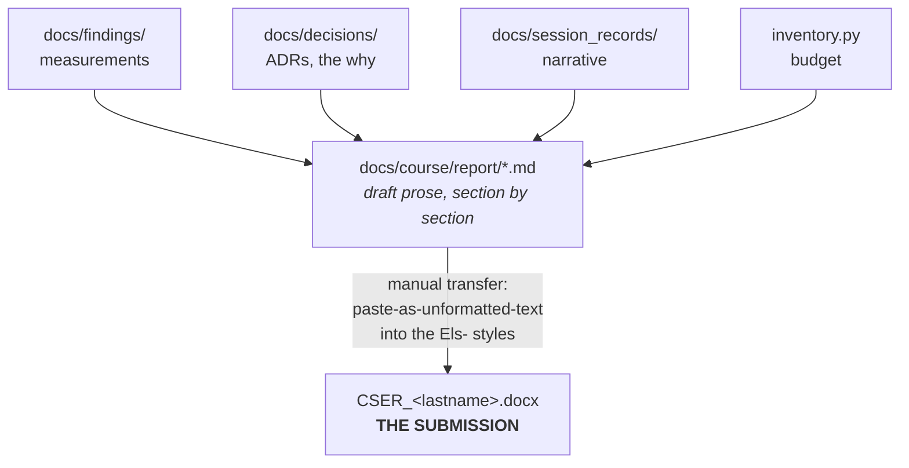

# Intro Report — INDEX

**Due 18 SEP 2026.** Point value is **not stated** in the instructions — do not assume one.

**The format is `[ASSUMED]`, and the assumption is a strong one.** The student instructions say only
*"18 SEP — Intro Report Due"* — **they never name a format, a template, or a file type.** What we have is
the CSER 2022 / Elsevier Procedia **Word template, handed to the team**, whose own author instructions
say *"Please title your files in this order 'CSER_authorslastname'. Submit both the source file and the
PDF."* Handing out a template is a strong signal, but it is an inference, not a stated requirement.

**Submit both the `.docx` and a PDF** unless told otherwise — the template asks for both and the cost of
including the extra file is zero.

### Why not LaTeX / Overleaf?

Asked by the operator 2026-08-26. Elsevier Procedia does publish a LaTeX version of this template, so it
is technically available — **but the professor handed out the Word one**, and the template's instructions
ask for "the source file", which under that template means the styled `.docx`. Submitting a `.tex` source
against a Word template is a gratuitous risk on a graded deliverable.

It is also unnecessary: the reason LaTeX was attractive was *no Word on Linux*, and that problem is
already solved — LibreOffice round-trips this template with all 20 `Els-` styles and the trim size intact
([../../findings/cser-template-libreoffice-roundtrip.md](../../findings/cser-template-libreoffice-roundtrip.md)).

**Revisit only if** the professor says the format is open.

| | Path |
|---|---|
| **Template (the thing we fill in)** | `../source-material/cser_template_cser2022 (7).docx` |
| **Template rendered (read this for the rules)** | `../source-material/cser_template_cser2022 (7).pdf` |
| Section-by-section plan + which repo file feeds each section | [outline.md](./outline.md) |
| What's due when, across all deliverables | [../deliverables.md](../deliverables.md) |

---

## Workflow: markdown is the draft, the `.docx` is the deliverable



1. **Draft in markdown, in this folder**, one file per section or a few grouped sections, named by
   concept (`introduction.md`, `method.md`, `results.md`). [outline.md](./outline.md) says what goes in
   each and where the content comes from.
2. **Never write prose straight into Word.** Word files diff badly, merge worse, and the draft needs to
   be readable next to the repo artifacts it is citing.
3. **Transfer late and once per section**, when the section's content is settled. Copy a section into
   Word, then apply the `Els-` style to each paragraph. Pasting *formatted* markdown output into the
   template is what destroys the styles.
4. **Rename the file `CSER_<authorslastname>.docx`** — the template's own instruction (PDF §1.6:
   "Please title your files in this order 'CSER_authorslastname'").
5. **Delete the template's own content before submitting**: the boilerplate body text, and the
   "Instructions to Authors for Word template" pages (PDF pp. 5–6). They are part of the template file,
   not part of your paper.

**Rule of thumb:** if a number or a decision is in the report but not in the repo, it is unsourced.
Put it in `docs/findings/` or `docs/decisions/` first, then cite it into the report.

---

## Formatting constraints

**Verified** rows were read out of the template's own files. Commands used:

```bash
pdftotext -layout "../source-material/cser_template_cser2022 (7).pdf" -          # the prose rules
mkdir -p /tmp/cser && cd /tmp/cser && unzip -o -q "/home/devel/sys301_minesweeper/../source-material/cser_template_cser2022 (7).docx"
grep -o 'w:pgSz[^/]*' word/document.xml ; grep -o 'w:pgMar[^/]*' word/document.xml
grep -o 'w:styleId="[^"]*"' word/styles.xml | sort -u
```

| Constraint | Value | Source |
|---|---|---|
| File format | **MS Word only** | PDF §1.1 |
| Layout | **Single column**, formatted for direct printing | PDF §1.1 |
| Trim size | **192 × 262 mm** — verified as `w:pgSz w="10886" h="14855"` twips = 192.02 × 262.03 mm (twips ÷ 1440 × 25.4) | PDF §1.1 + `word/document.xml` **[verified]** |
| Margins | top 16.0 mm · bottom 22.1 mm · left 13.0 mm · right 14.0 mm (`w:pgMar` 907/1253/737/794 twips) | `word/document.xml` **[verified]** |
| Margins may be changed? | **No** — "Please do not change the margins of the template as this can result in the footnote falling outside printing range" | PDF §1.7 |
| Section order | **Title, Authors, Affiliations, Abstract, Keywords, Main text (incl. figures & tables), Acknowledgements, References, Appendix** | PDF §1.1 |
| Section numbering | Left justified, bold, first letter capitalized, numbered consecutively **starting with the Introduction**. Sub-heads italic, "1.1, 1.2", left justified, subsequent lines indented. Minimum two text lines after a heading before a page break. | PDF §1.4 |
| Acknowledgements / References headings | Left justified, bold, first letter capitalized, **no numbers** | PDF §"Acknowledgements" |
| Body style | `Els-body-text`, Times New Roman **10 pt** — return to it after every bulleted list | PDF §1.1 + `word/styles.xml` **[verified]** |
| Figures | Numbered with Arabic numerals, **every figure captioned**, caption **below** the figure, **8 pt**, left justified. PNG/JPEG/GIF preferred, **300 DPI**. **Embedded, not supplied separately.** | PDF §2 |
| Tables | Numbered with Arabic numerals, **every table captioned**, caption **above** the table, left justified. **Horizontal rules only** — no vertical lines. **Embedded, not supplied separately.** | PDF §1.2 |
| References | Listed at the end; **numbered in order of appearance**; cited in text as superscript `1` or `2,3`; every in-text reference must appear in the list and vice versa | PDF §1.3 |
| Equations | Numbered consecutively in parentheses, right-hand side; template's own example is a **MathType** object | PDF §3 |
| Units | **SI units** | PDF §1.5 |
| Style | Avoid end-of-line hyphenation · vectors/matrices **bold** · scalar variables *italic* · define all non-standard abbreviations at first use · footnotes avoided where possible (8 pt if used) · leave a blank line between paragraphs · do not number pages | PDF §§1.1, 1.5, 1.7 |
| Filename | `CSER_<authorslastname>.docx` | PDF §1.6 |

### The 20 named styles in the template

`Els-Title` (17 pt) · `Els-Author` (13 pt) · `Els-Affiliation` (8 pt italic) · `Els-Abstract-head` ·
`Els-Abstract-text` (9 pt) · `Els-keywords` (8 pt) · `Els-body-text` (10 pt) · `Els-1storder-head`
(10 pt bold) · `Els-2ndorder-head` · `Els-3rdorder-head` · `Els-4thorder-head` · `Els-bulletlist` ·
`Els-caption` (8 pt) · `Els-table-text` (8 pt) · `Els-equation` · `Els-footnote` (8 pt) ·
`Els-acknowledgement` · `Els-reference-head` · `Els-appendixhead` · `Els-appendixsubhead`.
Sizes read from `word/styles.xml` **[verified]**. **Apply these styles; do not hand-format.**

---

## ⚠ LibreOffice round-trip — check this in Sprint 1, not on 17 SEP

The development host is native Ubuntu 22.04. **LibreOffice 7.3.7.2** is installed (`libreoffice --version`,
verified) and is the likely editing path. Microsoft Word is not installed on this machine.

**What we verified about the template file:**

- It is a plain **`.docx`** (`file` reports "Microsoft Word 2007+"), and **`unzip -l` shows no
  `vbaProject.bin`** — so *this particular copy carries no macros*, despite the template's §1 talking
  about `.docm` macros ("Removal of all highlights", "Accept track change", "Locking of Rules").
  Someone already converted it. **[verified]** So macro loss is not the risk here.
- It **does** contain a 20.7 MB `word/media/image1.wmf`, a second WMF, and
  `word/embeddings/oleObject1.bin` — i.e. **Windows Metafile artwork and an OLE/MathType equation
  object**. These are exactly the objects most likely to be mangled by a non-Word editor. **[verified]**
- No `documentProtection` or `writeProtection` in `word/settings.xml`. **[verified]**

**What is UNVERIFIED and must be tested:**

- ❓ **UNVERIFIED** — whether the 20 `Els-*` paragraph styles survive an open-and-save-as-`.docx`
  round trip through LibreOffice 7.3.7.2 with their fonts, sizes, spacing, and indents intact.
- ❓ **UNVERIFIED** — whether the trim size (192 × 262 mm) and the exact margins survive.
- ❓ **UNVERIFIED** — whether the WMF images and the OLE equation object survive, or are rasterized,
  dropped, or replaced with a placeholder.
- ❓ **UNVERIFIED** — whether the instructor grades the `.docx` in Word (where a LibreOffice-mangled
  file would look wrong to them but fine to us). **Assume yes.** This is why it must be checked early.

### Early-check procedure (~15 minutes, do it in Sprint 1)

```bash
cd /home/devel/sys301_minesweeper
cp "../source-material/cser_template_cser2022 (7).docx" /tmp/roundtrip-in.docx

# 1. Baseline: styles, page size, media inventory, BEFORE
mkdir -p /tmp/rt-before && cd /tmp/rt-before && unzip -o -q /tmp/roundtrip-in.docx
grep -o 'w:styleId="[^"]*"' word/styles.xml | sort -u > /tmp/styles-before.txt
grep -o '<w:pgSz[^/]*/>' word/document.xml > /tmp/pg-before.txt
unzip -l /tmp/roundtrip-in.docx | awk '{print $1, $4}' > /tmp/media-before.txt

# 2. Round-trip through LibreOffice headlessly (no GUI, no prompts)
timeout 180 libreoffice --headless --convert-to docx --outdir /tmp/rt-out /tmp/roundtrip-in.docx

# 3. Compare
mkdir -p /tmp/rt-after && cd /tmp/rt-after && unzip -o -q /tmp/rt-out/roundtrip-in.docx
grep -o 'w:styleId="[^"]*"' word/styles.xml | sort -u > /tmp/styles-after.txt
diff /tmp/styles-before.txt /tmp/styles-after.txt      # any Els-* missing = FAIL
grep -o '<w:pgSz[^/]*/>' word/document.xml             # must still be w=10886 h=14855
unzip -l /tmp/rt-out/roundtrip-in.docx | awk '{print $1, $4}' | diff /tmp/media-before.txt -
```

Then **open both PDFs side by side** (`libreoffice --headless --convert-to pdf`) and look at the
equation and the figure. An XML diff can pass while the rendering is visibly wrong.

**Record the result as a finding** in `docs/findings/` with the LibreOffice version and the date —
that is a measurement, and it belongs there, not here.

**If the round trip fails**, the fallbacks in rough order of preference — all `[UNVERIFIED]`, pick after
the test tells you what actually broke:

1. Do the final assembly on a **teammate's or a lab Windows machine with real Word**; draft everything
   in markdown here so the Word session is one paste-and-style pass, not authoring.
2. **Word for the web / Office 365 in `google-chrome`** (installed on this host) if the school provides
   a licence — browser Word preserves the file server-side.
3. Only if neither is available: LibreOffice, then a **visual diff of the exported PDF against
   `../source-material/cser_template_cser2022 (7).pdf`** before submitting.

**Do not discover this on 17 SEP.**

---

## Open questions for the instructor

- [ ] What is the Intro Report worth in points? Not stated in the instructions.
- [ ] Is it submitted as `.docx`, as PDF, or both? Template §1.6 says "Submit both the source file and
      the PDF" — but that is the *conference's* instruction, not necessarily this course's.
- [ ] One report per team, or one per student?
- [ ] Is there a page or word limit? The template states none.
