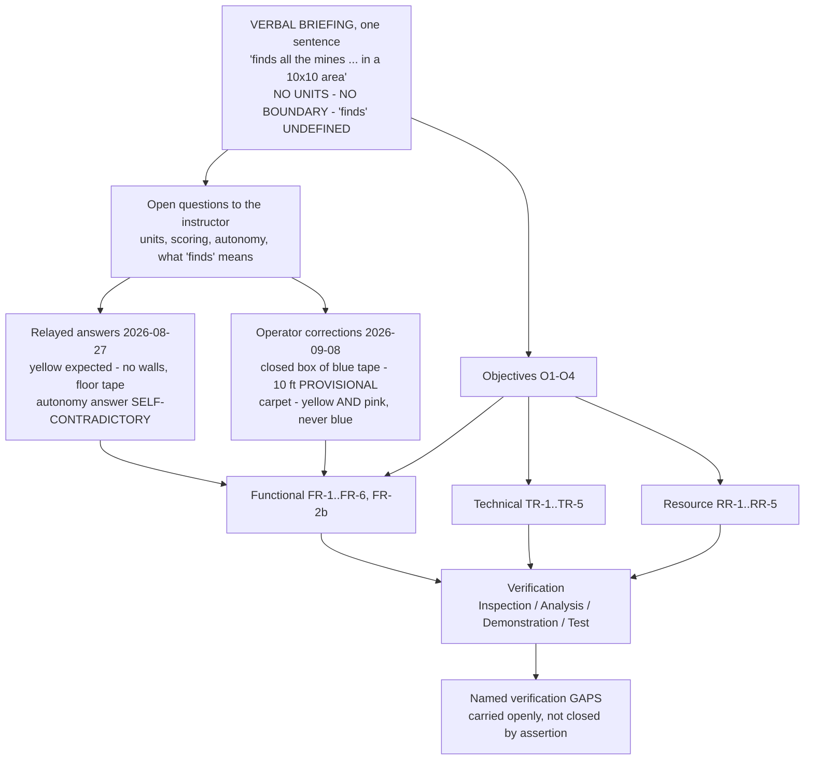
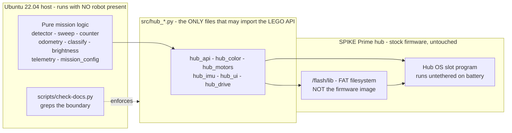

# Intro Report — assembled draft

> ## ⚠ DRAFT, ASSEMBLED FROM THE REPOSITORY. NOT SUBMITTED PROSE.
>
> **Assembled 2026-09-09** from the repo's dated findings, decisions and telemetry, following the
> section structure in [outline.md](./outline.md). Every number below is either **MEASURED** on our
> own hardware, **COMPUTED** from a measured number, or marked **[ASSUMED] / [PROVISIONAL]** — the
> project's own labelling discipline ([../../lessons_learned/say-which-kind-of-verified.md](../../lessons_learned/say-which-kind-of-verified.md)).
>
> **Every gap is marked `[GAP — needs X]` in place.** A gap is not a placeholder to smooth over; it
> is a thing the paper cannot say yet.
>
> **Three things this draft deliberately refuses to claim**, because the repo does not support them:
> 1. `src/main.py`, the competition program, **has never run on hardware**. Every behaviour reported
>    in §5 is attributed to the `examples/` program that actually produced it.
> 2. Reading both colour sensors buys **redundancy, not coverage**. The sweep planner still computes
>    a 41.0 mm lane pitch, i.e. 75 lanes ([../../plans/competition-program-readiness-2026-09-09.md](../../plans/competition-program-readiness-2026-09-09.md) § 3g).
> 3. The swept region is an **open decision**, not a settled design (`KU-D12`, `OPEN — PRIORITY`).
>
> **Format rules live in [INDEX.md](./INDEX.md)** — CSER 2022 / Elsevier Procedia, MS Word, single
> column, 192 × 262 mm, `Els-*` styles, table captions **above** with horizontal rules only, figure
> captions **below** at 8 pt. This markdown is the draft; the `.docx` is the deliverable.

---

## Title

> `[GAP — needs the mission wording to settle, and a decision between two framings]`

Candidate, foregrounding the engineering story rather than the platform:

**"Refuting a shipped design with its own measurement: requirements, detection, and coverage in a
LEGO SPIKE Prime minesweeping robot"**

Plainer alternative: *"Design and verification of an autonomous floor-sweeping target-detection robot
under a partial verbal specification."*

## Authors

> `[GAP — needs four names]` All four are `*TBD*` in [../team/roles.md](../team/roles.md), and the
> operator's own role is flagged `[ASSUMED, UNCONFIRMED]` Programmer. The template also requires a
> **corresponding author with a telephone number and email**. This blocks the title block outright
> and costs one minute to close.

## Affiliations

> `[GAP — needs confirmation]` Embry-Riddle Aeronautical University. "Department of Systems
> Engineering" is **inferred from the course code SYS 301**, not read from any document the team
> holds; campus, street address and postcode are unknown ([outline.md](./outline.md) § Title).
> One affiliation is assumed, so a single superscript `a`.

## Abstract

> **Write this last** ([outline.md](./outline.md)). Draft below is provisional and contains one gap;
> `Els-Abstract-text`, 9 pt.

A four-person undergraduate systems engineering team was given a design challenge **verbally and in
one sentence** — *"build a mine sweeper robot that finds all the mines (I think yellow sticky notes)
in a 10×10 area"* — with no units, no boundary definition, and no statement of what "finds" delivers.
This paper reports how a complete requirements set, an architecture, and a verified detection method
were derived from that sentence under enforced role separation, a 100-unit simulated budget, and five
build sessions. The central engineering result is a **refutation**: a chromaticity-based floor-anomaly
detector, already written and previously validated at zero false triggers over 238 rows of real drive
telemetry, was measured on the actual mission surfaces to be **unfit** — yellow targets cleared its
threshold on **0 %** of samples while the blue boundary tape tripped it on **100 %**. The mechanism was
quantisation, not hue collision: the classroom carpet returns a total of only ~79 ADC counts, so the
fitted band sigma is smaller than one count. It was replaced by a single brightness threshold —
`reflection() >= 30` — separating floor (3–9) and boundary tape (7–9) from yellow (51–73) and pink
(97+) targets by a **43-point gap with zero overlap**, and re-verified in motion, untethered on
battery, on real targets of both colours. A coverage-time analysis shows exhaustive coverage of the
provisionally-stated 10-foot arena to be **unreachable** within a plausible demonstration slot, and
the paper reports coverage alongside count rather than concealing it.
`[GAP — needs the Demo Day outcome, 10 SEP]`

## Keywords

`systems engineering; requirements derivation; LEGO SPIKE Prime; coverage path planning; reflectance
detection; verification and validation`

*(Semicolon-separated, per the template.)*

---

# 1. Introduction

**Fed by** [../../scope.md](../../scope.md) §Overview / §Objectives / §Constraints ·
[../deliverables.md](../deliverables.md) § Calendar.

This project is the introductory design challenge for ERAU SYS 301 (Systems Engineering). A team of
four designs, builds, programs and demonstrates a LEGO Education SPIKE Prime robot against an
instructor-briefed challenge, under two constraints that are unusual in an engineering course and are
the reason the project is a *systems* exercise rather than a robotics one.

**Enforced role separation.** Each member holds exactly one role — Builder, Designer, Supplier,
Programmer — with written prohibitions and a **−2 Schrute Buck penalty per violation**. The Builder
alone assembles and is the only permitted operator of the robot. The Designer designs and may not
touch supplies. The Supplier alone handles money and supplies. The Programmer writes code and may
touch the robot only to plug it into or unplug it from a laptop. A fifth participant, an AI Scrum
Master agent, is provided by the course.

**A priced economy.** The team began with **100 Schrute Bucks**, buy-back is 90 % of listed price
rounded down, and **face-to-face meeting time beyond a daily five-minute standup is billed at 1 SB per
person per minute**. Written digital communication is unlimited and free — and is itself a graded
submission collected in full.

Together these make information flow, not mechanism, the binding constraint. A sensor mounted 3 mm too
high is not something the Programmer may correct; it is a written request to the Designer, executed by
the Builder, in the next class session. There were **six class sessions** between project start
(25 AUG 2026) and Demo Day (10 SEP 2026).

**Objectives**, as recorded at project start ([../../scope.md](../../scope.md) § Objectives):

| | Objective |
|---|---|
| **O1** | A robot that autonomously performs the briefed mission on Demo Day. |
| **O2** | Journal, mid-project survey, peer evaluations and this report, submitted on time and to rubric. |
| **O3** | An engineering record traceable enough that this report is written **from** the repository rather than reconstructed from memory. |
| **O4** | Zero firmware risk — the hub is shared course equipment and must be returned in its factory software state. |

§8 closes against these four.

**Structure.** §2 states the problem and derives the requirements from a one-sentence verbal briefing.
§3 describes the systems engineering approach the course itself imposes. §4 covers the design and its
implementation. §5 reports verification and measured results. §6 treats the budget as a systems
constraint. §7 is what did not work, which in this project is where most of the evidence is. §8 draws
the lessons and concludes.

---

# 2. Problem statement and requirements

**Fed by** [../../scope.md](../../scope.md) §Mission and §Requirements ·
[../../findings/mission-answers-2026-08-27.md](../../findings/mission-answers-2026-08-27.md).

## 2.1 The briefing, and what it does not say

The written course instructions say only *"Your design challenge is per the Instructor's briefing."*
The briefing was delivered **verbally**, and this is the whole of it:

> *"Build a mine sweeper robot that finds all the mines (I think yellow sticky notes) in a 10×10
> area."*

That sentence is the requirement of record. It is worth being precise about how little it fixes:

| Element | What the sentence establishes | What it leaves open |
|---|---|---|
| Task | Find **all** the mines — so coverage, not sampling, is the success criterion | What "finds" delivers: a count, a map, stopping on each, retrieving them |
| Target | Sticky notes, hedged twice — *"I think"* | Whether other colours are present; whether the colour changes |
| Arena | A "10×10 area" | **No units.** Feet, metres, inches and LEGO studs differ by two orders of magnitude in path length |
| Boundary | — | Whether there is one, and of what kind |
| Autonomy | — | The word "autonomous" appears **nowhere** in the course instructions (checked 2026-08-26) |

**This is the paper's first systems-engineering point.** The team's response was not to guess and
proceed, but to (a) record the sentence verbatim as the requirement of record, (b) enumerate what it
does not establish as explicit open questions addressed to the instructor, (c) build to the **narrowest
defensible reading**, and (d) **parameterise every open value** so that a clarified answer changes a
number and not the architecture. Everything still guessed carries an `[ASSUMED]` tag in the repository
to this day.

## 2.2 Partial answers, and their provenance

Three answers were relayed on 2026-08-27 — **from the professor, verbally, through a teammate**, one
relay hop further from the source than the already-hedged briefing. The repository records what is
QUOTED, what is RELAYED and what is INFERRED, and refuses to collapse them
([../../findings/mission-answers-2026-08-27.md](../../findings/mission-answers-2026-08-27.md)):

- **Mine colour** — *"we expect yellow."* An expectation, and the second hedge on this fact. Carried
  as a configured value, never a constant.
- **Boundary** — **no walls**; the boundary is floor tape, *either* blue painters tape *or*
  silver/grey duct tape. Which one was not pinned down.
- **Autonomy** — *"you can't have a human operator… if you do have a human operator, they cannot be
  looking at the arena."* The first clause forbids what the second permits. **This was deliberately
  not recorded as answered.** Autonomy is carried as the team's design choice, not as an established
  requirement, and the reasoning is that a *blind* operator refunds no navigation work.

Four further facts were corrected by the operator on 2026-09-08, one relay hop closer to the source:
the graded arena is a **complete closed box of blue painters tape** on the floor (the practice area's
incomplete tape is not the graded arena); the expectation is a **10-foot square, 3048 mm**, explicitly
**"not set in stone"**; the floor is **multicolour classroom carpet**; and the mines are **yellow and
pink**, the colour **may change on the day**, and mines are **never blue**.

⚠ **A blue sticky note and blue tape are different objects** and no rule in the codebase may conflate
them. The arena size remains **PROVISIONAL**, not closed.

## 2.3 The derived requirements

Seventeen numbered requirements in three classes. Full text and status:
[../../scope.md § Requirements](../../scope.md#requirements).

| ID | Requirement (abbreviated) | Note |
|---|---|---|
| **FR-1** | Traverse the designated arena after a single operator start action | `[ASSUMED]` autonomy — our choice, not an established requirement |
| **FR-2** | Detect a target on the floor and distinguish it from the floor | The subject of §5 |
| **FR-2b** | Classify a detected target by colour, and report an unclassifiable reading as UNKNOWN rather than forcing a class | Team-added; `UNDERIVED` from the briefing and labelled so |
| **FR-3** | Count each distinct target exactly once — no double count, no miss | Adjacent notes are the hard case |
| **FR-4** | Report the result without a laptop attached — hub light matrix and/or speaker | Drives TR-3 |
| **FR-5** | Stop cleanly at end of run or on operator stop | |
| **FR-6** | Remain inside the arena boundary | No walls ⇒ no physical backstop; a boundary miss is unbounded |
| **TR-1** | All robot code runs on the hub's **stock** LEGO MicroPython | See §4.1 and O4 |
| **TR-2** | Mission logic pure and host-runnable with no hub attached; LEGO API confined to `hub_*.py` | The decision that made progress possible between sessions |
| **TR-3** | The program runs standalone from the hub, not tethered | Demo Day must not depend on a USB cable |
| **TR-4** | Detection thresholds **calibrated at run start**, not hard-coded | A floor change must not require a code edit |
| **TR-5** | Port assignments live in exactly one place and are referenced, not repeated | |
| **RR-1…RR-5** | Build within 100 SB; Ubuntu host, FOSS only; sensors and motors limited to the course store; prices may change so the ledger records the price actually paid | §6 |

**FR-2b deserves comment**, because it is the one requirement the team added rather than derived. The
briefing asks only that mines be *found*. Classification by colour is the team's own ambition, and the
repository's traceability matrix marks it `UNDERIVED` rather than dressing it as a customer need. It
survived because it costs nothing at the count level: classification is **report-only and never gates
the count** (§4.4).

## 2.4 Derivation, drawn

> **Figure 1.** *Requirements derivation, from a one-sentence verbal briefing to verification.*
> `[GAP — needs export to PNG at 300 DPI for Word]`

> ⚠ **Before lifting anything else from the traceability matrix**, refresh it. As of 2026-09-09
> [../../plans/requirements-traceability.md](../../plans/requirements-traceability.md) still asserts
> that `src/` is empty, that no colour sensor is owned, and that *"the hub has never been connected"*
> — all three refuted since. `[GAP — needs the matrix refreshed before §2.3's V-method column is written]`

---

# 3. Systems engineering approach

**Fed by** [../team/roles.md](../team/roles.md) · [../team/communications.md](../team/communications.md) ·
[../../decisions/INDEX.md](../../decisions/INDEX.md) · [../../session_records/INDEX.md](../../session_records/INDEX.md).
*This is the section the course is actually about, and it needs no hardware.*

## 3.1 Role separation as an imposed interface constraint

The four roles are not a division of labour the team chose; they are an **imposed set of interfaces
with enforcement**. Their practical effect is that no individual can close a loop alone:

| Role | May | May not |
|---|---|---|
| Builder | Assemble the planned solution; **operate the robot — the only person who may** | Assemble anything the Designer has not planned; fix the design themselves |
| Designer | Sketch and design; revise a returned design | **Touch the supplies**; build it themselves |
| Supplier | **Handle money and buy — the only person who may**; sell back at 90 % | Touch the supplies again after stocking them, except to sell |
| Programmer | Write all the code; **plug/unplug the robot from a laptop** | Touch the supplies otherwise; operate the robot |

The consequence the team had to design around: **on Demo Day the Builder presses the button, and the
Programmer does not.** Every runbook in the repository that says "run the program" is an instruction
addressed to the Builder. A sensor found to be mounted three times too high is not a fix the
Programmer may make; it is a written request to the Designer, built by the Builder, in the next
session. This is the reason for the architecture in §4.2.

## 3.2 Written-first communication, because talking is priced

Face-to-face beyond the daily standup costs **1 SB per person per minute**, and written digital
communication is unlimited and free. A four-person ten-minute huddle costs 40 SB out of a 100 SB
budget — **40 % of the money that buys the robot**. The team's policy is therefore written-first, and
the economics, not a preference, are the justification. All written communication is additionally a
**graded submission collected in full**, which makes the channel the record.

> ⚠ `[GAP — needs action, not prose]` `docs/course/team/comms-export/` **does not exist** and no
> export has ever been taken. The instructions require a full record at the end of the project and
> this is the one deliverable that cannot be reconstructed if history is trimmed.

## 3.3 The repository as the engineering record

**ADR-0003** ([repo holds all team work](../../decisions/0003-repo-holds-all-team-work.md)) was taken on
day one: the repository holds robot code, requirements, decisions, findings, hardware record, budget
ledger and course deliverables, because *"reconstructing three weeks from memory on 17 SEP is the
failure mode."* This paper is the test of that decision — it is being written from dated artifacts,
and every number in §5 and §6 is a citation rather than a recollection.

The record is organised by content type: measurements about our own robot in `findings/`, external
study in `research/`, prescriptive rules distilled from our own mistakes in `lessons_learned/`,
immutable decisions in `decisions/` (ADRs), repeatable procedures in `runbooks/`, dated narrative in
`session_records/`. A single script, `./scripts/check-docs.py`, enforces the mechanical parts:
every link resolves, every folder is indexed, no document exceeds 1200 lines, and the architectural
boundary of §4.2 holds.

## 3.4 Decisions of record

Seven ADRs, including a genuine supersession chain — which is itself evidence the process was used
rather than performed:

| ADR | Decision | Status |
|---|---|---|
| [0001](../../decisions/0001-stock-lego-firmware-only.md) | Stock LEGO firmware only; third-party firmware permanently excluded | Accepted |
| [0002](../../decisions/0002-split-mission-logic-from-hub-io.md) | Split mission logic from hub I/O | **Superseded by 0004** |
| [0003](../../decisions/0003-repo-holds-all-team-work.md) | The repo holds all team work | Accepted |
| [0004](../../decisions/0004-flat-src-supersedes-package-split.md) | Flat `src/`, boundary by filename (`hub_*.py`) | Accepted, supersedes 0002 |
| [0005](../../decisions/0005-no-test-suite-verify-on-hardware.md) | **No host-side test suite** — verification happens on the robot | Accepted |
| [0006](../../decisions/0006-docs-rag-llm-is-operator-gated.md) | Shared-GPU retrieval service is operator-gated | Accepted |
| [0007](../../decisions/0007-deploy-by-writing-modules-to-flash-lib.md) | Deploy by writing modules to `/flash/lib`, verified by a hub-computed SHA-256 | Accepted |

**ADR-0005 is the one that needs defending in a systems engineering paper.** The team deliberately has
no unit tests. The argument is that the risk in this project is not logic error in pure functions —
it is *the physical world disagreeing with the model*: a wheel diameter, a carpet's reflectance, a
motor sign, a module name that the firmware silently shadows. None of those is catchable by a host-side
test, and every one of them actually happened. Verification is therefore the interpreter (a module
that will not import is broken), throwaway checks while developing, and **the robot on the floor**.
The one standing automated check is the architectural boundary. §7 reports honestly on where that
choice cost the team.

## 3.5 Sprints and sessions

Two sprints across six class days, with a 20-minute planning meeting at each sprint start and a
five-minute standup on the others. Each working session is closed out with a dated session record —
seven of them, covering six dates — carrying what was done, what was decided, what was discovered,
what was blocked, and what is next. Those records are the raw material of §5 and §7.

---

# 4. Design and implementation

**Fed by** [../../hardware/port-map.md](../../hardware/port-map.md) ·
[../../hardware/design-description.md](../../hardware/design-description.md) · `docs/decisions/` ·
[../../findings/hub-first-contact-2026-08-27.md](../../findings/hub-first-contact-2026-08-27.md).

## 4.1 Platform, and the constraint that shaped the toolchain

The robot is a LEGO Education SPIKE Prime Technic Large Hub 45601 — six ports A–F, a 5×5 light matrix,
a speaker, a six-axis IMU, USB and Bluetooth — driven from a **native Ubuntu 22.04** host. LEGO does
not officially support Linux desktop.

**O4 makes the firmware untouchable.** The hub is shared course equipment, so replacing its firmware —
which the popular third-party option requires — is permanently excluded (ADR-0001). Everything about
the toolchain follows from that single constraint, and the practical questions it forced were answered
by measurement on 2026-08-27:

| Question | Answer, MEASURED 2026-08-27 |
|---|---|
| Which API generation? | **SPIKE 3** — MicroPython 1.24.0, `motor` / `motor_pair` / `runloop` / `color_sensor` present, **no `spike` module** |
| Can code reach the hub without LEGO's application? | **Yes.** 13,262 bytes in 3.6 s, verified by a **SHA-256 the hub computes on itself**, imported `OK` |
| Is a compiler or a Windows VM needed? | **No.** The hub runs MicroPython source — no GCC, no `mpy-cross`, no VM |
| Is the firmware untouched by this? | **Proven** — baseline capture → upload → re-capture → diff; every stock file byte-identical |

The SPIKE 3 result has a consequence worth stating in a paper: **every SPIKE 2 tutorial is
inapplicable to this hub**, and most material available online is SPIKE 2. Checking which generation a
source targets became a standing rule.

The firmware-integrity argument turns on a distinction that is easy to get wrong: the **firmware** is
the MicroPython binary in the STM32F413's internal program flash; **`/flash` is the FAT filesystem
that firmware exposes.** Writing a `.py` file to `/flash` is saving a document, and cannot modify the
firmware image. That was not asserted — it was *proved*, by capturing a baseline before any write and
diffing it after ([../../findings/firmware-integrity-proof.md](../../findings/firmware-integrity-proof.md)).

## 4.2 Software architecture: a boundary enforced by filename

The governing constraint is that **the robot is only available in class**. If mission logic could only
be exercised with hardware attached, no work could happen between sessions. So (ADR-0004):

- `src/` is **flat**, no packages.
- Inside `src/`, a file named `hub_*.py` may import the LEGO API. **Nothing else may.**
- Everything else — detection, counting, sweep state, odometry, classification, telemetry, config —
  is pure Python that imports and runs on the Ubuntu host with no robot present.
- `./scripts/check-docs.py` greps the boundary on every run. **That check is the only standing
  automated guard in the project** (ADR-0005).

> **Figure 2.** *The architectural boundary and the deploy path.*
> `[GAP — needs export to PNG at 300 DPI for Word]`

The deploy path is base64 chunks over the MicroPython REPL into `/flash/lib`, each upload verified by
a hub-side SHA-256, then a **Hub OS slot upload** that starts the program. A slot program **drives,
prints, logs to `/flash` and keeps running with the laptop unplugged** — proven 2026-09-03 and again
2026-09-08. This satisfies TR-3 without LEGO's application, without `mpy-cross`, and without a compiler.

## 4.3 The robot as built

Recorded rather than designed here — the physical design belongs to the Designer and Builder.

| | As built |
|---|---|
| Drive | **Differential drive** — one motor per wheel, steered by the speed difference. Decided by the team 2026-08-25 |
| Motors | Two Medium Angular 45603 (`device.id` 48), ports **A (left)** and **B (right)**. `max_speed` **930 deg/s**, MEASURED |
| Third contact | A single **unidirectional roller-ball caster** at the rear — rolls freely fore-aft, resists sideways scrub, so a pivot drags it |
| Sensing | **Two** colour sensors (`device.id` 61), ports **C (right)** and **D (left)**, facing down, mounted **underneath** the robot at the middle of three Technic holes, ≈16 mm working height |
| Ports E, F | Empty (`OSError` on read) |
| Wheel diameter | **63.5 mm**, MEASURED 2026-09-03 |
| Effective track width | **95 mm**, MEASURED 2026-09-03 from a driven 1 ft square — replacing an `[ASSUMED]` 176 mm |

Two details of the build are load-bearing and were both learned the hard way. First, **sensor height
matters more than sensor choice**: at the original ~51 mm front-corner mount the carpet read as
effectively nothing, and with a note touching the sensor every channel pins at 1018–1024 and the
colour ratios collapse to 33/33/33. Both ends of the range destroy information; the usable band is
around LEGO's stated 16 mm. Second, **direction is a matter of observation, not inference**: forward is
`A: −v, B: +v`, positive yaw is physically **left**, and sensor **C is right, D is left** — each
confirmed by a human watching the robot, after three separate direction bugs in one day arose from
inferring a sign out of another program's convention.

> `[GAP — needs the Builder]` [../../hardware/build-record.md](../../hardware/build-record.md) is
> still an empty skeleton: build date, who built it, gearing, wheelbase, footprint and mass are all
> unfilled placeholders. Its own header forbids filling it from a guess. No hub required.

> `[GAP — needs a photograph]` **There is no photograph of the robot anywhere in this repository.**
> A build section without a picture of the build is conspicuous. Only the Builder, on 10 SEP, can fix it.

> `[GAP — needs a ruler]` The **centre-to-centre spacing of the two colour sensors** is `[UNMEASURED]`.
> It is known only to be **wider than a 76 mm sticky note** (a single note could never be made to
> cover both at once). It sets the effective swath and the corner-turn radius, and the repository
> ranks it the highest-priority measurement in the project.

## 4.4 Detection and counting

The detection rule is stated in full in §5, because it is a result rather than a design choice. The
counting design around it:

- **Reflectance threshold with hysteresis**, calibrated at run start against the floor (TR-4) rather
  than hard-coded, so a floor or lighting change does not require a code edit.
- **Edge-triggered counting with event-width gates derived from the measured tick rate**, not from a
  guessed one — so that a carpet fleck is too narrow to count and two merged notes are too wide.
- **Classification is report-only and never gates the count.** A reading the classifier cannot place
  is reported UNKNOWN rather than forced into a class (FR-2b). This is what makes the design robust to
  the instructor's warning that the mine colour **may change on the day**: a colour change alters the
  reported *class*, never the *count*.
- **Every reader returns `None`, never `0`, when it cannot read** — a project-wide rule, because a
  zero from a dead sensor is indistinguishable from a dark floor.

## 4.5 Sweep and coverage

The sweep is a **boustrophedon** (lawnmower) pattern with a per-lane re-square against the gyro, which
literature confirms is the standard decomposition for this problem rather than an invention of ours
(Galceran & Carreras 2013; Shah et al. 2025; Krupke 2023 for turn cost). Arena size, lane pitch,
speed and timebox are all configuration values, not constants — the parameterisation promised in §2.1.

§5.5 reports what the arithmetic says about whether that sweep can finish, and it is the least
comfortable result in the paper.

---

# 5. Verification and results

**Fed by** `docs/findings/` (26 dated findings) · 106 telemetry CSVs in `tmp/telemetry/` · 14 raw
capture files in `docs/findings/runs/`.

> ⚠ **Attribution rule for this whole section.** `src/main.py`, the competition program, **has never
> run on hardware**. Every behaviour reported below was produced by a named program in `examples/`,
> and is attributed to it. This is stated in the repository as a standing risk
> ([../../plans/risk-register.md](../../plans/risk-register.md) R-18) and is not softened here.

## 5.1 Platform and toolchain verification (2026-08-27)

Reported in §4.1. Summarised as verification evidence: deploy proven without vendor software
(13,262 B / 3.6 s / hub-computed SHA-256), **firmware proved unchanged by capture-diff**, Bluetooth
brought up from Linux with raw `bleak` and LEGO's COBS framing validated in both directions, and the
hub identified by **matching its device UUID across both USB and Bluetooth** rather than by its
user-settable advertised name.

One measured limitation is recorded because it constrains any future telemetry design: the negotiated
BLE MTU is **23 bytes against an advertised maximum of 509** — a 20× gap.

## 5.2 Inertial units, derived from gravity rather than a datasheet

**Table 1.** *IMU characterisation, MEASURED 2026-08-27.*

| Quantity | Result | How it was established |
|---|---|---|
| `acceleration()` units | **milli-g** | Flat hub reads `az ≈ 989` — i.e. one g |
| `tilt_angles()` units | **decidegrees** | Accelerometer gives true tilt 0.705° from gravity; `tilt_angles()` reported 6.7; ratio **9.53 ≈ 10** |
| Yaw range | Wraps at **±180.0°** | Every heading delta goes through a normalising function |
| Full IMU tick cost | **1.350 ms** | Timed as the call *mix* that ships |
| Gyro drift, clean run | **≤ 0.0033 °/s** | Resolution-limited at 1 decidegree over 30 s |

**The most instructive result here is the one that was thrown away.** A first 30-second run reported
98.7° of drift at 3.29 °/s. It was **discarded** — the drift went +7.6, then −22.2, then +96.6, and
steady drift does not reverse direction; the robot was being handled while it measured. The probe was
then rewritten to **watch the accelerometer while measuring**: it independently flagged the run
CONTAMINATED at t = 14106 ms (gravity vector off by 2534 mg) and **refused to report a number**. The
clean re-run gave ≤0.0033 °/s.

The transferable result is not the drift figure. It is that **a measurement which validates its own
preconditions can reject itself**, and that a measurement which cannot do so must be rejected by a
human noticing that its shape is wrong.

⚠ One anomaly is carried openly rather than resolved: the same three IMU calls timed **individually**
sum to 0.328 ms — four times less than the 1.350 ms measured as a mix, implying an impossible read
rate. Planning uses 1.350 ms and the per-call figures are never quoted as read rates.

## 5.3 Drivetrain constants, measured on the robot itself

**Table 2.** *Drivetrain constants. All MEASURED on this robot; `[ASSUMED]` values they replaced are
shown to make the point that none of them was modelled.*

| Constant | Value | Date | Replaced |
|---|---|---|---|
| Wheel diameter | **63.5 mm** | 2026-09-03 | `[UNKNOWN]` |
| Effective track width | **95 mm** | 2026-09-03 | `[ASSUMED]` 176 mm |
| Motor `max_speed` | **930 deg/s** | 2026-09-01 | `[ASSUMED]` 660 deg/s |
| Commanded vs delivered speed | commanded 150 dps → **150.02** measured | 2026-09-08 | — |
| Loop rate, driving + logging + both sensors | **20 Hz** sustained; real telemetry median 54 ms, **mean 75 ms = 13.3 Hz** | 2026-09-08 | `[ASSUMED]` 100 Hz |
| Coast after a stop trigger | **≈ 3 mm** | 2026-09-08 | — |
| Straightness | per-side heading drift **< 1° per foot** | 2026-09-03 | resolved a "spins left" scare |
| Left/right encoder agreement | within **0.4 %** over a 155 mm drive on carpet | 2026-09-08 | resolved a carpet-slip fear |

**How the track width was obtained is the interesting part.** The robot drove a defined **1 ft × 1 ft
square** — four sides and four gyro-closed 90° turns — **untethered on battery**, with the program
uploaded to a hub slot, the USB cable pulled, and the log retrieved afterwards: **238 rows over 25.8
seconds**, ending `#end reason=complete rows=238`. The four turns give track width directly as
`track = 2 · arc / θ`, comparing encoder arc against gyro heading. The robot measured its own geometry
by driving a shape. *(Program: `examples/motor_poc.py`.)*

A ~5° gyro under-read makes 95 mm a slight over-estimate, and a separate ~85°-vs-90° turn discrepancy
was diagnosed as a **logging artifact** — the loop broke after the last sample — not a control error.
Both are recorded rather than tidied away.

The mean-versus-median tick rate has a named cause: the CSV flush costs a deterministic **+51 ms on
one tick in ten**. Reporting the median alone would have overstated the sampling rate by 39 %.

## 5.4 Detection: a shipped design refuted by its own measurement

**This is the central result of the project.**

### 5.4.1 What was shipped, and why it looked right

The team's detector was a **chromaticity anomaly** design: fit the floor's colour distribution during
an arming burst, then flag any sample deviating from it by more than a sigma-normalised threshold. The
reasoning was sound at the time — chromaticity divides brightness out, so it should survive a shadow,
a lighting change and an unknown floor. On 2026-09-03 it was validated against **real drive telemetry**
and produced **0 false triggers in 238 rows** on both sensors while moving.

**That earlier result is not retracted.** It was taken on a different floor, and it was true there.
What follows is what happened when the same code met the mission's actual surfaces.

### 5.4.2 The mission surfaces, measured

**Table 3.** *The four mission surfaces, MEASURED 2026-09-08 on the real classroom carpet with the
real sticky notes and the real blue painters tape, at a matched mount height.*

| Surface | r % | g % | b % | `reflection()` | total (r+g+b) | built-in `color()` |
|---|---|---|---|---|---|---|
| Carpet | 30.5 | 33.6 | 35.8 | **3–9** | 49–107 | `BLACK` / `UNKNOWN` |
| Blue tape | 20.7 | 30.5 | **48.5** | **7–9** | 124–135 | **`BLUE`, 149/149 samples** |
| Yellow note | 35.5 | 35.0 | 29.4 | **51–73** | 289–1715 | `WHITE`/`BLACK` — unreliable |
| Pink note | **46.4** | 23.7 | 29.9 | **97+** | 263–1715 | `UNKNOWN`/`MAGENTA` — unreliable |

Cross-validated inside one session: carpet read 72 total at the mount against 80 in an independent
hand-held capture; blue tape read 129 and 130 at two different heights. Two sensors, two captures each.

A separate result justifies FR-2b concretely: **the hub's built-in `color()` is trustworthy for blue
and useless for the notes.** It returned `BLUE` on all 149 tape samples and never once on carpet, while
flapping between `WHITE`, `BLACK`, `UNKNOWN` and `MAGENTA` on the notes depending only on brightness —
and it carries no "saturated, do not trust me" flag.

### 5.4.3 The refutation

The shipped `src/floor_anomaly.py` and `src/detector.py` were run **unmodified** over those captures.

**Table 4.** *Refutation of the chromaticity detector, MEASURED 2026-09-08. Derived on-threshold 7.47.*

| Surface | Median deviation | % of samples clearing the threshold | Verdict |
|---|---|---|---|
| Carpet (baseline) | 1.35 | 0 % | — |
| **Yellow note** | **5.99** | **0 %** *(port D: 53–66 %, a coin flip)* | **INVISIBLE** |
| Pink note | 20.37 | 98.8 % | detected |
| **Blue tape** | **11.30** | **100 %** | **FALSE POSITIVE** |

**As shipped, on this floor, the robot would have armed cleanly, swept the arena, missed every yellow
mine, and counted the boundary tape as mines.** It would have reported a plausible number.

### 5.4.4 The mechanism, which was not the predicted one

Everyone's prediction was hue collision — the note's colour happening to sit inside a floor band. It
was not that. **It was quantisation.**

The carpet's median `r+g+b` is only **79 ADC counts**. One count is therefore 0.0127 chromaticity
units, and the fitted band sigma came out at **0.00953 — less than a single ADC count.** The carpet's
apparent "colour spread" is not colour at all; it is quantisation noise, and that noise is exactly what
a sigma-normalised rule divides by. Yellow sits 0.0546 from the carpet centroid, which is **5.73 sigma**
against a rule demanding 8.90.

This matters for the fix, and it is why diagnosis was worth the hour: **raising the sensitivity ceiling
would not have helped**, because that ceiling never overflowed (2–5 bands were fitted on real carpet).
A tuning response to this failure would have failed silently and looked like progress.

### 5.4.5 The replacement, which is simpler than what it replaced

**Table 5.** *Reflectance separation, MEASURED 2026-09-08 on both sensors at the matched mount height.*

| Class | `reflection()` band |
|---|---|
| Carpet | 3 – 9 |
| Blue boundary tape | 7 – 9 |
| **Detection threshold** | **30** |
| Yellow note | 51 – 73 |
| Pink note | 97 + |

Four properties, each of which is a design argument rather than a tuning outcome:

1. **A 43-point gap with zero overlap**, and the threshold of 30 sits dead centre — 21 points of
   margin each way. Contrast-to-noise is 51–57 MAD against the project's own 8.90-MAD arming rule.
2. **Colour-agnostic**, so it survives the instructor's warning that the mine colour may change.
3. **The blue tape falls inside the carpet band**, so the mine rule cannot see the boundary at all.
   The feared blue-veto problem **dissolved rather than being solved** — no veto module, no guard band,
   no tape colour class. The boundary rule (`b/(r+g+b) >= 0.44`) is a separate, independent rule.
4. **Asymmetric in our favour**: the rule fires on *high* reflectance, so a shadow can only cause a
   miss, never a phantom count. Chromaticity had no such asymmetry.

A fifth, practical property: `reflection()` was found to equal `(100 · i) // 1024` exactly — 0
mismatches in 3412 rows — so no new hub call site was needed. The refuted module is kept on disk as
evidence rather than deleted.

Run end-to-end through the real counting code with real samples: **2 of 2 planted notes counted, the
tape crossing rejected, and zero phantom events over 30 s of raw carpet.**

### 5.4.6 Re-verification in motion — the acceptance gate

**Table 6.** *Detection while moving, untethered on battery, 2026-09-08. Trailers quoted verbatim from
the retrieved telemetry.*

| Run | Trailer | Colour named |
|---|---|---|
| 1 | `#end reason=NOTE_FOUND colour=PINK refl=99 rows=37 deg=198 mm=109` | **correct** |
| 2 | `#end reason=NOTE_FOUND colour=YELLOW refl=62 rows=32 deg=160 mm=88` | **correct** |

Both runs used `examples/find_note.py`, driving on battery with no laptop attached. Carpet read **3–7
while driving**, against the static survey's 3–9 — so the hand-held measurements predicted the moving
behaviour, which is what makes a pre-run site survey worth doing on the day.

Earlier the same day, `examples/drive_to_tape.py` stopped on the boundary correctly:
`#end reason=TAPE_DETECTED rows=53 deg=281 mm=155`, with left/right encoders at 281° and 282°
(0.4 % apart), yaw wander ≈ 2.6°, coast ≈ 3 mm, and **both sensors triggering on the same tick**.

This closes FR-2 and FR-2b at the "detect and name a real target in motion" level. **It does not close
FR-3 at arena scale, and it does not demonstrate the competition program.**

## 5.5 Coverage: the requirement that does not fit

The provisional 10-foot arena turns the sweep into an arithmetic problem with an uncomfortable answer.

**Table 7.** *Coverage and time, COMPUTED at speeds actually MEASURED on this robot.*
> ⚠ `[GAP — needs ONE reconciled recomputation before submission]` Three internally consistent but
> differently-configured figures are in circulation across the repository (229 m and 232 m for the
> one-sensor case; 116 m at a 41 mm offset and 88 m at a 106 mm pitch for two sensors). They are
> different configurations, not contradictions, but they are trivially conflated. Re-run
> `scripts/coverage-budget.py` once with the measured 63.5 mm wheel, and quote one table with the
> configuration stated beside every number.

| Configuration | Lanes | Path length | Time |
|---|---|---|---|
| One sensor at 55 mm/s — *what every run to date actually drove* | 75 | ~229 m | **~69 min** |
| Two sensors at 300 mm/s | 38 | ~116 m | ~6.4 min |

Two things follow, and they are stated in the repository's risk register as a **realised** risk (R-01,
re-scored to the maximum 25 on 2026-09-08):

- **Exhaustive coverage of a 10-foot arena fits no plausible demonstration slot.** Driving a single lap
  of the border alone consumes about **92 %** of a five-minute run.
- Two things that had been treated as optimisations — reading both colour sensors, and raising the
  traverse speed — became **requirements**. Every run to date drove at 80–100 deg/s against a measured
  930 deg/s ceiling: roughly 9× of headroom never used.

⚠ **An honest correction the paper must make about its own fix.** Reading both sensors was implemented
on 2026-09-09 and it buys **redundancy, not coverage**: the sweep planner still computes a 41.0 mm lane
pitch, i.e. 75 lanes and ~232 m. Lane pitch must not be widened until both ports are genuinely read
every tick, because that is the one change that silently loses mines.

The sampling side sets a second, independent ceiling. The **worst-case chord** across a 76 mm note —
crossed at 45° at the worst lane offset — is **36.48 mm, not 76 mm**. At 300 mm/s and the measured
9.18 Hz that yields **1.12 samples per crossing**: the robot steps over the note. Speed is capped by
**sampling, not by the motors**.

**The team's response is to report coverage alongside count**, and to prefer a smaller declared region
swept completely over a bare tally taken from a partial sweep.

> ⚠ `[GAP — needs an operator decision, still open on 2026-09-09]` **What area the demonstration
> actually sweeps has not been decided.** `KU-D12` is flagged `OPEN — PRIORITY`; the 914 mm (3 ft)
> value currently in the configuration is recorded explicitly as *"a placeholder, NOT a decision"*.
> The paper must describe this as a decision the team faced and how it was resolved on the day — it
> cannot describe it as settled.

## 5.6 What is NOT verified

Stated plainly, because a verification section that omits its gaps is not one:

| Gap | Status |
|---|---|
| **`src/main.py` has never executed on hardware** | The dominant open risk (R-18). Every proven behaviour belongs to a program in `examples/` |
| Colour-sensor spacing | `[UNMEASURED]`; known only to exceed 76 mm |
| Heading wander: systematic bias or zero-mean noise? | **Unresolved and load-bearing** — a bias costs 85 mm of drift over 3048 mm; zero-mean noise costs almost nothing. With n = 4 the 95 % interval spans −7.8° to +6.8° over 10 ft, so a fatal bias is still consistent with the data |
| Arena size | `[PROVISIONAL]` — operator-stated 10 ft, "not set in stone" |
| Whether crossing the boundary tape is a scored failure | Open; assumed to be a failure, the pessimistic reading |
| Demo Day performance | `[GAP — 10 SEP]` |

---

# 6. Budget and resource management

**Fed by** [../budget.md](../budget.md) — the single source of truth, maintained by the Supplier.

**Table 8.** *Schrute Buck ledger, complete as of 2026-09-09.*

| Date | Description | Qty | Unit | Amount | Balance |
|---|---|---|---|---|---|
| | Starting budget | | | | **100** |
| 2026-08-25 | Motors | 2 | 10 | −20 | 80 |
| 2026-08-25 | Wheels | 2 | 7 | −14 | 66 |
| 2026-08-25 | Project budget reallocation | 1 | 10 | −10 | 56 |
| | **Total spent** | | | **−44** | **56** |

**All spending happened on day one, and 56 % of the budget was never spent.** Two prices have ever
been observed in this project: a motor at 10 SB and a wheel at 7 SB. There is deliberately **no price
list** in the record, because store prices may change during the project (RR-5) — the ledger records
the price *actually paid* on a date, never a quoted list price.

**The economy as a systems constraint.** Three mechanisms make the budget an engineering input rather
than an accounting detail:

- **Sell-back at 90 % rounded down** makes a wrong purchase a permanent ~10 % loss. The correct
  response is to decide before buying — e.g. settle sensor mounting geometry before buying mounting
  blocks — which is a design-order constraint imposed by a financial rule.
- **Meeting time is priced** at 1 SB per person per minute beyond the daily standup. A four-person
  ten-minute discussion costs 40 % of the entire budget, which is why the team's default is written
  communication (§3.2).
- **Role violations cost 2 SB each**, so process discipline and the parts budget are the same account.

**Two honest problems this section must state rather than tidy away:**

1. ⚠ **The 10 SB "Project budget reallocation" of 2026-08-25 is unexplained.** It is 23 % of everything
   spent. It is logged as `KU-T6` in the repository's known-unknowns register and remains **open**.
   `[GAP — needs the Supplier]`
2. ⚠ **Two colour sensors are physically mounted on ports C and D and appear on no ledger line.** The
   ledger records two motors and two wheels and nothing else. Their provenance is unreconciled.
   `[GAP — needs the Supplier]`

A section that omitted either would be worse than one that states them, and both are exactly the kind
of specific, ungameable detail this project's own documentation discipline exists to preserve.

---

# 7. Discussion — what did not work

**Fed by** the failed approaches in `docs/findings/` and the rules distilled in
[../../lessons_learned/INDEX.md](../../lessons_learned/INDEX.md).

Most of this project's evidence is in its failures, and several of the best results came from a
measurement contradicting a confident inference.

## 7.1 The chromaticity detector

Covered in §5.4 and not repeated. The discussion point is the **shape** of the failure: it was chosen
for good reasons, validated against real data on a different floor, and then failed on the mission
surface **silently and asymmetrically** — invisible to one target colour, and a 100 % false positive on
the boundary. It would have produced a plausible number rather than an error. The generalisable lesson
is that a detector must be characterised **against every surface it will actually meet**, and that
validating against the surface you have is not the same as validating against the surface you will get.

## 7.2 Line following, four runs and three failures

Four attempts at following the boundary tape, each failing differently and each diagnostic:

| Run | Result | Cause |
|---|---|---|
| v1 | Ended after 2 s every time, `corrections=0` | The rule said "2 s with no tape = line lost" — but **while straddling the tape, seeing no tape is the normal state** |
| v2 | Circled for a whole 40 s run | **Inverted heading-hold sign** turned correction into positive feedback; wheels pinned at a 2.55:1 ratio |
| v3 | `corners=0` | The corner rule demanded both sensors simultaneously; measured, a real corner holds **one** sensor for 5–10 ticks and the other joins ~600 ms later |
| v4 | Corners detected, turned the wrong way | Two independent causes — a geometry error and a noise-fitted rule |

Two results from that sequence are worth a paper on their own.

**The corner turn was diagnosed exactly, not tuned.** A pivot turn is the arc formula with the
sensor-ahead distance silently set to zero — it assumes the sensors sit on the wheel axis, and they do
not. With miss `e = X_v·sin θ − R(1 − cos θ)`, the radius that lands the sensor on the new leg is
`R* = X_v·cot(θ/2)`. At 90° that is simply `R* = X_v`, so a pivot misses the new leg by an entire
sensor-ahead distance; at 180° the term vanishes, so **a pivot is provably correct for a dead-end
U-turn**. What had looked like a heuristic was a theorem.

**And a rule had been fitted against noise.** The on-tape test rejected only a total of zero or less,
so a reading of `0, 1, 3` — pure noise — yields a blue fraction of 0.75 and votes *true*. Two runs in
the corpus contain 5- and 6-tick "sustained" detections that are **entirely sub-40 noise**, long enough
to command a 90° turn on sensor dropout. A minimum-channel-sum floor of 40 now excludes noise while
excluding neither real class (tape 124–135, carpet 49–107).

The rule distilled: **a feedback loop ships with a divergence guard, or it does not ship**. Detect a
correction stuck at its clamp, disable the loop, and record it in the run trailer.

## 7.3 Signs, conventions, and three direction bugs in one day

Encoder signs and yaw signs are **conventions, not directions**. Nothing in telemetry says which way a
robot physically moves; only a human watching it can settle that. Three separate direction bugs
occurred on a single day, every one of them from inferring a sign out of another program's convention.
The response was structural rather than corrective: **one module now owns direction**, with the
evidence recorded beside each constant, and a dedicated program settles forward/back/left/right by
watching rather than by inference.

## 7.4 The toolchain fighting back

Three operational discoveries cost real session time and are recorded so they are not rediscovered:

- **The REPL tools kill the Hub OS.** They send Ctrl-C, which stops the program serving the binary
  control protocol; a subsequent slot upload then aborts at its identity check — correctly, writing
  nothing. **A hub power cycle is required between REPL work and a slot upload.** A Ctrl-D soft reset
  was properly tested, with protocol verification and 25 s of retries, and does **not** work.
- **A running program blocks a new one from starting**, which silently caused several failed uploads
  before the cause was found. The CENTER button stops a running program.
- ⚠ **The module name `config` is shadowed on the hub.** `import config` in an on-hub program resolves
  to something inside the LEGO firmware rather than to the uploaded file, and the program **dies at
  import even though the upload hash-verifies.** The workaround is a rename plus a host-side assertion
  that a check script can catch — because a check that fails loudly is better than an import that is
  hijacked silently.

## 7.5 Where the no-test-suite decision cost us, honestly

ADR-0005 is defensible (§3.4) and the class of bug it declines to chase is genuinely not this
project's risk. But an audit on 2026-09-09 found **16 defects in the shipped `src/` code while
`./scripts/check-docs.py` passed all six of its checks green** — because on the host the hub API is a
simulation and the real branch never executes. A linter cannot see a defect in a branch it never runs.
The response was to add the interpreter's own name-resolution check as a further gate, which is not a
test suite; it is the interpreter checking, which is what ADR-0005 says verification is.

Five bugs found in already-written mission code on 2026-09-08 illustrate the type:

1. A counter's finalisation was never called at a lane end, so a mine still under the sensor stayed
   open, merged with the next lane's first mine, and both were rejected as too wide — a **silent
   double mine loss** at every lane boundary.
2. An event list grew without bound inside the mission loop, on a heap under 252 KiB.
3. The second colour sensor's port was declared and read nowhere, so the mission code swept a
   one-sensor swath while two sensors were mounted.
4. A divergence guard could never fire, because its reference re-datumed on every sighting.
5. A log annotation was clobbered before any row was written — which is why no telemetry file in the
   whole corpus contains a corner event.

None of these is a crash. **All five fail silently and produce a plausible number**, which is the
failure mode this project kept meeting and the one a demonstration cannot expose in five minutes.

## 7.6 Process failures

- **Parallelism without a bottleneck check.** Five workflows were run concurrently and two stalled and
  produced nothing, because every one of them was routed through the same ~80 s retrieval call. The
  rule became a hard concurrency limit.
- **Retrieval is a convenience, not a dependency.** The team's document-retrieval service depends on a
  VPN and a shared remote GPU; on one session it ran at over 175 s per call. Every workflow that
  assumed it must fail open to plain search.
- ⚠ **The journal was not kept as the course intended.** Six entries are owed and the repository holds
  drafts reconstructed after the fact, with **no Question of the Day recorded for any day**. This is
  the clearest process failure in the project and it is recorded here rather than omitted.

---

# 8. Lessons learned and conclusions

**Fed by** [../../lessons_learned/INDEX.md](../../lessons_learned/INDEX.md) — eleven rules already
written as WHEN → DON'T → BECAUSE, plus the six journal entries.

## 8.1 The transferable rules

| Rule | Where it came from |
|---|---|
| **Measure, don't model.** Stop refining an unmeasured number the moment it stops changing a decision; carry it as a variable and go measure it | Track width sat `[ASSUMED]` at 176 mm and measured at **95 mm** |
| **Say which kind of verified.** *Measured* means on real hardware; anything else is *computed* or *confirmed against a source* | An operator correction, adopted project-wide |
| **A measurement should validate its own preconditions** | The gyro probe that flagged itself CONTAMINATED and refused to report |
| **Bound the inputs before trusting a conclusion** — a decision-grade conclusion inherits its weakest input | A coverage conclusion that changed when its inputs were audited |
| **A feedback loop ships with a divergence guard, or it does not ship** | The 40 s circling run |
| **Signs are conventions, not directions** — only a human watching can settle which way a robot moves | Three direction bugs in one day |
| **Benchmark the call mix you will ship**, never one call in a tight loop | Two IMU timings that disagreed by 4× |
| **Interrogate hardware from a script with a deadline**, never a typed command | A hung session is not disposable; a hung script is |
| **Report status against the tool's purpose**, not the component you happened to test | Partial is PARTIAL, not "working with a caveat" |

## 8.2 Against the objectives

| | Objective | Outcome |
|---|---|---|
| **O1** | Working robot | `[GAP — 10 SEP]`. Detection, drive, boundary stop and untethered operation are each **demonstrated on hardware**; the integrated competition program has **never run** |
| **O2** | Graded deliverables | Report drafted from the record; journal reconstructed after the fact and **short of its own standard** (§7.6); survey status `[GAP — needs Canvas confirmation]` |
| **O3** | Defensible engineering record | **Met.** This paper was written from dated artifacts. Every number carries a date, a method and a source, and the refuted results are still on disk |
| **O4** | Zero firmware risk | **Met and proved**, not asserted — by baseline capture, upload, re-capture and diff |

## 8.3 What we would do differently

1. **Characterise the sensor against the real surface first, and everything else second.** The single
   most valuable hour of the project was a surface survey that could have been run in week one, and
   the detector built before it was the wrong detector.
2. **Get the units.** A two-order-of-magnitude ambiguity in the arena spec propagated into every
   coverage, speed and lane-pitch decision for two weeks and was answered — provisionally — two days
   before the demonstration.
3. **Run the integration program early and badly**, rather than a good one late. Every subsystem was
   verified individually; the program that combines them was written on day four and had still not
   executed on day six.
4. **Keep the journal on the day.** It is the cheapest guaranteed score in the course and it was the
   one deliverable allowed to slip.

## 8.4 Conclusion

`[GAP — needs the Demo Day outcome]` — write this after 10 SEP.

The defensible claim, independent of how the demonstration goes, is this: a one-sentence verbal
briefing with no units was turned into seventeen traceable requirements, an architecture that kept
work possible between five short build sessions, and a detection method that is **simpler than the one
it replaced and was chosen because a measurement refuted the alternative** — not because it was tuned
until it worked. The project's most valuable artifact is not the robot; it is the record that can say
exactly which of its own claims were wrong, when, and on what evidence.

---

# Acknowledgements

*Unnumbered, bold, left-justified, `Els-acknowledgement`, at the end of the article — the template
explicitly forbids the title page or a title footnote.*

`[GAP — needs names]` Dr. Watson, and the course teaching assistant. **AI assistance must be
disclosed**: a Scrum Master AI agent is provided by the course, and an AI coding assistant was used
throughout for the software, the engineering record and the drafting of this paper.

---

# Appendix A — Port map and configuration of record

*Placed **before** References. The template contradicts itself on this; its own body and its Appendix
section text both say before, so follow the body ([outline.md](./outline.md)).*

| Port | Device | Role | Physically confirmed |
|---|---|---|---|
| A | Motor, `device.id` 48 | **Left** drive wheel; forward = negative velocity | 2026-09-01 |
| B | Motor, `device.id` 48 | **Right** drive wheel; forward = positive velocity | 2026-09-01 |
| C | Colour sensor, `device.id` 61 | **Right-hand** floor sensor | 2026-09-08 |
| D | Colour sensor, `device.id` 61 | **Left-hand** floor sensor | 2026-09-08 |
| E | *empty* | — | 2026-09-01 (`OSError`) |
| F | *empty* | — | 2026-09-01 (`OSError`) |

Hub identity of record: `device_uuid 03970000-3600-1B00-1450-30514B323320`, BLE `64:8C:BB:0A:1C:8C`,
advertising as `Team 21`. **Identity is established by matching the device UUID, never by the
advertised name** (user-settable) and never by MAC alone.

**Appendix B candidates** — the full ledger table (already Table 8), key source listings, and the
Designer's sketches if they are not used as figures. `[GAP — needs the Designer's sketches]`

---

# References

*Numbered in order of appearance, cited in text as superscripts. Every in-text citation must appear
here and vice versa. Full entries with fetch dates and scope limits:*
[../../research/papers/bibliography.md](../../research/papers/bibliography.md).

| # | Entry | Used for |
|---|---|---|
| 1 | Course instructions, SYS 301 Introduction Project, ERAU, 2026 | §1, §3, §6 — roles, economy, calendar, rubrics |
| 2 | LEGO Education SPIKE Prime documentation | §4.1 — platform, optimal sensor reading distance |
| 3 | Galceran, E. & Carreras, M. (2013), *A survey on coverage path planning for robotics* | §4.5 — boustrophedon as the standard decomposition |
| 4 | Shen, Z. *et al.* (2026), *Coverage Path Planning: Classical Foundations, Recent Advances, and Future Directions*, arXiv:2607.10649 | §4.5 — current survey |
| 5 | Shah, N., Dey, U. & Nishimiya, K. (2025), *End-to-End Framework for Robot Lawnmower Coverage Path Planning using Cellular Decomposition*, arXiv:2506.06028 | §4.5 — existence proof on a real ground robot |
| 6 | Krupke, D. M. (2023), *Near-Optimal Coverage Path Planning with Turn Costs*, arXiv:2310.20340 | §4.5, §5.5 — turn cost as a first-class objective |
| 7 | Fourney, E., Burdick, J. W. & Rimon, E. D. (2024), *Mobile Robot Sensory Coverage in 2-D Environments*, arXiv:2405.15100 | §5.5 — sensor footprint, not robot body, as the binding constraint |
| 8 | Borenstein, J. & Feng, L. (1995), *UMBmark: a method for measuring, comparing and correcting dead-reckoning errors* | §5.3 — the square-drive calibration method |

> ⚠ **Scope limits are recorded in the bibliography and must be honoured.** Krupke 2023 does *not*
> prescribe long-axis lanes — that inference is ours and must be presented as ours. Fourney 2024
> contains no lane-spacing theory and must not be cited as backing for lane pitch.
> `[GAP — needs each entry's full author list, venue and year checked against the bibliography before
> the reference list is typed]`

---

# Figures and tables — production status

**Format traps, from [INDEX.md](./INDEX.md):** table captions go **ABOVE** with **horizontal rules
only** (every markdown table above has to be restyled by hand); figure captions go **BELOW**, 8 pt,
left justified; images must be **PNG/JPEG/GIF at 300 DPI, embedded**, never supplied separately.
LibreOffice is known to drop embedded WMF and OLE objects, so **figures must be rasterised PNGs**,
never vector objects.

## Tables

| # | Table | Data status |
|---|---|---|
| 1 | IMU characterisation | ✅ **Exists, lift verbatim** — `findings/imu-characterisation-2026-08-27.md` |
| 2 | Drivetrain constants | ⚙ **Assembly pass needed** — every number exists but is scattered across four findings |
| 3 | The four mission surfaces | ✅ **Exists, lift verbatim** — `findings/colour-survey-and-first-detection-2026-09-08.md` § 3 |
| 4 | Refutation of the chromaticity detector | ✅ **Exists, lift verbatim** — same finding, § 4. Keep the "port D 53–66 %, a coin flip" qualifier |
| 5 | Reflectance separation | ✅ **Exists, lift verbatim** — same finding, § 5 |
| 6 | Detection in motion (GATE 1) | ✅ **Exists, lift verbatim** — telemetry `#end` trailers |
| 7 | Coverage and time | ❌ **Needs recomputation** — three differently-configured figures in circulation; re-run `scripts/coverage-budget.py` once |
| 8 | Schrute Buck ledger | ✅ **Exists, lift verbatim** — `../budget.md` |
| — | Requirements with derivation and V-method | ⚙ **Blocked** on refreshing `plans/requirements-traceability.md`, which still asserts refuted facts |
| — | Risk register, top rows with exposure scores | ✅ **Exists** — `plans/risk-register.md` ranked summary |

## Figures

| # | Figure | Production status |
|---|---|---|
| 1 | Requirements derivation | 📐 **Mermaid in this draft — must be redrawn or exported for Word.** Also exists as mermaid in `plans/requirements-traceability.md` |
| 2 | Architecture boundary and deploy path | 📐 **Mermaid in this draft — must be redrawn or exported for Word** |
| 3 | **Reflectance separation number line** — carpet, tape, yellow, pink, and the threshold at 30 | ❌ **Does not exist. Data does.** This is the single strongest figure available to the paper and it has never been drawn |
| 4 | Yellow-note approach, reflectance against tick | ❌ **Does not exist. Data does** — plot it from `tmp/telemetry/20260908T105447-findnote-0001092589.csv` |
| 5 | Boustrophedon lane pitch, one sensor versus two | ❌ **Does not exist**; needs the unmeasured sensor spacing first |
| 6 | **Photograph of the robot** | ❌ **Does not exist and cannot be drawn.** Only the Builder, on 10 SEP, can supply it |

⚠ **78 documents in the repository carry mermaid blocks and none is exported.** No mermaid exporter
(`mmdc`) is installed on the host, and it has not been checked whether one is available. **Do not try
to export all 78** — pick the three to five figures that earn their place and produce those.

---

# Assembly checklist and known-stale sources

## Before lifting anything, refresh these three

1. **[../../plans/requirements-traceability.md](../../plans/requirements-traceability.md)** — still
   asserts `src/` is empty, no colour sensor is owned, and *"the hub has never been connected"*.
   Lifting it as-is would put refuted claims into a graded paper.
2. **[../../findings/coverage-time-budget.md](../../findings/coverage-time-budget.md)** — still treats
   the wheel diameter as unmeasured and presents a range over candidate diameters. The wheel was
   measured at 63.5 mm on 2026-09-03.
3. **[outline.md](./outline.md)** — cites ADR-0002 (superseded by ADR-0004) and a `tests/` path removed
   by ADR-0005, and its §5 warning that *"nothing has been measured and the hub has never been
   connected"* is now many findings out of date.

## Production path — de-risked, and MEASURED

LibreOffice 7.3.7.2 round-trips the CSER template: all 20 `Els-*` styles survive with display names
intact and the trim size is byte-identical. One WMF image and one OLE/MathType object are lost — but
those are the template's own sample figure and sample equation, which get replaced anyway. Two rules
follow: **always start from a fresh copy of the pristine template** (losses compound across
round-trips), and **open the final `.docx` once in real Word** before submitting.
`[GAP — needs someone with access to real Word]`

Draft in markdown here; transfer late and once per section; paste as **unformatted text** and then
apply the `Els-` style to each paragraph. Delete the template's own boilerplate body and its
"Instructions to Authors" pages before submitting. Save as `CSER_<authorslastname>.docx` and export a
PDF alongside it.

## Order of work to 18 SEP

1. **10 SEP, in class — three things that happen once.** Ask the four report questions in
   [INDEX.md](./INDEX.md) § Open questions. Get the four names and the affiliation string. Record the
   demonstration: attempts, successes, run time, every failure with its cause, and the three-number
   count protocol (robot's count, true count, independent tally — all three written down **before**
   they are compared). **And photograph the robot.**
2. §3 and §6 are finished drafts above and need only editing — no hardware, no mission answers.
3. Refresh the three stale sources, then finalise §2 and Table 7.
4. §5 gets its demonstration subsection the same day as the demonstration, while it is accurate.
5. Abstract, keywords and §8.4 last.

## Questions that must be asked on 10 SEP

Held open in [INDEX.md](./INDEX.md) § Open questions and
[../../plans/questions-for-the-professor.md](../../plans/questions-for-the-professor.md):

- Does the Intro Report have required content beyond the template, or is the template the whole spec?
  **This is the question that could change the shape of the entire draft.**
- What is it worth in points? (Not stated anywhere in the course material.)
- One report per team, or one per student? (It changes how the remaining days are divided.)
- Is there a page or word limit? (Neither the instructions nor the template states one.)
- `.docx`, PDF, or both?

## Related

- [outline.md](./outline.md) — the section-to-source map this draft follows
- [INDEX.md](./INDEX.md) — every formatting constraint, verified against the template's own XML
- [../journal/reconstruction-notes.md](../journal/reconstruction-notes.md) — the same evidence, audited day by day
- [../budget.md](../budget.md) · [../team/roles.md](../team/roles.md) · [../deliverables.md](../deliverables.md)
