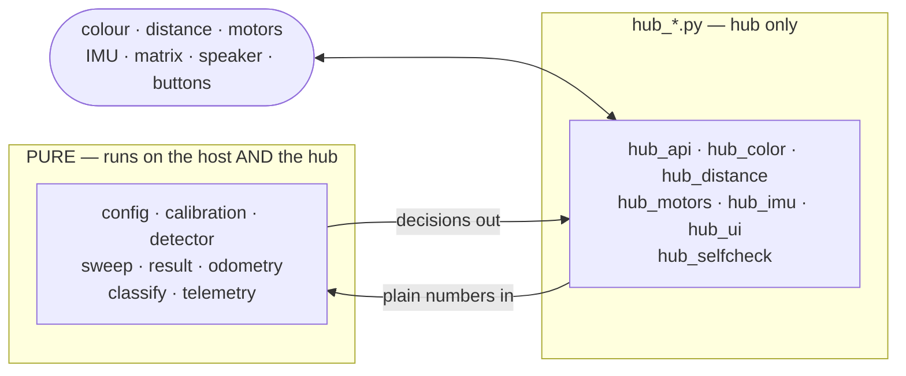

# Code Discipline

**Purpose.** Write less code. On a two-sprint project with one programmer, every line is a liability you
must also debug on a robot.

> **Minimalism here is load-bearing, not an aesthetic.** This project carries **no test suite and uses no
> debugger** ([ADR-0005](../decisions/0005-no-test-suite-verify-on-hardware.md),
> [../../test_methodology.md](../../test_methodology.md)). That is only safe because the modules are small
> and pure enough that a stack trace names the bug outright. Growing, tangled code is precisely what
> creates the need for the tools we have chosen not to carry — so **when a module stops being readable in
> one sitting, split it; do not add tooling around it.**

## Layout — and the one rule that matters

**The rule is the filename.** A module named `hub_*.py` may import the LEGO API; **everything else in
`src/` may not** — not `hub`, `motor`, `motor_pair`, `color_sensor`, `distance_sensor`, `force_sensor`,
`motion_sensor`, or `runloop`. Not "just for a type hint", not "just in this one file". If a pure module
fails to import on a laptop with no robot attached, the boundary is broken.

| Layer | Files | Contains | Runs on |
|---|---|---|---|
| **Pure** | everything not `hub_*` | Detection, debounce, counting, calibration maths, sweep state, odometry, classification, telemetry formatting | Host **and** hub |
| **Hub-facing** | `hub_*.py`, **one per device** | Device reads, motor writes, matrix/speaker/buttons, the clock | Hub only |

Readings cross as **plain numbers**: a `hub_*` module reads a device and hands the pure modules an
integer; they return a decision; the `hub_*` module acts on it. The pure modules never learn a hub exists.

**One file per device** (split from a 520-line `sensors.py` on 2026-08-26 at the operator's direction):
each stays small enough to read in one sitting, which is exactly what the no-test-suite, no-debugger
methodology depends on.

**Why:** the hub lives in the yellow box between classes and work happens in class — hub time is the
scarcest resource on this project. A bug found on a laptop costs a minute; the same bug found on the robot
costs a class period, with three teammates waiting and only the Builder allowed to operate it. Second
payoff: the report can demonstrate the counting algorithm independently of the hardware, which is a far
stronger verification claim than "it counted right in the demo."
Full rationale: [ADR-0002](../decisions/0002-split-mission-logic-from-hub-io.md); scope TR-2.

**Enforcement is a script, not a convention** — `./scripts/check-docs.py` fails if any non-`hub_*` module
imports a hub name. There is no test suite ([ADR-0005](../decisions/0005-no-test-suite-verify-on-hardware.md)),
so **this check is the only thing guarding the boundary**. See [../../test_methodology.md](../../test_methodology.md).

## Why the hub-facing code is scaffolding

Two real blockers: the **mission is unknown** ([../scope.md § Mission](../scope.md#mission--partial-verbal-briefing-captured-2026-08-25)), and
the **hub's API generation is unidentified**. SPIKE 2 (`from spike import PrimeHub`) and SPIKE 3
(`import motor`, `from hub import port`, `import runloop`) are not variants of one API — different call
signatures, different units. Don't write against a guess. Note the second blocker gates only the `hub_*` modules: the pure modules can
be written and exercised on the host before the hub is ever identified. That is precisely what the split
buys, and it is why they were written first.

## MicroPython is not full Python

- **No `numpy`/`scipy`/`pandas`.** Do the arithmetic by hand; it's a handful of lines.
- **The standard library is a subset**, often cut down with a different surface than the CPython docs describe.
- **Memory is limited, no swap.** Large lists, per-sample logging into RAM, and string-building in a hot loop will bite.
- **Assume a module is absent until proven present on the actual hub.** "It's in the Python docs" is not
  evidence — prove it with a diagnostic in `scripts/` and record the result in [../findings/](../findings/).
- The **pure** modules get the strictest reading: written to the MicroPython subset they run on the host
  for free. The reverse is not true.

## Conventions

- **Research and plan so less code is needed.** Motor pairing, timed moves, gyro turns, and light-matrix
  output already exist in the SPIKE API. Custom code needs a documented reason.
- **No magic numbers.** Ports come from [../hardware/port-map.md](../hardware/port-map.md) (TR-5),
  transcribed once into a single constants module. Thresholds are **calibrated at run start**, never
  hard-coded (TR-4).
- **One accountable path per concern.** ONE count variable, ONE calibration routine. Two places that
  compute the count will disagree, and you will find out on Demo Day.
- **Comment the measurement and the why, never the what.** A tuning constant carries what was measured, on
  what surface, under what lighting, and when.
- **Don't over-build error handling out of the gate.** One basic failure path per operation — stop the
  motors, show a state on the matrix. Heavier recovery only against a failure you have actually OBSERVED.
  Some faults belong to the hardware, not the code.
