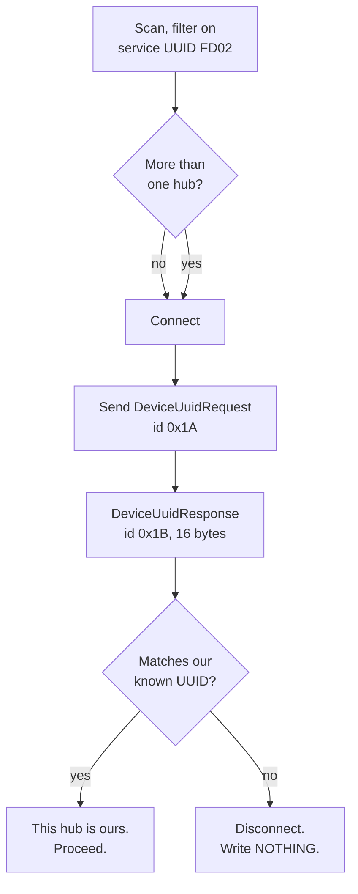

# Finding — Bluetooth works: connected, framed, and our hub identified

**Date:** 2026-08-27 · **Hub connected:** yes, over **Bluetooth LE**, with the USB serial port
untouched throughout · **Anything written to the hub:** **NO** — two read-only queries were sent and
answered.

> **These are measurements.** Every byte below came off our own hardware. The framing was implemented
> from LEGO's published algorithm and then **validated against real responses**, which is a different
> and much stronger claim than "implemented from the docs".

Script: [`examples/ble_info_request.py`](../../examples/ble_info_request.py) ·
transport discovered by [`examples/ble_connect.py`](../../examples/ble_connect.py)

---

## 1. The headline: our hub is identifiable over BLE, and we proved it

The classroom problem was: *several teams' hubs advertise at once, all with similar names, and any
name can be changed. Which one is ours?*

**Answer: connect and ask.** `DeviceUuidRequest` returns the same identity we read over the USB cable.

| Source | Value |
|---|---|
| Read over **USB**, `hub.device_uuid()` | `03970000-3600-1B00-1450-30514B323320` |
| Read over **BLE**, `DeviceUuidResponse` | `0397000036001b00145030514b323320` |

**Identical.** Two independent transports, one identity. The hub advertising as **`"Team 21"` at
`64:8C:BB:0A:1C:8C` is ours**, and that is now proven rather than assumed — earlier it was only
"one LEGO device, strong signal, appeared when the button was pressed", which is circumstantial.

### The procedure for a room full of hubs



**Do not identify by BLE address alone.** The address type is `[UNVERIFIED]` and may be a resolvable
private address, which rotates. Treat the address as a *cache* and re-verify the UUID on every
connection — the check costs one round trip.

**Do not identify by name.** `"Team 21"` is user-settable.

---

## 2. The transport, discovered rather than assumed

```
service 0000fd02-0000-1000-8000-00805f9b34fb        LEGO SPIKE, "Vendor specific"
   char 0000fd02-0001-1000-8000-00805f9b34fb        [write-without-response]   host -> hub
   char 0000fd02-0002-1000-8000-00805f9b34fb        [notify]                   hub  -> host
service 00001801-...                                Generic Attribute Profile
```

One characteristic each way. That is the whole control plane.

> ⚠ **The negotiated MTU was 23, but the hub advertises `max_packet_size` 509.** We are using 4 % of
> the packet size the hub will accept. For a two-byte query that is irrelevant; **for telemetry
> streaming or a file upload it is a 20× throughput difference** and must be fixed by negotiating a
> larger MTU before any of that work is timed or designed around.

---

## 3. LEGO's COBS framing — implemented, then validated

Ordinary COBS delimits frames with `0x00`. **LEGO delimits with `0x02`, then XORs the whole frame by
3.** The XOR is not cosmetic: COBS already escapes every byte `<= 0x02`, so all frame bytes are `>= 3`,
and XOR-ing by 3 guarantees the delimiter `0x02` cannot reappear inside a frame — `b ^ 3 == 2` would
need `b == 1`, which cannot occur. **It also keeps `0x03` — Ctrl-C — off the wire**, which matters
because LEGO runs this same protocol over the USB serial port.

Constants: `DELIMITER 0x02` · `NO_DELIMITER 0xFF` · `COBS_CODE_OFFSET 0x02` · `MAX_BLOCK_SIZE 84` ·
`XOR 3`.

**Validated two ways, and both matter:**

1. **Encoder against a known value.** `InfoRequest` (payload `00`) frames to **`00 00 02`**,
   independently computed by [../research/ble-bring-up.md](../research/ble-bring-up.md) from LEGO's
   own `cobs.py`. The script asserts this before it transmits anything.
2. **Decoder against a real response.** The 17 decoded bytes of `InfoResponse` land on LEGO's
   documented field layout with **every field a sensible value**. Nonsense in any field would mean a
   broken decoder; a clean parse across six fields is not coincidence.

---

## 4. What the hub said about itself

Sent `InfoRequest` `00 00 02`:

```
raw wire : 54 54 00 07 2c 54 06 0b 96 5b fe 06 8b 10 07 13 00 00 02
decoded  : 01 01 00 2f 00 01 08 95 00 fd 01 88 13 00 10 00 00
```

| Field | Value | Why it matters |
|---|---|---|
| message id | `0x01` InfoResponse | |
| RPC version | **1.0.47** | The protocol generation we are speaking |
| firmware version | **1.8.149** | **Different numbering from `os.uname()`**, which reports `v1.20.0-1742.gf212bbe83` / release `1.24.0`. This is the **Hub OS / RPC** version; `os.uname()` reports the **MicroPython** build. Quote both, never merge them. |
| **max_packet_size** | **509** | vs our negotiated MTU of 23 — see the warning above |
| **max_message_size** | **5000** | Upper bound on one logical message |
| **max_chunk_size** | **4096** | The file-transfer chunk size, for a future BLE upload path |
| product_group_device | 0 | |

Sent `DeviceUuidRequest` `07 19 02`:

```
raw wire : 05 18 00 94 00 07 35 07 18 08 17 53 33 52 48 31 30 23 02
decoded  : 1b 03 97 00 00 36 00 1b 00 14 50 30 51 4b 32 33 20
```

`0x1B` DeviceUuidResponse, sixteen bytes of UUID — the match in § 1.

---

## 5. The CONNECT button and its light

**Observed by the operator, 2026-08-27:**

| Light | Meaning |
|---|---|
| **Blinking blue** | Advertising / available to connect |
| **Solid blue** | **Connected** |

This is worth more than it looks: the robot has no screen, and on Demo Day this is how the Builder
confirms the link is live **without a laptop**. In the API the button is `hub.button.CONNECT` and the
light is `hub.light.CONNECT` — LEGO's "Bluetooth button" is named CONNECT in code.

> ⚠ **Single presses only.** Holding CONNECT *while USB is being plugged in* is the documented
> **DFU / bootloader gesture** and is permanently forbidden by
> [ADR-0001](../decisions/0001-stock-lego-firmware-only.md). Worse, the DFU cycle
> (pink-green-blue-off) shares all three colours with LEGO's harmless "Hub OS updated, restart me"
> pattern. **Any three-colour cycle: stop and unplug.** Full warning:
> [../research/ble-bring-up.md](../research/ble-bring-up.md).

**The advertising window is short and self-terminating.** After one successful discovery, a 12 s scan
and then a **120 s scan with nothing holding the serial port** both saw nothing. A client must
**wait-and-pounce** — subscribe to scan results and connect on first sight — rather than
scan-then-connect. `[UNVERIFIED]`: how long the window actually is; nobody has timed it.

---

## 6. What this closes, and what it does not

**Closed**

- **Can we reach the hub over BLE from Linux with raw Python?** Yes. `bleak`, no LEGO software.
- **Can we identify our specific hub among many?** Yes — connect and compare the device UUID.
- **Is LEGO's published framing correct and implementable?** Yes, and now validated against
  real responses in both directions.

**Still open**

- **MTU negotiation** — 23 vs an available 509. Blocks any honest throughput estimate.
- **Program upload over BLE.** `max_chunk_size` 4096 is known; the upload handshake is not exercised.
  Note this is **not on the critical path**: [ADR-0007](../decisions/0007-deploy-by-writing-modules-to-flash-lib.md)
  already deploys over USB, which is proven.
- **Does USB probing suppress advertising?** **UNKNOWN.** An earlier claim that it does was
  **retracted** — the successful discovery changed two variables at once, and a 120 s scan with the
  port untouched still saw nothing. The controlled experiment is in
  [../research/ble-bring-up.md](../research/ble-bring-up.md).
- **Telemetry over this link.** `ConsoleNotification` should carry `print()` output, untested.

---

**Related:** [../research/ble-bring-up.md](../research/ble-bring-up.md) ·
[hub-first-contact-2026-08-27.md](./hub-first-contact-2026-08-27.md) ·
[ADR-0007](../decisions/0007-deploy-by-writing-modules-to-flash-lib.md)
