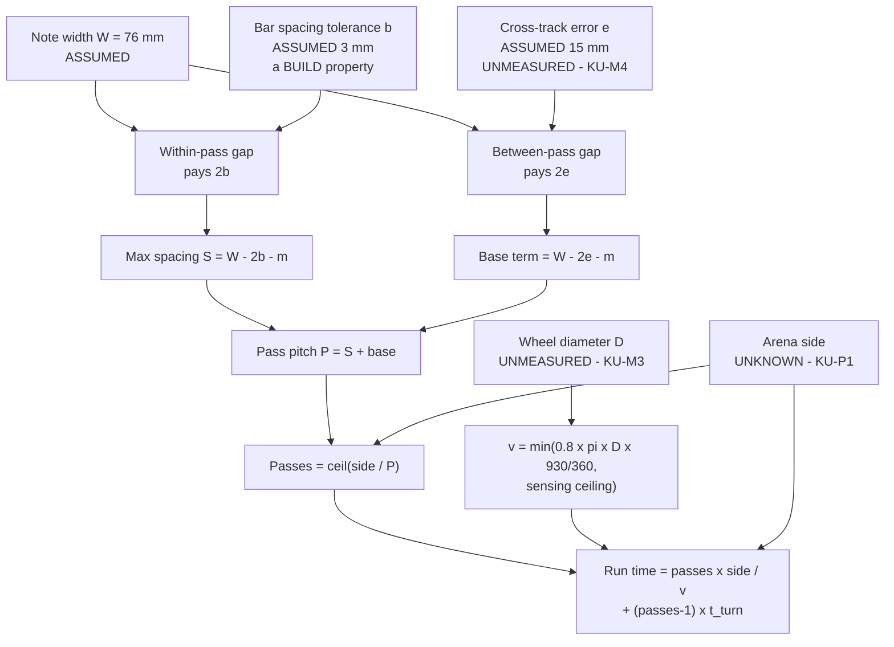

# Finding — Coverage time budget, with TWO colour sensors

**Created:** 2026-08-25 · **Rewritten:** 2026-09-01 · **Type:** analysis (arithmetic; two MEASURED
inputs, everything else `[ASSUMED]`) · **Status:** open — still gated on one answer from the professor
**Reproduce:** [`./scripts/coverage-budget.py`](../../scripts/coverage-budget.py) (`--turn 1.5` for the
optimistic turn overhead). Every table below is that script's output; edit its `PARAMS` block, not a
spreadsheet.

> **The 2026-08-25 version of this file computed a ONE-sensor budget.** We own **two** colour sensors —
> read off the hub itself. Its numbers are superseded and kept at the bottom rather than deleted.

---

## The claim

**A second colour sensor is worth more than a factor of two, and the size of the win is the Designer's
to choose.** Two sensors on one rigid cross-member, spaced as widely as the build tolerance allows,
multiply the effective pass pitch by **2.59×**, not 2×. At 10 feet that is **75 passes and 229 m of
driving reduced to 29 passes and 88 m.**

**But the run time is still not a number, because nobody has measured the wheel.** Motor speed is
MEASURED (930 deg/s, from the hub); ground speed is not, and

```
v [mm/s] = π × D [mm] × ω [deg/s] / 360
```

is not solvable without `D`. So the honest answer is a **formula plus a table over the three candidate
wheels**, and at 10 feet with two sensors that table spans **4.0 to 10.9 minutes** — a 2.7× spread
caused by nothing but not having put a ruler across a tyre.

**What flips:** with two sensors, presence-only detection and Ø88 wheels, the **10-foot arena comes in
under 5 minutes (4.0 min) for the first time**, as does 10 × 30 cm tiles (3.9 min). On Ø56 the same case
lands at **5.5 min — 0.5 min over**, and closing that gap depends entirely on `t_turn`, which is
`[ASSUMED]`. Ø24 wheels miss under every configuration. **Under colour classification, no 3 m arena
reaches 5 minutes at any wheel size.**

**"10×10" is still the whole ballgame** ([../scope.md § Mission](../scope.md#mission--partial-verbal-briefing-captured-2026-08-25),
Q1 in [../plans/questions-for-the-professor.md](../plans/questions-for-the-professor.md)). Two sensors
change the answer from *"the design must change"* to *"the design might just fit"* — they do not make
the question optional.

---

## What changed since 2026-08-25

| | 2026-08-25 assumed | Now | Kind |
|---|---|---|---|
| Colour sensors | **one**, and it was a pending purchase | **two**, on ports C and D, `device.id()` = **61** on both | **MEASURED** on the hub over USB, 2026-08-27 |
| Motors | type unknown; `DRIVE_MAX_DPS` a conservative 660 deg/s | `motor.info(port.A)` → `(device_id=48, max_speed=930)` on A **and** B | **MEASURED** — supersedes the guess |
| Wheel diameter | `[ASSUMED]` Ø56 | **still `[ASSUMED]`, still Ø24 / Ø56 / Ø88** | unmeasured, and it is now the largest single source of spread |
| Lane pitch convention | 46 mm (`W − 2e`) | **41 mm** (`W − 2e − margin`) — reconciled to [`src/config.py`](../../src/config.py) | see [§ Pitch convention](#pitch-convention-settled) |

**Do not quote LEGO's datasheet figure of 1110 deg/s for a Medium Angular 45603.** The hub reports 930
for the motor actually attached, and where the hardware and the datasheet disagree the hardware wins
([say-which-kind-of-verified.md](../lessons_learned/say-which-kind-of-verified.md)). 930 deg/s is also
what the SPIKE 3 API will *accept* as a velocity command, which is the number that matters — commanding
above it does nothing.

**Two ports remain free.** A/B motors, C/D colour, **E and F empty** — so the two-sensor build does not
foreclose a distance sensor for the boundary (Q3) *or* a force bumper. That was a real cost in the
three-sensor option of the trade study and it does not apply here.

⚠ **Two housekeeping consequences this finding does not own but must flag:**

1. [../hardware/port-map.md](../hardware/port-map.md) currently records **all six ports EMPTY on
   2026-08-27**. The new reading is from the same date. Both cannot stand as written; whoever records
   the populated map must **supersede** that row rather than leave two contradictory entries.
2. [`inventory.py`](../../inventory.py) shows **no colour sensor bought** and a 56 SB balance. Two
   sensors are physically on the hub. Either they came out of the yellow box (which answers **KU-T4**
   *yes*, they cost 0 SB, and the trade study's whole purchasing argument is moot) or they were bought
   and the ledger is stale. **The Supplier answers this; it is not guessable and no price is invented
   here.**

---

## The geometry — why two sensors beat 2×

A downward colour sensor traces a **line**, not a swath. That has not changed. What changes with two of
them is *which* errors apply to *which* gap.

Write `W` for the note width (76 mm `[ASSUMED]`), `e` for the robot's one-sided cross-track error
(15 mm `[ASSUMED]`), `m` for the deliberate overlap margin (5 mm, `LANE_OVERLAP_MM`), `S` for the
lateral spacing between the two sensors, and `P` for the pass pitch — how far sideways the robot steps
between successive traverses.

Over a whole run the sensing lines fall into two kinds of gap, and **they do not carry the same error**:

- **Between passes** (gap `P − S`): the two lines belong to different traverses, minutes apart, across a
  turn. Their lateral errors are independent, so the worst-case real gap is `P − S + 2e`. Requiring that
  a 76 mm note cannot fall inside it gives `P − S ≤ W − 2e − m`.
- **Between the two sensors within one pass** (gap `S`): both lines ride the **same bar** and drift
  together. A cross-track error translates the pair; it does not open the gap between them. What opens
  that gap is **build tolerance** — bar flex, mounting slop — call it `b`, and it is a Designer/Builder
  property, not an odometry one. So `S ≤ W − 2b − m`.

Putting them together:

```
P(S) = S + (W − 2e − m)          the pass pitch, for any spacing S
S    ≤ W − 2b − m                the constraint on how wide the bar may be
```

The single-sensor pitch is the same expression at `S = 0`. **So a second sensor adds its own spacing
directly to the pitch, and that added term is charged the build tolerance `b` instead of the odometry
error `e`.** Since `b` (a few mm on a braced cross-member) is much smaller than `e` (15 mm assumed, and
the thing nobody has measured), the second line is *cheaper* than the first — which is exactly why the
gain exceeds 2×.



**Three claims this rests on, stated so they can be attacked:**

- *A cross-track error translates both sensors equally.* It does, to the extent the error is a lateral
  translation of the chassis. A **heading** error `θ` shrinks the effective spacing by `S(1 − cos θ)` —
  0.25 mm at 5° on a 65 mm bar, negligible — but it also puts one sensor **5.7 mm ahead of the other
  along-track** at that angle, which the cross-sensor de-duplication must tolerate. It is a software
  tolerance, not a coverage loss.
- *The bar is rigid.* If it is not, `b` grows and `S` must shrink, and the gain collapses toward 2× and
  below. [The trade study §6.2](../plans/2026-08-25-coverage-strategy-trade-study.md) already called bar
  rigidity "the hidden requirement"; this analysis makes it quantitative — see the last column of the
  table below.
- *Wider spacing does not cost detection quality.* It does not. The worst-case lateral offset from a
  sensing line is half the largest gap, and by construction **both** gap types are capped at `W`, so the
  worst offset is `W/2` in the one-sensor and the two-sensor layouts alike. The worst guaranteed chord —
  and therefore the ~195 mm/s classification speed ceiling of
  [the trade study §7.1](../plans/2026-08-25-coverage-strategy-trade-study.md) — is **unchanged by
  adding a sensor. Two sensors buy lanes, not speed.**

### The Designer's actual decision

`S` is **not decided**, and it is the Designer's, not the Programmer's. It trades run time against how
accurately the mount has to hold the two sensors apart:

| Spacing `S` | Pass pitch `P` | Gain vs 1 sensor | Passes at 10 ft | Path | Spacing tolerance the build may have |
|---:|---:|---:|---:|---:|---:|
| 0 mm (co-located) | 41 mm | **1.00×** | 75 | 229 m | ±35.5 mm |
| 20 mm | 61 mm | 1.49× | 50 | 152 m | ±25.5 mm |
| **41 mm** (= lane pitch) | 82 mm | **2.00×** | 38 | 116 m | ±15.0 mm |
| 60 mm | 101 mm | 2.46× | 31 | 95 m | ±5.5 mm |
| **65 mm** | **106 mm** | **2.59×** | **29** | **88 m** | **±3.0 mm** |
| 70 mm | 111 mm | 2.71× | 28 | 85 m | ±0.5 mm |
| > 71 mm | — | — | — | — | **coverage guarantee breaks** |

Read the last column as the requirement it is: **at 65 mm spacing the two sensors must sit 65 ± 3 mm
apart on the built robot, measured, not intended.** At 70 mm the tolerance is half a millimetre, which
no LEGO build holds — that row is in the table to show where the cliff is, not as a recommendation.

**Recommendation to the Designer: 60–65 mm, on a short braced cross-member, and measure the built
spacing rather than assuming it.** That captures 95 % of the available gain at a tolerance a LEGO
structure can actually meet. All tables below use **65 mm**.

Two side notes that fall out of this:

- **The trade study's `swath = N × L` model gave exactly 2.00×.** It is right for one particular
  spacing — `S` equal to the lane pitch — and that spacing is *not* the optimum. This supersedes it.
- **Packaging gets easier, not harder.** [Trade study §6.2](../plans/2026-08-25-coverage-strategy-trade-study.md)
  worried that the 45605 housing might be wider than a 46 mm spacing and force a fore-and-aft stagger.
  The two-sensor optimum wants them **65 mm apart**, so the housings are unlikely to collide at all.
  (Fore-and-aft stagger remains free if needed: it changes nothing lateral.)

<a id="pitch-convention-settled"></a>
### Pitch convention — settled

The trade study flagged an unreconciled discrepancy: it used `W − 2e` = 46 mm, while
[`src/config.py`](../../src/config.py) subtracts a further 5 mm `LANE_OVERLAP_MM` for 41 mm.
**Settled here in favour of `config.py`: 41 mm.** The margin is a deliberate safety allowance, the code
already implements it, and a document that quotes a pitch the robot will not drive is worse than a
slightly pessimistic one. Consequence: **every single-sensor time in this file is ~12 % worse than the
2026-08-25 version**, and that is a correction, not a regression.

---

## Speed — the part that is honestly unknown

**MEASURED:** the hub reports `max_speed = 930` deg/s for the motors on ports A and B. That is a
*rotational* ceiling and it is also the largest velocity the SPIKE 3 API will accept.

**NOT MEASURED:** the wheel. Nobody has looked at the two wheels on the ledger
([KU-M3](../plans/known-unknowns.md)). Three candidates exist in the LEGO sets —
Ø24, Ø56, Ø88 ([../research/speed-envelope.md](../research/speed-envelope.md)) — and they differ by
**3.7×** in ground speed for the same motor command. **Anyone who quotes a single mm/s figure right now
is quoting an assumption.**

```
v_command_ceiling(D) = π × D × 930 / 360        mm/s
v_sweep(D)           = 0.80 × v_command_ceiling(D)      [ASSUMED derate, see below]
v_actual(D)          = min( v_sweep(D), sensing ceiling )
```

The 0.80 is `[ASSUMED]` and it is not a torque derate. Steady rolling on carpet barely loads these
motors ([speed-envelope](../research/speed-envelope.md)). It is **command authority**: the heading-hold
loop works by adding velocity to one wheel and subtracting from the other, and the API clamps at 930, so
sweeping at the ceiling leaves the loop nothing to add on the outer wheel and it saturates one-sided.
20 % reserve is a judgement, not a measurement — and where it binds, the 90 % row is shown.

| Wheel Ø **(UNMEASURED)** | Command ceiling | Sweep at 80 % | Presence-only cap | Classification cap |
|---|---:|---:|---:|---:|
| **Ø24** | 195 mm/s | 156 mm/s | **156** (motor-bound) | **156** (motor-bound) |
| **Ø56** | 454 mm/s | 364 mm/s | **364** (motor-bound) | **195** (sensing-bound) |
| **Ø88** | 714 mm/s | 571 mm/s | **571** (motor-bound) | **195** (sensing-bound) |

Sensing ceilings: **195 mm/s** with colour classification (worst guaranteed chord 31.5 mm — trade study
§7.1) and **650 mm/s** presence-only (`[ASSUMED]` 3 pure samples at a 100 Hz loop; **the loop rate is
unmeasured** — [KU-M5](../plans/known-unknowns.md), and the IMU alone already eats 1.35 ms of a 10 ms
budget, [imu-characterisation-2026-08-27.md](./imu-characterisation-2026-08-27.md)).

**A result worth keeping:** at 930 deg/s, **presence-only sweeping is motor-limited at every candidate
wheel** — the sensor is never the thing holding us back. Classification is sensing-limited at Ø56 and
Ø88, and motor-limited at Ø24. So *"can we go faster?"* is a question about the drivetrain, not the
detector, unless we are classifying.

---

## Run time, redone

`passes = ⌈side ÷ P⌉` · `path = passes × side` · `t = path ÷ v + (passes − 1) × t_turn`.
`t_turn` = **3.0 s** `[ASSUMED]` (the trade study's honest figure; 1.5 s is its optimistic one and is
noted where it changes a verdict). Each cell is **1 sensor / 2 sensors at S = 65 mm**, in **minutes**.

### Presence-only detection

| If "10×10" means | Side | Ø24: 1 / 2 | Ø56: 1 / 2 | Ø88: 1 / 2 |
|---|---:|---:|---:|---:|
| 10 inches | 0.25 m | 0.5 / 0.2 | 0.4 / 0.1 | 0.4 / 0.1 |
| 10 × 76 mm cells | 0.76 m | 2.4 / 1.0 | 1.6 / 0.6 | 1.3 / 0.5 |
| 10 × 6 in tiles `[ASSUMED reading]` | 1.52 m | 8.0 / **3.1** | 4.5 / 1.7 | 3.5 / 1.4 |
| 10 × 30 cm tiles | 3.00 m | 27.4 / 10.7 | 13.8 / 5.4 | 10.1 / **3.9** |
| **10 feet** | 3.05 m | 28.2 / 10.9 | 14.2 / **5.5** | 10.4 / **4.0** |
| 10 metres | 10.0 m | 273 / 106 | 124 / 48 | 83 / 32 |

### With colour classification

| If "10×10" means | Side | Ø24: 1 / 2 | Ø56: 1 / 2 | Ø88: 1 / 2 |
|---|---:|---:|---:|---:|
| 10 inches | 0.25 m | 0.5 / 0.2 | 0.5 / 0.2 | 0.5 / 0.2 |
| 10 × 76 mm cells | 0.76 m | 2.4 / 1.0 | 2.1 / 0.9 | 2.1 / 0.9 |
| 10 × 6 in tiles `[ASSUMED reading]` | 1.52 m | 8.0 / **3.1** | 6.8 / **2.7** | 6.8 / **2.7** |
| 10 × 30 cm tiles | 3.00 m | 27.4 / 10.7 | 22.6 / 8.8 | 22.6 / 8.8 |
| **10 feet** | 3.05 m | 28.2 / 10.9 | 23.2 / 9.0 | 23.2 / 9.0 |
| 10 metres | 10.0 m | 273 / 106 | 221 / 86 | 221 / 86 |

### Which cells become feasible that were not

Against a **5-minute** gate — the shortest plausible demo slot the trade study models. **Bold = the
second sensor is what flipped it.**

| Arena | Detection | Wheel | 1 sensor | 2 sensors | Verdict |
|---|---|---|---:|---:|---|
| 10 × 6 in tiles | presence | Ø24 | 8.0 | **3.1** | **FLIPS** |
| 10 × 6 in tiles | classify | Ø24 | 8.0 | **3.1** | **FLIPS** |
| 10 × 6 in tiles | classify | Ø56 / Ø88 | 6.8 | **2.7** | **FLIPS** |
| 10 × 30 cm tiles | presence | Ø88 | 10.1 | **3.9** | **FLIPS** |
| **10 feet** | presence | **Ø88** | 10.4 | **4.0** | **FLIPS — the headline** |
| 10 feet | presence | Ø56 | 14.2 | 5.5 | **still over, by 0.5 min** — see below |
| 10 feet | presence | Ø24 | 28.2 | 10.9 | no |
| 10 feet / 10 × 30 cm | classify | any | 22.6–28.2 | 8.8–10.9 | **no. Classification does not reach 5 min at 3 m under any configuration we can build** |
| 10 metres | either | any | 83–273 | 32–106 | no, and nothing rescues it |

**The Ø56 boundary cell is the one to understand, because it is the most likely wheel.** At 10 ft,
presence-only, two sensors at 65 mm, the required traverse speed to hit exactly 5:00 is **409 mm/s** —
which is **90.0 % of the Ø56 command ceiling**, against the 80 % reserve assumed above. So the verdict is
not "no", it is:

| What has to be true for 10 ft + 5 min + Ø56 to work | Status |
|---|---|
| `t_turn` = 1.5 s rather than 3.0 s → 4.75 min at the 80 % derate | **`[ASSUMED]` — measure it (trade study §11 item 5)** |
| or: the heading loop is happy with 10 % one-sided authority → 5.00 min exactly | **`[ASSUMED]` — a bench question** |
| or: `e` measures better than 15 mm → 5.07 min at e=10, 4.69 at e=5 | **`[ASSUMED]` — UMBmark run, KU-M4** |
| or: the wheels turn out to be Ø88 | **UNMEASURED — a ruler settles it today** |

Any one of the four closes it. **That is a completely different position from 2026-08-25**, when the
same cell needed a 2003 mm/s traverse and was refuted at any speed.

**A 3-minute gate at 10 ft is still refuted.** Two sensors at 65 mm need **921 mm/s** (`t_turn` = 3.0 s)
or **641 mm/s** (1.5 s). The best case, Ø88, has a 714 mm/s command ceiling — so a 3-minute slot needs
the largest wheels, the optimistic turn figure, and 90 % of the motor with no heading authority left.
Do not plan on it.

---

## The quieter win: two sensors de-risk the unmeasured cross-track error

This is the result that does not show up in a headline time, and it may matter more.

The `S` term of the pass pitch is charged build tolerance, not odometry error. So as `e` gets worse, a
two-sensor sweep degrades far more gently than a one-sensor sweep. 10 ft, presence-only, Ø56,
`t_turn` = 3.0 s:

| Cross-track error `e` | 1 sensor: pitch → time | 2 sensors: pitch → time |
|---|---|---|
| 5 mm | 61 mm → 9.4 min | 126 mm → 4.7 min |
| 10 mm | 51 mm → 11.3 min | 116 mm → 5.1 min |
| **15 mm `[ASSUMED]`** | **41 mm → 14.2 min** | **106 mm → 5.5 min** |
| 20 mm | 31 mm → 18.7 min | 96 mm → 6.0 min |
| 25 mm | 21 mm → 27.7 min | 86 mm → 6.8 min |

**`e` doubling from 15 to 25 mm costs the single-sensor design 95 % more run time and the two-sensor
design 24 %.** And the structural point: as `e` approaches `W/2` = 38 mm the single-sensor lane pitch
goes to **zero** — `config.lane_pitch_mm()` raises rather than returns, correctly, because no pitch
guarantees coverage any more. With two sensors the pitch never falls below `S` = 65 mm. **One sensor has
a cliff; two sensors have a slope.**

Since `e` is unmeasured and the thing most likely to come back worse than assumed
([R-02](../plans/risk-register.md)), buying insensitivity to it is worth more than the minutes.

---

## What one measurement collapses

The table above is wide because three inputs are unknown. They are not equally expensive to close:

| Unknown | What closes it | Cost | What it deletes |
|---|---|---|---|
| **Wheel diameter** ([KU-M3](../plans/known-unknowns.md)) | A ruler across the tyre; then one rolling revolution under load for the *effective* diameter | **Seconds. No hub, no purchase, no class time.** | **Two of the three column-pairs in every table.** At 10 ft, 2 sensors, presence-only, it collapses 4.0–10.9 min to a single number |
| **Sensor spacing `S`** | The Designer picks it; the Builder builds it; someone **measures the built spacing** | One design decision | Fixes the 1.00×–2.71× gain to one row |
| **Cross-track error `e`** ([KU-M4](../plans/known-unknowns.md)) | UMBmark square-path run on the demo floor | One bench session, needs the robot driving | The `e` sensitivity table |
| **`t_turn`** | Time one full square-turn-advance-turn cycle | Same session | The 3.0 / 1.5 s fork, which is 0.7 min at 10 ft with 2 sensors |
| **Arena units** ([KU-P1](../plans/known-unknowns.md)) | **Ask the professor** | Free, and still unasked | Five of the six rows |

**Ranked by value per minute spent, the wheel measurement is first and it needs nobody's permission.**
It is the only item on this list that can be closed before the next sentence of this document is read.

---

## What is measured vs assumed

| Input | Value | Status |
|---|---|---|
| Motor velocity ceiling | 930 deg/s, both drive motors | **MEASURED** on our hub over USB, 2026-08-27 (`motor.info`) |
| Number of colour sensors | 2, ports C and D, `device.id()` = 61 | **MEASURED** on our hub over USB, 2026-08-27 |
| Motor identity | `device_id` 48 on both — **consistent with** Medium Angular 45603 | **MEASURED** id; the id→part mapping is community-sourced and UNVERIFIED ([speed-envelope](../research/speed-envelope.md)). It agrees with the operator's report, so [KU-T3](../plans/known-unknowns.md) is corroborated, not re-opened |
| **Wheel diameter `D`** | Ø24 / Ø56 / Ø88 | **UNMEASURED.** The single largest source of spread in this document |
| Note width `W` | 76 mm | **`[ASSUMED]`** standard 3 in note; the real pack has not been seen |
| Cross-track error `e` | 15 mm | **`[ASSUMED]`**, flagged optimistic. UMBmark run required |
| Bar spacing tolerance `b` | 3 mm | **`[ASSUMED]`.** A *build* property — measure it on the built robot, do not infer it |
| Sensor spacing `S` | 65 mm in all tables | **NOT DECIDED.** The Designer's call; every table scales with it |
| Overlap margin `m` | 5 mm | `config.LANE_OVERLAP_MM`, a deliberate choice |
| `t_turn` | 3.0 s (1.5 s optimistic) | **`[ASSUMED]`.** Nothing in this project has timed a turn |
| Heading-authority derate | 0.80 | **`[ASSUMED]`.** A judgement about control headroom, not a measurement |
| Presence-only sensing cap | 650 mm/s | **`[ASSUMED]`** 3 pure samples at 100 Hz; the **loop** rate is unmeasured (KU-M5) |
| Classification sensing cap | 195 mm/s | Derived geometry (trade study §7.1) over `[ASSUMED]` `W` and `D_spot` |
| Arena side | six candidate readings | **UNKNOWN — KU-P1, the top blocker** |
| Turn overhead, accel ramps, battery sag | — | Turns are counted; **acceleration ramps and battery sag are not.** All times are optimistic by that amount |

Per [../directives/honest-instrumentation.md](../directives/honest-instrumentation.md): nothing in this
file is a robot measurement. It is arithmetic, and every conclusion inherits the status of its inputs.

---

## What follows

1. **Measure the wheels. Today. It is free and it deletes two thirds of this document.** Builder, with a
   ruler; then one rolling revolution under load for the effective diameter.
2. **Ask Q1 (units) and Q2 (time limit + scoring), still unanswered, still first.** Two sensors widen
   the set of answers we can survive; they do not tell us which answer we got.
3. **Designer: settle `S` at 60–65 mm on a braced cross-member**, and specify that the built spacing is
   *measured and recorded*, not assumed. This is now the highest-leverage design decision in the sweep,
   and it is worth 2.59× against 2.00× for choosing well.
4. **Supplier: say where the two colour sensors came from.** Yellow box (KU-T4 answered, 0 SB) or bought
   (ledger stale)? It changes the remaining budget and the whole third-sensor question.
5. **Do not buy a third colour sensor yet.** With `S` = 65 mm the second sensor already delivers 2.59×.
   A third would add roughly another `S` to the pitch — worth re-costing *after* the wheel and `e` are
   measured, and it would fill the hub, foreclosing the boundary sensor. Two sensors plus two free ports
   is a better position than three sensors and none.
6. **Programmer: `N_SENSORS` and `SENSOR_SPACING_MM` belong in [`src/config.py`](../../src/config.py)**,
   with the detector instantiated per sensor and the pitch computed from `S`, not hard-coded. The
   cross-sensor coincidence test is the easy half of de-duplication — see trade study §7.2 — but it must
   tolerate the along-track offset a heading error introduces.

---

## Superseded — the 2026-08-25 single-sensor analysis

Kept because the report's methodology section needs the arithmetic that was overturned and why.

The original claim: with **one** downward colour sensor, a 10-foot arena needs **125–204 m** of sweeping
at a lane pitch of 76 mm (no cross-track allowance) down to 46 mm (15 mm allowance), giving **8–23
minutes** at an `[ASSUMED]` 150–250 mm/s. Its conclusion — *"if it is 10 ft the design has to change,
not the tuning"* — was **correct, and the design did change**: to two sensors.

Three of its numbers are superseded and should not be re-quoted:

| Superseded | Replaced by | Why |
|---|---|---|
| Lane pitch 46 mm (`W − 2e`) | **41 mm** (`W − 2e − m`) | Reconciled to `config.py`; the trade study flagged the discrepancy and left it open |
| 150–250 mm/s speed bracket | **`min(0.8 · π·D·930/360, sensing cap)`** | The bracket was invented before any hardware figure existed. 930 deg/s is now measured; the bracket's endpoints were not derived from anything |
| 125–204 m at 10 ft | **229 m** (1 sensor, 41 mm pitch) or **88 m** (2 sensors, 106 mm pitch) | Pitch convention, and the sensor count |

Its two structural results **survive intact** and are still the reason this file exists: a point sensor
traces a line rather than a swath, and the units of "10×10" swing the answer by two orders of magnitude.

The colour-classification update of 2026-08-25 also survives, in a sharpened form: classification caps
traverse speed (~195 mm/s), and **a second sensor does not raise that cap** — so Q5 remains a run-time
question and not only a robustness one. Under classification, no 3 m arena reaches 5 minutes at any
wheel size or sensor count we can build.

---

## Revision History

| Date | Change | By |
|---|---|---|
| 2026-08-25 | Created. Single-sensor path length and time across the Q1 units table. | Claude |
| 2026-08-25 | Update appended: colour classification caps traverse speed, so Q5 is a run-time question too. | Claude |
| 2026-09-01 | **Rewritten for TWO colour sensors** (MEASURED on ports C and D) and a **MEASURED 930 deg/s** motor ceiling. Derived the two-sensor pass pitch `P = S + W − 2e − m` and showed the gain is **2.59×**, not 2×, because the within-pass gap is charged build tolerance rather than odometry error — and that it therefore depends on a spacing `S` the Designer has not chosen. Speed carried as a formula in the **unmeasured** wheel diameter with a table over Ø24/Ø56/Ø88 rather than a single number. Settled the 41 vs 46 mm pitch convention in favour of `config.py`. Added the arena rows for metres. Flagged the port-map contradiction and the unrecorded sensors in the ledger. Arithmetic moved into [`scripts/coverage-budget.py`](../../scripts/coverage-budget.py). | Claude |
