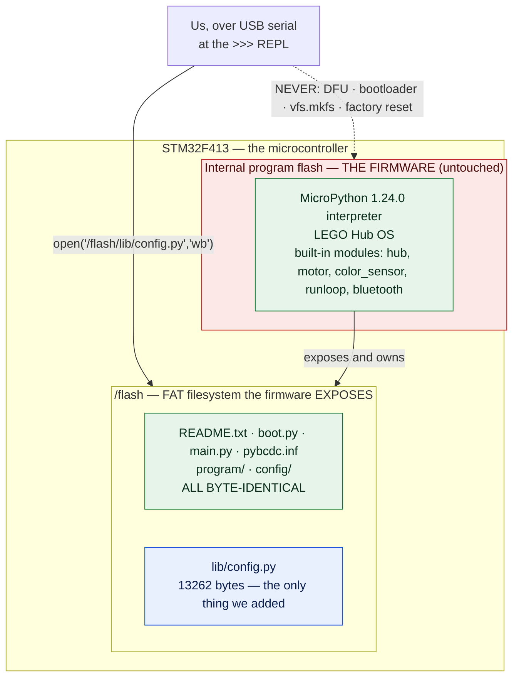
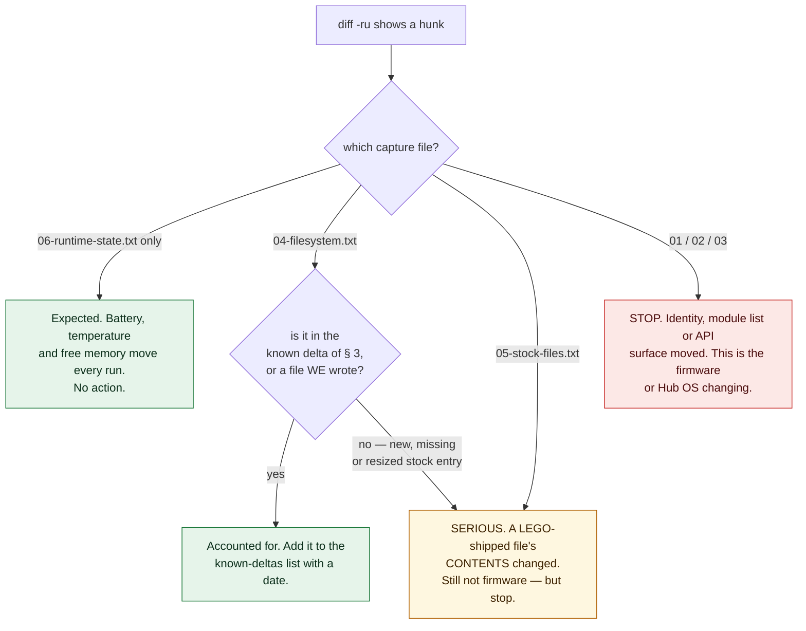

# Finding — Proof that the hub's firmware was never touched

**Date of evidence:** 2026-08-27 · **Hub connected:** yes, over USB on `/dev/spike`
· **Anything written to the hub:** **YES — exactly one file**, `/flash/lib/config.py`, 13262 bytes.
· **Firmware modified:** **NO**, and this document is the proof rather than the assertion.

> **These are measurements.** Every number below was read off our own hardware over the cable, or is
> arithmetic on numbers that were. Nothing here is a datasheet figure or an expectation. Where a
> statement is an inference from the numbers it is marked `[INFERRED]`; where it is untested it is
> marked `[UNVERIFIED]`.
> Vocabulary rule: [../lessons_learned/say-which-kind-of-verified.md](../lessons_learned/say-which-kind-of-verified.md).

**Why this document exists.** [ADR-0001](../decisions/0001-stock-lego-firmware-only.md) makes stock
LEGO firmware a permanent, non-negotiable constraint on shared course equipment. On 2026-08-27 we
wrote a file to the hub for the first time. "We wrote a file but the firmware is fine, trust us" is
not good enough for a shared hub or for the Intro Report. So: here is the before, the after, the
complete difference between them, and a walkthrough of every line of it.

---

## 1. The distinction that decides the whole question

Most readers — including most of this team — will not have this split loaded. It is the crux.

- **The firmware** is the MicroPython binary living in the **STM32F413's internal program flash**. It
  is the interpreter itself, LEGO's Hub OS, and the built-in modules (`hub`, `motor`, `color_sensor`,
  `runloop`, …). Replacing it is what Pybricks does, and it requires **DFU** — putting the chip into
  its bootloader and rewriting program memory. Our hub's is
  `MicroPython v1.20.0-1742.gf212bbe83 (2025-03-27), SPIKE Prime with STM32F413`.
- **`/flash`** is a **FAT filesystem that the firmware exposes to Python**. It holds `README.txt`,
  `boot.py`, `main.py`, `pybcdc.inf`, the `program/` and `config/` directories — and now `lib/`. It is
  reached with ordinary `open()` calls from the running interpreter.

**Writing a `.py` file into `/flash` is saving a document.** It is performed *by* the firmware, from
inside the interpreter the firmware provides. It cannot reach the firmware image, for the same reason
that saving a text file cannot rewrite your operating system's kernel — the write goes through the
thing you would have to modify.



The dotted red arrow is the path that would have changed the firmware. **It was never taken.**

---

## 2. What was actually written

One file, by [`hub_programmer/upload.py`](../../hub_programmer/upload.py), which is deliberately kept
out of `probes/` because everything in `probes/` is read-only:

```
hub_programmer/upload.py src/config.py --apply
```

| | |
|---|---|
| Destination | `/flash/lib/config.py` (`/flash/lib` did not exist; the uploader created it) |
| Size | **13262 bytes**, sent as **70 base64 chunks** over the REPL |
| Transfer time | **3.6 s** (≈3.7 kB/s — *computed* from those two figures) |
| Verification | **SHA-256 computed ON THE HUB** equalled the local file's: `05a3efefd08b3c9987947baeefc517548201723ca81747c8f9d5d012ca17828a` |
| Import check | `probes/import_check.py` → `OK config`; free memory after import **210528 bytes** |

Two cross-checks done on the host today, read-only, with no hub involved:

- `sha256sum src/config.py` in the working tree still returns `05a3efef…828a` at 13262 bytes —
  the hash the hub computed is the hash of the file we actually have.
- `upload.py` sets `CHUNK = 192` raw bytes per REPL line; `ceil(13262 / 192) = 70`, which is the chunk
  count reported. The mechanics are internally consistent.

`/flash/lib` was **already on `sys.path`** before we existed —
`sys.path = ['', '.frozen', '/flash', '/flash/lib']` in
[`01-identity.txt`](../archives/hub-baseline/01-identity.txt). We did not add a path, patch a search
rule, or modify `boot.py` to make the import work. We put a file where the stock firmware was already
looking.

Deploy mechanics in full: [../runbooks/upload-to-hub.md](../runbooks/upload-to-hub.md).

---

## 3. The evidence — the complete before/after diff

Before anything was written, [`probes/capture_baseline.py`](../../probes/capture_baseline.py) captured
six files into [`docs/archives/hub-baseline/`](../archives/hub-baseline/INDEX.md): identity, module
list, API surface, filesystem, stock file contents, runtime state. **After** the upload, the same
capture was re-run to a temp directory and diffed against the baseline.

This is the **complete** diff. Not an excerpt — every differing line the two captures produced:

```
- ['README.txt','boot.py','config','main.py','program','pybcdc.inf']
+ ['README.txt','boot.py','config','lib','main.py','program','pybcdc.inf']
- [('README.txt',528),('boot.py',196),('config',196),('main.py',34),('program',34),('pybcdc.inf',2597)]
+ [('README.txt',528),('boot.py',196),('config',196),('lib',196),('main.py',34),('program',34),('pybcdc.inf',2597)]
- statvfs free blocks 7923
+ statvfs free blocks 7915
- battery 7942 mV,  temperature 247
+ battery 8001 mV,  temperature 251
```

Four changed lines, in **two** of the six capture files. The other four capture files —
`01-identity.txt`, `02-modules.txt`, `03-api-surface.txt`, `05-stock-files.txt` — produced **no diff
at all**.

---

## 4. Walking every line of it

### Lines 1–2 — a `lib` directory appeared in the `/flash` listing

```
- ['README.txt','boot.py','config','main.py','program','pybcdc.inf']
+ ['README.txt','boot.py','config','lib','main.py','program','pybcdc.inf']
```

`lib` is inserted; **nothing is removed and nothing is renamed**. The five stock entries are the same
five entries in the same order. This is the directory the uploader created to hold `config.py`.

Note what is *not* here: no change to `main.py`, no change to `boot.py`, no new entry under
`program/`. We did not take over the hub's startup path.

### Lines 3–4 — the size table gains one row

```
- [('README.txt',528),('boot.py',196),('config',196),('main.py',34),('program',34),('pybcdc.inf',2597)]
+ [('README.txt',528),('boot.py',196),('config',196),('lib',196),('main.py',34),('program',34),('pybcdc.inf',2597)]
```

**Every stock size is byte-for-byte identical**: `README.txt` 528, `boot.py` 196, `main.py` 34,
`pybcdc.inf` 2597, and the `config` and `program` directories at 196 and 34. The single new row is
`('lib', 196)`.

`lib` reports **196**, the same size the pre-existing `config` directory reports. `[INFERRED]` 196 is
what this FAT reports for a directory entry, not a file length — `lib` contains a 13262-byte file, so
196 cannot be its contents. The stock `config` directory reporting exactly the same number supports
that reading.

`main.py` is still **34 bytes** — the same 34 bytes recorded verbatim in
[`05-stock-files.txt`](../archives/hub-baseline/05-stock-files.txt), which produced no diff. Had we
overwritten the hub's program entry point, this is the line that would have shown it.

### Line 5–6 — eight filesystem blocks were consumed

```
- statvfs free blocks 7923
+ statvfs free blocks 7915
```

From the baseline capture, `os.statvfs('/flash')` returned
`(4096, 4096, 7936, 7923, 7923, 0, 0, 0, 0, 255)` — **block size 4096 bytes**, 7936 blocks total.

| | Blocks | Bytes |
|---|---|---|
| Free before | 7923 | 32,452,608 (~32.45 MB) |
| Free after | 7915 | 32,419,840 (~32.42 MB) |
| **Consumed** | **8** | **32,768 (32 KB exactly)** |

**Why 8 blocks for a 13262-byte file?** Partly arithmetic, partly not, and the honest answer says so:

- A 13262-byte file cannot occupy 13262 bytes on a block-allocated filesystem. It rounds up to
  `ceil(13262 / 4096) = 4` blocks (16,384 bytes). **4 blocks accounted.**
- The new `lib` directory is itself an allocation. `[INFERRED]` at least 1 block. **5 accounted.**
- **3 blocks (12,288 bytes) are not accounted for by that arithmetic.** `[UNVERIFIED]` — candidate
  explanations are a FAT allocation unit larger than one 4096-byte block, or additional directory /
  metadata allocation. We did not probe the cluster geometry, so we do not know which, and we are not
  going to guess it into the record. **Do not quote "32 KB" as the storage cost of a 13 KB file
  without this caveat.**

What the 8 blocks *do* settle: the consumption is trivially small — **32 KB out of ~32.45 MB free, on
the order of 0.1%**. Storage headroom is not a constraint on this project. And critically, the number
moved in the direction and rough magnitude a single small file write predicts. A firmware operation
would not look like this; a `vfs.mkfs` would have reset free blocks toward 7936 and emptied the
listing.

### Line 7–8 — battery and temperature drifted

```
- battery 7942 mV,  temperature 247
+ battery 8001 mV,  temperature 251
```

**These two are expected to differ on every single capture and mean nothing on their own** — that is
why `capture_baseline.py` isolates them into `06-runtime-state.txt`, whose own header says so.

- **Battery 7942 → 8001 mV, +59 mV.** The hub was **plugged into USB the entire session and therefore
  charging**. The baseline capture also recorded `battery_current = 66` mA. A pack voltage rising by
  tens of millivolts over a session on the charger is charging, not a fault.
- **Temperature 247 → 251, +4.** `[INFERRED]` deci-degrees Celsius, i.e. **24.7 °C → 25.1 °C** — the
  same inference already carried in
  [hub-first-contact-2026-08-27.md](./hub-first-contact-2026-08-27.md) § 1. A 0.4 °C rise in a
  microcontroller that has been powered, charging, and running a REPL for a working session is
  ordinary self-heating.

Neither line is a state change we caused by writing. Both are the hardware being warm and plugged in.

---

## 5. The four capture files that did not change at all

This is the part that carries the proof, and it is easy to skim past because it is an *absence*.

| Capture file | What it pins | Diff |
|---|---|---|
| [01-identity.txt](../archives/hub-baseline/01-identity.txt) | `os.uname()`, `sys.implementation`, `device_uuid`, `hardware_id`, `machine.unique_id()`, `sys.path` | **none** |
| [02-modules.txt](../archives/hub-baseline/02-modules.txt) | the complete `help('modules')` list | **none** |
| [03-api-surface.txt](../archives/hub-baseline/03-api-surface.txt) | `dir()` of `motor`, `motor_pair`, `runloop`, `color_sensor`, `device`, `hub.motion_sensor`, `bluetooth.BLE`, `machine`, `vfs` | **none** |
| [05-stock-files.txt](../archives/hub-baseline/05-stock-files.txt) | the verbatim contents of `README.txt`, `boot.py`, `main.py` | **none** |

**A firmware change shows up here or nowhere.** The firmware *is* the interpreter version, the module
list, and the API surface. If the MicroPython binary had been rewritten, `02-modules.txt` and
`03-api-surface.txt` would move — that is precisely why `capture_baseline.py` captures them. If a
factory reset or Hub OS update had run, `01-identity.txt`'s `release`/`version` strings would move.
They are unchanged, character for character:

```
release='1.24.0'   version='v1.20.0-1742.gf212bbe83 on 2025-03-27'
machine='SPIKE Prime with STM32F413'   sys.implementation._mpy=7942
```

And `05-stock-files.txt` being clean means the hub's own `boot.py` and `main.py` still say exactly
what LEGO shipped. We added a file next to them; we did not edit anything of LEGO's.

---

## 6. What was NOT done — the explicit list

Nothing in this session did any of the following. Each is listed by name so that this is a checkable
claim rather than a vague reassurance:

- **No DFU.** The chip was never put into device-firmware-update mode.
- **No bootloader.** `machine.bootloader()` was never called.
- **No `machine.reset()`.** The hub was not reset from software.
- **No `vfs.mkfs()`** and **no filesystem format** of any kind. (`vfs` was `dir()`-ed read-only during
  the API-surface capture; nothing on it was invoked.)
- **No factory reset.**
- **No "Hub update required" prompt accepted** — none was ever presented, because
- **No LEGO application was opened at any point.** Not the SPIKE App, not the web app, not Chrome
  WebSerial. Everything went over a plain serial REPL at 115200 8N1.
- **No third-party firmware.** Pybricks was not installed, downloaded, or run — see
  [ADR-0001](../decisions/0001-stock-lego-firmware-only.md).
- **`bluetooth.BLE()` was deliberately not instantiated.** It appears in the API surface, but bringing
  up the radio is a state change on shared equipment and an operator decision, not a probe's.

The only write operations of any kind were: create `/flash/lib`, and write one `.py` file into it.

---

## 7. The ongoing procedure — how to re-prove this at any time

The capture is a **re-runnable script**, not a screenshot, exactly so this check can be repeated
whenever anyone doubts the hub's state. It is read-only on the hub.

```bash
# 1. Capture the hub's CURRENT state to a scratch directory — never over the baseline.
python3 probes/capture_baseline.py --to /tmp/now

# 2. Diff it against the pristine baseline.
diff -ru docs/archives/hub-baseline /tmp/now
```

**Rules that make the diff meaningful, from
[docs/archives/hub-baseline/INDEX.md](../archives/hub-baseline/INDEX.md):**

- **Never edit the baseline `.txt` files by hand.** They are a record of what the hardware said.
- **Never re-capture over the baseline** after the hub has been modified. That destroys the only
  thing it exists for. Always `--to` somewhere else.
- **A diff in `06-runtime-state.txt` alone means nothing** — battery, temperature and free memory move
  every run by design.
- **Any hunk outside `06-runtime-state.txt` is a real change and needs an explanation.**

**The known, explained delta as of 2026-08-27** is exactly the four lines in § 3 above: the `lib`
entry in `04-filesystem.txt` (listing and size table), the 8-block `statvfs` drop, and the
battery/temperature lines in `06-runtime-state.txt`. A future diff that shows *only* those is this
session, already accounted for here. **Anything else is new.**

Requires the operator to have the hub connected — see
[../directives/hardware-safety.md](../directives/hardware-safety.md). Do not run this on your own
initiative.

---

## 8. If the diff is ever dirty — what a future reader does

Read the file the hunk is in. The severity is completely different per file, and treating them all
the same is how a real firmware change gets waved through as noise.



**If `01`, `02`, `03`, or `05` is dirty:**

1. **Stop. Do not run anything else against the hub**, and do not try to "put it back".
2. **Do not delete the temp capture.** It is now evidence. Move it somewhere dated and keep it.
3. **Tell the operator.** A Hub OS or firmware change is an operator decision recorded as an ADR
   ([ADR-0001](../decisions/0001-stock-lego-firmware-only.md)), never a side effect and never
   something an agent resolves alone.
4. **Do not re-baseline to make the diff clean.** If the change turns out to be legitimate, capture a
   **second, dated** baseline *alongside* this one and write the ADR — never overwrite.
5. If `05-stock-files.txt` shows `main.py` or `boot.py` changed, their pristine contents are recorded
   verbatim in that same baseline file. Restoring them is an operator action, not an automatic one.

---

## 9. What this proof does and does not cover

**It covers:** the hub's firmware, module list, API surface, identity, and every LEGO-shipped file in
`/flash`, as of the capture taken after the 2026-08-27 upload. All unchanged.

**It does not cover:**

- **`[UNVERIFIED]` The 3 unaccounted filesystem blocks** (§ 4). Small, harmless, unexplained.
- **`[UNVERIFIED]` Whether `/flash/main.py` autoruns at boot**, and whether the Hub OS pre-empts it.
  We proved a *module* imports from `/flash/lib`; we have not proved how a *program* launches. That
  is a separate open question, not something this document closes.
- **`[UNVERIFIED]` Anything after 2026-08-27.** This proof has a date on it. The procedure in § 7 is
  what makes it renewable; the document itself is not a standing guarantee.
- **The hub as physical equipment.** Nothing here says anything about wear, ports, or the battery's
  health beyond the two voltage readings above.

---

**Sources.** All measurements captured over USB on `/dev/spike`, 2026-08-27, by
[`probes/capture_baseline.py`](../../probes/capture_baseline.py) (read-only) and
[`hub_programmer/upload.py`](../../hub_programmer/upload.py) (the one write). Baseline captures:
[docs/archives/hub-baseline/](../archives/hub-baseline/INDEX.md). Constraint being upheld:
[ADR-0001 — Stock LEGO firmware only](../decisions/0001-stock-lego-firmware-only.md). Session context:
[hub-first-contact-2026-08-27.md](./hub-first-contact-2026-08-27.md). Deploy procedure:
[../runbooks/upload-to-hub.md](../runbooks/upload-to-hub.md).
