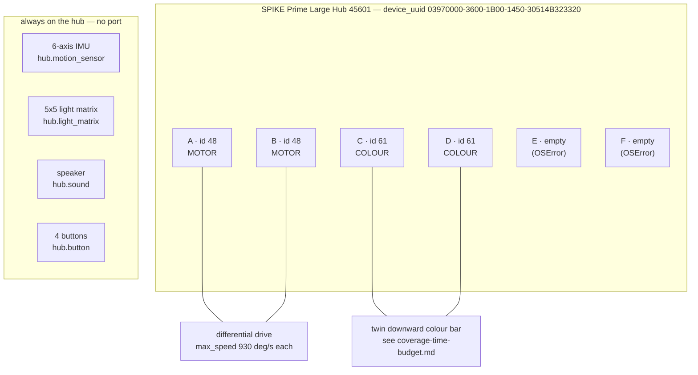

# Finding — Hub API surface, MEASURED for the robot AS BUILT

**Date:** 2026-09-01 · **Hub connected:** YES, over USB on `/dev/spike`, one window
· **Written to the hub:** NO — every line below is a `dir()`, a getter, or a device listing
· **Raw source:** [runs/harvest-20260901T101832.txt](./runs/harvest-20260901T101832.txt) — the hub's own words

> **Two kinds of fact live in this file, and they are labelled on every method.**
> **MEASURED** means a value was read off *our* hub in this window (or an earlier one, cited). It is
> the hub speaking. **API-only** means the method appeared in `dir()` but *the call was not run* —
> the signature and units below come from the SPIKE 3 API and are marked **[UNVERIFIED on our hub]**.
> This is the CLAUDE.md rule made concrete: *the API is known, but its call sites are still unrun —
> don't write mission code against a guessed call.* Vocabulary:
> [../lessons_learned/say-which-kind-of-verified.md](../lessons_learned/say-which-kind-of-verified.md).

This is the consolidated reference for the six devices the robot **actually has**. It supersedes the
scattered API notes in [hub-first-contact-2026-08-27.md](./hub-first-contact-2026-08-27.md) § 4c for
day-to-day use; that document remains the narrative of first contact. IMU units and timing are proven
in [imu-characterisation-2026-08-27.md](./imu-characterisation-2026-08-27.md) and only summarised here.

---

## 0. The robot as built — port map

Read off the hub this window. `device.id(port)` returns the LPF2 type id of what is plugged in;
`48` is a motor, `61` is a colour sensor. Ports E and F answered *empty* — `device.id()` raises
`OSError` there, which means **empty plug, not broken hub**.



| Port | `device.id()` | Device | Part no. | Live reading this window |
|---|---|---|---|---|
| **A** | `48` | Motor | Technic Medium Angular 45603 | `info` → `(device_id=48, max_speed=930)`; encoder abs −82, rel −82, vel 0, status 0 |
| **B** | `48` | Motor | Technic Medium Angular 45603 | `info` → `(device_id=48, max_speed=930)`; encoder abs −104, rel −104, vel 0, status 0 |
| **C** | `61` | Colour sensor | 45605 | `color` 10 (WHITE), `reflection` 55, `rgbi` (266, 249, 213, 568) |
| **D** | `61` | Colour sensor | 45605 | `color` 10 (WHITE), `reflection` 45, `rgbi` (214, 202, 177, 462) |
| **E** | — | *empty* | — | `device.id()` → `OSError` |
| **F** | — | *empty* | — | `device.id()` → `OSError` |

> **Port assignments still live in ONE place — [../hardware/port-map.md](../hardware/port-map.md)
> (scope TR-5)**, and `src/` reads them from there, not from here. This finding records *what the hub
> reported*, not the mission's port convention; the two must be reconciled by whoever next updates the
> port map. Part numbers are from the port map (owner-answered), device ids from the hub.

**Owned but not attached this window:** nothing else — E and F are free. **Not owned at all:** distance
sensor 45604 and force sensor 45606. Their modules exist in the firmware (§ 9) but no such device is
plugged into any port.

---

## 1. What changed from earlier assumptions

Three corrections the harvest forces, each of which touches a design decision:

| Was assumed / written | MEASURED 2026-09-01 | Consequence |
|---|---|---|
| **One** downward colour sensor | **TWO** colour sensors, ports C and D, both id 61 | The sweep runs a two-sensor bar. Pass pitch multiplies by **2.59×**, not 2× — [coverage-time-budget.md](./coverage-time-budget.md). Every colour path in `src/` is now *two* channels, and a reading is `(port, value)`. |
| Motor ceiling **~660 deg/s** | **930 deg/s** (`motor.info().max_speed`, both motors) | Any velocity argument capped at 660 was leaving ~29 % of the motor on the table; the coverage-time budget is recomputed against 930. Still **deg/s, not mm/s** — the wheel diameter is UNMEASURED, so no conversion exists yet. |
| Distance / force sensors part of the sensing plan | Their **modules are present** but **no device is owned** | `distance_sensor` and `force_sensor` are importable and will never read anything until a sensor is bought and plugged in. Do not write mission logic that assumes a bumper or a wall-ranger; there is none. |

Also newly pinned this window, resolving open unknowns:

- **`motor.status()` constants are numeric now** (KU-M15): `READY=0`, `RUNNING=1`, `STALLED=2`,
  `DISCONNECTED=5`. The earlier observation that an empty port returns `5` is now named:
  **5 = DISCONNECTED**. ⚠ **`CONTINUE` and `CANCELLED` both equal 3** — see § 8, they are not
  distinguishable by value.
- **`rgbi()` channels exceed 255** — intensity read **568** on port C. The channel range is therefore
  **not** 0–255; its true ceiling is still **[UNVERIFIED]** (observed max 568 so far).

---

## 2. Motors — `motor` (ports A, B · device id 48 · max_speed 930 deg/s)

`dir(motor)` this window:

```
run  run_for_degrees  run_for_time  run_to_absolute_position  run_to_relative_position
set_duty_cycle  get_duty_cycle  velocity  absolute_position  relative_position
reset_relative_position  status  info  stop
constants: BRAKE COAST HOLD SMART_BRAKE SMART_COAST  CLOCKWISE COUNTERCLOCKWISE
           SHORTEST_PATH LONGEST_PATH  READY RUNNING STALLED ERROR DISCONNECTED
           CANCELLED CONTINUE
```

All calls take the port as the first argument, e.g. `from hub import port; motor.velocity(port.A)`.
**Do not invent methods beyond the list above.**

### Readers — MEASURED this window

| Call | Returns | MEASURED | Units / range |
|---|---|---|---|
| `motor.info(port)` | `(device_id=48, max_speed=930)` | A and B both | `max_speed` in **deg/s** — the commanded-velocity ceiling |
| `motor.absolute_position(port)` | int degrees | A −82, B −104 | **[UNVERIFIED]** — SPIKE 3 documents −180…179; not confirmed on our hub |
| `motor.relative_position(port)` | int degrees | A −82, B −104 | cumulative since last reset; range **[UNVERIFIED]** |
| `motor.velocity(port)` | int deg/s | 0 (stationary) | **deg/s**; sign is direction. Ceiling 930 (from `info`) |
| `motor.status(port)` | int state code | 0 = READY (both, stationary) | see the status table in § 8 |

### Commands — API-only, NOT run this window · [UNVERIFIED on our hub]

Signatures from the SPIKE 3 API. **No motor was commanded to move** — none of these was called. A demo
that *does* call them must say so in its header and say how it stays safe on a desk (wheels off the
ground). See CLAUDE.md blacklist and [../directives/hardware-safety.md](../directives/hardware-safety.md).

| Call | Purpose | Notes / [UNVERIFIED] |
|---|---|---|
| `motor.run(port, velocity)` | spin continuously at `velocity` deg/s | sign = direction; magnitude ≤ 930. Returns immediately (does not block). |
| `motor.run_for_degrees(port, degrees, velocity)` | turn a set angle | awaitable under `runloop`; blocking semantics [UNVERIFIED] |
| `motor.run_for_time(port, duration_ms, velocity)` | run for a time | `duration_ms` in **ms** |
| `motor.run_to_absolute_position(port, position, velocity)` | go to an absolute encoder angle | takes a direction constant (`CLOCKWISE` / `COUNTERCLOCKWISE` / `SHORTEST_PATH` / `LONGEST_PATH`) — exact keyword [UNVERIFIED] |
| `motor.run_to_relative_position(port, position, velocity)` | go to a relative angle | as above |
| `motor.set_duty_cycle(port, pwm)` | raw PWM drive, bypasses speed control | `pwm` range **[UNVERIFIED]** — SPIKE 3 documents −10000…10000 |
| `motor.get_duty_cycle(port)` | read current PWM | range [UNVERIFIED] |
| `motor.reset_relative_position(port, position)` | set the relative-encoder origin | commonly called with `0` at run start |
| `motor.stop(port, stop=BRAKE)` | stop | stop action defaults [UNVERIFIED]; constants in § 8 |

### `motor_pair` — differential drive as a first-class primitive (API-only, NOT run)

`dir(motor_pair)`:

```
pair  unpair  move  move_tank  move_for_degrees  move_tank_for_degrees
move_for_time  move_tank_for_time  stop
constants: PAIR_1 PAIR_2 PAIR_3
```

We own exactly the two motors this is for. **We do not have to hand-build differential drive.**
None of these was run.

| Call | Purpose | [UNVERIFIED] |
|---|---|---|
| `motor_pair.pair(pair, left_port, right_port)` | bind two ports into a pair handle (`PAIR_1…3`) | call once before any move |
| `motor_pair.move(pair, steering, velocity=...)` | drive with a steering value | `steering` range (−100…100?) [UNVERIFIED] |
| `motor_pair.move_tank(pair, left_velocity, right_velocity)` | independent left/right deg/s | the natural primitive for a sweep |
| `motor_pair.move_for_degrees(pair, degrees, steering, ...)` | steered move for an angle | [UNVERIFIED] |
| `motor_pair.move_tank_for_degrees(pair, degrees, left_v, right_v)` | tank move for an angle | [UNVERIFIED] |
| `motor_pair.move_for_time(pair, ms, steering, ...)` | steered move for a time | ms |
| `motor_pair.move_tank_for_time(pair, ms, left_v, right_v)` | tank move for a time | ms |
| `motor_pair.stop(pair)` · `motor_pair.unpair(pair)` | stop / release | — |

**Direction constants** `CLOCKWISE` / `COUNTERCLOCKWISE` and path constants `SHORTEST_PATH` /
`LONGEST_PATH` live on `motor`, not `motor_pair`; their integer values were not read this window.

---

## 3. Colour sensors — `color_sensor` (ports C, D · device id 61)

The mission-critical device, and there are **two** of them. `dir(color_sensor)`:

```
color(port)  reflection(port)  rgbi(port)
```

Three readers, all take a port, all **MEASURED** this window on both C and D:

| Call | Returns | MEASURED (C / D) | Units / range |
|---|---|---|---|
| `color_sensor.color(port)` | int colour class | 10 / 10 (both WHITE) | one of the `color` constants (§ 8); `UNKNOWN` = −1 when it cannot classify |
| `color_sensor.reflection(port)` | int reflected-light % | 55 / 45 | **percent, 0–100** (SPIKE 3 documented; consistent with the readings) |
| `color_sensor.rgbi(port)` | `(r, g, b, i)` ints | (266,249,213,568) / (214,202,177,462) | ⚠ **NOT 0–255** — intensity read 568. True ceiling **[UNVERIFIED]** (observed max 568). Raw channels move with distance, ambient light and battery. |

**Design notes that carry into `src/`:**

- **`rgbi()` gives raw R/G/B/I**, so we are not forced through the built-in classifier — sticky notes
  are matte pastel, the worst case for it. `detector`/`classify` threshold channel *ratios*
  `r/(r+g+b)` (distance-stable) and report **UNKNOWN**, never a forced class. See
  [color_live.py](../../examples/color_live.py), the Gate-1 measurement.
- **There is no `GREY` or `SILVER` colour constant.** If the arena boundary is silver duct tape it has
  no native class and will read `WHITE` or `UNKNOWN` inconsistently with angle — `rgbi()` plus our own
  rule is the only defensible route for it. Blue painters tape does have `BLUE`/`AZURE`.
- **A reading is now `(port, value)`**, two channels. `hub_color` returns `None` (never `0`) on a
  failed read, per the module contract.

The raw floor/note/tape separability is **still unmeasured on the real arena** — that is Gate 1, blocked
only on knowing which tape. This window's readings were of whatever surface was under the sensors on the
bench (both classed WHITE), not of the arena.

---

## 4. IMU — `hub.motion_sensor` (on-board, no port)

Full characterisation with the gravity derivation, the yaw wrap, and the timing anomaly is in
[imu-characterisation-2026-08-27.md](./imu-characterisation-2026-08-27.md). Summary and this window's
live sample only. `dir(hub.motion_sensor)`:

```
tilt_angles  acceleration  angular_velocity  quaternion  up_face  stable
gesture  tap_count  reset_tap_count  reset_yaw  set_yaw_face  get_yaw_face
face constants: TOP=0 FRONT=1 RIGHT=2 BOTTOM=3 BACK=4 LEFT=5
gesture constants: TAPPED=0 DOUBLE_TAPPED=1 SHAKEN=2 FALLING=3 UNKNOWN=-1
```

| Call | Returns | MEASURED this window | Units (derived from gravity, MEASURED earlier) |
|---|---|---|---|
| `tilt_angles()` | `(yaw, pitch, roll)` | (−13, 65, 152) | **decidegrees** (÷10 for degrees). **Yaw wraps ±180°** → all deltas via `odometry.normalize_angle()` |
| `acceleration()` | `(ax, ay, az)` | (−111, 257, 954) | **milli-g** (~989 = 1 g at rest) |
| `angular_velocity()` | `(gx, gy, gz)` | (0, 0, −5) | deg/s **[UNVERIFIED units]** — consistent with deg/s but not gravity-derivable; near zero at rest |
| `up_face()` | int face const | 0 (TOP) | face table above |
| `stable()` | bool | False | True when the hub is still |
| `quaternion()` | `(w, x, y, z)` | not sampled this window | unit quaternion **[UNVERIFIED]** |
| `gesture()` · `tap_count()` | int | not sampled this window | gesture table above; `reset_tap_count()` zeroes the counter |
| `reset_yaw()` · `set_yaw_face(face)` · `get_yaw_face()` | — / — / int | not run | zero / set / read the yaw reference face |

**Load-bearing, MEASURED earlier and unchanged:** a full IMU tick (all three vector reads) costs
**1.350 ms** — plan the control loop with that, **never** the 4× smaller per-call figures (KU-M14, an
unresolved caching anomaly). Stationary yaw drift ≤ **0.0033 deg/s** over one clean 30 s window; drift
*while driving* is still UNMEASURED (KU-M9).

---

## 5. Light matrix — `hub.light_matrix` (5×5 · the robot's primary display)

**This screenless robot's main feedback channel.** The 5×5 matrix is how a running mission tells the
operator its state without a serial cable — mine count, phase, error. `dir(hub.light_matrix)`:

```
set_pixel  get_pixel  show  show_image  write  clear  get_orientation  set_orientation
plus 60+ IMAGE_* constants
```

All **API-only, NOT run this window · [UNVERIFIED on our hub]** — signatures from the SPIKE 3 API:

| Call | Purpose | [UNVERIFIED] |
|---|---|---|
| `set_pixel(x, y, intensity)` | light one pixel | `x,y` 0–4; `intensity` 0–100 (documented) |
| `get_pixel(x, y)` | read one pixel's intensity | — |
| `show(pixels)` | set the whole grid from a 5×5 of intensities | exact argument shape [UNVERIFIED] |
| `show_image(image)` | display one built-in `IMAGE_*` | takes a `light_matrix.IMAGE_*` constant |
| `write(text)` | scroll text across the grid | blocking behaviour [UNVERIFIED] — a scroll can eat mission time |
| `clear()` | blank the grid | — |
| `get_orientation()` / `set_orientation(orientation)` | read/rotate the display | uses the `orientation` module (§ 8): UP=0 RIGHT=1 DOWN=2 LEFT=3 |

**The `IMAGE_*` vocabulary — ready-made status glyphs, no bitmaps to hand-draw.** 60+ constants were
enumerated (full list in the raw harvest). The ones that read as robot status at a glance:

- **State / result:** `IMAGE_YES`, `IMAGE_NO`, `IMAGE_HAPPY`, `IMAGE_SAD`, `IMAGE_CONFUSED`,
  `IMAGE_MEH`, `IMAGE_TARGET`, `IMAGE_SQUARE`, `IMAGE_DIAMOND`, `IMAGE_HEART`
- **Direction:** `IMAGE_ARROW_N/NE/E/SE/S/SW/W/NW`, `IMAGE_GO_UP/DOWN/LEFT/RIGHT`
- **Count / progress:** `IMAGE_CLOCK1`…`IMAGE_CLOCK12` (a natural 1–12 tick display)

> **Feedback plan (design note, not yet built):** a `hub_ui` module maps mission states to a small,
> fixed set of these — e.g. `IMAGE_TARGET` on a detection, an arrow for the current heading, a clock
> glyph for pass number, `IMAGE_NO` on a fault. **Prefer a single `set_pixel`/`show_image` per state
> change over `write()`** — scrolling text blocks and burns time the coverage budget cannot spare.
> All of this is [UNVERIFIED] until run on the hub.

---

## 6. Sound — `hub.sound` (speaker · the second feedback channel)

The audible companion to the matrix — a beep confirms an event without the operator watching the robot.
`dir(hub.sound)`:

```
beep  play  volume  stop
waveforms: WAVEFORM_SINE  WAVEFORM_SQUARE  WAVEFORM_SAWTOOTH  WAVEFORM_TRIANGLE
```

All **API-only, NOT run this window · [UNVERIFIED on our hub]**:

| Call | Purpose | [UNVERIFIED] |
|---|---|---|
| `beep(freq, duration_ms, volume, ...)` | play a tone | argument order and defaults [UNVERIFIED]; `freq` in Hz, `duration_ms` in ms |
| `play(...)` | play a sound/waveform | takes a `WAVEFORM_*`; exact signature [UNVERIFIED] |
| `volume(level)` | set volume | `level` 0–100 (documented) |
| `stop()` | stop playback | — |

> **Feedback plan:** one short beep per mine detected, a distinct two-tone on a fault. Audio is cheap,
> non-blocking-looking, and readable across the room during the demo. [UNVERIFIED] until run.

---

## 7. Buttons — `hub.button` (on-board · run-start / mode input)

The only input on a robot with no attached force sensor. `dir(hub.button)`:

```
pressed
constants: LEFT=0  POWER=1  RIGHT=2  CONNECT=3
```

| Call | Returns | MEASURED | [UNVERIFIED] |
|---|---|---|---|
| `hub.button.pressed(button)` | button state | NOT run this window | returns press state for `LEFT`/`RIGHT`/`CONNECT`/`POWER`; return type (bool vs press-duration int) [UNVERIFIED] |

> ⚠ **`CONNECT` is the Bluetooth button — the one the BLACKLIST governs.** Reading `pressed(CONNECT)`
> from code is safe; the forbidden gesture is *press-and-hold CONNECT while plugging in USB* (that is
> DFU). A `LEFT`/`RIGHT` press is the natural "operator says go" run-start trigger since no force
> sensor is owned. See CLAUDE.md blacklist item 2 and
> [../directives/hardware-safety.md](../directives/hardware-safety.md).

Companion `hub.light` (the button LEDs, not the matrix): `dir` → `color` and constants `POWER=0`,
`CONNECT=1`. `hub.light.color(led, color)` sets a button light — [UNVERIFIED], not run.

---

## 8. Constant tables — MEASURED integer values

Read directly off the firmware this window. **Use the number, but read from the constant name in code.**

**`motor` status** — what `motor.status(port)` returns:

| Name | Value | Meaning |
|---|---|---|
| `READY` | 0 | idle, ready (both motors read this at rest this window) |
| `RUNNING` | 1 | executing a command |
| `STALLED` | 2 | jammed — detectable in software (no wall sensor owned, so this matters) |
| `CANCELLED` | 3 | command cancelled |
| `CONTINUE` | 3 | ⚠ **same value as `CANCELLED`** — not distinguishable by number |
| `ERROR` | 4 | fault |
| `DISCONNECTED` | 5 | **nothing plugged in** (this is the 5 seen on empty ports) |

**`motor` stop actions** — the `stop=` argument to `motor.stop` / pair moves:

| Name | Value |
|---|---|
| `COAST` | 0 |
| `BRAKE` | 1 |
| `HOLD` | 2 |
| `SMART_COAST` | 4 |
| `SMART_BRAKE` | 5 |

(No stop action has value 3.)

**`color`** — what `color_sensor.color(port)` returns:

| Name | Value | | Name | Value |
|---|---|---|---|---|
| `BLACK` | 0 | | `GREEN` | 6 |
| `MAGENTA` | 1 | | `YELLOW` | **7** |
| `PURPLE` | 2 | | `ORANGE` | 8 |
| `BLUE` | 3 | | `RED` | 9 |
| `AZURE` | 4 | | `WHITE` | 10 |
| `TURQUOISE` | 5 | | `UNKNOWN` | **−1** |

`YELLOW=7` is the mine class; `BLUE=3`/`AZURE=4` cover blue tape; **no GREY/SILVER** (see § 3);
`UNKNOWN=−1` is the honest "cannot classify" and is reported as-is.

**`orientation` module** (light-matrix rotation): `UP=0`, `RIGHT=1`, `DOWN=2`, `LEFT=3`.

**IMU face constants** (`up_face`, `set_yaw_face`): `TOP=0`, `FRONT=1`, `RIGHT=2`, `BOTTOM=3`,
`BACK=4`, `LEFT=5`. **IMU gesture:** `TAPPED=0`, `DOUBLE_TAPPED=1`, `SHAKEN=2`, `FALLING=3`,
`UNKNOWN=−1`.

**`hub.button`:** `LEFT=0`, `POWER=1`, `RIGHT=2`, `CONNECT=3`. **`hub.light`:** `POWER=0`, `CONNECT=1`.

**`runloop`** (async scheduler for the mission loop): methods `run`, `sleep_ms`, `until`, `wait`;
states `SUCCESS`, `CANCELLED`, `TIMEOUT`, `WAITING` (integer values not read this window).

---

## 9. In the API but NOT owned — `distance_sensor`, `force_sensor`

Both modules import on the hub, so a tutorial or a stray call will find them — but **no such device is
plugged into any port**, and none is owned ([../hardware/port-map.md](../hardware/port-map.md): "Not
purchased"). Any read returns nothing useful. Recorded so the surface is complete, **not** as a
capability the robot has.

`dir(distance_sensor)`: `distance(port)`, `get_pixel`, `set_pixel`, `show`, `clear` — the ultrasonic
ranger carries its own 2×2 pixel display. `dir(force_sensor)`: `force(port)`, `pressed(port)`,
`raw(port)`. **Do not write mission logic that assumes a forward ranger or a contact bumper — there is
neither.** If one is bought later, it takes one of the free ports E/F and gets its own `hub_*` module.

Also present firmware-wide and used elsewhere, not devices: `device` (`id`/`data`/`ready`/`set_mode`/
`reset_mode`/`write_mode`/`get_duty_cycle`/`set_duty_cycle` — `device.id(port)` is the run-start
self-check), `bluetooth` (full BLE stack), plus battery/temperature getters on `hub`
(`battery_voltage()` 8185 mV, `battery_current()` 131 mA, `temperature()` 312 this window).

---

## 10. What this closes and what stays open

**Closed / pinned this window:**

- The as-built inventory: **2 motors (id 48), 2 colour sensors (id 61), E/F empty** — MEASURED.
- **`max_speed` 930 deg/s** replaces the assumed ~660.
- **`motor.status` numeric constants** (KU-M15): DISCONNECTED=5 named; STALLED=2 usable.
- The full constant tables (colour, stop, status, faces, gestures, orientation, buttons).

**Still open — do not fabricate past these:**

- **Every command signature is API-only** — no motor move, matrix write, or beep was *run*. First
  mission code against any of them must `dir()`/run it first, per CLAUDE.md.
- **`rgbi()` channel ceiling** — observed 568, true max [UNVERIFIED].
- **deg/s → mm/s** needs the **wheel diameter and track width**, both UNMEASURED — no speed or
  coverage-time number is real until a ruler closes them ([coverage-time-budget.md](./coverage-time-budget.md)).
- **Arena floor vs tape vs note separability** (Gate 1) — unmeasured, blocked on which tape.
- IMU caching anomaly (KU-M14) and drift-while-driving (KU-M9), per the IMU finding.

---

**Related:** [runs/harvest-20260901T101832.txt](./runs/harvest-20260901T101832.txt) (raw) ·
[hub-first-contact-2026-08-27.md](./hub-first-contact-2026-08-27.md) ·
[imu-characterisation-2026-08-27.md](./imu-characterisation-2026-08-27.md) ·
[coverage-time-budget.md](./coverage-time-budget.md) ·
[../hardware/port-map.md](../hardware/port-map.md) ·
[../directives/code-discipline.md](../directives/code-discipline.md) ·
[../lessons_learned/probe-with-scripts-not-commands.md](../lessons_learned/probe-with-scripts-not-commands.md) ·
[../plans/questions-for-the-professor.md](../plans/questions-for-the-professor.md)
