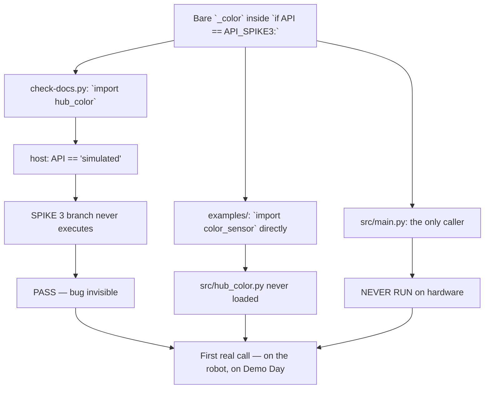

# Hub call-site audit — every `src/hub_*.py` exercised under stubs

**2026-09-09 · host only, THE HUB WAS NEVER TOUCHED · no serial, no `probes/`, no `hub_programmer/`.**

Motivated by the `_color` bug fixed this morning: `src/hub_color.py` used a bare `_color` on three
lines, was never imported, and would have raised `NameError` on the **first sensor read** — killing
calibration with a frozen glyph and no tone. It survived every check we have. This audit hunts the
rest of its class by building a throwaway SPIKE 3 stub of the LEGO API outside the repo and **calling
every public function** in all ten hub-facing modules.

Everything below is `[OBSERVED-UNDER-STUB]` unless marked otherwise: a stub proves a **name resolves**
and an **exception path is reachable**. It cannot prove a LEGO signature. Nothing here is `[MEASURED]`
on hardware.

---

## 1. TL;DR

**16 real defects.** Zero of them are in the pure modules. The stub tree, the harness and the patched
copies were all outside the repo and have been left as disposable evidence.

**Is `src/main.py` safe to run? Not yet — but it is three small edits away.**

`main.py:377` calls `hub_ui.tone_rising()` **outside** the `try:` that opens at 381. `hub_ui.py:110`
(`sound.beep`) and `hub_ui.py:74` (`light_matrix.show`) are unguarded calls to signatures **our own
record marks [UNVERIFIED]** (`hub-api-surface-2026-09-01.md` §5, §6). The recovery handler at
`main.py:409-418` — the comment calls it *"THE HIGHEST-VALUE SIX LINES IN THIS FILE"* — is built out
of **both** of them: `tone_falling()` at 416 and `await hold("x")` at 417, which redraws a glyph. So
the handler that exists to catch ~30 unverified call sites cannot survive a failure in the two least
verified calls in the project.

Fix the three, and a wrong guess about a LEGO signature costs **a picture or a tone instead of the
run**. That is the whole Demo-Day list. Everything else in §3 can wait until after 10 SEP.

**Motor safety is the runner-up and it is worse than it looks:** `hub_motors.stop_motors()` — the
function `main.py` leans on at lines 180, 205, 249, 346, 383, 415 and in the outer `finally:` at 420 —
is two unguarded stops in sequence. `[OBSERVED-UNDER-STUB]` with the left stop injected to raise, the
right motor **was never even asked to stop**.

---

## 2. The bug class — why every check we own passes with a `NameError` present

Two independent blind spots overlap exactly where the hub-facing code lives.

**(a) `./scripts/check-docs.py` imports each `src/` module on the host — and on the host
`hub_api.API == "simulated"`.** So the `if API == API_SPIKE3:` branch never executes, and a name
inside it is never looked up. `import` binds a function body; it does not run it.

**(b) Every program in `examples/` imports `color_sensor`, `motor` and `hub` DIRECTLY.** None of them
imports `src/hub_*.py` at all. Twelve programs have driven this robot and not one has exercised the
mission layer.

**(c) `src/main.py`, the only consumer, has never run on hardware.**



**[MEASURED, host]** I ran `./scripts/check-docs.py` on the unmodified tree: **all six checks PASS**
with all 16 defects below present. For hub-facing call sites, check-docs is **not evidence**.

The durable lesson, stated plainly:

> **A check that only imports a module cannot see inside a branch that host conditions never take.**
> On this project that branch is the entire robot.

---

## 3. CONFIRMED DEFECTS

Only findings independently reproduced. Severity is *for Demo Day*, not in the abstract.

### 3a. Demo-critical — do these three first

| File:line | What happens on the hub | Sev | Exact fix |
|---|---|---|---|
| `src/main.py:377` | `hub_ui.tone_rising()` is **outside** the `try:` at 381. Anything it raises escapes `main()` with **no handler at all** — frozen matrix, no tone, indistinguishable across a room from a robot that is thinking. | **CRIT** | Move the line to be the first statement **inside** the `try:` at 381. |
| `src/hub_ui.py:110` | `sound.beep(int(freq_hz), int(ms))`, unguarded, signature `[UNVERIFIED]`. Reachable from `main.py:377` (no handler) **and** from `main.py:416` inside the handler itself. | **CRIT** | Wrap in `try: ... except (TypeError, AttributeError, OSError, ValueError): pass` with a comment: the signature is `[UNVERIFIED]`; a wrong guess must cost the **tone**, not the run. |
| `src/hub_ui.py:74` | `light_matrix.show(flat)`, unguarded, argument shape `[UNVERIFIED]`. Reached from `main.py:417 → hold("x") → show_glyph → show_frame`, i.e. **from inside the `except` block**, so a raise here escapes the top-level handler. | **CRIT** | Same narrow guard: `try: ... except (TypeError, ValueError, AttributeError, OSError): pass`. `show_glyph()`'s `KeyError` and `show_digit()`'s `ValueError` fire *before* this line, so the deliberate loudness on a typo is preserved. |

**⚠ DO NOT change the arguments of either call.** The exceptions observed came from signatures *we
invented for the stub*. The defect is the **absence of a guard**, not the argument shape. The SPIKE 3
documented shape for `light_matrix.show` is a flat list of 25 — `hub_ui.py:74` is probably correct.

`[OBSERVED-UNDER-STUB]` giving `sound.beep` a plausible keyword-only-duration signature:

```
tone_rising RAISED TypeError: takes 1 positional argument but 2 were given
    hub_ui.py 128  beep(660, 120)
    hub_ui.py 110  sound.beep(int(freq_hz), int(ms))
```

### 3b. Motor safety — a raise mid-call leaves a wheel driving

| File:line | What happens on the hub | Sev | Exact fix |
|---|---|---|---|
| `src/hub_motors.py:95-105` | `stop_motors()` is two unguarded stops in sequence. If the left stop raises (yanked cable, port fault, motor already in ERROR), **the right motor is never commanded**. Called from six sites in `main.py` including the outer `finally:` at 420, where a raise replaces every other outcome and escapes `main()` **with a wheel turning**. | **CRIT** | Guard each stop individually with `except Exception:`, never raise, and `return` a bool so a caller can escalate. `except Exception` is correct **here specifically** because this function is called from a `finally:` and must never throw. `hub_drive.stop()` already has this shape. |
| `src/hub_drive.py:242-246` | The spin starts **before** the `try:` opens at 247. A partial motor write means the `finally: stop()` is never entered and the robot **spins until CENTER is pressed**. The docstring at 229 claims *"Stops the motors before returning, on every path"* — false for this path. | **HIGH** | Move `t0 = time.ticks_ms()` and the `try:` **above** the `if ddeg > 0:` block, so both `spin_*` calls are inside the try. One-line boundary move. |
| `src/hub_motors.py:82-87`<br>`src/hub_drive.py:145-149` | Two sequential unguarded `motor.run()` calls. Second write fails → first wheel keeps driving. `main.py`'s drive sites are wrapped in `try/finally` (covered **once `stop_motors` is fixed**); `hub_drive.forward/backward/spin_*` have **no wrapper** and are called naked by `examples/follow_tape.py` and `examples/calibrate_directions.py`. | **HIGH** | Put the second `motor.run` in a `try:`; on failure call the module's own stop, then `raise`. |

`[OBSERVED-UNDER-STUB]`, verbatim:

```
running before:            {'port.A': -465, 'port.B': 465}
stop_motors()              RAISED OSError [Errno 5]
running AFTER stop_motors: {'port.A': -465, 'port.B': 465}

hub_motors.drive(50,50)    RAISED OSError  ->  running: {'port.A': -465}
hub_drive.turn_by(900,150) RAISED OSError  ->  running: {'port.A': -150}
```

Control that proves the `try:` boundary is exactly one statement too late: an exception raised
**inside** `turn_by`'s loop reached the `finally:` correctly and left `running = {}`.

### 3c. Latent — real, reproduced, but zero callers today

| File:line | What happens on the hub | Sev | Exact fix |
|---|---|---|---|
| `src/hub_distance.py:26` | Bare `_distance`; the file imports only `hub_api`. **This is the `_color` bug, same layer, still present.** Raises `NameError` both with `DISTANCE_PORT=None` and with a port fitted — Python evaluates the callee before the argument, so the `NameError` **beats** the honest `PortMapIncomplete`. | MED | `hub_api._distance.distance(...)`. |
| `src/hub_selfcheck.py:50,51,52` | Bare `read_yaw_deg`, `read_reflection`, `read_distance_mm`, evaluated when the `probes` tuple is **built** at 47 — outside the `try:` at 55. `selfcheck()` raises an **uncaught** `NameError` on every call on real hardware. It cannot return OK, NOT_OK **or** UNKNOWN. Lines 48/49 hide `read_motor_degrees` in lambdas, so they fail later — but the tuple never finishes. | MED | `import hub_color, hub_distance, hub_imu, hub_motors`; qualify all five (`hub_imu.read_yaw_deg`, `hub_color.read_reflection`, …). `API_SPIKE2`/`API_SPIKE3` at line 14 are genuinely unused — drop them. |

Both are latent because they have **zero callers** — confirmed by grep across `src/`, `examples/`,
`probes/`, `hub_programmer/`, `scripts/`. `main.py` folded selfcheck into `calibrate_floor`. But a
shipped diagnostic that has never checked anything is exactly what someone reaches for on Demo Day
morning. Fix after the demo, not before.

### 3d. Correctness and hygiene

| File:line | What happens on the hub | Sev | Exact fix |
|---|---|---|---|
| `src/hub_telemetry_log.py:56-64` | `append()`/`close()` have no guard: a full `/flash` (ENOSPC), an append-after-close, or a non-`str` argument propagates into the caller. `main.py` guards both (136-140, 421-425); `examples/follow_tape.py:292,489` and `examples/standalone_log.py:61` call `append()` **naked inside their tick**. | MED | Make `append()`/`close()` never raise and add a `self.failed` flag (init at line 47). Use a **narrow** except list. Keep the **constructor loud** — a log that cannot open at all is a bench failure. |
| `src/hub_drive.py:70-71` | `getattr(_cfg, _name, None)` + `if _there is not None` means a **renamed or deleted** constant in `mission_config.py` makes the geometry mirror **pass** rather than fail. Under ADR-0005 this assertion is the *only* guard on the on-hub geometry; a silent skip defeats it the same way the simulated branch defeated `check_src_imports`. | MED | `if not hasattr(_cfg, _name): raise ValueError(...)` before the comparison. The comparison itself **works** — perturbing `WHEEL_DIAMETER_MM` to 62.0 raised correctly. |
| `src/hub_drive.py:46,49,56,64,73,74,77` | Names `config.py` on six lines **including the text of the `ValueError` it raises, three times**. `src/config.py` **does not exist** `[MEASURED]`; the file is `src/mission_config.py`. The shadowed-`config` history is worth keeping — but it must be marked as history, and the error must name a file an engineer can open. | LOW | Reword the preamble as ⚠ HISTORY; change the raised message to `mission_config.py`. |
| `src/hub_drive.py` (no clamp) | No speed clamp anywhere. `wheel_speeds_for_arc(300,20) -> (1012.5, -412.5)` mm/s; `arc(300,20)` commands `motor.run(port.A, -1827)` against a `[MEASURED]` `max_speed` of **930**. Hub response is `[UNVERIFIED]`: silent saturation (wrong arc, drifting odometry) or a raise (which is a spin, per 3b). | LOW | Add `MAX_DPS = 930` and a `_clamp_dps()` used in `_run()`. **Zero callers** of `arc`/`forward_mms` in `src/` or `examples/` — do it next time someone touches the module. |
| `src/hub_telemetry_log.py:29-32` | `except OSError: pass` swallows ENOSPC/EACCES/ENOTDIR along with the normal EEXIST, so the failure resurfaces later as an `open()` error naming the **CSV leaf** rather than the directory that is actually wrong. | LOW | After the failed `mkdir`, `_os.stat(current)`; re-`raise` if that also fails. |
| `src/hub_motors.py:65-70` | `_clamp_pct` does not clamp NaN (both comparisons are False for NaN); `int()` then raises `ValueError` at line 84. | LOW | `if not value == value: return 0.0` first. **Correction to an earlier claim:** this does **not** leave a wheel driving — the `int()` sits in the *argument* to the left `motor.run`, so it raises **before** any write. `[OBSERVED-UNDER-STUB]` `running = {}` after `drive(nan, nan)`. |

### 3e. Recorded, deliberately NOT a defect

`hub_api.py:115/121/127/135` — `_hub_obj` / `_color_obj` / `_distance_obj` / `_motor_obj` all raise
`NameError` (`_PrimeHub`, `_ColorSensor`, `_DistanceSensor`, `_Motor` bind only in the SPIKE 2
`except ImportError:` arm) on **both** the spike3 and simulated paths. `hub_api.py:32-35` already
declares that arm **KNOWN-DEAD-ON-OUR-HUB** and ADR-shaped. **Do not "fix" these.** Recorded so the
count of `NameError` sites in `src/` stays honest and nobody deletes the arm on a lint's say-so.

⚠ **pyflakes does NOT see these four** — it treats a conditional module-level import as
possibly-binding. That is why the check in §7 is *necessary but not sufficient*.

---

## 4. RULED OUT — stub artefacts, named so nobody re-raises them

This section is worth as much as §3. Each of these looked like a defect under a stub and is **not**
one. **Do not edit working readers the day before a graded demo on this basis.**

- **`hub_imu.py:31` `read_yaw_deg()` "raises TypeError when `tilt_angles()` returns None".** It only
  fails because a stub was *made* to return `None`. Nothing supports that: `hub-api-surface-2026-09-01.md`
  §4 records `tilt_angles()` returning a 3-tuple `[MEASURED]`, from an **on-board IMU that cannot be
  unplugged**. The supporting argument was also wrong on the facts — `read_tilt_ddeg()` is not
  "None-safe", it is None-*transparent*; `is_flat()` checks `None` only because of the host path. The
  claimed asymmetry does not exist. `[OBSERVED-UNDER-STUB]` nominal: `read_yaw_deg() -> -125.0` from a
  stubbed `-1250` decidegrees, confirming the `/10.0`.
- **`hub_ui.py:157` `button_pressed()` "raises TypeError when `pressed()` returns None".** Invented
  return value. Our record (§7) says the ambiguity is **bool vs press-duration int**, and the code
  handles both: `[OBSERVED-UNDER-STUB]` `pressed()->int` gives `False`, `pressed()->bool` gives `True`.
  Only the invented `None` broke it. `main.py:72` further uses `is True`, which already treats `None`
  as "not pressed". **Leave it alone.**
- **The specific `TypeError` from `sound.beep` and `ValueError` from `light_matrix.show`.** Both come
  from signatures we invented. A stub cannot settle a signature our own record marks `[UNVERIFIED]`.
  What survives is only that these calls are **unguarded and reachable from inside the recovery
  handler** — which justifies the guards in §3a but **not** a change to the arguments.
- **`main.py:431` `if __name__ == "__main__":` "means main.py may silently do nothing in a slot".**
  **`[UNVERIFIED]` — could not be settled, and a stub cannot settle it.** The supporting facts are
  real: all ten on-hub programs (`examples/motor_poc.py:166`, `find_note.py:228`, `follow_tape.py:509`,
  `find_corner.py:405`, `drive_to_tape.py:185`, `calibrate_directions.py:200`, `competition_start.py:146`,
  `standalone_log.py:75`, `g4_spin_and_print.py:55`, `autorun_test.py:34`) use a bare top-level
  `runloop.run(main())`, and `main.py` is the only guarded one **and** the only one never run. Nothing
  in `docs/research/slot-execution-and-live-motor-control-2026-09-03.md`, `docs/runbooks/deploy-to-hub.md`
  or `docs/findings/` records whether a slot's `program.py` executes as `__main__`. **A genuine open
  risk, correctly flagged — but never report it as a found bug.** The real answer costs one upload: a
  slot `program.py` whose entire body is `print(__name__)`.
- **`hub_drive.stop()`'s double swallow is "the same species as the blanket except that hid `_color`".**
  It is not. Those calls are fully qualified (`motor.stop(pl)`) and the swallow is a deliberate
  `finally:`-safety idiom the docstring names. Returning a bool is a fair improvement; framing it as a
  `_color`-class hazard invites someone to remove a guard that is protecting a fault path.

---

## 5. Blanket-`except` audit

Every handler in `src/` that would swallow a **programming** error, and what to do about it.

| Location | Verdict | Narrow replacement |
|---|---|---|
| `hub_selfcheck.py:59` `except Exception as exc:` | **DEFECT.** Files a `NameError`/`AttributeError`/`TypeError` as `{"state": "FAIL"}` — reports a *programming* error as a *hardware* fault and sends the Builder to a healthy plug. Same species as the handler that hid `_color`. Only matters once §3c makes the module callable at all. | `except (OSError, ValueError, RuntimeError, IndexError) as exc:` — `IndexError` covers the `[0]`/`[1]` subscripts in the motor lambdas. |
| `hub_drive.py:158,162` (`stop()`) | **KEEP.** Deliberate `finally:`-safety; calls are qualified. Improvement, not a fix: return a bool so callers are not lied to. | — |
| `hub_drive.py:217` (`read_yaw()`) | **KEEP for now.** Correctly implements the None-returning reader contract, calls are qualified. But it *would* hide a `NameError` if that call site were ever edited. | Eventually `except (OSError, AttributeError):` — behaviour change on an unverified hub error type, so not tonight. |
| `main.py:372, 409, 424` | **KEEP.** These are the top-level survival handlers; breadth is the point. §3a fixes their *reachability* problem, not their breadth. | — |
| `hub_color.py:47-51` | **ALREADY CORRECT** — narrowed to `(OSError, ValueError, RuntimeError)` with a comment naming the `_color` bug. **This is the model.** | — |

> ⚠ **MANDATORY, and it is how this audit avoids installing the next `_color` bug.** Every
> reader-contract guard added to `src/` MUST use the narrow list `(OSError, ValueError, RuntimeError)`,
> exactly as `hub_color.py:47` already does. A blanket `except Exception` on a *reader* swallows a
> future `NameError` and rebuilds the bug this audit exists to kill. The **only** exception is
> `stop_motors()`, which is called from a `finally:` and must never raise.

---

## 6. The None-never-0 audit

THE RULE, from every hub-facing module docstring: *"a reader returns None when it cannot read. NEVER
0, never a default, never a last-known value."*

| Reader | Honours the rule? | Evidence `[OBSERVED-UNDER-STUB]`, injected `OSError` |
|---|---|---|
| `hub_color.read_reflection()` **:29** | ❌ **RAISES** | `RAISED OSError [Errno 19]` |
| `hub_color.read_rgb()` **:77** | ❌ **RAISES** | same shape, `hub_color.py:77` |
| `hub_color.read_reflection_second()` :47 | ✅ returns `None` | `-> None` |
| `hub_motors.read_motor_degrees()` **:29-35** | ❌ **RAISES** | `RAISED OSError`; nominal `-> (-1234, 1234)`, signs applied |
| `hub_distance.read_distance_mm()` :26 | ❌ raises `NameError` first (§3c) | sentinel logic itself is correct once fixed |
| `hub_imu.read_yaw_deg` / `read_tilt_ddeg` / `is_flat` | ✅ (see §4) | — |
| `hub_ui.button_pressed("center")` | ✅ `-> None`, not `False` | "cannot read" ≠ "not pressed" |

**The `hub_color` asymmetry is indefensible.** The *same physical fault* ends the run on port C and
costs one sample on port D. `main.py:119` calls `read_reflection_pair()` **every tick** — at the
`[MEASURED]` ~20 Hz over a 6.4-minute two-sensor sweep that is thousands of primary reads, and **one**
transient raise propagates to `main.py:409`, sets STATUS_UNKNOWN and ends the mission. The mine count
is lost.

**Fix:** give `read_reflection()` (:28-29) and `read_rgb()` (:76-77) the same narrow guard as :47,
returning `None`. Hoist the `_require(...)` call **outside** the `try:` — an unassigned port is a
**bench** error and `PortMapIncomplete` must stay loud. Same treatment for
`hub_motors.read_motor_degrees()`, with `except hub_api.PortMapIncomplete: raise` first.

⚠ **Caveat on the trigger.** What is `[MEASURED]` is that `device.id()` raises `OSError` on an **empty**
port. That `color_sensor.reflection()` or `motor.relative_position()` raises on a *flaky-but-populated*
port is `[INFERRED]`, not measured.

---

## 7. THE STANDING CHECK

**Adopt a `pyflakes` undefined-name pass inside `./scripts/check-docs.py`, filtered to lines containing
`undefined name`, reporting UNCHECKED — never PASS — when pyflakes is absent.**

**Would it have caught the bug? Yes — proved, not argued.** `[MEASURED, host]` on the pre-fix file
pulled from git history:

```
$ git show ccdab17~1:src/hub_color.py > /tmp/old_hub_color.py && python3 -m pyflakes /tmp/old_hub_color.py
/tmp/old_hub_color.py:25:16: undefined name '_color'
/tmp/old_hub_color.py:40:16: undefined name '_color'
```

The exact bug, at the exact lines, with the hub unplugged. On today's `src/` it finds **all six**
remaining ones (`hub_selfcheck` 48/49/50/51/52, `hub_distance` 26) — while all six checks in
`check-docs.py` pass green.

**Cost:** `[MEASURED]` **0.09–0.10 s** over three runs on the whole of `src/`. pyflakes **3.4.0** is
already installed at `/home/devel/.local/bin/pyflakes`.

**False-alarm risk: zero once filtered — and the filter is not optional.** Unfiltered, pyflakes also
emits `imported but unused` for `hub_api.py:13` (`math as _math`), `:26` (`motor as _motor`), `:27`
(`color_sensor as _color`), `:28` (`distance_sensor as _distance`) and `main.py:35` (`floor_anomaly`).
Every one of those is a **false positive** — the names are used *through qualification*
(`hub_api._motor`, `hub_api._math` at `hub_ui.py:115`). **Anyone who "cleans up" on that advice deletes
the imports and recreates the `_color` bug exactly.** Emit only the `undefined name` class.

**Why not a stub-import check as a standing check:** it would **not** have caught this bug. Importing
`hub_color` with stubs on the path never looks up `_color`, because the name lives in a function body
that `import` does not execute. To catch it you must **call** every public function — which is what
this audit was, and which is a test suite in all but name: a maintained fake of an API our own record
marks `[UNVERIFIED]` in half a dozen places, which this exercise has just shown generates false alarms
of its own (§4, five of them). Reject it as a standing check; keep it as what it is — a **throwaway,
run deliberately before a milestone**.

### Does it need a new ADR to sit alongside ADR-0005?

**No — amend ADR-0005 instead; do not open a new decision.**

ADR-0005 forbids a *test suite* and names `check-docs.py` as the one standing guard. This adds a
**seventh static check to that guard**. It creates no `tests/`, no pytest, **runs no code** and asserts
nothing about behaviour — the same kind of artifact as `check_src_purity`, which already lints `src/`
statically. It does introduce **the first non-stdlib dependency in check-docs**, and that is the one
thing worth writing down: a five-line note on ADR-0005 recording that the check is
**advisory-when-absent**, and a function that returns `"pyflakes unavailable -- undefined names
UNCHECKED"` rather than a pass, so a missing tool can never be mistaken for a clean tree.

**Honest limit.** This check is **necessary, not sufficient**. It cannot see the four `hub_api` SPIKE 2
lazy-helper `NameError`s (§3e), and it cannot see a wrong arity, a wrong keyword or a wrong argument
shape on any LEGO call — those stay `[UNVERIFIED]` until the hub is on a desk. What it buys,
permanently and for 0.09 s, is that **the specific bug class that killed calibration on 2026-09-08 can
never again reach the hub undetected.**

---

## Method, and what it does not buy you

Throwaway stubs (`motor`, `color_sensor`, `distance_sensor`, `runloop`, and a `hub` package exposing
`port`, `light_matrix`, `button`, `motion_sensor`, `sound`, `light`) built **outside the repo** in
`/tmp/claude-1000/hcaudit/`, put ahead of `src/` on `sys.path`, with `hub_api.API` forced to the
SPIKE 3 constant and the port map bound to stub ports. Stubs return the `[MEASURED]` values where they
exist — reflection 6 on carpet, `tilt_angles()` in decidegrees, encoder positions in degrees. The stub
`motor` keeps a `RUNNING` ledger, so *"is a wheel still turning?"* is an **observation, not an
inference**. Fourteen fault-injection scenarios on top. **No file was added to the repo except this
one. No git command was run. No hardware was touched.**

**What a stub cannot tell you:** whether `light_matrix.show()` really wants a flat 25, whether an
un-awaited `sound.beep()` makes any noise, whether the two tones in `tone_rising()` are
distinguishable, or what `motor.run()` does with 1827 dps against a 930 ceiling. All still
`[UNVERIFIED]`, all answerable in minutes with the hub on a desk. What the stub pass **does** buy is
that a wrong answer to any of them costs **a picture or a tone instead of the run** — which is exactly
the property the robot did not have this morning.
