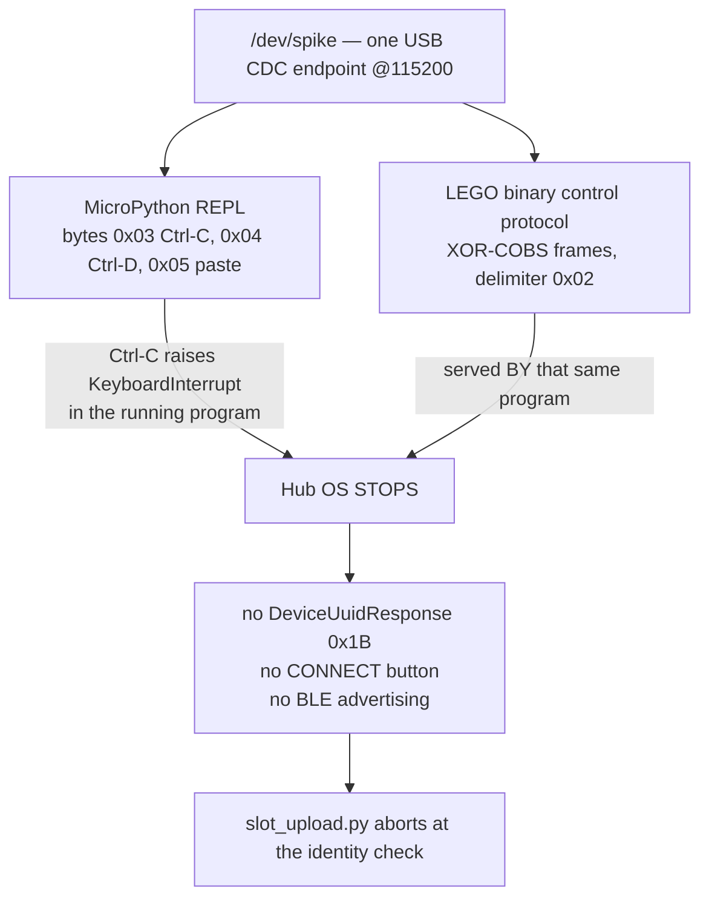

# Finding — the Hub OS and the REPL share one wire, and Ctrl-C wins

**Date:** 2026-09-08 · **Hub:** none — **no hardware was touched for this work.** The operator was
running a live demo, so every claim below is either a re-statement of an earlier *measurement*, a
reading of a *primary source*, or explicitly marked **[UNVERIFIED — no hardware]**.
**Verification procedure for the operator: § 8.**

## 1. The conflict, in one picture

One USB CDC endpoint carries two things that cannot both be in charge.



`probes/_hubio.py`, `hub_programmer/run.py`, `hub_programmer/upload.py` and
`hub_programmer/download.py` all open by writing `0x03`. The Hub OS is the MicroPython program that
serves the control protocol, the CONNECT button and the BLE stack
([dont-interrupt-the-hub-os-if-you-want-bluetooth.md](../lessons_learned/dont-interrupt-the-hub-os-if-you-want-bluetooth.md),
measured 2026-09-01). Interrupt it and all three die together, and **it does not self-recover.**

## 2. The abort is correct — do not weaken it

```
[2] identity: DeviceUuidRequest 0x1A
    no DeviceUuidResponse -- cannot prove this is our hub. ABORT (write nothing).
```

`slot_upload.py` refuses to write to a hub that has not returned
`03970000-3600-1B00-1450-30514B323320`. In a classroom of identical hubs that guard is the only thing
between us and writing into another team's slot. **A silent Hub OS and a stranger's hub are
indistinguishable from the host side**, so the abort is the *only* correct response to silence. The
work below removes the *silence*; it never relaxes the *test*.

## 3. What was measured on 2026-09-08, and what it does and does not prove

`scripts/restore-hub-os.py` sent Ctrl-C then **Ctrl-D** (MicroPython soft reset) and polled until the
`>>>` prompt stopped appearing.

| Observed | Concluded then | Correct reading |
|---|---|---|
| REPL went quiet in ~1.2 s | "Hub OS restored" | **False positive.** Absence of `>>>` only says the REPL went quiet — a hub *mid-reset* is equally quiet. |
| `slot_upload.py` immediately after: still aborted at identity | soft reset does not work | **Not yet established.** Two explanations survive, and the old test could not tell them apart. |

The two survivors:

- **E1 — the soft reset genuinely does not relaunch the Hub OS.** Re-running `boot.py` is not the same
  as *launching* the Hub OS (§ 4).
- **E2 — the test fired too early, and one lost request looks identical to a dead hub.** The poll
  returned at the first quiet moment (~1.2 s, i.e. *during* the reset), and `slot_upload.py` sends
  `InfoRequest` **exactly once, with no retry**. A request posted into a hub that is still coming up is
  simply lost, and the abort that follows is indistinguishable from E1.

**This is the single most valuable open question here**, and the rewritten script (§ 6) is built to
answer it: it verifies by *speaking the control protocol*, and it *retries*.

## 4. Mechanism, as far as our sources actually go

**MEASURED — our own hub's `/flash/boot.py`** (`docs/archives/hub-baseline/05-stock-files.txt`):

```python
# boot.py -- run on boot to configure USB and filesystem
# Put app code in main.py
import micropython, hub
micropython.alloc_emergency_exception_buf(128)
hub.config["hub_os_enable"] = True
```

**MEASURED — the frozen module surface** (`docs/archives/hub-baseline/02-modules.txt`) includes
`_system/default`, `_system/menu`, `_system/scratch`, `_system/test_selector`. `/flash/main.py` is the
34-byte stock comment stub, and it does **not** autorun (measured after a real power cycle, KU-M16).

So, **what starts the Hub OS at boot**: `boot.py` sets a **flag**, `hub.config["hub_os_enable"]`. It
does not `import` or call anything. Something below Python — the firmware's own start-up path — reads
that flag and runs a frozen `_system/*` module as the application.

**[INFERENCE, not sourced]** — why Ctrl-D may not bring it back: MicroPython's soft reset re-runs
`boot.py` and `main.py` and then drops to the REPL. If the Hub OS launch sits in the firmware's C
start-up *before* the soft-reset re-entry point, or if `hub_os_enable` is latched at hard boot, then
re-running `boot.py` re-sets an already-set flag and changes nothing. **We cannot see the firmware
source, so this stays inference.** It is consistent with E1 and would explain it; it is not proof of it.

**What the protocol offers: nothing.** The complete top-level message table in LEGO's `messages.rst`
(transcribed in
[../research/slot-execution-and-live-motor-control-2026-09-03.md § 4](../research/slot-execution-and-live-motor-control-2026-09-03.md))
holds **no reset, restart, or reboot message**. `ProgramFlowRequest 0x1E` starts and stops a *slot
program*, not the Hub OS itself. **There is no documented way to hand control back.**

## 5. Ranked candidate recoveries

| # | Candidate | Exactly what it puts on the wire | Safety | Status |
|---|---|---|---|---|
| **1** | **Avoidance — never send Ctrl-C** (§ 6) | XOR-COBS frames only. The framing cannot emit `0x03` or `0x04` (verified on the host: `_cobs.pack()` output for both queries contains neither byte) | **Safe.** Read-only queries + a slot file write, the same class as ADR-0007 | **IMPLEMENTED** |
| **2** | Ctrl-D soft reset, then verify **by protocol** and retry | `0x03`, then `0x04`, then `00 00 02` / `07 19 02` repeatedly | **Safe.** Restarts the interpreter, not the firmware ([firmware-integrity-proof.md](./firmware-integrity-proof.md)) | **IMPLEMENTED**, [UNVERIFIED] |
| **3** | Type `hub.config["hub_os_enable"] = True` at the REPL, then Ctrl-D | the literal expression + `0x04` | Writes hub **config** (`/flash/config/` is a real directory on our hub). Not firmware, but a state change; `run.py` already blacklists the token | **Operator decision — not implemented** |
| **4** | `import machine; machine.reset()` | the literal expression | A hard MCU reset — *identical in effect to a power cycle*, and **not** DFU, bootloader or a flash write. But `machine.*` resets are treated as off-limits here and `run.py` refuses them | **Operator decision — not implemented.** Would almost certainly work |
| **5** | A control-protocol "restart the Hub OS" message | — | **Does not exist** (§ 4) | Ruled out |
| **6** | USB CDC DTR/RTS toggle, or a 1200-baud touch | line-state changes | **REJECTED, do not attempt.** A 1200-baud touch is the *bootloader-entry* idiom on other boards; nothing in this project may go near a bootloader | Forbidden |
| **7** | Physical power cycle | — | Known-good. Single press off, single press on. **Never** press-and-hold CONNECT while USB is in | Fallback of record |

**Answer to "does a safe software-only recovery exist?"** — **Candidate 1 makes the question moot for
the tool that caused most of the pain, and that is the fix that matters.** For a hub already killed,
candidate 2 is the only *safe, unattended* option and it is now testable rather than assumed;
candidate 4 would certainly work but is the operator's call, not ours to take.

## 6. Avoidance — feasible, and mostly already proven

`slot_upload.py` already uploads a program, starts it, and reads its `print()` output back as
`ConsoleNotification 0x21`, **without ever sending Ctrl-C** — and that whole sequence is
**MEASURED WORKING on our hub 2026-09-03**
([sensor-fusion-and-slot-wall-2026-09-03.md](./sensor-fusion-and-slot-wall-2026-09-03.md), UPDATE
section: console output streamed, motors ran). So re-plumbing a "run a tiny program and read its rows"
tool through it is assembly of proven parts, not new protocol work.

**`scripts/scan-surface.py` — re-plumbed, and it is a clean fit.** It runs a ~1.4 KB program that only
prints `SV,...` rows. That is exactly upload + start + listen.

**`hub_programmer/download.py` — cannot be re-plumbed. Stated plainly: LEGO's control protocol has no
file download.** The message table is upload-only (`StartFileUpload 0x0C`, `TransferChunk 0x10`, both
host→hub); there is no read, no directory listing, no download counterpart, and `TunnelMessage 0x32`
only relays bytes to a *running program*. The one avoidance route left is indirect — upload a slot
program that base64s the file to its console and read it back over `0x21` — which is a real option but
a bigger change, slower, and untested; it is **not** implemented here. `download.py` now says this in
its own header and points at the restore script.

## 7. What changed

| File | Change |
|---|---|
| `hub_programmer/slot_upload.py` | `note_notification` / `request` / `run_sequence` take an optional `on_console` sink (default `None` = byte-identical behaviour). New `upload_and_capture()` packages the USB slot+console path for other host tools. **No change to the identity check.** |
| `scripts/scan-surface.py` | **Default path is now slot 19 + console**, so a survey no longer kills the Hub OS. `--repl` forces the old path, and the old path is also the **automatic fallback** if the slot path returns no rows — so the tool cannot lose a survey, it just says the Hub OS went down. Console text is reassembled across `0x21` boundaries before parsing. An **identity mismatch never falls back** — the REPL path has no identity check, so capturing nothing beats running a program on someone else's hub. |
| `scripts/restore-hub-os.py` | Rewritten. **Checks the Hub OS non-destructively first** (the old version sent Ctrl-C unconditionally — it would kill a *healthy* Hub OS to "restore" it). Verifies by `InfoRequest 0x00` → `DeviceUuidRequest 0x1A` and comparing **our** UUID, not by the absence of `>>>`. Closes the port across the reset, waits for the node to re-appear, and **retries**. New `--check` flag. |
| `hub_programmer/run.py` | Prints, after every run, that the Hub OS is now stopped and how to restart it. |
| `hub_programmer/download.py` | Header records that the protocol has no download message, so this tool must keep the REPL — and points at the restore script. |

**[UNVERIFIED — no hardware]** applies to every hub-side behaviour above. What *was* checked on the
host: all files parse and import; `slot_upload.py --slot 19` dry run still produces the same frames and
opens no port; `hub_os_alive()` was exercised against a simulated hub and returns `True` for our UUID,
`False` for silence, and **`False` for a foreign UUID**; the console reassembler recovers whole `SV,`
rows from 17-byte fragments; `check-docs.py` passes.

## 8. Operator verification procedure — run this when the hub is free

Nothing else may hold the port (`fuser -v /dev/spike`). Steps 1–5 answer "can we recover?"; step 6 is
the one that actually matters day to day.

1. **Known-good state.** Power-cycle the hub (single press off, single press on), wait for the matrix
   menu, then — *without running any REPL tool* — `./scripts/restore-hub-os.py --check`
   → expect **`Hub OS ALIVE`**. If it says DOWN here, the *check* is wrong: stop and report that.
2. **Kill it deliberately.** `python3 probes/whoami.py` (or any REPL tool). It now ends with the
   "Hub OS is STOPPED" note.
3. `./scripts/restore-hub-os.py --check` → expect **`Hub OS DOWN`**. This confirms the check can tell
   the two states apart — the thing the old script never established.
4. **The experiment.** `./scripts/restore-hub-os.py`
   → **PASS** = `Hub OS RESTORED after N s`. **FAIL** = the power-cycle message. Either result settles
   E1 vs E2 from § 3; record which, and the N.
5. **Independent confirmation** (do this whatever step 4 said):
   `./hub_programmer/slot_upload.py <any tiny .py> --slot 19 --apply --listen 8`
   → restored if it gets past `[2] identity` and prints `[console]` lines.
6. **The avoidance path.** From a power-cycled hub: `./scripts/scan-surface.py FLOOR`
   → **PASS** = rows appended **and** the tail says `(via slot 19)` **and** immediately afterwards
   `./scripts/restore-hub-os.py --check` still reports **`Hub OS ALIVE`**. That last line is the whole
   point: a survey that leaves Bluetooth and slot upload working.
   If it printed the fallback banner instead, capture that output — the slot path failed and the reason
   is in the frames above it.

File the transcript under [runs/](./runs/) and correct § 3 and § 5 here with what the hub actually did.

**Related:** [../lessons_learned/dont-interrupt-the-hub-os-if-you-want-bluetooth.md](../lessons_learned/dont-interrupt-the-hub-os-if-you-want-bluetooth.md) ·
[sensor-fusion-and-slot-wall-2026-09-03.md](./sensor-fusion-and-slot-wall-2026-09-03.md) ·
[../research/program-upload-protocol.md](../research/program-upload-protocol.md) ·
[../research/slot-execution-and-live-motor-control-2026-09-03.md](../research/slot-execution-and-live-motor-control-2026-09-03.md) ·
[firmware-integrity-proof.md](./firmware-integrity-proof.md)
