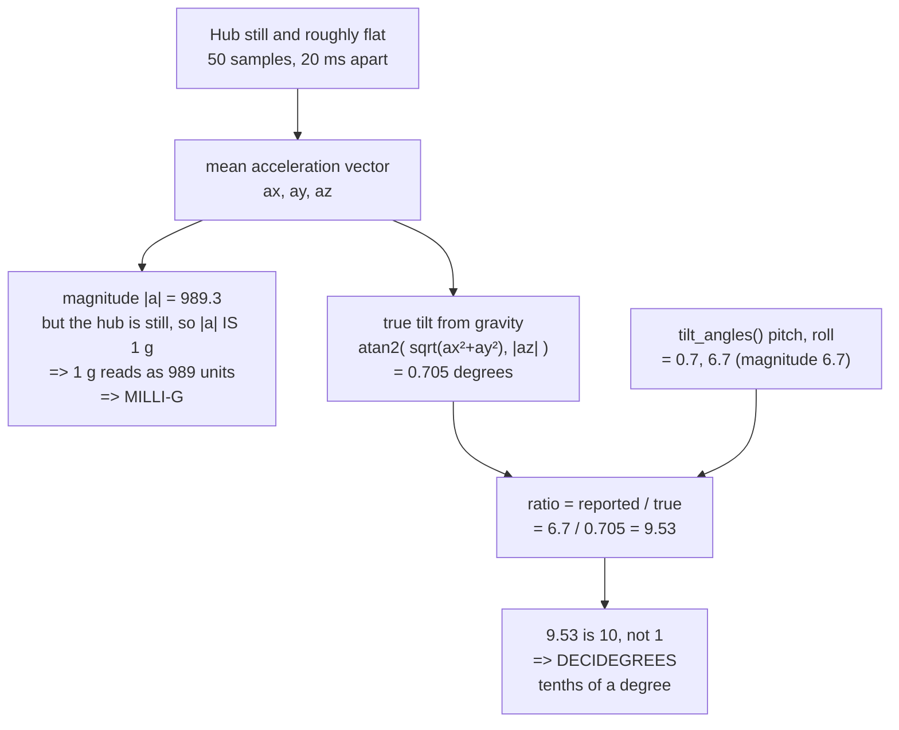
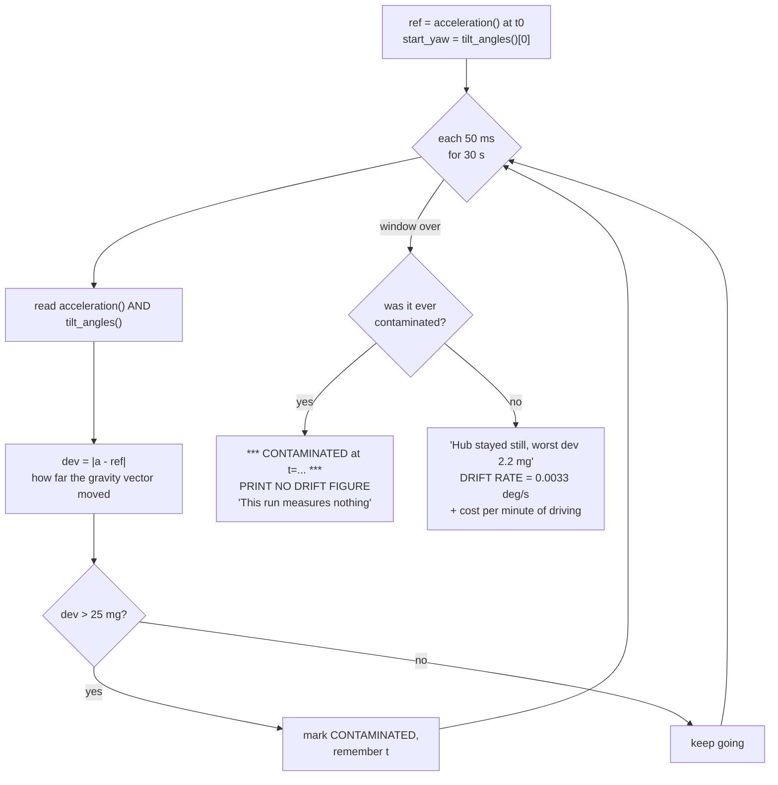

# Finding — IMU characterisation: units, the yaw wrap, read cost, and drift

**Date:** 2026-08-27 · **Hub:** connected over USB on `/dev/spike`, SPIKE Prime Technic Large Hub
45601, firmware MicroPython v1.20.0-1742.gf212bbe83 / `os.uname().release = 1.24.0`, SPIKE 3 API
· **Operator present:** yes — the operator connected the hub and ran every program on it
· **Motors/sensors attached:** **none.** All six ports A–F read empty at first contact
· **Written to the hub during the session:** one module, `/flash/lib/config.py`; the firmware image
was proved untouched by a baseline re-capture and diff — see
[hub-first-contact-2026-08-27.md](./hub-first-contact-2026-08-27.md).

> **These are measurements**, in the strict sense this project uses: values read off our own hardware
> over the cable, not computed from a datasheet and not confirmed against a vendor document.
> Where something is an explanation rather than an observation it is marked `[INFERRED]`; where it has
> not been tested it is marked `[UNVERIFIED]`.
> Vocabulary rule: [../lessons_learned/say-which-kind-of-verified.md](../lessons_learned/say-which-kind-of-verified.md).

**Raw transcripts** (never edited, never quoted without their conditions):
[`runs/imu-units-and-rate-2026-08-27.txt`](./runs/imu-units-and-rate-2026-08-27.txt) ·
[`runs/gyro-drift-2026-08-27.txt`](./runs/gyro-drift-2026-08-27.txt).
**Programs:** [`examples/imu_units_and_rate.py`](../../examples/imu_units_and_rate.py) ·
[`examples/gyro_drift.py`](../../examples/gyro_drift.py) ·
[`examples/imu_verbose.py`](../../examples/imu_verbose.py).

---

## 0. Conditions

Everything below was taken with the hub **stationary on a flat surface, unmounted** — a bare hub, not
a robot. No motors were connected (so no vibration, no motor magnetic field, no chassis flex), and the
hub was **powered and charging over USB** throughout: battery rose 7942 → 8001 mV and
`hub.temperature()` rose 247 → 251 across the session.

That matters for how far these numbers travel. A bare, still, cool, mains-powered hub is the *best*
case for an IMU. Nothing here has been re-measured on a driving robot, and the drift section says so
explicitly.

---

## 1. The units, derived from gravity instead of from a datasheet

This is the part worth teaching in the report: **we did not look the units up. We derived them from a
physical constant the hub is already sitting in.** A still hub measures exactly one thing —
gravity — and gravity's magnitude and direction are known. That makes it a free calibration source,
available on any surface, with no equipment.



### 1.1 `motion_sensor.acceleration()` is in **MILLI-G**

Measured, 50 samples averaged, hub still and roughly flat:

```
mean acceleration  ax=-2.0 ay=12.0 az=989.2  |a|=989.3
=> 1 g reads as about 989 units, so acceleration is in MILLI-G
```

The argument is one line: a stationary object's proper acceleration is exactly 1 g. The vector's
magnitude is therefore 1 g by definition, and the hub prints 989.3 for it. Any scale in which 1 g
reads as ~989 is milli-g. `~989` rather than a clean 1000 is the sensor's own zero-g offset and
scale error at this temperature, not a different unit.

Deviation from an ideal 1000 mg: **11 mg, about 1.1 %.** `[INFERRED]` that this is offset/scale error
rather than something else; a two-point check (hub inverted, expecting ≈ −989 on the same axis) would
confirm it and has not been run.

### 1.2 `motion_sensor.tilt_angles()` is in **DECIDEGREES**

Same 50 samples, same instant, so the two readings describe the same physical pose:

```
true tilt from gravity      = 0.705 degrees
tilt_angles() pitch/roll    = 0.7, 6.7  (magnitude 6.7)
ratio reported/true         = 9.53
=> tilt_angles() is in DECIDEGREES (tenths of a degree).
```

The accelerometer says the hub is tilted 0.705° off level. `tilt_angles()` reports a tilt magnitude of
6.7. The ratio is 9.53 — near 10, nowhere near 1 — so the reported number is **tenths of a degree**.

The ratio is 9.53 and not 10.00 because the true tilt is *tiny*: at 0.705° the quantisation of a
decidegree reading (±0.05°, i.e. ±7 % here) dominates. The derivation is unambiguous at this
resolution — 9.53 cannot be confused with 1 — but if a precise scale factor is ever needed, prop one
edge up by 10–20° and re-run; `imu_units_and_rate.py` already prints that instruction when the hub is
too flat to derive a ratio at all.

**This corroborates rather than contradicts the API research.** `docs/research/spike3-api-reference.md`
§ 6 carried decidegrees as a `[MIRROR]` claim from third-party documentation; it is now derived on our
own hub, and the documented range `−1795 … 1800` is consistent with what we observed (§ 2).

### 1.3 What this closes in the code

| Location | Status after this finding |
|---|---|
| [`src/hub_imu.py`](../../src/hub_imu.py) `read_yaw_deg()` — `tilt_angles()[0] / 10.0` | **Correct.** The `UNVERIFIED: SPIKE 3 reports yaw in DECIDEGREES` marker can be struck and replaced with this derivation |
| [`src/hub_imu.py`](../../src/hub_imu.py) `read_tilt_ddeg()` — "decidegrees because that is what the hub reports" | **Confirmed.** Keeping raw ddeg in the log and dividing once on the analysis side was the right call |
| [`src/hub_imu.py`](../../src/hub_imu.py) comment "whether `acceleration()` is in mG, m/s² or raw counts is not documented anywhere we have found" | **Answered:** milli-g, ~989 per g at rest. The `UNITS UNVERIFIED` marker on `read_accel()` goes with it |
| [`src/hub_imu.py`](../../src/hub_imu.py) `is_flat(max_tilt_ddeg=100)` | The **unit** is no longer assumed; the **value** still is. 100 ddeg = 10.0° exactly, and whether 10° is the right limit is untested |
| [`src/telemetry.py`](../../src/telemetry.py) `yaw_ddeg` / `pitch_ddeg` / `roll_ddeg` | **Correct as written** — the column names already state the true unit |
| [`src/telemetry.py`](../../src/telemetry.py) `accx` / `accy` / `accz` | **DONE 2026-08-27 — not pending.** They violated that module's own rule ("the unit is part of the column name") once the unit was known, so they were renamed to `accx_mg` / `accy_mg` / `accz_mg`. Renaming a column is a **wire-format change**, so `VERSION` went to **`spike-telemetry v2`** in the same edit. **A receiver written against v1 must be told.** |

### 1.4 The call form, settled

`docs/research/spike3-api-reference.md` § 6.3 predicted that `acceleration()` and `angular_velocity()` take a
**required positional argument**, and `src/hub_imu.py` was written expecting a possible
`TypeError`. Confirmed against the echoed program source inside
[`runs/imu-units-and-rate-2026-08-27.txt`](./runs/imu-units-and-rate-2026-08-27.txt) (the transcript
carries the source it ran): both were called as `m.acceleration()` and `m.angular_velocity()` — **no
argument** — 500 times each, and both returned values. On firmware 1.24.0 the no-argument form works
and the predicted `TypeError` does not occur.

`[UNVERIFIED]` whether an argument form *also* exists (e.g. selecting a raw/filtered variant). Not
tested; nothing in the code needs it.

---

## 2. Yaw wraps at ±180°, and heading arithmetic must handle it

**Measured:** across a run in which the operator rotated the hub by hand, yaw min/max were
**−1795 and +1771 ddeg** — i.e. **−179.5° … +177.1°**. The reading is a **wrapped heading on
(−180°, +180°]**, not a free-running accumulated angle.

**Say it plainly: every piece of heading arithmetic in this project must handle the wrap.** Subtracting
two yaw readings across the seam gives a nonsense delta — a robot turning 10° through the seam reads
as turning 350° the other way. The consequences are not subtle: a lane-hold controller would slam the
robot into a full-speed counter-turn, and a turn-completion check would never fire.

The existing guard is [`src/odometry.py`](../../src/odometry.py) `normalize_angle()`, already used on
every heading delta in that module. The rule this finding adds: **every consumer of
`hub_imu.read_yaw_deg()` routes its differences through `normalize_angle()`** — there is no reading
from the hub for which the raw subtraction is safe.

`[UNVERIFIED]` whether `motion_sensor.reset_yaw(0)` also re-seats the wrap window (it appears in the
API surface but was never called), and `[UNVERIFIED]` whether yaw is derived from the fused quaternion
or from integrated gyro alone — the two behave differently when the robot is tilted.

---

## 3. Face and gesture constants, read off the hub

**Measured** on our hub, so these are the numbers a telemetry log will actually contain:

| `motion_sensor` face | Value | | Gesture | Value |
|---|---|---|---|---|
| `TOP` | 0 | | `TAPPED` | 0 |
| `FRONT` | 1 | | `DOUBLE_TAPPED` | 1 |
| `RIGHT` | 2 | | `SHAKEN` | 2 |
| `BOTTOM` | 3 | | `FALLING` | 3 |
| `BACK` | 4 | | `UNKNOWN` | −1 |
| `LEFT` | 5 | | | |
| `UNKNOWN` | −1 | | | |

`docs/research/spike3-api-reference.md` § 6.4 carried these as a `[LEGO]` protocol enum; they are now
measured on this hub. **Still unresolved:** which *physical* face of the hub each name refers to once
the hub is mounted on a chassis in some arbitrary orientation. That is a build-time question, and it
needs a probe that prints `up_face()` while the operator physically turns the assembled robot.

---

## 4. Read cost — and an anomaly we are not going to explain away

### 4.1 What was measured

`examples/imu_units_and_rate.py` timed each call in a tight loop with no sleep, using
`time.ticks_ms()` around a fixed call count. Conditions: hub still, USB-powered, nothing else running.

```
tilt_angles()                 500 calls in    27 ms =  0.054 ms each  (18518.5 Hz)
acceleration()                500 calls in    55 ms =  0.110 ms each  ( 9090.9 Hz)
angular_velocity()            500 calls in    82 ms =  0.164 ms each  ( 6097.6 Hz)
quaternion()                  500 calls in    11 ms =  0.022 ms each  (45454.5 Hz)
all three together            300 calls in   405 ms =  1.350 ms each  (  740.7 Hz)
```

### 4.2 The arithmetic does not close

```
tilt_angles()       0.054 ms
acceleration()      0.110 ms
angular_velocity()  0.164 ms
                   --------
sum of the parts    0.328 ms
measured together   1.350 ms      <-- 4.1x the sum of its parts
```

Reading three sensors one after another costs **four times** what reading them separately costs. A
composite operation cannot legitimately cost more than its components; something in the measurement is
not measuring what the label says.

The individual figures are independently implausible. They imply **6,000–45,000 Hz** of sensor
traffic. No MEMS IMU on a shared internal bus produces fresh samples at 45 kHz, and
`quaternion()` — the most derived quantity of the four — coming out *fastest* is exactly backwards.

### 4.3 The hypothesis, stated as a hypothesis

`[INFERRED, UNVERIFIED]` **A repeated identical call returns a cached value; mixing calls forces a
genuine update.** If the firmware caches the last IMU frame and invalidates it on some condition —
a different accessor, a new frame arriving — then a tight loop on one accessor mostly re-reads cache
(fast, and not a sensor read at all), while a loop that alternates accessors pays for real traffic
each time. That would produce exactly this signature.

**This is a hypothesis. It has not been tested, and it is not the only explanation.** Alternatives not
ruled out: per-accessor bytecode caching or constant folding in MicroPython; the mixed loop paying
extra Python call overhead for three bound-method lookups instead of one; or a frame-rate boundary the
mixed loop crosses and the single loop does not.

### 4.4 What would settle it

Cheap, on-hub, no new hardware — a single probe:

1. **Insert a sleep.** Time `tilt_angles()` at 1 Hz, 10 Hz, 100 Hz and 1 kHz. If per-call cost rises
   as the gap grows, the fast figure was cache hits.
2. **Watch for changed values, not elapsed time.** Loop on one accessor and count how many consecutive
   reads are *bit-identical*. A genuine 18 kHz sensor gives fresh numbers; a cache repeats itself. This
   is the decisive test and it needs no timer at all.
3. **Two accessors, alternating vs. paired.** Time `tilt_angles()` alone, then `tilt_angles()` twice
   per iteration, then `tilt_angles()` + `acceleration()`. If the second `tilt_angles()` is nearly free
   and the `acceleration()` is not, caching is confirmed.
4. **Baseline the loop.** Time an empty 500-iteration loop and a loop calling a trivial Python
   function, so Python's own call overhead is subtracted rather than assumed.

### 4.5 What to plan with in the meantime

**Use 1.350 ms as the cost of a full IMU tick. Never quote the per-call figures as read rates.**
The mixed-call number is the conservative one and it is the only one that describes what a control loop
actually does.

Consequences, computed from that figure:

| Quantity | Value |
|---|---|
| Full IMU tick — yaw + accel + gyro | **1.350 ms** (300 iterations) |
| Share of a 10 ms tick at the assumed 100 Hz | **14 %** |
| Headroom left for driving, detecting, logging, deciding | 8.65 ms per tick |

**What this does NOT say.** It is **not** the achieved loop rate. It is one component of one tick,
measured with no motors attached, no colour sensor read, no telemetry `print()` (which goes over
serial and is the most likely real bottleneck), and no control arithmetic. `KU-M5` — the achieved
Python loop rate — **stays OPEN**, and the speed-ceiling table in
[../research/hub-compute-limits.md](../research/hub-compute-limits.md) § 3.4 must not be filled in from
this number.

**A methodology correction, not just a data point:** the standard trick for isolating sensor cost —
time a loop with the read, time it without, subtract — is precisely what § 4.2 shows can be wrong by
4×. Any future component-cost measurement on this hub has to demonstrate that its reads are real
before its subtraction means anything.

---

## 5. Gyro drift — three windows, one of them discarded

### 5.1 The three observations

| # | Program | Window | Result | Verdict |
|---|---|---|---|---|
| 1 | `imu_verbose.py` | 100 samples over **5.004 s**, stationary | yaw start −39 ddeg, end −39 ddeg — **drift 0** | Good, but far too short to mean much |
| 2 | `imu_units_and_rate.py` § 3 | **30 s**, intended stationary | net 987 ddeg = **98.7°**, i.e. 32.9 ddeg/s = **3.29 °/s** | **DISCARDED — see § 5.2** |
| 3 | `gyro_drift.py` | **30 s**, stationary, with a disturbance check | net 1 ddeg = **0.10°** over 30003 ms → **0.0033 °/s**; worst accelerometer deviation **2.2 mg** against a 25 mg threshold | Clean by the program's own precondition check |

### 5.2 Why run 2 was thrown out

The transcript's own numbers condemn it. The drift went **+7.6°, then −22.2°, then +96.6°**:

```
    t= 9950 ms  yaw=    68  drift=  76
    t=19951 ms  yaw=  -230  drift=-222
    t=29953 ms  yaw=   958  drift= 966

  start -8  end 979  net drift 987  worst excursion 1035
  over 30003 ms => 32.8967 units/second
```

**Steady drift does not reverse direction.** Bias drift is a slow, monotonic rot; a signal that goes
up, then well past zero the other way, then far up again is not bias — it is real rotation. The
operator was plugging in motors and handling the robot during that window. The arithmetic in the run
is perfectly correct and the answer is worthless, because the *input* violated the precondition the
program never checked.

`3.29 °/s` would have implied 197° of accumulated heading error per minute — enough to justify building
a whole heading-correction subsystem we may not need. **This number must never be quoted.** It sits
inside [`runs/imu-units-and-rate-2026-08-27.txt`](./runs/imu-units-and-rate-2026-08-27.txt), which is
kept unedited on purpose, and the runs INDEX flags it there.

### 5.3 The method that caught it — the actual lesson

`gyro_drift.py` was written in response, and its design is the reusable part: **it measures the
quantity and the precondition at the same time, and refuses to report the quantity when the
precondition fails.**



A still hub holds its gravity vector to within a milli-g or two, so **the accelerometer is a
disturbance detector for free** — the same physical constant used to derive the units in § 1, reused
to validate the drift window. The 25 mg threshold is far outside the 0–2.2 mg spread a genuinely still
hub shows here, and well inside "somebody bumped the table".

It worked in the field: on an earlier invocation the program **flagged CONTAMINATED at t = 14106 ms**
with the gravity vector deviating by up to **2534 mg**, and printed no drift figure at all. It caught
the disturbance *independently* of anybody noticing the robot being handled.
*(That contaminated run's transcript was not filed into `runs/`; the figures here are from the session
record. The transcript that IS filed is the clean re-run, row 3 above.)*

**A tool that refuses to answer is working, not broken** —
[../lessons_learned/a-tool-works-when-it-does-its-job.md](../lessons_learned/a-tool-works-when-it-does-its-job.md)
and
[../lessons_learned/bound-the-inputs-before-trusting-a-conclusion.md](../lessons_learned/bound-the-inputs-before-trusting-a-conclusion.md).
Generalise it beyond the gyro: **the colour-threshold calibration should record ambient light while it
samples, and the drivetrain measurement should record battery voltage while it runs**, for exactly the
same reason.

### 5.4 The honest bottom line

**What is measured:** yaw drift of **0.0033 °/s over one clean 30 s stationary window** on a bare,
unmounted, USB-powered hub, with the stillness of that window independently verified (worst
accelerometer deviation 2.2 mg). Two shorter windows (5.004 s and the first 10 s of the same run) show
zero drift.

**Do not write that drift is solved.** What is still unmeasured:

- **Repeatability.** n = 1 clean run. `KU-M9`'s plan is 180 s × 5, and it has not been done.
- **Run-length windows.** The demo timebox is 300 s `[ASSUMED]`; the longest clean observation is 30 s.
  Drift is not guaranteed linear, and a thermal component grows as the hub warms.
- **Drift while DRIVING.** This is the gap that actually matters. The measured window had no motors
  attached — no vibration, no motor magnetic field, no chassis flex, no wheel impacts. A gyro that is
  quiet on a desk can be noisy on a moving robot, and the sweep is driven on heading.
- **Drift on battery.** Every observation was taken while charging over USB.
- **Turn repeatability.** Untouched. `KU-M9`'s second half — ten 90° turns, final heading error — needs
  motors, which are not yet connected.

So `KU-M9` moves **OPEN → PARTIAL**, not closed.

### 5.5 A related observation, and an explanation we have not verified

`motion_sensor.angular_velocity()` reads exactly **`0, 0, 0`** when the hub is stationary — not small
numbers, exact zeros.

`[INFERRED, UNVERIFIED]` that is a deadband or filter in the firmware, and `[INFERRED]` it may be
*why* integrated yaw does not wander: a rate that is forced to zero cannot integrate into a drift.

If that is what is happening, it is a double-edged result. A deadband hides bias drift for free while
stationary, but it also **swallows genuine slow rotation**. Two things follow:

- The 0.0033 °/s figure may be a property of the filter rather than of the sensor, and would not
  survive contact with a robot that is actually turning slowly.
- [`src/config.py`](../../src/config.py) `STUCK_YAW_TICKS = 50` assumes "yaw unchanged while the
  encoders show a turn" means a *broken* gyro. On a slow enough turn, a deadband could make a
  perfectly healthy gyro look stuck.

Settling it needs a motorised slow turn with encoders as the reference, which needs motors mounted.

---

## 6. What this closes in `src/config.py`, and what it does not

**No constant in [`src/config.py`](../../src/config.py) gains a measured value from this session.**
What changes is which comments are still true.

| Constant | Effect of this finding |
|---|---|
| `SAMPLE_RATE_HZ = 100.0` | **Value unchanged, and still not verified.** 100 Hz remains *plausible from the IMU side only*: a 1.350 ms tick is 14 % of a 10 ms budget. Says nothing about driving, detecting or logging cost. The comment's `UNVERIFIED: LEGO spec figure for the colour sensor` stands |
| `STUCK_YAW_TICKS = 50` | Still `[ASSUMED]`, and now carries a caveat: `angular_velocity()` reading exactly zero at rest suggests a deadband that could make a healthy gyro look stuck on a slow turn (§ 5.5) |
| `HEADING_DISAGREE_LIMIT_DEG = 10.0` | **Untouched.** Needs a gyro-vs-encoder comparison, which needs motors |
| `TRAVERSE_SPEED_MMS`, `TURN_RATE_DPS` | **Untouched.** The speed ceiling depends on the achieved loop rate and the colour sensor, neither measured |
| `CROSS_TRACK_ERROR_MM = 15.0` | **Untouched**, but note it is the budget the drift figure must eventually be compared against |
| Arena, target, detection, reporting blocks | **Untouched by this session** |
| `hub_imu.is_flat(max_tilt_ddeg=100)` (not in `config.py`) | Unit confirmed (100 ddeg = 10.0°); the 10° limit is still `[ASSUMED]` |

**Optional new constant:** `IMU_TICK_MS = 1.35`, tagged MEASURED 2026-08-27, 300 iterations. Worth
adding **only** when `main.py`'s tick-budget arithmetic actually consumes it; otherwise the number
belongs here, in the finding, where its conditions travel with it.

---

## 7. Open questions this leaves

| # | Question | Why it matters | How to close it |
|---|---|---|---|
| 1 | Is the per-call read cost a cache hit? (§ 4.3) | Decides whether a component-cost measurement on this hub can be trusted at all | The four-step probe in § 4.4 — the "count bit-identical consecutive reads" test is decisive and needs no timer |
| 2 | What is the achieved Python **loop** rate? (`KU-M5`) | Sets the traverse-speed ceiling and therefore the whole coverage time budget | A full mock tick — sensor reads + control arithmetic + telemetry `print()` — timed over 1000 iterations |
| 3 | Drift while **driving**, over a run-length window | The sweep is driven on heading; § 5.4 | Repeat `gyro_drift.py`'s method with motors running: keep the disturbance check, change its threshold to something meaningful under vibration |
| 4 | Does the `angular_velocity()` deadband hide slow rotation? (§ 5.5) | Could invalidate both the drift figure and `STUCK_YAW_TICKS` | Motorised slow turn, encoders as reference |
| 5 | Which **physical** hub face is `TOP`/`FRONT`/… once mounted? | Telemetry face values are unreadable until this is fixed | Probe printing `up_face()` while the operator turns the assembled robot |
| 6 | Is yaw fused (quaternion) or integrated gyro? | Determines whether yaw survives the robot tilting | Compare `tilt_angles()[0]` against integrated `angular_velocity()` during a tilted turn |
| 7 | Does `reset_yaw(0)` re-seat the ±180° window? | Heading arithmetic after a mid-run reset | One REPL call and two reads — operator-gated, never yet run |

---

**Sources.** All figures above are measurements read off our own hub on 2026-08-27, over USB, by the
operator. Raw output: [`runs/imu-units-and-rate-2026-08-27.txt`](./runs/imu-units-and-rate-2026-08-27.txt),
[`runs/gyro-drift-2026-08-27.txt`](./runs/gyro-drift-2026-08-27.txt). Programs:
[`examples/imu_units_and_rate.py`](../../examples/imu_units_and_rate.py),
[`examples/gyro_drift.py`](../../examples/gyro_drift.py),
[`examples/imu_verbose.py`](../../examples/imu_verbose.py). Hub identity, API generation and filesystem:
[hub-first-contact-2026-08-27.md](./hub-first-contact-2026-08-27.md). Register rows affected:
[../plans/known-unknowns.md](../plans/known-unknowns.md) `KU-M5`, `KU-M9`. API research this
corroborates or upgrades: [../research/spike3-api-reference.md](../research/spike3-api-reference.md) § 6,
[../research/hub-compute-limits.md](../research/hub-compute-limits.md) § 3.
