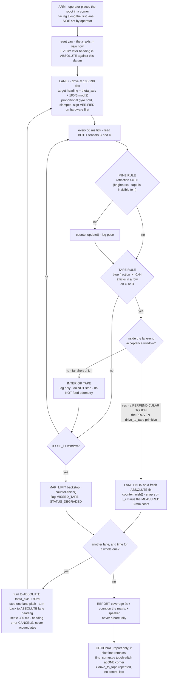

# Finding — is our line-following geometry viable? The numbers say no, and say what to do instead

**Date:** 2026-09-08 · **Demo Day:** 2026-09-10 · **Status:** ANALYSIS COMPLETE, no hardware touched
**Sources analysed:** [`examples/follow_tape.py`](../../examples/follow_tape.py) ·
[`examples/drive_to_tape.py`](../../examples/drive_to_tape.py) ·
`tmp/telemetry/20260908T112501-followtape-0000360435.csv` (44 rows, `TAPE_ENDED`) ·
`tmp/telemetry/20260908T114003-followtape-0000102164.csv` (670 rows, the circling run) ·
`tmp/telemetry/20260908T112500-drivetape-0000077369.csv` (53 rows, `TAPE_DETECTED`)
**Method:** every number below is recomputed from those CSVs on the host. Nothing was run on the robot.

---

## 1. TL;DR — the verdict, first

**Do not pursue line following for Demo Day.** Not because straddle-and-bounce is a bad control law —
it is actually *more* wobble-tolerant than a classic centre-follower, and § 4 shows the bounce loop has
~100× stability margin at 80 dps. Kill it for three harder reasons, in order:

1. **The proportional option is dead on the signal.** The usable linear region of the blue-fraction
   error signal is **4.6 mm of lateral sensor travel** [COMPUTED, § 3], against a
   **±12.5 mm** colour-sensor mount wobble ([wobble finding](./colour-sensor-mounting-wobble-2026-09-03.md),
   OPERATOR-REPORTED). The mechanical uncertainty in *where the sensor is* is **2.7× the whole span of
   the signal you would servo on**. Quantisation is the second problem, not the first (§ 2).
2. **Straddle-and-bounce is a very poor boundary estimator anyway.** At the MEASURED 1.6–2.6° heading
   wander it supplies only **3.3–5.3 absolute boundary fixes per 3048 mm side** [COMPUTED, § 5].
   Touch-stitching, already written in [`examples/find_corner.py`](../../examples/find_corner.py),
   supplies **~14.7** on the same side using the primitive that is already PROVEN on hardware.
3. **Following the boundary finds no mines.** The perimeter is 12 192 mm; walking it costs
   **1.3–3.7 min** [COMPUTED] out of a slot that
   [border-trace-and-corners § 6.4](../plans/border-trace-and-corners-2026-09-08.md) already shows
   cannot complete the sweep. It is time spent producing zero coverage, and coverage is the deliverable.

**Recommended instead:** odometry lawnmower on an *absolute* per-lane gyro heading, with each lane
terminated by the PROVEN perpendicular tape touch. § 6 has the diagram. The single highest-value code
change for Demo Day is not a controller — it is **making `src/hub_color.py` read both sensors** (§ 7).

⚠ **One correction to the record before anything else:** the claim that *"corner detection still worked"*
in the circling run is **NOT supported by that run**. See § 5.3. The corner primitive is sound, but its
evidence comes from `drive_to_tape.py`, not from `follow_tape.py`.

---

## 2. The margin problem, answered from the quantisation number

### 2.1 The number

`rgbi()` returns integer counts. On this carpet the three colour channels sum to only **64–84 counts**
(median 71 on port D, 78–79 on port C) [MEASURED, all three logs]. One LSB of the blue channel therefore
moves the blue fraction `b/(r+g+b)` by

> **d(b/T) per 1 LSB = (1 − f)/T = 0.0080 (port C, T = 79) to 0.0092 (port D, T = 71)** [COMPUTED]

Call it **~0.0085 blue-fraction units per ADC count**, i.e. roughly **one percentage point of blue
fraction per count**. Every quantity below is quoted in both units.

### 2.2 What that buys, and what it costs

| Quantity | Blue-fraction | In LSB | Source |
|---|---|---|---|
| Carpet ceiling → tape floor (the whole gap) | 0.408 → 0.476 = **0.068** | **8.0** | [MEASURED, surface survey](./runs/surface-survey-2026-09-08.txt) |
| Threshold 0.44 above carpet ceiling | 0.032 | 3.8 | |
| Threshold 0.44 below tape floor | 0.036 | 4.2 | |
| **Carpet's own peak-to-peak spread, port C, one 2.6 s run** | **0.3205 → 0.4078 = 0.0873** | **10.3** | MEASURED, follow_tape v1 |
| Carpet SD, port C / port D, same run | 0.0265 / 0.0101 | 3.1 / 1.1 | MEASURED |

**Read the bolded row against the row above it.** The carpet's own tick-to-tick spread on port C
(**10.3 LSB**) is *larger than the entire carpet-to-tape signal gap* (**8.0 LSB**). A proportional
controller's error signal would be, over most of its range, smaller than the noise it is riding on.

### 2.3 So: does quantisation force bang-bang?

**Quantisation alone does not** — 8 LSB is a workable ADC range for a crude P term, and a 2–4 count
resolution would be tolerable for a coarse steering nudge. **The carpet noise floor does**, and the
mount wobble (§ 3.3) buries it twice over. The honest ordering is:

> **quantisation is uncomfortable · carpet noise is disqualifying · mount wobble is decisive.**

That matters for the report: do not attribute the decision to the ADC. `MIN_CHAN_SUM = 40` in
`find_corner.py` is the right and sufficient response to quantisation — below ~40 counts a `1,1,2` read
gives exactly 0.500 and the fraction is garbage. Above it, the threshold rule works, and it has already
been PROVEN working while driving (`drive_to_tape.py`, untethered on battery).

**Bang-bang with a 2-in-a-row confirm is not a compromise here. It is the only estimator the SNR supports.**

---

## 3. What a partially covered sensor actually reads

### 3.1 Two different "ramps" were being conflated

**(a) The v1 "1.5 s ramp" is not evidence of partial coverage.** In
`20260908T112501-followtape`, port C climbed 0.333 → 0.408 between seq 15 (t = 885 ms) and seq 37
(t = 2509 ms) — 1.62 s and 72 mm of travel. But **0.408 is exactly the carpet's own measured maximum.**
The whole excursion stayed inside the carpet band. It is indistinguishable from carpet variation (and
the channel totals climbing 69 → 103 alongside it suggest a lighting/standoff change, not tape). **It
carries no trustworthy proportional information at all**, because nothing in it is provably tape.

**(b) The genuine edge crossing is in `drive_to_tape`, and it is sharp.** Perpendicular approach,
55 mm/s, 20 Hz — the transition is **3 samples, 159 ms, 7.8 mm of travel**, on both sensors independently:

| seq | mm | port C blue-frac | port D blue-frac |
|---|---|---|---|
| 45 | 144.6 | 0.3564 | 0.3750 |
| 46 | 147.4 | 0.3960 | 0.4198 |
| 47 | 149.6 | 0.4286 | 0.4607 |
| 48 | 152.4 | **0.4715** | **0.4783** |

[MEASURED]. The full swing is 0.1151 over 7.8 mm = **0.0148 blue-fraction per mm = 1.85 LSB per mm**
[COMPUTED]. That is a steep, well-resolved gradient — the opposite of "too shallow".

### 3.2 The answer to the question as asked

> **The ramp is real and informative — but only over 4.6 mm, which is smaller than the robot's own
> mechanical uncertainty.**

The band a setpoint controller could actually servo in runs from the carpet ceiling (0.408, below which
you cannot tell tape from carpet) to the tape floor (0.476, above which the signal saturates): 0.068
blue-fraction ÷ 0.0148 per mm = **4.61 mm of lateral sensor position** [COMPUTED]. Nine of those
millimetres do not exist; you get four and a half.

### 3.3 And 4.6 mm is the disqualifying number

The colour sensors are held by a single peg and pivot in a **~25 mm diameter circle**, i.e. **±12.5 mm**
([wobble finding](./colour-sensor-mounting-wobble-2026-09-03.md), OPERATOR-REPORTED, bench test BM-9
never run). So:

> **±12.5 mm of "where is the sensor" against a 4.6 mm linear region — a ratio of 2.7×.**
> The controller cannot know its own setpoint to within the width of its own control band.

An edge-follower *lives in the transition band*. This one would live entirely inside its own mechanical
error. Straddle-and-bounce, by contrast, only ever asks a binary question about a surface the sensor is
squarely on top of — which is why it survives the wobble and a P controller does not.

---

## 4. Speed: 80 dps is not the problem, and it is ~3× too slow

### 4.1 The bounce loop's stability margin at 80 dps [COMPUTED]

At `BASE_DPS = 80` / `TURN_DPS = 45` on the MEASURED 63.5 mm wheel and 95 mm track:

| | Value |
|---|---|
| Forward speed | 44.3 mm/s (2.2 mm per 50 ms tick) |
| Yaw rate while correcting | **11.7 °/s** (0.58° per tick) |
| Time to null a 5° heading error | 0.43 s, 19 mm of forward travel |
| Extra lateral creep during that correction | **0.83 mm** |
| Lateral overshoot from one tick of detection latency at 5° | **0.19 mm** |

Against a 24 mm tape those overshoots are **~1–2 % of the target**. Add the MEASURED **3 mm coast after
trigger** and total penetration into the tape is ~4 mm out of 24. **The straddle bounce at 80 dps has
roughly 100× stability margin. It is nowhere near its limit.**

### 4.2 Samples across the features, as a function of speed [COMPUTED, 20 Hz]

| Speed | mm/tick | samples on a 24 mm tape | samples inside the 7.8 mm edge band |
|---|---|---|---|
| 44 mm/s (80 dps, follow_tape) | 2.2 | 10.8 | **3.5** |
| 55 mm/s (100 dps, the only speed ever driven) | 2.8 | 8.7 | 2.8 |
| 160 mm/s | 8.0 | 3.0 | **1.0** |
| 300 mm/s (the sweep-budget speed) | 15.0 | **1.6** | 0.5 |

Two readings of this table:

* **80 dps is the reason the edge is resolved at all.** 3.5 samples in the transition band is what
  produced the clean 3-step ramp in § 3.1. At 160 mm/s you get one graded sample; at 300 mm/s, none —
  **so any proportional scheme dies at the speed the coverage budget requires**, independently of § 3.
* **The tape detector, not the motors, sets the ceiling.** To guarantee *N* consecutive samples on a
  tape of width *W* at rate *f*: `v ≤ W·f/N`. On 24 mm tape at 20 Hz that is **240 mm/s (433 dps) for
  N = 2**, and **160 mm/s (289 dps)** on the more conservative `W·f/(N+1)` phase allowance that
  [border-trace-and-corners § 6.3](../plans/border-trace-and-corners-2026-09-08.md) already adopted.
  ⚠ Its flush caveat stands: at `flush_every = 10` the worst tick is ~110 ms and the honest cap drops to
  **~70 mm/s**; `find_corner.py` passes `flush_every = 25` for exactly this reason.

### 4.3 The number to quote

> **80 dps (44 mm/s) is not too fast — it is about 3× below the detector's own limit, and the binding
> constraint at that speed is the schedule, not control.** For any tape-terminated driving, cap at
> **160 mm/s (≈ 290 dps) with `flush_every ≥ 25`**, and never above **240 mm/s (433 dps)** at 20 Hz on
> 24 mm tape. **Measure the tape width** (KU-P14, still OPEN) — it is the numerator of every cap here.

---

## 5. Is straddle-and-bounce sound, and what is the standard technique?

### 5.1 The straddle geometry, fairly stated

| | Value |
|---|---|
| Sensor spacing `S` | **> 76 mm [MEASURED lower bound only]** — one 76 mm note can never cover both ([port-map](../hardware/port-map.md)). Exact spacing **[UNMEASURED]**, and `SENSOR_SPACING_MM` does not exist in [`src/mission_config.py`](../../src/mission_config.py) |
| Tape width `W` | 24–48 mm [ASSUMED range], **unmeasured** |
| Straddle half-deadband `(S − W)/2` | **26 mm** at S = 76 / W = 24 · 14 mm at S = 76 / W = 48 · 43 mm at S = 110 / W = 24 |

**The one genuine merit of straddling, which should be said out loud:** because the robot only ever asks
"is this sensor squarely on tape?", a ±12.5 mm wobble excursion produces a *false bounce* (steer away
from a line you are near — mild and self-limiting), not a *sign inversion*. Inverting the sign would
need a wobble larger than the 26 mm half-deadband. Straddle-and-bounce is therefore **strictly more
wobble-tolerant than centre-following or edge-following**, which is why the geometry was not a silly idea.

### 5.2 But it is a poor boundary estimator, and that is what sinks it

A bounce is the *only* absolute position fix the robot gets. The interval between bounces is
`deadband / tan(heading error)`:

| Heading error | Distance between fixes | Fixes per 3048 mm side |
|---|---|---|
| 1.6° (the drift figure that costs 85 mm over 3048 mm) | 931 mm | **3.3** |
| 2.6° (MEASURED yaw wander, drive_to_tape) | 573 mm | 5.3 |
| 5.0° | 297 mm | 10.3 |
| **Touch-stitching** (`find_corner.py`, 120 mm retreat at 30°) | **208 mm** | **14.7** |

[COMPUTED]. **Touch-stitching gives 3–4× the boundary fix rate of straddle-following, using a primitive
that has already run untethered on battery**, with no control law, no gain, no sign to get wrong, and
no heading read while moving. Between its fixes the robot is on the gyro either way — so following buys
nothing the touches do not, and costs a feedback loop.

Outside practice agrees on the shape of the tradeoff rather than on straddling: the standard advice is
that a sensor array should span **1.5–2× the line width** and individual sensors should sit **closer
together than the line is wide**, precisely so an error signal exists at all
([42 Electronics](https://42electronics.com/blogs/learn-more/configuring-line-sensors-on-your-robot),
[ThinkRobotics](https://thinkrobotics.com/blogs/learn/pid-tuning-for-line-follower-robot-complete-how-to-guide)).
The canonical single-sensor technique is **edge following** — hold one sensor at a partial-coverage
setpoint, because the edge disambiguates which side you are on where the line itself cannot
([Inpharmix, PID for LEGO Mindstorms](https://www.inpharmix.com/jps/PID_Controller_For_Lego_Mindstorms_Robots.html)).
**That is the option § 3 rules out on our hardware**, on the 4.6 mm number, not on principle. And the
coverage literature is consistent with dropping perimeter-following entirely: boustrophedon /
lawnmower coverage is the standard for area coverage, with boundary-following a *separate* behaviour
used to close the edges, not the main pass
([Spiral-STC and the coverage-planning review](https://www.researchgate.net/publication/356084072_A_Comprehensive_Review_of_Coverage_Path_Planning_in_Robotics_Using_Classical_and_Heuristic_Algorithms)).

### 5.3 ⚠ The circling run does NOT show corner detection working

From `20260908T114003-followtape` (`corners=3 rows=670 corrections=89 deg=3842`):

* Left encoder 3842° vs right 1490° — a **fixed 2.55:1 ratio for the whole run**. That is a circle of
  **radius 107.7 mm** about the robot centre, **2.18 laps** in 40 s [COMPUTED from the encoders].
  The robot pirouetted in a 21 cm circle. It never went near a corner.
* Blue-threshold ticks: **port C (right) 180 · port D (left) 66 · BOTH 24**, of 670. Both-sensors-blue
  fired at **9 distinct instants** spread across the run (t ≈ 10.8, 13.4, 23.9, 27.9, 36.4, 36.7, 37.6,
  39.4, 40.3 s). Only 3 became "corners" — the rest were eaten by `CORNER_LOCKOUT_MS`.
* **Those are oblique crossings of one straight tape by a spinning robot, not corners.** Reporting
  `corners=3` from this run as evidence the corner rule works would be reporting a false positive as a
  result. It should not go in the Intro Report that way.

**What IS good evidence, and it is strong:** in `drive_to_tape` the robot approached the tape
perpendicular and **both sensors crossed threshold on the same tick** (seq 48, C 0.4715 / D 0.4783
[MEASURED]). That is *exactly* the geometry of an L-corner seen while straddling leg 1 — leg 2 crosses
the path perpendicular, so both sensors meet it simultaneously. **The corner primitive is sound, and it
is just `drive_to_tape` pointed at the far leg.** Its evidence is the run that worked, not the run that
circled.

### 5.4 A defect in `follow_tape.py` that survives the sign fix

`HOLD_SIGN = -1` and the divergence guard address the runaway, and both are still **[UNVERIFIED on
hardware]** — but there is a second, independent problem in the same loop. Both correction branches do:

```
hold_ref = yaw if yaw is not None else hold_ref
```

`yaw` there is the heading **at the instant the tape was touched** — i.e. the heading that was carrying
the robot *into* the tape. Once the bounce ends and control returns to the else-branch, the heading hold
steers back to that same drifting heading. The robot therefore re-touches, bounces, re-datums to the
drifting heading again: **a forced limit cycle pinned against one edge, not a recovery to centre.**
Both branches datum identically, so there is no asymmetry to push it back into the middle of the gap.
If the follower is ever revived, the datum must be taken *after* the correction completes, or the
correction must be a fixed heading offset rather than a re-datum. (Recorded here for the record; this
workflow does not edit `examples/`.)

---

## 6. Recommendation — and the diagram

**For Demo Day (2026-09-10): no line following.** The boundary is handled by *discrete perpendicular
touches plus odometry*, which is what the repo already decided
([minimalism-contract § 4 item 4](../plans/minimalism-contract-2026-09-03.md),
[border-trace-and-corners § 3](../plans/border-trace-and-corners-2026-09-08.md)) and what
[`examples/find_corner.py`](../../examples/find_corner.py) already implements. This analysis does not
overturn that earlier conclusion — it supplies the numbers it was missing, and it *narrows* it: the
earlier verdict said "too marginal"; the correct statement is **"the linear region is 4.6 mm against
±12.5 mm of mount wobble, and the perimeter is not where the mines are."**

**Weighing the counter-argument fairly:** the corner detection genuinely working *would* have been a
reason to keep the follower. § 5.3 shows it did not work in that run, and § 5.2 shows that even if it
had, the follower delivers 3.3 boundary fixes per side where touch-stitching delivers 14.7. There is no
version of the evidence in which following wins.



**Why every turn is commanded to an absolute heading, not a relative ±90°:** a 1.6° heading error costs
85 mm of cross-track drift over 3048 mm — wider than a 76 mm note, so a note inside the lane is missed.
An absolute target **cancels** the previous lane's error; a relative turn **accumulates** it. This is the
same argument the 1 ft square already MEASURED: sum of four turns was −389.7° instead of −360°, and a
30° final heading error.

---

## 7. What to actually spend the two days on, ranked

| # | Action | Why it beats a controller |
|---|---|---|
| **1** | **Make `src/hub_color.py` read `SECOND_COLOR_PORT` as well as `COLOR_PORT`.** It is declared in `hub_api.py` and referenced **nowhere** in `src/` — the mission code is a **one-sensor robot** today | Halves the sweep: 75 lanes / 229 m → 38 lanes / 116 m [COMPUTED, `src/mission_config.py`]. ⚠ Do **not** raise the lane pitch until both ports are genuinely read every tick — that is the one change that silently loses mines |
| **2** | Verify the `HOLD_SIGN = -1` fix and the divergence guard **only if** the gyro hold is used by the lawnmower (it should be) — on the bench, one short run, watching | Both are [UNVERIFIED]. The lawnmower needs a heading hold even though it needs no line follower. See [guard-every-feedback-loop](../lessons_learned/guard-every-feedback-loop.md) |
| **3** | **Measure the tape width** with a ruler (KU-P14) and **measure the sensor spacing** (`SENSOR_SPACING_MM` does not exist in `config.py`) | Both are numerators of the speed cap and the lane pitch. Two ruler readings delete two [ASSUMED]s |
| **4** | Run `find_corner.py` once at a corner and once mid-edge | `EDGE_STRAIGHT` is a result, not a failure — the two runs together are the demonstration. [Runbook](../runbooks/corner-demo.md) |
| **5** | Have the Builder hand-measure the arena rectangle | Supplies the lane-end acceptance window in 30 s at zero run-time cost, and the window is the honestly weak part of § 6 |
| — | ~~Tune a line follower~~ | 4.6 mm of linear region against ±12.5 mm of wobble |

## 8. Open, and honest about it

* **`SENSOR_SPACING_MM` [UNMEASURED].** Every deadband figure in § 5.1 uses the > 76 mm lower bound, so
  the real deadband is *at least* as good as quoted — this does not change the verdict, but it does mean
  the "26 mm" is a floor, not a measurement.
* **Tape width [UNMEASURED]**, quoted as 24–48 mm. At 48 mm the speed cap doubles (480 mm/s at N = 2)
  and the straddle deadband nearly halves (14 mm) — the two move in opposite directions, so measuring it
  is worth more than any tuning.
* **The ±12.5 mm wobble is OPERATOR-REPORTED**, never bench-measured (BM-9). It is the load-bearing
  number in § 3.3. If BM-9 came back at ±3 mm, edge following would deserve a second look — *after*
  Demo Day.
* **`HOLD_SIGN = -1` and the divergence guard are [UNVERIFIED on hardware].**
* **docs-rag was not consulted for this analysis** (the query was interrupted by a host timeout); the
  repo context above came from reading the plans and findings directly.

**Related:** [border-trace-and-corners](../plans/border-trace-and-corners-2026-09-08.md) ·
[colour-survey-and-first-detection](./colour-survey-and-first-detection-2026-09-08.md) ·
[colour-sensor-mounting-wobble](./colour-sensor-mounting-wobble-2026-09-03.md) ·
[minimalism-contract](../plans/minimalism-contract-2026-09-03.md) ·
[guard-every-feedback-loop](../lessons_learned/guard-every-feedback-loop.md) ·
[port-map](../hardware/port-map.md) · [surface survey](./runs/surface-survey-2026-09-08.txt)
