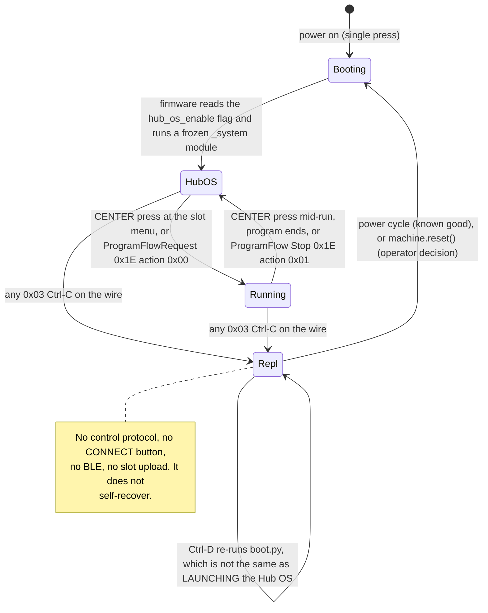
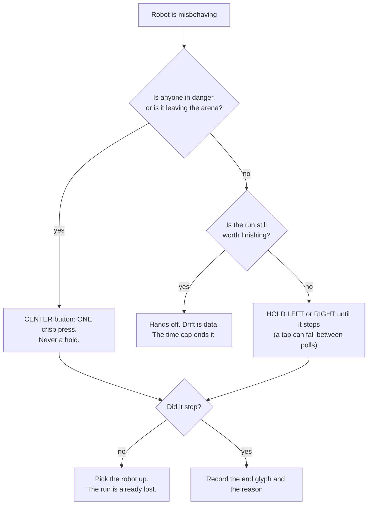

# Finding — stopping the robot, and getting the Hub OS back without the power button

**Date:** 2026-09-08 · **Hub:** none — **no hardware was touched for this work.** The operator was
running live demos. Every hub-side behaviour below is **[UNVERIFIED — no hardware]** unless it cites
an earlier measurement. Everything about *this repo* was checked on the host by reading the code and
running host-only computations, and is marked **[COMPUTED, host]**.

Extends [hub-os-vs-repl-2026-09-08.md](./hub-os-vs-repl-2026-09-08.md), which established *why* the
Hub OS dies. This one answers the operator's two questions: **how do we stop power-cycling**, and
**how do we stop the robot.**

## 1. The lifecycle, as far as the sources go

**What is MEASURED** (2026-08-27 baseline capture, `docs/archives/hub-baseline/`): `/flash/boot.py` is
five lines and only sets `hub.config["hub_os_enable"] = True`; the frozen module list contains
`_system/default`, `_system/menu`, `_system/scratch`, `_system/test_selector`; `dir machine` is
`['bootloader','idle','reset','reset_cause','soft_reset','unique_id']`; free heap at rest is 211 776 B
with only 2 048 B allocated — and that capture was taken *after* a Ctrl-C, i.e. with the Hub OS's own
objects already unwound.

**What is INFERENCE, and stated as such:** the Hub OS is an ordinary MicroPython application holding
the single VM as the foreground script, not a background service. The evidence is that a 0x03 byte
produces a `>>>` prompt — a `KeyboardInterrupt` can only interrupt Python running under `pyexec`, and
what is left behind is the prompt that script was occupying. **Consequence: the Hub OS and any
REPL/paste program are the same single-slot resource. There is no arrangement in which both run.**

## 2. What is actually costing the power cycles — and it is not what we assumed

**[COMPUTED, host]** Six tools open the port by writing `b"\x03"`: `probes/_hubio.py`,
`probes/encoders.py`, `hub_programmer/upload.py` (`Session.wake()`, line 68), `hub_programmer/run.py`,
`scripts/identify_hub.py`, and `scripts/restore-hub-os.py` (deliberately). `hub_programmer/download.py`
inherits it — it imports `Session` from `upload.py` and calls `sess.wake()` at line 212.

Two separate defects, ranked by how much they actually cost **today**:

| | What | Cost | Fix |
|---|---|---|---|
| **1** | **`download.py` is the Ctrl-C in the live loop.** `tmp/telemetry/` holds **90 CSVs pulled on 2026-09-08 in ~20 distinct mtime groups** between 10:30 and 12:35 [COMPUTED, host — `ls` on the retrieved files]. Every one of those retrieves killed the Hub OS. That is the "several times an hour". | one power cycle per retrieve | **Batch the retrieves.** Run every attempt, then **one** `download.py --all` at the end of the session: one power cycle instead of twenty. Purely procedural, available now. |
| **2** | **`deploy_deps.py --apply` cannot succeed without a power cycle in the middle.** It runs *N* × `upload.py <dep> --apply` (each sends Ctrl-C) and **then** `slot_upload.py <entry> --apply`, which asks the now-dead Hub OS to prove its identity. Step *N*+1 must abort at `[2] identity` with exit 2, deterministically [COMPUTED, host — `deploy_deps.py:152-176` read end to end]. | one power cycle per full deploy | `/flash/lib` persists across boots (ADR-0007), so when **only the entry program changed**, run `slot_upload.py` **alone** — it sends no Ctrl-C at all. |

⚠ Defect 2 is real but is probably **not** what the operator is hitting: `deploy_deps.py --apply`
prints "[UNVERIFIED] the --apply orchestration is unrun on hardware" in its own banner, there is no run
record of it in [runs/](./runs/), and every program run on 2026-09-08 resolves **one** dependency
(`hub_telemetry_log`), which already lives in `/flash/lib`. **Fix defect 1 first.**

**Already fixed, do not re-solve:** `scripts/scan-surface.py` runs through the slot + `ConsoleNotification 0x21`
path and sends no Ctrl-C. **Cannot be fixed as-is:** `download.py` — LEGO's protocol is upload-only,
there is no file-read or directory message ([slot-execution-and-live-motor-control-2026-09-03.md § 4](../research/slot-execution-and-live-motor-control-2026-09-03.md)).
The one route left for it is indirect: a slot program that `print()`s the file (base64 + a hub-computed
SHA-256, the same trick ADR-0007 uses in the upload direction) and read it back over `0x21`. A mission
log is **4 173 B** [COMPUTED, host — `tmp/telemetry/20260908T103023-drivetape-0000077369.csv`], ~6 KB of
base64, ~30 console lines — an order of magnitude smaller than the 22–35 KB fusion logs this idea was
previously sized against and rejected on. **Not implemented here** (it is new hub-side code two days
before the demo), but it is the change that would remove the last Ctrl-C from the demo loop.

## 3. Recovery options, ranked, with the safety classification

| # | Option | Safety classification | Status |
|---|---|---|---|
| **R0** | **Avoidance** — batch the retrieves; `slot_upload.py` alone when only the entry changed; `scan-surface.py` already re-plumbed | **Safe.** Host-side choices. No blacklist item is touched, no extra byte reaches the hub | **The recommendation.** Available now, no code |
| **R1** | **Read-only diagnosis at the prompt you already have** — `machine.reset_cause()`, `hub.config` | **Safe.** Both return a value and change nothing. Deadline-bounded reads (blacklist item 4) | **IMPLEMENTED** in `restore-hub-os.py`, [UNVERIFIED] |
| **R2** | **In-place relaunch** — `import _system.default as d; print(dir(d))`, then call an entry point if one is there | Import runs the module's top-level code; a partial re-init of BLE/USB could confuse the hub. Writes nothing, so it cannot leave persistent state. Recoverable by the power cycle we already have | **OPERATOR DECISION.** Deliberately *not* automated |
| **R3** | **Ctrl-D soft reset**, verified by protocol and retried | **Safe.** Restarts the MicroPython *interpreter*, not the firmware ([firmware-integrity-proof.md](./firmware-integrity-proof.md)) | **IMPLEMENTED**, [UNVERIFIED] — and now it *captures* what the REPL says (§ 5) |
| **R4** | **`machine.reset()`** behind a flag on the host tool | **Not a blacklist violation** (§ 4) — but a hub state change on shared equipment, with two hard preconditions | **OPERATOR DECISION + ADR.** Not implemented |
| **R5** | **Physical power cycle** — single press off, single press on | Known-good | **Fallback of record.** It stays the fallback |

**Ruled out, with reasons:**

- **Writing `hub.config["hub_os_enable"] = True`** — it is a **no-op**: `boot.py` sets that flag on
  every boot and a `KeyboardInterrupt` does not reach into the config mapping to clear it. And it is
  not free: `/flash/config/` is a real directory on our hub holding exactly one settings file
  (`hubname`), so a write there may persist a setting on shared course equipment. Zero upside, non-zero
  downside. **Do only its read-only half — `print(hub.config)` — which R1 now does automatically.**
- **DTR/RTS toggling or a 1200-baud touch** — bootloader-adjacent, already rejected, **do not
  resurrect.** (It is also worthless on the merits: the 1200-baud touch is an Arduino SAMD/AVR109
  idiom with no STM32 DFU meaning.) ⚠ **Do not "harden" this either:** pyserial asserts DTR and RTS on
  every port open by default, so every tool we have has always done so across dozens of clean sessions.
  The rule means *no deliberate toggling*, not *passive assertion is a hazard*. Adding `dtr=False`
  would be an untested change to a proven path.
- **A protocol "restart the Hub OS" message** — does not exist in LEGO's message table.
- **`hub.power_off()`** — present on our hub, but it performs only the OFF half and still needs a
  physical press to come back. Strictly worse than the power cycle it would replace.

## 4. `machine.reset()` — the blacklist argument in full

It is **not** a violation of any of the four items, and the reasoning has to be on the record because
the call sits one identifier away from one that *would* be:

- **Item 1 (stock firmware; no DFU, bootloader, format, factory reset).** A hard reset restarts the
  MCU from the stock firmware's own reset vector and executes the same unmodified image. It does not
  erase, write, or re-enter program flash. `machine.bootloader()` is the separate, adjacent call that
  enters DFU — **it is never sent, never typed, and never placed in any source string.**
- **Item 2 (the CONNECT-while-plugging-USB gesture).** A physical button gesture; not involved.
  ⚠ **One honest caveat:** SPIKE hubs enter DFU by holding CONNECT *as the hub starts up*, and whether
  a warm software reset re-runs that same start-up button check is **[UNVERIFIED — no source found
  either way]**. The published procedure needs the hub **off** and the cable inserted while holding,
  and a warm reset does not re-attach USB — which argues against the hazard, but that is inference.
- **Items 3 and 4.** No update prompt; the call would live in a `scripts/` helper with a deadline.

**Two preconditions, and they belong in code, not in a docstring:**

1. **The tool must refuse unless its own `hub_os_alive()` has just returned `False`.** A reset while
   something is writing to `/flash` risks corrupting the filesystem, and the documented recovery for a
   corrupt filesystem is a reformat — which item 1 forbids by name. If the Hub OS is dead, no slot
   program is running and nothing can be writing; if it is alive, there is no reason to reset.
   *(Mitigating, and worth confirming: `dir vfs` on our hub exposes `VfsLfs2` and **not** `VfsFat`, so
   `/flash` is very likely LittleFS v2 — copy-on-write and power-fail resilient — not the FAT that
   [firmware-integrity-proof.md](./firmware-integrity-proof.md) calls it. That inconsistency should be
   resolved rather than leaned on.)*
2. **Nobody touches the hub while the reset is issued**, because of the item-2 caveat above.

**Scope, non-negotiable if it is ever adopted:** the literal expression lives in exactly **one**
reviewed host script and nowhere else. `run.py`'s `FORBIDDEN` screen on uploaded program source
(`machine.reset` / `machine.soft_reset` / `machine.bootloader` / `hub_os_enable`) must **not** be
relaxed, and neither must `slot_upload.py`'s `FIRMWARE_IDS` refusal or its identity check. Those
screens exist precisely because a typo in an experiment must not be able to reach
`machine.bootloader()`; a fixed literal in a reviewed tool invoked deliberately behind a flag is a
different risk class, and that distinction only holds if the screens stay.

## 5. Stopping a running program

The demo runs **untethered**: `slot_upload.py --apply` starts the program, the USB cable comes **out**,
the Builder taps LEFT/RIGHT, the robot runs on battery. **For the whole window in which a stop could be
needed, `/dev/spike` does not exist** — so every host-side stop below is a **bench tool**, not a
demo-day tool.

The reassuring number nobody had written down: the robot drives at **~55 mm/s** (MEASURED — 100 dps on
the MEASURED 63.5 mm wheel) and coasts **~3 mm** after a stop command (MEASURED 2026-09-08). The 40 s
circling incident therefore covered ~2.2 m of arc. **A walking operator outruns it in any 10×10 arena
of any plausible unit.** That is what makes a CENTER-button-only untethered stop acceptable.

| Rank | Stop | Depends on | Classification |
|---|---|---|---|
| **1** | **CENTER button, one crisp press** — the firmware's own stop, owned by the Hub OS program manager, not by our loop | the Hub OS being alive | **Stop of record.** ⚠ **[UNVERIFIED — never observed stopping one of *our* programs on our hub.]** Two sub-questions are open: can it break a *tight synchronous* loop, and does our `finally` run (trailer written) or is the VM killed dead? |
| **2** | **HOLD LEFT or RIGHT** until it stops | our loop still polling | Works today. `button.pressed()` returns **milliseconds held**, sampled once per tick (50–100 ms) — **a tap can fall between two polls and be silently lost**, which is why it is a hold |
| **3** | **Run time cap** (`RUN_CAP_MS`) | our loop still ticking | The true last line of defence. ⚠ **Do not cut it to a blanket 15–20 s**: each cap is sized to its own program's distance budget (`find_corner` is 120 s because its runbook budgets 50–90 s per attempt) and a blanket cut would abort every good run and look like a logic failure |
| **4** | **Host `ProgramFlowRequest 0x1E` action `0x01` = Stop** over USB — `scripts/stop-program.py` | the cable being in | **Bench only** (the demo is untethered). Frame layout primary-sourced from LEGO's `enums.rst` + `messages.rst` id 30, cross-checked against a shipping Hub-OS-3 client. **[UNVERIFIED — never run against our hub]** |
| **5** | **The same 5 bytes over BLE** (service FD02; 5 bytes fits the negotiated 23-byte MTU with room to spare) | BLE being unparked | **OPERATOR DECISION — design only.** Recommend not before 10 SEP |
| **6** | **Re-armed `motor.run_for_time()` dead-man** — the only measure that survives a genuinely hung loop, because the firmware cuts the motors ~300 ms after the last tick that fed them | nothing | **OPERATOR DECISION.** It rewrites the drive primitive behind our only measured straightness numbers, and needs a wheels-off bench test for stutter first |

**A program cannot use CENTER as its own input** — the firmware owns it mid-run. The LEFT/RIGHT
convention is therefore correct and is not a style choice; do not "improve" it later.

## 6. A defect found in `scripts/stop-program.py`, and fixed

The tool's header claimed LEGO's XOR-COBS framing "cannot emit 0x03 or 0x04". **Only the first half is
true** [COMPUTED, host, with the repo's own `probes/_cobs.py`]:

- **0x03 is genuinely impossible.** COBS never emits a byte below 0x03 pre-XOR, so `b ^ 3 == 0x03`
  is unreachable. **A control-protocol tool cannot send Ctrl-C.** That claim survives.
- **0x04 is not.** It needs only a pre-XOR `0x07`, which is ordinary encoder output — and it occurs:
  the Stop frame for **slot 7** packs to `5b 1d 07 04 02`, a literal Ctrl-D. (The **Start** frame
  `slot_upload.py` already sends for slot 7 has the same property: `07 1d 07 04 02`.)

Practical exposure is small — the byte is written only after identity was proven over the control
protocol, i.e. to a Hub OS that is alive and consuming the stream as *frames*, where it is inert
payload. But a false absolute in a docstring is how a future tool inherits the belief and reuses it in
the one place a REPL **is** at the prompt. Fixed by checking every frame immediately before it is
written. **Consequence, stated plainly: `stop-program.py` will not stop slot 7 — press CENTER for that
one.** `slot_upload.py` was **not** touched; it is shared with the main session, and its Start path is
proven working.

## 7. What was implemented here

| File | Change |
|---|---|
| `scripts/stop-program.py` | `wire_safe()` checks every **frame** (not the payload) for 0x03/0x04 immediately before `ser.write()`; an unsafe frame is skipped with "press CENTER" rather than sent. Header corrected — the absolute claim is replaced by what is actually true, plus the slot-7 consequence |
| `scripts/restore-hub-os.py` | The post-Ctrl-D REPL text is no longer thrown away by an immediate `close()`. Two **read-only** diagnostics (`machine.reset_cause()`, `hub.config`) are taken at the prompt first, then ~5 s of output is captured after the soft reset, printed, and written to [runs/](./runs/). `MPY: soft reboot` in that capture proves the reset fired; a traceback names why the Hub OS did not return. Every read is deadline-bounded |
| `docs/runbooks/competition-start-stop.md` | **New** — the operator card: which button does what, the start gesture, the stop, and Hub OS recovery. It was already referenced by `examples/competition_start.py:18` and did not exist |
| `docs/runbooks/deploy-with-deps.md` | Extended with the § 2 ordering defect and the avoidance rule, rather than a competing runbook |

**Nothing in `src/` or `examples/` was edited, no git command was run, and no hardware was touched.**
Host-side checks: both scripts compile and import; `wire_safe()` was exercised over all 20 slot frames
and rejects exactly slot 7; usage errors still exit 64 without opening the port; `./scripts/check-docs.py`
passes.

## 8. OPERATOR DECISIONS — ask, do not do

1. **Adopt `machine.reset()` as a `--hard` flag on `restore-hub-os.py`?** Not a blacklist violation
   (§ 4), near-certain to work, needs an ADR — **and an interlock that refuses to fire unless
   `hub_os_alive()` has just returned `False`**, plus "hands off the hub" printed by the tool.
2. **Probe an in-place Hub OS relaunch (R2)?** `import _system.default as d; print(dir(d))` at a
   prompt where the Hub OS is already dead. Writes nothing; would be the best outcome available
   (recovery with no reset at all). The *calling* of any entry point found is a second decision.
3. **First run of `scripts/stop-program.py`?** It touches hardware and the operator is mid-demo. First
   use should be a deliberate wheels-off test, not an emergency. `/dev/spike` is exclusive — a
   `--listen` session holding the port will block it.
4. **Unpark BLE for an untethered stop?** Recommendation: **no, not before 10 SEP.**
5. **Adopt the `motor.run_for_time()` dead-man?** Bench-test wheels-off for stutter first.
6. **Build the console-based file download** (§ 2), which would remove the last Ctrl-C from the demo
   loop? Recommendation: **after Demo Day**, and note that the 4 KB mission log makes it much cheaper
   than the earlier 30 KB estimate implied.

**Rejected outright, no decision needed:** the `hub.config` **write**; DTR/RTS or a 1200-baud touch;
`machine.bootloader()`; `hub.power_off()`; relaxing any identity, `FIRMWARE_IDS` or `FORBIDDEN` screen;
a blanket `RUN_CAP_MS` cut.

## 9. What to run when the hub is free

1. **§ 8 of [hub-os-vs-repl-2026-09-08.md](./hub-os-vs-repl-2026-09-08.md), as written.** It is already
   built and settles whether the soft reset works at all. It now also yields `reset_cause`, `hub.config`
   and the post-Ctrl-D transcript for free, filed under [runs/](./runs/).
2. **The three-minute button test, wheels off the floor.** Upload a driving program to a slot
   **without** starting it, unplug USB, navigate to the slot, single-press CENTER. Record: (a) does it
   **launch** from the button (this is Demo Day action A2 RESTART, and it has never been observed);
   (b) press CENTER again mid-run — do the motors stop, does the matrix return to the menu; (c) is
   there an `#end reason=` trailer afterwards, which tells you whether the firmware stop runs our
   `finally` or kills the VM dead. Then repeat with a deliberately hung loop.
3. **`./scripts/stop-program.py 0`** against a wheels-off driving run, from a terminal that is **not**
   holding the port. Record whether `ProgramFlowResponse 0x1F` comes back Acknowledged.

**Related:** [hub-os-vs-repl-2026-09-08.md](./hub-os-vs-repl-2026-09-08.md) ·
[firmware-integrity-proof.md](./firmware-integrity-proof.md) ·
[../runbooks/competition-start-stop.md](../runbooks/competition-start-stop.md) ·
[../runbooks/deploy-with-deps.md](../runbooks/deploy-with-deps.md) ·
[../research/hub-menu-and-buttons-2026-09-03.md](../research/hub-menu-and-buttons-2026-09-03.md) ·
[../lessons_learned/dont-interrupt-the-hub-os-if-you-want-bluetooth.md](../lessons_learned/dont-interrupt-the-hub-os-if-you-want-bluetooth.md)
