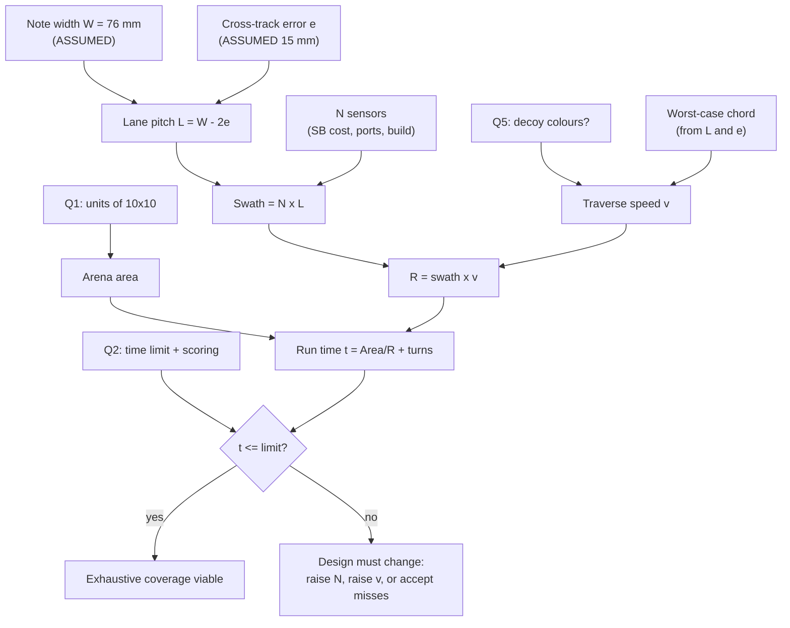
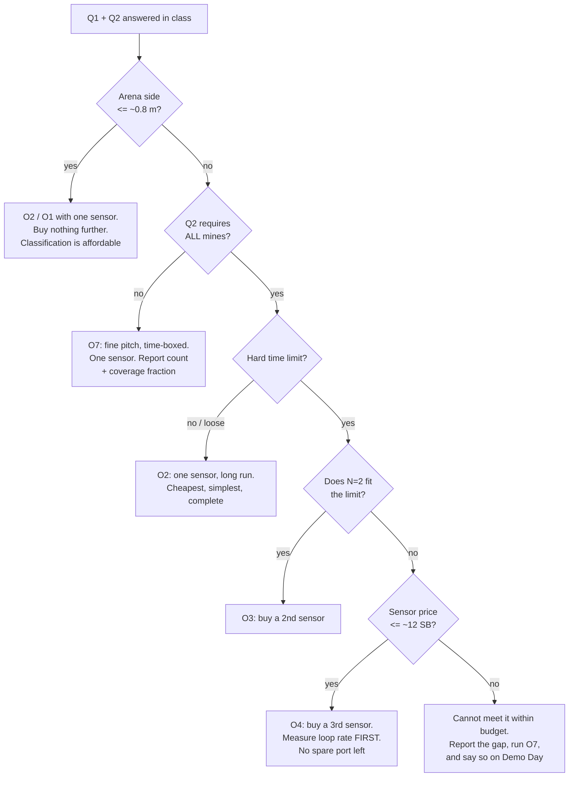

# Trade Study — Coverage Strategy

**Type:** FORWARD-PLAN (decision-support) · **Created:** 2026-08-25 · **Status:** open — the winner is
selected by the professor's answers to Q1 and Q2, not by this document
**Decides:** how the robot achieves floor coverage, and therefore how many colour sensors the Supplier buys
**Does not decide:** the sweep *pattern* (boustrophedon, already settled on evidence —
[../research/detection-and-sweep-techniques.md § Coverage pattern comparison](../research/detection-and-sweep-techniques.md#coverage-pattern-comparison)),
nor detection *mode* (reflected light, already settled).

Governing arithmetic: [../findings/coverage-time-budget.md](../findings/coverage-time-budget.md) —
not restated here, extended. Open questions: [./questions-for-the-professor.md](./questions-for-the-professor.md).
This study is the mitigation artifact for **R-01** in [./risk-register.md](./risk-register.md).

---

## 1. Read this cell and start building

Cross Q1 (units) with Q2 (scoring). Full table with reasoning in [§10](#10-the-decision-table).

| | **Q2 = "find all", loose/no limit** | **Q2 = "find all", hard limit (≈3–5 min)** | **Q2 = "most found in the time"** |
|---|---|---|---|
| **Q1 small** (≤ ~0.8 m) | **O1** — 1 sensor, classify | **O1** — 1 sensor, classify | **O1/O2** — 1 sensor (per [§10](#10-the-decision-table): O1 at 10 in, O2 at 0.76 m) |
| **Q1 mid** (~1.5 m) | **O2** — 1 sensor | **O3** — 2 sensors | **O7** — 1 sensor, time-boxed |
| **Q1 large** (~3 m: 10 ft / 10 tiles) | **O2** — 1 sensor, long run | **O4** — 3 sensors (and it is tight) | **O7** — 1 sensor, time-boxed |

**Every cell in the "loose limit" and "most found" columns needs exactly one colour sensor.** Only the
middle column — *all* mines *and* a clock — justifies buying a second or third. That is the entire
purchasing consequence of this study, and it is why the answer to Q2 is worth Schrute Bucks.

**Standing recommendation to the Supplier, valid before any answer arrives:** buy **one** colour sensor
now. It is the only thing that unblocks measurements **2 and 3** of [§11](#11-what-must-be-measured)
(achieved loop rate, `D_spot`), it is needed under every cell of the table, and sell-back costs ~10 % if we are wrong
([§8.2](#82-schrute-bucks)). Buying the 2nd and 3rd is a decision that **waits for Q1 + Q2**.

**Standing recommendation to the Programmer:** build the run-time policy of **O7** (fine pitch, stop on a
timer, report coverage fraction with the count) regardless of which option wins. It is ~20 lines, it is
strictly additive, and it converts "ran out of time" from a zero into a partial score under every scoring
rule. See [§7.3](#73-o7-dominates-o6-coarsening-the-lanes-buys-nothing).

---

## 2. The problem in one equation

A downward colour sensor is a **point**, not a swath — the finding's central result. Everything in this
study follows from turning that into a rate:

```
R  =  swath × v            area coverage rate, mm²/s
t  =  Area / R  +  turns   run time
```

`swath = N × L` for `N` sensors on a rigid bar spaced at lane pitch `L`. So **the only two levers that
change run time are the number of sensing lines `N` and the traverse speed `v`** — and `L` is pinned near
46 mm by the note width and cross-track error, not chosen freely. Everything below is a way of moving `N`
or `v`, and each way has a different bill.



The diagram is the argument: **Q1 sets the numerator, Q2 sets the acceptance test, and the team controls
only `N` and `v`.** Nothing else in the build moves the answer.

---

## 3. Parameters, and what each one actually is

| Symbol | Value used | Status |
|---|---|---|
| `W` note width | 76 mm | **`[ASSUMED]`** — standard 3 in note; the real notes have not been seen or measured |
| `e` cross-track error | **15 mm** realistic, 10 mm optimistic | **`[ASSUMED]`** — must be measured by a UMBmark square-path run. 10 mm demands heading held to ~0.5° with a per-lane re-square ([research](../research/detection-and-sweep-techniques.md#coverage-pattern-comparison)) |
| `L` lane pitch | `W − 2e` → **46 mm** (e=15), 56 mm (e=10) | Derived. ⚠ **Unreconciled:** `src/config.py` subtracts a further 5 mm `LANE_OVERLAP_MM`, giving 41 mm — which adds ~12 % to every time in [§5](#5-run-time-all-arenas-all-n) (10 ft, N=1, v=250: 18.94 min, not 16.91). Settle which is the pitch before quoting either |
| `v` traverse, presence-only | **250 mm/s** | Bracket midpoint. Large motor 45602 direct-drive gives 396 mm/s at max efficiency; research calls 200–300 mm/s "practical, controllable". **Both owned motors are of UNKNOWN type** — if they are Small 45607 the max-efficiency ceiling is 249 mm/s, which moves these tables by <1 %, but leaves no torque headroom at 250 mm/s ([KU-T3](./known-unknowns.md)) |
| `v` traverse, classification | **150 mm/s** | Conservative pick inside the finding's bracket; derived ceiling is ~195 mm/s ([§7.1](#71-the-worst-case-chord-is-31-mm-not-20-mm)) |
| `t_turn` per lane transition | **3.0 s** | **`[ASSUMED]`.** The research *assumes* ~1.5 s per end-of-lane turn in its own time budget — **nothing measures it**, here or anywhere cited. The hybrid sweep additionally requires wall-square → turn → advance `L` → turn. 3.0 s is the honest figure; 1.5 s is the optimistic one. Both are shown where it matters |
| `f` sample rate | 100 Hz hardware | Official spec. **The rate a Python loop actually achieves is UNVERIFIED for one sensor and unknown for three** — this is O4's principal risk |
| `D_spot` sensor spot | ≈12 mm at 16 mm height | Single independent source ([color-discrimination § 5.1](../research/color-discrimination.md)); re-measure |
| Colour sensor price | **UNKNOWN** | No price list exists and prices may change ([RR-5](../scope.md)). Motors cost 10 SB each, wheels 7 SB each. Costing below is **parametric in `P`** |
| Budget | **56 SB** | `./inventory.py --verbose`, 2026-08-25 |

Nothing in this document is a measurement. It is arithmetic over the parameters above, and every
conclusion inherits their status — [../directives/honest-instrumentation.md](../directives/honest-instrumentation.md).

---

## 4. The options

| | Option | Mechanism | Depends on |
|---|---|---|---|
| **O1** | 1 sensor, exhaustive, **with colour classification** | Baseline. Fine pitch, slow enough for `N_pure` clean interior samples | — |
| **O2** | 1 sensor, exhaustive, **presence-only** | Same geometry, 1.67× the traverse speed (250 vs 150 mm/s) because reflected-light detection is not speed-capped — ~1.5× less *run time*, since turn overhead does not scale | **Q5 = yellow only** |
| **O3** | **2 sensors** across the width | Two lines spaced `L` → swath 2L, half the passes | Budget, ports, build |
| **O4** | **3 sensors** across the width | Swath 3L, one third the passes | Budget, ports, build, loop rate |
| **O5** | **Mechanical swath widening** — a sweeping arm carrying the sensor | Sensor oscillates laterally; trace is a sinusoid, not a line | Build time, a 3rd motor |
| **O6** | **Coarse pitch, probabilistic** — `L > W`, accept a per-note miss rate | Fewer passes, each note found with probability `(W−2e)/L` | **Q2 = "most found"** |
| **O7** | **Fine pitch, time-boxed** — run O1/O2 geometry, stop on a timer, report count + coverage fraction | Coverage is exhaustive *within the swept region* and honest about the rest | **Q2 = "most found"**, or any hard limit |

Rejected without scoring: a **passive wider sensor bar with one sensor on it**. A bar cannot widen the
swath of a point sensor — the swath is the 12 mm spot, not the chassis. Widening requires either more
sensors (O3/O4) or a moving sensor (O5). Listing it separately would imply a third path that does not
exist.

---

## 5. Run time, all arenas, all N

Lane pitch 46 mm (`e` = 15 mm), `t_turn` = 3.0 s. **Passes** = robot traverses, not sensing lines.
Reproduce: `lanes = ceil(side / (N·L))`, `path = lanes × side`, `t = path/v + (lanes−1)·t_turn`.

| Arena | Side (m) | Passes N=1/2/3 | v=150, N=1 | N=2 | N=3 | v=250, N=1 | N=2 | N=3 |
|---|---|---|---|---|---|---|---|---|
| **10 in** | 0.25 | 6/3/2 | 0.42 | 0.18 | 0.11 | 0.35 | 0.15 | 0.08 |
| **10 × 76 mm cells** | 0.76 | 17/9/6 | 2.24 | 1.16 | 0.76 | 1.66 | 0.86 | 0.55 |
| **10 × 6 in tiles** `[ASSUMED reading]` | 1.52 | 34/17/12 | 7.41 | 3.68 | 2.58 | 5.10 | 2.53 | 1.77 |
| **10 × 30 cm tiles** | 3.00 | 66/33/22 | 25.25 | 12.60 | 8.38 | 16.45 | 8.20 | 5.45 |
| **10 ft** | 3.05 | 67/34/23 | **25.99** | **13.16** | **8.89** | **16.91** | **8.56** | **5.77** |

*(minutes)*

Two things fall straight out:

- **Below ~0.8 m the whole trade study is moot.** One sensor, one classification pass, under two and a
  half minutes. If Q1 comes back small, stop reading and build O1.
- **At ~3 m nothing in this table gets under 5 minutes at all** — not even three sensors. The best ~3 m
  cell is 5.45 min (3.0 m, N=3, presence-only) and 10 ft is 5.77 min, and both already assume `e` = 15 mm,
  the large motor, and a 3 s turn. That is the result the feasibility gate in §8.5 acts on.

Sensitivity to the two softest assumptions, 10 ft case, presence-only:

| | `t_turn` = 1.5 s | `t_turn` = 3.0 s |
|---|---|---|
| `e` = 10 mm (L=56, 55/28/19 passes) | 12.53 / 6.36 / 4.31 min | 13.88 / 7.04 / 4.76 min |
| `e` = 15 mm (L=46, 67/34/23 passes) | 15.26 / 7.73 / 5.22 min | 16.91 / 8.56 / 5.77 min |

**Halving cross-track error is worth about as much as `t_turn` and less than one extra sensor.** That is
an argument for spending the Builder's time on a per-lane wall re-square (free, software + geometry)
before spending Schrute Bucks — but it is not a substitute for sensors in the 10 ft case.

---

## 6. Constraint checks — the things that disqualify rather than penalise

### 6.1 Hub ports

Six ports, A–F. Two are drive motors.

| Config | Motors | Colour | Boundary (Q3) | Spare |
|---|---|---|---|---|
| O1/O2/O6/O7 | 2 | 1 | 1 distance | **2** |
| O3 | 2 | 2 | 1 distance | **1** |
| O4 | 2 | 3 | 1 distance | **0** |
| O5 | 2 + 1 arm motor | 1 | 1 distance | **1** |

**O4 fills the hub.** It forecloses the force-sensor bumper that the research recommends as the fallback
when the ultrasonic distance sensor lies against carpet or an angled border — a real reliability cost that
does not show up as a Schrute Buck. Port assignments go in
[../hardware/port-map.md](../hardware/port-map.md) as the single source of truth (TR-5).

### 6.2 Physical width and sensor packaging

Three sensors at 46 mm pitch need 92 mm between the outer two, plus the housings. **The 45605 footprint is
UNVERIFIED — nobody on the team has held one.** If the housing is wider than 46 mm, lateral spacing is
still achievable by **staggering the sensors fore-and-aft**; the along-track offset is then a fixed
constant the software subtracts when tagging a detection. Cheap in software, but it must be *measured off
the built robot*, not assumed.

**Bar rigidity is the hidden requirement (a design property — the Designer's, not the Builder's).** With N sensors the *relative* spacing is fixed by the bar —
which is an advantage, since only the bar's absolute position drifts. But a bar that flexes turns a
build tolerance directly into a coverage gap: 5 mm of spacing error is a third of the `e` budget. Braced,
short, and not cantilevered. **Designer:** this is the load-bearing part of an N>1 build, not the mounts.

### 6.3 Loop rate — O4's real risk

Polling three colour sensors and running three detector state machines in one MicroPython runloop at
100 Hz is **UNVERIFIED**. If the achieved rate drops to, say, 40 Hz, sample pitch at 250 mm/s becomes
6.3 mm, `edge_guard` changes, and the classification speed ceiling falls proportionally. This is
measurable with **one** sensor plus a synthetic load before the 2nd and 3rd are ever bought — see
[§11](#11-what-must-be-measured). Do not buy three sensors before this measurement.

---

## 7. Four results that change the ranking

### 7.1 The worst-case chord is ~31 mm, not 20 mm

The finding brackets classification speed at 160 mm/s (20 mm chord) to 360 mm/s (30 mm chord) but does not
say which chord the sweep actually produces. Deriving it:

For a square note of side `W` at arbitrary rotation, guaranteed detection is set by the *worst* orientation
(axis-aligned, perpendicular width 76 mm) — which is exactly the orientation that gives the **longest**
chord, 76 mm. Short chords come from rotated notes, whose perpendicular width is *larger*
(`W(cos φ + sin φ)`, up to 107.5 mm at 45°) and which are therefore easier to hit. Minimising the
along-track extent over rotation φ ∈ [0°, 45°], at the worst lateral offset `d = L/2 + e` — which is
**`W/2` = 38 mm for every `L`, because `L = W − 2e` by construction**, and is why the two rows below agree
rather than that being a typo:

| `e` | `L` | Worst guaranteed chord | `v_max`, `N_pure`=5 | `v_max`, `N_pure`=10 |
|---|---|---|---|---|
| 10 mm | 56 mm | **31.5 mm** | 390 mm/s | 195 mm/s |
| 15 mm | 46 mm | **31.5 mm** | 390 mm/s | 195 mm/s |

`v_max = f·(chord − D_spot)/N_pure`, `f` = 100 Hz, `D_spot` = 12 mm — the formula from
[../research/color-discrimination.md § 5.2](../research/color-discrimination.md).

**Consequence:** the classification speed ceiling is ~195 mm/s at `N_pure` = 10, not the 160 mm/s that the
finding's 20 mm-chord row implies. The 150 mm/s used throughout this study is therefore conservative but
not wasteful, and **classification costs ~1.5× the run time of presence-only.** (The *speed* ratio is
250:150 = 1.67; run time dilutes it to 1.54 at 10 ft because turn overhead does not scale with speed —
[§5](#5-run-time-all-arenas-all-n), 25.99 vs 16.91 min.) It does not rescue the 10 ft case. The result is
insensitive to `L` across the range we can use, which is convenient: **tightening the lanes does not buy
back classification speed.**

### 7.2 Multiple sensors make the counting software *simpler*, not harder

Counter-intuitive, and it flips a criterion. With `L` = 46 mm and a 76 mm note, **one note can be seen by
two adjacent sensing lines** — 76 mm spans 1.65 lane pitches, so a note is crossed by one line or by two,
and double-counting across lines is mandatory to solve in *every* option including the baseline.

- **N=1:** the two sightings happen on **different passes, minutes apart, across a turn.** De-duplication
  needs the along-track position to still be comparable after a pure-odometry lane advance. This is the
  hard case the research spends a section on.
- **N=3:** most double-sightings become **same-pass, same-timestamp, fixed-geometry** events — sensor *i*
  and sensor *i+1* firing at the same along-track odometer reading is one note, decided by a constant.
  Only the boundaries *between* passes still need the hard test, and there are **22** of them instead of
  **66** (passes − 1, the same count [§5](#5-run-time-all-arenas-all-n) charges turns for).

So O3/O4 replace an odometry-dependent dedupe with an arithmetic one, and cut the number of hard cases by
2–3×. The extra software is N instances of the already-written `src/detector.py` state machine
plus one cross-sensor coincidence test.

### 7.3 O7 dominates O6: coarsening the lanes buys nothing

Coarse pitch (O6) trades detection probability for time. Quantify it: with note centres uniformly placed,
a note is crossed when a sensing line falls inside its `W − 2e` = 46 mm usable band, so
`P(detect) = min(1, 46/L)`. Path length ∝ 1/L. **The two effects cancel exactly.** Per 100 mines, 10 ft
arena, presence-only, `t_turn` = 1.5 s:

| `L` | P(detect) | Passes | Run time | **Expected finds per minute** |
|---|---|---|---|---|
| 46 mm | 1.00 | 67 | 15.26 min | 6.55 |
| 76 mm | 0.61 | 41 | 9.33 min | 6.49 |
| 102 mm | 0.45 | 30 | 6.82 min | 6.61 |
| 152 mm | 0.30 | 21 | 4.77 min | 6.35 |
| 305 mm | 0.15 | 10 | 2.26 min | 6.68 |

Flat, to within turn-overhead noise. **Expected finds are a function of distance driven, not of lane
pitch.** So O6's premise is false: probabilistic coverage does not buy finds, it only buys variance.

O7 gets the same expected count from the same time budget (same assumptions: 10 ft, presence-only,
`L` = 46 mm, `t_turn` = 1.5 s):

| Time box | Fraction of arena exhaustively swept | Expected finds per 100 mines |
|---|---|---|
| 2 min | 0.13 | 13 |
| 3 min | 0.20 | 20 |
| 5 min | 0.33 | 33 |
| 10 min | 0.66 | 66 |

— but with three advantages O6 cannot match: **(a)** every mine in the swept region is found with
certainty, so the result is a floor rather than an expectation; **(b)** the failure is legible and
reportable ("we exhaustively swept 33 % of the arena and found every mine in it") instead of a scatter of
unexplained misses; **(c)** it is the *same code* as O1/O2 with a timer, so it costs no separate build and
can be layered onto O3/O4 as well.

**O6 is therefore dropped from the recommendation everywhere it scores well, in favour of O7.** It is kept
in the scoring table to show the comparison was made.

### 7.4 The sweeping arm (O5) is worse than a single static sensor

A sweeping sensor traces a sinusoid. For no gaps between successive crossings, the along-track advance per
half-cycle must fit inside the usable note band: `v / (2·f_sweep) ≤ W − 2e`, so `v ≤ 2·f_sweep·(W−2e)`.
The arm buys swath `B` but **pays for it in speed**, and the product barely moves:

| Arm span `B` | `f_sweep` | `v_max` (e=15) | **R** (mm²/s) | Compare |
|---|---|---|---|---|
| 100 mm | 1.0 Hz | 92 mm/s | 9 200 | worse than O2 (N=1, 11 500) |
| 100 mm | 2.0 Hz | 184 mm/s | 18 400 | between O2 and O3 |
| 150 mm | 1.0 Hz | 92 mm/s | 13 800 | = O3 at classification speed |
| 150 mm | 2.0 Hz | 184 mm/s | 27 600 | ≈ O3 (23 000), well under O4 (34 500) |

Static reference: O2 `R` = 11 500, O3 = 23 000, O4 = 34 500 mm²/s (presence-only, e=15).

**At a plausible 1 Hz the arm is beaten by the single static sensor it was meant to improve on.** Only at
2 Hz — a 150 mm cantilevered arm reversing direction four times a second on a LEGO chassis — does it reach
two sensors' worth, and it does so while injecting a periodic reaction torque into the heading-hold loop
that `e` depends on. It also needs the third motor, a fused arm-position-plus-odometry cross-track
estimate, and the Builder's scarcest resource. **O5 is dominated on every criterion. Recommend rejecting
it explicitly** — it is worth a paragraph in the report precisely because it is the intuitive answer and
the arithmetic kills it.

---

## 8. Criteria, weights, cost, and scores

### 8.1 Weighted criteria and their weights

| | Criterion | Why it is in the study |
|---|---|---|
| **C1** | P(find **all** mines), given the run completes | The mission says "finds **all** the mines" (FR-3) |
| **C2** | Run time against the (unknown) limit | Q2. The finding's whole point |
| **C3** | Schrute Buck cost against 56 SB | RR-1, and money is a graded constraint |
| **C4** | Build effort and risk for the Builder | ~5 class sessions with hardware; the Builder is the bottleneck |
| **C5** | Software complexity / risk of missing 10 SEP | Demo Day is immovable |
| **C6** | Robustness to odometry drift | The dominant physical failure mode; `e` is unmeasured |

Scored 1 (worst) – 5 (best). **The weights cannot be set without Q2**, so all three plausible scoring
rules are carried:

| Weight set | C1 | C2 | C3 | C4 | C5 | C6 | Justification |
|---|---|---|---|---|---|---|---|
| **A** — "found all of them", loose/no limit | .35 | .05 | .10 | .15 | .20 | .15 | Completeness dominates; the clock is nearly free |
| **B** — "most found in the time" | .10 | .30 | .10 | .15 | .20 | .15 | Completeness is worth little; throughput is the score |
| **C** — "found all" **and** a hard limit | .30 | .30 | .05 | .10 | .15 | .10 | Both bind at once; cost and build effort get squeezed |

### 8.2 Schrute Bucks

Sensor price `P` is **UNKNOWN** — there is no price list, by design ([RR-5](../scope.md)). Against
56 SB:

| `P` | 1 sensor | 2 sensors | 3 sensors | 3 sensors + a distance sensor at `P` |
|---|---|---|---|---|
| 10 SB | 46 SB left | 36 | 26 | 16 |
| 15 SB | 41 | 26 | 11 | −4 **overdrawn** |
| 20 SB | 36 | 16 | −4 **overdrawn** | — |
| 25 SB | 31 | 6 | −19 **overdrawn** | — |

**The arithmetic alone allows up to 18 SB per sensor for O4** (3 × 18 = 54 of 56). Holding back an
`[ASSUMED]` ~20 SB reserve for mounting blocks, axles and a boundary sensor — none of whose prices we know,
and none of which we own — is what pulls the working threshold down to **≲12 SB**. The Supplier's first
action is to bring back the actual prices; until then the third sensor is not a plan, it is a hope.

**Sell-back makes buying early cheap.** 90 % of listed, rounded down: a 10 SB sensor returns 9 SB and a
20 SB sensor returns 18 SB — exactly 10 % each. The rounding only bites at odd prices (15 SB returns 13, a
13 % loss), so the realistic band is 10–13 %. **The option value of buying one sensor now exceeds the ~1–3 SB
downside of being wrong**, which is the whole argument for the standing recommendation in [§1](#1-read-this-cell-and-start-building).

### 8.3 Scores, with basis

| Option | C1 | C2 | C3 | C4 | C5 | C6 | Basis for the non-obvious ones |
|---|---|---|---|---|---|---|---|
| **O1** 1 sensor + classification | 3 | 1 | 5 | 5 | 3 | 2 | C1 3: complete geometry but the **12** named colour failure modes of [../research/color-discrimination.md](../research/color-discrimination.md) § 6, and UNKNOWN readings. C2 1: 26 min at 10 ft |
| **O2** 1 sensor, presence-only | 4 | 2 | 5 | 5 | 5 | 2 | C5 5: `detector.py` already written and hand-checked ([../todo.md](../todo.md)). C6 2: 66 pure-odometry lane advances |
| **O3** 2 sensors | 4 | 2 | 3 | 3 | 4 | 3 | C5 4 (not 3): cross-sensor dedupe is *easier* than cross-lane — [§7.2](#72-multiple-sensors-make-the-counting-software-simpler-not-harder) |
| **O4** 3 sensors | 5 | 3 | 2 | 2 | 3 | 4 | C1 5: 22 lane advances. C5 3: loop rate at 100 Hz × 3 UNVERIFIED. C3 2: possibly unaffordable |
| **O5** sweeping arm | 2 | 2 | 3 | 1 | 2 | 1 | Every entry from [§7.4](#74-the-sweeping-arm-o5-is-worse-than-a-single-static-sensor) |
| **O6** coarse pitch | 1 | 4 | 5 | 5 | 5 | 4 | C1 1: by construction P(all) ≈ 0 |
| **O7** fine pitch, time-boxed | 2 | 5 | 5 | 5 | 4 | 2 | C2 5: fits any box by definition. C1 2: finds all only if the box is large enough |

### 8.4 Weighted totals — and the flip

| Option | **A** (find all, loose) | **B** (most in the time) | **C** (find all + hard limit) |
|---|---|---|---|
| O1 1 sensor + classification | 3.25 | 2.75 | 2.60 |
| **O2 1 sensor, presence-only** | **4.05 ①** | 3.55 ③ | 3.50 ③ |
| O3 2 sensors | 3.50 | 3.00 | 3.15 |
| **O4 3 sensors** | 3.60 ② | 3.10 | **3.55 ②** |
| O5 sweeping arm | 1.80 ⑦ | 1.80 ⑦ | 1.85 ⑦ |
| **O6 coarse pitch** | 3.40 | **4.15 ①** | 3.40 |
| **O7 fine pitch, time-boxed** | 3.30 ⑤ | 4.05 ② | **3.65 ①** |

**The ranking flips completely.** O7 goes from 5th under A to 2nd under B; O6 from 4th to 1st; O2 from 1st
to 3rd. **A single "winner" would have been a fabrication** — the answer is genuinely a function of Q2,
and that is the finding, not a failure of the method.

### 8.5a UPDATE 2026-08-25 — a fourth path exists: drive faster

**This supersedes the "or not at all" of §8.5.** That conclusion assumed `v` = 250 mm/s, a bracket
midpoint, and never asked what the hardware can actually do. It can do considerably more —
[../research/speed-envelope.md](../research/speed-envelope.md).

Solving §5's own formula for the 5-minute gate at 10 ft with `e` = 15 mm:

| Sensors | Traverse speed required | Verdict |
|---|---|---|
| N = 1 | **2003 mm/s** | Refuted at any speed — the turns alone are 3.3 min |
| N = 2 | **516 mm/s** | Refuted — above the Ø56 no-load ceiling (513 mm/s) |
| **N = 3** | **300 mm/s** | **Reachable.** 58.5 % of a Large 45602 on Ø56 wheels, ~19× torque margin |

So **O4 (three sensors) can clear a 5-minute limit at 10 ft**, which §8.5 concluded it could not. The
binding constraint was never the motors — it was an unexamined assumption about speed.

**The caveat is a coupling, not a footnote.** Speed and cross-track error are coupled through the lane
count: if 300 mm/s degrades `e` from 15 mm to 20 mm, the requirement rises to 410 mm/s and O4 fails
again. This path is **conditional on measuring that `e` holds at speed** — bench item 4 of
[../research/speed-envelope.md](../research/speed-envelope.md) §9. It does not change the standing
recommendation in §1 (buy one sensor now); it changes what an answer of "10 ft, hard limit" can mean.

**Why this was missed:** the study named its own overturning condition and never tested it —
[../lessons_learned/bound-the-inputs-before-trusting-a-conclusion.md](../lessons_learned/bound-the-inputs-before-trusting-a-conclusion.md).

### 8.5 The feasibility gate — why the weighted score alone is wrong

Weight set C ranks **O7 first (3.65) and O4 second (3.55)**. That result is an artefact, and it is worth
putting in the report: a compensatory weighted score will happily trade away a hard requirement if the
other criteria pay enough. O7 cannot find all the mines inside a hard limit — that is what makes it O7.

**Apply a gate before the weights:**

```
if Q2 requires ALL mines:
    disqualify any option whose modelled run time exceeds the limit
    disqualify any option whose coverage is probabilistic by construction  (O6, O7)
then rank the survivors by weighted score
```

Under set C with a 5-minute limit at 10 ft, the gate eliminates O6 and O7 (probabilistic), O1 (26 min),
O2 (16.9 min) and O3 (8.6 min), leaving **O4 alone — at 5.77 min, still over.** The honest report sentence
is: *"under a 5-minute limit in a 10-foot arena, no configuration within our budget achieves exhaustive
coverage; three sensors comes closest at 5.8 minutes modelled, and the gap is closed by reducing `e`,
by the professor relaxing the limit, **by driving faster**, or not at all."* That sentence is worth more marks than a
manufactured winner.

---

## 9. What the decision looks like as a procedure



---

## 10. The decision table

Rows = plausible answers to **Q1**. Columns = plausible answers to **Q2**. Times are the modelled
run time for the recommended option, `e` = 15 mm, `t_turn` = 3.0 s, presence-only speed unless the cell
says otherwise.

| Q1 ↓ / Q2 → | **"All mines", no or loose limit** | **"All mines", hard limit ≈3–5 min** | **"Most found in the time"** |
|---|---|---|---|
| **10 in** (0.25 m) | **O1**, 1 sensor, classify — 0.42 min | **O1**, 1 sensor, classify — 0.42 min | **O1**, 1 sensor, classify — 0.42 min |
| **10 × 76 mm cells** (0.76 m) | **O1**, 1 sensor, classify — 2.24 min | **O1/O2**, 1 sensor — 2.24 / 1.66 min | **O2**, 1 sensor — 1.66 min |
| **10 × 6 in tiles** (1.52 m) `[ASSUMED reading]` | **O2**, 1 sensor — 5.10 min | **O3**, 2 sensors — 2.53 min *(O2 at 5.10 min misses a 3-min limit)* | **O7**, 1 sensor + timer |
| **10 × 30 cm tiles** (3.0 m) | **O2**, 1 sensor — 16.45 min | **O4**, 3 sensors — 5.45 min *(over a 5-min limit; see the gate)* | **O7**, 1 sensor + timer |
| **10 ft** (3.05 m) | **O2**, 1 sensor — 16.91 min | **O4**, 3 sensors — 5.77 min *(over a 5-min limit; see the gate)* | **O7**, 1 sensor + timer |

Reading the table:

- **The left and right columns never justify a second sensor.** Under a loose limit, one sensor sweeping
  for 17 minutes is complete, cheap and simple. Under "most found", throughput per minute is set by
  distance driven ([§7.3](#73-o7-dominates-o6-coarsening-the-lanes-buys-nothing)) and a second sensor is a
  luxury bought with Schrute Bucks we may need for boundary sensing (Q3).
- **Only the middle column buys sensors, and only in the bottom three rows.** That is the single
  purchasing trigger in this project.
- **Two cells in the middle column are still red** — 3 sensors at ~3 m does not reach 5 minutes on these
  assumptions. Those cells are honest failures, and the response is a measurement (`e`, `v`, `t_turn`) plus
  a conversation, not a bigger number in a spreadsheet.
- **Q5 modifies every cell:** if we must classify, multiply the presence-only times by **~1.5** in the
  ≥1.5 m rows and ~1.2–1.35 in the sub-metre ones — the 250:150 speed ratio is 1.67, but turn overhead does
  not scale ([§7.1](#71-the-worst-case-chord-is-31-mm-not-20-mm)). Under classification, the 10 ft "all mines, hard
  limit" cell is unreachable at any N we can afford.

---

## 11. What must be measured

Ordered by how much a wrong assumption costs. None of these needs Q1 answered. **Only #2 and #3 need a
colour sensor in hand** — that is the concrete argument for buying one now; #4 and #5 need only the drive
base we already own, and #6 and #7 need no hardware at all.

| # | Measurement | Kills which assumption | When |
|---|---|---|---|
| 1 | **Which two motors we own** (45602 vs 45607) | Not the tables — the small motor's 249 mm/s max-efficiency ceiling moves them by <1 %. What it kills is the *torque headroom* behind `v`: at 250 mm/s a small motor is sitting on its efficiency point, so carpet or battery sag becomes a speed dip, a wrong `edge_guard`, and a variable `e` ([KU-T3](./known-unknowns.md)) | Immediately — Supplier/Builder, no purchase needed |
| 2 | **Achieved Python loop rate**, 1 sensor, then simulated 3 | O4's viability, and `edge_guard` in every option | Sprint 1, with the first sensor |
| 3 | **`D_spot`** at 16 mm, on the real floor | The chord/speed arithmetic in [§7.1](#71-the-worst-case-chord-is-31-mm-not-20-mm) | Sprint 1, 30 min with a printed card |
| 4 | **`e` via UMBmark square-path** | Lane pitch `L`, which sets every row of [§5](#5-run-time-all-arenas-all-n) | As soon as the robot drives |
| 5 | **`t_turn`** for the full square-turn-advance-turn cycle | The 3.0 s assumption — **~20 % of the 10 ft run time** (198 s of 1015 s at v=250, N=1), rising past 40 % in the sub-metre arenas where it stops mattering | As soon as the robot drives |
| 6 | **Actual note width** and whether notes can be rotated/adjacent | `W` = 76 mm, and the chord derivation | Ask with Q6 |
| 7 | **Colour sensor price, mounting block price** | Every cell of [§8.2](#82-schrute-bucks) | Supplier, next class |

---

## 12. Actions, by role

- **Supplier.** Bring back the **actual store prices** for the Colour Sensor 45605, the Distance Sensor
  45604, and mounting blocks/axles — [§8.2](#82-schrute-bucks) cannot be closed without them. Buy **one**
  colour sensor now; hold the 2nd and 3rd until Q1 + Q2 land. Record the price paid per line in
  [`inventory.py`](../../inventory.py), never a price list.
- **Designer.** Draw the sensor mount so that **a second and third sensor can be added without a
  rebuild** — a rigid, short, braced cross-member at 16 mm nominal height, with the option to stagger
  fore-and-aft. That single decision keeps O3 and O4 alive at zero cost. Design is the Designer's, not the
  Builder's ([../course/team/roles.md](../course/team/roles.md)); a role slip costs 2 SB.
- **Builder.** Build that mount when it lands, and **confirm which motor type we own** by reading the part
  number moulded on the two motors ([§11](#11-what-must-be-measured) item 1) — no purchase, no design call.
- **Programmer.** Implement the **O7 time-box and coverage-fraction report** as a run-time policy over the
  existing sweep, and keep `N_SENSORS` a config value in `src/config.py` with the detector
  instantiated per sensor. Neither change is speculative: both are needed under every cell of
  [§10](#10-the-decision-table). Also carry Q1, Q2 and Q5 into class as **one batched question with this
  table attached** — [./risk-register.md](./risk-register.md) puts R-01's ask on the Programmer, and the
  professor answering three questions unblocks a decision that is already made.

---

## 13. What would overturn this study

- **A measured ground speed well above 250 mm/s.** Note what does *not* overturn it: `e` alone cannot
  rescue O3 at 10 ft. Even `e` = 0 (`L` = 76 mm, 21 passes) is 5.27 min at `t_turn` = 3.0 s and 4.77 min at
  1.5 s, so two sensors clear a 5-minute limit only with a measured `t_turn` near 1.5 s **and** `e` under
  ~3 mm. Treat "a better `e` makes two sensors enough" as refuted, not open.
- **Notes materially larger than 76 mm** (the research's point: "argue for larger targets — it is worth
  more than any algorithm"). At 150 mm notes (`e` = 15 → `L` = 120 mm, 26 passes) 10 ft is **6.5 min on one
  sensor** at v = 250, `t_turn` = 3.0 — comfortably inside a loose limit, still outside a 5-minute one.
- **A loop rate well under 100 Hz** would cap `v` and shift the whole study toward N, not speed.
- **Q3 = "no boundary"** frees a port but raises `e`, which costs more than the port is worth.
- **Q4 = "report locations"** invalidates the framing: coverage rate stops being the objective and
  odometry accuracy becomes it. This study would need rewriting, not adjusting.

---

**Sources.** [../findings/coverage-time-budget.md](../findings/coverage-time-budget.md) ·
[../research/detection-and-sweep-techniques.md](../research/detection-and-sweep-techniques.md) ·
[../research/color-discrimination.md](../research/color-discrimination.md) ·
[../scope.md](../scope.md) · [./questions-for-the-professor.md](./questions-for-the-professor.md) ·
[`inventory.py`](../../inventory.py) (56 SB, 2026-08-25). All arithmetic in this document is reproducible
from the parameters in [§3](#3-parameters-and-what-each-one-actually-is) with the formulas shown inline.
