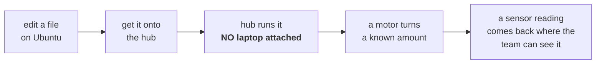

# Sprint 1 — Walking Skeleton (25–27 AUG 2026)

> **Type:** ACTIVE-SPEC · **Sprint window:** 25 AUG – 27 AUG 2026 · **Written:** 2026-08-25
> **Governs:** every action taken in Sprint 1. No agent and no team member works an item that is not numbered here.
> **Rules:** [../directives/INDEX.md](../directives/INDEX.md) · **Boundaries:** [../scope.md](../scope.md) · **Milestone:** [../roadmap.md](../roadmap.md) M1

---

## Thesis — read this before anything else

On a hardware project with **two sprints and one Demo Day**, the risk is not the algorithm. Counting
light/dark transitions is a twenty-line state machine that a competent programmer writes on a laptop in
an afternoon and tests with no robot at all ([ADR-0002](../decisions/0002-split-mission-logic-from-hub-io.md)).

The risk is **the toolchain and the integration**, and every bit of it is unknown right now:

- We do not know which Hub OS generation is on this hub, so we do not know which Python API it accepts.
- We do not know how a file gets from Ubuntu onto the hub, because LEGO does not support Linux desktop.
- We do not know that the hub will run our program **standalone**, off the cable, which is what Demo Day is.
- We do not know what the mission is.

So Sprint 1 proves a **walking skeleton** — the thinnest possible end-to-end slice through the *real*
components — and nothing else:

That is the entire Sprint 1 technical goal. **It contains zero mission logic and that is deliberate.**

**Why a bigger Sprint 1 goal is a trap.** The tempting version of this sprint is "get it driving around
and detecting sticky notes by Thursday." That plan fails in a specific, predictable way: the team spends
both class sessions writing sweep and detection code against a *guessed* API, then discovers on 1 SEP
that the hub is on the other Hub OS generation, or that nothing can be deployed from Ubuntu at all, and
throws the code away with three class sessions left. Mission code written before the skeleton is proven
is code written against an unknown — you cannot debug the algorithm and the transport at the same time.
Prove the pipe first. The mission logic is then written on the host, in parallel, at zero hardware cost.

---

## Sprint reality check

| Fact | Consequence for this plan |
|---|---|
| Class sessions in Sprint 1: **25 AUG, 27 AUG** (2 sessions) | Every item below must fit in a class period or be host-side work that needs no hub |
| Class sessions before Demo Day: **25, 27 AUG · 1, 3, 8 SEP** (5), demo on **10 SEP** | Burning one on a false start is 20% of the remaining project |
| **"You MAY NOT work on the project outside of class"** ([scope.md § Critical Notes](../scope.md#critical-notes)) | Out-of-class effort is preparation/reference only until the operator rules (Q4). Items **5–10** need the hub and the yellow box and item **11** needs that day's posted QOD, so those are **in class by nature** and cannot be moved; only items 1–4 and 12 are host- or paper-side |
| Budget: **56 SB** remaining (`./inventory.py --verbose`) | Sprint 1 should cost **0 SB**. Every question goes in writing; a 10-minute four-person huddle beyond the standup costs 40 SB — most of what is left |
| Hub is **shared course equipment**, stock firmware, returned in factory state ([ADR-0001](../decisions/0001-stock-lego-firmware-only.md)) | No item here writes firmware, no item accepts an update prompt |

### Role choreography for every hub-touching step

Role separation costs 2 SB per violation, so the physical sequence is the same every time and is worth
memorizing rather than re-deriving under time pressure:

1. **Builder** takes the hub and the robot out of the yellow box, powers it on, places it, and presses
   every button on it. The Builder is the **only** authorized operator.
2. **Programmer** plugs the USB cable into the hub and unplugs it. That is the Programmer's *only*
   permitted contact with any supply.
3. **Designer** and **Supplier** touch nothing during a hub test. The Designer may watch and sketch; the
   Supplier is only involved if something must be bought or sold back.
4. **Scrum Master** (AI) records what was observed, verbatim, with units and conditions.

---

## Numbered items

Items **1–4 are not gated on the hub** and can proceed the moment the sprint starts. Items **5–10 are a
strict chain** — each one is worthless until its predecessor has produced its observable. Items 11–12 run
alongside everything.

---

### 1. Get the design briefing from the instructor, in writing

- **Objective:** Replace the `[ASSUMED]` mission in [scope.md § Mission](../scope.md#mission--partial-verbal-briefing-captured-2026-08-25) with what the instructor actually briefed.
- **Who:** **Designer** sends it (the Designer owns the problem statement); **Scrum Master** drafts the question list; **any** role may send — written digital communication is unlimited and free.
- **Artifact:** [../scope.md](../scope.md) § Mission, rewritten and re-derived, plus the exchange filed in `docs/course/team/communications.md`.
- **Observable:** The § Mission section no longer contains the words `[ASSUMED, UNCONFIRMED]`, and each of the six open questions in it has a written answer attributable to the instructor or TA — not to the team's inference.
- **Blocker:** None. **This is item ONE because everything below it is downstream.** Item 6's sensor choice, item 9's sensor test, and the whole of Sprint 2 are guesses until this lands.
- **If it stalls:** Ask in writing again the same day, and state in the request that work is blocked on it. Do **not** buy a meeting to get it — send the six questions from § Mission as a numbered list so it can be answered in one reply. Sprint 1 items 3–10 do not depend on the briefing and keep moving regardless.

### 2. Confirm the four roles and open the communications record

- **Objective:** Know who is Builder, Designer, Supplier, and Programmer by name, so advice goes to the role allowed to act on it.
- **Who:** **All four** confirm; **Scrum Master** records.
- **Artifact:** `docs/course/team/roles.md` (secondary: `docs/course/team/communications.md`, started day one).
- **Observable:** Four names against four roles in the file, plus at least one archived message from the team's actual channel pasted into the communications record — proving the channel is collectible, which it must be, because the full record is a submitted deliverable.
- **Blocker:** None.
- **Note:** [scope.md](../scope.md) currently records `[ASSUMED]` that the operator is the Programmer. If that is wrong, items 3–10 are assigned to the wrong person and the sprint stalls on a role violation.

### 3. Prepare the Ubuntu host for USB serial — no hub required

- **Objective:** Make sure that when the hub *is* plugged in, Ubuntu can talk to it and nothing else on the system is fighting for the port.
- **Who:** **Programmer**, on their own laptop. Touches no supplies. Whether it may be done out of class is **open** — see Q4 and [scope.md § Critical Notes](../scope.md#critical-notes); until the operator rules, treat it as preparation/reference, not graded build work.
- **Artifact:** `scripts/setup-host.sh` — idempotent, reports what it changed vs. what was already in place.
- **Observable:** Run with no hub attached, the script prints and the run clears the two blockers already measured in [../findings/host-environment.md](../findings/host-environment.md) (2026-08-25): **`systemctl is-active ModemManager` returns `inactive`** where it measured `active` and `enabled` (or the LEGO VID/PID udev rule is in place and shown), and a serial terminal (`tio` or the already-present `screen`) resolves on `PATH`. It re-confirms `dialout` membership rather than trusting the earlier reading, and prints the literal output of `ls -l /dev/ttyACM*` — which, with no hub attached, must read *"no such file"* and be reported as **UNKNOWN, hub absent**, never as a pass ([honest-instrumentation.md](../directives/honest-instrumentation.md)).
- **Blocker:** None. The host survey is done; this item is the fix, and it must run **before the hub is ever plugged in** — ModemManager probes a new `/dev/ttyACM*` with AT commands and can make a working hub look broken, which is exactly the failure that gets misdiagnosed as "Linux doesn't work with LEGO".

### 4. Land the toolchain research and choose the deploy route — as an ADR

- **Objective:** Decide *how* a file gets from Ubuntu onto the hub, once, in writing, with the rejected options and their reasons kept.
- **Who:** **Programmer** decides; **Scrum Master** writes the record.
- **Artifact:** `docs/decisions/0004-hub-deploy-route.md` (input: [../research/spike-prime-linux-toolchain.md](../research/spike-prime-linux-toolchain.md)).
- **Observable:** The ADR names ONE primary route and ONE fallback, and for each states: whether it can trigger a "Hub update required" prompt, whether it requires a Chrome/WebSerial session, and what maintenance date the tool last showed. A route whose maintenance date cannot be established is recorded as such, not silently trusted.
- **Blocker:** The research has landed and already carries a recommendation — VS Code + PeterStaev's `lego-spikeprime-mindstorms-vscode` over USB serial as primary, with a raw `tio`/`screen` REPL as the fallback. **But that recommendation is Hub OS 3-specific**, and the two generations speak mutually incompatible host protocols (Hub OS 2 = newline JSON-RPC, Hub OS 3 = COBS-framed binary). So: draft the ADR now with **both branches**, ratify the branch after item 5 returns. **Do not pick a route from memory or from a tutorial** — the SPIKE 2 → SPIKE 3 transition invalidated most of the tutorial internet ([knowledge-retrieval.md](../directives/knowledge-retrieval.md)).
- **Constraint that overrides convenience:** Pybricks is the most Linux-friendly option and is **permanently blacklisted** — it flashes the hub ([ADR-0001](../decisions/0001-stock-lego-firmware-only.md)). If the research surfaces it, the ADR records *why it was excluded* and moves on.

### 5. Read-only hub identification — Hub OS and API generation

- **Objective:** Learn which Hub OS generation is installed **without changing a single byte on the hub**, because that answer decides whether every line of code in this project is written `import motor` / `from hub import port` / `import runloop` (SPIKE 3) or `from spike import PrimeHub` (SPIKE 2, legacy).
- **Who:** **Builder** retrieves the hub from the yellow box and powers it on; **Programmer** plugs in the USB cable and runs the script from the laptop.
- **Artifact:** `docs/findings/hub-os-identification.md` — the name [../runbooks/hub-identification.md](../runbooks/hub-identification.md) § 8 writes to; do not create a second file under another name (procedure: [../runbooks/hub-identification.md](../runbooks/hub-identification.md); script: `scripts/identify-hub.sh`, explicit timeout, exits on its own).
- **Observable:** Three things written down, in this order: (1) `lsusb` showing the hub enumerate — the research gives VID:PID **`0694:0009`**, *sourced, UNVERIFIED against our hub*, so record whatever actually appears; (2) a **version string copied verbatim** out of the hub into the finding — not paraphrased, not "it looked like version 3"; (3) which import style the hub's own interpreter accepts. All read-only; nothing writes to the hub filesystem. The finding ends with an explicit line: *"API generation = SPIKE 3"* or *"= SPIKE 2"*, dated.
- **Blocker:** The hub must be **physically present and powered** — this item cannot start otherwise. The procedure itself is ready: [../runbooks/hub-identification.md](../runbooks/hub-identification.md) exists and its § 0 forbidden-actions table is read *before* the cable goes in. Item 3 must have run first.
- **Hard rules for this item:** Identify from the **Linux serial port first — do not open the SPIKE Web App or the LEGO app during this procedure.** LEGO states the compatibility check on connect notifies the user that a Hub OS update is required and that this notification *cannot be disabled* ([toolchain research](../research/spike-prime-linux-toolchain.md) § 4, quoting LEGO's software-updates page); opening the app before we know the generation is how the one-way door gets opened by accident. Never open a blocking serial read from a tool call — it hangs the session; everything goes through the timed script. If **any** tool shows *"Hub update required"*, **STOP**, photograph it, change nothing, and ask the operator ([hardware-safety.md](../directives/hardware-safety.md)).
- **If the hub does not enumerate:** the result is **UNKNOWN**, written down as UNKNOWN, and items 6–10 stay blocked. Do not substitute a guessed API generation to keep moving.

### 6. Record the port map as the single source of truth

- **Objective:** One file that says what is plugged into A–F, that the code reads and never hard-codes around.
- **Who:** **Builder** reports what is physically plugged where (only the Builder may plug things in); **Programmer/Scrum Master** writes it down.
- **Artifact:** [../hardware/port-map.md](../hardware/port-map.md) — the file exists; **all six rows currently read `UNASSIGNED`**, and this item is what fills them.
- **Observable:** For each occupied port: the port letter, the exact part (Motor / Color Sensor 45605 / Distance Sensor 45604 / Force Sensor 45606), for motors which side of the robot it drives and which rotation direction moves the robot forward, and a **date in the "Physically confirmed" column** — which means someone looked at the plug, not at a diagram. A port map that does not state motor polarity will send the robot backwards on its first drive test, and the team will debug it as a code bug.
- **Blocker:** The devices must actually be mounted. The ledger holds **two motors and two wheels and no sensor** (`./inventory.py --verbose`, 56 SB remaining; [scope.md § Requirements](../scope.md#requirements) "Not yet owned: sensors, mounting blocks, axles"), so the motor rows can be filled this sprint and a sensor row cannot until Q3 is answered.
- **Note:** TR-5 requires the code to reference this file's assignments, not scatter port literals. There is ONE port map ([honest-instrumentation.md](../directives/honest-instrumentation.md), "one accountable path per concern").

### 7. Deploy the hello skeleton — first file from Ubuntu onto the hub

- **Objective:** Prove a file written on Ubuntu reaches the hub, is stored in a known slot, and *that file* is the one that runs.
- **Who:** **Programmer** writes and deploys; **Builder** handles the hub and starts the program.
- **Artifact:** `src/skeleton_hello.py` (secondary: `scripts/deploy.sh`).
- **Observable:** The hub's **5×5 light matrix displays the single character written in the source file** — pick something unmistakable such as `K`. Then change the source to a *second* character, redeploy, and run again: **the matrix must show the new character.** The second half is the whole test. "The upload command exited 0" proves nothing, and on a hub with program slots it is genuinely easy to edit one file and run a stale one ([map-before-act.md](../directives/map-before-act.md), `ACTIVE != FIRES`). Record **which slot number** ran.
- **Blocker:** Items 4 (route chosen) and 5 (API generation known — the matrix call differs between generations).
- **If it fails:** fall back to the ADR's secondary route before writing any workaround code. Record the failure in `docs/findings/` with the exact error text — a failed toolchain route is report material, not wasted time.

### 8. First motion — one motor, small, slow, cancellable

- **Objective:** Prove the hub drives a motor a **known** amount under our code.
- **Who:** **Programmer** writes it; **Builder** places the robot and starts it. Nobody else within reach.
- **Artifact:** `src/skeleton_motion.py`.
- **Observable:** With a strip of tape stuck to one wheel at the 12-o'clock position and **the robot resting on blocks with its wheels off the floor**, running the program rotates that wheel **one quarter turn (90°) at low velocity, then stops**, and the matrix switches to a distinct "done" character. Tape at 3 o'clock afterwards = pass. Tape anywhere else, or a wheel that keeps turning, = fail, written down as fail.
- **Blocker:** Items 6 (port map — which port, which direction) and 7 (deploy proven).
- **Hard rules for this item:** first motion is **short, low-velocity, and cancellable — never a full mission run as a first test** ([hardware-safety.md](../directives/hardware-safety.md)). Wheels off the ground for the first execution; only after it behaves does it go on the floor. The Builder keeps a hand near the hub's stop control. Motion is also where motor polarity from item 6 gets *verified* rather than assumed — if the wheel turns the wrong way, fix the port map, not the code.

### 9. First sensor read, displayed where the team can see it

- **Objective:** Prove a real sensor value reaches our code and reaches a human **without a laptop attached**.
- **Who:** **Programmer** writes it; **Builder** holds/positions the robot and the target.
- **Artifact:** `src/skeleton_sensor.py` (result recorded in `docs/findings/floor-and-target-reflectance.md`).
- **Observable:** Two reflected-light readings, taken at a fixed sensor height, **written down with units and conditions**: one over the bare arena floor, one over the candidate target. E.g. the shape *"floor NN%, target NN%, sensor at NN mm, classroom carpet under overhead fluorescents, 2026-08-27"* — the numbers filled in from the hub, never from expectation. LEGO specifies roughly 16 mm as the color sensor's optimal sensing distance (`../archives/operator-notes/2026-08-25_spike-platform-notes.md`, cites LEGO tech spec — **UNVERIFIED against our own hardware**); measure and record the height we actually used. The separation between the two numbers is the entire feasibility argument for the detection approach, and it is the first row of the report's results section.
- **Blocker:** Items 6 and 7; **and a Color Sensor 45605 must exist and be mounted — none is on the ledger** (see Q3). If the kit does not supply one, this item is blocked on the single purchase Sprint 1 may need, and the Supplier makes it against the remaining 56 SB. What counts as "the target" is `[ASSUMED]` sticky notes and stays assumed until item 1 lands — take the reading over whatever the instructor briefed, or over a sticky note *labelled as an assumption* if the briefing is still outstanding.
- **Cheap extension while the robot is already on the floor:** if more than one target colour is in play, take one reading per colour in the same pass and record them in the same table. Technique and sensor modes: [../research/detection-and-sweep-techniques.md](../research/detection-and-sweep-techniques.md) (note: `docs/research/color-discrimination.md`, which [research/INDEX.md](../research/INDEX.md) and [scope.md § Mission](../scope.md#mission--partial-verbal-briefing-captured-2026-08-25) both cite, **does not exist in the repo** as of 2026-08-25). This is data collection, **not** classification logic — the logic is Sprint 2.
- **Do not:** invent, round, or "about"-ify a reading. A reading not taken is not a reading.

### 10. Close the skeleton — standalone run, laptop unplugged

- **Objective:** The demo condition. Prove the hub runs our program on its own battery with no cable and no computer in the room, because that is what happens on 10 SEP.
- **Who:** **Builder** alone runs it; **Programmer** unplugs the USB cable first and then steps back.
- **Artifact:** `docs/runbooks/deploy-and-run.md` — the ritual written down for the team, end to end, including which slot and which buttons.
- **Observable:** USB cable **physically detached** and visible on the table, hub on battery. The Builder starts the program from the hub's own controls, and the matrix character (item 7) → quarter-turn wheel motion (item 8) → sensor value display (item 9) sequence plays through unaided. Somebody who was not the Programmer follows the runbook and reproduces it.
- **Blocker:** Items 7, 8, 9.
- **Why this is a separate item:** TR-3. A skeleton that only runs tethered has proven the development loop and *not* Demo Day. This is the item that turns Sprint 1 from "we can program it" into "it works without us."

### 11. Journal entries for 25 AUG and 27 AUG — every class day

- **Objective:** Do not donate points. 80 points, −5 per missing day, and Sprint 1 contains two graded days.
- **Who:** **Every team member, individually.** The journal is an individual grade; the Scrum Master supplies the day's facts, not the student's sentences.
- **Artifact:** `docs/course/journal/2026-08-25.md`, `docs/course/journal/2026-08-27.md` (dated files are the sanctioned exception to concept-naming).
- **Observable:** Each entry contains **≥4 sentences answering that day's posted Question of the Day** and **≥4 sentences summarizing the day's events**, 8 total, and the day's events reference *specific* items from this plan by number and their actual observed outcome. Graded on grammar and specificity; generic filler loses points, specifics do not.
- **Blocker:** The Question of the Day must be captured *in class, on the day*. It is not recoverable later.

### 12. Sprint 1 close-out — record what was actually observed

- **Objective:** End the sprint with a written state, so Sprint 2's planning meeting on 1 SEP costs 20 minutes and not an hour of reconstruction.
- **Who:** **Scrum Master** writes; **Programmer** confirms the technical observations.
- **Artifact:** `docs/session_records/2026-08-27_sprint-1-close.md`.
- **Observable:** For each of items 1–10: **DONE with its observable quoted**, or **BLOCKED with the named blocker**. No item marked done without its observable written next to it. `docs/todo.md` and [../roadmap.md](../roadmap.md) M1 updated to match; this plan moved to `docs/archives/plans/` only when items 5–10 are genuinely closed. Every file this sprint created carries an INDEX row before the sprint closes — new findings in [../findings/INDEX.md](../findings/INDEX.md), the deploy ADR in [../decisions/INDEX.md](../decisions/INDEX.md), `deploy-and-run.md` in [../runbooks/INDEX.md](../runbooks/INDEX.md), and `docs/course/team/` needs its own `INDEX.md` created with `roles.md` and `communications.md` ([documentation-discipline.md](../directives/documentation-discipline.md)).
- **Blocker:** None — this happens on 27 AUG whether the skeleton closed or not. A sprint that ended blocked is a fact to record, not a failure to hide.

---

## Risks

| # | Risk | Why it bites on THIS project | Mitigation |
|---|---|---|---|
| R1 | **The mission is unknown** | The design challenge came from a briefing we do not hold. Everything past detection is a guess; a sweep pattern or a counting rule built to the wrong mission is a discarded class session out of five | Item 1 is first and goes out in writing on day one. Sprint 1 deliberately contains **no** mission logic, so a late briefing costs nothing already built. Everything derived from the guess is tagged `[ASSUMED]` at the point of use |
| R2 | **The Hub OS generation is unknown, and most tutorials online target the obsolete SPIKE 2 API** | `from spike import PrimeHub` (SPIKE 2) and `import motor` / `from hub import port` (SPIKE 3) are mutually incompatible. A search result that looks authoritative may be four years stale, and code written to the wrong one fails in a way that reads like a hardware fault | Item 5 identifies the generation **read-only, before any code is written**, from a version string on the actual hub. Scope treats the API generation as UNKNOWN until then. Every external source is checked for which generation it targets before it is believed ([knowledge-retrieval.md](../directives/knowledge-retrieval.md)) |
| R3 | **LEGO does not support Linux desktop** | The supported desktop platforms are Windows and macOS; there is no native Linux SPIKE App. Our only host is native Ubuntu 22.04. The deployment path is the single least-certain thing in the project, and it sits between us and *every* hardware result | Items 3 and 4: host prep and an explicit route ADR with a **named fallback**, before the class session that needs it. The skeleton (items 7–10) exists precisely to fail this fast, on 27 AUG, while there is still time to switch routes |
| R4 | **The team may only work in class — roughly five class sessions remain before Demo Day** | 25, 27 AUG · 1, 3, 8 SEP, demo 10 SEP. One session lost to an unplanned false start is 20% of the remaining schedule, and it cannot be made up by working harder at home | Plan the wave, then execute ([plan-first.md](../directives/plan-first.md)). Every hub session runs a written runbook, not improvisation. Host-side work that needs no hub (items 3, 4, and all of Sprint 2's pure logic) is staged so that class time is spent only on things that require the hardware. Also see § Open Questions Q4 — the out-of-class ruling is the operator's |
| R5 | **Role separation slows every physical iteration** | The person who writes the code may not touch the robot, and the person who may touch the robot cannot change the code. A one-character fix costs a Programmer edit, a redeploy, a Builder handoff, and a Builder-run test — and each shortcut costs 2 SB out of 56 | The role choreography above is fixed and rehearsed, not re-derived each time. Iterations are batched: deploy once, run the whole skeleton sequence, observe everything, then edit. Instrument the hub so a run is diagnosable **from across the room** — matrix character per state, so the Builder can report what happened without the Programmer touching anything |
| R6 | **The hub is shared equipment, so firmware risk is unacceptable** | A failed flash or restore ends the project and costs the course a hub. Pybricks — the best Linux route — replaces LEGO firmware, so the most convenient answer is the forbidden one, and it will be re-proposed by any tutorial we read | Blacklisted permanently ([ADR-0001](../decisions/0001-stock-lego-firmware-only.md), [scope.md](../scope.md)). No DFU, no bootloader, no format, no factory reset. Identification (item 5) is read-only. **An unattended "Hub update required" prompt is never accepted** — it stops the session and becomes an operator decision recorded as an ADR |
| R7 | Hub battery flat / hub or robot not in the yellow box at class start | A dead battery costs the entire class session; nothing in items 5–10 can run | Builder charges the hub and confirms contents at the *end* of each session, not the start. Item 12's close-out includes the yellow-box check |
| R8 | An observation gets remembered instead of written down | The Intro Report (18 SEP) is written FROM this repo. A reflected-light number without its surface, height, and lighting is unusable three weeks later, and re-taking it costs class time we do not have | Every observable in items 5–10 names what gets written and where. Measurements go to `docs/findings/` with units and conditions, on the day ([documentation-discipline.md](../directives/documentation-discipline.md)) |

---

## DONE MEANS

Sprint 1 is complete when **all** of these are true. Anyone can check this list without asking the Programmer.

1. The hub's **API generation is written down** in `docs/findings/hub-os-identification.md` with the verbatim version string it came from, and the hub's software state is unchanged.
2. `docs/decisions/0004-hub-deploy-route.md` exists, names a primary and a fallback route, and the primary route has actually put a file on the hub.
3. [../hardware/port-map.md](../hardware/port-map.md) lists every occupied port with its part and, for motors, the forward direction — and that direction has been **observed**, not assumed.
4. Editing a character in `src/skeleton_hello.py`, redeploying, and running shows **the new character** on the 5×5 matrix. The slot number is recorded.
5. `src/skeleton_motion.py` turns the taped wheel **one quarter turn at low velocity and stops**, repeatably.
6. `src/skeleton_sensor.py` produces **two written reflected-light readings** — floor and target — with units, sensor height, surface, lighting, and date, in `docs/findings/`.
7. **With the USB cable physically detached**, the Builder starts the program from the hub's own controls and the full matrix → motion → sensor sequence runs on battery power.
8. `docs/runbooks/deploy-and-run.md` is followed successfully **by someone who is not the Programmer**.
9. A journal entry exists for **25 AUG and 27 AUG**, each ≥4 sentences on the QOD and ≥4 on the day, for every team member.
10. `docs/session_records/2026-08-27_sprint-1-close.md` records every item 1–10 as DONE-with-observable or BLOCKED-with-blocker, and `docs/todo.md` matches reality.

**Partial credit is real and should be claimed honestly.** If item 5 returned UNKNOWN because the hub
never enumerated, that is the sprint's outcome, it is written as such, and Sprint 2 opens on it as the
top item. What is *not* acceptable is a green checkmark next to something nobody watched happen.

---

## NOT IN SPRINT 1

Explicitly out until the skeleton closes. Anything on this list appearing in Sprint 1 work is scope
sprawl and gets stopped, not negotiated.

| Not now | Why | When |
|---|---|---|
| **Sweep / coverage patterns** | You cannot design coverage before knowing the arena's size, surface, and boundary — none of which we have | Sprint 2, after item 1 |
| **Counting and detection logic** | Pure host-side logic ([ADR-0002](../decisions/0002-split-mission-logic-from-hub-io.md)) that needs *no* hub. Writing it in Sprint 1 wastes the scarce resource (class time with hardware) on the abundant one (laptop time) | Sprint 2, with its floor tests, written together |
| **Threshold / velocity / turn tuning** | Tuning against a floor we have not measured is guessing. Item 9 takes the *first* measurement; tuning needs the real arena | M3, from measured data |
| **Report prose** | The report is written FROM the repo on 18 SEP. Findings and session records now; paragraphs later | After the robot works |
| **Mechanical redesign** | The Designer's and Builder's territory, and out of this repo's scope. We record the build, we do not design it | N/A — record only |
| **Target *mapping* (locations, not a count)** | Parked on the roadmap's FRONTIER. Only in scope if the briefing demands it | Only if item 1 says so |
| **Buying anything** — *one possible exception* | 56 SB left. The Supplier buys against a demonstrated need, not speculation. The **one** demonstrated gap is the sensor item 9 needs, which the ledger does not hold; that purchase is in scope only after Q3 says the kit does not supply one | When a build item proves a shortfall — i.e. Q3 |
| **`tests/persistent/`** | The floor is written WITH the first mission logic — not before it and not after the sprint ([testing-discipline.md](../directives/testing-discipline.md)) | Sprint 2, alongside the logic |

---

## Open questions for the operator / instructor

Batch these; do not drip them one at a time. Q1–Q3 go to the instructor or TA in **one written message**;
Q4–Q7 are the operator's.

| # | Question | Why it blocks | Default if unanswered |
|---|---|---|---|
| Q1 | **What is the design challenge?** Specifically: what is a "target" physically; how are they placed; what bounds the arena and how big is it; is the deliverable a count, a map, a retrieval, or avoidance; how is Demo Day scored (time limit, attempts, accuracy tolerance); is the run fully autonomous or may the Builder intervene? | Everything past the skeleton. See [scope.md § Mission](../scope.md#mission--partial-verbal-briefing-captured-2026-08-25) | **None — this cannot be defaulted.** Item 1 stays open and Sprint 2 opens blocked |
| Q2 | What is the arena **floor surface** (carpet / tile / poster board) and the lighting? | Determines reflected-light separation (item 9) and odometry slip. A threshold measured on the wrong surface is worthless | Measure on whatever surface the demo actually uses; record the surface with every number |
| Q3 | Does the course kit include a **Color Sensor 45605**, and is our team's copy present in the yellow box? | Item 9 has no sensor otherwise. The ledger shows none owned, so this is a real gap, not a formality | Builder checks the yellow box on 25 AUG and reports. If absent, the Supplier buys one — the only purchase Sprint 1 anticipates. Do not buy before the box is checked |
| Q4 | **Out-of-class work ruling.** How does the "may not work outside of class" rule apply to this repo? | Decides whether items 3, 4, and Sprint 2's host-side logic can be prepared between sessions. Flagged 2026-08-25, still open | Preparation and reference only out of class; nothing graded is built |
| Q5 | Is the operator the **Programmer**? And who are the other three? | Item 2. If wrong, this plan assigns items to people not allowed to do them | Proceed on `[ASSUMED]` Programmer; correct on first contradiction |
| Q6 | If a tool shows **"Hub update required"**, is a LEGO Hub OS update acceptable — and does the course own that decision or do we? | It is a one-way door on shared equipment. It stops item 5 dead | **STOP and ask.** Never accepted unattended; a new ADR or nothing |
| Q7 | Is there a **spare hub or a second team's hub** available if ours fails? | Determines whether a dead hub is a delay or a project-ender, and how much schedule slack items 5–10 need | Assume no spare; treat the hub as irreplaceable |

---

*Sources: `../course/source-material/Introduction Project Student Instructions.pdf` (course rules, calendar, grading);
[../scope.md](../scope.md); [ADR-0001](../decisions/0001-stock-lego-firmware-only.md), [ADR-0002](../decisions/0002-split-mission-logic-from-hub-io.md);
`../archives/operator-notes/2026-08-25_spike-platform-notes.md` / `../archives/operator-notes/2026-08-25_available-sensors.md` (operator's platform notes — hardware claims there are third-party and **UNVERIFIED** against our own hub);
`./inventory.py --verbose` (budget, 56 SB as of 2026-08-25).*
