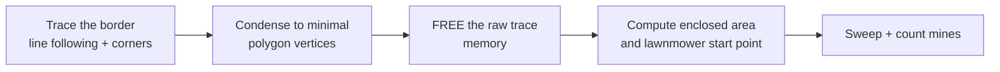

# Operator briefing — from line following to the competition program

**Date:** 2026-09-08 (end of the hardware session) · **Source:** operator, dictated · **Hub:** NOT
connected — everything below is design work to be done without hardware.

This is the archived briefing that sets the remaining work. The verbatim dictation is preserved in
§ 7; §§ 1–6 are the structured extraction. Where the briefing implies a number we have not measured,
it is marked `[UNMEASURED]` rather than invented.

---

## 1. The corner turn is wrong in a specific, diagnosable way

**What happens:** the robot reaches a corner, detects it correctly, and turns the correct way — but it
executes a **zero-radius skid-steer pivot**. It rotates without translating. The perpendicular tape
then ends up *outside* the sensor pair, so the robot has turned onto nothing and the line is lost.

**Why:** a pivot in place keeps the robot's centre fixed. To *acquire* the perpendicular leg, the
sensor pair has to physically sweep across it, which requires **translation as well as rotation** —
one wheel must travel further than the other.

**What the turn must actually do:**

- Turn on a radius large enough that the **outside** sensor crosses the perpendicular tape and
  continues until it has passed the tape's full width.
- The **inside** sensor may need to run up against the perpendicular tape to complete the turn.
- So the code must define an **outside sensor** and an **inside sensor** *relative to the turn
  direction*, not fixed to a port. Turning left, the RIGHT sensor (port C) is the outside one.

**Consequences for the design:**

- The turn radius **cannot be a fixed constant**. It is a function of the sensor spacing and the tape
  width.
- Tape width is **1 inch (25.4 mm)** in the test area, and **may differ on demo day** — so it is a
  config value, not a literal.
- ⚠ **`SENSOR_SPACING_MM` is [UNMEASURED]** and the radius cannot be computed without it. This is now
  a blocking measurement — see § 6.

## 2. A corner is a turn over ~45°

Working definition, deliberately provisional: **anything over 45° is a corner; anything under is
border curvature**, not a junction. This gives a clean discriminator and admits that a hand-laid
border wanders continuously.

## 3. The border is not a polygon of straight lines

It is hand-laid by humans. It may be **straight, an arc, or a squiggle**. The design must therefore:

- represent a **curved or irregular** traced border in memory, not just line segments;
- reduce it to a **minimal set of vertices** rather than storing the raw path;
- compute the **area of the enclosed polygon**, because the arena is a fully enclosed region.

## 4. Dead ends and T intersections

A branch the robot turns onto may lead **into the arena or straight out of it**, and may simply
**end**. If the tape runs out while the robot is supposed to be following a line:

1. **Backtrack along exactly the path it came**, retracing its own steps;
2. regain the line;
3. **turn 180°** — a zero-radius pivot is correct *here*, unlike at a corner;
4. continue.

This is the one place the existing pivot behaviour is right.

## 5. "Micro-SLAM" — the shape of the competition program

The operator's framing, and it is a good one:

The key idea is **condensing live on the robot**: keep the raw trace only long enough to extract the
vertices, then discard it. The competition program stays small because the lawnmower algorithm itself
is small — what changes per arena is the *start point* and the *expected lane lengths*, both derived
from the polygon.

**Modularity requirement:** the line-following module stays **separate** from the competition program.
Competition code can be built now and updated as line following improves.

## 6. Outstanding engineering, named by the operator

| Item | Status |
|---|---|
| **Sensor spacing** | ⚠ `[UNMEASURED]` — blocks the corner-turn radius. Highest-priority measurement. |
| **Heading precision** | Currently ~1.6° over ~100 mm. Target: **less than a sticky-note width of deflection over 10 ft** (≈76 mm over 3048 mm ≈ 1.4°). Needs motor control against the IMU, and drift characterisation. |
| **Motor speed** | "We haven't figured out how to make the motors turn faster." Needs a speed-envelope test. Note `max_speed` is **930 deg/s MEASURED**, while runs have used 80–100 dps — roughly **9× headroom** unexploited. |
| **T intersections** | May not appear on demo day. Handle if cheap; do not let it block the core. |
| **Mine colour** | May be yellow only on the day. The brightness rule is colour-agnostic already. |

## 7. Verbatim briefing, archived

> Okay so basically it was doing everything right the only issue is that the robot would come into a corner successfully detect the corner and then turn into the proper direction of the corner to start following that line but it would pivot on like I don't know how to describe the pivot but it would do a perfect skid steer pivot where it wouldn't move translationally it would rotate and teh tape would then be outside of the color sensors because it did not follow the corner in the sens of one wheel has to turn more than the other to keep the tape in between the color sensors make sense? So it was still a little messy, and since we know the tape is 1 inch wide that should help in the config, but the tape might be variable width on demo day. So I lost my train of thought but basically the idea is that the robot would go into a corner and it's not that it wouldn't turn into the corner of the correct way is just it would pivot right then and there and let's say the blue tape that is going perpendicular and making it a corner so the blue tip that is going perpendicular to the straight line that the robot is following currently the robot would pivot on a smaller radius than what it would need to do in order to follow or grab onto let's say that blue tape that is going perpendicular so the robot well the tape we know is one inch wide and so we need to have a radius that accounts for the color sensors or at least the color sensor that would be the furthest color sensor or the color sensor that is traveling the farthest which means it's the color sensor on the outside of the turn because let's say the robot is turning to the left then the right side color sensor would be the color sensor that moves the most during the turn to the left that is what I mean because it's on the outside of the turn we need the robot to turn at a larger radius or a big enough radius to where the right color sensor intersects the blue tape that is perpendicular and keeps going until the right color sensor goes past the width of the blue tape and it might be the case that the opposite side color sensor or the color sensor at the inside of the turn needs to bump up against the blue tape to then be able to complete that turn does that make sense? so we're going to have to Define an outside color sensor and an inside color sensor based on their position relative to the turn and the turns can't really have a fixed size that's what I'm trying to get at with when we're detecting corners and maybe let's say Corners are nothing smaller than 45°. just for argument's sake in the time being is that anything over a 45° turn or something is going to be considered a corner and then I hope this helps clarify things because this is kind of the last thing we need to address for the line following robot because then we can just say you know anything under a 45° turn is not really a corner it's just kind of a border but we should kind of Mark where the robot has to make significant turns well actually I don't know but I'm trying to get at is now outside of the turn capabilities Improvement is that we could be tracing a border that is not a straight line but rather in the shape of an arc and I'm wondering how we could represent that in memory because also it might not be a straight line it might not be a perfect Arc it might be a squiggle because you know humans are lying this down they can be imperfect sometimes and we need to be able to have some sort of rough calculation for the area of the polygon that the robot is going to draw because we fully expected enclosed area with blue tape. also another Edge case is that there is like a T intersection where the robot is moving along as border detection and it takes a corner and turns and really that little bit of blue tape that it's turning on to follow either goes inside of the arena or it goes directly outside of the arena and so if the robot reaches the end of the blue tape how would we know that is unclear because the whole point is for the robot to have A line to follow and so if the robot just spontaneously doesn't have the line to follow while it's supposed to be following a line then we need to be able to backtrack its steps exactly how it came to get there and try to get back on a line and then once it gets back on the line it turns 180° and that would be able to be a 0.10 or like a minimum radius turn or a zero radius turn like what the robot does now in a corner you know what I'm saying? and so with all these in mind we effectively have enough information to have it complete competition program and so yes of course we'll have to do a little bit more testing with possible tea intersections and stuff and it may become to the competition day that we don't have to deal with the T intersections that we might just have to deal with a complete nice border of the competition area that's super clean and you know there's obvious sticky notes that are late in the area and it may just be only yellow sticky notes are the mines and you know everything goes perfectly we're just trying to account for some edge cases here and so now what I mean to say is now that we have the line following capability of the robot we just do a little bit more research and planning for how we would be able to trace out a polygon in memory and once we are able to have all the data for that we do the polygon construction and then after that free up all that memory of that data tracing the border and doing the line following algorithm and we just save the minimized polygon vertices information or something and now we can start doing like micro slam if that makes sense I don't even know what to call this it would be like a microslam is like we're trying to condense slam algorithms and condense data live on a robot and I know this is super Advanced but it can be done with if we keep our calculations very straightforward in our coding very good and adhere to good coding discipline and so once we have the polygon traced out we can then determine you know an optimal lawn mower path for the robot to follow to go into text mines and that's pretty much it you can kind of take it from there for building the competition code and again the competition code still doesn't have to be that big because in the lawn mower algorithm is not that big it's just we would have to calculate a start point for it and it's not that we would have a changed lawn mower algorithm it's just we would have to be able to understand we'll have different expectations of lengths for the robots travel because maybe we all seem to work on that 1.6 degrees of deflection over 100 cm and we want to have only you know less than a width of a sticky note deflection over span of 10 feet so we need to work on you know motor control relative to the IMU and I am you to really help us with calculating drift things like that and the motor should also be able to turn faster I don't know how we haven't figured out how to make the motors turn faster but that would be another series of tests to do is be able to figure out if we can make the motors turn faster and then also the few remaining line following demonstrations but then after that we're ready for competition code building and full implementation of it and now that we would have all the research and findings and planning we can at least start constructing the competition code right now and we'll just keep the line following robot module separate and like we'll make it all modular of course and once we get those final updates into the line following robot will make sure to update the competition code but that's it that's all we need right? so please get all these ideas documented accordingly and then start doing your thing spawn multiple workflows for research and all the stuff as needed of course we don't have the Hub plugged in right now we're just trying to get everything figured out and completed as much as we can so then we can eventually Document the know unknowns that should be now way more minimal for the next session that we got to complete and get done.
