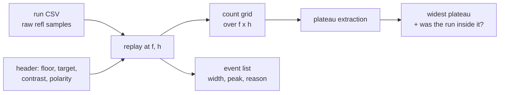

# Detection-quality analysis — what to compute from a logged reflectance stream

**Type:** FORWARD-PLAN · **Status:** research + specification only, **no code written** · 2026-08-26

Companion to [analysis-motion-quality.md](./analysis-motion-quality.md). That one asks *did the robot go
where it meant to go*; this one asks **is the detector any good, and can it be tuned without re-running
the robot.** Both are downstream of [telemetry-and-analysis.md](./telemetry-and-analysis.md) and assume the
record format of [telemetry-over-bluetooth.md § 5](./telemetry-over-bluetooth.md#5-the-record-format).

**Nothing here has been run.** There is no hub, no sensor, no log file, and no measurement. Every number
in an example below is invented for illustration and marked as such. None may reach the Intro Report.

---

## Summary

1. **The threshold sweep is the whole reason for logging raw**, and it is a **two-parameter** sweep, not
   one: threshold *centre* and hysteresis *gap* move together in [`src/calibration.py`](../../src/calibration.py).
   Sweep both, in **units of contrast fraction** so the result transfers between floors.
2. **The output is a plateau, not a curve.** `count` against threshold is a step function; a line chart of
   a step function is a worse table. Report **a list of plateaus** — `[f_lo, f_hi] → count` — and rank
   them by width. The widest non-degenerate plateau, and whether the run's actual setting sat inside it,
   is the finding.
3. **Two plateaus of different counts means the data does not determine the count.** Say so. That is a
   result, not a failure, and it is the honest version of "we found 7".
4. **Most useful metrics need no ground truth.** Event-width distribution, normalised peak distribution,
   floor/target separation *achieved* versus *predicted*, and a rejection ledger by reason. All four come
   from replaying one log.
5. **The rejection ledger is free** — replay the same stream twice, once with the gates open and once with
   them configured, and diff **by index range**: an open-replay event nested inside a configured accepted
   event is a fragment, not a rejection. No robot change, no extra logging.
6. **A confusion matrix is overkill for presence detection and correct for classification.** Presence has
   no countable true negative, so accuracy and specificity are undefined; report placed / found / spurious
   and derive recall and precision. If Q5 puts multiple colours in play, a 3×4 class table earns its keep.
7. **A calibration valid at run start and invalid by the end is a real failure mode**, and one curve
   exposes it: **margin(t) = (on_threshold − floor_level(t)) / floor_noise(t)**, computed from off-target
   samples in windows. Starts at 8, ends at 2 → the calibration expired mid-run.
8. **Loop rate matters only as sample pitch in millimetres, and only while moving.** A rate drop during a
   turn is harmless; the same drop mid-lane is a missed note. Filter by `state == "lane"` before judging.

---

## The threshold-sweep re-analysis

### What is actually being swept

[`calibrate()`](../../src/calibration.py) does not produce *a* threshold. It produces a pair, in
polarity-normalised signal space:

```
contrast   = |target_level − floor_level|
midpoint   = (floor_signal + target_signal) / 2
gap        = HYSTERESIS_FRACTION × contrast
on_threshold  = midpoint + gap/2
off_threshold = midpoint − gap/2
```

So "sweeping the threshold" while holding `off_threshold` fixed silently sweeps the hysteresis too, and
the result would be uninterpretable. **Parameterise the sweep the way the code is parameterised:**

| Parameter | Symbol | Sweep range | Why |
|---|---|---|---|
| Threshold centre | `f` = (centre − floor_signal) / contrast | 0.10 … 0.90, step 0.02 | Where between floor and target the decision sits |
| Hysteresis gap | `h` = gap / contrast | 0.00 … 0.50, step 0.05 | [`HYSTERESIS_FRACTION`](../../src/config.py), currently 0.25 |
| Min dwell | `MIN_DWELL_SAMPLES` | 1 … 6 | Transient rejection, [detection-and-sweep-techniques.md § 3](../research/detection-and-sweep-techniques.md#edge-counting-state-machine) |
| Width gates | `MIN_EVENT_SAMPLES`, `MAX_EVENT_SAMPLES` | separately, later | Interact with speed; sweep these only after `f` and `h` are settled |

**Normalised units are the point.** A plateau reported as "threshold 41 to 49" is true of one carpet under
one set of lights. The same plateau reported as "`f` from 0.34 to 0.62" is a property of the *detector*,
survives a floor change, and is what belongs in the report.

The replay itself is three lines of reuse: rebuild a `Calibration` at each `(f, h)`, call
[`count_stream(calibration, readings)`](../../src/detector.py), keep `count` and `events`. The analysis and
the robot then run **the same detector** — per [ADR-0004](../decisions/0004-flat-src-supersedes-package-split.md)
(which supersedes ADR-0002's *mechanism* but keeps its rule), the flat `src/` imports nothing hub-only — so a
re-analysis is not a model of what the robot would have done, it *is* what the robot would have done.



### How to compute the plateau

For one row of the grid (fixed `h`), `count(f)` is a step function — falling over most of the range, but
**not monotone**: see the low-`f` guard below. A **plateau** is a
maximal run of consecutive `f` values giving an identical count.

```
plateaus = []
for each maximal run of equal count in count(f):
    plateaus.append({f_lo, f_hi, width = f_hi − f_lo, count})
discard plateaus whose count is 0            # high f: on_threshold above the target level
discard plateaus containing an accepted event wider than the widest plausible chord
discard plateaus that touch f = 0.10 or 0.90 # unbounded at the sweep edge, width is fictional
rank by width
```

Three guards, none optional. The third is the one that is easy to miss:

- **`count == 0` is an infinitely wide plateau** at high `f` and will win any naive ranking. Drop it.
- **A plateau clipped by the sweep range has no measured width.** Either widen the range or report it as
  `≥ w`, never as `w`.
- **Low `f` produces a small, plausible-looking count, not zero.** Once `f < h/2`, `off_threshold` sits
  *below* the floor level, the detector never releases, and the whole run merges into one event.
  `MAX_EVENT_SAMPLES` does **not** catch it — [`config.py`](../../src/config.py) calls its value of 400
  "generous" precisely so it will not fire in normal use. Running the real
  [`count_stream`](../../src/detector.py) over an illustrative 5-note synthetic stream (invented data,
  2026-08-26) gives, at `h` = 0.50, the row `1, 3, 5, 5, … 5, 4, 3, 1, 0` across `f` = 0.10…0.90: the
  count at the low edge is **1**, and it is an accepted 340-sample event. So `count(f)` is not monotone,
  and a merged mega-event must be rejected on its **width**, not on its count.

### How to present it

**A table, in three parts, and one figure.**

*(1) The plateau list — the headline.* Illustrative numbers, invented:

| Rank | `f` range | Width | Count | Note |
|---|---|---|---|---|
| 1 | 0.34 – 0.62 | **0.28** | 7 | run used `f` = 0.50 — **inside** |
| 2 | 0.64 – 0.70 | 0.06 | 6 | one note lost first |
| 3 | 0.22 – 0.32 | 0.10 | 9 | two extra events below here |

*(2) The 2-D grid — the robustness check.* Count as a function of `f` (columns) and `h` (rows), printed as
a table of integers. A plateau that survives across several `h` rows is a genuinely robust setting; one
that exists only at `h` = 0.25 is an artefact of the hysteresis choice.

*(3) One scalar for the report:* `plateau_width` in contrast fraction, of the plateau containing the
setting actually used. **A provisional read, [ASSUMED] until a real run calibrates it:** ≥ 0.30 is
comfortable, 0.10 – 0.30 is workable, < 0.10 means the count is an artefact of the threshold and the
honest report says the measurement is not yet trustworthy. These three bands are a guess about our own
future data and must be replaced by measurement, not defended.

*The figure* is the one already specified in
[telemetry-over-bluetooth.md § 6.2](./telemetry-over-bluetooth.md#62-plot_runpy) — reflectance
against distance with `cal_on` / `cal_off` drawn on it. Do not add a second chart of `count(f)`. A step
function plotted as a line invites the reader to interpolate between integer counts, which is meaningless.

### What the shape means

| Shape | Reading | Action |
|---|---|---|
| One wide plateau, run's setting inside | Robust. Quote the width in the report | None |
| One wide plateau, run's setting **outside** | Threshold is mis-set but the data is fine | Move `f` to the plateau midpoint — a config change, no re-run |
| Several narrow plateaus, adjacent counts | Margin too thin; the count is threshold-dependent | Fix the *signal*, not the threshold: mounting height, shroud, speed. [color-discrimination.md § 5.1](../research/color-discrimination.md#51-spot-size-governs-everything) |
| Plateau wide in `f`, collapses as `h` → 0 | Detection depends on hysteresis to survive noise | Keep `h`; the floor is noisier than calibration assumed |
| No plateau above width 0.04 anywhere | The run is not evidence of a count | Re-run after fixing signal quality. Do not report a number |

---

## Metrics without ground truth

We may not know the true mine count on a given run — and on Demo Day we certainly will not know it in
advance. Four things are still computable from one log.

### 1. Event-width distribution

Real notes have physical extent; noise does not. Width in **samples** is what the detector sees; width in
**millimetres** is what is comparable across speeds:

```
width_mm = (encoder distance at end_index) − (encoder distance at start_index)
```

Use the encoder delta, not `width_samples × TRAVERSE_SPEED_MMS / SAMPLE_RATE_HZ` — the whole point of
logging encoders is not to have to assume the speed was what we asked for.

**Two traps in that one line.** First, encoder distance is only as good as `WHEEL_DIAMETER_MM = 56.0`,
which is `[ASSUMED]` and is exactly what **BM-3** exists to measure
([bench-measurement-plan.md](./bench-measurement-plan.md)). Until BM-3 runs, every `width_mm` carries an
unmeasured scale factor: the *gap between the noise group and the note group* is scale-invariant and is
the diagnostic, but **no absolute millimetre claim from this log may go in the report as a measurement**.
The inversion is free and worth taking: once the note pack is measured with a ruler, the median
full-chord `width_mm` against the true chord *is* a rolling-diameter estimate, cross-checking BM-3 at no
cost. Second, [`Event.width()`](../../src/detector.py) returns `end_index − start_index` while `_close()`
gates on `end_index − start_index + 1`, so a one-sample event prints `width=0`. Print the gated span
(`+1`) and say which is printed, or the table will disagree with `MIN_EVENT_SAMPLES`.

Expected shape, for a 76 mm note (`TARGET_SIZE_MM`, `[ASSUMED]` — measure the real pack): a cluster of
widths from roughly the spot diameter up to the note diameter, with a tail toward small values from lanes that clipped a corner
([coverage-time-budget.md](../findings/coverage-time-budget.md) drives the chord distribution). Noise
appears as a spike at 1–3 samples. **The diagnostic is the gap between the two groups**: if the smallest
"real" width and the largest "noise" width are far apart, `MIN_EVENT_SAMPLES` has room; if they overlap,
no width gate can separate them and the width test — described as "the cheapest high-value filter you
have" in [detection-and-sweep-techniques.md](../research/detection-and-sweep-techniques.md#edge-counting-state-machine)
— is not working on this surface.

Report: n, min, median, max, and the sorted list. With a dozen events a **sorted list is more informative
than a histogram**; do not bin twelve numbers.

### 2. Normalised peak-signal distribution

`peak_norm = (peak_signal − floor_signal) / contrast`, one per event. A full crossing reaches ≈ 1.0. A
glancing chord never gets the spot wholly inside the note and tops out lower — the mechanism is spot size,
[color-discrimination.md § 5.2](../research/color-discrimination.md#52-sample-pitch-and-the-maximum-sweep-speed).

- Cluster near 1.0 with a few low outliers → healthy, outliers are edge clips.
- Everything between 0.4 and 0.7 → **the target level in the header is wrong for this floor**; calibration
  was done somewhere unrepresentative.
- Peaks distributed continuously down to the threshold → there is no separation, and whatever `f` you pick
  is cutting a continuum in half.

### 3. Separation achieved versus separation predicted

Calibration predicts. The run delivers. Compare them — this is the single most under-used check available.

| Quantity | From | Compare against |
|---|---|---|
| `floor_run` | median of samples **outside** all events | `cal_floor` in the header |
| `noise_run` | median absolute deviation of the same samples | `cal_floor_noise` ([`median_absolute_deviation`](../../src/calibration.py)) |
| `target_run` | median of the **interior** samples of accepted events (drop `edge_guard` samples each end) | `cal_target` |
| `contrast_run` | `abs(target_run − floor_run)` | `cal_target − cal_floor`, and `MIN_CONTRAST` = 12 |
| `separation` | `contrast_run / sd_run` **and** `contrast_run / noise_run` | The `6 × floor_sd` rule of [detection-and-sweep-techniques.md § 1](../research/detection-and-sweep-techniques.md#1-run-start-calibration-mandatory) is written in **stdev**, so only the first ratio compares like-for-like. `noise_run` is MAD; for Gaussian noise MAD ≈ 0.67 σ, so the MAD ratio reads ≈ 1.5× flattering and the MAD-units equivalent of the 6 σ rule is ≈ 8.9. Their ratio `noise_run / sd_run` is a free contamination check — well under 0.67 means a few large outliers, i.e. real events leaked into the "outside all events" set |

A contrast that shrinks from calibration to run is the honest early warning that the demo will
under-count, and it is visible **before** anyone knows the true number.

### 4. The rejection ledger — and how to get it for free

[`EdgeCounter`](../../src/detector.py) records `REJECT_TOO_NARROW` and `REJECT_TOO_WIDE` as `Event`s, so
those come straight out of `count_stream`. But a candidate that enters `MAYBE_ON` and never confirms is
**discarded silently** — it never becomes an `Event`, so the rejection ledger is incomplete as the code
stands today.

**Do not add logging to the hub to fix this.** Replay the same stream a second time with the gates opened:

```
count_open, events_open = count_stream(cal, refl, min_dwell=1, min_width=1, max_width=10**9)
count_cfg,  events_cfg  = count_stream(cal, refl)          # the configured detector
```

**Diff by index range, not by set difference.** Opening the dwell gate also disables the `MAYBE_OFF`
dropout absorption that keeps one note from splitting, so an open replay can produce *more* events inside
a single configured accepted event. Verified against the real
[`count_stream`](../../src/detector.py) on an illustrative synthetic note with a 3-sample internal
dropout (invented data, 2026-08-26): at `MIN_DWELL_SAMPLES` = 4 the configured detector returns one
accepted event spanning samples 40–62, while the open replay returns two, 40–49 and 53–62. A naive
`events_open − events_cfg` books those as two rejections when they are one correct merge.

So: an open-replay event whose index range lies **inside** a configured accepted event is a *fragment*,
not a rejection — drop it. Only open-replay events disjoint from every configured accepted event enter
the ledger, attributed by which gate would have killed each one: dwell, min width, or max width. (Useful
quirk: `min_dwell=1` opens only the **rising** edge — `MAYBE_OFF` needs a second below-threshold sample
whatever `min_dwell` is — which is exactly the gate the ledger is trying to see behind.) One extra replay
of an in-memory list; no robot change, no extra bytes on the wire.

| Ledger row | Illustrative (invented) | What it means |
|---|---|---|
| accepted | 7 | the reported count |
| rejected, too narrow | 12 | carpet flecks, seams — the width gate earning its keep |
| rejected, too wide | 1 | a lighting band or a long scuff, **or two adjacent notes merged** |
| never confirmed (dwell) | 31 | single-sample noise; if this is *zero* the dwell gate is doing nothing |

**A rejected event is more interesting than an accepted one.** "Too wide = 1" on a run where notes cannot
touch is a signal-quality problem; on a run where they can, it may be an undercount of two.

### 5. What is deliberately *not* here

Per-lane spatial consistency — the same note seen from two adjacent lanes — is a de-duplication and
odometry question and belongs to [analysis-motion-quality.md](./analysis-motion-quality.md) and
[detection-and-sweep-techniques.md § De-duplication](../research/detection-and-sweep-techniques.md#de-duplication-strategy).
It is not computed twice.

---

## Metrics with ground truth

When the Builder places a known layout on the bench and the Programmer has the placement written down
before the run, three numbers exist:

- **placed** — notes on the floor
- **found** — accepted events that correspond to a placed note
- **spurious** — accepted events that do not

From which: **recall = found / placed** ("did we miss any") and **precision = found / (found + spurious)**
("is what we reported real"). Those two are the numbers the professor's scoring question (Q2) actually
rewards, and they are the two that go in the report.

**Is a confusion matrix worth it? For presence detection: no — argue it, and this document argues it.**
A confusion matrix needs four cells, and the fourth does not exist here. A "true negative" would be an
instant of floor correctly not reported, and its count depends entirely on the sample rate: run the loop
twice as fast and you double your true negatives and your accuracy improves without the robot getting any
better. **Accuracy and specificity are therefore uninterpretable on this mission**, and a 2×2 table with
one meaningless cell is worse than three honest integers. Report placed / found / spurious.

**For colour classification: yes, and cheaply.** If Q5 puts decoy colours in play, the table is
`true class × reported class`, plus an `UNKNOWN` column — 3 or 4 rows for a project this size. There every
cell is a real, countable object (a note), the off-diagonal cells name *which pair* the classifier
confuses, and that is directly actionable: it says which two calibration classes to re-sample or which
colour to declare unclassifiable. Build it only under Q5.

**The matching rule needs stating, or the three numbers are not reproducible.** Do not match by odometry
position — cross-track error is `[ASSUMED]` at 15 mm and unverified
([known-unknowns.md](./known-unknowns.md)). **Match in path order within each lane**: the k-th accepted
event of lane *j* against the k-th placed note that lane *j* crosses. Leftover placed notes are misses;
leftover events are spurious. This survives **along-track** error, needs no tolerance radius, and can be
checked by hand on a printed layout.

**It does not survive cross-track error**, and the document should not claim it does: deciding *which*
notes lane *j* crosses is itself a geometric prediction, and a note sitting within one cross-track error
of a lane boundary may genuinely be crossed by lane *j* or by lane *j*+1. Two consequences, both cheap:
place bench notes at least `2 × CROSS_TRACK_ERROR_MM` clear of the planned lane boundaries, and when a
lane's event count and placed count disagree by exactly one at a boundary note, **report it as
ambiguous rather than as a miss**.

**Ground truth is a bench tool, not a demo tool.** It costs a written layout and a careful placement, so
run it once per configuration change, not every run.

---

## Signal-quality diagnostics

The failure this section exists for: **a calibration that was valid at run start and invalid by the end.**

### The margin curve — the one that matters

Split the run into windows (per lane is natural, since `state` already segments it). In each window, take
only samples **outside** any detected event, and compute:

```
floor_w  = median(off_target samples in window)
noise_w  = median_absolute_deviation(same)
margin_w = (on_threshold − floor_w × polarity) / noise_w      # in units of floor noise
```

`margin_w` against window index is the diagnostic. Illustrative and invented: a run starting at margin 8.4
and ending at 2.1 has a threshold that was 8 noise-widths clear of the floor at the start and 2 by the
end — that run's later lanes are producing false positives and nothing in the count reveals it.

Attribution comes free from columns already logged:

| Margin falls with… | Cause | Evidence in the same log |
|---|---|---|
| time, monotonically | battery sag dimming the emitter | `DeviceBattery` is in every BLE notification ([telemetry-over-bluetooth.md § 7](./telemetry-over-bluetooth.md#7-failure-modes)) — log it and correlate |
| position along one axis | lighting gradient (window, overhead fixture) | lane index vs margin; the pattern repeats per lane, not per time |
| position, abruptly | surface change (carpet → tile, a seam, a tape line) | step in `floor_w`, not a slope |
| nothing — it is just noisy | sensor height or shroud contact | `noise_w` is high everywhere, `floor_w` is stable |

**The pass/fail rule, `[ASSUMED]` until a real run calibrates it** — like the plateau bands above, "half"
is our guess about our own future data, not a measurement: if `margin_w` at the end of the run is below
half its value at the start, treat the calibration as expired and the run's count as not evidence. Re-calibrate per lane, or shorten the run.

### The cheap checks that catch a broken sensor

Run all four unconditionally, print one line each, loud on failure.

1. **Clipping.** Fraction of `refl` samples at 0 or 100, and of `r`/`g`/`b` at 0 or 1023. Any clipping
   invalidates `peak_norm` and, for colour, collapses classes together. Non-zero is a mounting or lighting
   fix, not a threshold fix.
2. **Quantisation.** How many *distinct* integer values the off-target samples take. If the floor occupies
   two or three levels, `noise_w` is quantisation-limited and sweeping `f` in steps of 0.02 is
   over-precision — a caution [detection-and-sweep-techniques.md](../research/detection-and-sweep-techniques.md#recommended-sensing-approach)
   already raises about the coarseness of the discrete colour output versus a scalar.
3. **Stuck sensor.** Longest run of byte-identical consecutive readings. A long constant run means the
   sensor was not polled, the cable came out, or the mode was wrong. Cheap, and catches a real class of
   wasted class period.
4. **Floor-noise sanity against calibration.** `noise_run` versus `cal_floor_noise`. A run 3× noisier than
   calibration means calibration was done standing still and the moving robot is a different machine —
   which is exactly why [detection-and-sweep-techniques.md § 1](../research/detection-and-sweep-techniques.md#1-run-start-calibration-mandatory)
   calibrates **while driving slowly** rather than parked.

---

## Sample-rate analysis

Three different rates are conflated everywhere in this project — sensor spec, hub loop, and achieved
Python loop — and [hub-compute-limits.md § 3](../research/hub-compute-limits.md#3-the-loop-rate--the-load-bearing-unknown)
is explicit that only the third one is real and that it is unmeasured.
[`config.SAMPLE_RATE_HZ = 100.0`](../../src/config.py) carries a `UNVERIFIED` comment for that reason.

The rate statistics themselves — median, p5, p95, max of `diff(t_ms)` — are already specified in
[telemetry-over-bluetooth.md § 6.1 block 3](./telemetry-over-bluetooth.md#61-analyse_runpy). This
document adds the two things that turn a rate into a detection-quality statement.

### 1. Convert to sample pitch in millimetres

Rate in hertz is not the quantity that decides whether a note is seen. Pitch is:

```
pitch_mm[i] = distance travelled between sample i−1 and sample i, from the encoders
samples_across_target = expected_chord_mm / median_pitch_mm
```

Compare `samples_across_target` against what the detector needs:

| Needs | Requirement | Source |
|---|---|---|
| Presence | Strictly ≥ `max(MIN_DWELL_SAMPLES, MIN_EVENT_SAMPLES)` — the width gate counts the dwell samples, so the two do **not** add — but ask for **≥ 4×** that, because the worst clipped chord, not the full chord, is what has to clear it | [`src/config.py`](../../src/config.py) |
| Classification | `N_pure` interior samples after discarding `edge_guard` at each end | [color-discrimination.md § 5.2](../research/color-discrimination.md#52-sample-pitch-and-the-maximum-sweep-speed) |

Report `median_pitch_mm`, `worst_pitch_mm` (the p95, which is the one that misses things), and
`samples_across_target` at the *worst* pitch, for both the full-chord case and the worst clipped chord the
lane geometry allows. **The worst pitch is the number that decides whether a note was missable**, not the
median.

### 2. Judge drops only where they matter

A rate drop while the robot is turning costs nothing — there is no target under the sensor and no distance
being covered. The same drop mid-lane is a hole in the coverage. So:

- Compute the rate statistics **twice**: over all samples, and over `state == "lane"` samples only. The
  second is the one that gates the mission.
- Locate the worst 1 % of `dt` values and print what `state` they occurred in and at what distance along
  which lane. A cluster at lane starts is motor-start current or an allocation; a cluster spread evenly is
  the loop's real cost; a cluster at one place on the floor is a mechanical stall.
- **Distinguish "slow" from "dropped".** A long `dt` with contiguous `seq` is the hub loop running slowly.
  A long `dt` with a `seq` gap is telemetry loss and the hub was fine — completely different fixes. `seq`
  is in the record format for exactly this ([telemetry-over-bluetooth.md § 5](./telemetry-over-bluetooth.md#5-the-record-format)).

The output feeds one config constant and one plan: `SAMPLE_RATE_HZ` stops being a guess, and
[bench-measurement-plan.md](./bench-measurement-plan.md) can retire the measurement that currently blocks
the speed decision.

---

## Classification checks

**Build this only if professor Q5 says colours must be told apart**
([questions-for-the-professor.md § 5](./questions-for-the-professor.md)). If every mine is yellow and
nothing else is on the floor, plain presence detection is more robust and this section is dead code.

The classifier itself is not re-specified here — chromaticity normalisation, class centroids, the
`edge_guard`, and the `UNKNOWN` policy are all in
[color-discrimination.md § 4.3](../research/color-discrimination.md#43-classification-pseudocode). Three
things are worth computing *from a log* that calibration cannot tell you:

1. **Pairwise separability on run data, not bench data.**
   [color-discrimination.md § 4.4](../research/color-discrimination.md#44-detecting-that-calibration-failed)
   already gives the test — `dist(mu_a, mu_b) < 3·(sigma_a + sigma_b)/2` — as a **calibration-time** gate.
   Run it again on the interior samples of accepted events from the actual sweep. Calibration says two
   colours were separable when parked on a bench; the run says whether they are still separable while
   moving, at speed, under the arena's lighting. **When those two disagree, the run wins**, and the
   difference is the finding.
2. **UNKNOWN accounting by reason.** [`src/result.py`](../../src/result.py) already defines
   `REASON_LOW_SIGNAL`, `REASON_NO_MATCH` and `REASON_AMBIGUOUS`, and each maps to a *different* fix:
   low signal → mounting height, shroud, or emitter; no match → calibration never sampled that stock;
   ambiguous → those two classes are not separable, and the message must name the pair. A single
   "3 UNKNOWN" is useless; "3 UNKNOWN, all ambiguous, all PINK-vs-ORANGE" is a decision.
3. **`edge_guard` sweep — the classification analogue of the threshold sweep.** Re-classify every event at
   `edge_guard` = 0, 1, 2, 3 and report how the class assignment and the UNKNOWN count change. If dropping
   one extra sample at each end turns three UNKNOWNs into three confident classifications, the guard was
   too small and no re-run is needed to know it.

---

## What actually gets implemented

`./data_analysis/` — **one** module, `detection.py`, beside the motion companion's `motion.py`, sharing
the single `main.py` that [analysis-motion-quality.md § What actually gets implemented](./analysis-motion-quality.md#what-actually-gets-implemented)
already claims. Standard library only (`csv`, `statistics`, `math`), house style of
[`inventory.py`](../../inventory.py): constants at the top, one output, at most one flag. Two plans, two
modules, one script — not two scripts that each read the same CSV.

**Ownership, so nobody writes the same thing twice.** Items 1, 2 and 4 below are the full-resolution
versions of blocks **7**, **6** and **3** of `analyse_run.py`
([telemetry-over-bluetooth.md § 6.1](./telemetry-over-bluetooth.md#61-analyse_runpy)), which was
specified before this plan existed. `data_analysis/detection.py` **owns** those three; `analyse_run.py`
keeps blocks 1–2 (integrity and header echo) and hands 4–5 to `motion.py`. If `analyse_run.py` is written
first as a stopgap, blocks 3, 6 and 7 are the ones to leave as one-liners.

**The hard rule: the analysis must not contain a second copy of the detector.** It imports
[`src/detector.py`](../../src/detector.py) and [`src/calibration.py`](../../src/calibration.py) and calls
them. A re-implementation would be a different detector and every conclusion below would be about that one
instead of the robot's.

Ranked. Build in this order; stop when class time runs out, and everything above the stopping point is
still a working tool.

| # | What | Closes which decision | Effort |
|---|---|---|---|
| **1** | **Threshold × hysteresis sweep → plateau list + 2-D count grid**, in contrast-fraction units, with the degenerate-plateau and clipped-plateau guards | Is the chosen threshold robust, and should it move? The reason raw logging exists at all | ~60 lines |
| **2** | **Event table** — index range, width in samples *and* mm from encoders, `peak_norm`, accepted/reason — **plus the gateless-replay rejection ledger** | Are the width and dwell gates doing anything, and are we rejecting real notes? | ~50 lines |
| **3** | **Calibration-validity block** — margin curve per lane, plus `floor_run`/`sd_run`/`noise_run`/`contrast_run` against the header. The four cheap checks (clipping, quantisation, stuck sensor, noise-vs-calibration) are **one printed line each, no analysis** | Did the calibration survive the run? Do we need to re-calibrate per lane? | ~55 lines |
| **4** | **Sample pitch in mm over `state == "lane"` only**, with worst-case (p95) `samples_across_target`, and the `seq`-gap test that separates slow from dropped. Print the all-sample statistics **only when they differ** from the lane-only ones | Can we go faster? Is `SAMPLE_RATE_HZ` a real number yet? | ~35 lines |
| **5** | **Ground truth: placed / found / spurious → recall + precision**, path-order matching, one flag `--truth FILE` | Bench verification against a known layout. **No confusion matrix** | ~30 lines |
| **6** | **Only under Q5:** pairwise separability on run data, UNKNOWN-by-reason, `edge_guard` sweep | Is the classifier separable in the arena, and why did readings land UNKNOWN? | ~40 lines |

**Rough total: ~230 lines in `detection.py` if all six are built; ~195 for items 1–5; ~165 for the
items 1–3 that answer the questions the raw log exists to answer.** Items 1–4 need no ground truth and
run on any log. Item 5 needs a written layout. Item 6 does not get written until Q5 is answered — see
[verification-plan.md](./verification-plan.md), where colour separability is GATE 1.

**Explicitly not implemented, and why:**

| Rejected | Why it does not earn its place |
|---|---|
| Otsu / unsupervised histogram thresholding | We already have a *supervised* calibration with a known floor and a known target. Otsu solves the harder problem of finding a split with no labels, and needs a bimodal histogram — ours is 95 % floor, so the minor mode is a handful of samples. **Worth one line in the report as a considered rejection**, not a module |
| ROC curves / AUC | An ROC needs labelled positives and negatives at every sample. We have neither, and the plateau already answers the actual question ("is this setting robust") more directly and in units the team can act on |
| Change-point detection (CUSUM, Bayesian online) | The change points are already known — `state` transitions mark the lanes, and events mark the crossings. Detecting them statistically would rediscover data we logged |
| Matched filter / template correlation on the note profile | Would improve detection of very low-contrast notes. If contrast is that low, fix the mounting or the target colour; a two-week project does not tune a matched filter it cannot validate |
| Kalman/smoothing of the reflectance stream | Hysteresis plus min-dwell is already the low-pass filter, it is what the robot runs, and adding a second one offline would make the analysis disagree with the robot |
| Bootstrap confidence intervals on the count | With ~7 events, the plateau width is a better and more honest statement of uncertainty |
| Confusion matrix for presence detection | The true-negative cell is undefined and scales with sample rate. Argued above |

**Open questions**

| # | Question | Blocks | Resolved by |
|---|---|---|---|
| A | Is any telemetry transport viable at all? | Everything here | [telemetry-over-bluetooth.md § 8](./telemetry-over-bluetooth.md#8-prerequisites-and-the-bench-gono-go) go/no-go |
| B | What plateau width counts as "robust" on our floor? | The report's headline claim | First run with a known layout on the real surface |
| C | Does the run log contain `r`/`g`/`b`, or only `refl`? | Item 6 entirely | Hub OS generation, [hub-identification.md](../runbooks/hub-identification.md) |
| D | Q5 — one colour or several? | Whether item 6 is built | [questions-for-the-professor.md § 5](./questions-for-the-professor.md) |
| E | Should the detector record unconfirmed `MAYBE_ON` candidates itself? | Nothing — the gateless replay covers it | Deliberately **no**; keep hub code smaller |
| F | Is per-lane re-calibration worth the time it costs? | Only if the margin curve shows drift | Item 3, on the first long run |

**Sources**

Everything in this document is derived from work already in this repo; **no new external source is cited,
and none was found.** ResearchHub was queried on 2026-08-26 for threshold selection, change-point
detection, ROC-style detection analysis and Otsu thresholding: **four queries, `total_found=0` each, with
the health preflight passing** — genuinely empty results, not a broken tunnel. The paper corpus in
[../research/papers/INDEX.md](../research/papers/INDEX.md) is coverage-path-planning and odometry
literature and contains nothing on detection thresholding; its own "Honest gaps" table already records
that detection-probability theory for a downward robot sensor was not obtainable. **Otsu's 1979 method is
named above from general knowledge and rejected on its merits — it has not been fetched, is not on disk,
and must not be cited in the Intro Report without being filed via `scripts/fetch_paper.py` first.**

Internal sources, by what they contributed:

- [../research/detection-and-sweep-techniques.md](../research/detection-and-sweep-techniques.md) — the
  state machine, calibration-while-driving, hysteresis and the width test.
- [../research/color-discrimination.md](../research/color-discrimination.md) — spot size, sample pitch,
  the classifier, and the calibration-failure checks reused here on run data.
- [../research/hub-compute-limits.md](../research/hub-compute-limits.md) — the three conflated loop rates.
- [./telemetry-over-bluetooth.md](./telemetry-over-bluetooth.md) — the record format and the existing
  `analyse_run.py` block structure this document extends rather than duplicates.
- [`src/detector.py`](../../src/detector.py), [`src/calibration.py`](../../src/calibration.py),
  [`src/config.py`](../../src/config.py), [`src/result.py`](../../src/result.py) — the exact functions the
  analysis calls.
