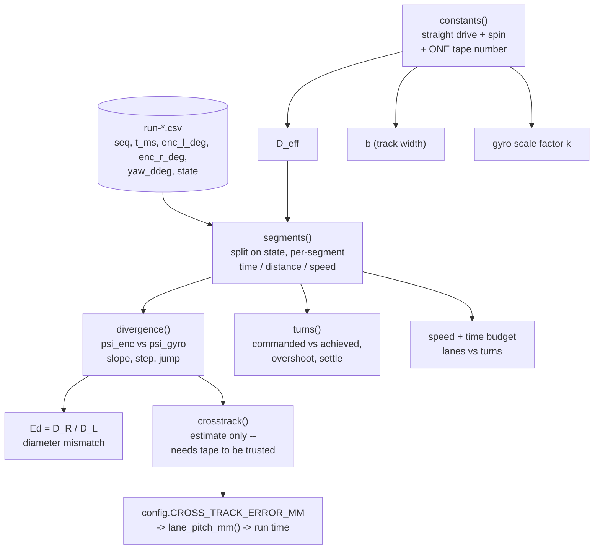
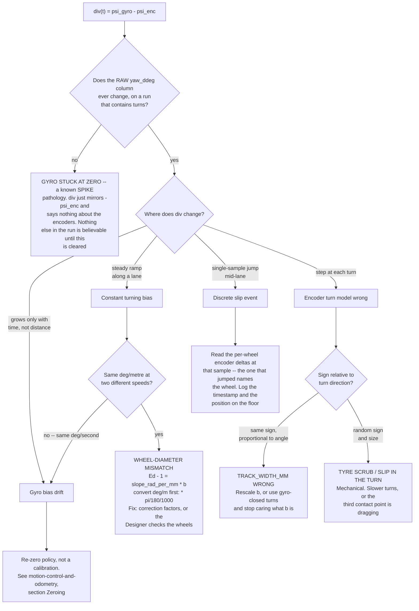

# Motion-quality analysis — what to compute from encoders and the gyro

**Type:** FORWARD-PLAN · **Status:** research + specification only. **No code, no hardware, no data.** · 2026-08-26

> **Nothing here has been run.** The hub has never been connected ([known-unknowns.md](./known-unknowns.md)
> KU-M1/KU-M2), no robot exists, and no telemetry record has ever been produced. Worked examples use
> **invented numbers marked `[ILLUSTRATIVE]`** to show the *shape* of an output; **none may enter the
> Intro Report.** Rules: [../directives/honest-instrumentation.md](../directives/honest-instrumentation.md)
> · [../directives/documentation-discipline.md](../directives/documentation-discipline.md)
>
> **Scope.** This is only the **maths that turns a logged run into numbers**, plus the argument for which
> of it is worth writing. Transport and record format:
> [telemetry-over-bluetooth.md](./telemetry-over-bluetooth.md) §5–§6 and
> [telemetry-and-analysis.md](./telemetry-and-analysis.md). Procedure:
> [../runbooks/measure-drivetrain.md](../runbooks/measure-drivetrain.md). Detection/colour analysis is a
> sibling plan, deliberately out of scope.

---

## Summary

Two logged columns — `enc_l_deg`/`enc_r_deg` and `yaw_ddeg` — are enough to answer *"did the robot drive
where it thought it did?"*, and to **extract the drivetrain constants rather than assume them**.
`WHEEL_DIAMETER_MM = 56.0` and `TRACK_WIDTH_MM = 176.0` in [../../src/config.py](../../src/config.py) are
both `[ASSUMED]` placeholders (KU-M3) and both scale everything downstream: distance, turn angle, lane
pitch, run time.

Five claims, in order of how much they change the project:

1. **Gyro-versus-encoder divergence is the highest-value computation here and it costs nothing extra** —
   both columns are logged for other reasons. The **shape** of their difference (a ramp along a lane, a
   step at a turn, a single-sample jump) separates wheel-diameter mismatch from a wrong track width from
   a discrete slip event. Three faults, three fixes, one subtraction.
2. **The drivetrain constants fall out of two drives, not out of a ruler.** A straight drive plus one tape
   number gives effective rolling diameter; a logged spin gives track width by least-squares regression
   against the gyro, using every sample rather than the endpoints. That same spin also calibrates the
   **gyro's own scale factor**, which nothing else in this project measures.
3. **Cross-track error cannot be honestly measured from odometry alone** — an error estimate derived from
   the pose estimate that produced it is circular. The log gives the shape and trend; a tape measure gives
   the scale. Calibrate the log-derived estimator against the tape **once**, then trust it.
4. **Full UMBmark is not worth it here; a reduced version is, after the constants are set.** 3 cw + 3 ccw,
   ~20 minutes, as confirmation rather than primary calibration — and the first thing to cut.
5. **Where the time actually went is one pass over the `state` column**, and it is the empirical answer to
   the one thing [../findings/coverage-time-budget.md](../findings/coverage-time-budget.md) explicitly
   left out: turn overhead.

**What gets implemented is a strict subset**, ranked at the end: ~155 lines of standard-library Python in
`./data_analysis/`, one text block out.



---

## Recovering the drivetrain constants

**Procedure is the runbook's, not this document's.** M3 (straight drive, five trials, 800–1200 mm) and M4
(1080° spin, three trials each direction) are specified in
[../runbooks/measure-drivetrain.md](../runbooks/measure-drivetrain.md) §5–§6, including why the moulded
wheel number is not the rolling number and why a ruler across the chassis is not the track width. **Do not
re-derive it.** What follows is the arithmetic applied to the *logged* output of those steps — better than
the runbook's paper form, because the log records the encoder degrees the motors **actually delivered**
rather than the number commanded.

### Effective rolling diameter `D_eff`

Per trial, with `d` the tape-measured travel along the direction of motion and `Δenc` the mean of the two
wheels' logged encoder deltas over the moving portion of the run:

```
D_eff  =  360 * d  /  (pi * Delta_enc_mean_deg)
```

The runbook's paper form divides by the *commanded* revolution count `N`; using the logged `Δenc` removes
an assumption, because a motor that stalled briefly silently corrupts the commanded-N version and is
visible in the logged one.

**Combining the five trials** — median not mean, and the spread is a result in its own right (runbook
§5.2). The analysis adds one thing the paper form cannot: **the spread has a computable floor.**

```
spread          = max(D_eff) - min(D_eff)
tape_floor_pct  = 2 * tape_error_mm / d_nominal_mm * 100   # a +/-e reading error can put one trial at
                                                           # +e and another at -e, so the floor on the
                                                           # SPREAD is 2e, not e
```

| Spread, as % of median | Reading |
|---|---|
| `<= tape_floor_pct` | **Measurement-limited.** The drivetrain is more repeatable than the tape can see. Stop; a longer run is the only way to do better |
| `tape_floor_pct` … 2 % | Real variation, tolerable. Report the median and carry the spread into the finding |
| `> 2 %` | **Do not average it away** (runbook §5.2). Slip, a loose wheel, a dragging third contact point, or an inconsistent start alignment. Find the cause and re-run the set |

Worked shape only: `d ≈ 1000 mm` (mid-band for runbook M3.2) with the runbook §5.1 figure of ±2 mm for
the whole measurement ⇒ `tape_floor_pct ≈ 0.4 %`. The comparison spreads are `[ILLUSTRATIVE]` and
invented — a 0.3 % spread would be measurement-limited and 3 % a fault to chase. **No spread here is
ours; none has been measured.** Report
`D_eff` to 0.1 mm and no further, and **per surface** — the loaded rolling diameter is surface-dependent
(KU-M8).

### Wheel-diameter *mismatch* `Ed = D_R / D_L` — free, from a straight drive

`D_eff` is the *average* of the two wheels. Their **ratio** is a different constant and it is the one that
causes missed lanes: [../research/motion-control-and-odometry.md](../research/motion-control-and-odometry.md)
§ Odometry arithmetic tabulates 0.1 mm of mismatch as ~74 mm of cross-track over one 3.05 m lane — **cite
that table, do not recompute it.** Run M3 open-loop (heading correction OFF, which the runbook already
requires) and the gyro measures the curvature for free. Inverting its formula 2:

```
Ed - 1  =  b * Delta_psi_gyro_rad  /  L_travelled_mm
```

One straight leg, both columns already logged, no square path and no extra class time. **Two honest
caveats, and they are why UMBmark exists:**

- It **conflates** a diameter mismatch with any other constant turning bias — floor camber, carpet grain,
  a dragging caster. Run the same lane in both directions and apply the runbook's §8.1 split: an error
  that mirrors with the robot is geometric; an error that stays on the same side of the *room* is the
  floor. (Runbook §8.1 flags that split as **our own reasoning from** Borenstein's error separation, not a
  transcription of it — treat it as a hypothesis to check, not an established result.)
- It inherits the **gyro's scale factor**, which is calibrated below and is otherwise unknown.

### Track width `b` — regression against the gyro, not two marks on the floor

For an in-place spin, the difference in wheel travel is exactly the arc swept by the track:

```
s_R - s_L  =  b * psi_rad
```

so over a logged 1080° spin, `b` is the **slope of `(s_R − s_L)` against `ψ_gyro`**, fitted through the
origin over every sample in the spin:

```
sdiff_i =  s_R(t_i) - s_L(t_i)      # CUMULATIVE from the start of the spin, mm -- not a per-sample delta
psi_i   =  psi_gyro(t_i)            # CUMULATIVE, unwrapped, and in RADIANS. Feeding degrees here makes
                                    #   b_hat come out 57.3x too small
b_hat   =  sum( sdiff_i * psi_i )  /  sum( psi_i^2 )
```

with `s = degrees_to_mm(Δenc, D_eff)` — so **`D_eff` must be settled first**; this estimator inherits it.

Why the regression and not the endpoints: a 1080° spin at even 20 Hz is hundreds of points instead of two,
and the **residual scatter about the fitted line is the trustworthiness measure**. A tight line means a
clean pivot; a line that *bends* means `b` is not constant through the turn — the physical truth about a
scrubbing rubber tyre, and exactly why the runbook §6.1 refuses the ruler value. Report `b̂`, the RMS
residual in mm, and whether that residual is random (noise) or systematic in `ψ` (the pivot point moving).

**This estimator is not independent of the gyro:** if the gyro reads 2 % high, `b̂` comes out 2 % low.
Unavoidable, and it is why one tape measurement stays in the loop.

### One spin, two constants: the gyro scale factor `k`

Run M4.3's chord measurement — tape only, no protractor needed, formula in the runbook §6.4 — on **one**
of the spins, and log the gyro through the same spin (M4.5 already asks for this). Then:

```
theta_tape  =  1080 + residual_deg        # signed by eye: "over" or "short" (runbook 6.4)
k           =  theta_gyro / theta_tape    # gyro scale factor, dimensionless
b_true      =  b_hat * k
```

`k` is a constant this project has **no** value for and no other planned measurement produces. It gates
§ Cross-track error: every claim that the gyro is a usable heading witness rests on `k` being near 1 and
on the drift budget in [../research/motion-control-and-odometry.md](../research/motion-control-and-odometry.md)
§ "How much drift can we tolerate?".

### Combining trials, and what a bad spread means

Median of the 3 CW trials and of the 3 CCW trials **separately** — never pooled. Runbook §6.5 carries the
warning in full: **if the two direction medians disagree by more than the spread within each direction,
the residual is not a track-width error at all.** The sign convention *is* the diagnostic, so state it:
compare the residual **relative to the commanded turn direction** ("over" or "short", runbook §6.4), never
in room coordinates — the two conventions invert each other, and that inversion is easy to import by
accident. In the
relative convention a **wheelbase error keeps its sign** (the robot under- or over-rotates the same way
round both ways: Borenstein & Feng's **Type A**) and a **wheel-diameter mismatch reverses** it (**Type
B**). That is precisely why a CW/CCW disagreement says the residual is *not* `b`
([paper on disk](../research/papers/borenstein1995b-systematic-odometry-correction.txt), Fig. 2 and the
Type A / Type B definitions). Splitting the difference into a `b` that fits neither direction is the
failure mode to avoid.

> **⚠ Runbook §6.5 states this pairing the other way round, and it is wrong.** Borenstein's definitions
> are explicit and use absolute values: Type A is *"an orientation error that reduces (or increases) the
> total amount of rotation … in **both** cw and ccw direction"* and is caused by the wheelbase error `Eb`;
> Type B *"reduces … in one direction, but increases … in the other"* and is caused by `Ed`. The runbook
> needs the same correction — outside this document's zone, flagged here so the two do not silently
> disagree.

**Three untrustworthy-measurement triggers, each worth printing as a banner:** `D_eff` spread > 2 % of
median (slip or a mechanical fault — not a number yet) · CW/CCW `b` medians disagreeing by more than the
within-direction spread (not a track error at all; book the reduced UMBmark) · a regression residual that
is systematic in `ψ` rather than random (`b` is not constant through a turn, so a single scalar `b` will
never fit and the gyro-verified turn is the answer, not a better `b`).

---

## UMBmark

**The paper is on disk and the algebra is already transcribed once in this repo. Do not transcribe it
again.** The correction equations (α, β, `Ed`, `Eb`, `cL`, `cR`, eqs. 7–18) and the condensed procedure
are in [../research/motion-control-and-odometry.md](../research/motion-control-and-odometry.md)
§ "UMBmark, concretely enough to run in one class session"; the source is
[borenstein1995-umbmark-benchmark](../research/papers/borenstein1995-umbmark-benchmark.txt) with the
correction method in [borenstein1995b](../research/papers/borenstein1995b-systematic-odometry-correction.txt).

### What the analysis script computes from a UMBmark run

Per run, and then per direction cluster:

| Quantity | From | Physical meaning |
|---|---|---|
| `(εx, εy)` per run | measured return pose minus odometry-calculated return pose, in the start frame | How far the robot's belief about "back where I started" is wrong |
| `(x_cg, y_cg)` per direction | centroid of the 5 (or 3) runs in that direction | The **systematic** error — the part calibration removes |
| `E_max,syst` | the larger of the two centroid radii | Borenstein's headline number, and the one that compares to his 232–423 mm → 12–35 mm result |
| Scatter about each centroid | RMS radial distance of runs from their own centroid | The **non-systematic** error — the part calibration **cannot** remove |
| `α` (deg per 90° turn) | sum of the two centroids | Wheelbase error, Type A |
| `β` (deg per leg) | difference of the two centroids | Diameter mismatch, Type B |
| `Eb`, `Ed`, `cL`, `cR` | α, β and the square side `L` | The corrections to apply to `b` and to each wheel's counted travel |

**The row people forget is the scatter one**, and for this project it is the most useful: it is the
irreducible run-to-run variability, and it — not the centroid — is what
`config.CROSS_TRACK_ERROR_MM` should carry as a margin. A calibration that drives `E_max,syst` to zero
while the scatter stays at 40 mm has not made the sweep reliable.

### Is it worth it here? Partly. Run the reduced version, and run it last.

**Against:** ten runs plus measurement is 30–40 minutes
([motion-control-and-odometry.md](../research/motion-control-and-odometry.md) § UMBmark) out of five class
sessions in which the robot does not yet exist. Borenstein's LabMate ran on **wheel encoders alone** in
these experiments — no heading witness independent of the odometry appears anywhere in the paper — which
is why his method has to recover the orientation error indirectly, from where a *bidirectional* square
path ends up. We have that witness: the `Ed`
estimator above gets Type B from one straight leg and `b̂` gets Type A from one spin, about six minutes of
floor time between them.

**For:** those two estimators are each single-fault-blind, they share the gyro as a common dependency, and
neither proves the constants *compose* over a closed path with turns in it. UMBmark is the only end-to-end
check, and a before/after table against a published benchmark is a strong Intro Report artefact.

**Recommendation — reduced UMBmark: 3 cw + 3 ccw, largest square the room allows, ~20 minutes, scheduled
after `D_eff`, `b` and `k` are settled, treated as verification rather than primary calibration.** Three
runs place a centroid only while the systematic term is much larger than the within-cluster scatter, and
Borenstein's own vehicles show **both** regimes (UMBmark §4.1–4.4): *uncalibrated*, `E_max,syst` was
310 mm against σ = 50 mm and 423 mm against σ = 31 mm — 6–14×, and three runs would locate that
comfortably; *after calibration*, the same two configurations gave `E_max,syst` = 26 mm with σ = 32 mm and
`E_max,syst` = 20 mm with σ = 49 mm — **the scatter was larger than the centroid it was supposed to
reveal.** We run this *after* calibration, i.e. in the second regime, so the honest expected outcome is
**"the residual systematic error is below what three runs can resolve"** — a real and sufficient
verification result, and the one the analysis must be willing to print. It is **not** a licence to report
a three-run centroid as a measured systematic error. Three runs is likewise **not** enough to estimate the
scatter, and the analysis must say so rather than print a standard deviation of three numbers as though it
meant something.

The often-quoted **10–22×** is a *different* statistic — `E_max,syst` before compensation over
`E_max,syst` after, across the correction paper's eight experiments — and one of the eight reached 21×
only on a **second** compensation pass (6.4× on the first,
[papers/INDEX.md](../research/papers/INDEX.md)). It says nothing about how many runs locate a centroid,
and it must not be used as if it did.

**If class time runs out, this is the first item to cut** — and what is lost is stated plainly: the only
end-to-end proof that the constants compose, and the report's strongest quantitative figure. It is not
lost silently; the report says the calibration was verified per-constant but not end-to-end.

**Implementation consequence: do not write the UMBmark reduction until a UMBmark run has actually
happened.** It is about fifteen lines when there is data, and worth exactly zero before.

---

## Gyro-versus-encoder divergence

**The highest-value item in this document.** Both estimators are already logged for other reasons, so
their difference is free, and it is a *continuous* fault channel rather than a single end-of-run number.

### What to compute

```
psi_enc(t)   = running sum of heading_from_encoders(ds_L, ds_R, b)    # UNWRAPPED, degrees
psi_gyro(t)  = unwrap(yaw_ddeg / 10.0) / k                            # k from the spin calibration.
                                                                      # DIVIDE: k = theta_gyro/theta_tape,
                                                                      # so k > 1 means the gyro reads HIGH
                                                                      # and the raw column must come DOWN
div(t)       = psi_gyro(t) - psi_enc(t)                               # divergence, degrees, SIGNED
s(t)         = running sum of (ds_L + ds_R) / 2                       # distance along the path, mm
```

The analysis calls the same pure functions the robot calls, per
[ADR-0002](../decisions/0002-split-mission-logic-from-hub-io.md) (superseded on *layout* by
[ADR-0004](../decisions/0004-flat-src-supersedes-package-split.md); the purity goal it states still
binds) — so a replay is not a *model* of what
the robot did, it is what the robot did. **But call `heading_from_encoders()` directly and accumulate
here; do not reuse `Odometry`'s own headings.** `Odometry.encoder_heading_deg` is `normalize_angle()`d
every tick and `heading_disagreement_deg()` returns an **absolute** value — both correct for the
in-mission alarm, both wrong for this analysis, which needs the **sign** (a signed step names the turn
direction) and the **unwrapped** total (a 1080° spin is 1080°, and a gyro stuck at zero across 132 turns
drives `div` past ±180° many times over). Wrapping here would alias exactly the faults this section
exists to find.

**If this is ever plotted, plot `div` against `s`, not against `t`, and colour by `state`** — distance is
the right x-axis because most of the faults are per-metre-travelled, and the one that is not is precisely
the one we want to tell apart. **It is deliberately not in the contract below:** plotting lives in
`plot_run.py`, which [telemetry-over-bluetooth.md § 6.2](./telemetry-over-bluetooth.md#62-plot_runpy) caps
at two panels on purpose, and § Numbers to print carries the same information as numbers.

### What the shape means

**Check the raw `yaw_ddeg` column before computing anything.** A gyro stuck at 0 is a documented
stock-firmware pathology ([../research/motion-control-and-odometry.md](../research/motion-control-and-odometry.md)
§ "The drift / stuck-at-zero pathology"), and when it happens `div` is simply `−ψ_enc` — it carries no
information about the encoders at all, and on a straight-only calibration drive it is indistinguishable
from a healthy run. The test is on the raw column, not on `div`: does `yaw_ddeg` ever change?



The ramp/drift split is the one worth being explicit about, because it is the only place two different
faults produce the same picture:

| Fault | Constant in… | Test |
|---|---|---|
| Wheel-diameter mismatch | **degrees per metre** | Run one lane at half speed. Same deg/m, half the deg/s ⇒ geometric |
| Gyro bias drift | **degrees per second** | Same lane at half speed. Same deg/s, **twice** the deg/m ⇒ gyro — half the speed is twice the time, so twice the drift accumulates over the same distance |

One extra lane at a different speed settles it. That is thirty seconds of floor time and it is the
cheapest diagnostic in the whole project.

### Numbers to print

- Per `state=="lane"` segment: fitted slope of `div` in **deg/m**, its R², and the implied `Ed − 1`.
  **Convert before multiplying — `slope·b` is dimensionless only if the slope is in rad/mm:**
  `Ed − 1 = slope_deg_per_m · b_mm · π / (180 · 1000)`. (Sanity check against the research table's
  `b` = 112 mm: 0.918 deg/m ⇒ `Ed − 1` = 0.0018, its 0.1 mm row.)
- Per turn segment: the **step** `Δdiv` across the turn, signed by turn direction, and the step as a
  fraction of the commanded turn angle (that fraction *is* `db/b` if the cause is the track width).
- Jump detector: any single-sample `|Δdiv|` above `k_mad` × the **median** of `|Δdiv|` over the run. That
  median is a *robust scale, not a standard deviation*, so the multiplier must not be read as a sigma
  count: for Gaussian increments `median(|x|) = 0.6745·σ`, so `k_mad = 6` is about **4 σ**, not 6. Print
  sample index, `t_ms`, `s`, and both encoder deltas. Start at `k_mad = 6` and **tune it against a real
  run**; the right value is unknowable without data.
- End-of-run `|div|`, and the **95th percentile of `|div|`**.

That p95 answers an open `UNVERIFIED` in `src/odometry.py`, whose `heading_disagreement_deg()` docstring
says the *"stop and re-square"* threshold must be measured. Set the in-mission alarm above the p95 of
healthy runs and below the heading budget `θ_max = atan(ε / L)` that one lane can absorb.

---

## Cross-track error, and its honest limits

`CROSS_TRACK_ERROR_MM = 15.0` is `[ASSUMED]` and flagged optimistic in both
[../../src/config.py](../../src/config.py) and
[../findings/coverage-time-budget.md](../findings/coverage-time-budget.md). It feeds `lane_pitch_mm()` →
`lane_count()` → `sweep_path_mm()`, so it multiplies the entire run-time budget: on the finding's formula
(`pitch ≤ 76 − 2e`) 15 mm cuts the usable pitch from 76 mm to 46 mm and takes the 10-foot case from 125 m
to 204 m. **Cite that finding for the arithmetic; it is not re-derived here.** But `config.lane_pitch_mm()`
subtracts a further `LANE_OVERLAP_MM = 5.0` and therefore returns **41 mm, not 46** — the deliberate margin
KU-M7 also records. The two formulas are both in the repo, so **every printed pitch must name the formula
that produced it**, and `crosstrack()` compares against `config.CROSS_TRACK_ERROR_MM`, not against a pitch.

### The circularity, stated plainly

**An error estimate computed from the pose estimate that produced it is circular.** If `D_eff` is 2 % low
and `b` is 3 % high, the odometry pose is wrong in exactly the way that makes the robot *believe* it drove
a straight lane. Odometry cannot see its own systematic error. No amount of cleverness in the analysis
script changes that, and any document claiming a measured cross-track error from encoder data alone is
wrong.

### What the log *can* legitimately give

**(a) A heading-based estimate that fails independently.** The gyro and the encoders do not share the
geometric error, so once `k` is calibrated the gyro is close enough to an external witness over one lane
that:

```
e_hat  =  integral over the lane of  sin( psi_gyro - psi_target )  ds
```

is a real estimate — under one stated assumption: **the gyro's bias over one lane is small compared with
the answer.** That is testable (the drift budget in
[../research/motion-control-and-odometry.md](../research/motion-control-and-odometry.md) § "How much drift
can we tolerate?"), and if it fails `e_hat` is worthless and the analysis must say so rather than print a
number.

**(b) The *shape* of the accumulation, which validates the controller without any tape at all.**
Heading hold zeroes the heading *rate*, not the offset already accrued — that document's § "Heading hold
does not fix lateral offset" is explicit about it. So the two configurations have different signatures:

| Configuration | `e_hat(s)` should look like | If it does not |
|---|---|---|
| Open loop (M3) | Grows roughly with `L²` — no mechanism removes it | The gyro or the assumption in (a) is wrong |
| Heading hold on (M8) | Rises during the initial transient then **plateaus** — the robot ends up parallel to the lane, offset by what it accrued before the loop caught it | The heading loop is not converging: gain too low, or `Ki` is absent and a steady bias is being integrated into a ramp |

**That distinction is checkable from the log alone**, needs no ground truth, and is a genuine verification
of the heading controller. It is the part of this section that is not circular at all.

**(c) The gyro-encoder divergence itself**, which bounds how far the two estimators can *both* be right.

### What genuinely requires a tape measure

**The absolute lateral offset at the end of a lane** (runbook M8.4 — nothing in the log substitutes for
it) · **any relation between the odometry frame and the arena frame**, i.e. where the robot is in the room
and whether the lanes tile the arena · **the direction split** (runbook §8.1: error that mirrors with the
robot versus error that stays on the same side of the room — defined in room coordinates, which the robot
does not have).

### The recommended path: calibrate the estimator once, then trust it

Run M8 with the tape as specified and put the six tape-measured `e` values in the run's CSV header. The
analysis prints, per lane, `e_hat` beside `e_tape` and the ratio.

- `e_hat / e_tape ≈ 1` across six lanes ⇒ **the estimator is validated**, and later runs — including ones
  with nobody on the arena holding a tape — can use `e_hat`. That is how a circular estimate becomes a
  trusted one: checked against something outside itself, once.
- Consistently off by a scale factor ⇒ that factor is a finding about `k` or `b`.
- Inconsistent ⇒ `e_hat` is not usable, the tape is the only source, and the report says so.

**Aggregate with the maximum, never the median** (runbook M8.7) — the lane pitch must survive the worst
lane, because one bad lane is a missed note. Print median *and* max, flag any lane over
`config.CROSS_TRACK_ERROR_MM`, and state `L` beside every number: cross-track grows with `L²`, so a figure
without its lane length is meaningless.

---

## Turn quality

Control-side design — gyro turns versus geometric turns, the settle-and-verify state machine, the
overshoot-versus-speed evidence — is [../research/motion-control-and-odometry.md](../research/motion-control-and-odometry.md)
§§ "Turning accurately" / "Settle and verify". **Cite it; specify only the analysis.**

Per turn segment (`state` starts with `turn`), from `ψ_gyro` alone:

| Metric | Computation | What it decides |
|---|---|---|
| Achieved angle | `ψ_gyro` at settle minus `ψ_gyro` at segment start, unwrapped | — |
| Turn error | achieved − commanded, **signed** | Mean = systematic, correctable by one scale factor. Spread = irreducible |
| Overshoot | peak `\|ψ − ψ_target\|` after the motor-stop sample, minus the final error | Whether to lower turn velocity |
| Settle time | from motor-stop sample until `\|dψ/dt\|` < ε **and** `\|ψ − ψ_final\|` < TOL, held for a few samples | **Supplies `SETTLE_MS`**, which that document says MUST BE MEASURED and currently starts at a guessed 200 ms |
| Retries | count of creep corrections in the segment | Turns sitting on the tolerance boundary; a rising retry count over a run is a battery or gyro trend |
| Duration | segment wall time including settle | Feeds the time budget below |

**Split every statistic cw versus ccw**, in the same relative-to-turn-direction convention as
§ Recovering the constants. An error that **keeps** its sign there is a **scale** error — a wrong `b` if
the turn was encoder-commanded, a wrong gyro `k` if it was gyro-closed, or a fixed stopping latency. An
error that **reverses** its relative sign is constant in *room* coordinates and is therefore a **gyro
zero/bias offset**, not a geometry error. The direction split alone cannot separate `b` from `k`: that
needs an encoder-commanded turn and a gyro-closed turn compared against each other.

**Error against commanded turn velocity** is one small table — our own version of the published Prime
Lessons result cited in the research doc (**not reproduced here, and not ours**). Whatever our numbers
are, the transferable claim is that the error is *systematic*, therefore correctable, and that the 0.2 s
per turn it costs to drop from 500 to 200 deg/s bought Prime Lessons a **fourfold** cut (+8° → +2°) — a
trade worth making across 48–132 turns per run.

**Setting `TOL` is arithmetic, not taste:** a residual `θ` costs `L·tan θ` on the next lane, so
`TOL = atan(allowance / L)` with the allowance from the cross-track budget. Print the implied `TOL` beside
the measured spread — a spread exceeding the implied `TOL` means the verify loop will retry on most turns
and the turn velocity is too high.

---

## Speed and timing

**Loop rate is specified elsewhere** — [telemetry-over-bluetooth.md](./telemetry-over-bluetooth.md) §6.1
block 3 computes median/p5/p95/max of `diff(t_ms)`. **Do not duplicate it.** What motion analysis takes
*from* it: the achieved rate, not the LEGO sensor spec, bounds traverse speed (KU-M5), and
`SAMPLE_RATE_HZ = 100.0` in config is a sensor spec figure, not a measured Python loop rate.

### Ground speed

```
v_ground(t)   = d(s) / d(t)                         # centre-point distance per sample, smoothed
v_expected    = pi * D_eff * omega_cmd / 360        # runbook SS 7.1 -- D_eff is why M3 comes first
```

Report the **steady-state median with ramps excluded**, per lane segment, plus the ratio
`v_ground / v_expected`. Runbook §7.1 already gives the signature table that reads that ratio — saturation
versus **wheel slip** (`< 0.95`) versus control loss — so print the ratio and point at that table rather
than restate it. Slip is speed- and surface-dependent: **record the surface with every number.**

[../research/speed-envelope.md](../research/speed-envelope.md) marks the control-side ceiling on its
~300 mm/s target as **UNMEASURED** and names the falsifier as "sweep the speed and watch `e`". This
analysis *is* that falsifier: `v_ground` from here, `e_hat` from § Cross-track, one row per speed step.

### Acceleration ramps

Fit the rise of `v_ground(t)` at the start of each lane and extract `a_eff` and `t_ramp` — the input to
the trapezoidal time model `d/v + v/a` used in the research doc's turn-cost table. **Print predicted
segment duration beside actual, per segment.** If the model matches, the coverage-time arithmetic can be
trusted for arena sizes we have not driven, which is the whole reason that budget is parameterised.

### Where the time actually went — the headline

One pass over the `state` column:

```
per state in {idle, lane, turn_a, step, turn_b, done}:
    total seconds, % of run, total distance mm, mean v_ground
plus:  distance driven / distance planned      (path efficiency)
```

`[ILLUSTRATIVE]` output shape — **invented numbers, do not quote:**

```
STATE       time_s    %      dist_mm   v_mms
lane        188.4   62.1     28260     150.0
turn_a       41.0   13.5         0       -
turn_b       39.6   13.1         0       -
step         28.2    9.3      1840      65.2
idle          6.1    2.0         0       -
```

[../findings/coverage-time-budget.md](../findings/coverage-time-budget.md) **explicitly excludes turn
overhead**; the research doc estimates it at 10–30 % of a run. This table is the measured version, and it
decides which lever matters: **if turns are a quarter of the run, the answer is fewer lanes — a better
cross-track number, or more sensors — not a faster lane speed.** That conclusion is unreachable without
this decomposition, and it is the kind of quantitative result the Intro Report is graded on.

---

## What actually gets implemented

`./data_analysis/main.py` plus **one** module, `motion.py`. Standard library only — `csv`, `math`,
`statistics` — matching the constraint already established for `analyse_run.py`. One positional argument
(the run CSV), at most one flag, one text block on stdout. Constants at the top of the file. In the
spirit of [../../inventory.py](../../inventory.py): a script a teammate can open and edit, not a framework.

**Ownership, so nobody writes the same thing twice.** Items 2 and 5 below are the full-resolution versions
of blocks **4** (heading divergence) and **5** (cross-track per lane) of `analyse_run.py`
([telemetry-over-bluetooth.md § 6.1](./telemetry-over-bluetooth.md#61-analyse_runpy)), specified before
this plan existed. `motion.py` **owns** those two; `analyse_run.py` keeps blocks 1–2 and hands 3, 6 and 7
to `detection.py` ([analysis-detection-quality.md § What actually gets implemented](./analysis-detection-quality.md#what-actually-gets-implemented)).
Block 5's `odometry.cross_track_error_mm(mean_heading_error, L)` is superseded by the integral form in
§ Cross-track — the same question with one fewer approximation.

Ranked by value. **The list below is the contract; anything above that is not on it does not get written.**

| # | Function | ~Lines | Closes | Why it earns its place |
|---|---|---|---|---|
| 1 | `segments(rows)` — split on `state`; per segment: duration, distance, mean `v_ground`; plus the run-level time-budget table | 30 | KU-M5 (traverse speed), turn overhead | Everything else consumes it, **and** it alone produces the where-the-time-went table |
| 2 | `divergence(segments)` — `ψ_enc` vs `ψ_gyro`; per-lane slope in deg/m; per-turn step; jump detector; p95; implied `Ed` | 45 | KU-M3 (mismatch), KU-M9, the `heading_disagreement_deg()` threshold | Free — both columns are already logged — and it is the only continuous fault channel we get |
| 3 | `constants(rows, tape_mm)` — `D_eff` median/spread/tape-floor; `b̂` by least-squares regression + residual; gyro scale factor `k` | 35 | KU-M3 (the two constants that scale everything) | Turns two short drives into the numbers that replace `[ASSUMED]` values in `config.py` |
| 4 | `turns(segments)` — commanded vs achieved, overshoot, settle time, retries, cw/ccw split, implied `TOL` | 25 | `SETTLE_MS`, `TOL` | Two constants the design currently guesses; nothing else measures them |
| 5 | `crosstrack(segments)` — `e_hat` per lane, median **and** max, ratio against tape values if the header carries them | 20 | KU-M4, and therefore the whole coverage budget | Small, but only trustworthy once calibrated against the tape — the function prints the ratio, not a bare number |

**Explicitly NOT implemented, and why:**

| Not written | Reason |
|---|---|
| UMBmark reduction (α, β, `Ed`, `Eb`, `cL`, `cR`, `E_max,syst`) | ~15 lines, and worth zero until a UMBmark run exists. Write it the day the run happens, not before |
| Any filter — Kalman, complementary, fusion | We log raw and the mission uses the gyro directly. A filter would hide exactly the divergence that item 2 exists to expose |
| XY path plot | Already owned by `plot_run.py` in [telemetry-over-bluetooth.md](./telemetry-over-bluetooth.md) §6.2. Do not build a second one |
| Slip models, per-wheel dynamics, IMU bias modelling, `Ki` auto-tuning | Modelling where we have no measurements. The project's rule is measure, do not model |
| Ramp fitting (`a_eff`, `t_ramp`) and predicted-vs-actual segment duration | Specified in § Speed and timing as the argument for trusting the trapezoidal model, and left out of the contract on purpose: the fit means nothing until a speed ladder has been driven. Item 1 already prints actual duration per segment, which is what the time budget consumes. Write it the day M7's ladder exists |
| The `div`-against-`s` panel | Plotting belongs to `plot_run.py`, capped at two panels by [telemetry-over-bluetooth.md § 6.2](./telemetry-over-bluetooth.md#62-plot_runpy). Item 2 prints the slope, the step and the jump list — the three things the panel would show |
| Any second output format — JSON, HTML, a dashboard | One text block. A second format is a second thing to maintain and nobody reads it |

**Rough total: ~155 lines plus a `main.py` that reads the CSV and calls five functions in order.**

---

## Open questions

1. **Does the record carry a `state` column at all?** Items 1, 4 and 5 all depend on it, and it comes from
   `src/sweep.py` via the telemetry record ([telemetry-over-bluetooth.md](./telemetry-over-bluetooth.md)
   §5). If the first working transport cannot afford the column, segmentation must be inferred from the
   encoder signs instead — doable, but worse, and it should be a deliberate decision rather than a
   discovery during analysis.
2. **Is `yaw_ddeg` really decidegrees, and which sign is positive?** Marked `[ASSUMED]` in the record
   format and resolved by gate G6 there. Every heading computation in this document inverts if the sign
   is the other way. The analysis should **assert** the header's declared units rather than trust them.
3. **What is the achieved loop rate?** If it is low — say under 20 Hz — the spin regression has fewer
   points than assumed and the jump detector may miss a slip that lasts one sample. Neither breaks, but
   both get noisier, and the document should be revisited once the number exists (KU-M5).
4. **Does the gyro survive a full run without re-zeroing?** If it must be re-zeroed between lanes,
   `ψ_gyro` is not continuous and `divergence()` must be computed per-segment rather than across the run.
   `e_hat` in § Cross-track depends on the same answer.
5. **Where do the tape numbers live?** Cross-track calibration needs `e_tape` beside the log.
   **Recommendation: CSV header fields**, written by the capture script from a prompt, so a run and its
   ground truth cannot be separated. A sidecar is easier to type later and easier to lose.
6. **Literature gap, stated honestly.** ResearchHub returned **zero** results on 2026-08-26 for
   odometry-calibration, dead-reckoning-error and gyro/encoder-fusion queries — a genuine empty result,
   not an outage. Everything cited here is the four odometry papers on disk (twelve are filed there in
total) plus this repo's own research. If a
   later query returns anything on **non-systematic** odometry error, the § UMBmark scatter row is where
   it belongs.

---

## Sources

**On disk** — see [../research/papers/INDEX.md](../research/papers/INDEX.md):
[borenstein1995-umbmark-benchmark](../research/papers/borenstein1995-umbmark-benchmark.txt) (the benchmark,
the bidirectional square, the Type A / Type B separation) ·
[borenstein1995b-systematic-odometry-correction](../research/papers/borenstein1995b-systematic-odometry-correction.txt)
(the correction algebra behind `Eb`, `Ed`, `cL`, `cR`) ·
[nutalapati2020-wheeled-robot-odometry-calibration](../research/papers/nutalapati2020-wheeled-robot-odometry-calibration.txt)
(the modern case for *calibrating* wheel diameter and track width rather than trusting geometry) ·
[niu2019-wheel-mounted-imu-dead-reckoning](../research/papers/niu2019-wheel-mounted-imu-dead-reckoning.txt)
(MEMS IMU drift — **qualitative only: their IMU is wheel-mounted, ours is in the hub, so the mechanisms
transfer and the numbers do not**).

**This repo:** [../runbooks/measure-drivetrain.md](../runbooks/measure-drivetrain.md) (the procedure —
M3, M4, M7, M8) · [../research/motion-control-and-odometry.md](../research/motion-control-and-odometry.md)
(odometry arithmetic, UMBmark algebra, turn control, gyro behaviour) ·
[../findings/coverage-time-budget.md](../findings/coverage-time-budget.md) (why cross-track error
multiplies run time) · [../research/speed-envelope.md](../research/speed-envelope.md) (the speed target
this analysis falsifies or confirms) · [telemetry-over-bluetooth.md](./telemetry-over-bluetooth.md) §5–§6
(record format, sibling analysis blocks) · [telemetry-and-analysis.md](./telemetry-and-analysis.md) (why
analysis is planned before it is written) · [known-unknowns.md](./known-unknowns.md) (KU-M3, M4, M5, M8,
M9) · [bench-measurement-plan.md](./bench-measurement-plan.md) (the class period these runs come from) ·
[../../src/odometry.py](../../src/odometry.py) and [../../src/config.py](../../src/config.py) (the
functions replayed and the constants replaced).

**ResearchHub:** queried 2026-08-26 on odometry calibration, dead-reckoning error, and gyro/encoder
fusion. **Zero results, verified genuine** (service healthy, preflight passed) — recorded so nobody repeats
the search assuming it was an outage.

---

## Revision History

| Date | Change | By |
|---|---|---|
| 2026-08-26 | Created. Research + specification only; no code, no hardware, no data. | Claude |
| 2026-08-26 | Adversarial audit. Corrected the Borenstein Type A / Type B pairing (it was inverted, and the runbook §6.5 sentence it inherited is inverted too), the gyro scale factor `k` applied as `× k` where the correction is `÷ k`, the drift-vs-geometry test row (`half the deg/m` → **twice**), `k_sigma` renamed `k_mad` with the median-vs-σ conversion stated, the spin regression made explicitly cumulative and in radians, the 46 mm pitch re-attributed to the finding's formula (`lane_pitch_mm()` returns 41 mm), the misuse of Borenstein's 10–22× improvement factor as a systematic-to-scatter ratio (replaced with the paper's own `E_max,syst`/σ pairs, which show the post-calibration regime this run sits in), "LabMate had no gyro" softened to what the paper supports, "0.2 s spent halving it" corrected to the source's fourfold cut, ADR-0002 marked superseded, ownership of `analyse_run.py` blocks 4–5 stated, and the two items the contract was silently dropping (ramp fitting, the `div`-vs-`s` panel) named in the rejection table. | Claude (audit) |
