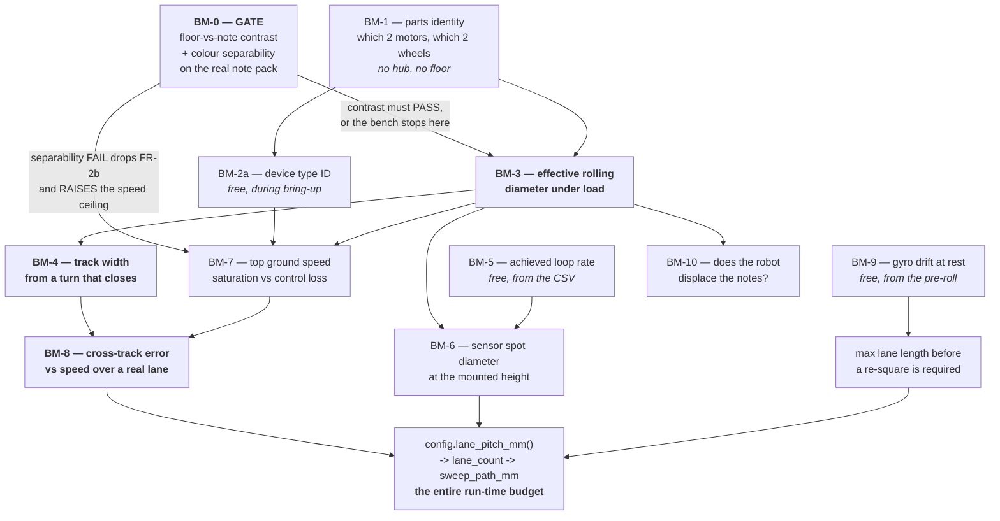

# Bench Measurement Session — one class period, ten numbers, every one with a consumer

> **Scope note — session-time budgeting is NOT tracked (operator ruling 2026-08-26).** The minute
> figures and the drop-order below are a rough ordering aid, nothing more. **Do not maintain them, do
> not recompute them, and do not treat a total as a commitment.** The operator explicitly deprioritised
> tracking session time. What matters here is the **dependency order** — which measurement unblocks
> which — because that ordering is what stops a wasted class session. The clock is the Builder's
> problem on the day, not this document's.

> **Type:** ACTIVE-SPEC · **Created:** 2026-08-25 · **Status:** not run — the hub has never been connected
> **Target session:** **3 SEP** (fallback 8 SEP, which is the last chance and leaves no room to act on a bad result)
> **Executed by:** [../runbooks/measure-drivetrain.md](../runbooks/measure-drivetrain.md) — the Builder's step-by-step
> **Register it closes rows in:** [known-unknowns.md](./known-unknowns.md) Group B
> **Verification cases it feeds:** [verification-plan.md](./verification-plan.md) VC-G1, VC-FR-6a, VC-PR-1
> **Rules:** [../directives/hardware-safety.md](../directives/hardware-safety.md) · [../directives/honest-instrumentation.md](../directives/honest-instrumentation.md) · [../directives/automation-first.md](../directives/automation-first.md)

---

## Why this document exists

The operator's standing instruction is the premise of this plan:

> *"a lot of numbers that you are accounting for we really just need to test in the real world because we
> have a hodge podge of hardware."*

Correct. This repo currently carries roughly a dozen `[ASSUMED]` numbers, and every one of them is a
multiplier on something else. `CROSS_TRACK_ERROR_MM` alone moves the 10 ft sweep between 125 m and 204 m
([../findings/coverage-time-budget.md](../findings/coverage-time-budget.md)). No further modelling improves
any of them. **The deliverable here is not a better estimate. It is the session that replaces the estimates
with measurements, ordered so each one unblocks the next, and time-boxed so the session ends on schedule
whether or not it finished.**

**Two things this plan refuses to do.** It does not invent a number, and it does not schedule a
measurement nobody consumes. Every row below names the constant or the document section it changes,
**by path**. If a row cannot name one, it is not on the list.

---

## The one non-negotiable constraint

**The class period is short and the journal takes the end of it.** The daily journal is 80 points, loses
5 per missing day, and is written in the last 5–7 minutes of each class day by hand
([../course/deliverables.md](../course/deliverables.md)). It is the cheapest guaranteed score in the
project and it is **not** what gets dropped when the bench runs long.

`[ASSUMED]` a 50-minute period — the period length is not recorded anywhere in this repo and nobody has
been asked. Working backwards:

| Block | Minutes | Notes |
|---|---|---|
| Out of the yellow box, robot placed, hub on, cable in | 5 | Builder and Programmer only ([2026-08-25-sprint-1-walking-skeleton.md](./2026-08-25-sprint-1-walking-skeleton.md) § Role choreography) |
| **Attended measurement** | **35** | The subject of this plan |
| Pack out, robot back in the box | 3 | [../runbooks/demo-day.md](../runbooks/demo-day.md) § pack-out |
| Journal | 7 | **Not negotiable** |

**Thirty-five minutes of attended robot time.** The Box column of the list below sums to **101 minutes**
(93 if BM-2b is not needed, which is the likely case). That gap is the whole reason this document has a drop order rather than a wish list. If the period is not 50
minutes, rescale the budget — **the drop order does not change.**

> The minute figures throughout are **budget allocations chosen by this plan, not measured durations.**
> The Programmer records the actual wall-clock time of each step in the RESULT block so the *second*
> bench session is planned from data instead of from this paragraph.

---

## Three of the numbers are almost free

The single most useful structural fact about this session:

The specification below **requires** `scripts/measure-drivetrain.py` to log one raw sample row per loop
iteration, for every run, including a stationary pre-roll and post-roll. The script does not exist yet, so
this is a requirement on it, not an observed property. If it is built that way, three measurements cost
almost no attended robot time, because they fall out of logs taken for other reasons:

| Free measurement | Where it comes from | Costs |
|---|---|---|
| **BM-5** achieved Python loop / sample rate | The inter-sample interval of the `t_ms` column of **every** CSV | 0 min |
| **BM-9** gyro drift and the stuck-at-zero pathology | The stationary pre-roll and post-roll segments of every CSV, plus one long idle run left going on the bench | 1 min to start it — the only one of the three that is not free |
| **BM-2a** motor device type ID | Read during hub bring-up, while the Programmer is at the keyboard and the Builder is doing BM-1 | 0 min |

**Log raw, compute later.** The script drives and records; the arithmetic happens on the laptop
afterwards. A wrong formula then costs a re-read of a file, not a re-run of the robot — and the robot is
the scarce resource.

---

## Order of operations

Read this as *what is worthless until its predecessor lands*, not as a wish list.

**BM-3 is the keystone.** Five of the ten — BM-4, BM-6, BM-7, BM-8 and BM-10 — are meaningless without
it, because every one of them is expressed in millimetres of ground and the robot only knows motor degrees. If the session
produces exactly one number, it is BM-3.

---

## The measurement list

Prerequisite column = the BM that must already have a value. Feeds column = **what this changes, by path.**

| # | Measurement | Box | Prereq | Closes | **Feeds — the consumer, by path** |
|---|---|---|---|---|---|
| **BM-0** | **GATE.** (a) Floor-vs-note reflected-light contrast on the real floor at the mounted height. (b) Pairwise colour separability across the real note pack | 20 | sensor bought + mounted; the pack | KU-M6, KU-D6 | (a) `MIN_CONTRAST` in [../../src/config.py](../../src/config.py) and the arming bound in [../../src/calibration.py](../../src/calibration.py). (b) FR-2b keep/drop — [verification-plan.md](./verification-plan.md) § 3. Evidence: `docs/findings/color-separability.md` |
| **BM-1** | **Parts identity.** Size moulded on each tyre sidewall; ruler across the tread of **both** wheels separately; both motors' output faces and bulk photographed | 5 | none — **no hub, no floor** | KU-T3, KU-M3 (part) | [../hardware/build-record.md](../hardware/build-record.md) § 2 and § 3; starting value of `WHEEL_DIAMETER_MM`; which row of [../research/speed-envelope.md](../research/speed-envelope.md) § Kinematic ceiling table applies |
| **BM-2a** | **Motor device type ID** — 48 medium / 49 large / 65 small | 0 | hub up | KU-T3 **definitively** | [../hardware/build-record.md](../hardware/build-record.md) § 2; [../hardware/port-map.md](../hardware/port-map.md) `Device` column. If the call does not exist on our Hub OS, **that is a result** — record it and fall to BM-2b |
| **BM-2b** | **No-load velocity ceiling**, wheels off the ground, ramp to the identified ceiling | 8 | BM-2a failed | KU-T3 fallback | Same as BM-2a. Also answers [../research/speed-envelope.md](../research/speed-envelope.md) open Q1 — what the hub does with an over-ceiling command |
| **BM-3** | **Effective rolling diameter under load**, per surface | 12 | BM-1 | KU-M3, KU-M8 | `WHEEL_DIAMETER_MM` in [../../src/config.py](../../src/config.py) → every call in [../../src/odometry.py](../../src/odometry.py) → lane length, hop distance, and the mm/s in **every** other row of this table |
| **BM-4** | **Track width from a spin turn that actually closes** — not from a ruler | 10 | BM-3 | KU-M3 | `TRACK_WIDTH_MM` in [../../src/config.py](../../src/config.py) → encoder turn geometry and the `Eb` term in [../research/motion-control-and-odometry.md](../research/motion-control-and-odometry.md) § Odometry arithmetic |
| **BM-5** | **Achieved Python loop / sample rate**, with motors running and — **only if a colour sensor is actually mounted** — being polled. No sensor is owned as of 2026-08-25, so the likely result is the driving-only rate, which is an **upper bound** on the mission rate and must be written down under that label, never as "driving+sensing" | 0 | any CSV exists | KU-M5 (rate half) | `SAMPLE_RATE_HZ` in [../../src/config.py](../../src/config.py) → `expected_width_samples()` → `MIN_EVENT_SAMPLES` / `MAX_EVENT_SAMPLES` → the sensing-ceiling row of [../research/speed-envelope.md](../research/speed-envelope.md) § The practical ceiling |
| **BM-6** | **Colour-sensor spot diameter** at the mounted height — drive across a printed bar card at a known slow speed | 12 | BM-3, BM-5 | KU-M5 (spot half) | `edge_guard` and the `v_max = f·(L_min − D_spot)/N_pure` formula in [../research/color-discrimination.md](../research/color-discrimination.md) § 5.2; the minimum guaranteed chord `L_min` in [2026-08-25-coverage-strategy-trade-study.md](./2026-08-25-coverage-strategy-trade-study.md) |
| **BM-7** | **Top achievable ground speed**, and whether the ceiling is motor saturation or control loss | 10 | BM-2, BM-3 | KU-M5 (speed half) | Upper bound on `TRAVERSE_SPEED_MMS` in [../../src/config.py](../../src/config.py); the `v` input to [../findings/coverage-time-budget.md](../findings/coverage-time-budget.md); the verdict in [../research/speed-envelope.md](../research/speed-envelope.md) § The practical ceiling |
| **BM-8** | **Cross-track error over a real lane**, at three speeds, both directions — *the speed at which heading hold degrades* | 20 | BM-3, BM-4, BM-7 | **KU-M4** | `CROSS_TRACK_ERROR_MM` in [../../src/config.py](../../src/config.py) → `lane_pitch_mm()` → `lane_count()` → `sweep_path_mm()` → **the entire run-time budget**; VC-FR-6a in [verification-plan.md](./verification-plan.md) |
| **BM-9** | **Gyro drift at rest**, and the stuck-at-zero pre-run check | 1 | hub up | KU-M9 | Maximum lane length before a re-square, per [../research/motion-control-and-odometry.md](../research/motion-control-and-odometry.md) (**> 1.8 °/min means long lanes are not viable on gyro alone**); the battery/health gate in [../runbooks/demo-day.md](../runbooks/demo-day.md) |
| **BM-10** | **Does the robot displace the notes it drives over?** Photograph before and after one lane over placed notes | 3 | BM-3 | KU-M10 | Nothing in code — it is a **mechanical** result for the Designer. A failure is a chassis change, and it is catastrophic to find on 8 SEP |

**Box column total: 101 minutes** — 93 if BM-2a succeeds and BM-2b is not run — against a 35-minute
attended budget. Hence the next two sections.

---

## Movement-tuning sidecar outputs

These are **computed after the CSVs are captured**. They add no hub I/O and no autonomous run to this
plan; they name the small pure functions/config values the Programmer should derive from BM-3, BM-4,
BM-8 and the pre/post-roll rows.

| Output | Formula | Gate it controls |
|---|---|---|
| `HEADING_KP_PCT_PER_DEG` | bench seed `2.0`; replace with `0.4/(k_pair*h)`, where `k_pair = yaw_rate_dps / turn_pct` and `h = 1/SAMPLE_RATE_HZ` | enables heading hold only after a short P-only lane is stable |
| `HEADING_CORR_LIMIT_PCT` | seed `20.0`; lower if BM-8 shows weave, raise only if correction saturates without weave | max left/right split in `hub_motors.drive(left_pct, right_pct)` |
| `D_eff_mm` | `360*measured_distance_mm/(pi*abs((left_delta_deg+right_delta_deg)/2))` using forward-positive encoder deltas | replaces `WHEEL_DIAMETER_MM`; `--distance` remains gated until this exists |
| `TURN_ENC_SCALE` | origin-regression slope `sum(encdiff_deg*yaw_deg)/sum(encdiff_deg^2)`, `encdiff = right_fwd-left_fwd` | degraded encoder-turn fallback and gyro-vs-encoder turn health |
| `TRACK_WIDTH_MM` | `D_eff_mm/(2*abs(TURN_ENC_SCALE))`, after CW/CCW diagnostics are clean | encoder turn geometry only; healthy turns still close on gyro |
| `STOP_MARGIN_MM` | `p95(coast_mm) + speed_mms*LATENCY_S + STOP_GUARD_MM` | boundary/note-safe stop distance; do not reuse the checkpoint startup-ramp loss |
| `TURN_SETTLE_MS` | first post-stop time where yaw stays inside `TURN_TOL` | settle-and-verify before reading a turn residual |
| `CROSS_TRACK_ERROR_MM` | BM-8-lite lateral offset p95 at the chosen speed and lane length | `lane_pitch_mm() > 0` before any mission sweep |

**Stage gates:** import/pure math passes (`G0`) -> sign convention check (`G1`) -> diameter spread
`<= 2%` (`G2`) -> CW/CCW turn scale sane (`G3`) -> stop margin inside allowance (`G4`) -> heading-hold
cross-track inside lane budget (`G5`) -> mission wiring (`G6`). A failed gate is written as
`UNKNOWN`/`DROPPED`; it never promotes an assumed value into code.

---

## BM-0 is a gate, not a measurement — and it should already be done

**Run it first, and expect to tick it rather than run it.** [verification-plan.md](./verification-plan.md)
§ 3 already owns the full GATE-1 procedure and schedules it for **1 SEP**. That procedure is not restated
here. What this plan adds is the consequence for *this* session:

| BM-0 outcome | What changes on the day |
|---|---|
| **Already run on 1 SEP** | Tick it. **Twenty minutes come back**, and BM-6 and BM-7 move into the attended block. This is the case to engineer for. |
| **(a) contrast PASSES, (b) separability PASSES** | Nothing changes. Classification stays. BM-7's ceiling is the classification ceiling (~160–360 mm/s depending on the guaranteed chord). |
| **(a) contrast PASSES, (b) separability FAILS** | **FR-2b is withdrawn, not deferred.** Say so out loud in the room, and to the Designer and Supplier in writing the same day. It deletes nothing already built, and the speed ceiling **rises** — so BM-7 and BM-8 must be run at the higher presence-only speeds, and the whole coverage arithmetic gets easier. Cheapest failure in the project. |
| **(a) contrast FAILS** — floor and note are not separable at any achievable height | **Stop the bench.** This is not "tune the threshold"; it is *the robot cannot see the target*. The rest of the session is worthless because there is nothing to sweep for. The session converts to: try a second surface, try two more heights, try a different note colour, and write down every number tried. Escalate in writing to the professor the same day — a different note pack or a different floor is a request that can only be made *before* Demo Day week. |

Note the asymmetry, because it is the thing people get wrong under time pressure: **(b) failing is a
cheap, planned, recoverable outcome. (a) failing is a project-level event.** They are the same experiment
and they are not the same news.

---

## The session that actually fits — 35 attended minutes

Assumes BM-0 was ticked on 1 SEP. **Two people work in parallel for the first block**, which is where the
schedule is won: BM-1 needs no hub, so the Builder does it with a ruler while the Programmer brings the
deploy loop up.

| T+ | Attended | Who | Item | Ends when |
|---|---|---|---|---|
| 0 | — | Builder | Robot out of the box, on the floor, hub on | Robot placed on the measured lane |
| 0 | 1 | Programmer | Start the long idle log on the bench and **leave it running** | CSV is growing → **BM-9** accrues for free |
| 1 | 5 | **Builder** ‖ **Programmer** | ‖ **BM-1** parts identity (ruler, sidewalls, photos) ‖ deploy the diagnostic, assert the echo-back, read **BM-2a**, then the Builder runs the **first move and the abort rehearsal** ([../runbooks/measure-drivetrain.md](../runbooks/measure-drivetrain.md) M0.5–M0.6) | Both wheel diameters written down; the script has echoed its API generation and port map; **the robot has moved forward once and stopped on the hub button**. Nothing else starts until it has |
| 6 | 12 | Builder | **BM-3** effective rolling diameter — 5 forward trials + 1 reverse | Median and spread written down; spread ≤ 2 % |
| 18 | 10 | Builder | **BM-4** track width from a closing spin turn — 3 CW + 3 CCW, then one verification turn | The verification turn closes within the protractor's resolution |
| 28 | 7 | Builder | **BM-8-lite** — cross-track at **one** speed, 3 trials each direction over the full lane | Six lateral offsets written down |
| 35 | — | Both | Stop the idle log, read **BM-5** and **BM-9** off the CSVs, fill the RESULT block | RESULT block has no blank cells other than DROPPED ones |

**Everything else is the overflow queue**, in this order, taken only if a step finishes early:

`BM-7` top speed → `BM-10` note displacement → `BM-8-full` (the remaining two speeds) → `BM-6` spot size
→ `BM-2b` no-load ceiling. **This is the drop table below, read upwards** — they are one list, not two.

---

## What to drop, in order, and what it costs

**Drop in the order of the first column — 1st goes first.** Each row states what stays `[ASSUMED]` and what the report must then say —
because "we did not measure this" is a defensible sentence in a verification section and a fabricated
number is not ([../directives/honest-instrumentation.md](../directives/honest-instrumentation.md)).

| Drop order | Item | Stays open | What the report says | Real cost |
|---|---|---|---|---|
| 1st | **BM-2b** no-load ceiling | KU-T3, if BM-2a also failed | "The motor variant was not identified; speed figures are quoted as a range across all three candidates." | Low — the range is 660–1110 deg/s and BM-7 measures the truth on the ground anyway |
| 2nd | **BM-6** spot size | KU-M5 (spot half) | "`D_spot ≈ 12 mm` is a single third-party measurement on someone else's sensor at 16 mm — UNVERIFIED for ours." | Medium. Only binds when classification is on and chords are short. Costs nothing if FR-2b was withdrawn |
| 3rd | **BM-8-full** (the extra speeds) | The *shape* of `e(v)` | "Cross-track error was measured at one speed only; the speed at which heading hold degrades is unknown, so the traverse speed is set at the measured point and not extrapolated." | Medium. It forbids raising the speed later without another session |
| 4th | **BM-10** note displacement | KU-M10 | "Untested. The assumption that the robot does not move the notes is doing real work and was never checked." | **High for the price.** 3 minutes, and a failure is a chassis redesign — which is why it is dropped *after* the two above, not before |
| 5th | **BM-7** top speed | KU-M5 (speed half) | "Top ground speed was not measured; the time budget uses the commanded speed, which is an upper bound the robot may not achieve." | Medium-high — every duration in [../findings/coverage-time-budget.md](../findings/coverage-time-budget.md) rests on it |
| **never** | **BM-3, BM-4, BM-8-lite** | — | — | **These three are the session.** If they will not fit, cancel the other seven, not these. Without BM-3 nothing else has units; without BM-8 the lane pitch is a guess and so is the run time |
| **never** | **BM-1** | — | — | Five minutes, no hub, and it is the label on every other number. A CSV with an unidentified wheel in the header is a CSV nobody can reuse |

**The stopping rule, said plainly:** at **T+33**, whatever is unfinished is abandoned mid-step. Fill the
RESULT block and pack out. A half-measured trial written into the record as if it were complete is worse
than a blank, and a missed journal entry costs 5 points that no measurement recovers.

---

## `scripts/measure-drivetrain.py` — specification, not implementation

**This plan specifies it. It does not write it**, and neither does this agent — see
[../directives/automation-first.md](../directives/automation-first.md) for the conventions it must follow.
It is a **diagnostic**, not a test: it never gates a commit
([../directives/testing-discipline.md](../directives/testing-discipline.md)).

### Hard rules — violating any of these makes it unusable

1. **Explicit timeout, two layers, always exits.** An outer `timeout` on the invocation *and* an inner
   read deadline. **Never a blocking serial read.** A `cat /dev/ttyACM0` or an unbounded `read()` does not
   fail, it hangs — taking the session and the rest of the class period with it.
2. **A timeout reports UNKNOWN and exits non-zero. It never reports a pass.**
3. **Assert a known-correct observation before anything moves.** On start it echoes back, and the
   Programmer reads aloud: the API generation it bound to (`hub_api.api_generation()`), the port map it
   will drive, the commanded manoeuvre and its parameters, and the assumed wheel diameter and track. It
   **refuses to run** on `PortMapIncomplete` rather than driving an unassigned port
   ([../../src/hub_*.py](../../src/hub_api.py)). Exit code 0 means the tool did not crash; it says
   nothing about the robot.
4. **Every commanded move is bounded** — a degree-limited or distance-limited move, never an open-ended
   `run()`. Velocity is an explicit flag with a low default. There is no manoeuvre that cannot be waited
   out by standing still.
5. **Never writes to the hub filesystem.** CSV rows stream over the serial link to host stdout and the
   host redirects them to a file. This sidesteps the hub's memory limits and stays clear of
   [../directives/hardware-safety.md](../directives/hardware-safety.md) rule 4 entirely.
6. **Never commands above the identified motor's published ceiling** until BM-2b has established what the
   hub does with an over-ceiling command. That is an open question, not a known behaviour
   ([../research/speed-envelope.md](../research/speed-envelope.md) open Q1).

### What it must do

- **One script, one CSV schema, a manoeuvre argument.** `--move straight --revs N` · `--move straight
  --distance MM` · `--move spin --degrees N` · `--move ramp --steps a,b,c --dwell S` · `--move idle
  --seconds N`. Adding a manoeuvre must not fork the log format, because the analysis is written once
  against one schema.
- **The modifier flags the runbook actually types**, because a step nobody can run is not a procedure:
  `--velocity DEG_S` (explicit, low default, rule 4) · `--gyro-close on|off` · `--heading-hold on|off`.
  `--distance` is a convenience over `--revs` and needs `WHEEL_DIAMETER_MM`, so it must **refuse to run**
  until BM-3 has landed rather than silently converting with the `[ASSUMED]` value.
- **A self-describing header line** so a finding can be written from the file alone with nobody in the
  room: UTC date, API generation, port map, surface, lighting, operator name, battery reading, assumed
  wheel diameter and track, script version, and the full command line.
- **One raw sample row per loop iteration** — `t_ms, phase, cmd_left, cmd_right, left_deg, right_deg,
  left_vel, right_vel, yaw, pitch, roll, reflection, r, g, b, i`. Raw, unsmoothed, unaggregated.
- **An unreadable channel is written empty, never `0`.** `0` reads downstream as "a wall is touching us"
  or "the gyro is level"; empty reads as "no data". This is the rule
  [../../src/hub_*.py](../../src/hub_api.py) already enforces by returning `None`, and the CSV must not
  quietly undo it.
- **A stationary pre-roll and post-roll on every run** (a few seconds each, marked in the `phase` column).
  This is where **BM-9** and the idle half of **BM-5** come from at no cost.
- **Timestamps from the hub's own clock, at full loop rate, unthrottled.** The inter-sample interval *is*
  the BM-5 measurement — so the script must measure the loop *as the mission will actually run it*, with
  the sensor being polled and the printing enabled. A `--buffer` mode that collects in RAM and dumps at
  the end is worth having, but then **both** rates get recorded and the finding says which is which.
  Printing every sample may itself throttle the loop; that is not a defect to hide, it is the number.
- **Distinguishable exit codes:** OK · hub absent · port map incomplete · timeout · echo-back assertion
  failed. The Builder needs to tell "the hub is not there" from "the hub is there and disagreed with us"
  without reading a stack trace.
- **No analysis.** It drives and it logs. Every division, median and curve fit happens on the laptop
  afterwards, against the CSV. A wrong formula must cost a re-read, never a re-run.

---

## Filing the results is part of the session

A row closed in the register but not propagated is worse than an open row, because the code still holds
the guess while the register says we know ([known-unknowns.md](./known-unknowns.md) § How to use this
file). The runbook's § 11 is the checklist (§ 9 is M10); the destinations are:

| Product | Path |
|---|---|
| The measurements, with units, surface, lighting, date | **`docs/findings/drivetrain-calibration.md`** (new) + a row in [../findings/INDEX.md](../findings/INDEX.md) |
| BM-0's matrix and go/no-go call | `docs/findings/color-separability.md` — [verification-plan.md](./verification-plan.md) § 3.5 |
| The raw CSVs | Keep them. They are the evidence, and re-analysis without the robot is the point |
| Constants | [../../src/config.py](../../src/config.py) — strike the `[ASSUMED]` marker, add the date and surface in the comment |
| Which motor, which wheel, the geometry | [../hardware/build-record.md](../hardware/build-record.md) § 2 and § 3 |
| Device on each port, with the confirmation date | [../hardware/port-map.md](../hardware/port-map.md) |
| Row status `OPEN` → `CLOSED`, with answer + source + date | [known-unknowns.md](./known-unknowns.md) Group B |
| The narrative, including what was dropped and why | `docs/session_records/2026-09-03_*.md` |

**A surface-dependent constant carries its surface.** `WHEEL_DIAMETER_MM = 55.8` is not a measurement;
`55.8 mm effective, classroom carpet, full robot weight, 5 trials, spread 0.3 mm, 2026-09-03` is one.

---

## What this plan does not do

- **It does not close a single Group A row.** Nothing here tells us what "10×10" means, and the arena
  size is still the largest multiplier in the project. Ask Q1 ([questions-for-the-professor.md](./questions-for-the-professor.md)).
- **It does not run UMBmark.** Full UMBmark is 5 CW + 5 CCW square runs plus measurement — 30–40 minutes
  on its own ([../research/motion-control-and-odometry.md](../research/motion-control-and-odometry.md)),
  and it does not fit beside BM-3 and BM-4. BM-8 measures the cross-track error *directly*, over a real
  lane, which is the number `lane_pitch_mm()` actually consumes. UMBmark separates *why* the error is
  there (wheelbase vs diameter mismatch) and is worth a second session **only if** BM-8 comes back over
  budget and we need to fix it rather than accept it.
- **It does not verify the mission.** Nothing here counts a note. That is
  [verification-plan.md](./verification-plan.md) § 5 and the dry runs.
- **It measures one build.** Every number dies the moment the Designer changes the geometry. A rebuild
  means a new revision row in the build record and this session runs again.

---

## Revision History

| Date | Change | By |
|---|---|---|
| 2026-08-25 | Created. Ten measurements ordered by dependency, time-boxed against a 35-minute attended budget, each named to the constant or document it feeds; drop order, GATE-0 consequence table, and the specification for `scripts/measure-drivetrain.py`. | Claude |
| 2026-08-26 | **Adversarial audit fixes.** Box-column total corrected 95 → 101 min (93 without BM-2b); "six of the ten" → five; the three "free" numbers corrected to two free + BM-9 at 1 min; script spec extended to the flags the runbook actually types (`--distance`, `--velocity`, `--gyro-close`, `--heading-hold`, `--dwell`); drop order reordered so BM-10 falls after BM-6/BM-8-full instead of contradicting its own "prefer to drop something else"; the M0.5–M0.6 abort and direction check written into the 35-minute schedule; the script's logging described as a requirement, not an observed property; runbook cross-reference § 9 → § 11. | Claude (audit) |
