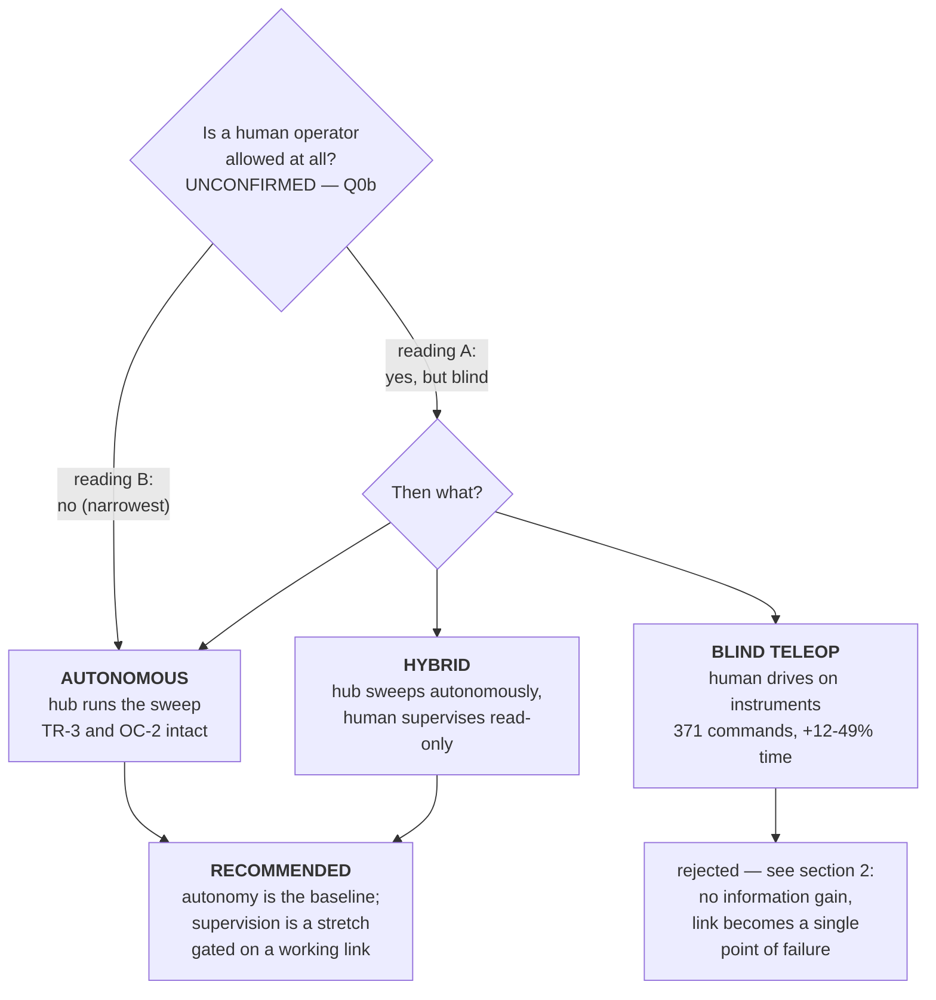

# Blind teleoperation — what it would cost, and why we stay autonomous

**Type:** FORWARD-PLAN · **Created:** 2026-08-27 · **Status:** recommendation made, **not yet an ADR**
**Companions:** [../findings/mission-answers-2026-08-27.md](../findings/mission-answers-2026-08-27.md)
(provenance) · [questions-for-the-professor.md](./questions-for-the-professor.md) ·
[conops.md](./conops.md) · [../research/bluetooth-control-plane.md](../research/bluetooth-control-plane.md)

---

## 0. The premise is not settled, and this document does not pretend it is

The words that started this, as relayed on 2026-08-27:

> **"you can't have a human operator... if you do have a human operator, they cannot be looking at the
> arena."**

**The first clause forbids what the second permits.** Provenance, both readings, and why we decline to
record it as an answer: [../findings/mission-answers-2026-08-27.md § 2c](../findings/mission-answers-2026-08-27.md).

So this page answers a conditional question: **if** a human operator turns out to be allowed on the
stated condition, what would that actually buy us? The answer is *much less than it sounds like*, which
is why the recommendation does not depend on which reading is right.

---

## 1. The headline: a blind operator refunds nothing

**This is the correction that matters, and it goes against the intuitive reading.**

[questions-for-the-professor.md](./questions-for-the-professor.md) previously argued that a human
driver makes sweep planning, odometry accuracy, heading hold, per-lane re-squaring and the whole
coverage-time problem optional. Its stated reason was:

> *"A human covers the area by eye"* · *"A person drives straight to what they can see."*

**The condition attached to the answer removes exactly that clause.** An operator who may not look at
the arena:

| Cannot | Consequence |
|---|---|
| See where the robot is | Must dead-reckon in their head, off the same encoders and the same gyro the hub reads — later, and worse |
| See the boundary tape | Cannot avoid driving out of the arena. With no walls there is no physical backstop |
| See which lanes have been covered | Cannot cover by eye. Coverage becomes *harder*, not easier |
| See the hub's 5×5 light matrix | FR-4's numeric reporting channel is in question — see §5 |

**So nothing in the "becomes optional" table is optional.** Blind driving is strictly worse than dead
reckoning for lane pitch, overlap and completeness, so odometry, heading hold and cross-track error
become **more** important under this reading, not less. The only thing a human genuinely adds is
anomaly recognition and improvisation — which are supervisory functions, not driving functions.

---

## 2. Continuous manual driving does not close, on arithmetic

All figures below are **computed from values already in this repo**, and every input is labelled.
Nothing here is measured.

**Lane geometry.** `config.lane_pitch_mm()` = `TARGET_SIZE_MM − 2×CROSS_TRACK_ERROR_MM −
LANE_OVERLAP_MM` = 76 − 30 − 5 = **41.0 mm**. All three inputs are `[ASSUMED]` in
[../../src/config.py](../../src/config.py) — the note has never been seen and cross-track error has
never been measured.

**Heading, illustratively.** The per-lane lateral allowance is `CROSS_TRACK_ERROR_MM` = 15 mm — it is
already reserved *inside* the 41 mm pitch, so it is the budget, not half the pitch. Holding 15 mm over
a 3.05 m lane (the 10 ft branch of the units question) is **0.28°** of constant heading bias.
**Treat that as an illustration, not a tolerance:** per-lane re-squaring resets the integration every
lane, so a whole-lane constant-bias figure is not what the design must actually meet.

**Dead band.** At `TRAVERSE_SPEED_MMS` = 150 mm/s (`[ASSUMED]`, never achieved on hardware), the robot
travels 60 mm in 0.4 s and 150 mm in 1.0 s — 1.5 to 3.7 lane pitches between the operator perceiving
something and the robot responding.

**The relevant delay is the closed human loop, not the link.** Telemetry interval + link + human
reaction and decision + uplink + hub reaction. Only the middle term is human, and it alone is
250–500 ms. **None of the electronic terms have ever been observed on our hub** — see §3.

**The literature agrees and has since the 1960s.** Operators under delay spontaneously degenerate to
"move-and-wait", and the answer to delay is supervisory control: discrete symbolic commands executed
by a local controller. `[UNCITED IN REPO]` — Ferrell (1965) and Ferrell & Sheridan (1967) are not in
[../research/papers/](../research/papers/) and must be pulled with `./scripts/rh-query.sh` and added
to the bibliography before any of this reaches the Intro Report.

**So discrete commands are the only usable scheme — and discrete commands are autonomy with a human
as the for-loop.** Computed from `src/sweep.py`'s state machine on the 10 ft branch: 3048/41 → **75
lanes**, **228.6 m** of path, and because each lane change emits RESQUARE + TURN + STEP + TURN, the
run is 75 + 74×4 = **371 discrete commands**. Against 25.4 min of driving at 150 mm/s, a 0.5 / 1.0 /
2.0 s per-command human-plus-link cost adds **+12% / +24% / +49%** of run time — and 371 chances to
press the wrong key, to generate commands the hub's own `SweepPlan` already produces correctly for
free.

---

## 3. Is there even a control channel? Partly, and less than we thought — in both directions

**What is measured on our hub** ([../findings/hub-first-contact-2026-08-27.md](../findings/hub-first-contact-2026-08-27.md)):

- The hub exposes the **complete MicroPython `bluetooth` module** — `BLE`, `gap_advertise`,
  `gap_scan`, `gatts_register_services`, `gatts_notify`, `gattc_write`, `irq`. A full GAP+GATT server
  **and** client. **This overturns this project's earlier inference** that a slot program cannot open
  its own radio; that inference was drawn from an absence in a third-party module list.
- `dir(hub)` has **no `USB_VCP` and no `BT_VCP`**. Those are Hub OS 2-era attributes and they are
  **absent**, not unverified.
- A 12-second passive scan saw 581 advertising devices and **zero LEGO** by company ID, service UUID
  or name. **Our hub was not transmitting.** One live untested explanation is that USB suppresses
  advertising on this firmware — which would make a BLE panel and the USB REPL mutually exclusive.

**What is confirmed against LEGO's protocol reference, and has never been exercised here:** the only
documented host→hub message reaching a *running* program is `ProgramFlowRequest` — Start and Stop of a
slot. `TunnelMessage` (id 50) exists but its direction is unstated and no hub-side API to produce or
consume one is documented.

**So the honest status is:** a candidate downlink *exists in the API*; whether the firmware permits a
program to drive `bluetooth.BLE()` while the Hub OS owns the radio is **untested**, and finding out is
an **operator-gated state change on shared equipment**, not a free ten-minute probe. Nothing in this
project has ever exchanged a BLE message with this hub. Say **"confirmed against
lego.github.io/spike-prime-docs"**, never "proven" or "works today" —
[../lessons_learned/say-which-kind-of-verified.md](../lessons_learned/say-which-kind-of-verified.md).

---

## 4. The three options, side by side

| | Autonomous | Blind teleop | Hybrid (autonomy + read-only supervision) |
|---|---|---|---|
| Information available to the decider | Colour sensor, encoders, IMU | **The same, delayed** | The same, plus a human watching |
| Navigation work required | All of it | **All of it, done worse** | All of it |
| Run time | Baseline | +12% to +49% (computed) | Baseline |
| Link loss mid-run | Irrelevant | **Ends the run** | Loses the telemetry capture only |
| TR-3 / OC-2 (standalone, no laptop) | Intact | **Violated — needs an ADR** | Intact |
| Depends on an unexercised BLE path | No | **Yes, entirely** | Only the optional half |
| Schedule exposure | None | Three class sessions remain after today (1, 3, 8 SEP) before a 10 SEP demo | None on the required half |

---

## 5. What the blind condition breaks even if we never teleoperate

**FR-4 / CONOPS OC-6 conflict.** [../scope.md](../scope.md) FR-4 makes the hub's 5×5 light matrix and
speaker the robot's whole reporting channel, and CONOPS OC-6 calls them *the only channels the
operator and the instructor can read during and after a run*. **An operator turned away from the arena
cannot read the matrix.** Only the speaker survives — the per-target beep still works as an
independent tally, the numeric result does not.

Whether the prohibition lifts at end-of-run is **not stated**. `[INFERRED]` it probably does; that is
an inference, and it is queued as a question rather than designed around.

**Role rule.** Driving the robot through a laptop **is operating the robot**, and the course rule says
the Builder is the only person who may operate it. So under any teleop variant the laptop is the
Builder's, not the Programmer's, at −2 SB per violation — and the Builder needs rehearsal time on a
tool they did not write, out of three remaining sessions.

**No physical backstop.** With no walls, a boundary miss is unbounded: the robot leaves the arena and
keeps going. Under a blind operator, the robot's own boundary handling is the **only** thing
preventing it, which raises the importance of FR-6 regardless of which reading of §0 is right.

---

## 6. Recommendation

**Keep autonomy as the design baseline. Do not design the demo around driving the robot.**

Reasons, in order of how hard each is to argue with:

1. A blind operator has no information the hub lacks, and gets it later. Moving the loop off the hub
   is strictly a loss.
2. The delay arithmetic rules out continuous control and reduces discrete control to transcription of
   commands `SweepPlan` already generates.
3. The wireless path has never been exercised on this hub, and our hub was not even advertising in the
   one scan we ran. Betting a 10 SEP demo on it with three sessions left is a schedule bet we cannot
   cover.
4. Autonomy keeps TR-3 and OC-2 intact, so a dropped link costs a telemetry capture rather than a run.
5. A robot that runs autonomously **and** can be supervised dominates one that can only be driven,
   under every scoring rule we can imagine — and the scoring rule is still unknown.

**And it costs nothing to be wrong about the permission**, because we would build the same robot
either way.

### What NOT to build yet

Named explicitly, because the temptation is to design the fun part:

- **No slot-per-behaviour architecture, no command vocabulary, no latched lockout, no staleness
  ladder, no multi-pane instrument panel layout.** All of that would commit design against four things
  nobody has: a scoring rule, a confirmed permission, an exercised downlink, and a radio that is
  actually transmitting. [../lessons_learned/model-only-to-the-next-decision.md](../lessons_learned/model-only-to-the-next-decision.md):
  if the number moved by 30%, would we do something different? Here, we would not even know.
- **No ADR yet.** An ADR is immutable, and the premise in §0 is a contradiction. When one is written
  it must record **our choice** ("autonomy as the design baseline, because a blind driver refunds no
  navigation work"), and must **not** assert the mission fact ("the professor permitted
  teleoperation").

### What is worth doing, in order

1. **Ask Q0b** — *"is a human operator allowed at all?"* — at the top of the next round, behind the
   units question. One sentence.
2. **Ask Q0c/Q0d** — does using one cost points, and what may a blind operator use? These decide
   whether a fallback is worth anything at all.
3. **When a hub session is legitimately open**, and only with the operator's say-so, establish whether
   the hub advertises with USB disconnected. That single observation decides whether *any* wireless
   supervision is possible, and it is currently the blocker on all of it.
4. **Only then**, and only if a link exists: a **read-only** observer, because it needs no hub-side
   code, breaks no constraint, and pays under every answer — it is the report's results section and it
   makes a run diagnosable without anyone touching the robot. Three lines of it are worth having
   before any layout is designed: can we connect at all, what is the maximum chunk size, and what is
   one round-trip time with nothing else in flight.

---

## 7. Open, and what each one decides

| Question | Decides |
|---|---|
| **Q0b — is a human operator allowed at all?** | Whether any of this is live. The relayed quote says both things |
| Q0c — does teleoperation cost points? | Whether a fallback is worth building even as insurance |
| Q0d — what may a blind operator see or use — hub sound, a laptop, a spotter? | Whether "blind teleop" is buildable in principle, and whether FR-4's result can be read at all |
| Does the no-looking rule apply after the run, when reading the result? | Whether FR-4's 5×5 matrix reporting survives |
| Does the hub advertise over BLE with USB disconnected? | Whether wireless supervision exists. **Operator-gated** |
| May a slot program drive `bluetooth.BLE()` while the Hub OS owns the radio? | Whether a real downlink is possible. **Operator-gated state change** |
| Achieved hub loop rate, link RTT, honoured notification interval | Every latency number in §2 and §3. **All unmeasured** |
| Units of "10×10" | Still first. 371 commands is the 10 ft branch; at 10 inches the whole question is moot |

---

## Revision History

| Date | Change | By |
|---|---|---|
| 2026-08-27 | Created. Records the conditional teleoperation analysis, retracts the "navigation evaporates" claim in `questions-for-the-professor.md` §0, and recommends autonomy with read-only supervision as a gated stretch. Declines to write an ADR while the premise quote is self-contradictory. | Claude |
