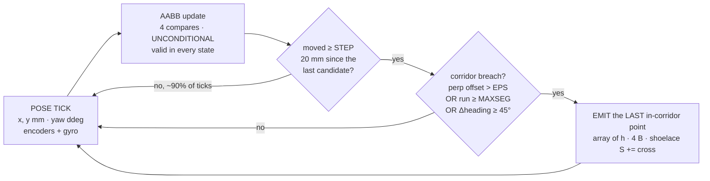
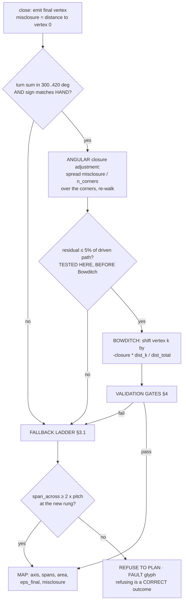
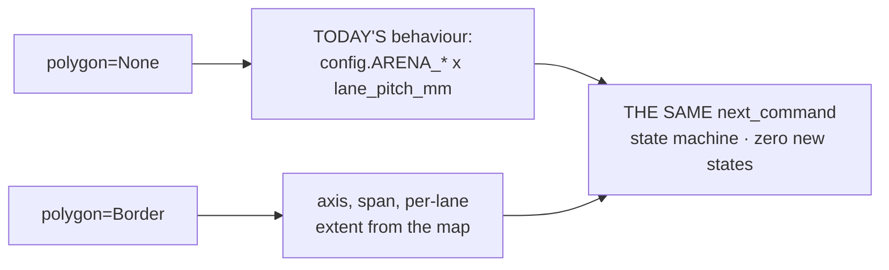

# Plan — border to polygon to lawnmower ("micro-SLAM")

**Date:** 2026-09-08 · **Status:** ACTIVE-SPEC, **post-demo work** · **Owner:** Programmer + Designer ·
**Sets the task:**
[2026-09-08-operator-briefing-corner-turns-to-competition.md](./2026-09-08-operator-briefing-corner-turns-to-competition.md) · **Extends:**
[border-trace-and-corners-2026-09-08.md](./border-trace-and-corners-2026-09-08.md) §5–§7 · **Consumes but does not redesign** corner geometry and
dead-end recovery ([corner-turn-direction](./corner-turn-direction-2026-09-08.md) ·
[junction-handling](./junction-handling-and-boundary-trace-2026-09-08.md)): a corner arrives here as an event with a heading change, and that is the
whole contract.

The operator's words: *"trace out a polygon in memory, do the polygon construction, then FREE UP ALL THAT MEMORY of the raw trace, and we just save
the minimised polygon vertices… a micro-SLAM, condensing data LIVE on a robot."* Plus the hard part: *"it might not be a perfect arc, it might be a
SQUIGGLE, because humans are laying this down."*

---

## 1. TL;DR

**We build nothing from this document before Thursday.** [`src/main.py`](../../src/main.py) has never run on hardware, and that outranks every map
deliverable ([border-trace §8](./border-trace-and-corners-2026-09-08.md)). The micro-SLAM is the **Intro Report** deliverable — and a good one,
because the analysis of *why* a two-scalar rectangle beats a traced polygon at this arena size, drift level and slot length is itself a
systems-engineering result.

| Piece | Choice | Size |
|---|---|---|
| Online reduction | **gated integer corridor** — Reumann–Witkam strip + Opheim direction establishment | ~90 lines |
| Tolerance | **`EPS = 25 mm`**; gate `STEP = 20 mm`, `DIRMIN = 100 mm`, corner backstop 45.0° | 4 config values |
| Map storage | one pre-allocated `array('h')`, interleaved x,y in **integer millimetres** | **4 B/vertex, 272 B at 64** |
| Area | shoelace **accumulated as vertices are emitted** | 3 scalars |
| Closure gate | misclosure ≤ **5 % of driven path**, tested **before** any Bowditch adjustment | 1 value |
| Lane plan | axis + count from the polygon once; **lane extents computed on demand** | O(1) sweep state |
| Fallback | polygon → oriented box → AABB → `config` rectangle → refuse | a VALUE, not a branch |

**Never build:** an arc primitive (§2.4) · a convex-hull rung (§3.1) · a persistent mine map
([minimalism-contract](./minimalism-contract-2026-09-03.md) — mines move) · a test suite
([ADR-0005](../decisions/0005-no-test-suite-verify-on-hardware.md)).

**Build INSTEAD, before Thursday.** All of it changes the count; none of it is on this page.

1. `src/main.py` off `DETECT_MODE="anomaly"` onto **`reflection() >= 30`**. As shipped on this carpet the chromaticity
   path scores **yellow 0 % detected and blue tape 100 % false-positive** [MEASURED,
   [colour-survey-and-first-detection-2026-09-08.md](../findings/colour-survey-and-first-detection-2026-09-08.md)]. A
   tracing robot drives *along* blue tape, so this plan makes that defect worse, not better.
2. **KU-M38** — nine `src/` modules `import config` at module top level and only
   [`src/hub_drive.py`](../../src/hub_drive.py) carries the mirror-constant workaround, so the whole
   `main.py -> sweep.py -> detector.py -> config` chain dies at import on the hub [MEASURED 2026-09-08].
3. [`src/hub_color.py`](../../src/hub_color.py) reads **both** colour ports (§9 R-2).
4. A ruler on `SENSOR_SPACING_MM` and on the tape width — both `[UNMEASURED]`.
5. Run `main.py` on the floor against the `config` rectangle.

---

## 2. The online reduction



Nothing between `P` and `E` allocates, and **the raw trace is never materialised in RAM** — a stronger answer than the operator asked
for, because there is no buffer to free and so no fragmented heap afterwards. The durable copy is already the telemetry CSV on `/flash`
(flash, not heap) and is never read back in; the only action at the trace-to-plan boundary is one `gc.collect()` while stopped.

### 2.1 Why the corridor, and why a heading threshold is refuted

Reumann–Witkam is the only candidate that is genuinely O(1) memory **and** error-bounded: it fixes a strip through the key vertex, tests
each candidate's perpendicular distance to that infinite line, and on breach emits the last in-corridor point and starts a fresh strip.
It never re-fits, so it holds no window. Douglas–Peucker is rejected as the primary: it is recursive and needs the whole path — exactly
what the operator wants freed.

**The heading-threshold shortcut fails on the operator's own worry, the gentle bow.** A vertex emitted every Δθ leaves a chord whose worst deviation
from the arc is the sagitta `R·(1 − cos(Δθ/2))`. `R` is in that formula and Δθ does not constrain it, so a fixed heading rule's error is
**proportional to radius and unbounded** [COMPUTED]:

| arc radius | sagitta at a 15° rule | corridor at `EPS = 25` |
|---|---|---|
| 300 mm | 2.6 mm | ≤ 25 mm, ~4 vertices per 90° |
| 3 000 mm | 25.7 mm | ≤ 25 mm |
| **12 000 mm** | **102.7 mm** | ≤ 25 mm, ~24 vertices per 90° |

A 12 m radius is a bow a human lays across a 3 m arena without noticing, and the heading rule represents it with **more error than a
whole lane pitch** while emitting the *same* vertex count it emits for a tight 300 mm curve — heading change alone carries no length
scale. Keep the 45° rule **only** as a corner backstop, where it is exact and where it makes the map agree with the corner workflow.

Two adaptations, both necessary. **Distance gate `STEP = 20 mm`:** at the MEASURED 41.9–44.3 mm/s follow speed
([line-following-viability](../findings/line-following-viability-2026-09-08.md)) and ~20 Hz, consecutive poses are ~2.2 mm apart and a direction
estimated from them is noise; 20 mm is far below `EPS`, so the gate costs no accuracy and skips ~90 % of ticks after four compares. **Opheim
direction establishment `DIRMIN = 100 mm`:** take the strip direction from key → first candidate at least 100 mm away, not key → next point —
Opheim's published minimum radial tolerance.

### 2.2 Why the tolerance is 25 mm — a knee, not a round number

**Lower bracket, the trace's own noise.** The dominant term is the colour-sensor mount wobble: each sensor pivots on a single peg inside a ~25 mm
circle, i.e. **±12.5 mm** of lateral uncertainty in where the tape is relative to the robot [OPERATOR-REPORTED,
[colour-sensor-mounting-wobble-2026-09-03.md](../findings/colour-sensor-mounting-wobble-2026-09-03.md); BM-9 never run]; second term, MEASURED yaw
wander 1.3–2.6° over a 200 mm run is ≤ 9.1 mm [COMPUTED]. Below roughly **twice the wobble half-amplitude the simplifier records the robot, not the
border** — a dead-straight side then emits a vertex at every wobble excursion and overflows the cap.

**Upper bracket, what the lane planner absorbs.** Reumann–Witkam guarantees every point is within `EPS` of the **strip line**, and both
chord endpoints are too, so the bound on deviation from the *emitted segment* is **2·EPS = 50 mm** — quote that, never 25 mm, as the
guarantee. The mitigation is to **inflate the planned region by `eps_final` on every side**: over-covering never loses a mine, and 50 mm
against an 82 mm pitch costs at most one extra lane. The rule that goes in `config`, so a clarified answer changes a value, is
`2 × (mount wobble half-width) ≤ BORDER_EPS_MM ≤ lane_pitch_mm() / 3`. ⚠ At the as-built **one-sensor** pitch of 41 mm the upper bracket
is ~13.7 mm and **that window is empty** — fix the sensors first (§5.2), and it closes on **25 mm**.

### 2.3 Memory arithmetic

A 12 192 mm lap at 44.3 mm/s and 20 Hz is ~5 500 ticks [COMPUTED from MEASURED inputs]:

| form | bytes/point | 5 500-point lap |
|---|---|---|
| `list` of `(float, float)` tuples, floats boxed | ~52 | **~286 kB — fits no plausible heap** |
| `array('h')` interleaved, mm | 4 | ~22 kB |
| distance-gated at 20 mm (~610 points), `array('h')` | 4 | ~2.4 kB |
| **the reduced map, 64 vertices, `array('h')`** | 4 | **272 B** (256 data + ~16 header) |

Two honest corrections. The ~252 KiB heap figure in [hub-compute-limits §1.3](../research/hub-compute-limits.md) is Pybricks' and `[UNVERIFIED]` for
stock Hub OS (stock is expected **lower**), and **"the raw trace does not fit" is true only of the boxed list**, whose boxed-float premise is itself
`[UNVERIFIED]` here — every *sane* form fits. So the defensible claim is **not** "we saved 286 kB": that same document warns in bold that *"the hub
is too small"* is the wrong argument and *a reviewer will catch it*. It is **bounded single-pass condensation, a stated error bound, O(1) state
regardless of lap length, and an achieved tolerance returned with the map.**

### 2.4 Arcs get segments, and the cap degrades honestly

An arc primitive costs 5 numbers = 10 B against ~30 vertices = 120 B for a 3 048 mm circle. **Saving ~110 bytes out of a 272-byte map is worth
nothing**, and it adds three code paths to the consumer — ray/arc intersection, arc length, circular-segment area. Nor is fit quality the
constraint: the corridor holds arc deviation inside `EPS` at every radius against a trace whose own odometry is 100–400 mm wrong, so an arc would
fit the **odometry noise**, not the tape.

`MAX_VERTS = 64` (272 B). Expected counts [COMPUTED, host simulation on synthetic borders]: clean rectangle ~5, hand-laid rectangle bowing ±50 mm/m
~40, full circle ~30; a border bowing ±100 mm every 600 mm overflows. On overflow do **not** append, fault, or silently drop: **double `EPS` and
re-run the same corridor rule in place**, reading index `r` and writing index `w` with `w ≤ r` always — no second array, cannot allocate — until `n
≤ ¾·cap` or `EPS > EPS_CEIL = 200 mm`. Two honest observations from simulation: **one doubling is not enough**, so the loop must keep doubling
inside one call; and in-place coarsening is measurably worse than a fresh pass at the first doubling, because it can only re-use vertices it already
kept.

The achieved `eps_final` is **returned with the map** and the planner inflates by it, not by the nominal 25 — the degradation propagates as a number
a consumer already knows how to use. One trap: `array('h')` is **signed 16-bit**, so a coordinate past 32 767 mm wraps to negative and yields a
plausible polygon with one wild vertex and a confidently wrong area. Clamp at ±32 000 on store and raise `overrun`.

### 2.5 Pseudocode — small enough to fit on the hub

```python
# src/border.py -- PURE integer geometry, no LEGO import, host-runnable.
# Do NOT `import config` (SHADOWED on the hub, KU-M38): constants arrive as arguments.

def feed(self, x, y, hdg_ddeg):
    self.aabb(x, y)                              # 4 compares, ALWAYS: the always-valid fallback
    dx = x - self.gx; dy = y - self.gy
    if dx*dx + dy*dy < self.step2: return        # ~90% of ticks leave here
    self.gx = x; self.gy = y
    if self.ux == 0 and self.uy == 0:            # Opheim minTol: take the strip direction from
        ax = x - self.kx; ay = y - self.ky       # the first candidate >= DIRMIN away
        if ax*ax + ay*ay >= self.dirmin2: self.ux, self.uy = unit1024(ax, ay)
        self.lx = x; self.ly = y; return
    off = abs(self.ux*(y - self.ky) - self.uy*(x - self.kx)) >> 10   # mm; abs BEFORE the shift
    ax = x - self.kx; ay = y - self.ky
    dh = (hdg_ddeg - self.khdg + 1800) % 3600 - 1800
    if off > self.eps or ax*ax + ay*ay >= self.maxseg2 or abs(dh) >= self.corner:
        self.emit(self.lx, self.ly)              # the LAST IN-CORRIDOR point is the vertex
        self.kx = self.lx; self.ky = self.ly; self.khdg = hdg_ddeg
        self.ux = 0; self.uy = 0; self.gx = x; self.gy = y
    self.lx = x; self.ly = y
```

**MicroPython specifics that are not optional.** *Integer millimetres, not floats* — a float is a heap-allocated boxed object on the usual builds so
every result allocates, while a small int is immediate; 1 mm quantisation against a 0.554 mm encoder count and 100–400 mm of lap error is free
[COMPUTED]. *Scale the strip direction to an integer unit vector ×1024* — the natural test `cross² ≤ EPS²·(dx²+dy²)` reaches ~1.4×10¹², past the
2³⁰−1 small-int limit, so it promotes to a big int and **allocates on every candidate inside the loop**; the ×1024 form peaks near 1.2×10⁶.
(Correction to a claim in circulation: the shoelace sum for 64 vertices at 3 048 mm is 594 579 456, which **fits** — the origin shift is insurance,
not a fix.) *`math.isqrt` is `[UNVERIFIED]` here*; one `dir(math)` settles it, and a 5-line Newton fallback runs **once per emitted vertex**, never
per tick.

### 2.6 ⚠ The reduction is designed for a trace we cannot yet produce

Every tolerance above assumes a **continuous ~20 Hz pose stream at ~2.2 mm spacing** — line following the perimeter, which
[line-following-viability-2026-09-08.md](../findings/line-following-viability-2026-09-08.md) **rules out for Demo Day**. The only implemented
boundary walk is [`examples/find_corner.py`](../../examples/find_corner.py) touch-stitching: ~208 mm per stitch with a **deliberate ±60 mm
perpendicular standoff**, so `EPS = 25 mm` is **less than half the trace primitive's own designed zigzag**. Under touch-stitching, feed the
simplifier the **touch points only** — already a minimal, evenly-spaced set (~59 per lap, ~236 B), so **there may be nothing to simplify at all**.
The trace is **acquisition-bound, not memory-bound** (§9 R-5).

---

## 3. Closing the polygon

`CLOSURE_FRAC = 0.05` — misclosure ≤ **5 % of driven path**, derived from our own two numbers, not invented: our one real closed loop misclosed
**108.3 mm on 1 277 mm = 8.5 %** with 30.0° of heading error [MEASURED, `tmp/telemetry/20260903T123528-motorpoc-0000609431.csv`, re-integrated in
[border-trace §4.2](./border-trace-and-corners-2026-09-08.md)], while a modelled angular-corrected 10 ft lap is ~1.1 %. **Our only real lap FAILS
this gate. Say so, and do not tune the gate to admit it.** Order matters and is the most abusable thing here: **Bowditch always produces a closed
polygon**, so a residual measured after it is evidence of nothing.



⚠ The angular correction's +7.43°/corner is **fitted to one run, not predicted** — one observation, one free parameter, very likely a
`TICK_MS = 100` sampling artefact ([border-trace §4.3](./border-trace-and-corners-2026-09-08.md)) — so this design **gates on the
residual** instead: compute and report the misclosure, and do not apply Bowditch until a second lap exists to test it against. A failed
polygon is a rung change, not an error: the run continues and `misclosure_mm`, `eps_final` and `rung` are reported.

### 3.1 The fallback ladder, with the cost of each rung

| # | Rung | Cost | What it loses | Verdict |
|---|---|---|---|---|
| 1 | **Reduced polygon** | 272 B, ~90 lines | nothing | primary |
| 2 | Convex hull (monotone chain) | ~25 lines, ~550 B peak, ~350 ops once | every concave feature — 0.5 % on a 300 mm notch, **+33 % on an L-shaped arena** | **CUT IT** |
| 3 | **Oriented box** on the first traced edge | **4 floats**, ~4 ops/vertex, no sort | shape; rotation is correct | keep |
| 4 | **AABB** | 4 floats, 4 compares/tick, maintained in every state | rotation; inflated by any spur | keep, **gated** |
| 5 | `config.ARENA_*` rectangle | 0 | everything the trace learned | keep |

**Cut the hull.** Its one unique property — being defined on a self-crossing vertex set — is shared by the oriented box at 4 floats and
25× less code, and two days from a demo the scarce resource is code you must debug, not bytes.

**⚠ The ladder as written in the repo has a hole, and this closes it.** Everyone says the AABB "over-covers, never under-covers": true relative to
the **path driven**, false relative to the **arena**. A trace abandoned after one and a half sides — dead end, missed corner, timebox, flat battery
— yields an AABB that is a strict **subset** of the arena; the sweep then completes every planned lane and reports 100 % coverage of a fraction of
the floor. That is the silent-loss failure the design exists to prevent, arriving through the fallback. **Rule: use the AABB only when the trace
demonstrably went all the way round** — `|turn_sum| ≥ 300°` **and** the path returned within `AABB_RETURN_MM` of its origin. Below that the correct
rung is the **`config` rectangle**, which encodes a stated assumption rather than an unstated subset. Both `[ASSUMED]`.

---

## 4. Area and validation

**The shoelace accumulates online.** `A = ½·|Σ (xᵢ·yᵢ₊₁ − xᵢ₊₁·yᵢ)|`; each term uses only consecutive vertices, so keep `x, y, S` and on each
emitted vertex do `S += x·y_new − x_new·y` — four ops **per vertex**, not per tick. This is the strongest answer to *"free up all that memory"*:
**the area survives the free unconditionally, at three scalars**, and it is a complete deliverable on its own — trace, condense, free, announce the
area — even if the sweep never runs. Vertices are kept only because the lane planner needs spans and the validator needs the reduced set.

**The trap: a self-intersecting polygon does not error.** The shoelace returns the winding-weighted signed sum. A square walked as a bowtie returns
**exactly 0.0** — two equal triangles of opposite winding cancel [COMPUTED]; a double lap returns 2× with 2× the perimeter. Both extremes are caught
by two-sided gates. The residual danger is a figure-eight with **unequal lobes**, which returns a plausible number — but its cumulative signed turn
is near 0, not ±360, so the turn-sum gate rejects it. The O(n²) self-intersection test is the belt to that brace: n(n−3)/2 pairs = 54 at n = 12, 464
at n = 32, run **once**.

| # | Check | Why it is keyed this way |
|---|---|---|
| 1 | `3 ≤ n ≤ MAX_VERTS` | free |
| 2 | `abs(turn_sum) ∈ [300°, 420°]` and `sign(turn_sum) == HAND` | HAND is operator-declared at arm time and never guessed ([junction-handling §2.2](./junction-handling-and-boundary-trace-2026-09-08.md)) |
| 3 | `sign(shoelace) == HAND` | **free, and nobody had written it down.** Three independent channels — operator declaration, integrated gyro, integrated position — must agree, for two comparisons. Disagreement is exactly the sign-inversion bug class that burned this project three times on 2026-09-08 ([`src/hub_drive.py`](../../src/hub_drive.py) docstring) |
| 4 | closure residual ≤ 5 % of driven path | §3 |
| 5 | `Q = 4πA / p² ∈ [0.50, 1.00]` | units-free and **arena-free** — see below |
| 6 | no self-intersection | above |

**Why `Q` and not "within a factor of `ARENA_WIDTH_MM`".** While KU-P1 is provisional an area gate keyed to the expected arena is dangerous: if the
arena is 10 m the true area is 100 m² against a 9.29 m² expectation, and a factor-4 gate **refuses a correct map**. `Q` is keyed to the polygon's
own perimeter — 1.000 circle, 0.785 square, 0.503 at 4:1, 0.436 at 5:1 — and `Q > 1.0` is geometrically impossible for a simple closed curve, so it
is an instant corruption flag.

**⚠ The shape gates are weaker than they look.** Re-walking the MEASURED per-turn profile (−97.45°/turn) at 10 ft scale gives closure **1 042.8 mm**
and a quadrilateral whose **area is −13.7 % wrong** — and it **passes** turn-sum (−389.8°), **passes** `Q` (0.775), and is **not** self-intersecting
[COMPUTED, verified independently this session]. Only the raw closure residual (8.55 %) and an opposite-sides ratio catch it. **A shape gate alone
is not a map validator.**

The area is **never quoted bare**. *"About 9 m², ±30 %, misclosure 1.0 m"* is a result; a confident wrong figure read to the instructor
is worse than an honest range — and `config.event_width_gates()` already sets the precedent of refusing rather than guessing.

---

## 5. Lawnmower from the polygon

**Lane direction.** Lanes run along the direction minimising the polygon's perpendicular span ("altitude"), because turns cost `2·(N−1)` and `N =
ceil(altitude / pitch)`. Huang's line-sweep result collapses the continuous search to `n` candidates — for a convex region the optimal sweep line is
always **parallel to an edge** — so 64 dot products at n = 8, once, motors stopped. ⚠ **But take the axis HEADING from the first traced edge, not
from the chosen edge's endpoints.** `atan2` of two corners inherits both corners' odometry error (20 mm over a 3 m chord is 0.38°), and on the
drifted quadrilateral of §4 min-altitude picks the **third** traced edge, carrying two corners of accumulated turn error: its cross-track cost over
a 3 048 mm lane rises from 0 mm on the first edge to **811 mm** on the third, for a benefit of **zero lanes** (29 vs 29 at a 106 mm pitch, 52 vs 53
at 58.5 mm) [COMPUTED]. So use the **first traced edge's running-mean gyro heading** unless min-altitude saves at least `AXIS_GAIN_LANES = 2` lanes.

**Count.** Inflate `span_perp` by `2·eps_final` first, then `N = ceil((span_perp + 2·eps_final) / pitch)`; at `eps_final = 25` and an 82 mm pitch
that costs at most one extra lane [COMPUTED]. **Lengths — on demand, never stored.** At the start of lane *i*, intersect that one lane line with all
`n` edges, insertion-sort the ≤ 8 crossings into a fixed array, pair them **even–odd** (exact for any simple polygon) and take the extremes: ~80
flops per lane, ~2 300 for a whole 29-lane mission, against ~1.2 kB for a stored 75-lane table that buys nothing. More than two crossings means an
inward bow split the lane — do not build a cell decomposition: drive the **longest** span, log the others as uncovered, subtract them from reported
coverage. Skip any lane shorter than one lane width; a 181 mm sliver costs two 90° turns (~3.8 s) for ~1.1 s of sensing.

**Start point.** Four candidates: `{lane 0, lane N−1} × {t_min end, t_max end}`; pick the one nearest the trace-end pose (four hypots), which also
fixes lane 0's heading and the first turn's hand. **Stop the trace AT a corner** and transit falls from ~1 524 mm worst case (~27.7 s at 55 mm/s) to
~103 mm (~1.9 s) [COMPUTED]. Then **re-acquire the tape and square on it before lane 0**: one touch converts the whole accumulated trace error into
a fresh absolute fix, for the ~155 mm the `drive_to_tape` primitive has already MEASURED itself taking.

### 5.1 O(1) sweep state

Lane *i* is a **pure function** of the polygon and *i*, costing ~80 flops against a 50 ms tick in which one full IMU read costs **1.350 ms**
[MEASURED, [imu-characterisation-2026-08-27.md](../findings/imu-characterisation-2026-08-27.md)]. So never store its output: recompute at lane
start, discard at lane end.

Resident: the reduced polygon (8 corners plus per-edge heading and dev, 32 floats, ~144 B) and the **sweep state** `c_min, P, ux, uy, t0, t1, L_i,
s, x, y, hdg, dev` — **12 floats, ~64 B**. The rejected alternative, a stored waypoint path, is 480 B at 29 lanes and 1 216 B at 75.

The 64 B block is **constant in N**, and [`src/sweep.py`](../../src/sweep.py)'s `SweepPlan` is *already* O(1) — state, `lane_index`,
`turn_direction`, three scalars — so the operator's condensation is already the shape of the shipped state machine. The only change is
that `self.length_mm` stops being a constant.

### 5.2 The two-sensor swath — and a live contradiction

Under the repo's own rule (an inter-pass gap pays `2e` so ≤ 41 mm; an intra-pass gap pays only the bar tolerance so ≤ 65 mm), the safe pitch is
**not monotone in sensor spacing `S`**. Independently re-derived this session [COMPUTED], over 3 048 mm:

| `S` (mm) | max pitch | lanes | path |
|---|---|---|---|
| 0 (one sensor — **`src/` today**) | 41.0 | **75** | 229 m |
| 41 | 82.0 | 38 | 116 m |
| **65 (widest legal — the optimum)** | **106.0** | **29** | **88 m** |
| 66 | 53.5 | 57 | 174 m |
| **76 (the as-built lower bound)** | 58.5 | 53 | 162 m |
| 100 | 70.5 | 44 | 134 m |
| 123 | 82.0 | 38 | 116 m |

Above `S = 65` the pair covers two disjoint bands and coverage depends on interleaving across passes, which is what produces the sawtooth. **⚠ Three
sources disagree and one must supersede the others:** (1) [`scripts/coverage-budget.py`](../../scripts/coverage-budget.py) `max_spacing()` returns
**65.0** and `lane_pitch(2, S)` **raises** for S > 65 — it refuses rather than modelling the sawtooth; (2) [line-following-viability
§5.1](../findings/line-following-viability-2026-09-08.md) records **S > 76 mm [MEASURED lower bound]**, deliberately chosen so one 76 mm note cannot
cover both sensors; (3) the 65 mm intra-pass allowance assumes both sensors "ride the same bar and drift together", while the wobble finding says
the opposite verbatim — *"each is held by a single peg… each sensor can pivot about that peg"* — so the wobble is **per-sensor and independent** and
that allowance may collapse to ~25 mm of relative uncertainty. **So do not re-mount the sensors to 65 mm on the strength of that table:** run BM-9
(2 min) and put a ruler on the mount first, and whatever `S` proves to be, **read both ports before raising the pitch** — that order is what stops
mines being silently lost.

### 5.3 Lane termination: tape wins, the map is the backstop

Tape is a **fresh absolute fix** carrying zero accumulated error: blue fraction ≥ 0.44 on either sensor for 2 consecutive ticks, PROVEN on hardware
(carpet ceiling 0.408, tape floor 0.476, gap 8.0 LSB; crossing spans 3 samples / 7.8 mm at 55 mm/s) [MEASURED,
[surface-survey-2026-09-08.txt](../findings/runs/surface-survey-2026-09-08.txt)]. `L_i` inherits every millimetre of trace drift, so **tape always
wins inside the acceptance window**; outside it and early, a sighting is interior tape — log it, do not stop. The polygon fires only as `MAP_LIMIT`,
which means the tape was missed and must set `STATUS_DEGRADED`, never pass silently. **Size the window from the trace's own misclosure, not from a
fraction of `L_i`.** `border-trace §6.2`'s `−0.10·L_i … +0.25·L_i` is honestly described there as weak: at 10 ft it admits interior tape across the
far half of a lane, and at a 1 000 mm arena it is smaller than the map's own plausible error, so every lane ends degraded. Instead `window_mm =
clamp(1.5 * closure_err_mm, 100.0, 0.25 * L_i)` — one float, computed once. A bad trace widens its own window and says so; with no closure there is
no `closure_err_mm`, and the fraction applies with `STATUS_DEGRADED` already set. **The speed cap comes from the tape detector, not the motors**
[COMPUTED]: `v ≤ tape_width · f / (CONSEC+1)`. At a 25.4 mm tape (1 inch, operator briefing) and 20 Hz that is ~170 mm/s; at `main.py`'s `TICK_MS =
100` it is ~85 mm/s, against a ~412 mm/s motor ceiling at 80 % headroom. **Raising the tick rate is worth more than any other software number in
this budget.** ⚠ And 20 Hz is a *median*: the CSV flush costs a deterministic penalty on one tick in ten, so a fraction of real inter-tick gaps are
too long to guarantee two samples at speed. Quote the cap from the tail.

### 5.4 End-to-end time budget, 10 ft arena

All [COMPUTED] from MEASURED inputs (perimeter 12 192 mm; pivot 47.9°/s; line-follow 41.9 mm/s):

| configuration | lanes | trace | sweep @110 mm/s | total |
|---|---|---|---|---|
| 1 sensor, 41 mm (**`src/` today**) | 75 | +366 s | ~39 min | ~45 min |
| 2 sensors, 58.5 mm (as-built S > 76) | 53 | +366 s | ~28 min | ~34 min |
| 2 sensors, 106 mm (S = 65, if BM-9 allows) | 29 | +366 s | ~15 min | ~21 min |

**Nothing fits `RUN_TIMEBOX_S = 300.0` `[ASSUMED]`**, and it is not a tuning problem: 29 lanes inside a 240 s working budget needs
~678 mm/s against a **412 mm/s** ceiling, so full coverage of a 10 ft arena is **physically unreachable with this drivetrain** whatever
the software does — and a traced lap alone costs ~275–366 s, more than the whole assumed slot. **So the plan is a time-boxed partial
sweep, decided now rather than discovered in front of the instructor.** `SweepPlan.stop_after_current_lane()` already exists and stops
only at a lane boundary, *"the only place a truncated run is still reportable"*. **Report two numbers, never one:** the mine count **and**
the coverage fraction, as an **area** fraction against the shoelace area, with the area's band (§4). *"Six mines in the 34 % of a ~9 m²
arena we had time to sweep"* is a result; a bare "6" over a silent partial sweep is a fabrication by omission.

---

## 6. Does tracing settle the units question?

**Yes, comfortably — and length settles it better than area.** 10 ft = 3 048 mm vs 10 m = 10 000 mm is a ratio of 3.28, crossover at the geometric
mean 5 521 mm; confusing them needs **+81 % scale error** measuring up, against a MEASURED leg scale error of ~±2.5 % — a **~27× margin**. In
**area** the ratio is larger (9.29 m² vs 100 m², crossover 30.5 m²) but area also absorbs the **angular** misclosure, which cost −13.7 % against a
scale error of only 2.5 % (§4), so area's margin is ~16× — **worse**, because length is only scale-biased while area is shape-biased too. [COMPUTED]

Two limits. **It does not settle the exact dimension:** 3 048 mm vs ten 300 mm tiles (3 000 mm) is 1.6 % apart and our systematic bias
is ~2.5 % — say **"about 3.0 m"**, never "ten feet". And **a lap is the expensive way:** one straight drive to tape prints the dimension
in ~60 s ([border-trace §4.4](./border-trace-and-corners-2026-09-08.md)), so KU-P1 does not justify the lap — its added value is the
**shape** and **both** spans. Benignly, the lane plan tolerates a span error of one pitch (2.7 %), so our bias lands inside it and in the
over-covering direction.

---

## 7. The degradation path — a value, not an architecture



This is what makes the whole thing safe to attempt. `SweepPlan.__init__` gains one optional argument, and with `polygon=None` the rectangle
behaviour is unchanged, so the extension **cannot break what already works**. Every rung of §3.1 hands the planner the same three things — an axis,
a span, a per-lane extent — and the state machine never learns which rung produced them. Each degradation is therefore a **value** a consumer
already knows how to use: `eps_final` inflates the region, `misclosure_mm` sizes the lane-end window, `rung` goes in the report.

---

## 8. Module plan

| File | Action | Lines | Notes |
|---|---|---|---|
| `src/border.py` | **NEW** | ~90 | Pure integer corridor + AABB + shoelace accumulator + `close()` + in-place coarsen. **No LEGO import**, so no `hub_` prefix; `./scripts/check-docs.py` imports it on the host — that is its only standing check ([ADR-0005](../decisions/0005-no-test-suite-verify-on-hardware.md)). **Must NOT `import config`** (KU-M38): constants are constructor arguments. |
| `src/polygon.py` | **NEW** | ~120 | `shoelace_area_mm2`, `edge_altitude`, `best_axis`, `lane_crossings`, `lane_geometry`, `self_intersects`, `isoperimetric_q`. Pure. Every function returns `None`, never `0`, when it cannot answer. |
| `src/sweep.py` | **EXTEND** | ~+25 | `SweepPlan(..., polygon=None)`; `self.length_mm` → `self._lane_length(i)`; one new branch skipping a lane shorter than one lane width; `estimated_lane_seconds()` takes the lane index now that lanes differ. `next_command()` otherwise **unchanged**, zero new states. |
| `src/odometry.py` | **NO CHANGE** | 0 | `Pose`, `update()` and `normalize_angle()` already supply everything. The trace buffer must **not** live here — `border.py` is a consumer of poses, and putting state in `odometry` would make a pure module stateful for one caller. |
| `src/config.py` | **ADD** | ~+12 | `BORDER_STEP_MM=20` [COMPUTED] · `BORDER_EPS_MM=25` [COMPUTED] · `BORDER_DIRMIN_MM=100` [ASSUMED] · `BORDER_MAXSEG_MM=1000` [ASSUMED] · `BORDER_CORNER_DDEG=450` (mirrors the agreed 45° corner — keep them equal) · `BORDER_MAX_VERTS=64` [COMPUTED] · `BORDER_EPS_CEIL_MM=200` [ASSUMED] · `BORDER_CLOSURE_FRAC=0.05` [ASSUMED] · `SENSOR_SPACING_MM=None` [UNMEASURED] · `AXIS_GAIN_LANES=2`. |

**Do NOT touch:** every `src/hub_*.py` except the separately-tracked `hub_color.py` two-port fix · `src/detector.py` · `src/result.py` ·
`src/classify.py` · `examples/` · `probes/` · `hub_programmer/`. **No test suite.** **Do not write `src/main.py` wiring for this until
`main.py` has run once on hardware as it stands.**

**⚠ Sequencing is not negotiable.** KU-M38 blocks everything: extending `src/sweep.py`, which `import config`s at module top level, is building on a
floor that is not there. **⚠ And the new code is itself a memory cost nobody has priced** — the hub compiles `.py` to bytecode **in the same heap**
([hub-compute-limits §2.3](../research/hub-compute-limits.md)), source, parse tree and bytecode resident at once, so ~250 new lines alongside 16
existing modules is plausibly tens of kilobytes of transient: **an order of magnitude more than the 272-byte array the design exists to save**.
Check with `gc.mem_free()`.

---

## 9. Open questions and risks

| # | Risk / question | Status |
|---|---|---|
| **R-1** | **Lap drift is UNMEASURED over a full multi-turn lap.** The 100–400 mm figure is Monte Carlo seeded from ONE 1 ft square. Replaying its per-turn profile at 10 ft gives −13.7 % area with **1 042.8 mm** of misclosure [COMPUTED] — which **fails** the 5 % gate, correctly. **The reduction contributes ~1 % of area error; the odometry contributes 14–34 %.** Optimising `EPS` below 25 mm is false precision. | OPEN, gates everything |
| **R-2** | **One-sensor swath bug.** `src/hub_color.py:25,40` read only `hub_api.COLOR_PORT`; `SECOND_COLOR_PORT` is declared at `src/hub_api.py:70` and read **nowhere** in `src/` [CONFIRMED by grep]. Every two-sensor pitch here assumes both are read every tick; **until they are, the honest pitch is 41 mm and 75 lanes**. The port that *is* read is C = the RIGHT sensor, so today's single swath is off-centre by an unstated amount. | OPEN, blocks §5.2 |
| **R-3** | **The shipped detector counts the border.** `DETECT_MODE="anomaly"` → chromaticity → yellow 0 % detected, blue tape 100 % false-positive on this carpet [MEASURED]. This plan *adds* tape-following. | OPEN, outranks this page |
| **R-4** | **KU-M38 `config` shadowing** in 9 `src/` modules; the whole `main.py` chain dies at import on the hub. | OPEN, blocks §8 |
| **R-5** | **Which trace mechanism feeds the polygon?** Line following is out for Demo Day; touch-stitching gives ~59 points with a ±60 mm designed zigzag against `EPS = 25` (§2.6). Undecided, and it changes the algorithm. | OPEN |
| **R-6** | **Can the robot turn four corners in a row?** Exactly **one** corner turn exists in the whole telemetry corpus and it turned the wrong way ([junction-handling §2.1](./junction-handling-and-boundary-trace-2026-09-08.md)). No lap ⇒ no polygon ⇒ the fallback rests on a partial-trace AABB (§3.1). | OPEN, owned elsewhere |
| **R-7** | **`SENSOR_SPACING_MM` and tape width are `[UNMEASURED]`** and three sources contradict each other on spacing (§5.2). Two ruler readings close both — the highest value-per-minute measurement available. | OPEN |
| **R-8** | **Hand-laid tape wander is `[UNMEASURED]`** — amplitude and wavelength set the vertex count, and the `MAX_VERTS = 64` cap rests on illustrative bows, not measurements. The answer to being wrong is the EPS-doubling, not a bigger array. | OPEN |
| **R-9** | **Battery is absent from every analysis.** Longest untethered run on record: **45 s**; this plan proposes 21–45 min. Every voltage reading was taken while charging, no discharge curve exists, and `demo-day.md`'s gate is literally `PENDING`. Sag changes mm-per-degree → event-width gates → **the count**. Minimum action: log `battery_voltage()` as a telemetry column from now on. | OPEN (KU-M11) |
| **R-10** | **`RUN_TIMEBOX_S = 300.0` is `[ASSUMED]`** and unanswered (professor Q2). Every row of §5.4 moves on it, and the trace-vs-no-trace trade flips. | OPEN |
| **R-11** | **Two already-shipped defects found while writing this**, both cheaper than anything here and both affecting the count: `src/detector.py:68` `self.events = []` grows **unbounded** inside the mission loop (cap it at a ring of ~64 — `count` is the deliverable, the list is diagnostics); and `counter.finish()` is **never called from `src/main.py`** [CONFIRMED by grep — it appears only at `detector.py:135,166`], so a mine still under the sensor at a lane end merges with the next lane's first and both are rejected as `too_wide`. | OPEN, fix before Thursday |
| **R-12** | **The coarsen-on-overflow path has never run anywhere but a host simulation.** It is host-testable by replaying an existing telemetry CSV — no hub, no test suite, exactly what ADR-0005 prescribes. | OPEN |

**One free question for the Builder that would change everything.** The −390° over four turns was measured *by the gyro*, on turns *terminated on
the gyro*. Either (a) the robot physically over-rotated ~7.45° per corner and the gyro is fine — in which case a **tape-followed** trace has no turn
overshoot at all, because the tape constrains the path, and the misclosure collapses to the scale-only case that **passes** a 5 % gate — or (b) the
gyro has a ~8 % scale error and nothing built on gyro heading is trustworthy at any scale. **Ask: when that 1 ft square finished, was the robot
physically near where it started, or about 108 mm away?** It decides whether the traced polygon is worth building at all.
