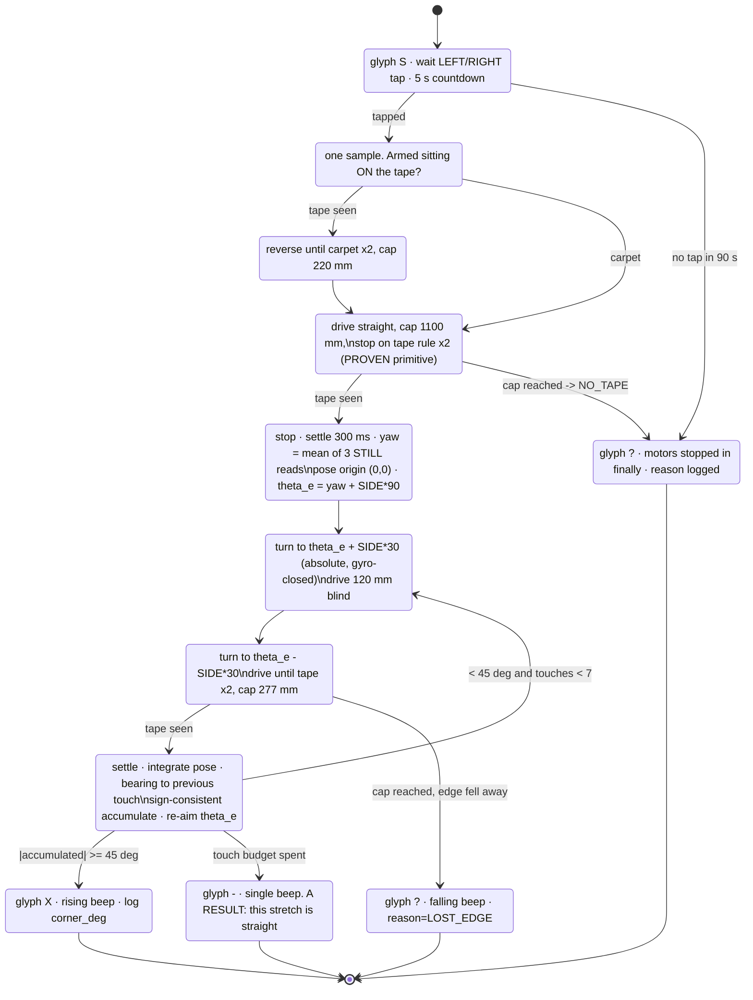
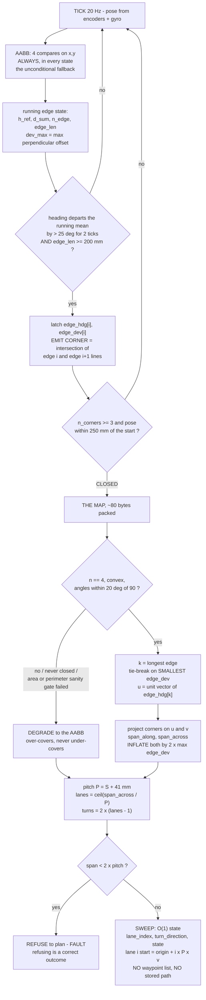
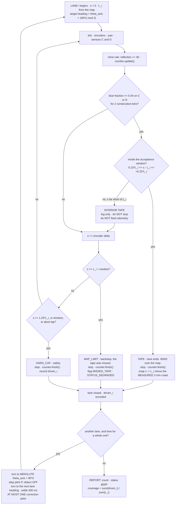

# Plan — Border tracing, corners, and what a corner map is actually worth

**Date:** 2026-09-08 · **Demo Day:** 2026-09-10, two days out · **Status:** ACTIVE-SPEC
**Scope:** boundary tracing and corner detection only. The live mine counter, wide-mine segmentation
and the `src/main.py` integration order are owned elsewhere and are not touched here.
**Companion runbook:** [../runbooks/corner-demo.md](../runbooks/corner-demo.md)
**Program:** [`examples/find_corner.py`](../../examples/find_corner.py)

## 1. TL;DR

**Before Thursday:** run *one* new slot program, [`examples/find_corner.py`](../../examples/find_corner.py).
It drives to the blue tape with the rule already PROVEN on hardware, then walks the boundary by
**repeated touches** — angle into the tape, touch, back off, re-aim, touch again — and declares a
**CORNER** when the bearing between consecutive touch points swings ≥ 45° in a consistent direction.
It never tries to *stay* on the line (so the ~25 mm mount wobble cannot invert its control sign) and
never reads a heading while moving. Bounded: 7 touches, ~1.2 m, 120 s cap, motors stopped in a
`finally`. **It does not run a lap and must not be sold as perimeter tracing.**

Everything else here — the full perimeter lap, the loop-closure adjustment, the compact corner map and
the map-fed lawnmower — is **after the demo, for the Intro Report**, because a
10 ft lap costs 76–98 % of a 300 s slot at the only speed this robot has ever driven, and
[`src/main.py`](../../src/main.py) has still never run on hardware. The two blockers named in
[../todo.md](../todo.md) are the units question and real-mine detection; a corner demo touches
neither, so it is a *bonus* deliverable that must not displace the first `main.py` run.

## 2. Why a border map is wanted — and the honest counterweight

The counterweight first, because it deletes the most commonly assumed reason for wanting one.

> **MEASURED (2026-09-08, [runs/surface-survey-2026-09-08.txt](../findings/runs/surface-survey-2026-09-08.txt)):**
> carpet `reflection()` **3–9** · **blue tape 7–9** · yellow note **51–73** · pink note **97+**.
> The mine rule is a fixed brightness threshold of **30**, with a 43-point gap and zero overlap.

**Blue tape sits *inside* the carpet band, so the mine detector cannot see tape at all.** Not "rejects
it" — cannot see it. Boundary tape and interior tape are both structurally invisible to the count.
The operator's warning that there may be blue tape inside the field therefore **costs the count
nothing**, and no blue veto is needed
([colour-survey-and-first-detection-2026-09-08.md](../findings/colour-survey-and-first-detection-2026-09-08.md) § 5).

So a border map is **not** wanted for tape rejection. Its three real uses, ranked:

| Use | Worth | Verdict |
|---|---|---|
| **Lane termination** on a real sighting, not dead reckoning | Replaces an accumulating error with a fresh absolute fix per lane | Wanted — but a **hand-measured rectangle does it too** (§ 6) |
| **Measuring the arena** — settle KU-P1, the units | The project's top blocker | **A lap is the expensive way**; one straight drive does it (§ 4.4) |
| **Arena shape / turn counting** — the tape is hand-laid | Report-grade; only a trace gives the true shape | After the demo |

⚠ **One caveat, not this workflow's to fix.** Tape-is-invisible holds for the **reflectance** rule.
`src/main.py` still runs `DETECT_MODE == "anomaly"`, which scores in *chromaticity* — where blue tape
is the most conspicuous thing on the floor (carpet→tape **0.103** vs carpet→yellow-note **0.052**
[COMPUTED]). That is exactly what the survey measured: tape 100 % detected, yellow 0 %. The
reflectance switch must land before the arena run.

## 3. Corner detection on a hand-laid boundary

### 3.1 What a corner is, operationally

> **A corner is a sustained, sign-consistent change in the bearing between consecutive
> BOUNDARY TOUCH POINTS.**

Each *touch* is one execution of the primitive that already ran untethered on battery — drive straight
until the tape rule fires twice in a row ([`drive_to_tape.py`](../../examples/drive_to_tape.py),
2026-09-08, `#end reason=TAPE_DETECTED rows=53 deg=281 mm=155`). The robot approaches at a fixed angle,
touches, retreats at the mirror angle, re-aims from the last two touches, and touches again. Each touch
is an **absolute fix on the boundary**, so nothing accumulates; re-aiming from real touches is what
tolerates an edge that wanders.

**Three rejected alternatives, and why.**

1. **Bang-bang line following, then "the tape disappeared".** Ruled out by
   [minimalism-contract-2026-09-03.md](./minimalism-contract-2026-09-03.md) § 4 item 4: the ~25 mm
   mount wobble ([colour-sensor-mounting-wobble-2026-09-03.md](../findings/colour-sensor-mounting-wobble-2026-09-03.md),
   OPERATOR-REPORTED, BM-9 never run) is the size of a 24 mm tape, so the binary on/off state can be
   **wrong**, not merely noisy — and a follower lives in the transition band, where every measured
   error lives.
2. **Reading the corner angle off an arc-pivot reacquire.** The angle is a property of the *search
   geometry* (the sensor sweeps a ≥ 47.5 mm circle about the stopped wheel), not of the boundary. A
   straight edge plus one wobble-induced loss produces a confident 60° "corner".
3. **A turn-rate backstop on in-motion yaw.** The only turn data we own disagrees with itself: in all
   four turns of the 1 ft square, the sample immediately *after* the ≥ 900 ddeg break reads
   **835 / 849 / 862 / 847 ddeg** from the turn start — 3.8–6.5° short of the threshold that had just
   fired, in the same direction, while still rotating. **Every heading this design reports is read
   while stopped and settled**, exactly as [`examples/motor_poc.py`](../../examples/motor_poc.py)
   `settle()` does.

### 3.2 Thresholds and their basis

| Constant | Value | Basis |
|---|---|---|
| `BLUE_FRAC_MIN` | 0.44 | **[MEASURED]** gap: carpet max 0.408 → tape min 0.476, on neither edge |
| `CONSEC_NEEDED` | 2 | **[MEASURED/PROVEN]** the only samples in the gap band are 1–2-sample edge tails; 2-in-a-row is the value `drive_to_tape.py` actually ran |
| `SAT_MAX` (r,g,b only) | 1000 | **[MEASURED]** channels pin at the 1024 ceiling on contact and ratios collapse to 33/33/33. ⚠ **r, g, b only** — the `i` channel legitimately reached **1022** over a pink note in the successful `find_note` run, so a four-channel guard would discard a real detection |
| `MIN_CHAN_SUM` | 40 | **[MEASURED]** carpet total is 49–107; below ~40 the blue fraction is quantisation garbage (a `1,1,2` read gives exactly 0.500). **New guard — nobody had a low-light floor before** |
| `STITCH_DEG` | 30° | **[ASSUMED]** approach/retreat angle to the edge |
| `RETREAT_DEG` | 217 (~120 mm) | **[COMPUTED]** 63.5 mm wheel → 0.554 mm/deg; gives a 60 mm perpendicular standoff |
| `APPROACH_CAP_DEG` | 500 (~277 mm) | **[COMPUTED]** > 2× the ~120 mm an approach should need at 30° |
| `CORNER_MIN_DEG` | 45° | **[ASSUMED]** 13–16× the **MEASURED** 2.6° yaw wander over a 155 mm run; half a real 90° corner |
| `WIGGLE_MAX_DEG` | 25° | **[ASSUMED]** below this, a bearing change is hand-laid wander |
| `SIDE` | ±1 | **[OPERATOR SETS]** which way round the box. The program must not guess |

A bearing between touches ~200 mm apart, with per-leg odometry error under ~5 mm, carries ~**±2° of
noise** [COMPUTED] — far below the 45° trigger. **Sign consistency separates a corner from a wiggle:**
a sign flip *resets* the accumulator, so wander cancels and only a monotone turn accumulates.

### 3.3 State diagram



**`EDGE_STRAIGHT` is a result, not a failure**, and it is the control case: run the program once at a
real corner and once mid-edge, and the two runs together are the demonstration.

## 4. Perimeter tracing — and whether the loop closes

### 4.1 The algorithm

Structurally it is § 3 without the stop: keep stitching, count corners, and declare closure when both
the accumulated turning is near ±360° **and** the pose is back near the start.

```mermaid
stateDiagram-v2
  [*] --> PLACE
  PLACE: operator places the robot facing a BOUNDARY edge.\nThe first tape is boundary BY DECLARATION -\nno local rule can tell boundary from interior tape
  PLACE --> SEEK
  SEEK --> STITCH: first touch, pose origin
  STITCH: touch - retreat - re-aim - touch\nevery touch an absolute boundary fix
  STITCH --> STITCH: bearing stable
  STITCH --> CORNER: bearing swings >= 45 deg, sign-consistent
  STITCH --> LOST: approach cap hit, no tape
  CORNER: record corner (x, y, bearing_in, bearing_out)\ncorners += 1 · total_turning += angle
  CORNER --> STITCH: corners < 4
  CORNER --> CLOSE_CHECK: corners >= 3 and pose near origin
  CLOSE_CHECK: total_turning near +/-360 -> a CLOSED LOOP\ntotal_turning near 0 -> an interior STRIP, keep going
  CLOSE_CHECK --> ADJUST: closed
  CLOSE_CHECK --> STITCH: not closed
  ADJUST: 1) spread the angular misclosure over the corners\n2) Bowditch: shift each leg by -closure x leg/total
  ADJUST --> REPORT
  REPORT: corners + arena extent to CSV;\nthe misclosure per corner is the NEXT run's turn bias
  REPORT --> [*]
  LOST: stop · partial corner list written · DEGRADED
  LOST --> [*]
```



### 4.2 Does the loop close? **No, not as flown.** [MEASURED]

We already have a four-turn closed loop: the 1 ft square of 2026-09-03. Re-integrating its 238 filed
rows through [`src/odometry.py`](../../src/odometry.py) on the host:

| Quantity | Value |
|---|---|
| Path travelled | 1277 mm |
| **Loop-closure error** | **108.3 mm = 8.5 %** (independent geometric traverse: 105.5 mm) |
| **Final heading error** | **30.0°** |
| Per-turn net rotation | −96.70, −97.40, −98.50, −97.10° (mean −97.45, SD 0.77) |
| Sum of turns | **−389.70°** instead of −360 |
| Encoder-vs-gyro heading agreement | 1.65° over the whole lap — **not** a gyro fault |

A 30° heading error poisons every lane that follows, so **a naive lap is worse than useless as a
seed**. Applying a surveying angular-closure adjustment to that run's own four legs (add +7.43° per
corner, re-walk) drops the closure to **5.4 mm** — a 20× improvement from four additions, with the
Bowditch compass rule only the polish on top.

### 4.3 ⚠ Why that 20× must **not** be sold as a calibration

Two honest caveats, both of which survived adversarial review and neither of which is optional:

1. **It is fitted, not predicted.** The correction takes *that run's* misclosure, divides by four, and
   adds it back to *that run's* corners. One observation, one free parameter — it will always work. It
   proves the closure error was dominated by angular misclosure. It proves nothing about whether a
   pre-measured bias would close a *future* lap.
2. **The +7.45°/turn is very likely a sampling artefact.** `motor_poc.turn()` polls the gyro, tests
   `≥ 900 ddeg`, then sleeps `TICK_MS = 100`. In-turn rate was ~81 °/s, so the break is evaluated only
   every **~8.3°** — the size of the claimed overshoot — and the tight SD 0.77° is phase-locking (every
   turn starts from an identical settle), not repeatability. **Halve the tick and the bias roughly
   halves.** A "360° spin calibration" measures one turn profile at one tick rate and is void the
   moment `TICK_MS` changes, so **do not spend hub time on it before Thursday.** Do file the closure
   number: it is a real result and good report material.

### 4.4 Can tracing settle the units question (KU-P1)? **Yes — but a lap is the expensive way.**

Length scale from the same run: legs came in **+1.6 % to +3.8 %** of the true 304.8 mm (mean +2.5 %),
random spread 1.54 % per 300 mm → under 0.5 % over a 3 m side. 10 ft = 3048 mm vs 10 m = 10000 mm is a
ratio of **3.28** (crossover at the geometric mean, 5521 mm), so confusing them needs an **81 % scale
error** against our ~3 % — a **≈27× margin** [COMPUTED]. Even a badly wrong wheel diameter would not
bridge it.

**But no lap is needed.** [`examples/drive_to_tape.py`](../../examples/drive_to_tape.py) already prints
the distance it drove (`#end … deg=281 mm=155`); placed at one edge facing the opposite one, **that
`mm` figure is the arena dimension**. Raise `RUN_CAP_MS` to ~70000 and change nothing else. ⚠ Do **not**
also raise `SPEED_DPS` to 300 (~166 mm/s) — that is over the tape-detector cap of § 6.3.
**Honest limit:** it cannot separate 10 ft (3048 mm) from ten 30 cm tiles (3000 mm), 1.6 % apart and
inside our systematic error. Say "about 3.0 m", never "ten feet".

### 4.5 Error budget for a lap we have not flown

Monte Carlo (20 000 laps) seeded only from the measured spreads — and reproducing the one real lap
(105 mm predicted vs 105.5/108.3 measured), which is a *consistency* check, not validation:
**10 ft box** (12.19 m perimeter) ~1046 mm uncorrected (8.6 %, heading ~30°), ~130 mm with angular
closure applied but **realistically 74–373 mm** on the n=4 confidence interval; **10 m box** ~3446 mm
uncorrected, ~683 mm corrected (389–1953 mm).

**Three physical effects are absent from that model, none measured:** carpet slip during a turn, gyro
drift while driving on battery over minutes (every drift figure we own — 0.0033 °/s — came from a
*still, motorless, USB-powered* hub over 30 s, KU-M9 PARTIAL), and thermal bias over a run 10–40×
longer than any window observed. **Quote "about 100–400 mm at 10 ft", never "130 mm".**

## 5. The compact map

### 5.1 Representation

An **oriented corner polygon with a measured per-edge heading and a per-edge wander number**, plus an
AABB maintained unconditionally as the fallback:

```
corners   array('f', 2 * MAX_CORNERS)   MAX_CORNERS = 8
edge_hdg  array('f', MAX_CORNERS)       MEASURED mean gyro heading along the edge, not atan2 of corners
edge_dev  array('f', MAX_CORNERS)       max perpendicular deviation of the path from its own chord
aabb      4 floats                      four compares per tick, valid even when corner detection fails
n_corners int
```

**Why the measured heading is not redundant.** `atan2` of two corner positions inherits both corners'
odometry error plus the detection-latency bias — a 20 mm corner error across a 3 m chord is already
0.38°, and 20 mm is optimistic. The running mean gyro heading has only drift as its error. 16 bytes
buys a better lane direction than the geometry gives.

**Why the wander number matters, as a number.** A note is 76 mm (`TARGET_SIZE_MM`, [ASSUMED]) and
`EDGE_CHORD_FRACTION = 0.25` means the sensor must cross ≥ 19 mm of it, so a note centred *d* mm
outside the swath presents 38 − *d* mm and needs **d ≤ 19 mm** [COMPUTED]. A hand-laid edge bowing more
than ~19 mm loses mines if you plan to the straight chord. **The fix is not more corners** — it is
inflating the plan by the wander the trace already measured, at most one extra lane.

### 5.2 Byte cost [COMPUTED]

MicroPython `array('f')` is 4 B/element plus a ~16 B header; a boxed float in a list is ~20 B.

| | floats | `array('f')` | boxed list |
|---|---|---|---|
| AABB only · 4 corners | 4 · 8 | ~32 B · ~48 B | ~96 B · ~224 B |
| **4 corners + heading + wander** | **16** | **~80 B** | ~416 B |
| 8 corners + heading + wander | 32 | ~144 B | ~832 B |
| Raw 20 Hz path, 10 ft lap @150 mm/s (1626 ticks) | 3252 | 12.7 KB | ~76 KB |
| Raw 20 Hz path, 10 ft lap @55 mm/s (4433 ticks) | 8872 | 34.6 KB | **~208 KB** |

**~80 B against 12.7–208 KB: a 1000–3000× reduction.** Our only heap figure (~252 KiB) is *Pybricks'*
and so [UNVERIFIED for us] — stock Hub OS carries more in the same heap — but the *relative* sizing is
what matters: the map is free at any plausible figure and a boxed raw path grown by `append` is unsafe
at all of them ([../research/hub-compute-limits.md](../research/hub-compute-limits.md) § 2.3).

### 5.3 Streaming extraction — no raw path stored



Cost: ~10 float ops plus 4 compares per tick against a 50 ms budget in which a full IMU read alone is
**1.350 ms** [MEASURED]. Negligible. **Pre-allocate, never `append` in the loop.** Corner *position* is
the intersection of the two adjacent edge lines (once per corner), removing the detection-latency bias.
**Sanity gates before any map is trusted** — a wrong map is worse than none: fewer than 4 corners,
opposite sides differing > 25 %, an interior angle outside 60–120°, a side under 3× the lane pitch, or
a shoelace area below a floor → **throw the map away**. That is also what catches an interior tape
island being lapped and "closed" as a tiny polygon.

## 6. Lawnmower from corners

### 6.1 Lane direction, count, turns

Fit **one** sweep axis `theta_axis` from the map (mean bearing of the two opposite long edges, which
averages out the hand-laying). Lanes run at `theta_axis` or `theta_axis + 180`; every turn is commanded
to an **absolute** target, `turn = normalize_angle(theta_axis + 90*d − yaw_now)`, so each lane change
**cancels** the previous lane's heading error instead of accumulating it — which a fixed relative ±90°
cannot do.

> **A crooked boundary changes lane LENGTH, not lane HEADING.** Re-squaring to whichever local edge the
> robot just reached slowly rotates the lane grid and opens wedge-shaped gaps between lanes — exactly
> what boustrophedon coverage exists to avoid. Crookedness is absorbed entirely by the per-lane `L_i`.

Pitch with two downward sensors spaced `S`: `P = S + (76 − 2e − m) = S + 41 mm` [COMPUTED from
`src/config.py`]. `lanes = ceil(span_across / P)` · `turns = 2*(lanes − 1)`.

| Arena | S = 0 (one sensor) | S = 41 | S = 65 |
|---|---|---|---|
| 10 ft (3048 mm) | P = 41 → **75 lanes, 231.6 m** | P = 82 → 38 lanes, 118.8 m | P = 106 → **29 lanes, 91.4 m** |
| 10 m (10000 mm) | 244 lanes, 2450 m | 124 lanes, 1250 m | 95 lanes, 960 m |

⚠ **`src/` is a one-sensor robot today.** `src/hub_color.py` reads `hub_api.COLOR_PORT` (port C) only;
`SECOND_COLOR_PORT` is declared in `hub_api.py` and referenced nowhere else in the repo. So the honest
figure for the program as it stands is the **75-lane column**, and **the pitch must not be raised to
`S + 41` until both ports are actually read every tick** — raising it first is the one change that
silently loses mines. `SENSOR_SPACING_MM` does not exist in `src/config.py` at all.

### 6.2 Belt-and-braces lane termination



**Which wins on disagreement: TAPE, always, inside the window** — the map inherits the trace's
odometry drift, while a sighting is a fresh absolute fix, so preferring the map is preferring stale
drift over measurement. Outside the window and *early*, a sighting is interior tape: log it, do not
stop, do not feed it to odometry.

⚠ **The window is honestly weak, which is the argument for a hand-measured rectangle.** At
−0.10·L_i…+0.25·L_i it is −300/+760 mm at 10 ft — wide enough to admit interior tape across the far
half of the lane — while at the 1000 mm placeholder it is −100/+250 mm, *smaller* than the map's own
plausible error, so real sightings get rejected and every lane ends DEGRADED. A rectangle the Builder
measures supplies the same window in 30 seconds at zero run-time cost.

### 6.3 Two things that must change in the lane loop, and one speed cap

- **`EdgeCounter.finish()` is never called.** `finish` appears nowhere in `src/main.py`, while
  `detector.index` advances only inside `update()` — so a mine still under the sensor at a lane end is
  lost, or **concatenated with the next lane's first mine** into one event that then trips `too_wide`
  and rejects both. Call `finish()` on **every** lane exit. (Another workflow's fix; recorded here
  because it is where coverage meets counting.)
- **`TICK_MS = 100` in `src/main.py`** halves every speed cap below. 20 Hz is MEASURED sustainable —
  but see the caveat.
- **The tape detector, not the motors, sets the speed limit:** `v ≤ tape_width · f / (CONSEC+1)` =
  **160 mm/s** at 20 Hz on 24 mm tape, 80 mm/s at 10 Hz. ⚠ **20 Hz is the median, not the worst case:**
  `CsvLog` flushes every 10 rows at a MEASURED ~40–60 ms cost (drive_to_tape ticks run 53 ms except
  every tenth, 91–112 ms), so the worst interval at `TICK_MS = 50` is ~110 ms and the honest cap is
  **~70 mm/s** unless `flush_every` is raised — which is why `find_corner.py` passes `flush_every = 25`.
  **Measure the tape width**: it is the binding constraint of the whole design (KU-P14, OPEN).

### 6.4 Time, plainly

10 ft, two sensors at S = 65, 160 mm/s: 91.4 m + 56 turns ≈ **10.9 min**; at the only speed ever driven
(55 mm/s), **28.9 min**. A trace adds 1.6–3.9 min. **A 300 s slot is refuted** — it needs 423 mm/s,
2.6× over the tape cap; it buys 31–45 % coverage with a trace, 45–59 % without. 600 s buys 79–93 %.
10 m is ~105 min, refuted at every budget. Report **coverage as a percentage** and have the Builder say
*"seven, hourglass, sixty-two percent"* — never the bare count.

## 7. Degradation — a value, not an architecture

The map enters the sweep **only as data**: `theta_axis`, a list of `L_i`, and one window width. Every
consumer already has a no-map branch, and it is today's code path.

| Knob | With a map | Without (today, and the safe default) |
|---|---|---|
| `BOUNDARY_MODE` | `"tape"` — gated termination per § 6.2 | `"odometry"` — dead reckoning, as shipped |
| `L_i` | per-lane, from the map | `config.ARENA_LENGTH_MM` for every lane |
| `theta_axis` | fitted from the map's longest edge | 0, i.e. the yaw at `hub_imu.reset_yaw()` |
| coverage | `sum(driven_i) / sum(L_i)` | collapses **exactly** to `lanes_completed / lanes_planned` |
| `CMD_RESQUARE` | "gyro-turn to `theta_axis`" | the documented no-op |

`sweep.py` gains **zero states**; `SweepPlan` already stores no waypoints, its `width_mm`/`length_mm`
merely stop coming from `[ASSUMED]` 1000.0 placeholders. The coverage formula reducing *exactly* to the
existing ratio is this plan's cleanest illustration of *"a clarified answer changes a value, not the
architecture."* Never default to **ungated** tape termination while interior tape is possible.

## 8. Open questions and risks

| # | Risk / unknown | Why it bites | What closes it |
|---|---|---|---|
| 1 | **`src/main.py` has NEVER run on hardware** | Its first run will be in a taped arena, and it currently runs the *chromaticity* detect path, which counts blue tape and misses yellow notes (§ 2) | The first `main.py` run, ranked in [../runbooks/first-main-run.md](../runbooks/first-main-run.md). **This outranks every corner deliverable.** Hub minutes are the scarce resource |
| 2 | **Sensor spacing `S`, spot diameter, lens height, tape width — all UNMEASURED** | `S` sets lane pitch linearly: an error δ opens an uncovered strip of δ and the robot reports a confident **low** count. Tape width sets the binding speed cap | **Two minutes with a ruler.** Mark both lit spots on paper under the standing robot, then **lift and replace 3×** — the mean is `S`, **the spread is the build tolerance**. Into [`docs/hardware/build-record.md`](../hardware/build-record.md) § 4, still placeholders. **No KU row exists for any of them** |
| 3 | **Turn slip on carpet is unmeasured** | Turns are where differential-drive odometry degrades most and they are our least-sampled motion. The one lap misclosed 30° over four turns | Only a lap measures it. Deliberately deferred to after the demo |
| 4 | **Battery — absent from every analysis** | Longest untethered run on record: 45 s. § 6.4 costs the demo at 12–15 min, **16–20×** that, and every voltage reading we have was taken **while charging on USB** — no discharge curve exists. Sag changes mm-per-degree → event-width gates → the **count**. KU-M11 OPEN; [`demo-day.md`](../runbooks/demo-day.md)'s battery gate has no number | Log `hub.battery_voltage()` as a column on every run, and put a number in that gate |
| 5 | **KU-P1, the units of "10×10"** | At 10 ft the sweep is 10.9–28.9 min; at 10 m, ~105 min. Nothing on this page rescues either | One straight drive to tape (§ 4.4), ~60 s of hub time, 27× margin. Or ask the professor |
| 6 | **Boundary vs interior tape cannot be told apart locally** | Both are blue tape: chromaticity 0.476–0.496, reflectance 7–9, identical. **No measurement in this repo can separate them** | Say so out loud. Defences are the **declared** corner start, the turning-number test (a loop totals ±360°, a strip ~0), and the area/perimeter sanity gates |
| 7 | **Starting on, or outside, the tape** | Start *on* the tape → the seek terminates on tick 0 with an undefined reference. Start *outside* the box → the boundary is traced from the wrong side and every corner angle has the wrong sign, forever | `find_corner.py` handles the first (a CHECK→CLEAR state). The second has **no fix** in a wall-less arena: carpet resumes on both sides. It is an operator-placement requirement, stated in the runbook |
| 8 | **`CORNER_MIN_DEG = 45` and `STITCH_DEG = 30` are [ASSUMED]** | Both are tuned by eye on the first run | The first `find_corner.py` log: the bearing spread between touches on a straight edge is the number that converts 45 from assumed to derived |

**Not done here, deliberately:** no edits to `src/`, no new module, no test suite, no hardware touched,
no git. `border.py` (the § 5 extractor) is **specified, not written** — after-demo work, ~80 lines, and
only worth writing once something can feed it a real pose stream.
