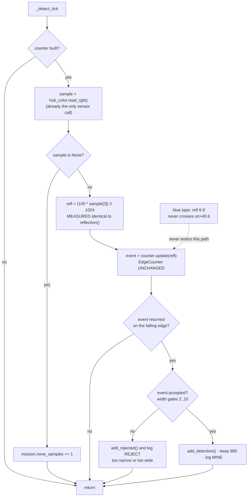

# Carpet detection and the blue boundary — the Demo Day detection decision

**Dated 2026-09-08. Demo Day is 2026-09-10 — two days.** This is a PLAN. Nothing in `src/` was edited
to write it; every number below was either read out of a repo file or **[COMPUTED]** on the host from
[../findings/runs/surface-survey-2026-09-08.txt](../findings/runs/surface-survey-2026-09-08.txt) using
the shipped modules unmodified. No hardware was touched.

---

## 1. What changed — two corrected mission facts

Both from the **operator, 2026-09-08**, verbally. They supersede anything in the repo docs.

### 1.1 The Demo Day arena is a CLOSED BOX of blue painters tape

* The graded arena is a **complete, closed rectangle** of blue painters tape on the floor.
* **The practice/test area's INCOMPLETE tape is NOT the demo arena.** Its gaps exist only so several
  teams' setups do not run into each other. Do not design against the practice layout, and do not
  report a practice-area result as an arena result.
* There are still **no walls** — the boundary has ~0.1–0.3 mm of vertical extent. This does not revive
  the Distance Sensor 45604 (KU-P3 is closed; a separate agent owns that decision).
* Mines are **flat matte sticky notes, currently YELLOW and PINK**, colour may change on the day, and
  the instructor may add or remove notes mid-run. **The one guarantee: mines will never be BLUE.**

**What this invalidates.** `config.BOUNDARY_MODE` is still `"odometry"` and is read by **no executable
line in the repo** ([../../src/mission_config.py](../../src/mission_config.py):18, and a comment at
[../../src/main.py](../../src/main.py):286) — so nothing in the shipped program knows the tape exists.
A closed box means the sweep will cross the boundary on **every lane end**, not occasionally. It also
partly answers FR-6 ([../scope.md](../scope.md)): the tape is now a usable fence, not just a hazard.
KU-P13 (which tape) is **answerable from the capture** — blue, measured. KU-P14 (tape width) is now
load-bearing and still `OPEN` ([known-unknowns.md](./known-unknowns.md)).

### 1.2 The floor is MULTICOLOUR CARPET

Operator: *"the floor is the carpet with different colors so it is just complicated."*

**What this invalidates.** The floor-relative chromaticity anomaly design
([../../src/floor_anomaly.py](../../src/floor_anomaly.py), `DETECT_MODE="anomaly"`) was written for a
floor whose hues fit in `K_MAX = 6` chromaticity bands with a spread large enough to normalise by. The
carpet is also **very dark** — MEASURED median `r+g+b` = **80 counts (port C) / 82 (port D)** over the
`FLOOR` block, reflection median **6**. `docs/findings/colour-first-look-2026-09-01.md` recorded that
class carpet **read as nothing** at the old ~51 mm mount; the new capture shows it reads as *almost*
nothing, which is a different and worse problem for a ratio-based metric.

---

## 2. The threat

### 2.1 Chromaticity-only anomaly detection on a dark multicolour carpet

Two **opposite** failure modes, both real:

| Mode | Mechanism | What the operator sees |
|---|---|---|
| **Too many bands** | `build_floor_model` raises `CalibrationError("floor has more than 6 colour bands")` ([floor_anomaly.py](../../src/floor_anomaly.py):97–99). `main.py`:249 catches it with a **bare `except Exception:`** that discards the message, returns False → `CALIBRATION_FAILED` | An `x` glyph forever. The **same `x`** is shown for four distinct causes (no operator tap, too many bands, no usable samples, tick rate too low). No console, no triage. |
| **Bands too wide** | `merge_radius = 4 × global_sigma` swallows the floor into a few fat bands; every mine's sigma-distance shrinks below the `median + 8.90·MAD` threshold | **Nothing.** The robot arms, sweeps the whole arena, reports zero, and looks correct. |

**The second mode is the one that actually happened.** [MEASURED, host replay of
`./scripts/analyse-survey.py` over the real capture, 2026-09-08]:

| port | bands | `on>` | YELLOW_MIDHOLE | BLUE_TAPE | PINK_NOTE |
|---|---|---|---|---|---|
| **C** | 4 | 7.470 | med_dev **5.99 → 0.0 % above → INVISIBLE** | 11.30 → **100 % TRIPS** | 20.37 → 98.8 % TRIPS |
| **D** | 5 | 6.941 | med_dev **6.97 → 52.9 % → marginal** | 12.41 → **100 % TRIPS** | 23.37 → 85.2 % marginal |

`K_MAX` was **never approached** (4 and 5 bands on the real carpet). The refusal-to-arm mode did not
occur; the silent-blindness mode did. And the two sensors **disagree on the same note at the same
instant** — C says invisible, D says coin-flip. A rule whose verdict depends on which sensor you read
is not marginal, it is broken.

The mechanism is **darkness, not hue geometry**: at `r+g+b ≈ 80` counts, one ADC count is worth ~0.0125
chromaticity units, so the band sigma the rule divides by is quantisation noise. `analyse-survey.py`
also reports `FLOOR vs YELLOW_NOTE` as **NOT SEPARABLE** as colour classes (0.0181, needed 0.0188).

### 2.2 An unmodified sweep counts the blue boundary as mines

`_detect_tick` ([main.py](../../src/main.py):103–122) is four steps — read → `deviation()` →
`EdgeCounter.update()` → `add_detection()`. **Nothing between the sensor and the count looks at
colour.** Blue tape is unlike the carpet, so it produces a high deviation and an accepted event. On the
real data it trips at **100 % on both sensors, more reliably than a real yellow note.** In a closed box
that is one to several false counts per lane end, every lane, all run.

---

## 3. The decision

> **We will detect mines by REFLECTANCE (absolute, calibrated at run start), not by chromaticity.
> `DETECT_MODE = "reflect"`. There will be NO blue veto, because the blue tape sits inside the
> carpet's reflectance band and is ignored for free.**

**This is deliberately the dumber rule, and we are picking it because the adversarial pass showed the
clever one fails and the dumb one does not.** Stated plainly for the report: the floor-relative
chromaticity anomaly detector is a better *idea* — it needs no target exemplar and adapts to a floor we
have never seen — but on this floor it is computing hue out of quantisation noise, and it fails
*silently*.

### 3.1 The measurement that decides it

All at the **"middle hole" mount height**, both sensors, MEASURED 2026-09-08 (`reflection`, 0–100):

| surface | port C | port D |
|---|---|---|
| `CARPET_MIDHOLE` (n=134) | min 3, **med 5**, max 8 | min 3, **med 6**, max 9 |
| `BLUE_TAPE_MIDHOLE` (n=64) | min 6, **med 8**, max 9 | min 7, **med 8**, max 9 |
| `YELLOW_MIDHOLE` (n=119) | min **51**, med 62, max 68 | min **52**, med 57, max 73 |

**Zero overlap. The gap from the brightest carpet-or-tape sample to the dimmest yellow sample is 42
points (C) and 43 points (D).** The blue tape is 2–3 points above the carpet and 42 points below the
note — it is inside the floor, which is why no veto is needed.

The **shipped** `calibration.calibrate()` accepts this without modification [COMPUTED]:

```
C  floor=5.0 target=62.0 contrast=57.0 on>40.6 off<26.4 polarity=+1 floor_noise=1.0
D  floor=6.0 target=57.0 contrast=51.0 on>37.9 off<25.1 polarity=+1 floor_noise=1.0
```

`contrast = 57` against `MIN_CONTRAST = 12.0` and against the project's own 8.90-MAD (= 6 SD) rule with
`floor_noise = 1.0`: it passes by **~6×**. Crucially, that path **can refuse to arm with a number in
the message** — the anomaly path has no calibrate-time contrast gate at all, and
`calibration.check_floor_stability()` is defined at [calibration.py](../../src/calibration.py):68 and
**called from nowhere** (verified by grep over `src/`).

End-to-end through the **real** `detector.EdgeCounter` with real samples in a synthetic lane order
(40 carpet · 5 yellow · 40 carpet · 2 tape · 40 carpet · 5 yellow · 40 carpet), width gates `(2, 10)`
from `config.event_width_gates(10 Hz, 150 mm/s, 76 mm)` [COMPUTED]:

* **counted 2 of 2 planted notes** (event width 5 samples each, both accepted);
* the tape crossing produced **no event at all** — it never crosses `on>40.6`;
* **0 phantom events** on the raw 134-sample carpet stream and the raw 64-sample tape stream, both ports.

The sample ordering is synthetic (all captures are static holds) and is marked **[UNVERIFIED]** as a
model of a driven lane. The samples themselves are real.

### 3.2 Zero new hub call sites

`reflection(port) == (100 * i) // 1024` **exactly — 0 mismatches in all 3412 rows** of today's capture,
across four mount heights and both sensors [MEASURED]. So the reflectance value is derived from the
`i` channel of `hub_color.read_rgb()`, which `_detect_tick` **already calls**. No new sensor read, no
new hub call site, no change to `hub_color.py`.

### 3.3 The detect-tick decision path



**What we are giving up, honestly.** The reflectance rule needs a *target* exemplar, so if the note
colour changes on the day we must re-capture it — two minutes with
[`scripts/scan-surface.py`](../../scripts/scan-surface.py), which is exactly what that tool was built
for. The floor level is still learned on the day by the same run-start creep. A note whose reflectance
matches the carpet's is still invisible — but that is now a **loud** failure, because `calibrate()`
refuses to arm rather than arming and reporting zero.

---

## 4. The minimal change plan

Ordered so the **proven drive path is never at risk**. The 1 ft square drive
([../findings/square-drive-fusion-2026-09-03.md](../findings/square-drive-fusion-2026-09-03.md)) is the
only motion this project has ever proved; nothing below touches `drive_distance_mm`, `turn_degrees`,
`hub_motors`, `hub_imu` or `sweep.py`.

**Step 0 — mechanical, before any code (Builder, ~30 min, no purchase).** Keep the sensors at the
**middle-hole height that produced the numbers in §3.1** and make that height *repeatable*: both
sensors on **one beam** spanning the robot, each held by **two pins** into that beam (a single pin is a
hinge — that is the whole ~25 mm wobble defect,
[../findings/colour-sensor-mounting-wobble-2026-09-03.md](../findings/colour-sensor-mounting-wobble-2026-09-03.md)),
the drop triangulated back to the chassis, lens flat and facing down. **Then put a ruler on it and
write the number down** — the "middle hole" height has never been measured in mm, which is the single
biggest provenance hole in this document. Do **not** chase a 16 mm ±3 mm target: that tolerance is
unattainable against 25 mm of wobble and the midhole data already gives a 42-point gap.

**Step 1 — `src/mission_config.py`, ~4 lines, pure, zero runtime risk.**
Extend the `DETECT_MODE` comment with a third value `"reflect"`, and add
`TARGET_REFLECTANCE_SAMPLES = ()` — a tuple of integer reflectance values pasted from the day's
`YELLOW`/mine capture (today's port-C values would be `51..68`), empty meaning *no mine has been
measured*. Mark it `[MEASURED on the day]`, not `[ASSUMED]`.

**Step 2 — `src/main.py::calibrate_floor`, ~12 lines, one function.**
* Change `if config.DETECT_MODE != "anomaly": return False` ([main.py](../../src/main.py):223) into a
  branch that also accepts `"reflect"`.
* The creep already collects `samples` from `hub_color.read_rgb()` — **no new hub call**. Derive
  `floor_refl = [(100 * s[3]) // 1024 for s in samples]`.
* Replace the model build, in the `"reflect"` branch only, with
  `cal = calibration.calibrate(floor_refl, list(config.TARGET_REFLECTANCE_SAMPLES))`.
* Keep the existing `lo, hi = config.event_width_gates(...)` and
  `ctx.counter = detector.EdgeCounter(cal, min_width=lo, max_width=hi)` **exactly as written**.
* Leave `ctx.floor_model = None` in this branch.

**Step 3 — `src/main.py::_detect_tick`, ~6 lines.**
Take the `floor_model is None` branch and feed `(100 * sample[3]) // 1024` straight into
`self.counter.update(...)` instead of `deviation(...)`. The `sample is None` guard and the
`none_samples` counter stay.

**Step 4 — diagnosable faults, ~6 lines, zero risk, apply regardless of everything else.**
[main.py](../../src/main.py):249 `except Exception:` → `except Exception as e:`; stash `str(e)` on
`ctx`; log it via `hub_telemetry_log`; and branch the terminal glyph so *too busy* / *no samples* /
*rate too low* / *no operator tap* are visually distinct instead of four identical `x` glyphs. This is
the difference between recovering in 60 seconds on the arena and not recovering.

**Untouched, deliberately:** `detector.py` · `sweep.py` · `result.py` · `floor_anomaly.py` ·
`classify.py` · `calibration.py` · every `hub_*.py` · every existing config constant. **No new module.
No `src/fence.py`. No blue veto. No rolling texture window. No stateful `deviation()`. No new operator
step. No tests** ([ADR-0005](../decisions/0005-no-test-suite-verify-on-hardware.md)).

**New hub call sites introduced: ZERO.** Every hub call on the changed path
(`hub_color.read_rgb`, `hub_motors.drive`, `hub_motors.stop_motors`, `hub_ui.beep`) is already on the
existing path — which is itself **[UNVERIFIED] in `main.py`** (KU-M29: `main.py` has never executed one
line on the robot). `color_sensor.rgbi(port.C)` and `(port.D)` are **MEASURED working today** via
[`scripts/scan-surface.py`](../../scripts/scan-surface.py); `src/hub_color.read_rgb()` as a wrapper is
still **[UNVERIFIED]**.

---

## 5. Go/no-go survey protocol

Run on the **graded carpet on Demo Day morning**, and once tonight as a rehearsal. ~15 minutes.
Everything is executed by the operator; nothing here was run by me.

1. **Ruler first.** Measure the standoff, sensor C and sensor D **separately**, lens face to carpet pile
   tips, robot resting on its own wheels **on the carpet**. Write both numbers down. Note where each
   sensor sits in its residual wobble. Nothing downstream is reproducible without this.
2. **Capture the floor, pooled.** `./scripts/scan-surface.py FLOOR --seconds 10` at **3+ spots** —
   darkest patch, lightest patch, most common patch — using the **same label** each time so the samples
   pool exactly as `calibrate_floor`'s 3 s creep pools them. Slide the *surface* under the robot;
   **never lift the robot onto a surface** (that is what produced the 596 fully-saturated rows and the
   2832 ms saturated head of today's `FLOOR` block).
3. **Capture every mine colour actually present**, on the carpet, note flat, covering both apertures:
   `./scripts/scan-surface.py YELLOW_NOTE`, `./scripts/scan-surface.py PINK_NOTE`.
4. **Capture the boundary**: `./scripts/scan-surface.py BLUE_TAPE` (the label **must** contain `TAPE`).
5. **Read each `scan-surface.py` summary line before moving on.** Reject and re-take any hold where a
   channel reaches 1000, or reflection reads 99, or C and D disagree by more than ~15 % in total.
6. `./scripts/analyse-survey.py` — read the chromaticity table for the record, and read the
   **reflectance medians from the `scan-surface.py` summary lines** for the decision.

### Quantitative criteria — on the reflectance numbers, both sensors

| | Criterion |
|---|---|
| **GO** | `min(mine reflection) − max(carpet reflection) ≥ 20` points, **and** `max(tape reflection) < min(mine reflection) − 20`, **and** carpet MAD ≤ `MAX_FLOOR_MAD` = 1.35, **and** `calibrate(floor, target)` returns without raising. Today's midhole numbers give a **42–43 point** gap and MAD 1.0 — GO by ~2×. |
| **MARGINAL** | Gap 12–20 points (still above `MIN_CONTRAST = 12.0`) **or** contrast between 8.90 and 12 × carpet MAD. Proceed, say it out loud, expect misses. Mitigation is a **value**: lower `TRAVERSE_SPEED_MMS` so more pure-interior samples land in each note — but see §7, the timebox has ~70 s of slack and halving speed overruns it. |
| **STOP** | `calibrate()` raises (contrast < 12, or contrast < 8.90 × carpet MAD) — the honest refusal; **or** tape reflection lands within 20 points of a mine; **or** any capture pinned at ≥1000 / reflection 99 (a saturated surface carries no information — re-take, do not analyse); **or** C and D disagree on the verdict (the mount is asymmetric — fix it, or run on one sensor and record which). |

**One operating rule, free, and it prevents the failure `floor_anomaly.py` calls irreducible: the
calibration creep must not cross a mine or the tape.** Today's `FLOOR` model contains a singleton band
at `cx=0.4687 cy=0.2326 sigma=0.00010` — **0.008 from the `PINK_NOTE` centroid** (0.4622, 0.2377). A stray pink sample got into a floor
hold. Start the creep on clear carpet and watch it.

---

## 6. Fallback ladder

In order. Each rung is cheaper and dumber than the one above it.

1. **Re-capture the mine at the same height and re-derive.** If a mine colour changed on the day,
   paste the new reflectance rows into `TARGET_REFLECTANCE_SAMPLES`. Two minutes, one config edit.
2. **Hard-code the thresholds.** If anything in `calibrate()` misbehaves on the bench, set
   `on_threshold = 30.0, off_threshold = 20.0` directly. [COMPUTED] that single pair correctly separates
   every surface in today's capture at all four mount heights: carpet and tape 0.0 % above 30, yellow at
   midhole 100.0 % above 30. You lose the fail-loud arming gate; you keep a working demo.
3. **Presence-only, one sensor, and say so.** Run on whichever of C/D has the cleaner gap. Report
   FR-2b (colour classification) as withdrawn — a documented GATE-1 branch in
   [verification-plan.md](./verification-plan.md) §3, not a failure.
4. **Shrink the arena and slow down.** Set `ARENA_WIDTH_MM`/`ARENA_LENGTH_MM` to a box we can actually
   sweep in the slot, halve `TRAVERSE_SPEED_MMS`, and report **coverage fraction**, not a total.
5. **Most conservative thing that still demos.** Drive the sweep pattern with detection running and the
   count displayed, and have the Builder read the honest line: *"coverage 100 percent of the planned
   area, N mines found during the pass"* — never *"there are N mines."* The robot demonstrably drives
   the pattern (the 1 ft square is MEASURED); everything above that is a detection claim we can
   downgrade without changing the demo.

---

## 7. Open questions and risks

**First-run risk dominates everything in this document.** `src/main.py` has **never executed one line on
the robot** (KU-M29) and `hub_programmer/deploy_deps.py --apply` — the multi-module deploy that puts its
dependencies into `/flash/lib` — has **never run** (KU-M30). Against that, this plan adds ~28 lines to
two files and no new module, which is the smallest change that fixes the measured failure. **Do
[../runbooks/first-main-run.md](../runbooks/first-main-run.md) as written, on the current code, before
applying any of §4.** It is the only action that can find the class of failure no analysis predicts —
a module missing from `/flash/lib`, a tap read twice, a glyph that never appears.

**KU-P1 — the units of "10×10" — is still `OPEN`, and it now has a silent failure mode.**
`ARENA_WIDTH_MM = ARENA_LENGTH_MM = 1000.0` are `[ASSUMED]` placeholders feeding
[sweep.py](../../src/sweep.py):50–51. If the graded box is 10 ft, the robot sweeps a 1 m corner,
`do_sweep` returns `COMPLETE`, `result.is_trustworthy()` returns **True**, and a full-confidence count is
reported over ~11 % of the arena with nothing on the matrix to say so. **Recommended guard: refuse to
arm, or show a distinct glyph, while the arena is still at its placeholder value.** The real fix is one
written question to the professor ([questions-for-the-professor.md](./questions-for-the-professor.md)).

**Timebox arithmetic, [COMPUTED].** At the placeholder arena `SweepPlan` gives 25 lanes / ~26 m of path
(`path_length_mm() = 25984`, `estimated_seconds() = 173.2`) against `RUN_TIMEBOX_S = 300.0` — and that
estimate **excludes turn time entirely**, plus the 10 s countdown and the 3 s creep. Slack is well under
100 s. Halving `TRAVERSE_SPEED_MMS` overruns the box *on the arena we are pretending is correct*, let
alone a 10 ft one
([../findings/coverage-time-budget.md](../findings/coverage-time-budget.md)).

**Other open items, ranked:**

* **The "middle hole" height has never been measured in mm.** Every number in §3.1 is height-matched to
  itself and to nothing else. One ruler measurement closes it.
* **KU-P14 — tape width.** 24 mm and 48 mm are both standard. At 10 Hz / 150 mm/s the width gates
  `(2, 10)` reject anything under ~30 mm of travel for free, so 24 mm tape crossed perpendicular is
  rejected by width even if it *did* trip the level. One ruler measurement.
* **`TARGET_SIZE_MM = 76.0` is `[ASSUMED]`.** Measure the real note pack. A 76 mm note is only ~5
  samples wide at 10 Hz and `MIN_DWELL_SAMPLES = 2` rising plus 2 falling consumes 4 of those 5 — there
  is one sample of slack.
* **All captures are static holds. The moving-robot-on-pile case is [UNVERIFIED].** The single most
  valuable remaining measurement is **one driven lane over a planted note, logged and replayed on the
  host.** It closes more than any further analysis.
* **Provenance of today's capture.** The file carries an operator `LABEL CORRECTED` note at line 2490;
  the block header at line 3031 reads `CARPET_MIDHOLE` but its first 128 rows carry the label
  `BLUE_TAPE_MIDHOLE`; and the `FLOOR` block's first **2832 ms** is fully saturated (reflection 99, all
  channels 1020–1024) — a placement artefact, excluded from every figure above and stated here rather
  than quietly dropped. Whoever took the blocks should confirm the geometry of each in one sentence
  before any of it goes in the Intro Report.
* **Dead safety nets.** `calibration.check_floor_stability()`, `config.MAX_CONSECUTIVE_NONE`,
  `config.HEADING_DISAGREE_LIMIT_DEG`, `config.STUCK_YAW_TICKS` and `hub_api.SECOND_COLOR_PORT` are all
  defined and read by **no executable line**. `detector.EdgeCounter.finish()` is never called from
  `main.py`, so an event still open when a lane ends is silently dropped — and in a closed tape box the
  lane end is exactly where a note is most likely to be straddled. One line in `do_sweep`.
* **Mid-run note changes.** `main.py`'s own docstring says completion is **coverage, never a tally**, and
  [result.py](../../src/result.py) implements it — but `describe()` leads with `total=N` and the Builder
  reads a number aloud. The zero-code deliverable is the script line in §6 rung 5, and it belongs in
  [../runbooks/demo-day.md](../runbooks/demo-day.md).
* **A carpet hue matching a mine's reflectance** remains a real blind spot. Under this rule it is a
  **loud** one (`calibrate()` refuses), and it is a professor question, not a knob.
