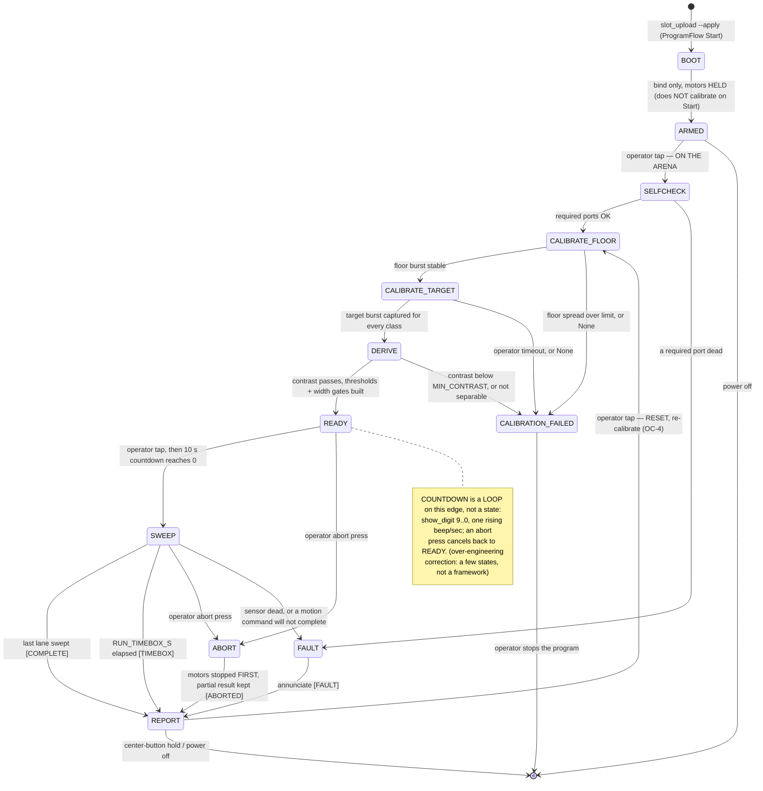

# Competition operations — run procedure, event telemetry, retargetable colour (2026-09-03)

**Type:** ACTIVE-SPEC. Operator-facing. **Nothing here has been run.** Every value is `[ASSUMED]`
until a bench run replaces it, and every call site is `[UNVERIFIED]` until it executes on our hub.

This is the **operations** design — how the robot is *deployed, started, stopped and read back*, and
what it logs. It does **not** re-specify movement or the mission algorithm: the run machine of record is
[mission-algorithm.md](./mission-algorithm.md) and [competition-program-design.md](./competition-program-design.md),
and this document **refines** that machine (adds an `ARMED` wait-state, a countdown edge, a reset
re-entry) rather than publishing a divergent copy. Where the two disagree, they are the authority on the
sweep and this file is the authority on the ceremony around it.

It answers the six operator requirements stated 2026-09-03:

1. Deploy: plug in USB → upload to a slot → unplug → the robot runs untethered.
2. Start: simple on-robot start — matrix cue, a button tap, a ~10 s countdown, then autonomous.
3. Stop: autonomous (done / time-box) and/or an operator stop, then reset to ready.
4. Retrieve: plug USB back in, pull **all** telemetry — filtered to **significant events**, which feed
   later SLAM / arena-mapping math.
5. Mine colour is **not fixed** — retargetable to any colour by config, not hard-coded to yellow.
6. BLE's larger purpose is offloading heavy calc (SLAM) to the laptop — **secondary** to a working
   autonomous PoC.

**Proven on hardware 2026-09-03 (build on this, do not re-derive):** a `.py` uploaded as the fixed
entry name `program.py` to a numbered slot over the LEGO control protocol (`hub_programmer/slot_upload.py`),
then `ProgramFlow Start`, **executes** — console prints stream back, motors drive. On-hub CSV log to
`/flash` + USB retrieval works (`src/hub_telemetry_log.py`, `download.py`). BLE negotiates MTU 517 and
the firmware pushes notifications with zero hub code, but **there is no host→motor command** — a program
must run on the hub to move. Deploy mechanism = upload a different file as `program.py` to a slot.

---

## Part 1 — Run procedure (CONOPS on the slot mechanism)

### 1.1 The one correctness rule that shapes everything

`slot_upload.py --apply` **always ends with `ProgramFlow Start`** — the program is running the instant
upload finishes. The authoritative machine runs `SELFCHECK → CALIBRATE_FLOOR` *before* `READY`, and
`CALIBRATE_FLOOR` **drives the robot slowly forward over the floor**. So if the program simply ran its
normal path on Start, an upload at the Programmer's bench would **drive the robot across the desk and
calibrate on it**, then time out to `CALIBRATION_FAILED` (`config.CALIBRATION_PROMPT_TIMEOUT_S = 30`).

**Fix — one added state, `ARMED`.** The first reachable state after `BOOT` is `ARMED`: motors held,
matrix showing the READY square, waiting for a button tap. Calibration begins **only on the on-arena
tap**. This makes "upload → unplug → carry to the arena → tap to begin" safe, and it is the minimal
change — one wait-state, not a framework. (Alternative: upload *without* auto-Start and launch the
stored slot from the hub — but the stored-slot launch button is `[UNVERIFIED]`, demo-day.md §6 A2, so
`ARMED` is primary.)

### 1.2 State machine (refines mission-algorithm.md — same names, three additions)

Added over the machine of record: **`ARMED`** (wait after upload), a **countdown loop on the
`READY → SWEEP` edge** (not a state), and a **`REPORT → CALIBRATE_FLOOR` reset re-entry**. State names
are unchanged — `ABORT` (not "aborted"), `CALIBRATE_FLOOR`/`CALIBRATE_TARGET`/`DERIVE` kept distinct so
`DERIVE`'s `separability_report()` / `event_width_gates()` can still fail the run loudly.



Terminal stop-reason labels are exactly `result.STATUS_COMPLETE / STATUS_TIMEBOX / STATUS_ABORTED /
STATUS_FAULT`, so `REPORT`'s status glyph comes straight from `result.STATUS_GLYPHS` with no new mapping.
`main.py` is one `runloop.run(main())` coroutine holding this machine.

### 1.3 Numbered operator procedure A–E

**A. DEPLOY (Programmer, at the bench, USB)**
- **A1** Host prereqs — `deploy-to-hub.md` §1: `./scripts/setup-host.sh`; `ls -l /dev/spike` is the
  symlink; `fuser -v /dev/spike` silent (close any SPIKE web tab).
- **A2** DRY RUN (opens no port, writes nothing): `./hub_programmer/slot_upload.py src/main.py --slot 0`
  — confirm the frame plan and that it uploads as name `program.py`.
- **A3** APPLY over USB: `./hub_programmer/slot_upload.py src/main.py --slot 0 --apply --listen 15` —
  the tool proves device UUID (aborts exit 2 on mismatch), `ClearSlot`, `StartFileUpload` (whole-file
  CRC32), chunk + per-chunk CRC, `ProgramFlow Start`. Confirm each response Acknowledged and the console
  shows the `ARMED` banner. **[T1 OPEN — see §1.5.]**
- **A4** VERIFY: matrix shows the READY square (`border` glyph); **motors are still** — the program is in
  `ARMED`, it has **not** calibrated or swept.
- **A5** UNPLUG USB.
- **A3′ fallback** if T1 fails (program dies on unplug): start untethered over BLE with no cable —
  `./hub_programmer/slot_upload.py src/main.py --slot 0 --ble --apply`.

**B. PROGRAM-SWAP** — re-run A2–A3 with a different file to **the same slot 0**; `slot_upload` issues
`ClearSlot` before upload so the old `program.py` is cleanly replaced. Keep a file→slot table in the
runbook (competition = `src/main.py` → slot 0). The operator ruled out an on-robot slot/program picker —
swap by re-upload, one slot.

**C. START (on the arena, no laptop — OC-2)**
- **C1** Operator taps LEFT or RIGHT once → leaves `ARMED`, runs `SELFCHECK`.
- **C2** `CALIBRATE_FLOOR` (drives slowly over bare arena floor) → `CALIBRATE_TARGET` (present a real
  mine and press; **this is how the colour is set — no code edit, see Part 3**) → `DERIVE`. Overlap or
  low contrast → `CALIBRATION_FAILED` (matrix `x`, falling tone). This is the arena calibration OC-4
  requires; it is **gated on OC-9** (may a sample mine be placed on the arena floor?).
- **C3** `READY`: matrix shows the READY square. Announce.
- **C4** Operator taps → a **~10 s countdown**: `show_digit` 9→0, one rising beep per second; an abort
  press cancels back to `READY`.
- **C5** At 0 → `SWEEP`, hands off (OC-1: the Builder is the only operator; nobody rescues it mid-run).

**D. STOP + RESET**
- **D1** Autonomous complete = every planned lane swept → `STATUS_COMPLETE`. Completion is **coverage,
  not a tally** — the mine count is unknown, so "done" means the plan was swept, not that N mines exist.
- **D2** Autonomous time-box = `config.RUN_TIMEBOX_S` elapsed → `STATUS_TIMEBOX`.
- **D3** Operator stop = a **side-button (LEFT/RIGHT) press** → `ABORT` → `STATUS_ABORTED` (AB1 soft
  abort). This is a **press, not a hold**: motors stop first, partial result kept. The hub's **centre
  button is the firmware's** hard stop of last resort (AB2, demo-day.md §6 A1) and is **not exposed to a
  program** (`hub_ui.button_pressed("center")` returns `None`) — do not build STOP on it and do not
  overload one button with tap-start + hold-stop on unverified millisecond discrimination.
- **D4** Any stop → motors off, telemetry log closed with its integrity trailer → `REPORT` cycling
  `result.display_pages()`, one beep per counted target.
- **D5** RESET: from `REPORT` a tap → `CALIBRATE_FLOOR` (a fresh attempt **re-calibrates** per OC-4). A
  centre-button hold / power-off ends it; **nothing persists** between runs (OC-5).

**E. RETRIEVE (Programmer, after the run — requirement 4)**
- **E1** ONLY after the program has stopped. `download.py` drives the REPL and sends Ctrl-C, which
  **kills a running slot program** — never run it while `SWEEP` or the `ARMED`/`READY` loop is live.
- **E2** Plug USB.
- **E3** `./hub_programmer/download.py --list`.
- **E4** `./hub_programmer/download.py --all` → `tmp/telemetry/`, each file verified by an on-hub sha256
  vs the host hash.
- **E5** The significant-event log is the **SLAM input**: each row carries pose (`encL/encR` + `yaw` at
  the event) so the laptop can reconstruct where each event happened (Part 2).

---

## Part 2 — Significant-event telemetry filter (requirement 4)

### 2.1 Definition — a pure predicate over the loop's own decisions

**A significant event is the moment the control loop's already-computed decision changes** — it is **not**
re-derived from raw samples. `detector.EdgeCounter.update()` already returns an accepted/rejected
`Event`; the state machine already owns `state`; `result` already owns the count. Re-running the counting
logic inside a telemetry filter would be a second, drifting copy. So the filter is a thin change-detector
over the loop's outcome, and `detector.py` stays the single source of truth (**cite, never duplicate**).

```
significant_event(prev, cur, event=None) -> (kind, reason) | None     # PURE, host-runnable
```

`prev`/`cur` are tiny record-views carrying `(seq, t_ms, state, count)`; `event` is the `Event` object
`EdgeCounter.update()` just returned (or `None`). It fires on **discrete change only**:

| kind | fires when | payload beyond pose |
|---|---|---|
| `EVT_DETECTION` | `event.accepted` is true (count incremented) | colour (Part 3) or UNKNOWN reason, peak, width |
| `EVT_REJECT` | `event` returned and `event.accepted` is false | `REJECT_TOO_NARROW` / `REJECT_TOO_WIDE`, peak, width |
| `EVT_STATE` | `cur.state != prev.state` (covers lane/turn, and the terminal `STATUS_*` row) | new state |

**Edge-trigger detections and rejects off the returned `event` object**, *not* off a level-comparison of
a "reject reason" field — a reject reason is present for one tick then clears, so a pure level comparator
would double-fire (`None→reason` and `reason→None`). Reading the `Event` fires exactly once per crossing.

**Implementable now:** `EVT_DETECTION`, `EVT_REJECT`, `EVT_STATE` — everything they need exists in
`detector.py` / `result.py`. **BLOCKED until their producing code lands:** `EVT_BOUNDARY` (needs
`BoundaryWatch`/`BoundaryTrip`), `EVT_FAULT` (needs `turn_slip()`/`disturbance()`/`HEALTH_*`),
`EVT_CALIB`. Those functions live only in the 2026-09-01 research briefs, **not in the tree** — spec
their rows now, add them when the functions exist. Do not present them as working.

### 2.2 Logging policy — events-only is the default, not a three-tier ring

The operator asked to **"log only significant events … a predicate, not a database."** So:

- **Default: `LOG_EVENTS_ONLY = True`.** One row per significant event to one `/flash` file
  (`run-events.csv`) via the proven `hub_telemetry_log.CsvLog`. No per-tick stream.
- **Optional (off by default): a low-rate pose heartbeat** — one pose row every `HEARTBEAT_MS` so SLAM
  has continuity across silent gaps. This is an **opt-in for map continuity**, not the baseline policy.
  A full-per-tick context ring dumped around each event is explicitly **out of scope** here — it is more
  machinery than the requirement asks for, and it supersedes competition-program-design.md §4.4's earlier
  "full record to a bounded ring buffer, dumped at REPORT": **event-only logging replaces that**; do not
  run two parallel telemetry strategies.

**Integrity for a sparse stream.** `telemetry.py`'s `seq`/`sum_seq`/`expected_sum_seq` trailer assumes
every formatted `seq` is written once, contiguously. That holds for an event log **only if `seq`
increments on *emitted* rows** — so the new `EventRecorder` advances `seq` only when it writes a row
(keeping `t_ms` for the clock). Then `n*(n-1)/2` still detects a truncated log, and there are no
"intentional drops" to misreport as loss. (This is why the existing `Recorder` is **reused verbatim for
the optional heartbeat file** only if that file is *not* also decimated; decimation and the contiguous
`sum_seq` check cannot both be true — pick one per file.)

### 2.3 Size reduction — dominated by not logging every tick

Full per-tick logging is `R_loop · b · T` bytes and **grows with run length**; an event log does **not
scale with tick count**, so the longer or faster the run, the larger the reduction.

`[COMPUTED]` on `[ASSUMED]` numbers — full-record `b ≈ 89 B` (telemetry-over-bluetooth.md §5, run through
LEGO's `cobs.py`, not estimated), event-row `b_evt ≈ 64 B`, `T = 300 s` (`RUN_TIMEBOX_S`), and an
`[ASSUMED]` loop rate of 20 Hz (**KU-M5: the loop rate is UNMEASURED** — `SAMPLE_RATE_HZ = 100` is the
sensor device spec, not the achieved tick rate):

- Full: `20 · 89 · 300 ≈ 534 KB`.
- Events-only (`N_evt ≈ 75` accepted+rejected+state rows): `75 · 64 ≈ 4.8 KB` → **~100×**.
- Events + a 1 Hz heartbeat: `+ 300 · 89 ≈ 27 KB` → `~32 KB` → **~17×**.

**Do not headline a single ratio** — the honest number rides on the unmeasured loop rate and the
unknown event count (both `[ASSUMED]`). The load-bearing, rate-independent claim is the qualitative one:
**events do not scale with tick count, per-tick logging does.** The two knobs are `LOG_EVENTS_ONLY` and
`HEARTBEAT_MS`.

### 2.4 Event schema and the minimal map it feeds

Each event row **is one (pose, observation) pair**. `POSE` = encoder-sourced `x_mm, y_mm` from
`odometry.Odometry` plus the gyro heading witness `heading_deg`, computed on-hub at emit time (the gyro
is a **heading witness, never integrated into x,y** — double-integrating milli-g drifts). `OBSERVATION`
= a typed payload for the kind (detection: colour/peak/width; reject: reason/peak/width; state: new
state). Keep the schema **as small as the vocabulary** — do not carry a separate top-level `lane` column;
a lane change is an `EVT_STATE` row.

```
EVENT_COLUMNS = ("seq","t_ms","kind","reason","x_mm","y_mm","heading_deg",
                 "peak","width","color","state")   # MISSING/empty for fields a kind does not carry
```

The **minimal map** these events enable (host-side, **not** SLAM — no loop closure, no covariance):

- **Mine map** = the `(x_mm, y_mm, color, seq)` of every `EVT_DETECTION`, de-duplicated by along-track
  local de-dup. (The de-dup `MineLedger` is **not in the tree yet** — mine-map dedup is forward/contingent.)
- **Arena rectangle** = the axis-aligned min/max of `EVT_BOUNDARY` crossings in one global yaw frame
  (single start-corner reset) — the **discovered** "10×10 area" when the units are still unknown. Under
  the current `BOUNDARY_MODE = "odometry"` there are no boundary crossings, so the rectangle **degrades
  to the assumed `ARENA_*` config**, not a measured extent. Which mode the mission uses is gated on
  professor Q3 and the units of "10×10".

Both maps are **dead-reckoned**, so they inherit the run's odometry drift (`WHEEL_DIAMETER_MM`,
`TRACK_WIDTH_MM` unmeasured, KU-M3/M9) — labelled honestly as dead-reckoned, not metric-true. This is
requirement 6's offload target, but the **PoC does not depend on it**: the map is computed on the laptop
from the pulled log, after the run.

---

## Part 3 — Retargetable mine colour (requirement 5)

### 3.1 It is already retargetable — name it, don't build a colour engine

A grep of `src/` finds **no `yellow` constant and no `TARGET_COLOUR`**. `calibration.calibrate()` already
derives the presence on/off thresholds from the **measured** floor-vs-target contrast (TR-4), and
`classify.build_classes()` already learns the target's chromaticity centroid from whatever burst is
shown. Both are learned at run start, so **"retarget to any colour" is already "present a different
sample," not a code edit.** The minimal, honest move adds only two things.

### 3.2 One label knob, keyed so the report agrees with itself

Add `config.TARGET_COLOUR_NAME = "yellow"` (`[ASSUMED]` — the briefing hedged "I think yellow"; this is a
**label**, the signature is learned). Then **set `config.CLASSES = (config.TARGET_COLOUR_NAME,)`** so the
class name *is* the label, and have the runner call `result.add_detection(color=config.TARGET_COLOUR_NAME)`.

**Why the keying matters (a real bug otherwise).** `result.display_pages()` — the Demo Day class page the
Builder reads aloud — looks up `by_color.get(name, 0)` where `name` iterates `config.CLASSES`. If
detections were keyed by `"yellow"` while `CLASSES` stayed `("target",)`, the class page would show **0**
while `describe()` (which iterates `by_color` directly) showed `yellow=N` — the two reports disagree.
Making `CLASSES` and the `add_detection` key the **same string** is what keeps "zero report-code change"
true. `CLASS_GLYPHS` stays length 1 (still exactly one target class), so the IndexError guard is untouched.

Retarget procedure = the **existing** `CALIBRATE_FLOOR → CALIBRATE_TARGET → DERIVE` ritual (no new
states, no new operator action): edit `TARGET_COLOUR_NAME`, and present the new colour's sample at C2.

### 3.3 Saturation fallback — presence-only + UNKNOWN, never a forced class

Glossy surfaces pin g/b at the sensor ceiling and collapse hue (colour-first-look-2026-09-01, MEASURED
on substitute cards). If the presented mine reads specular, its learned chromaticity is untrustworthy —
so classification returns `None` + a reason through the **existing** `classify()` UNKNOWN path, and the
mine is still **counted by reflection contrast** (the mission-critical layer; classification is a layer
on top, CONOPS OS-4). This is exactly "fall back to UNKNOWN and use reflection, not force a class."

**Honesty note:** the two-axis *specular pre-gate* (`classify_2axis`/`saturated`) named in
detection-odometry-coverage-2026-09-01 §A **does not exist in `classify.py` yet** (it has only
`build_classes`/`classify`/`separability_report`). Until it lands, the fallback is the plain UNKNOWN path
above; do not claim the pre-gate as working.

### 3.4 Log the learned signature as run context (no code change)

`telemetry.header_lines(**context)` already accepts arbitrary context. Pass the learned signature —
`target_name, target_cx, target_cy, floor_level, target_level, contrast, polarity` — into the header so
the run is **auditable and reproducible** ("record the measurement, not the conclusion"). This needs
**no code change**; the runner passes the values `calibrate()` and `build_classes()` already produce.

### 3.5 Deliberately NOT built (contingent on open questions)

- **`TARGET_COLOUR_HINT` + `TARGET_HINT_TOLERANCE` + `check_target_signature()`** — a sanity-check gate is
  largely **redundant**: `calibrate()` already raises `CalibrationError` on low contrast / SNR (catches
  "showed the floor twice"), and `separability_report()` already fails non-separable classes loudly.
  Adding a new `[ASSUMED]` measured tolerance to re-catch what is already refused is over-engineering.
  The *only* non-redundant job a hint has is **seeding the target band when no physical sample may be
  placed** — which is **gated on OC-9 / professor Q9** (may a sample mine be placed on the arena floor at
  all?). Keep `TARGET_COLOUR_HINT` as a **contingent future seed only if OC-9 says "no sample,"** not a
  landed feature. (And note: seeding a `ColorClass` from a bare `(r_n, g_n)` hint is **new code** — a hint
  has no spread, so a synthetic sigma must be assumed; it is not free reuse of `build_classes()`.)
- **Per-sensor learned-centroid disagreement flag** — premature; the two sensors are unmeasured on the
  arena floor, and it reused one tolerance for two physically different distances. Drop until measured.
- **Multi-colour decoys** — gated on professor Q5. More than one target class reopens the
  `CLASS_GLYPHS` length-1 constraint in `result.py`; out of scope until Q5 is answered.

---

## Open bench tests (all `[UNVERIFIED]` — settle before Demo Day)

Ordered by how much they gate the design.

1. **T1 — THE untethered question (single go/no-go):** *does a slot program keep running after USB is
   unplugged?* Upload a blink/slow-spin program, `ProgramFlow Start` over USB, **pull the cable, observe.**
   Fail → the untethered start must go over BLE (`slot_upload --ble --apply`, procedure A3′) — a procedure
   swap, not a redesign. **This is the single most load-bearing untested assumption in this document.**
2. **Slot persistence across a power cycle** — does a stored slot survive power-off, and can it be
   (re)started without USB? (`/flash/main.py` does not autorun — KU-M16; OC-5 assumes reload each class.)
3. **The whole slot upload+start sequence is UNRUN on our hub** (telemetry-while-driving U-3). Prove
   `slot_upload` over USB first; file the transcript under `docs/findings/runs/`. And: can a slot program
   `open()`/append a `/flash` file at acceptable per-tick latency (U-11)? If not, the log-primary policy
   falls back to a bounded RAM buffer dumped at `REPORT`.
4. **`ARMED` + button + matrix path** — `hub.button.pressed` and `hub.light_matrix` call sites are
   UNVERIFIED (never run). Bench the tap-to-arm, the tap-to-start, the countdown, and the abort press.
   **Edge-detect the press in `main.py`** (was-not→is-pressed) so one long press does not cascade through
   states; `hub_ui.button_pressed` returns `True` while held. **No `button_hold_ms` is needed** — STOP is
   a press (AB1), not a hold, so tap-vs-hold ms discrimination is not on the critical path.
5. **Does an unawaited SPIKE-3 `sound.beep()` actually sound, and stay separable rising vs falling?**
   (U-17.) The per-second countdown beep and per-target tally beep depend on it (hub_ui.py note).
6. **`download.py` Ctrl-C is lethal to the `ARMED`/`READY`/`SWEEP` loop** — confirm the loop is genuinely
   stopped before the cable goes in for retrieve (E1). Documented; verify once.
7. **Retarget on real notes** — MEASURE the learned chromaticity of the *actual* (possibly non-yellow)
   mine and the *actual* arena floor at the built sensor height, under arena lighting. Confirm
   `calibrate()` derives the band from a presented sample and that presence-count still fires when the
   note reads specular. Every threshold stays `[ASSUMED]` until this run.

---

## RECOMMENDED CHANGES to other files (do NOT edit them here — recommend only)

This document creates only itself. Each change below is owned by a later write task and is scoped so no
two tasks touch the same lines.

| File | Recommended change |
|---|---|
| `src/main.py` (create — unwritten by design) | Implement `async def main()` as one `runloop.run(main())` coroutine holding the §1.2 machine: **add the `ARMED` wait-state** as the first reachable state after `BOOT` (motors held, `border` glyph, tap to proceed), the **countdown loop** on the `READY → SWEEP` edge, and the `REPORT → CALIBRATE_FLOOR` reset. Reuse `config/calibration/detector/classify/sweep/odometry/result/telemetry/motion_tuning/hub_*` — add no framework. Edge-detect button presses. Wire terminal `STATUS_*` from `result.py`. **Do not duplicate** mission-algorithm.md / competition-program-design.md — refine them. |
| `docs/runbooks/competition-run.md` (create) | Hold the numbered A–E procedure and the file→slot table (competition = `src/main.py` → slot 0). Cross-link `deploy-to-hub.md` §9a (the slot route) and `conops.md`; do not duplicate conops.md's higher-level content. |
| `src/config.py` (recommend) | Add `COUNTDOWN_S = 10`, `START_SLOT = 0`, `TARGET_COLOUR_NAME = "yellow"` (`[ASSUMED]`, label), `HEARTBEAT_MS`, `LOG_EVENTS_ONLY = True`, `TELEMETRY_LIVE_ENABLED = False`. **Set `CLASSES = (TARGET_COLOUR_NAME,)`** so the class name is the label. `RUN_TIMEBOX_S` already exists. **Do not** add `HOLD_STOP_MS` or `TARGET_HINT_TOLERANCE` (dropped as over-engineering, §3.5). |
| `src/telemetry.py` (recommend, PURE) | Add `EVENT_COLUMNS`, the `EVT_DETECTION/EVT_REJECT/EVT_STATE` string constants, `significant_event(prev, cur, event=None)` (edge-triggered off the returned `Event`), `event_line(...)`, and `class EventRecorder` whose `seq` advances **only on emitted rows** (keeps the `sum_seq` trailer honest for a sparse stream). MicroPython subset; "None writes empty, never 0." Keep the v2 `COLUMNS` wire format unchanged. |
| `src/result.py` (recommend, no structural change) | Runner keys detections by `config.TARGET_COLOUR_NAME`, which equals the `config.CLASSES` entry (§3.2). `CLASS_GLYPHS` and the `detected == classified + unknown` invariant untouched. |
| `src/hub_ui.py` (recommend — likely **no change**) | `button_pressed` and the `border` READY glyph already suffice; STOP is a press, not a hold, so **no `button_hold_ms` twin**. Do **not** invent an `s` glyph — `border` is the READY square (mission-algorithm vocabulary, demo-day.md §5). |
| `data_analysis/events.py` (create — host-only, outside `src/`) | `load_events(path)`, `mine_map(events)` (de-dup **contingent** on a future `detector.MineLedger`), `arena_rectangle(events)`. Sibling to the fusion brief's planned `data_analysis/motion.py`. Rebuilds poses from the log with `odometry.degrees_to_mm`/`normalize_angle`. |
| `docs/plans/competition-program-design.md` (**do not edit** — cross-reference) | This is the concrete filling of its §4.4 telemetry slot: event-only logging **supersedes** its "full record to a bounded ring dumped at REPORT." Note the seam in a future update owned by that file's task, not this one. |
