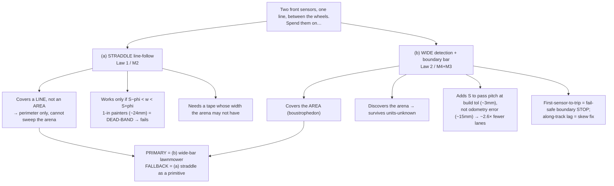
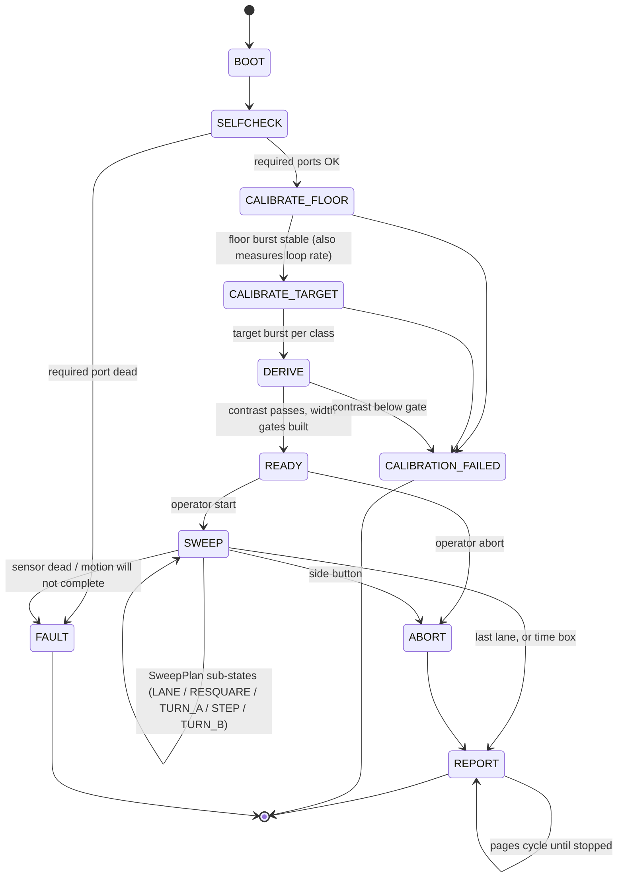
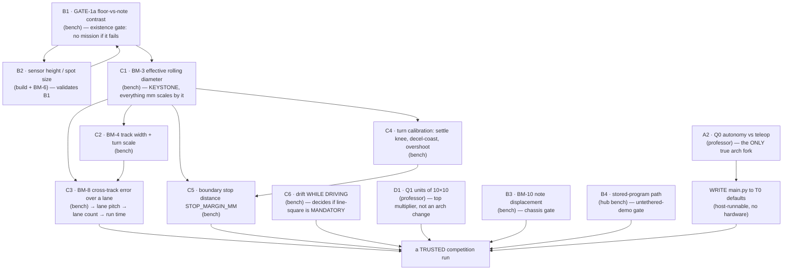
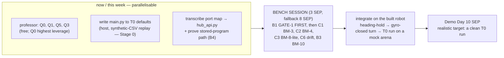

# Competition Program — the DECISION, and the readiness checklist to `main.py` · 2026-09-03

> **Type:** DECISION + READINESS (tactical plan) · **Created:** 2026-09-03 · **Owner:** the **Programmer**
> **Decides:** *what program the robot runs at competition*, and *what still has to be measured or answered
> before `src/main.py` can be written and trusted.*
> **Synthesises, never duplicates:**
> [competition-movement-options-2026-09-03.md](./competition-movement-options-2026-09-03.md) (modes M0–M5),
> [movement-control-laws-2026-09-03.md](./movement-control-laws-2026-09-03.md) (Law 1 straddle / Law 2
> lawnmower), [competition-program-design.md](./competition-program-design.md) (the run machine bound to the
> two-sensor chassis), [mission-algorithm.md](./mission-algorithm.md) (the state machine + tick of record),
> [../research/detection-odometry-coverage-2026-09-01.md](../research/detection-odometry-coverage-2026-09-01.md),
> [../research/odometry-fusion-and-health-2026-09-01.md](../research/odometry-fusion-and-health-2026-09-01.md).
> **Numbers land in:** [bench-measurement-plan.md](./bench-measurement-plan.md).

**This document writes only itself.** It applies no code and edits no other file. Where it says "reuse X"
or "bind Y", that is a pointer into a doc that already owns the detail — this is the decision layer on top,
not a rewrite of the layer below. `src/main.py` stays deliberately unwritten; this specifies it, it does
not write it.

**Nothing in the competition program has run on a mission surface.** Every physical magnitude below is
`[UNVERIFIED]` and every threshold `[ASSUMED]` unless it cites a measurement that exists. The whole design
obeys one rule: **an answer or a bench number changes a VALUE in `config.py`, never a STATE in the machine
or a MODULE in the tree.** The readiness checklist (§3) is built so you can see, per item, whether that rule
holds — and for all but one item it does.

---

## BLUF — the decision

The competition program is a **corner-start odometry BOUSTROPHEDON ("lawnmower") sweep**, and the two front
colour sensors are used as a **wide detection-and-boundary bar**, *not* as a line-straddle follower.
Straddle line-following (Law 1 / M2) is kept only as a **secondary primitive and degraded fallback**, and
even that role is gated on a tape width the arena may not have. The program is written **once**, to the
narrowest defensible reading, with three **degradation tiers** selected by config flags — so a clarified
answer or a failed bench gate drops a tier, it does not rewrite the machine.

**The honest state of play:** the *design* is essentially complete and internally consistent. The *hardware
truth it rests on is at zero* — no diameter, no track, no turn calibration, no drift-while-driving, and no
GATE-1 optical burst on the real notes/tape/floor has been taken. `main.py`'s **structure is not blocked**
and can be written today; what is blocked is a **trusted** competition run, and the critical path to that is
one bench session plus one professor answer (units) plus the stored-program proof — against a 10 SEP
Demo Day (§5).

---

## 1. The key design tension, resolved: wide-bar lawnmower over line-straddle

Two down-facing colour sensors sit on one rigid line across the **front, between the wheels** (C = LEFT,
D = RIGHT, `device.id` 61, matched pair, MEASURED 2026-09-03). That geometry can be spent two ways:

- **(a) STRADDLE / line-follow** — keep a boundary-tape line in the gap between C and D and steer on
  `error = left_presence − right_presence` (Law 1 / M2).
- **(b) WIDE DETECTION + BOUNDARY BAR** — the pair widens the detection swath, *discovers* the arena
  rectangle by detecting boundary tape, and yields a two-sensor along-track skew cue for per-lane
  line-squaring, all feeding a corner-start odometry lawnmower (Law 2 / M4+M3).

**Recommendation: (b) the wide-bar corner-start lawnmower is the PRIMARY competition approach.** The reasons
are decisive and ordered by weight:

1. **The mission is AREA coverage; straddle is a PERIMETER/path primitive.** "Find *all* the mines in a
   10×10 area" is a coverage-path-planning problem. A line-straddle follower rides *one* line; boundary
   following covers only the perimeter ring (Gabriely & Rimon STC, coverage brief §C.1). Straddle **cannot
   sweep an area by itself** — that alone disqualifies it as the primary approach. Boustrophedon is the
   pattern the literature prescribes for a robot with no global localization, and it is what `sweep.py`
   already builds.

2. **Straddle's viability is gated on a tape the arena may not have.** The straddle error signal only exists
   in the band `S − phi < w < S + phi` (movement-control-laws §1.1). At the nominal `S≈57 mm`, `phi≈12 mm`
   the workable window is `45 < w < 69 mm`. **Blue painters tape is typically 1-inch (~24 mm) → DEAD-BAND →
   the line vanishes between the spots and the controller limit-cycles.** The tape type is **unresolved**
   (blue painters OR silver/grey duct), so straddle might not even work as a *perimeter* primitive.

3. **The lawnmower survives the top blocker — the unknown units of "10×10".** Law 2 builds the arena
   rectangle from four *detected* edges (near/far-Y from the first lane, near/far-X from the steps). The
   counts it runs on — lane index, "did we hit tape" — are **diameter-free and units-free**. The units
   answer moves the creep-on-approach band (a value), it does not change a state. The robot measures the
   arena instead of being told its size.

4. **The wide bar is strictly the better use of the same two sensors.** It buys ~2.6× fewer lanes (less
   cumulative turn drift), a fail-safe "leading corner stops first" boundary trip, AND the along-track lag
   `skew = atan(dS/S)` — the **only candidate absolute heading reference in a wall-less arena** (coverage
   brief §C.1-6). One pair of sensors serves detection swath + boundary discovery + heading fix + fail-safe
   stop. Straddle spends the pair on steering one line and gets none of that.

5. **It is the architecture the repo already builds.** `SweepPlan`, `Odometry`, `EdgeCounter`,
   `MissionResult`, the mission-algorithm state machine, the two-sensor bindings in
   competition-program-design — all of it targets the lawnmower. Making straddle primary would introduce a
   new primary control mode for a job (area coverage) it structurally cannot do.

**Fallback role for straddle (Law 1 / M2), kept but subordinate:**
- **(a) the RESQUARE edge-ride** — *if and only if* the real tape width lands in the workable band, the
  `RESQUARE` step may ride the boundary edge under `line_straddle_pair` for a short controlled distance to
  sharpen the per-lane heading fix. If the tape is out of band, `RESQUARE` uses the discrete two-sensor
  skew fix (crossing-lag) instead, which needs no straddle.
- **(b) a degraded perimeter-follow coverage mode** — only if odometry drift proves too large at the
  measured scale to hold lanes at all (a Group-C6 outcome). This is a last resort, not a plan.

Both the primary and the fallback depend on the **same three unmeasured optical/geometry numbers** — the
sensor spacing `S`, the spot size `phi`, and the real tape width + separability. That shared gate (GATE-1 +
sensor-bar geometry) is the single highest-leverage bench action for the whole program (§3, B1/B2).

---

## 2. What the competition program IS — structure, by reference, in three tiers

The program is the **mission-algorithm state machine, unchanged**, bound to the two-sensor chassis by
competition-program-design, executing the **Law 2** lane law. No new states are introduced by this decision;
the primary-approach choice binds *handlers*, not *states*.

**Per-tick order:** reuse mission-algorithm §"Main loop" (11 steps), with the two-sensor supersedes from
competition-program-design §3 folded in — do not re-derive them here:
- **two `detector.EdgeCounter` instances** (one per sensor), single `rgbi` LPF2 mode all run, presence from
  channel `[3]`; a mine seen by **either** sensor counts (§3.2).
- **`detector.MineLedger`** removes cross-sensor and adjacent-pass duplicates (§3.3); beep/flash only on a
  NEW mine.
- **`detector.BoundaryWatch`** (rising-edge) runs on the approach band, first-sensor-to-trip fires the
  fail-safe STOP; `skew_deg_from_crossings` feeds `RESQUARE` and the record (coverage brief §D.3).
- motion is **gyro heading-hold** on straights (`odometry.heading_hold_pair`) and **gyro-closed, profiled,
  settle-and-verify** turns (odometry-fusion §1.3–1.4); the caster scrubs, so turns never close on encoder
  geometry, and G1 is evaluated on straights only.

### The three degradation tiers — one machine, selected by config flags

The tiers exist so there is **always a demonstrable run**, and so a failed gate drops a tier instead of
rewriting the program. This is what makes it safe to write `main.py` before the bench session lands.

| Tier | Coverage | Boundary | Heading fix | Detection | Needs (beyond Tier 0) |
|---|---|---|---|---|---|
| **T0 — guaranteed** | fixed lane count, gyro heading-hold | **odometry rectangle only** (`BOUNDARY_MODE="odometry"`, degraded mode B1) | none (open-loop per lane) | two EdgeCounters, **presence-only** | — |
| **T1 — target** | discovered rectangle (Law 2 §2.4) | **boundary-tape detection** (`BOUNDARY_MODE="tape"`, `BoundaryWatch` + creep-on-approach) | none | + `too_wide`→boundary routing | GATE-1 tape separability (B1) + stop-distance bench (C5) |
| **T2 — stretch** | as T1 | as T1 | **per-lane two-sensor line-square** (`RESQUARE` bound to skew fix) | as T1, optionally classified | skew-accuracy bench (Law 2 §2.7) + drift-while-driving verdict (C6) |

`BOUNDARY_MODE`, `CLASSES`, and a `LINE_SQUARE_ENABLED` flag select the tier. **The default is T0 with
`CLASSES=("target",)` — presence-only, odometry boundary, no line-square** — which is the narrowest
defensible reading of the briefing and the realistic Demo Day target (§5). Everything above it is additive.

---

## 3. The readiness checklist — from here to a trustworthy `main.py`

Read this as a dependency graph, not a wish list: each item states **what it changes**, **whether it blocks
the ARCHITECTURE or is a TUNING value**, and **the bench test or question that closes it.**

### Group A — Architecture decisions (change a STATE / MODULE / whether a subsystem exists)

These are the only items that could touch the *shape* of `main.py`. All but one are already defaulted, so
**none of them actually block writing the structure** — they are written as flags with safe defaults.

| # | Item | What it changes | Blocks arch? | Closed by | Default (write to this) |
|---|---|---|---|---|---|
| **A1** | Primary approach: straddle vs wide-bar lawnmower | which handlers bind to `SweepPlan`/`RESQUARE` | **Was the one open arch choice — DECIDED here (§1): wide-bar lawnmower.** | this doc | lawnmower |
| **A2** | **Q0 — must it be autonomous, or may a human drive?** | if teleop: delete sweep / odometry / heading-hold entirely | **YES — the only true remaining fork** | **professor Q0** | **autonomy** (a teleop answer only DELETES work, never invalidates structure — so building autonomous is the safe path) |
| **A3** | Q5 — decoy colours / classification | toggles the `classify.py` subsystem + RGB buffer + speed ceiling; length of `CLASSES` | no (a value that toggles a module; states unchanged) | professor Q5 + GATE-1b separability | **presence-only, `CLASSES=("target",)`** |
| **A4** | Q3 / tape separability — boundary mode | selects the lane-end rule (`BOUNDARY_MODE`), i.e. which TIER is reachable | no (a value; T0 works regardless) | professor Q3 + GATE-1 tape (B1) | **`"odometry"` (T0)** |

**Finding:** `main.py`'s **structure is unblocked**. A1 is decided; A2 defaults safely; A3/A4 are config
flags. Write the machine now to the T0 defaults (Stage 0, host-runnable against a synthetic CSV — no
hardware, no answers required).

### Group B — Existence gates (pass/fail; a failure is a project event, not a tuning knob)

| # | Item | Consequence of FAIL | Closed by |
|---|---|---|---|
| **B1** | **GATE-1a — floor-vs-note reflected-light contrast on the REAL floor at the built height** | *the robot cannot see the mine* — no code fixes it; escalate note colour / floor / height to the professor **before** Demo Day week | bench: GATE-1 optical burst (BM-0a) on the real note pack. Also captures **GATE-1b** tape separability (drives T1) and the tape polarity (two-sided `BOUNDARY_DEVIATION_MIN`) |
| **B2** | **Sensor mount height + spot size `phi`** | a high mount bloats the spot and voids every B1/contrast number; sets straddle-fallback geometry | build (lower to ~16 mm if needed) + BM-6 spot size |
| **B3** | **BM-10 — does the robot displace the notes it drives over?** | chassis redesign — catastrophic to find late | bench: photograph one lane over placed notes |
| **B4** | **Stored-program path** — `/flash/main.py` does not autorun; `slot_upload.py --apply` is unproven on our hub | no untethered demo (course needs "one program, one press, no laptop") | hub bench: `slot_upload.py <demo>.py --slot N --apply`, then unplug the laptop |

### Group C — Scaling / trust gates (dependency-ordered; a lane cannot be commanded in mm and trusted until these land)

| # | Item | What it feeds | Blocks arch? | Closed by |
|---|---|---|---|---|
| **C1** | **BM-3 effective rolling diameter** (under load, per surface — NOT the moulded 63.5 mm) | `WHEEL_DIAMETER_MM` → every mm in `odometry.py` → lane length, pass pitch, stop band. **Keystone: nothing has units without it.** | no — a scaling value | bench: 5 fwd + 1 rev straight, median, spread ≤ 2% |
| **C2** | **BM-4 track width + `TURN_ENC_SCALE`/`K_YAW`** from a closing spin (regression, not a ruler) | `TRACK_WIDTH_MM` (straight cross-check), `TURN_ENC_SCALE` (G1 suppression + degraded turn) | no — a value | bench: 3 CW + 3 CCW logged spins (turn scale is diameter-free) |
| **C3** | **BM-8 cross-track error over a real lane** at speed, both directions | `CROSS_TRACK_ERROR_MM` → `lane_pitch_mm()` → `lane_count()` → **the whole run-time budget** | no — a value (but the biggest multiplier after units) | bench: 3 trials/direction over the full lane (needs C1, C2) |
| **C4** | **Turn calibration** — `TURN_SETTLE_MS` knee, **decel-coast in enc-deg** (no datum exists — the ~9° figure is a *startup* shortfall, not a coast), overshoot vs cruise dps | the gyro-closed profiled turn (`plan_turn`, `turn_speed_profile`) | no — values | bench: log yaw @20 ms ×1 s post-stop; overshoot at 100/200/300/500 dps CW+CCW |
| **C5** | **Boundary stop distance `STOP_MARGIN_MM`** = p95(coast) + v·latency + guard | the creep-on-approach + active-brake stop that keeps the robot in a wall-less arena (T1) | no — a value; verify diameter-free in enc-deg | bench: measure decel-coast at TRAVERSE and CREEP dps (KU-M13), together with the sensor forward offset |
| **C6** | **Drift WHILE DRIVING** (motors on, vibration, caster scrub) — the stationary 0.0033 deg/s figure is bare-hub best-case | decides whether long lanes hold on gyro alone → whether **per-lane line-square (T2) is MANDATORY or optional** at the answered units scale | no — but it is the T2 trigger | bench: extended BM-9 with motors on; a half-speed lane separates deg/m (diameter) from deg/s (bias) |

### Group D — The top multiplier (a value, not an architecture change)

| # | Item | What it swings | Blocks arch? | Closed by |
|---|---|---|---|---|
| **D1** | **Q1 — units of "10×10" (feet / metres / tiles)** | lane count, path length, run time (8–23 min at 10 ft), the `r_max = 2ev/L²` heading budget (~170× across units), whether the run fits the slot, and — with C6 — whether T2 line-square is mandatory | **no** — the lawnmower discovers the arena; units set `ARENA_*_MM` values and the creep band | **professor Q1** (default: sweep as many lanes as fit the time box, report `lanes_completed` honestly) |

### Group E — Pure tuning values (parameterize now, close by replay or at-run-start; never block `main.py`)

Loop rate `SAMPLE_RATE_HZ` (**self-correcting — measured free at every run start**, BM-5), the width gates,
`HYSTERESIS_FRACTION`, `MIN_DWELL_SAMPLES`, `DEDUP_RADIUS_MM`, heading gains `HEADING_KP/KI`, sensor spacing
`SENSOR_SPACING_MM` (Designer choice + measure the built value — do **not** pin to the validity edge),
`BAR_SPACING_TOLERANCE_MM`, the Group-N/D fault floors, `REPORT_PAGE_DWELL_MS`, `BEEP_MS`. Each has a safe
seed in `config.py` and is closed by replaying recorded runs or by the at-run-start measurement — none of
them gate writing or structurally trusting the program.

---

## 4. The honest architecture-vs-tuning split

The instinctive worry — "we can't write `main.py` until we measure everything" — is **wrong**, and the
readiness table is built to show why:

- **Exactly ONE item can change the architecture: A2 (Q0 autonomy vs teleop)** — and it defaults safely to
  autonomy, because a "human may drive" answer only *deletes* subsystems, it never invalidates the ones
  built. A1 (straddle vs lawnmower) *was* the other architecture choice; it is **decided here**.
- **Everything else is a VALUE or a PASS/FAIL gate, not a state.** Diameter, track, cross-track, turn
  calibration, stop distance, units, tape mode, classification — every one changes a number in `config.py`
  or flips a tier flag. That is commitment 6 holding across the whole design.
- So the split the task asks for comes out lopsided *by design*: **the structure is unblocked; the trust is
  blocked.** `main.py` can be written now (Stage 0, host-runnable). What the measurements buy is a *run you
  can believe*, and a *tier you can reach* — not a program you can compile.

The two genuine project-level risks are not architecture at all: **B1 (GATE-1a) failing** (the robot cannot
see the mine) and **B3 (BM-10)** (the robot shoves the mines). Both are pass/fail, both are cheap to run,
and both must be run before any tuning is worth doing.

---

## 5. How close are we, and the critical path to Demo Day (10 SEP)

**Design: ~complete and consistent.** The state machine, the two-sensor bindings, the Law 2 lane law, the
fault/health layer, and the new function signatures are all specified across the cited docs and agree with
each other and with the source. **Hardware truth: at zero.** No BM-3/4/8, no turn calibration, no
drift-while-driving, no GATE-1 on real surfaces, `main.py` unwritten, the stored-program path unproven, and
`src/hub_api.py` port constants still `None` (the hardware layer fails loud until transcribed).

Today is **3 SEP**; Demo Day is **10 SEP** — **7 days**. Critical path:

- **The bench session is the bottleneck.** Without **C1 (BM-3)** nothing has units; without **B1 (GATE-1a)**
  there is nothing to sweep for. Run GATE-1 *first* — if it fails, the session converts to "try another
  surface/height/note colour and escalate the same day," and everything downstream is moot until it passes.
- **`main.py` can be written in parallel, today, with no hardware** — Stage 0 exercises the whole state
  machine and the None-guards against a synthetic CSV. Do not wait on the bench to start it.
- **The stored-program proof (B4) is independent** of the algorithm and gates whether the demo can run
  untethered — do it early, not on the day.

**Realistic Demo Day target: a clean Tier-0 run** — odometry-only boustrophedon, presence-only detection,
odometry-rectangle boundary with the B1 fail-safe, honest `lanes_completed / lanes_planned`. **Tier 1**
(boundary tape) is a stretch gated on GATE-1b tape separability + the stop-distance bench; **Tier 2**
(line-square) is a further stretch gated on the skew-accuracy bench and the drift-while-driving verdict. A
partial sweep with an honest denominator beats a full sweep that never finishes — and beats a T2 program
that was never measured enough to trust.

---

## 6. What `main.py` needs that does not exist yet (consolidated, by reference)

These are already enumerated with signatures in the cited docs; listed here so the Programmer has the whole
gap in one place. **All host-testable pieces stay pure so `check-docs.py` stays green.**

- **`config.py`** — the drivetrain-control, two-sensor-sweep, turn-profile, stop-margin, heading-hold, and
  Group N/S/D blocks; `pass_pitch_mm(spacing_mm=None)` (raises past the within-pass limit), `pass_count()`;
  the tier flags `BOUNDARY_MODE`, `CLASSES`, `LINE_SQUARE_ENABLED`. Keep `CLASSES=("target",)`.
- **`odometry.py`** — `heading_error_deg`, `steering_to_tank`/`heading_hold_pair`, `turn_speed_profile`,
  `plan_turn`, `encoder_turn_to_body_deg`, `turn_converged`, `stop_margin_mm`, `line_straddle_pair` (the
  fallback primitive), the fault helpers (`turn_slip`, `disturbance`, `derive_fault_tuning`).
- **`detector.py`** — `Event.mid_index`, `MineLedger` (`add_sighting`/`count`), `skew_deg_from_crossings`,
  `saturated`/`saturation_count`, `BoundaryWatch`/`BoundaryTrip`, `straddle_error`/`straddle_deviations`.
- **`classify.py`** — `is_boundary`; the 2-axis specular gate (`classify_2axis`, `separability_2axis`) **only
  if Q5 turns classification on**.
- **`result.py`** — `add_boundary`/`boundary_hits`, `skew_deg`, `set_status`, `display_pages`.
- **`hub_color.py` / `hub_api.py`** — per-side readers `read_reflection/read_rgb/read_color(side)`;
  `COLOR_PORT`/`SECOND_COLOR_PORT` already name C/D — transcribe the confirmed constants (they are `None`).
- **`sweep.py`** — bind `CMD_RESQUARE` to the skew fix, `STEP` to `pass_pitch_mm(S)`, add the
  boundary-triggered lane end and the online `x_far`/`y_far` mapping.
- **`src/main.py`** — the state machine, the tick, the heading-hold/turn executors, and the tier wiring.
  Written from mission-algorithm + competition-program-design; imports the `hub_*` modules only.
- **`examples/line_follow.py`, `examples/turn_to_heading.py`** — HUB-FACING bench-first executors, output
  filed under `docs/findings/runs/` before becoming mission code (ADR-0005). **Not this task.**

---

## 7. Recommended changes to other files (NOT applied — collision safety)

This document edits nothing but itself. These are the follow-ups it implies:

| File | Change | Why |
|---|---|---|
| [./INDEX.md](./INDEX.md) | add a row for this doc | INDEX coverage (`check-docs.py` enforces it); this task may write only one file, so the row is owed |
| `scripts/check-docs.py` | run it after this doc lands (links · INDEX · purity boundary) | the standing guard; ADR-0005 leaves it the only check |
| [../../src/config.py](../../src/config.py) | add the tier flags `BOUNDARY_MODE` (already present, extend to `"tape"`), `LINE_SQUARE_ENABLED`; the blocks listed in §6 | the tiers are selected by values, per commitment 6 |
| [./next-session.md](./next-session.md) · [../todo.md](../todo.md) | fold in the tier target (T0 = Demo Day goal) and the critical path (§5) | keep the SSOT aligned with the decision |
| [./questions-for-the-professor.md](./questions-for-the-professor.md) | keep **Q0 first** (autonomy), then Q1/Q3/Q5 — Q0 is the only architecture fork left | §3 Group A/D |

The deeper source changes (the new signatures in §6) are already collected in the recommended-changes tables
of competition-program-design §7, movement-control-laws, and the two research briefs — this doc does not
restate them, it points at them.

---

## Sources

- This repo, read 2026-09-03: `competition-movement-options-2026-09-03.md` (M0–M5, corner-start ritual,
  test ladder T1–T6); `movement-control-laws-2026-09-03.md` (Law 1 straddle geometry gate `S−phi<w<S+phi`,
  Law 2 corner-start lawnmower + online rectangle discovery, "Law 2 design of record, Law 1 primitive");
  `competition-program-design.md` (two-sensor bindings, `pass_pitch`, `MineLedger`, sound-first panel,
  new signatures); `mission-algorithm.md` (BOOT→…→REPORT state machine, 11-step tick, degraded modes,
  parameter table, build stages); `detection-odometry-coverage-2026-09-01.md` §C (pass pitch, `r_max`,
  one-global-yaw-frame, line-squaring as the only candidate absolute reference) §D (`BoundaryWatch`,
  creep-on-approach, two-sided `BOUNDARY_DEVIATION_MIN`, B1 backstop); `odometry-fusion-and-health-2026-09-01.md`
  (applied mirror signs, `heading_hold_pair`, `turn_speed_profile`/`plan_turn`, fault helpers, the
  no-coast-datum correction); `bench-measurement-plan.md` (BM-0..BM-10, dependency order, BM-3 keystone,
  the movement-tuning sidecar outputs); `src/config.py`, `src/sweep.py`, `src/odometry.py`, `src/detector.py`,
  `src/result.py`, `src/classify.py`, `src/calibration.py`, `src/motion_tuning.py`, `src/hub_api.py`,
  `src/hub_color.py`, `src/hub_motors.py` (the code every binding maps onto); `docs/todo.md` (current state,
  Q0, the three real blockers).
</content>
</invoke>
