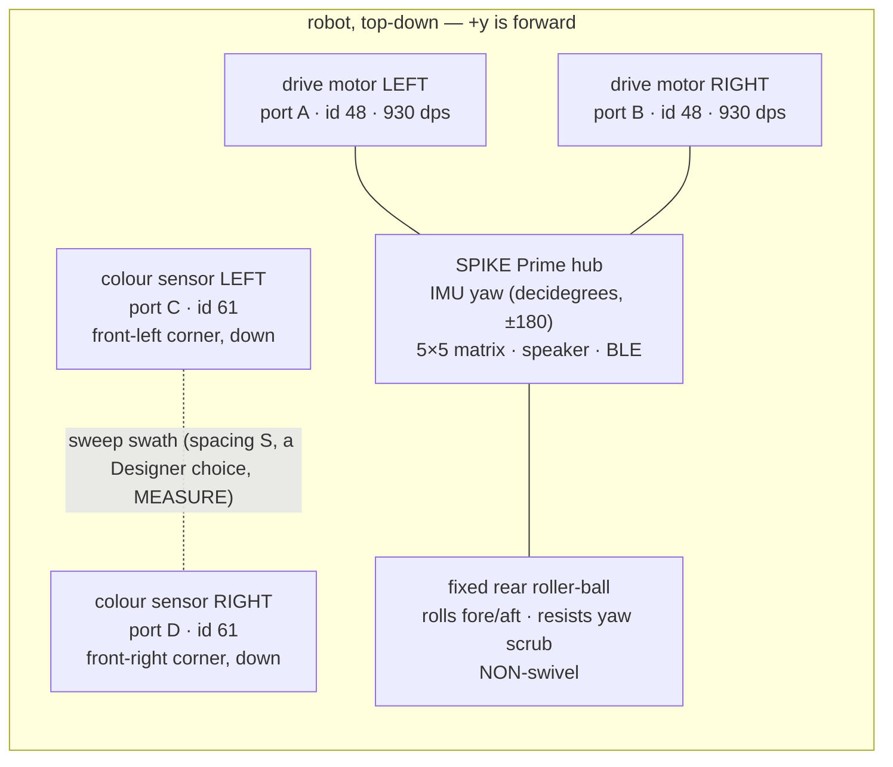

# Competition Program Design — the robot AS BUILT

> **Type:** ACTIVE-SPEC · **Created:** 2026-09-01 · **Owner:** the **Programmer**
> **Designs to:** the chassis measured 2026-09-01 (differential drive + fixed rear roller +
> **two** front-corner colour sensors). **Refines, never replaces:**
> [mission-algorithm.md](./mission-algorithm.md) — that document is still the run's state machine and
> per-tick order of record; this one binds it to the hardware that now exists.
> **Numbers come from:** [bench-measurement-plan.md](./bench-measurement-plan.md).
> **Techniques come from:** [../research/motion-control-and-odometry.md](../research/motion-control-and-odometry.md)
> · [../research/color-discrimination.md](../research/color-discrimination.md)
> · [../research/detection-and-sweep-techniques.md](../research/detection-and-sweep-techniques.md)
> · [../findings/coverage-time-budget.md](../findings/coverage-time-budget.md).

**Nothing here has been measured on the robot.** Every number is `[ASSUMED]` or `UNVERIFIED` unless it
cites a measurement that exists. The point of this document is that a clarified answer or a bench number
changes a **value in `config.py`**, never a state in the machine or a module in the tree — exactly
mission-algorithm commitment 6. Where the earlier spec assumed one colour sensor and an open-loop turn,
this document supersedes only those two assumptions and shows the change is additive.

**This design has been through adversarial challenge.** None of the three areas was refuted; each carries
corrections that are folded in below and flagged **[CHAL]** where they change a claim the naive design
made. The most important: the whole sign chain (which wheel is LEFT, which sign of percent is forward)
rests on an `UNVERIFIED` Stage-2 finding, so everything here is **correct-in-structure, not yet
correct-in-direction**.

---

## 1. The chassis this designs to

Two-wheel **differential drive**: one wheel LEFT, one wheel RIGHT, each its own motor (ports **A** and
**B**, `device.id()==48`, `motor.info` `max_speed` **930 deg/s** MEASURED 2026-08-27). The third contact
is a **single fixed unidirectional roller-ball caster at the back** — it rolls fore/aft and *resists
sideways scrub*; it does **not** swivel. Steering is purely the speed difference between the two wheels.
Sensing is **two colour sensors** at the front, one on **each front corner** (ports **C** and **D**,
`device.id()==61`), both facing down, currently mounted **~51 mm up** (`UNVERIFIED`; LEGO optimal is
**16 mm**, and this height gates the whole detection layer — [§3](#3-sweep--detection-with-two-sensors)).
Heading comes from `hub.motion_sensor` (yaw in **decidegrees**, wraps ±180). There is **no distance and
no force sensor** — the arena has no walls, so distance was dropped.



The two facts that shape everything downstream: **the fixed rear roller dominates turn dynamics** (it
must skid sideways in any in-place rotation, pulling the true rotation centre rearward and adding
stick-slip friction — so turns close on the gyro, not on encoder geometry), and **the two sensors
straddle the width** (so one pass covers a wider swath *and* a left/right edge-timing difference becomes
a heading-relative-to-edge cue a single sensor could never give).

---

## 2. Drive and turn

Maps onto `odometry.py` (pure heading arithmetic), `hub_motors.drive`/`stop_motors` (the only motor
writes), `hub_imu.read_yaw_deg`/`reset_yaw`, and `sweep.py`'s existing command stream. **Commanded in
percent and degrees only** — mm/s and body-deg/s are not convertible until wheel diameter and track width
are measured (BM-3 / BM-4), so they feed estimates, never the loop.

### 2.1 Hold a straight lane on the gyro, not on encoder balance

The loop computes a signed heading error against the lane's target heading and turns it into a steering
correction split into a left/right velocity pair:

```
err   = odometry.heading_error_deg(lane_target_deg, pose.heading_deg)   # = normalize_angle(current - target)
steer = clamp(HEADING_KP_PCT_PER_DEG * err + HEADING_KI_PCT_PER_DEG_S * integral,
              -STEERING_CLAMP_PCT, +STEERING_CLAMP_PCT)
left_pct, right_pct = odometry.steering_to_tank(TRAVERSE_PCT, steer)
hub_motors.drive(left_pct, right_pct)
```

**Why gyro, not encoders:** `odometry.py`'s own docstring settles it — a 0.1 mm effective-diameter
mismatch curves the robot ~74 mm off a 3.05 m lane while both encoders read equal counts. **[CHAL]** the
3.05 m figure is the **10-foot reading** of the arena and is an `[ASSUMED-units illustration]` only —
lane length is not a known quantity until Q1 is answered. Two chassis facts reinforce the choice: (1) if
the fixed roller's roll axis is not perfectly aligned to the wheel-axle centreline it injects a **constant
yaw disturbance only the gyro sees**; (2) wheel slip/scrub is invisible to encoders. Encoder heading
(`odometry.heading_from_encoders`, `Odometry.heading_disagreement_deg`) is kept only as a fault
cross-check.

### 2.2 Turn as a gyro-closed counter-rotating spin

A turn is both wheels driven **opposite at equal magnitude `TURN_PCT`** (a counter-rotating spin), not a
one-wheel pivot: two driven wheels give roughly twice the torque needed to break the roller's lateral
scrub friction, and rotation stays near the body centre so the two sensors' footprints stay in the lane
corridor. A one-wheel pivot would translate the body sideways and scrub the roller through a longer
moment arm.

The turn is **closed on the gyro as a polled velocity command**, refining the research doc's
"geometric command + gyro verify" to fully gyro-closed for this chassis:

```
turn_target = normalize_angle(intended_heading - cmd.value)   # sweep +cmd.value = right (CW); odometry CCW-positive
drive the counter-rotation at TURN_PCT
until abs(odometry.heading_error_deg(turn_target, pose.heading_deg)) <= TURN_TOL_DEG
then BRAKE, settle TURN_SETTLE_MS, re-read yaw, creep-correct up to MAX_TURN_TRIES
on exhaustion -> flag TURN_UNCONVERGED, set STATUS_DEGRADED, continue
```

This replaces mission-algorithm step 9's magnitude-progress completion test
(`abs(normalize_angle(pose.heading_deg - cmd_start_heading)) >= abs(cmd.value)`) with a **target-relative**
test, because (a) the fixed roller corrupts encoder/`TRACK`-based geometry so a `move_for_degrees` would
systematically **under-turn**, and (b) `hub_motors.drive` is a continuous velocity pair that cannot hang
the way a blocking `move_for_degrees` can — the M1 timeout already guards it. Settle-before-read absorbs
the roller/momentum transient; the retry cap honours the never-loop-forever Demo-Day rule; the residual is
**bounded, not accumulated**, because it is re-checked against the absolute target every tick.

### 2.3 One place reconciles the two sign conventions

`sweep.CMD_TURN` is documented "positive = right (clockwise)"; `odometry.Pose` is CCW-positive. A right
turn is therefore a **negative** heading change. The conversion happens **once, in the turn executor**:
`turn_target = normalize_angle(intended_heading - cmd.value)`. `main.py` carries an `intended_heading`
global frame — 0 at `reset_yaw`, updated by `-= cmd.value` on each `CMD_TURN` — that the straight-hold
holds to, so turn residuals do not leak into the straight reference. Every heading delta (error,
completion, creep direction) passes through `odometry.normalize_angle`.

### 2.4 Keep the 90-step-90 U-turn; do not collapse it to a single 180

`sweep.py` already emits the end-of-row U-turn as `RESQUARE → TURN_A(90·dir) → STEP(pitch) →
TURN_B(90·dir)`, then flips `turn_direction`. Keep it: the boustrophedon needs the sideways pitch offset
between the two 90s anyway; two 90° turns each carry half the per-turn error of one 180; and the
90-step-90 decomposition **disambiguates turn direction** (a true single 180 is reachable both CW and CCW
and would need direction forced from the sign of `TURN_PCT`).

**[CHAL] correction to the naive rationale:** the decomposition does **not** keep the *straight-hold
reference* away from the ±180 seam. The boustrophedon's lane targets alternate 0° and ±180°, so on every
other lane the straight-hold reference sits *exactly on* the seam (yaw dithering between +179 and −179).
What keeps that correct is the **mandatory `normalize_angle` on every delta**, which yields a clean ~±1°
error across the seam — the design requires it everywhere, so it is functionally correct, but credit
`normalize_angle`, not "seam avoidance." The genuine seam benefit of 90-step-90 is turn-direction
disambiguation only.

### 2.5 Evaluate the heading-disagreement check on straights only

Degraded mode G1 trips when `Odometry.heading_disagreement_deg()` (called on the live `Odometry`
instance the runner holds — **[CHAL]** it is an instance method, not a module function) exceeds
`HEADING_DISAGREE_LIMIT_DEG`. During a spin the fixed roller scrubs and the wheels turn more encoder
degrees than the body rotates, so that gap **grows by design on every turn**. Left active during turns,
G1 would trip on a healthy robot. So G1 is evaluated during `CMD_DRIVE` straights and suppressed (or
widened) during `CMD_TURN`. The caster-scrub magnitude is itself the metric to record at BM-4 (both
directions), and it sets whether G1 needs full suppression or just a wider limit — it is a
**calibratable systematic, not a fault**.

### 2.6 Ship the integral gain structurally, default 0

`motion-control-and-odometry.md` warns a constant disturbance against a P-only loop settles at a nonzero
offset — "runs perfectly straight along the wrong line" — the failure that eats lane pitch. This chassis
has a specific such disturbance candidate (a rear roller not perfectly centred on the wheel-axle line).
Declare `HEADING_KI_PCT_PER_DEG_S` now, **default 0.0**, and raise it only when a steady-state offset is
seen on the bench — `k` and loop period `h` are both unmeasured and stability needs `k·Kp·h < 2`, so
over-tuning an unmeasured plant now is worse than leaving I off.

### 2.7 Sign chain is UNVERIFIED — a gate, not a footnote

**[CHAL]** Nothing in the loop's sign arithmetic (`steering_to_tank` +steering=right,
`turn_target = intended - cmd.value`) can be trusted as **correct-in-direction** until the Stage-2
mirrored-motor finding lands: which physical side is LEFT, and whether `+pct` means forward per side.
`hub_motors.py` already flags this and says the flip belongs beside the port map — resolve it **there**,
not in `main.py`, with a single global flip if the heading-correction sign comes out backwards. Until
then this section is correct-in-structure only.

---

## 3. Sweep and detection with two sensors

Maps onto `sweep.py` (`SweepPlan`, unchanged state machine), `detector.py` (`EdgeCounter` reused
verbatim, plus a new `MineLedger`), `classify.py` (`build_classes`/`classify`/`separability_report`
reused), `calibration.py`, `result.py`, and the `hub_color`/`hub_api` layer.

> **PREREQUISITE, not an unknown [CHAL]:** the sensors are mounted **~51 mm up** vs LEGO-optimal 16 mm.
> The spot bloats, edge-blend and contrast worsen, and **no detection number — contrast, event width,
> `MIN_CONTRAST` arming, chromaticity separability — is trustworthy until the mount is lowered to
> ~16 mm.** This is a Builder/Designer task that **gates the entire detection layer**; it is listed first
> in [§6](#6-still-blocked-on) for that reason.

### 3.1 The second sensor changes exactly one number: the pass pitch

Keep the boustrophedon exactly as `sweep.py` builds it. The two sensors straddle the width, so a pass now
covers a swath wider than one sensor by their spacing `S`:

```
pass_pitch = lane_pitch_mm() + SENSOR_SPACING_MM
           = (TARGET_SIZE_MM - 2*CROSS_TRACK_ERROR_MM - LANE_OVERLAP_MM) + SENSOR_SPACING_MM
valid only while  SENSOR_SPACING_MM <= TARGET_SIZE_MM - 2*BAR_SPACING_TOLERANCE_MM - LANE_OVERLAP_MM
```

The *within-pass* gap between the two sensors is charged only the small **build tolerance** `b`
(`BAR_SPACING_TOLERANCE_MM`, a rigid cross-member), while the *between-pass* gap is charged the large
**odometry error** `e` — this is the settled result of [coverage-time-budget.md](../findings/coverage-time-budget.md)
(rewritten 2026-09-01), giving a coverage gain above 2×. At `S=0` the formula collapses to today's
single-sensor pitch, so **one config value turns the second sensor on or off**. The robot steps sideways
by `pass_pitch` and the pass count is `ceil(side / pass_pitch)`.

**[CHAL] do not pin `S` to the validity edge.** `SENSOR_SPACING_MM = 65` sits *exactly* at the limit
`76 − 2·3 − 5 = 65`, leaving zero within-pass margin: any real `b > 3 mm`, or a slightly smaller note
pack, makes `pass_pitch_mm()` raise or lets a centred note slip between the two tracks. Start at an
**interior** value (~55–60 mm) until `b` and `TARGET_SIZE_MM` are measured. `S` is a Designer choice and
is **not yet fixed** — carry it as config, measure the built spacing.

### 3.2 Two independent detector streams; a mine seen by EITHER sensor counts

Run **two `detector.EdgeCounter` instances**, one per sensor, reusing the four-state
hysteresis/dwell/width machine verbatim. A note near one sensor line is geometrically invisible to the
other, so **requiring agreement would miss notes** — a mine seen by *either* sensor is sufficient.
Cross-stream and cross-pass duplicates are removed by a ledger, **not** by ANDing/ORing the sample
streams (which would destroy per-sensor colour and the left/right cue). This is trade-study §7.2's result:
more sensors make de-dup *simpler*, not harder.

### 3.3 De-duplicate and count in one `detector.MineLedger`

Each accepted `Event` becomes a sighting tagged `(pass_index, along_track_mm, label)`. A sighting is a
**new** mine unless an already-counted sighting exists with `|dpass| <= 1` **and**
`|dalong_track| < DEDUP_RADIUS_MM` **and** the same label; then it merges. Beep/flash only when
`add_sighting` reports a new mine. Geometry caps multiplicity at 2 and yields exactly two dup cases:
within-pass cross-sensor (`dpass=0`, same sample clock) and between-pass right(n)-vs-left(n+1)
(`dpass=1`, drift-tolerant along-track compare on **adjacent passes only**). This is research **Approach
A** (structural + small along-track de-dup on adjacent passes), which needs only *locally* consistent
odometry across one lane pair — never a global map. The same-label condition lets the two streams veto a
merge when they disagree in colour. `DEDUP_RADIUS_MM ≈ TARGET_SIZE_MM` because two crossings of one note
are at most `W` apart while two distinct notes are at least `W` apart along-track.

**[CHAL] confidence is medium, gated on drivetrain calibration** — not high as first drafted. The
`|dalong_track|` merge needs a sample→mm map, which needs mm/s, which needs wheel diameter and track
width — **both UNMEASURED** (no deg/s→mm/s conversion exists yet). The local-consistency argument is
sound, but the mechanism cannot be exercised or tuned until BM-3/BM-4. **Residual limit, reported not
hidden:** two *same-colour* notes exactly abreast at spacing `S` read as one — a fundamental point-sensor
limit.

### 3.4 Mine vs boundary vs UNKNOWN — reuse classify, keep it out of `config.CLASSES`

`reflection()`/intensity drives **presence + width** (the `EdgeCounter`); `rgbi()` drives the **class**
via `classify.py`'s existing chromaticity nearest-centroid classifier over a `{mine, boundary}` class
dict; `color()` is a **calibration-time cross-check only**, never in the per-tick loop (alternating LPF2
modes every tick forces mode changes of unknown latency — failure C8). An event that is
far/ambiguous/low-signal returns **UNKNOWN with a reason** and is never forced into a class.

**[CHAL] BREAKING — do NOT put "boundary" into `config.CLASSES`.** `result.display_pages()` iterates
`config.CLASSES` and indexes `CLASS_GLYPHS`, which has one entry; adding a second class raises
`IndexError` on the report page, exactly as the `result.py` comment warns. **Fix:** keep
`config.CLASSES = ("target",)` (presence / mine-count only) and calibrate `{mine, boundary}` as a
**separate class dict** passed straight to `classify.build_classes`, independent of `config.CLASSES`.
Route a `classify` label of `boundary` to `result.add_boundary()` **only** (never `add_detection`), and
keep `boundary` out of `by_color` so the `detected == classified + unknown` invariant holds.

**[CHAL] vocabulary migration, called out deliberately:** the established code labels the target class
`"target"` (`config.CLASSES = ("target",)`, `CLASS_GLYPHS` "class 1 / target"). This design uses `mine`
in prose because that is the mission word. **The code keyword stays `target`** unless a deliberate
rename is scheduled; treat `mine ≡ target` and do not smuggle a rename inside the boundary change.

**[CHAL] S_MIN side effect:** `classify.classify()` sets its low-signal reject at `0.5 × min(total_median
across classes)`. Adding a dark blue-tape `boundary` class *lowers* that floor gate for **all** classes,
so dimmer readings (including the floor itself) start passing. Note this when adding a dark class — the
deviation-magnitude presence signal in §3.5 does not protect classify's own S_MIN gate.

### 3.5 Presence trips on floor DEVIATION magnitude, not a fixed polarity

`calibrate()` currently picks **one** polarity from floor-vs-target. Tape polarity relative to the floor
is unmeasured and may differ from the mine's — silver/grey duct may read *brighter* like the note, blue
painters may read *darker*. A polarity-locked detector could silently miss the boundary, and **with no
walls a missed boundary means the robot drives out of the arena.** So expose a selectable
`|reading − floor_level|` (deviation-magnitude) presence signal that trips on either polarity;
classification then separates mine from tape. If the bench shows the tape is same-polarity as the mine,
the existing single-polarity `Calibration.signal()` is sufficient and this is a no-op. **Confidence
medium — a hook justified by an UNMEASURED quantity; build it selectable, do not hard-commit a number.**

### 3.6 The width gate is the along-tape discriminator — reuse it

A strip driven **along** its length produces an event far wider than a note and is already rejected as
`REJECT_TOO_WIDE` by `detector.py`'s width gate (`config.event_width_gates()` from the run-start
**measured** loop rate). A note gives a note-sized width that passes. One refinement: a `too_wide` event
whose buffered `rgbi` classifies as the **boundary colour** must route to the **boundary-STOP** signal
instead of being silently added to `result.rejected` — for a no-walls arena, wide + tape-coloured is the
strongest boundary evidence there is, and dropping it throws away the clearest cue.

### 3.7 Blue-tape vs blue-note — resolve by geometry, recurrence, then fail loud

Ordered: (1) **geometry/width** — tape driven along-lane is `too_wide` and routed to boundary;
(2) **recurrence** — a boundary-coloured event recurs at the arena **perimeter** on every pass, while a
note is a single interior sighting; (3) **calibration** — `separability_report()` runs at DERIVE over
`{mine, boundary}` and **fails the run loudly at 09:00** if the tape colour and any note colour are not
separable (its message already names the pair). Colour **alone cannot** split same-pigment blue tape from
a hypothetical blue *decoy* note — that case is **escalated to the professor, not guessed**. Confidence
medium: whether a blue decoy even coexists with blue tape is a declared unknown.

### 3.8 The left/right along-track difference is a heading-vs-edge (skew) cue

When both sensors cross the same straight edge, the along-track lag `dS` between the left and right
edge-events gives skew `theta = atan(dS / SENSOR_SPACING_MM)`. This is the line-squaring signal a single
sensor can never provide — the wide baseline `SP3 Squaring-on-Line` needs. Expose it as a **pure geometry
helper feeding the record and the currently no-op `RESQUARE` state**; do **not** build the squaring
controller here — the task defers boundary-relative navigation, and Q3 (what `RESQUARE` squares against)
is unresolved. `skew = atan(dS/S)` is a small relative angle, so it is not exposed to the ±180 wrap.

### 3.9 Boundary handling is DETECT-AND-STOP only

A confident `boundary` classification (or a boundary-coloured `too_wide`) raises a **stop** to the state
machine. The existing odometry arena-rectangle check (degraded mode **B1**) stays as the backstop for a
tape crossing that reads UNKNOWN. **No wall-follow, no perimeter trace.** UNKNOWN is deliberately **not**
auto-stopped (it would abort on any ambiguous note); B1 covers the missed-tape case. With no physical
walls, boundary tape + B1 are the only things keeping the robot in the arena, so a positive detection
must be able to stop the run — but anything past stop is out of scope and gated on Q3.

### 3.10 Two sensors ≈ 2× colour reads/tick — flagged, mitigated

Two sensors mean ~2× `rgbi` reads per tick, **superseding mission-algorithm commitment 2** ("exactly one
colour-sensor call per tick"). Run **both sensors in a single LPF2 mode (`rgbi`) for the whole run**, take
presence from channel `[3]`, and keep the existing mitigation unchanged: measure `achieved_hz` during the
run-start floor burst and derive the width gates from it via `config.event_width_gates()` — which
**raises** rather than clamps when the rate is too low. Calibrate **per sensor** (two `Calibration`
objects, `cal_left` / `cal_right`) because the two corners sit at different heights and will not read
identically. The achieved *two-sensor* loop rate is UNMEASURED — the honest new caveat, but the
mechanism to survive it already exists.

---

## 4. Run shape, telemetry, and fail-safe on link loss

### 4.1 No new states — the untethered run IS the existing machine

`BOOT → SELFCHECK → CALIBRATE_FLOOR → CALIBRATE_TARGET → DERIVE → READY → SWEEP → REPORT`, with
`CALIBRATION_FAILED` / `FAULT` / `ABORT` terminals, verbatim from
[mission-algorithm.md](./mission-algorithm.md). "Detect" and "turn" are `SweepPlan` sub-states **inside**
SWEEP (`LANE` with `detect=True`, then `RESQUARE`/`TURN_A`/`STEP`/`TURN_B`). Untethered-ness changes
nothing structural because the run is already "one program, one press, no laptop." Inventing states would
duplicate what `SweepPlan` produces for free (commitment 6).

### 4.2 Telemetry and feedback are OBSERVERS, never inputs

Telemetry and operator feedback hang off the existing tick and the terminal-state transitions. They are
**never inputs** to the machine. The only inputs remain the two already-specified button reads: **start**
in READY, **soft-abort AB1** on a side hub button. **[CHAL]** mission-algorithm says only "a side hub
button" for AB1; binding it to `hub_ui.button_pressed("left")` is a design choice, marked `[ASSUMED]`
until confirmed on the bench. The **centre** button stays the firmware hard stop (AB2). Because the BLE
link is **output-only**, nothing an observer — or an adversary — does to the link can alter the sweep, and
the robot behaves byte-identically whether or not anyone is listening.

### 4.3 Fail-safe on link drop: do NOTHING to the drivetrain

On a mid-run BLE drop the robot keeps sweeping, keeps holding heading, keeps beeping, keeps updating the
matrix and the result. "Never drive blind" is satisfied **by construction**: the robot never navigated by
the link — it sees with its own colour sensors + IMU + encoders. A dropped link costs a telemetry
capture, not a run ([blind-teleoperation.md](./blind-teleoperation.md) §6). There is **no** "stop on link
loss" and **no** "hold heading" special case, because holding heading is the normal autonomous behaviour
every tick. The genuine link hazard is not the human losing their view; it is **`print()` itself stalling
the loop when no listener is attached** — handled next.

### 4.4 Live stream defaults OFF; full record to an on-hub ring buffer dumped at REPORT

For the untethered competition run, default `TELEMETRY_LIVE_ENABLED = False` and log the full record to a
**bounded on-hub ring buffer**, dumped as one burst at REPORT. Enable live streaming only after gate
**G4b** proves `print()` does **not** block with no listener, **and** the MTU exchange is exercised. A
stall would freeze the sweep on Demo Day — the worst outcome — so the conservative default keeps behaviour
identical listener-or-not, and flipping it later is a one-line value change. Until then the
**link-independent sound + matrix** panel is what a supervising operator relies on.

### 4.5 Sound is the primary during-run channel

[blind-teleoperation.md](./blind-teleoperation.md) §5 is explicit: an operator turned away from the arena
"cannot read the matrix… only the speaker survives." So the during-run instrument panel is **audible**,
answering the three diagnosable questions:

- **"is it seeing?"** — one short beep per **accepted, new** detection (from the `add_sighting`-returns-new
  path), the Builder's independent tally, sacred; never beep on a rejection or a merge.
- **"is it progressing?"** — a distinct-pitch tone at each **lane boundary** (`LANE↔TURN` transition),
  **not** per tick.
- **"did it fail or finish?"** — `tone_falling()` for FAULT/CALIBRATION_FAILED vs a long tone + digit
  pages for a clean finish.

The matrix shows the **static per-state glyph** (arrow while sweeping) plus a single-frame flash on a
counted target, and must **not animate during a gyro-controlled move** — light-matrix updates add ~25°
per 360° turn ([motion-control-and-odometry.md](../research/motion-control-and-odometry.md)), a control
reason on top of the tick cost.

**[CHAL] downgrade this to medium confidence on SPIKE 3.** Our hub is SPIKE 3 (MEASURED), where
`hub_ui.beep()` calls `sound.beep()` returning an Awaitable and it is **UNVERIFIED whether an unawaited
call sounds at all**. The lane-boundary-only cadence was justified by SPIKE-2 *blocking* behaviour, which
does not apply here; the SPIKE-3 risk is the opposite — **silence**, and `tone_rising`/`tone_falling`
possibly collapsing into one. Confirm at Stage 1 that beep is audible and the two tones are separable
before trusting sound as the primary channel.

### 4.6 Thin the live channel by RATE, never by columns

When live is enabled, emit the **same full record** every Nth tick where
`N = max(1, round(achieved_hz / TELEMETRY_LIVE_HZ))`, and call `Recorder.note_dropped()` on every skipped
tick so the trailer's `seq_last`/`sum_seq`/`dropped` integrity check stays honest. Dropping *columns*
would break `telemetry.py`'s one-parser-per-project invariant and force a branching parser; rate-thinning
keeps one format. `achieved_hz` is already measured for free during CALIBRATE_FLOOR, so decimation is
computed at DERIVE alongside the width gates.

**MTU reality (medium confidence):** the record is a **21-column** line (`telemetry.COLUMNS`), a realistic
~90–120 B framed — roughly **half** the sustainable rate the old 12-field example in
[telemetry-over-bluetooth.md](./telemetry-over-bluetooth.md) §3.3 assumed. At the negotiated
**MTU of 23** that is only **~5–7 full lines/s**, so full-rate live streaming is **infeasible today**
and the ring-buffer-plus-dump is mandatory, not optional.

⚠ **Correction (2026-09-01):** the "23" is what **bleak/BlueZ reports by default**, *not* a measured
wire MTU — calling it MEASURED was an over-claim ([telemetry-while-driving.md](../research/telemetry-while-driving.md)).
And **MTU is not the throughput lever**: sustained BLE-notify rate is bounded by the connection interval
and packets-per-connection-event, so 23→247/509 buys only ~20–33 % *without* Data Length Extension. The
~5–7 vs ~16.7 lines/s figures are two **computed** estimates that disagree only on the packets-per-event
assumption — neither is measured. So the ring-buffer-plus-dump stands regardless; going live-primary
needs a *real* negotiated MTU **and** a bench throughput measurement (G4/G4b), not just a config edit. The 90–120 B estimate is **not yet run through LEGO's `cobs.pack()`** (only the old line was);
re-run it the same way ([ble-protocol-2026-08-27.md](../findings/ble-protocol-2026-08-27.md) flagged the
20× MTU gap as "must fix before any telemetry design").

### 4.7 REPORT is the single authoritative reporting point

At REPORT: (1) `print(result.describe())` — it already leads with `PARTIAL total>=N` when
`not is_trustworthy()`, exactly what a blind operator must hear/read; (2) emit `trailer_lines(...)` so a
receiver recomputes `expected_sum_seq()` and **detects a truncated capture**; (3) dump the ring buffer as
one burst (no control loop competing); (4) cycle `result.display_pages()` forever on the matrix + the
page-number beep code. `header_lines(**context)` go out **once at READY** carrying run context, so a link
that drops mid-run is self-diagnosing: the trailer never arrives and `sum_seq` mismatches.

### 4.8 Two-sensor consequence for the record **[CHAL]**

`telemetry.COLUMNS` today carries a **single** reflection/r/g/b group and one `det_state`, but the robot
has **two** colour sensors. "Record emitted whole, never subsetted" silently covered one sensor only.
**Decision required and here made:** the **LEFT sensor (port C) is the detection stream of record** in the
single existing column group; the RIGHT sensor's edge crossings are logged only via the skew helper
(§3.8) and a second `det_state`. If both full streams are wanted, add a second column group — but that is
a `COLUMNS` change to schedule, not a silent assumption. Recording this now closes the gap the challenge
found.

### 4.9 Interference robustness — for free, no new code

Because interference between teams is authorized ([competitive-interference.md](./competitive-interference.md)):
(a) **physical** interference (a bump, a shove) is already handled by the existing degraded modes — G1
(keep sweeping, gyro of record), B1/B2 (end lane / end sweep, DEGRADED), M1 (FAULT + report); (b)
**BLE/2.4 GHz** interference or a forced disconnect **cannot affect the sweep at all**, because the link
is output-only — a teleop design would let a rival end your run by jamming the link, a further argument
for the autonomous baseline. **[CHAL] the caster's turn scrub interacts with G1:** fold the roller's
baseline gyro-vs-encoder drag into `HEADING_DISAGREE_LIMIT_DEG` at calibration, or G1 false-flags DEGRADED
on ordinary turns (§2.5). **Open, do not over-model:** BLE has no auth and the control plane accepts
`ProgramFlowRequest Stop`; whether the hub honours a *rival* connection's Stop is untested.

---

## 5. New function signatures needed

Every symbol below is **new**. Everything these lean on already exists and was confirmed against the
source (`odometry.normalize_angle`/`heading_from_encoders`/`cross_track_error_mm`,
`Odometry.update`/`pose.heading_deg`/`distance_mm`/`heading_disagreement_deg`; `sweep.Command`/
`SweepPlan.next_command` and the exact `TURN_A/STEP/TURN_B` U-turn; `config.lane_pitch_mm`/`lane_count`/
`event_width_gates`; `detector.EdgeCounter`/`Event`; `classify.build_classes`/`classify`/
`separability_report`; `calibration.Calibration.signal`/`calibrate`; `result.MissionResult`/
`unknown_by_reason`/`add_detection`/`display_pages`/`describe`/`set_status`; `hub_motors.drive`/
`stop_motors`/`DRIVE_MAX_DPS=930`; `hub_imu.read_yaw_deg`/`reset_yaw`; `hub_color.read_reflection`/
`read_rgb`; `hub_ui.beep`/`tone_*`/`show_*`/`button_pressed`). All host-testable pieces stay pure so
`check-docs.py` stays green.

| Module | Signature | Returns | Why |
|---|---|---|---|
| `odometry.py` | `heading_error_deg(target_deg, current_deg)` | `float` | `= normalize_angle(current - target)`; positive = current CCW of target. One function for BOTH straight-hold (target = lane heading) and turn-closure (target = turn_target); turn done when `abs(...) <= TURN_TOL_DEG`. Pure |
| `odometry.py` | `steering_to_tank(base_pct, steering_pct)` | `(left_pct, right_pct)` | `left = base + steering`, `right = base - steering`; +steering turns RIGHT/CW. Pure; fixes the sign feeding `hub_motors.drive`. Optional (could inline) but naming it pins the convention |
| `detector.py` | `Event.mid_index(self)` | `int` | `(start_index + end_index)//2`, the along-track centre for de-dup |
| `detector.py` | `MineLedger.__init__(self, dedup_radius_mm=None)` | — | Cross-stream + cross-pass de-dup ledger (research Approach A) |
| `detector.py` | `MineLedger.add_sighting(self, pass_index, along_track_mm, label)` | `bool` | `True` on a NEW mine, `False` on merge. Beep/flash only on `True` |
| `detector.py` | `MineLedger.count(self)` | `int` | Deduplicated mine count |
| `detector.py` | `skew_deg_from_crossings(left_mm, right_mm, spacing_mm)` | `float` | `atan(dS/S)` heading-vs-edge cue. Pure |
| `classify.py` | `is_boundary(name)` | `bool` | Thin helper over `config.BOUNDARY_CLASS`; keeps mine/boundary routing out of `main` |
| `result.py` | `MissionResult.add_boundary(self)` | `None` | New field `boundary_hits`, tracked like `rejected`, **NOT** part of `detected` (invariant safe) |
| `result.py` | `MissionResult.boundary_hits` (field) | — | Boundary detections; a `boundary` page in `display_pages()`, a `boundary=` term in `describe()` |
| `hub_color.py` | `read_reflection(side)` | `int\|None` | `side in ('left','right')` |
| `hub_color.py` | `read_rgb(side)` | `tuple\|None` | `side in ('left','right')`; presence from `[3]` |
| `hub_color.py` | `read_color(side)` | `int\|None` | Built-in `color()` ID, calibration-time cross-check only |
| `hub_api.py` | `COLOR_PORT_LEFT` / `COLOR_PORT_RIGHT` | — | Replace the single `COLOR_PORT`; ports C and D, `device.id()==61` both |
| `config.py` | `pass_pitch_mm(spacing_mm=None)` | `float` | `lane_pitch_mm() + (spacing_mm or SENSOR_SPACING_MM)`; **raises** when spacing `> TARGET_SIZE_MM - 2*BAR_SPACING_TOLERANCE_MM - LANE_OVERLAP_MM` (mirrors `lane_pitch_mm()`'s raise) |
| `config.py` | `pass_count(width_mm=None)` | `int` | `ceil(width / pass_pitch_mm())`; the two-sensor replacement for `lane_count()` |

**New `config.py` values** (all `[ASSUMED]`, each with a measurement path):

| Name | Default | Set by |
|---|---|---|
| `TRAVERSE_PCT` | slow start | percent of `DRIVE_MAX_DPS`; decoupled from `TRAVERSE_SPEED_MMS` until BM-3 |
| `TURN_PCT` | ~20–25 | slow for accuracy (overshoot-vs-turn-rate finding) |
| `HEADING_KP_PCT_PER_DEG` | tune | from plant gain `k` and loop period `h`, under `k·Kp·h < 2` |
| `HEADING_KI_PCT_PER_DEG_S` | **0.0** | raised only on an observed steady-state offset (§2.6) |
| `STEERING_CLAMP_PCT` | 30.0 | research ±30 (Prime Lessons `CORR_LIMIT`) |
| `TURN_TOL_DEG` | tune | from lane length via `cross_track_error_mm` (BM-8), not taste |
| `TURN_SETTLE_MS` | 200 | yaw-knee bench item (log yaw every 20 ms for 1 s) |
| `MAX_TURN_TRIES` | 2 | creep attempts before `TURN_UNCONVERGED` → `STATUS_DEGRADED` |
| `SENSOR_SPACING_MM` | ~55–60 (**not** 65) | Designer choice; **MEASURE** the built spacing (§3.1) |
| `N_SENSORS` | 2 | — |
| `BAR_SPACING_TOLERANCE_MM` | 3.0 | build property of the cross-member; measure |
| `DEDUP_RADIUS_MM` | `= TARGET_SIZE_MM` | replay of recorded runs |
| `BOUNDARY_CLASS` | `"boundary"` | the calibrated class routed to detect-and-stop; **NOT** in `config.CLASSES` |
| `TELEMETRY_LIVE_ENABLED` | **False** | gate G4b + MTU exchange |
| `TELEMETRY_LIVE_HZ` | 3.0 | target live rate at MTU 23 |
| `TELEMETRY_RING_SAMPLES` | 2000 | UNMEASURED hub heap ceiling; prefer buffering packed tuples, format at dump |
| `TELEMETRY_HEARTBEAT_ON_LANE` | True | lane-boundary progress tone, not per-tick |

No new functions are required in `telemetry.py` (its `Recorder.format`/`note_dropped`/`trailer`,
`header_lines`, `trailer_lines`, `expected_sum_seq` are used as-is).

---

## 6. Still blocked on

1. **Sensor mount height (~51 mm → ~16 mm) — Builder/Designer, PREREQUISITE.** Not an unknown to plan
   around: no detection number is trustworthy until the mount is lowered. It gates all of §3.
2. **UNITS of "10×10" (feet / metres / tiles) — Q1, THE top blocker.** Sets lane length, pass count, run
   time (8–23 min at 10 ft), `TURN_TOL_DEG` via cross-track, and whether the run even fits the slot. It
   does **not** change any architecture here — the loop is percent/gyro-closed and the sweep is
   boustrophedon regardless. **This is the single measurement/answer that unblocks the most.**
3. **Wheel diameter (BM-3) and track width (BM-4) — UNMEASURED.** No deg/s converts to mm/s or body-deg/s,
   so the loop is commanded in percent/degrees and `MineLedger`'s along-track de-dup (§3.3) cannot be
   tuned. `TRAVERSE_SPEED_MMS`/`TURN_RATE_DPS`/`TRACK_WIDTH_MM` feed estimates only.
4. **The mirrored-motor sign flip — UNVERIFIED (Stage 2).** Which side is LEFT and whether `+pct` is
   forward. Until it lands, §2's sign arithmetic is correct-in-structure, not correct-in-direction.
5. **Heading-hold gains `Kp`/`Ki`** — plant gain `k` and loop period `h` both UNMEASURED; placeholders
   tuned under `k·Kp·h < 2`.
6. **`TURN_TOL_DEG`, `TURN_SETTLE_MS`, `MAX_TURN_TRIES`, caster-scrub magnitude** — the roller/momentum
   transient and how far it pulls the turn centre rearward have never been observed (BM-4 records the
   per-turn gyro-vs-encoder gap, both directions — the roller-scrub metric that sets G1 suppression).
7. **Gyro drift WHILE DRIVING — UNMEASURED** (only stationary ≤0.0033 deg/s is known). Drift-under-motion
   bounds how long a lane can be held on gyro alone (BM-8/BM-9).
8. **`SENSOR_SPACING_MM`** — a Designer choice, not fixed; the built spacing must be measured, and do not
   pin it to the validity edge (§3.1).
9. **`rgbi()` channel range on this Hub OS — UNKNOWN.** `classify` is chromaticity (scale-free) by design,
   but the presence scalar `rgbi()[3]` has an unknown range calibration must absorb per sensor.
10. **Boundary TAPE polarity vs floor, and blue-note vs blue-tape separability — UNKNOWN** (Q5/Q3-adjacent;
    silver/grey has no colour constant and may read UNKNOWN/specular-white). Escalated to the professor,
    backed by `separability_report()` failing loud at DERIVE.
11. **Achieved TWO-sensor loop rate, and `print()` blocking with no listener (gate G4b), and the true
    `cobs`-framed 21-column line size — all UNMEASURED.** They set decimation and whether live telemetry
    is even safe on the untethered run.
12. **SPIKE-3 `sound.beep()` awaited-vs-unawaited behaviour — UNVERIFIED.** If an unawaited beep is
    silent or the two tones collapse, the sound-first panel (§4.5) needs rework — confirm at Stage 1.
13. **Whether a curled/bent sticky note defeats a downward sensor** (task-declared) — could shorten or
    split an event; bench check.

---

## 7. Recommended changes to existing files

**Do not treat these as applied — other agents are editing the docs tree. This section is the change
list; the files are NOT edited here.**

| File | Change | Why |
|---|---|---|
| `src/config.py` | Add a `--- Drivetrain control ---` block (`TRAVERSE_PCT`, `TURN_PCT`, `HEADING_KP_PCT_PER_DEG`, `HEADING_KI_PCT_PER_DEG_S=0.0`, `STEERING_CLAMP_PCT=30.0`, `TURN_TOL_DEG`, `TURN_SETTLE_MS=200`, `MAX_TURN_TRIES=2`) and a `--- Two-sensor sweep ---` block (`SENSOR_SPACING_MM`, `N_SENSORS=2`, `BAR_SPACING_TOLERANCE_MM=3.0`, `DEDUP_RADIUS_MM`, `BOUNDARY_CLASS="boundary"`) plus a `--- Telemetry ---` block (`TELEMETRY_LIVE_ENABLED=False`, `TELEMETRY_LIVE_HZ=3.0`, `TELEMETRY_RING_SAMPLES=2000`, `TELEMETRY_HEARTBEAT_ON_LANE=True`). Add `pass_pitch_mm(spacing_mm=None)` (raises past the within-pass validity limit) and `pass_count(width_mm=None)`. **Do NOT add `boundary` to `CLASSES`.** Comment that percent/degrees are deliberately decoupled from `TRAVERSE_SPEED_MMS`/`TURN_RATE_DPS` until BM-3, and that `S=0` collapses `pass_pitch` to the single-sensor pitch | The values-not-architecture contract; the `CLASSES` guard is the [CHAL] IndexError fix |
| `src/odometry.py` | Add pure `heading_error_deg(target, current) = normalize_angle(current - target)` and optional `steering_to_tank(base_pct, steering_pct)`. No hub import | Home of pure heading arithmetic; both replay-testable |
| `src/detector.py` | Add `Event.mid_index()`; add `MineLedger(dedup_radius_mm=None)` with `add_sighting(pass, along_mm, label)->bool` and `count()`; add pure `skew_deg_from_crossings(left_mm, right_mm, spacing_mm)`. **Do NOT touch `EdgeCounter`'s core** — it is reused per sensor. Note that a `too_wide` + boundary-coloured event should be surfaced to the caller, not only counted as rejected | Two-stream counting/de-dup and the skew cue |
| `src/classify.py` | No change to `build_classes`/`classify`/`separability_report` — they already handle an arbitrary `{mine, boundary}` dict with UNKNOWN rejection. Add thin `is_boundary(name)`. Ensure the caller runs `separability_report` at DERIVE over the full set. **Note the S_MIN side effect** of adding a dark boundary class | Mine/boundary routing; [CHAL] S_MIN warning |
| `src/calibration.py` | Add a selectable floor-**deviation** signal (`|reading - floor_level|`) so presence trips polarity-agnostically; keep single-polarity `signal()` as default/fallback. `median`/`MAD` reused; `calibrate()` called once per sensor for `cal_left`/`cal_right` | Guards against a boundary tape whose polarity differs from the mine's — a no-walls safety case |
| `src/result.py` | Add `boundary_hits` + `add_boundary()`, tracked like `rejected` (NOT part of `detected`, invariant safe). Add a boundary page to `display_pages()` and a `boundary=` term to `describe()`. **Keep `CLASSES=('target',)`; `boundary` stays out of `by_color`** | Books boundary hits without breaking `detected == classified + unknown` or `CLASS_GLYPHS` indexing |
| `src/hub_color.py` | Make readers per-side: `read_reflection(side)`, `read_rgb(side)`, new `read_color(side)` (built-in `color()` ID for calibration cross-check), `side in ('left','right')`, each `None` on unreadable. Single `rgbi` mode for the whole sweep, presence from `[3]`; `color()` only during stationary calibration (avoid mode-thrash C8) | Two sensors, one file per device intact |
| `src/hub_api.py` | Replace the single `COLOR_PORT` with `COLOR_PORT_LEFT` (C) and `COLOR_PORT_RIGHT` (D); both `device.id()==61` MEASURED. Update `_require` call sites and the SPIKE2/SPIKE3 branches; `hub_selfcheck` required-probe list requires both colour ports. Resolve the mirrored-side sign flip in `hub_motors.py` beside the port map (single global flip) at Stage 2 | Two colour ports; the sign flip belongs in the hub layer, not `main.py` |
| `src/hub_motors.py` | At Stage 2 resolve the `UNVERIFIED` mirrored-side sign flip here; confirm the heading-correction sign on the bench. Keep per-side `motor.run` (do **not** switch to `motor_pair.move` steering). Use a BRAKE stop for turns so the settle transient is short and repeatable | The heading-hold and spin arithmetic stay readable only if the flip lives here |
| `docs/plans/mission-algorithm.md` | Step 9/10: change `CMD_TURN` completion from the magnitude-progress test to `abs(odometry.heading_error_deg(turn_target, pose.heading_deg)) <= TURN_TOL_DEG` with settle + verify + up to `MAX_TURN_TRIES` creep, `turn_target = normalize_angle(intended_heading - cmd.value)`; record the `intended_heading` global frame; note G1 is evaluated on straights only (roller scrub inflates the gyro-vs-encoder gap on turns by design); add `TURN_UNCONVERGED → STATUS_DEGRADED`; note the loop base speed is `TRAVERSE_PCT`, not `TRAVERSE_SPEED_MMS`. Add a "Telemetry and feedback on an untethered run" subsection: link output-only, live default OFF until G4b, rate-thinning not column-thinning, sound-first panel, static matrix during gyro turns. Note commitment 2 (one colour call/tick) is superseded by two sensors | Binds the spec to the as-built turn dynamics and two sensors |
| `docs/plans/2026-08-25-coverage-strategy-trade-study.md` / `docs/findings/coverage-time-budget.md` | Cross-reference `pass_pitch_mm()` as the implementation of the swath-widening geometry (within-pass charged build tolerance `b`, between-pass charged odometry error `e`) | Keeps the geometry doc and the code in sync |
| `docs/research/motion-control-and-odometry.md` | Add a chassis note: "geometric turn as command, gyro as verifier" is refined to fully gyro-**closed** velocity turns for this robot, because the fixed single rear roller corrupts the encoder/`TRACK` spin geometry (turn centre pulled rearward, stick-slip scrub) and `hub_motors.drive` is a polled velocity pair that cannot hang like `move_for_degrees`. Note the fixed roller helps straight tracking but dominates turn dynamics | Records why the recommendation narrowed for this chassis |
| `docs/plans/bench-measurement-plan.md` | Add a turn-settle-time item (stop a spin, log yaw every 20 ms for 1 s, find the knee → `TURN_SETTLE_MS`) and a caster-scrub row under BM-4 (record the gyro-vs-encoder heading gap per turn, both directions → sets G1 suppression). Add a built-`SENSOR_SPACING_MM` measurement and a `BAR_SPACING_TOLERANCE_MM` build-tolerance row. The `measure-drivetrain` runbook already exposes `--gyro-close`/`--heading-hold`, so these need result rows, not new tooling | Turns the [ASSUMED] drivetrain/sweep values into measurements |
| `docs/plans/telemetry-over-bluetooth.md` | Update §3.3 byte math: the example is the OLD 12-field record; the record is now 21 columns (~90–120 B framed), roughly halving the sustainable rate → ~5–7 full lines/s at MTU 23, so the ring buffer + post-run dump is mandatory. Re-run `cobs.pack()` on a real 21-column line (short and worst-case) | Corrects the rate math the challenge found stale |
| `docs/plans/blind-teleoperation.md` | Add one line to §5/§6: because interference is authorized and the link is output-only, a rival jamming 2.4 GHz or forcing a disconnect cannot end an autonomous run (it would end a teleop run) — a further argument for autonomy. Flag that BLE has no auth, so a connected rival could in principle send `ProgramFlowRequest Stop`; do not over-model | The interference-hardening corollary, in the doc that owns the autonomy baseline |

---

## Revision History

| Date | Change |
|---|---|
| 2026-09-01 | Created. Competition program design of record for the robot AS BUILT (differential drive + fixed rear roller + two front-corner colour sensors). Folds in the adversarial-challenge corrections: the ±180 seam is handled by `normalize_angle`, not avoided by 90-step-90; `boundary` must NOT enter `config.CLASSES` (IndexError); `mine ≡ target` vocabulary is a deliberate migration; `SENSOR_SPACING_MM` must not pin to the validity edge; SPIKE-3 beep is UNVERIFIED so sound-first is medium confidence; the LEFT sensor is the telemetry detection stream of record; the whole sign chain is correct-in-structure, not correct-in-direction, until the Stage-2 mirrored-motor finding lands |
