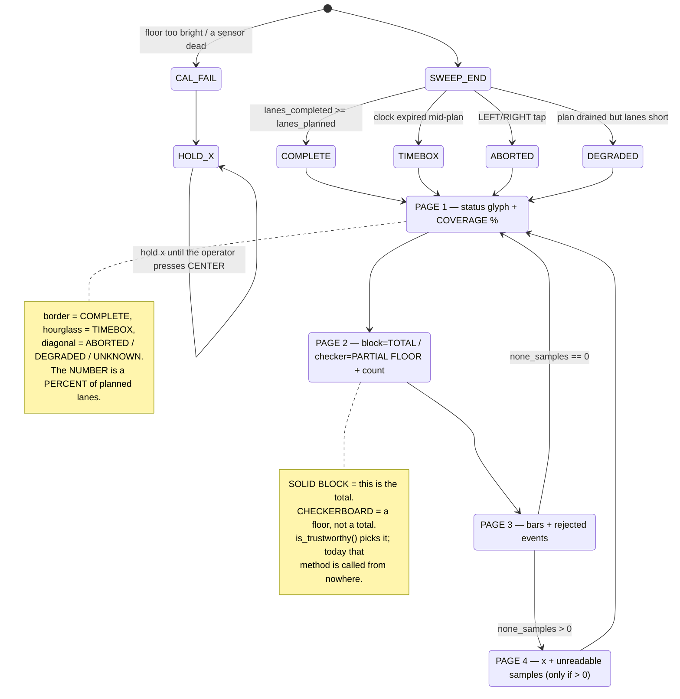

# Competition-program readiness — `src/main.py`, 2026-09-09

> Written 2026-09-09, one day before Demo Day. **Hub NOT connected** — every claim below is read from
> the source, [COMPUTED] on the host, or reproduced by running the pure modules and the state machine
> on the host with the MEASURED constants. **No hardware was touched.** Related: [../findings/colour-survey-and-first-detection-2026-09-08.md](../findings/colour-survey-and-first-detection-2026-09-08.md) ·
> [corner-arc-turns-and-recovery-2026-09-08.md](./corner-arc-turns-and-recovery-2026-09-08.md) ·
> [../runbooks/demo-day.md](../runbooks/demo-day.md) · [known-unknowns.md](./known-unknowns.md)

---

## 1. TL;DR — is it fit to run on Thursday?

**No. Not today. One line of code stops it dead, and it is a one-line fix.**

`src/hub_color.py` calls a bare `_color.reflection(...)` at lines 29, 46 and 74. `_color` is bound inside
`hub_api`, never imported into `hub_color`. Reproduced under stub SPIKE 3 modules:

```
API bound as: spike3
read_reflection       RAISED NameError name '_color' is not defined
read_reflection_second -> None          <-- its blanket except Exception swallows the SAME fault
read_reflection_pair  RAISED NameError name '_color' is not defined
```

That kills `calibrate_floor()` at its first sample. Motors do stop (the `finally` fires), but there is **no
tone and no `x`** — the matrix freezes on the `dot` glyph, indistinguishable from a hang.

**The good news:** the `import config` shadow (KU-M38) that dominated the last two reviews is **already
fixed** — the `mission_config` rename has landed across all 9 modules, `./scripts/check-docs.py` passes, and I
re-ran the whole state machine on the renamed tree.

**The brightness port itself is correct.** Verified by reading and by running: burst and run sample the
*identical* `brightness.fuse(hub_color.read_reflection_pair())` — one path, no residual chromaticity read;
`BrightnessCal.signal()` is the identity at polarity `+1`; the lane-end `finish()` fix and the 64-entry ring
are right. What is wrong is the **machinery around** the detector: what COMPLETE means, when the clock starts,
what the arming gate refuses, and what the operator is told.

**Must change before it runs at all:** D1. **Should change before it runs on an arena:** D2–D6.

---

## 2. The port, reviewed

### Correct as wired

| Claim | How verified |
|---|---|
| Burst and run sample the same quantity | `main.py:243` and `main.py:119` are the same call, character for character. One path. |
| `BrightnessCal` feeds `EdgeCounter` unchanged | Ran the chain: 2, 3, 4 samples on target all give `count=1`. |
| Lane-end `finish()` closes an open event | `main.py:299-307`. Without it a mine open at a lane end merged with the next lane's first and **both** were rejected `too_wide`. Real fix, correctly placed. |
| Bounded 64-entry event ring, and `TICK_MS` 100 → 50 | The ring was unbounded inside the mission loop — correct for a 252 KiB heap. The faster tick raises the sampling ceiling: `max_safe_speed_mms(13.3)` = **161.7 mm/s** [COMPUTED] vs 112 mm/s before. |
| The width gate as shipped | `event_width_gates(13.3, 150, TARGET_SIZE_MM)` = **(2, 13)**: accepts a 2-sample graze, a 6.7-sample centred crossing and a 9.5-sample diagonal, and rejects a 14-sample merged pair. Correct. |
| Every glyph name resolves | All 11 names used by `main.py`/`result.py` are keys of `hub_ui._GLYPHS`. No KeyError can dark the matrix mid-report. |

### Not correct

The detector is fine; its **read path** is dead (D1), its **arming gate** is too tight (D4), and the **result
it produces** carries no denominator (D6).

---

## 3. Confirmed defects, by risk

### D1 — SHOWSTOPPER: `_color` is undefined in `hub_color.py`

**Evidence.** Reproduced above. `pyflakes` names it in one call: `hub_color.py:29,46,74 undefined name
'_color'`. Every other `hub_*.py` qualifies it (`hub_api._motor`, `hub_api._hub_obj()`); `hub_color` alone
does not. Pre-existing since the `sensors.py` split and **never exercised**, because every `examples/` program
imports `color_sensor` directly — which is why GATE 1 passed while the mission path was broken. The asymmetry
is the dangerous part: `read_reflection()` **raises**, while `read_reflection_second()` **returns None
silently** because `NameError` is an `Exception`.

**Fix — `src/hub_color.py`, 2 lines.** Line 14 → `from hub_api import API, API_SPIKE2, API_SPIKE3, _color`;
and in `read_reflection_second()` narrow the blanket `except Exception:` to `except OSError:` — it is there to
tolerate an unplugged port, and it is what would hide the same bug class next time.

### D2 — `do_sweep()` returns COMPLETE having swept ZERO lanes

**Evidence — run on the host, simulated clock:**

```
encoders DEAD + gyro DEAD  -> COMPLETE  lanes=0/75 trustworthy=True virt_ms=0
     describe: total=0 status=complete (COMPLETE) lanes=0/75(0%)
     pages   : [('border',0),('block',0),('checker',0),('bars',0),('border',0)]
```

Zero virtual milliseconds; a robot that never moved reports a completed search under the COMPLETE glyph. Root
cause: COMPLETE is decided by `plan.lanes_remaining()` — the plan's **internal index** (`main.py:317`) — not
by `mission.lanes_completed`. `drive_distance_mm()` returns False immediately when `read_motor_degrees()` is
None (`main.py:159-161`), and the plan advances regardless. *Narrower than earlier reviews claimed:* with only
the encoders dead it returns TIMEBOX (the turn spins out the clock); both must fail. The root cause is real
either way.

**Fix — `src/main.py`, `do_sweep()`, ~6 lines.** Replace lines 317-319 with:

```
if ctx.mission.lanes_planned > 0 and ctx.mission.lanes_completed >= ctx.mission.lanes_planned:
    return "COMPLETE"
if ctx.hit_timebox:
    return "TIMEBOX"
return "DEGRADED"
```

and add `"DEGRADED": result.STATUS_DEGRADED` to `_status_const()` (1 line). `STATUS_DEGRADED`, its `diagonal`
glyph, and its exclusion from `is_trustworthy()` **already exist** — nothing new is needed.

### D3 — the timebox clock starts at program start, not sweep start

`RunContext.__init__` sets `t_start = _now()` (`main.py:89`) and is constructed at `main.py:365`, *before*
`wait_for_tap(120 s)` + calibrate(3 s) + `wait_for_tap(300 s)` + countdown(10 s) — up to **433 s** of wall
clock charged against `RUN_TIMEBOX_S = 300`. A slow operator at READY can consume the whole box before a wheel
turns, ending `lanes_completed = 0`, TIMEBOX, for no visible reason. `mission.duration_s` inherits the
inflation and would reach the Intro Report as run time.

**Fix — `src/main.py`, `do_sweep()`, 2 lines** after `plan = sweep.SweepPlan()`: `ctx.t_start = _now()`,
`ctx.hit_timebox = False`.

### D4 — the arming gate refuses a correctly set-up arena

The gate is `floor_max > MINE_REFL_ON - MINE_FLOOR_MARGIN`, i.e. refuse when **any single** burst sample
exceeds 15, against MEASURED carpet 3–9. Exercised on the host:

```
ARMED  : clean carpet                          (med=6  p90=8  max=9)
REFUSED: carpet + one bright fleck 16          (med=6  p90=9  max=16)
REFUSED: carpet + a MINE 62 in the creep path  (med=6  p90=9  max=62)
ARMED  : carpet with max exactly 15
```

Six points of headroom on one sample of ~55, taken as the max of a max (`fuse` already maximises across two
sensors, doubling the outlier probability). And because the burst is **driven** (D5), a mine in the creep path
refuses the run — the robot punishing the operator for the arena being correct, indistinguishably from a
sensor fault.

**Fix — `src/brightness.py`, `derive_thresholds()`, ~8 lines.** Refuse when `median(usable) > MINE_REFL_OFF`
**or** `percentile(usable, 0.90) > MINE_REFL_ON - MINE_FLOOR_MARGIN`; guard with `len(usable) >= 20`, else
fall back to `max()` (a p90 over 4 samples is just the max wearing a hat). Add a `percentile()` helper to
`calibration.py` beside `median()`. Keep the error text — it is good, and D7 is about anyone ever seeing it.

### D5 — calibration creeps 450 mm into the arena and nothing subtracts it

[COMPUTED] `CALIBRATION_FLOOR_MS = 3000` at `TRAVERSE_SPEED_MMS = 150` → **450 mm = 14.8% of a 3048 mm
arena**, driven forward from the operator's tap position. `do_sweep()` resets the yaw but not the pose, so
lane 1 drives a full `ARENA_LENGTH_MM` from *there* and overruns the far edge by 450 mm; under
`BOUNDARY_MODE="odometry"` nothing catches it. The creep is also detector-off, so that strip is never scanned,
and it is what puts a mine into the arming gate's path (D4).

**Fix — cheapest, `mission_config.py`, 1 line:** `CALIBRATION_FLOOR_MS = 1500` (225 mm), halving both
problems. **Better, `main.py`, ~4 lines:** record the encoders across the burst, hand the delta to
`do_sweep()`, drive lane 1 as `ARENA_LENGTH_MM - creep_mm`.

### D6 — the report has no denominator, and the honesty code is unreachable

Exercised on the host at 13 lanes of 75, 3 detections, TIMEBOX:

```
display_pages: [('border',3), ('block',0), ('checker',3), ('bars',0), ('hourglass',13)]
describe     : PARTIAL total>=3 unknown=3(no_match:3) status=timebox (TIMEBOX) lanes=13/75(17%) 300s
```

Four defects in five pages. **(a)** Coverage absent — page 5 is `13` with no denominator, and the Builder
cannot recover 17% from it. **(b)** Page 2 is a permanent zero: brightness mode calls
`add_detection(color=None)` exclusively, so `by_color` is never populated. **(c)** Page 3 therefore duplicates
page 1. **(d)** `GLYPH_TOTAL = "border"` collides with **both** `STATUS_GLYPHS[COMPLETE]` and the READY glyph.
And `grep` confirms `describe()`, `is_trustworthy()` and `coverage_fraction()` are called from **nowhere
outside `result.py`**: the correct sentence exists and never reaches the matrix, the console, or the CSV. Fix
in §5.

### D7 — no top-level exception handler in `main()`

`main.py:367-401` is `try:` / `finally:` with **no `except`**. Motors are safe (§4), but every one of the ~30
[UNVERIFIED] hub call sites fails identically: the exception leaves `main()`, `runloop` ends the program, and
the operator sees a frozen glyph with no tone — indistinguishable from a hang, a flat battery, or a program
still thinking. It has **never run**: plan for the crash, not its absence.

**Fix — `src/main.py`, 5 lines**, an `except Exception:` before the `finally`: `hub_ui.tone_falling()`,
`mission.set_status(result.STATUS_FAULT, "crash")`, then fall through so the `finally` stops the motors and a
terminal `hold("x")` runs.

### D8 — `turn_degrees()` spins ~3.8× faster than the speed its coast lead was measured at

[COMPUTED from MEASURED track 95 mm]: `_traverse_pct()` → 150 mm/s per wheel opposed → **180.9 deg/s**; at
`TICK_MS = 50` the gyro is checked every **9.05°**. `hub_drive.TURN_LEAD_DDEG = 28` was MEASURED n=6 at ~48
deg/s and its own comment says it is **loop latency, not momentum**, so it scales with turn rate. `main.py`
applies no lead and does not import `hub_drive`, re-deriving the spin sign inline at `:192` — the exact
mechanism CLAUDE.md names for the three direction bugs of 2026-09-08. Both turns of a changeover are
same-sense, so ~18° accumulates per lane pair.

**Fix — buy it with a VALUE, not new control code.** `mission_config.py`, 1 line: `TRAVERSE_SPEED_MMS = 100.0`.
That drops the spin to **120.6 deg/s** and the per-tick check to **6.03°**, and brings the traverse under the
p95 sampling ceiling of **104.8 mm/s** (`max_safe_speed_mms(1000/116)`), which `config.py`'s own rule — *"USE
THE TAIL, NOT THE MEDIAN"* — already demands. **Do not** add absolute-heading turns or a heading-hold loop
this week: ~26 lines of new closed-loop control in a program that has never run, and
[../lessons_learned/guard-every-feedback-loop.md](../lessons_learned/guard-every-feedback-loop.md) records a
sign inversion driving `follow_tape` in circles for 40 s.

### D9 — the rest: real, cheap, each a few lines

| # | Defect | Fix |
|---|---|---|
| **a** | **A knob that lies.** `calibrate_floor()` gates on `DETECT_MODE not in ("brightness","anomaly")` (`:231`) then calls `brightness.derive_thresholds()` unconditionally — so `DETECT_MODE = "anomaly"` **silently runs the brightness front end** while every log line says anomaly. Plus dead code: `pyflakes` flags `main.py:35 'floor_anomaly' imported but unused`, and `ctx.floor_model` is written at `:91`/`:263` and read nowhere | `main.py`, ~4 lines: gate on `!= "brightness"`; delete the import, the field, the assignment. Keep `src/floor_anomaly.py` on disk (Intro Report refutation evidence) but stop importing it; mark `"anomaly"` REFUTED-AND-REMOVED in `mission_config.py` |
| **b** | **A single dead colour sensor is invisible.** `fuse((7, None))` returns 7 — indistinguishable from a healthy dark-floor read. `none_samples` increments only when **both** fail, and `MAX_CONSECUTIVE_NONE` is declared and read **nowhere** in `src/`. The run finishes and reports a normal count off half the swath | Refuse at arming: `calibrate_floor()`, ~5 lines — sample the **pair**, not the fused scalar, and require each element non-None on a majority of burst ticks. A 10-second cable reseat on the bench; unrecoverable mid-run |
| **c** | `stop_after_current_lane()` is honoured only in state LANE (`sweep.py:120`), so a box that trips during TURN/STEP emits one more lane and **starts the motors** before breaking | `main.py` `drive_distance_mm()`, 2 lines: `if ctx.timed_out(): return False` before `hub_motors.drive(...)` |
| **d** | The robot lurches at speed the instant the ARMED tap is seen — `wait_release()` runs before the countdown but **not** before calibration | `main.py`, 1 line: `await wait_release()` after the ARMED tap |
| **e** | `turn_degrees()` spins for the entire remaining timebox if yaw never changes (wedged wheel, or the gyro filtering `config.py:205-210` warns about). Demonstrated: one turn consumed all 300 s of virtual clock | Cap a turn at a few seconds; `config.STUCK_YAW_TICKS` exists for this and is read nowhere. 3 lines |
| **f** | `ctx.tick_hz` is measured on a strictly cheaper loop than the one it characterises — the burst does no encoder read, no IMU read, no CSV flush, and `_open_event_log()` runs at `:382`, **after** calibration | Move `_open_event_log(ctx)` before `calibrate_floor(ctx)`. 1 line. Harmless today (gates come out (2,13) either way) but latent by luck |
| **g** | `hub_color.read_reflection_pair()`'s docstring claims the fix is "the difference between 75 lanes and 38". Verified false: `SweepPlan` still calls `lane_pitch_mm()` → 41.0 mm → **75 lanes / 231.6 m** | Docstring only. Say **redundancy, not coverage** |
| **h** | `./scripts/check-docs.py` passes all six checks while D1 is fatal on the hub, because on the host `API == "simulated"` and the SPIKE 3 branch never executes | Add `python3 -m pyflakes src/` as a seventh check. Not a test suite — it is the interpreter checking, which is what ADR-0005 says verification is |

---

## 4. FALSE ALARMS — do not re-fix these

1. **Do NOT pass `WORST_CASE_CHORD_MM` to `event_width_gates()`.** It was proposed twice and it is
**wrong**. Ran the counter both ways:

``` gates from TARGET_SIZE (as shipped) (2,13):   7 samples -> count=1    10 -> count=1    14 -> REJECTED
gates from WORST_CASE  (proposed)  (2,6):     7 samples -> REJECTED   10 -> REJECTED   14 -> REJECTED ```

A centred crossing of a real 76 mm note is 6.74 samples and a diagonal is 9.53 [COMPUTED at 13.3 Hz / 150
mm/s]. The change silently discards the easiest, most likely mines. The real structural point — `lo` wants the
*smallest* plausible chord and `hi` the *largest*, and one function derives both from one — is worth an ADR
later, **not this week**.
2. **The low gate does not reject grazing crossings.** `lo = max(2, int(0.25*full))` hits its floor of
2 in every regime tested (20.0, 18.5, 13.3, 8.62 Hz, both chords). *(A 1-sample crossing is worse than a
rejection — it emits **no event at all**: `count=0, rejected=0`. That is D8's real cost.)*
3. **Motor safety is sound.** `hub_motors` starts LEFT before RIGHT and stops LEFT before RIGHT
(`hub_motors.py:83-85, 98-99`), so a single-port fault cannot leave a motor spinning: if LEFT's port is bad
nothing started; if RIGHT's is bad `main()`'s unconditional `finally` stops LEFT first. Every `await` is
capped. Moving `drive()` inside the `try` is tidiness, not a safety fix.
4. **The zero-radius pivot is CORRECT — do not port `CORNER_ARC_RADIUS_MM`.** One correction to the
brief's premise: `sweep.py` does **not** emit a 180° reversal. It emits TURN 90 → DRIVE pitch → TURN 90
(`sweep.py:129-144`), net 180° as two square corners, so `θ=180 ⇒ e=−2R ⇒ R=0` does not apply term-for-term.
The pivot survives by a better argument: the corner-arc miss term is a **line re-acquisition** error, and a
boustrophedon has no line to re-acquire. Pivots contribute zero translation by definition, so the lateral step
between lanes is **exactly the pitch**, independent of sensor-ahead offset; an arc would *add* an uncommanded
`R(1−cos θ)` per turn and make the pitch **wrong**. Zero lines of change. The only residue is longitudinal — a
strip of depth `X_v` unscanned at alternating lane ends — and at a 41 mm pitch every 76 mm note is still
crossed by adjacent lanes of opposite parity.
5. **Lane pitch: the three models are ONE model, already settled at 41 mm.**
[../findings/coverage-time-budget.md](../findings/coverage-time-budget.md) says so itself ("Settled here in
favour of config.py: 41 mm"), and its `P(S) = S + (W − 2e − m)` is the *same* expression at S = 0, not a
competitor; the wobble finding's "footprint − 25 mm" constrains the **S term** (per-sensor peg play,
INDEPENDENT per sensor), not the pitch. ⚠ **Do NOT raise the pitch** — `SENSOR_SPACING_MM` is [UNMEASURED]
(KU-M33).
6. **`hub_selfcheck.py` (5 undefined names) and `hub_distance.py` (1) are not showstoppers.**
`deploy_deps.py` resolves exactly **16** dependencies for `main.py`; neither is among them.
7. **`hub_api.now_ms()` is not the fix for host-runnability.** It returns a bare int; `main.py`'s
`ticks_diff(ticks_ms(), t0)` is the wrap-safe form (`ticks_ms` wraps at 2³⁰). Add `ticks_ms`/ `ticks_diff`
wrappers to `hub_api` instead.

---

## 5. Honest reporting

**Today** (verified): five pages — one a permanent zero, one a duplicate, the status glyph colliding with page
1, and a bare lane count with no denominator. **Coverage must lead**: "did you search the whole thing?" is the
question a bare count cannot answer.

**Fix — `src/result.py`, ~20 lines changed, net +6.**
1. `GLYPH_TOTAL = "block"` (was `"border"`; kills the collision with READY *and* COMPLETE); new
`GLYPH_PARTIAL = "checker"`. Add `coverage_percent()` = `int(round(100*coverage_fraction()))`, None-safe.
3. Rewrite `display_pages()` to: **(1)** status glyph + coverage percent, never a bare lane count;
**(2)** `GLYPH_TOTAL if is_trustworthy() else GLYPH_PARTIAL` + `detected`; **(3)** `GLYPH_REJECTED` +
`rejected`; **(4)** `"x"` + `none_samples`, **only when > 0**, so a sensor-dropout page is itself a signal.
Drop the class page while nothing populates `by_color`; keep `CLASS_GLYPHS` and re-insert it behind `if
self.classified_total():` so the bolt-on still works.
4. When `coverage_percent()` is None, show 0 under the `diagonal` STATUS_UNKNOWN glyph — which already
reads as "not an answer".

**Fix — `src/main.py`, 3 lines.** Set `mission.duration_s` **before** the `finally` (today it is set after, so
it can never be logged) and write `ctx._log("SUMMARY " + mission.describe())` before `ctx.evlog.close()` —
putting `PARTIAL total>=3 ... lanes=13/75(17%)` into `/flash`, where `download.py` retrieves it and the Intro
Report's results row comes from.



---

## 6. Staged bring-up — what the operator runs, in order

Power-cycle the hub between any REPL work and any slot upload (KU-M39). Batch every `download.py` retrieve
into one call at end of session.

| # | Run | Proves | Falsified by |
|---|---|---|---|
| **S0** | *(host, no hub)* `python3 -m pyflakes src/` then `./scripts/check-docs.py` | No undefined names survive; the purity boundary holds | Any `undefined name` line |
| **S1** | REPL one-liners: `import mission_config; print(mission_config.__file__)`, then the same for `detector`, `sweep`, `result`, `calibration`, `classify`, `brightness`, `odometry` | No *other* module name is shadowed the way `config` was | Any `__file__` not under `/flash/lib`, or an `AttributeError` on a known constant |
| **S2** | Power-cycle. `deploy_deps.py src/main.py --apply`. Start the slot with the **robot held off the floor**. Let it reach ARMED (`s` glyph), tap, watch calibration, reach READY (`border`), then CENTER | D1 is dead: the read path works, calibration arms, the state machine walks. **The single highest-value run on this list** | A frozen `dot` (D1 still live) · an `x` (arming gate, D4) · no glyph at all (a shadowed import from S1) |
| **S3** | Same, on the real arena carpet, still held. Confirm ARMED → CALIBRATE → READY, then CENTER | The arming gate passes on the *actual* demo floor under the *actual* lights | `x` at calibration → run S3b |
| **S3b** | *(only if S3 fails)* `examples/color_live.py` on that floor, record the reflectance band | Whether the floor really is outside carpet 3–9, or D4's `max()` gate is refusing on one fleck | Band inside 3–9 ⇒ it was the gate, not the floor |
| **S4** | Full run on a **762 × 762 mm** declared region with **one** note placed, floor clear for 500 mm ahead of the start | Motion, detection while moving, the beep, and a report that ends. 19 lanes / ~119 s [COMPUTED at 150 mm/s] | No beep over the note · robot leaves the region · report never appears |
| **S5** | Same region, **three** notes of both colours, one deliberately off-centre in a lane | The count matches the Builder's audible tally; the coverage page reads 100% | Count ≠ tally ⇒ record it, do not tune blind |
| **S6** | `download.py` once, at end of session: retrieve the mission CSVs | The `SUMMARY` line and the real tick distribution, for the Intro Report | — |

**Stop rule.** If S2 has not passed by the time half the available hub time is gone, stop fixing `main.py` and
load §7 instead.


---

## 7. The MINIMUM VIABLE DEMO

**Sweep a declared 3-foot square completely, rather than 17% of a 10-foot one.**

The arithmetic that forces it [COMPUTED on the host from MEASURED constants; turn time at 180.9 deg/s]:

| Region | Lanes | Path | Drive + turns |
|---|---|---|---|
| 3048 × 3048 (the arena) | 75 | 231.6 m | **1618 s** — impossible |
| 1219 × 1219 | 30 | 37.8 m | 281 s — too tight |
| 1000 × 1000 | 25 | 26.0 m | 197 s |
| **914 × 914 (3 ft)** | 23 | 21.9 m | **168 s** |
| 762 × 762 | 19 | 15.2 m | 119 s (**179 s** at the tail-safe 100 mm/s) |

The healthy 300 s full-arena run, simulated end to end: `lanes=13/75(17%)`, status TIMEBOX. **No code change
closes a 5× gap.**

But `sweep.SweepPlan(width_mm=..., length_mm=...)` **already takes the region as arguments** — `do_sweep()`
simply calls `SweepPlan()` with none. **Two config constants and one call site** turn a 17% partial into an
honest 100%: add `SWEEP_WIDTH_MM` / `SWEEP_LENGTH_MM` to `mission_config.py` (defaulting to the arena) and
pass them at `main.py:282`. ~5 lines. A COMPLETE sweep of a *stated* sub-region is a result the Intro Report
can own; a 17% partial of the arena is not. **At `TRAVERSE_SPEED_MMS = 100` (D8), use 762 × 762.**

**The fallback below that, zero new code, worth loading into a second slot regardless:** `examples/find_note.py`
has already found a real note while moving, untethered, twice, both colours named correctly (GATE 1,
2026-09-08). If `main.py` fails on the day, the team demonstrates detection with code that **has actually
run**, and says plainly that the coverage program did not.

---

## 8. Open questions

1. **Professor Q2 — how long is the demo slot?** `RUN_TIMEBOX_S = 300` is [ASSUMED] against a plan
needing 1618 s. The answer decides §7's region. **Do not invent it.**
2. **KU-M33 — sensor spacing `S` and fore-aft offset `X_v`, both [UNMEASURED].** Still the
highest-priority bench measurement: the whole two-sensor coverage story is blocked on `S`, and `X_v` sets the
depth of the unscanned end strips. A ruler closes both.
3. **Which other `src/` module names are shadowed on the hub?** KU-M38 measured `config`; `detector`,
`sweep`, `result`, `calibration`, `classify`, `brightness` and `odometry` are all uploaded to `/flash/lib` and
**none has been tested**. Stage S1 settles it.
4. **Should a mine in the calibration creep path refuse the run?** The `max()` gate says yes, D4 says
no. An operator call — but the operator cannot tell that failure apart from a sensor fault.
5. **Does STATUS_COMPLETE mean "the arena" or "the region we declared"?** §7 makes COMPLETE
achievable and honest, but it changes what the word claims. Designer/operator call.

---

## 9. Contradictions with [../runbooks/demo-day.md](../runbooks/demo-day.md)

**The main session owns that runbook; this section only flags the conflicts.** All are §4/§5/§6.

| Runbook says | This program does | Note |
|---|---|---|
| §4: *"TR-4 says thresholds are calibrated at run start, not hard-coded"* | Thresholds are **FIXED and MEASURED** (`MINE_REFL_ON/OFF`); the burst is an **arming gate**, not a threshold source (`brightness.py:75-106`) | Deliberate, and the finding backs it: the 43-point gap makes a fixed number safer than one a bright burst can drag upward. The runbook line is now wrong |
| §4.1: place the robot *"on bare floor with no target under the sensor"* | Calibration **drives 450 mm forward** (D5) | "Under the sensor" is not enough — the floor must be clear for the whole creep |
| §5.3: *"press run → Robot enters CALIBRATING"* | Program auto-starts into **ARMED** (`s` glyph) and waits for a LEFT/RIGHT **tap**; calibration then starts **moving immediately** | Two ritual steps the runbook does not have |
| §5 vocabulary: SELF-CHECK = single centre pixel; CALIBRATING = blinking border | `dot` (the runbook's SELF-CHECK pixel) **is** the calibration glyph; ARMED = `s`, which the table lacks entirely | Table is marked `PROPOSED`; re-check it against the program |
| §5.5: *"Final count displayed on the matrix"*; DONE = *"one long tone"* | `do_report()` cycles **five pages forever** and plays **no tone** at report start | The Builder needs the page order, not a single number |
| §6: *"the robot moves at ~55 mm/s … a walking operator outruns it"* | `TRAVERSE_SPEED_MMS = 150` — **2.7× faster** (100 mm/s after D8) | Update the number the failure drill's calm rests on |
| §6: FAULT = *"X pattern, descending tone"* | Only `calibrate_floor()` failure does that. **Any other crash gives no `x` and no tone** (D7) | D7's fix makes the runbook's symptom true |
| Header: *"`slot_upload.py` is built but untested on hardware"* | PROVEN 2026-09-03 and 2026-09-08 (CLAUDE.md) | Stale status, superseded |
