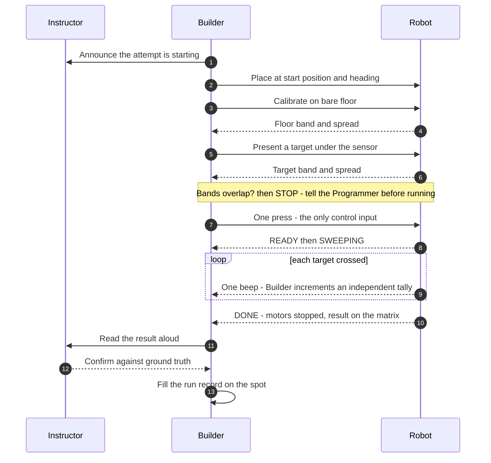

# Concept of Operations — Minesweeper Robot

> **Type:** ACTIVE-SPEC · **Created:** 2026-08-25 · **Owner of the operational role:** the **Builder**
> **Feeds:** Intro Report §1 (Introduction) and §3 (Systems Engineering Approach); the run-condition
> fields of §5 — [../course/report/outline.md](../course/report/outline.md)
> **Companions:** [requirements-traceability.md](./requirements-traceability.md) ·
> [verification-plan.md](./verification-plan.md) · [../runbooks/demo-day.md](../runbooks/demo-day.md) ·
> [known-unknowns.md](./known-unknowns.md) · [risk-register.md](./risk-register.md)

**This document is about OPERATIONS — how the system is used, by whom, in what order, and what the
operator does when it misbehaves.** It contains no design and no implementation; those live in
[../decisions/](../decisions/), [../hardware/](../hardware/), and `src/`.

**Status caveat that applies to every line below.** The mission was briefed verbally and is PARTIAL
([../scope.md § Mission](../scope.md#mission--partial-verbal-briefing-captured-2026-08-25)). Every
operational parameter the briefing does not fix is marked **`PENDING`** and carries the question number
that settles it ([questions-for-the-professor.md](./questions-for-the-professor.md)). Nothing here is
presented as agreed with the instructor unless it cites the course instructions.

---

## 1. The system in one paragraph

One robot, one operator, one arena, one run. The Builder places a self-contained SPIKE Prime robot at a
start position on the arena floor, calibrates it against *that* floor under *those* lights, presses run
once, and does not touch it again. The robot sweeps the bounded area on its own, signals each target it
counts, stops, and displays its result on the hub's own light matrix. The operator reads the result
aloud, the instructor confirms it against ground truth, and the operator writes down both numbers with
the conditions that produced them. **No laptop is attached at any point during the run.**

## 2. Actors and what each may touch

Role separation is a course rule, enforced at **−2 Schrute Bucks per violation** (course instructions
p.1). It is an *operational* constraint, not an organisational nicety: it decides who may recover a
stuck robot mid-demo.

| Actor | May, operationally | May **not** |
|---|---|---|
| **Builder** | Place, calibrate, start, stop, and physically handle the robot. The **only** operator. | Change the design at the table |
| **Programmer** | Plug the robot into their laptop and unplug it. That is the entire physical contact allowed. | Operate the robot, touch any other supply |
| **Designer** | Observe, direct, sketch | Touch supplies |
| **Supplier** | Buy/sell at the store, load the yellow box | Touch supplies once boxed, except to sell back |
| **Instructor** | Defines the arena, holds ground truth, confirms the result | — |
| **Robot** | Sweeps, counts, annunciates, stops | Report anything it did not observe |

Full seating-chart version, including the mid-demo part-change rule:
[../runbooks/demo-day.md § 0](../runbooks/demo-day.md).

## 3. Operating constraints

These are the constraints the *operations* must satisfy. They are the input to the CONOPS, not
conclusions from it.

| ID | Constraint | Source |
|---|---|---|
| **OC-1** | The **Builder is the only operator.** Nobody else touches the robot during a run, including to rescue it. | Course instructions p.1 |
| **OC-2** | **No laptop attached during the run.** The program runs standalone from the hub. | scope TR-3; Demo Day must not depend on a USB cable |
| **OC-3** | **One start action.** The operator's entire control input is a single press. There is no console, no parameter entry, no runtime configuration. | scope FR-1 |
| **OC-4** | **Calibration happens on the arena floor immediately before the run**, never carried over from a dry run on another surface. | scope TR-4; [../runbooks/demo-day.md § 4](../runbooks/demo-day.md) |
| **OC-5** | **No persisted state between classes.** Supplies live in the team's yellow box; the robot may be partly disassembled and the battery flat. Every run starts from cold. | Course instructions p.1 |
| **OC-6** | **Output is the 5×5 light matrix and the speaker.** Those are the only channels the operator and the instructor can read during and after a run. | OC-2 + hub hardware |
| **OC-7** | **Ground truth lives with the instructor, not the robot.** The robot's count is a claim; the operator records the claim *and* the truth, and never reconciles one to the other. **`[ASSUMED]`** that the instructor discloses the true count to the team at all — the scoring procedure is unknown (**Q8**). If they do not, P6 records the robot's claim alone and says so. | [../directives/honest-instrumentation.md](../directives/honest-instrumentation.md) |
| **OC-8** | **`PENDING` — hands-off policy.** Whether the Builder may intervene mid-run, how many attempts are allowed, and whether a time limit applies are unknown. | Professor **Q2** |
| **OC-9** | **`PENDING` — may a sample target be placed on the arena floor for calibration?** OC-4 assumes yes. If not, calibration must derive the target band some other way, which is a design change. | Ask in writing before the first dry run |

## 4. The nominal run, end to end

Eight phases, P0–P7. Each names the actor, the observable that says the phase succeeded, and what
gets written down. The step-level checklist the Builder actually holds is
[../runbooks/demo-day.md](../runbooks/demo-day.md); this is the operational shape of it.

| Phase | Actor | What happens | Observable that it worked | Recorded |
|---|---|---|---|---|
| **P0 Assemble / power** | Builder | Robot out of the yellow box, rebuilt to the port map, battery checked | Hub boots; ports match [../hardware/port-map.md](../hardware/port-map.md) | Battery level at start |
| **P1 Load** | Programmer | Plug in, download the program, **unplug**. Whether a program survives in a hub slot between classes is **`UNVERIFIED`** — the hub has never been connected, and OC-5 assumes nothing persists — so plan to load every time | Program appears in a hub slot and the cable is out | Slot number |
| **P2 Place** | Builder | Robot set at the start position and heading — the same one used to calibrate and in every dry run | Robot stationary, hands clear | Start position + heading |
| **P3 Calibrate** | Builder | On bare arena floor, then with a target under the sensor, in the arena's own light | Floor band and target band **do not overlap** | Both readings ± spread, surface, lighting |
| **P4 Arm and start** | Builder | One press. Announce to the instructor first. | Robot leaves READY and starts moving | Time of start |
| **P5 Sweep** | Robot | Autonomous lanes; one beep per counted target; operator keeps an independent audible tally | Beeps track visible targets; robot stays inside the boundary | Beep tally, anything surprising, verbatim |
| **P6 Report** | Robot → Builder | Robot stops, displays the result; Builder reads it aloud; instructor confirms against ground truth | Displayed count and beep tally agree | Robot count, TRUE count, per-colour, UNKNOWN count, duration |
| **P7 Record and pack out** | Builder | Fill the run record **before the next team's turn** | Form complete, no blank filled from memory | The whole block, into `docs/findings/` |

## 5. The operator's instrument panel

Under OC-2 and OC-6 the hub's matrix and speaker are the *entire* user interface. The operational
requirement they exist to meet: **a failure must be diagnosable from across the room, with no laptop.**

- The **per-target beep** is the point. It gives the Builder a tally that is *independent* of the number
  the robot prints. If the two disagree, that disagreement is the most valuable observation of the run
  and it goes in the record — it is never reconciled away.
- The proposed stage vocabulary (BOOT / SELF-CHECK / CALIBRATING / READY / SWEEPING / TARGET COUNTED /
  TURN / DONE / FAULT) is **`PROPOSED, NOT IMPLEMENTED`** and is specified in
  [../runbooks/demo-day.md § 5](../runbooks/demo-day.md). It is not repeated here.
- **`PENDING` on the Programmer:** FR-4 asks for per-colour counts, a total, **and** the number of
  unclassified readings, and a 5×5 matrix shows one number at a time. The order DONE steps through them
  must be agreed **in writing** before the first dry run, or the Builder will read the wrong number to
  the instructor. Tracked as a gap in [requirements-traceability.md](./requirements-traceability.md).

## 6. Operational scenarios

Four required scenarios, then two the same analysis produced. Each is written as: what triggers it,
what the operator *sees*, what the robot is intended to do, what the operator does, and what is unknown.

### OS-1 — Nominal run

- **Trigger:** P4, everything healthy.
- **Operator sees:** CALIBRATING → READY → SWEEPING, beeps at plausible intervals, straight lanes with
  square turns, DONE with the count displayed.
- **Robot behaviour:** exhaustive boustrophedon lanes; count on the confirmed falling edge of each
  target crossing; stop at the last lane.
- **Operator action:** hands off from P4 to P6. Keep the audible tally. Read the result aloud.
- **Record:** the full run record. **A nominal run still gets written up** — a success with no conditions
  recorded is not evidence.
- **`PENDING`:** total run time is unknown until the arena units are known (**Q1**), and may not fit the
  demo slot at all — [../findings/coverage-time-budget.md](../findings/coverage-time-budget.md).

### OS-2 — A mine sits on, or across, the boundary

- **Trigger:** a target is partly outside the swept area, or lies exactly on the boundary line.
- **Operator sees:** either a beep as the robot clips the note's edge, or silence over a note the
  operator can plainly see.
- **Robot behaviour, intended:** a note crossed at a short chord produces a *narrow* event. The detector
  gates events by width, so a sufficiently glancing clip is **rejected as noise and not counted** — the
  same mechanism that protects against a floor seam will discard a real mine grazed at the edge. That is
  a designed trade, and the operator must know it exists.
- **Operator action:** **hands off.** Note *where* the robot was when it happened. At P6, if the robot's
  count is short by exactly the number of boundary notes, say so — do not adjust anything.
- **`PENDING`:** whether mines can be placed on or across the boundary at all (**Q6**), and what bounds
  the area in the first place (**Q3**). Until Q3 is answered the robot has **no boundary sensing** and
  the boundary exists only in odometry — see [requirements-traceability.md](./requirements-traceability.md) FR-6.

### OS-3 — The robot drifts off heading

- **Trigger:** accumulated heading error. Expected, not exceptional: 1° over a 1.2 m lane costs ~21 mm of
  cross-track error, and lane pitch is only tens of millimetres
  ([../findings/coverage-time-budget.md](../findings/coverage-time-budget.md)).
- **Operator sees:** lanes visibly skewing; the end of a lane landing off the arena edge; in the worst
  case the robot crossing the boundary.
- **Robot behaviour, intended — `NOT IMPLEMENTED`:** each lane is *meant* to be re-squared at its end.
  Nothing does this yet (`src/` is empty), and until **Q3** says what bounds the area there is no
  external reference to square against. Note what re-squaring can and cannot do: a gyro re-zero stops
  *heading* error accumulating across lanes; the *lateral offset* already banked inside a drifted lane is
  not recovered by it. Coverage gaps, not double counts — the sweep visits each lane
  once by construction, so drift makes it *miss*, it does not make it *double-count*.
- **Operator action:** **still inside the arena → A3 HANDS OFF.** Drift is data; a drifted run that
  finishes yields a real coverage measurement, and an aborted run yields nothing. **Left the arena →
  A1 STOP**; the attempt is over, record it and ask the instructor whether a re-run is allowed. Never
  carry the robot back and resume.
- **Record:** where the drift became visible, and which lane number.

### OS-4 — An ambiguous colour reading

- **Trigger:** a detected target whose colour fits no calibrated band, or fits two.
- **Operator sees:** a beep — the target **is** counted — but the DONE display attributes it to UNKNOWN
  rather than to a colour.
- **Robot behaviour, intended:** classification is a *layer on top of* presence detection, never a
  prerequisite for counting. The detection is counted; the classification is reported as UNKNOWN with a
  reason (low signal / no match / ambiguous). **It is never forced into the nearest class.**
- **Operator action:** hands off. At P6 read out the UNKNOWN count as part of the result, not as a
  footnote. A high UNKNOWN count is a calibration finding, not an embarrassment.
- **`PENDING`:** whether colours other than yellow are in the arena at all (**Q5**). If they are not,
  this scenario disappears along with FR-2b.

### OS-5 — Calibration refuses to arm *(additional)*

- **Trigger:** at P3 the floor band and the target band overlap, or are too close to separate.
- **Operator sees:** the robot does not reach READY. It should fail loud and stay stopped.
- **Robot behaviour, intended:** calibration raises rather than producing a threshold that fires
  constantly or never. Refusing to run is the correct outcome.
- **Operator action:** **do not start the run.** Tell the Programmer *before* running, not after. Try
  the documented remedies in order — sensor height, ambient shielding, a different target colour — and
  record each attempt with its numbers.
- **Why it earns a scenario:** an unarmed robot at the table looks like a broken robot. It is not; it is
  the one failure mode that is announcing itself correctly.

### OS-6 — The hub powers off or the program dies mid-run *(additional)*

- **Trigger:** flat battery, knocked cable, program fault.
- **Operator sees:** matrix dark, or the FAULT pattern with a descending tone.
- **Operator action:** power-cycle and **restart the attempt from P3 — re-calibrate, do not resume.**
  A resumed run has no defined coverage and its count means nothing.
- **Record:** battery level at start (this is why P0 records it) and what the matrix showed at the moment
  it stopped.

## 7. When it misbehaves — the operating principle

The full symptom → action table is in [../runbooks/demo-day.md § 6](../runbooks/demo-day.md) and is not
repeated here. The **operational principle** behind it, which is the part that belongs in a CONOPS:

1. **Every symptom maps to exactly one pre-decided action.** The five atomic actions (STOP, RESTART,
   HANDS OFF, POWER CYCLE, CALL IT) are chosen in advance, in writing, and memorised. Nothing is
   improvised at the table, because a demo is the worst environment in which to invent a procedure.
2. **Drift is data; a wrong count honestly recorded is a result; an aborted run is nothing.** The default
   action is HANDS OFF, and the burden of proof is on intervening.
3. **Safety outranks the demo, every time.** About to hit a person or another team's equipment → STOP.
4. **Never grab a moving robot, and never let anyone but the Builder touch it** — the second half is a
   graded rule (OC-1), not a preference.
5. **`UNVERIFIED`:** every hub button behaviour the drill depends on — single-press-stops,
   single-press-relaunches, hold-to-power-off. The hub has never been connected. These must be confirmed
   on the first dry run and the runbook rewritten with what the hub actually did.

## 8. Operational parameters still unknown

Each of these changes how the robot is *operated*, not just how it is built. All are ranked and phrased
for asking in [questions-for-the-professor.md](./questions-for-the-professor.md), and tracked as open
rows in [known-unknowns.md](./known-unknowns.md) — this table is the *operational* view of them, not a
second register.

| Parameter | Operational consequence if unknown on Demo Day | Question |
|---|---|---|
| Arena units of "10×10" | Run duration unknown; the Builder cannot tell a stalled run from a slow one | **Q1** |
| Time limit, attempts, intervention allowed | The failure drill's "CALL IT" threshold is undefined; OC-8 stays open | **Q2** |
| Boundary type | The operator cannot tell an intended edge-turn from an escape | **Q3** |
| What "finds" delivers | P6 has no defined success statement to read aloud | **Q4** |
| Yellow only vs decoys | Decides whether P3 calibrates one target band or several, and whether OS-4 can occur | **Q5** |
| Mine count and placement | Whether a beep-tally mismatch is a bug or a boundary note (OS-2) | **Q6** |
| Floor surface, practice access | Whether P3 is a formality or the highest-risk step of the day | **Q7** |
| May a sample target be placed for calibration | OC-9 — if not, P3 as written is illegal | ask directly |

## 9. Deliberately not in this document

Mechanical design (the Designer's), the sweep and detection algorithms (`src/`, and
[../research/detection-and-sweep-techniques.md](../research/detection-and-sweep-techniques.md)), the
purchase strategy (the Supplier's), and the step-by-step checklist the Builder holds on the day
([../runbooks/demo-day.md](../runbooks/demo-day.md)). A CONOPS that drifts into design stops being
usable by the person who has to run the robot.
