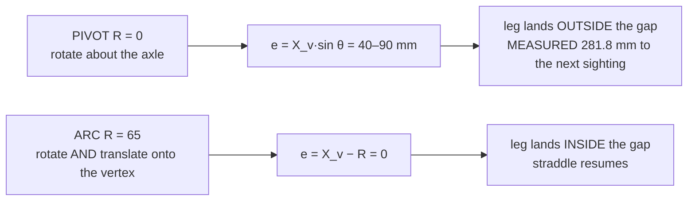
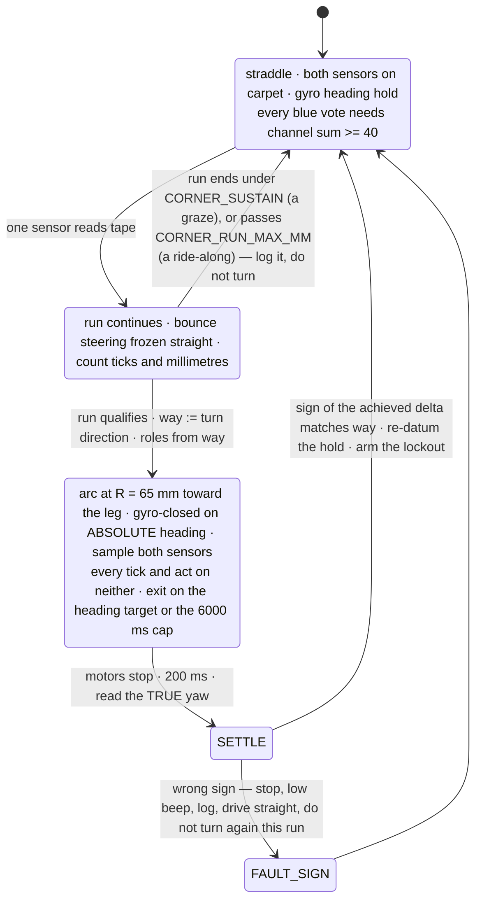
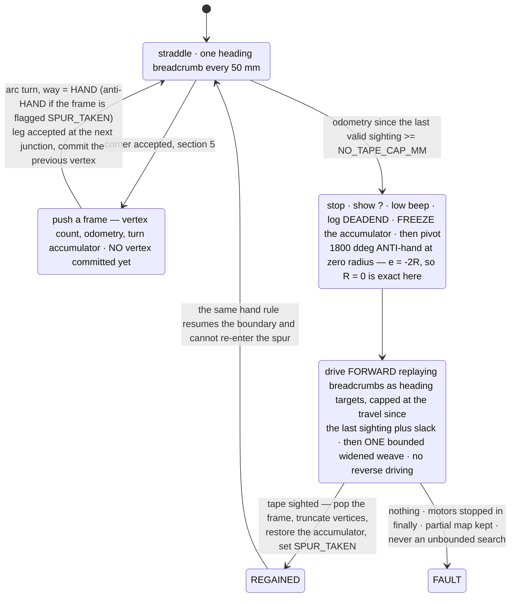

# Corner arc turns and line-loss recovery

**Date:** 2026-09-08 · **Status:** ACTIVE-SPEC · **Hub:** NOT connected — design only, nothing below has been run.
**Answers**
[2026-09-08-operator-briefing-corner-turns-to-competition.md](./2026-09-08-operator-briefing-corner-turns-to-competition.md)
§§ 1, 2, 4. Logs cited live in `tmp/telemetry/` and were re-analysed on the host this session.

## 1. TL;DR — the turn we will implement

Replace the in-place pivot in `examples/follow_tape.py` with a **constant-radius forward arc of
`CORNER_ARC_RADIUS_MM = 65`**, driven by the same two `motor.run()` calls at a computed inner/outer speed ratio and
closed on the same gyro test — because the exact radius is `R* = X_v·cot(θ/2)`, which at a square corner is just the
distance from the wheel axle to the corner vertex, and a pivot sets that to zero. The turn still **terminates on the
gyro**, not on a sensor: the operator's "outside sensor passes the tape's full width" is the *end state* the radius
delivers, and it is provably not observable *during* the arc. Two guards ship with it and matter more than the radius
does — a **minimum channel sum of 40** before any blue vote (a false 90° turn on channel totals of 3–4 is already in
the corpus), and a **1500 mm no-tape watchdog** so driving into the void becomes a logged stop instead of silence.

## 2. Why the pivot fails

Put the wheel-axis midpoint at distance **X_v** behind the corner vertex, heading along the incoming leg. A
differential drive's instantaneous centre must lie on the wheel-axis line, so the turn has one free parameter, the
signed radius **R**. Rotate through the corner angle **θ** and the sensor-pair midpoint ends up displaced from the
*new* leg's centreline by

```
e = X_v·sin(θ) − R·(1 − cos(θ))          [COMPUTED, re-derived and verified this session]
R* = X_v · cot(θ/2)                      (the R that makes e = 0)
```

Three consequences, two of which correct the briefing's framing. **`SENSOR_SPACING_MM` cancels out of the radius, and
so does `SENSOR_AHEAD_MM`** — both sensors are carried rigidly, so only the *pair's midpoint* must land on the leg;
spacing buys the **tolerance** `(S − W)/2`, not the radius. **At a square corner `R* = X_v` and `X_v ≈
SENSOR_AHEAD_MM`** — a pivot is `R = 0`, so `e = X_v·sin(θ)`: **the robot misses the new leg by one sensor-ahead
distance**, worst at exactly 90° where `sin θ` peaks, against a straddle tolerance of 27.3 mm (S=80) to 57.3 mm
(S=140) `[COMPUTED]`. No sensing or sign error need be invoked. And at **θ = 180°** the equation collapses to **`e =
−2R`**, so `R = 0` is uniquely correct — the operator's ruling that a zero-radius pivot is right for a dead-end U-turn
and wrong at a corner is the same equation at two angles.

**Measured proof it really is a pure pivot.** `…123226-followtape-0001250307.csv`, `phase=turn`, seq 105–134
`[MEASURED]`: mean wheel travel `(−ΔrelA + ΔrelB)/2` is 4.0 motor deg = **2.2 mm** of centre translation while yaw
moves −105 → −977 ddeg = **87.2° of rotation** — an effective radius of **≈ 1.4 mm** — and the next valid tape
sighting comes **281.8 mm later** (seq 242). This run is the citation for the fault in the Intro Report.



## 3. The arc turn

### 3.1 The radius: symbolic, then numeric

`X_v = SENSOR_AHEAD_MM + CORNER_LAG_MM`, the lag being travel between first tape contact and the turn commanding;
`SENSOR_AHEAD_MM` is `[UNMEASURED]`. **Table 1 — `R* = X_v·cot(θ/2)`, mm `[COMPUTED]`**, which at θ = 90° is simply
`R* = X_v`:

| X_v ↓ / θ → | 45° | 60° | 90° | 120° | 135° |
|---|---|---|---|---|---|
| 40 | 96.6 | 69.3 | 40.0 | 23.1 | 16.6 |
| **65** | 156.9 | 112.6 | **65.0** | 37.5 | 26.9 |
| 90 | 217.3 | 155.9 | 90.0 | 52.0 | 37.3 |

**Table 2 — the table the briefing asked for, across sensor spacings.** The radius is *the same* at every spacing;
spacing sets how far the turn may miss and still land the tape in the gap `[COMPUTED, W = TAPE_WIDTH_MM = 25.4
MEASURED]`:

| `SENSOR_SPACING_MM` | straddle tolerance `(S − W)/2` | X_v range survived by a fixed R = 65 |
|---|---|---|
| 80 | ±27.3 mm | 37.7 – 92.3 mm |
| 100 | ±37.3 mm | 27.7 – 102.3 mm |
| 120 | ±47.3 mm | 17.7 – 112.3 mm |
| 140 | ±57.3 mm | 7.7 – 122.3 mm |

**This is why the ruler reading is not a blocker.** A fixed `R = 65` mm lands the tape in the gap for every
`SENSOR_AHEAD_MM` between 38 and 92 mm at the *tightest* plausible spacing, and spacing is `[MEASURED]` to exceed 76
mm. Take the ruler reading to centre the estimate; do not let Thursday wait on it. **Non-square corners, fixed R = 65
at X_v = 65 `[COMPUTED]`:** e = +26.9 mm at 45°, +14.6 at 75°, 0 at 90°, −19.0 at 105°, −41.2 at 120°, −65.0 at 135° —
one fixed radius covers **45°–105° at every spacing** and 45°–120° at S ≥ 120, failing only on strongly obtuse
corners. Exterior turns of a closed border sum to 360°, so on a roughly rectangular arena they cluster at 90°.
Accepted risk, logged not designed around.

### 3.2 Wheel speeds, and why the coast constant transfers

`src/hub_drive.wheel_speeds_for_arc()` already implements the ratio `(R ± T/2)/R` with `TRACK_WIDTH_MM = 95.0
[MEASURED]`. At R = 65 mm and a centre speed of 60 mm/s `[COMPUTED]`: **inner wheel 16.2 mm/s = 29 dps · outer wheel
103.8 mm/s = 187 dps · 52.9 °/s, 90° in 1.70 s.** The present pivot MEASURED **51.1 °/s and 1.71 s** for its 87.2°
(same run, from `t_ms`) — a 3.5% match, so the angular rate and therefore the coast are unchanged by the switch and
`TURN_LEAD_DDEG` transfers without re-measurement. Outer speed is 20% of the 930 dps ceiling.

⚠ **The inner wheel at 29 dps is slower than anything yet driven on this robot** and may stick. The failure is soft:
a stalled inner wheel pivots the robot about that wheel, an effective R = T/2 = 47.5 mm, giving e = +17.5 mm at
X_v = 65 — still inside the gap at every spacing ≥ 80 `[COMPUTED]`. Log both wheel velocities through the turn.

### 3.3 Termination, and the bounded fallback

**Gyro-closed on an ABSOLUTE heading**, not a relative 900 ddeg: `target = leg_datum + 900·way`. A relative turn
carries the arrival heading error onto the new leg; an absolute target cancels it. The 1 ft square MEASURED four turns
summing −389.7° against −360 with 30° of final heading error
([border-trace-and-corners-2026-09-08.md](./border-trace-and-corners-2026-09-08.md) § 4.2).

**It does NOT terminate on a sensor, and here is the hard reason.** On any arc that also lands the straddle, the
outside sensor never crosses the perpendicular leg: it swings outward at `R + S/2` per radian while advancing at only
`SENSOR_AHEAD_MM` per radian, so it leaves the tape's band before it arrives — swept over R = 0–400 mm at all four
candidate spacings, it touches the leg only for radii far below `R*` `[COMPUTED]`. **The operator's condition is an
end state, and the geometry delivers it:** at turn end the outside sensor sits at `e − S/2` and the inside at `e +
S/2` against a leg spanning `±W/2`, so "outside past the far edge" is exactly `e < (S − W)/2` and "inside bumping the
near edge" is exactly `e > −(S − W)/2`. **His two sentences are the two bounds of the capture window and `R*` is its
midpoint** — his geometry sharpened, not overruled.

**Bounded fallbacks, in order.** (1) The existing **6000 ms cap** inside `gyro_turn()`, 3.5× the 1.70 s the turn needs
— keep it. (2) **Sign integrity check:** a commanded `ddeg > 0` must return a NEGATIVE achieved delta — MEASURED over
7 logged turns (`want900 → −846, −853, −855, −860, −881`; `want−900 → +840, +866`), consistent with positive yaw =
physically LEFT `[MEASURED]`. On disagreement log `FAULT_SIGN`, beep low, and stop turning for the run: four lines,
against three direction bugs in one day. (3) **`NO_TAPE_CAP_MM = 1500`** (§ 6.1).

## 4. Outside vs inside sensor

### 4.1 The definition — two lines, keyed to the turn, never to a port

```
# way > 0 = turn RIGHT (a commanded +ddeg; MEASURED to give a negative yaw delta)
inside_port, outside_port = (PC, PD) if way > 0 else (PD, PC)
```

Turning **left**, the LEFT sensor (port D) is inside and the RIGHT sensor (port C) is outside — the operator's own
statement. Geometric identity worth putting in the header comment: **the sensor that detected the corner is by
definition the inside sensor**, because the outgoing leg lies on only one side of the incoming centreline, so the turn
*starts* in the state the operator described as its finish.

### 4.2 The expected sighting sequence, and what each deviation means

Roles are **logged diagnostics, not terminators** (§ 3.3). Log `theta_in`, the arc angle at which the inside sensor
clears the leg — the one number that grades the radius.

| observation | meaning | action |
|---|---|---|
| inside on tape at trigger, clears at `theta_in` ≈ 20–60°, outside silent to the end | **nominal** | none |
| inside clears almost at once (< 10°) | radius too small for this X_v | increase `CORNER_ARC_RADIUS_MM` |
| inside never clears through the whole arc | radius above the upper bound, **or the trigger was a ride-along** | log `RIDE_ALONG_SUSPECT` |
| inside clears then RE-ACQUIRES late in the arc | radius above the upper bound; the pair crossed the leg and came back | reduce radius |
| **outside** sensor sees tape during the arc | grossly too small — the pair is sweeping past the leg; the pivot signature | reduce radius |

⚠ **The failing pivot already satisfies "inside sensor against the perpendicular tape", so that observation alone
cannot grade a turn.** MEASURED in the same turn: port C (its inside sensor) held valid tape — blue fraction
0.459–0.504 on channel sums 111–145 — for **26 of the 30 turn ticks**, clearing only at 79° of an 87° rotation.



## 5. When is it a corner

### 5.1 The 45° rule, made operational — as a CEILING, not a floor

A sensor crossing a strip of width W at incidence angle α sees an on-tape episode of length `run = W / sin α`
`[COMPUTED]`, which *decreases* with α: a perpendicular corner gives the **shortest** possible episode, a shallow
crossing the longest. So the operator's definition implements directly as **`CORNER_RUN_MAX_MM = TAPE_WIDTH_MM /
sin(CORNER_ANGLE_DEG) = 25.4 / sin 45° = 35.9 mm`** `[COMPUTED]` — **a crossing of 45° or steeper cannot produce an
episode longer than 35.9 mm.** One config value (`CORNER_ANGLE_DEG = 45`) carries the rule, and a different tape width
on demo day re-derives it. ⚠ This **inverts** the shipped rule: `CORNER_SUSTAIN = 4` reads "a corner is a *sustained*
run", which scores shallowness as cornerness — exactly why a drift ride-along fools it.

### 5.2 The measured ride-along, and why the ceiling separates it cleanly

All 35 on-tape episodes in the seven 2026-09-08 `follow_tape` runs, follow phase, channel sum ≥ 40, in mm of travel
`[MEASURED, re-extracted this session]` — port C (20): 117.5, 113.6, 83.1, 69.3, 66.5, 53.2, 46.5 · 22.2, 18.3, 15.5,
15.5, 15.5, 15.0, 10.5, 9.4, 9.4, 8.9, 4.4, 0.0, 0.0 — port D (15): 141.9, 138.5, 47.7 · 17.2, 14.4, 14.4, 14.4, 9.4,
2.8, 2.2, 2.2, 1.7, 1.7, 1.1, 0.0.

**Every episode is either ≤ 22.2 mm or ≥ 46.5 mm, and the 35.9 mm ceiling lands in the empty gap.** That is the
strongest empirical result here and it needs no new measurement. The one corner confirmable from telemetry
(`…-0001250307.csv` seq 93–104) shows port D ramping 0.444 → 0.483 blue over 12 ticks on healthy totals of 64–116 — a
real tape edge — with the turn firing at tick 4.

**Recommended rule.** Keep `CORNER_SUSTAIN = 4` as the floor; add the ceiling as a **veto** — a candidate run that
passes `CORNER_RUN_MAX_MM` without ending is a ride-along, so abandon it, log `RIDE_ALONG`, and resume the bounce
without turning. Freeze the bounce steering while a candidate is alive, or the controller curves the robot and changes
the angle the run is measuring. ⚠ **The trigger cannot measure the corner angle before committing:** `d(run)/dθ = 0`
at θ = 90°, so the estimator is blind exactly where corners live (90° and 75° differ by 0.9 mm, under one 2.4–2.9 mm
tick). Measure the vertex angle **after** the corner from the difference between the two legs' settled heading-hold
datums — not from the achieved gyro delta, which on a fixed-target turn only reports back what it was commanded.

### 5.3 The near-zero-signal guard, and the false corner already in the corpus

`on_tape()` guards only `tot <= 0`, so a reading of (1, 1, 2) returns a blue fraction of 0.500 and votes TAPE.
`MIN_CHAN_SUM = 40` exists in exactly one file, `examples/find_corner.py`, and was never ported. **This is not
hypothetical** — `…123219-followtape-0000312454.csv` `[MEASURED]`: seq 167, 168, 169 and 170 all read `C 1 1 2` (blue
fraction 0.500 on a channel total of 4), and seq 171 logs `reason=TURN_START_want900_from808`.

Four consecutive ticks of pure ADC quantisation met `CORNER_SUSTAIN` and commanded a 90° turn. Prevalence
`[MEASURED]`: channel sums < 40 are 337/1196 (28%), 189/1340 (14%) and 84/348 (24%) of samples in the three longest
runs, producing 35, 41 and 17 spurious blue votes. Tape totals are 111–145 and carpet 49–107, so a floor of 40 touches
neither class. **`MIN_CHAN_SUM = 40` is the highest-value line of code available and must land before the radius is
tuned**, or the geometry is being fixed on a trigger that fires on sensor dropout. `on_tape()` must return **`None`**
(no vote), not `False` — `False` is a vote for carpet, and the repo's reader rule is `None`, never a substituted
value.

⚠ **Second measured defect: the CORNER note is never logged.** `follow()` sets `box["note"] = "CORNER…"` then calls
`gyro_turn()`, which overwrites it before any `sample()` runs. **Zero CSVs in the corpus contain a CORNER row**
`[MEASURED, grep]` — which is why the `CORNER_SIDE_SIGN` question cannot be settled from data. One added
`sample("follow")` call makes the next run self-diagnosing.

### 5.4 Which way to turn — declare it, do not derive it

The geometry says the robot must turn **toward** the sensor that saw the leg, because the leg is not on the other
side. `CORNER_SIDE_SIGN = -1` says the opposite, fitted by observation — and the corpus shows why that fit is
untrustworthy: in `…-0001250307.csv` port D (LEFT) held the sustained run, the robot turned RIGHT (yaw −105 → −977;
positive yaw is physically LEFT `[MEASURED]`) — away from the sensor — and then lost the line for 281.8 mm.

**Do not flip `CORNER_SIDE_SIGN` on reasoning, mine or anyone's.** Adopt the **operator-declared hand** instead
([junction-handling-and-boundary-trace-2026-09-08.md](./junction-handling-and-boundary-trace-2026-09-08.md) § 1):
capture which arm button is tapped, show `LEFTA`/`RIGHTA` for a second so the Builder sees what the robot heard, and
turn `900 · HAND` at every accepted corner. On a convex closed border that is constant for a whole lap, immune to
drift and mounting, and it halves ride-along exposure for free because only the hand-side sensor is then eligible to
trigger. Keep the sensor-derived side as a logged cross-check.

## 6. Dead ends and backtracking

Post-demo (§ 7 tier 3), except the watchdog. Specified now because the operator asked for it.

### 6.1 The end-of-tape rule, in millimetres

While straddling, seeing no tape is the *normal* state, so "time since last sighting" cannot detect a loss — that was
v1's bug, which ended every run after 2 s. In millimetres `[MEASURED, 305 inter-sighting gaps across the seven runs]`:
300 of 305 are ≤ 141 mm and five exceed 320 mm (607.9, 379.6, 352.4, 349.7, 321.4), those five being candidate loss
episodes rather than cruising. Hence **`NO_TAPE_CAP_MM = 1500`** `[COMPUTED, 2.5x the largest gap ever observed]`,
which cannot false-positive on anything we have seen and sits far under the 22 m distance cap. It is a **runaway
watchdog, not a line-loss detector** — a perfectly straight robot on straight tape may legitimately sight nothing for
a long way — and its job is to turn "drove into the void until the 150 s time cap" into a stop with a distance. ⚠ **Do
not adopt a tight post-turn "acquire within 120 mm" test:** a geometrically *perfect* turn puts the leg dead centre in
the gap where neither sensor can see it, so a tight test flags the best possible turn as a failure. (The corpus does
separate one failed turn at 281.8 mm from six turns with tape on the next tick — but those six read tape because the
inside sensor was still parked on the corner patch, exactly as the pivot does.)

### 6.2 Backtracking: pivot first, then drive forward

The operator's order is reverse → regain → pivot 180 → continue. **Reverse the sequence**: pivot 180° at the loss
point, then drive **forward** replaying breadcrumbs. Identical end pose, and (a) it never drives backwards —
`TRACK_WIDTH_MM = 95` is the *effective* value measured from forward turns and folds in the caster's drag, in reverse
the caster leads and must flip 180° before the geometry is even defined, and there is not one reverse run of any
length in the corpus `[UNMEASURED]`; (b) re-acquisition then happens driving forward with the follower running, the
only configuration ever proven untethered (`examples/drive_to_tape.py`, `reason=TAPE_DETECTED`); (c) the 180° pivot
is `e = −2R`, so `R = 0` is exactly right — the one place the pivot is correct.

### 6.3 Memory, and what gets marked in the trace

Full fidelity is unnecessary: **the acceptance test for a retrace is a tape sighting, not a position**, so it need
only be good to the straddle half-gap, 27–57 mm. Push **one heading float per 50 mm of odometry into `array('f', 16)`
— 800 mm of history, ~80 B**, distance-indexed so it does not change meaning when the speed changes, degenerating to
"one recorded heading" when the spur is straight. Total recovery state ≈ 220 B (breadcrumbs 80 + junction frames 80 +
last sighting 16 + counters ~40); pre-allocate, never `append` in the loop. Stated honestly, a raw 20 Hz `(odometry,
heading)` ring costs only ~3 KB for an 800 mm spur against a documented 130–250 KiB free heap — **memory is not the
constraint, resolution is.**

No vertex is committed at a junction, because at that instant you do not yet know it is a spur: push a frame, and
commit the vertex only when the following leg is **accepted** (it ended at another junction, not a dead end), popping
and truncating on a dead end. CSV markers use the existing one-shot note field: `SPUR_ENTER j=<n> odo=<mm>` · `DEADEND
odo=<mm> len=<mm>` · `SPUR_RETURN j=<n>` · `RIDE_ALONG run=<mm>` · `FAULT_SIGN`. ⚠ **Freeze the turn accumulator
between `SPUR_ENTER` and `SPUR_RETURN`:** an out-and-back excursion with a hand-sense U-turn nets **+360°** into a
closure test whose window is only 120° wide, declaring a lap that never happened. (Belt and braces: command the
dead-end pivot **anti-hand**, `−1800 · HAND`.) The geometry may be left dirty at under half a percent of arena area —
under a hand rule only inward spurs are entered — but the accumulator may not.



## 7. Exact changes

### 7.1 Constants

| constant | value | file | basis |
|---|---|---|---|
| `MIN_CHAN_SUM` | 40 | `follow_tape.py` | `[COMPUTED]` from the surface survey: tape totals 111–145, carpet 49–107. The **need** is `[MEASURED]` — § 5.3 |
| `TAPE_WIDTH_MM` | 25.4 | `follow_tape.py` | `[MEASURED]`, test area; may differ on the day |
| `CORNER_ANGLE_DEG` | 45 | `follow_tape.py` | `[ASSUMED]`, the operator's working definition |
| `CORNER_RUN_MAX_MM` | 35.9 | derived | `[COMPUTED]` `TAPE_WIDTH_MM / sin(CORNER_ANGLE_DEG)` — § 5.1 |
| `CORNER_ARC_RADIUS_MM` | 65.0 | `follow_tape.py` | `[COMPUTED]` mid-range `SENSOR_AHEAD_MM`; survives X_v 37.7–92.3 at S = 80 |
| `CORNER_ARC_MMS` | 60.0 | `follow_tape.py` | `[COMPUTED]` so the arc's 52.9 °/s matches the pivot's MEASURED 51.1 °/s |
| `TRACK_WIDTH_MM` | 95.0 | `follow_tape.py` | `[MEASURED]`, mirrored from `hub_drive` (`config` is shadowed on the hub, KU-M38) |
| `TURN_LEAD_DDEG` | 70 → **28** | both | `[MEASURED, N=7]` — below |
| `NO_TAPE_CAP_MM` | 1500 | `follow_tape.py` | `[COMPUTED]` 2.5× the largest observed inter-sighting gap of 607.9 mm |

**`TURN_LEAD_DDEG` is now closed, and 70 is wrong by 2.5×.** Seven logged turns (`want900 → −846, −853, −855, −860,
−881`; `want−900 → +840, +866`) have mean magnitude **857.3 ddeg** against a commanded 900; with the loop breaking at
900 − 70 = 830, the true coast is **27.3 ddeg**. Independently, the MEASURED turn-phase loop period of 59 ms × the
MEASURED 511 ddeg/s yaw rate = 30 ddeg of detection latency. **The "coast" is one loop tick, not momentum** — which
also reconciles the disputed 70-vs-37 readings, since the calibration run turned at a different speed. 70 costs 4.2°
of under-turn per corner.

### 7.2 Functions touched

| file · function | change | lines |
|---|---|---|
| `follow_tape.py` · `on_tape()` | add the `MIN_CHAN_SUM` floor; return **`None`** not `False` when unreadable | ~4 |
| `follow_tape.py` · `follow()` loop | treat `None` as no vote (`is True` tests, not truthiness); add the `NO_TAPE_CAP_MM` watchdog on odometry since the last valid sighting | ~10 |
| `follow_tape.py` · `gyro_turn()` | replace the two opposed `motor.run()` calls with the arc ratio; absolute heading target; roles two-liner; sign integrity check | ~12 |
| `follow_tape.py` · corner branch | one `sample("follow")` after setting the CORNER note, before `gyro_turn()` | 1 |
| `follow_tape.py` module scope | the constants above plus the derived inner/outer dps, computed **once** — no floats in the loop | ~14 |
| `src/hub_drive.py` | `TURN_LEAD_DDEG` 70 → 28 with the N=7 evidence in the comment. **Nothing else** | 1 |
| `examples/calibrate_directions.py` lines 176–177 | ⚠ swap "POSITIVE"/"NEGATIVE": with `TURN_SIGN = 1` a right spin gives a **negative** delta and the printed advice says the opposite — a fourth direction bug pre-loaded into the next calibration | 2 |

**Tier 2, if there is time:** the `CORNER_RUN_MAX_MM` ride-along veto with steering frozen during a candidate run (~10
lines, § 5.2), and the operator-declared `HAND` at arm time (~8 lines, § 5.4). **Tier 3, post-demo:** everything in §
6 except the watchdog.

### 7.3 What must NOT be touched — it already works

* `BLUE_FRAC_MIN = 0.44` and the blue-fraction rule — `[MEASURED]` gap carpet 0.408 → tape 0.476, proven untethered by
  `examples/drive_to_tape.py`.
* The **straddle-and-bounce** steering and its side mapping (D = LEFT, C = RIGHT); swap them and the robot steers away
  from the line. Also `FORWARD_SIGN`, `LEFT_FWD`, `RIGHT_FWD`, `TURN_SIGN`, the 6000 ms turn cap, the 200 ms settle,
  the `TURN_END_` line, and `motor.stop()` in `finally:`.
* `HOLD_SIGN = -1`, `HOLD_KP`, `HOLD_MAX_DPS`, `HOLD_DIVERGE_TICKS` — both signs were bought with a wasted 40 s
  circling run ([../lessons_learned/guard-every-feedback-loop.md](../lessons_learned/guard-every-feedback-loop.md)).
* `CORNER_SIDE_SIGN` — do not flip it on reasoning (§ 5.4). Supersede it with `HAND`, or leave it.
* `src/hub_drive.arc()` / `wheel_speeds_for_arc()` are **correct but have never run on the floor**, and
  `follow_tape.py` does not import `hub_drive` at all — compute the two wheel speeds inline rather than adding a
  deploy dependency two days out (KU-M38: an upload can hash-verify and still die at import). And
  `hub_drive.turn_by()` is **synchronous**: it would block the runloop for the whole turn.

## 8. The bench test, and what would falsify this

**BM-C2, ~15 minutes, no new code beyond the changes above.** Roles enforced: Builder places and operates the robot,
Supplier owns the tape, Designer records, Programmer plugs and unplugs only.

1. **Ruler first, 60 seconds** — `SENSOR_AHEAD_MM` (axle centreline → sensor spot centre), `SENSOR_SPACING_MM` (spot
   centre → spot centre), whether the sensors are laterally **symmetric** about the centreline, and the width of an
   actual hand-laid **corner patch** as distinct from mid-edge tape.
2. **`MIN_CHAN_SUM` alone** — add the guard, change nothing else, run the same corner five times and count the turns
   that lose the line. This separates "geometry problem" from "false-trigger problem".
3. **Then the arc**, same corner, five runs at `CORNER_ARC_RADIUS_MM = 65`. Pass: the straddle bounce resumes within
   150 mm of the turn end on ≥ 4 of 5, and no run trips `NO_TAPE_CAP_MM`. Record `theta_in` and both wheel velocities
   every turn. Then **ten turns at 40 dps and ten at 80 dps**, testing whether the coast scales with turn rate as §
   7.1 predicts.

**Falsifiers, written before the run so they cannot be rationalised afterwards.** `SENSOR_AHEAD_MM` outside 38–92 mm
→ `R = 65` is wrong; change the one number, not the design. A corner patch wider than ~40 mm → every `(S − W)/2`
tolerance here is wrong (already suspicious: in the pivot the inside sensor held tape through 79° of rotation, which
a straight 25.4 mm strip can only produce under a near-tangency coincidence). Turns with `MIN_CHAN_SUM` in place
still losing the line at the same rate → the trigger was never the problem and the radius is the whole story, which
is what this document assumes. A 45° corner producing an episode longer than 35.9 mm → the run-ceiling rule is
wrong. (An inner wheel stalling at 29 dps is a benign failure, § 3.2, not a falsifier.)

## 9. Open questions

1. ⚠ **`SENSOR_SPACING_MM` is `[UNMEASURED]`** — known only to exceed 76 mm `[MEASURED]`. It sets the straddle
   tolerance `(S − W)/2`, i.e. how much radius error the turn may absorb. It does **not** set the radius, and § 3.1
   shows a fixed R = 65 works at every spacing ≥ 80 across the plausible sensor-ahead range — so it is the
   highest-priority measurement but **not** a Thursday blocker (KU-M33).
2. ⚠ **`SENSOR_AHEAD_MM` is `[UNMEASURED]`** and is what the radius is actually made of. One ruler reading, ±7 mm
   ample. Still a literal placeholder in `../hardware/build-record.md`.
3. **Are the sensors laterally symmetric, and is the corner patch wider than the tape?** The derivation assumes ±S/2
   and W = 25.4; an asymmetry shifts the required radius by that amount and is invisible in every log, and a wider
   patch needs a sibling `CORNER_PATCH_MM` — the divisor in the run ceiling too. Same ruler reading (§ 8).
4. **Which uploaded program is current?** The corpus holds seven slot ids with different constants and
   `follow_tape.py` is untracked, so git cannot date the edits. "Turns onto nothing" has **one** supporting run
   against six turns in `…-0000456461` that ended with tape immediately visible — the failure is not yet shown to be
   deterministic.
5. **Is the pivot coast speed-dependent?** All logged turns are at `BASE_DPS = 80`; § 7.1 predicts the coast is one
   loop tick × turn rate, and nothing has tested it. **`CORNER_SIDE_SIGN`** likewise needs one deliberate run (§ 5.4);
   the declared hand makes it moot. And **how long is the demo slot?** `config.RUN_TIMEBOX_S = 300` is `[ASSUMED]` and
   [border-trace-and-corners-2026-09-08.md](./border-trace-and-corners-2026-09-08.md) § 6.4 refutes 300 s for a 10 ft
   arena — one question to the professor.
6. ⚠ **Priority check the operator should make deliberately.**
   [../findings/line-following-viability-2026-09-08.md](../findings/line-following-viability-2026-09-08.md) § 1,
   written the same day, says *do not pursue line following for Demo Day* and ranks "make `src/hub_color.py` read
   `SECOND_COLOR_PORT`" first — still true today, and worth 38 lanes instead of 75. `src/main.py` has never run on
   hardware (KU-M29) and `config.DETECT_MODE` still defaults to the anomaly front-end that MEASURED 0% on yellow. The
   corner arc refines an ungraded capability. **Ship `MIN_CHAN_SUM`, the arc and the watchdog — then spend the rest of
   the two days on the graded sweep.**
