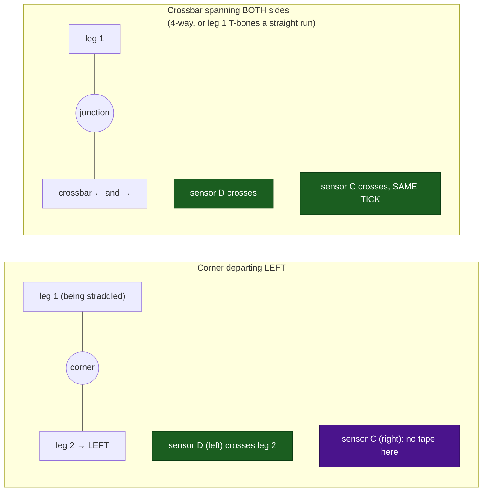
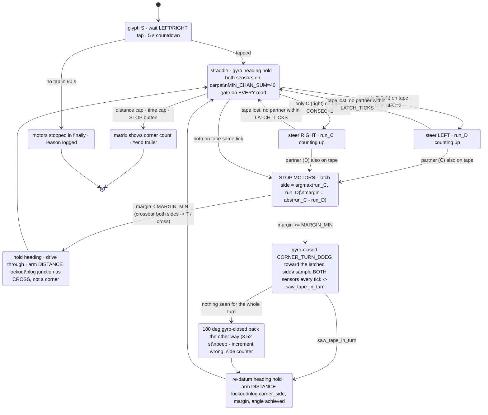

# Plan — Which way to turn at a corner, with two downward sensors and nothing else

**Date:** 2026-09-08 · **Demo Day:** 2026-09-10 (two days) · **Status:** ANALYSIS COMPLETE, **no hardware
touched** · **Type:** ACTIVE-SPEC

**Question answered:** the operator's single biggest complaint — *"it really turns hard and has a 50 %
chance of going the right way after the corner."*

**Sources analysed, all recomputed on the host:**
[`examples/follow_tape.py`](../../examples/follow_tape.py) ·
[`examples/find_corner.py`](../../examples/find_corner.py) ·
`tmp/telemetry/20260908T120015-followtape-0001250307.csv` (598 rows, the 12:00 demo — the "better
tracking" run) · `tmp/telemetry/20260908T114003-followtape-0000102164.csv` (670 rows, the circling run) ·
`tmp/telemetry/20260908T112501-followtape-0000360435.csv` (44 rows, v1, no detections)

**Related and not superseded:** [line-following-viability-2026-09-08.md](../findings/line-following-viability-2026-09-08.md)
(recommends *against* line following for Demo Day) · [border-trace-and-corners-2026-09-08.md](./border-trace-and-corners-2026-09-08.md)
(the touch-stitching alternative, and the source of `MIN_CHAN_SUM`). This plan does not re-open that
argument. The operator is flying the line follower today; this is how to make its corner turn correct.

---

## 1. TL;DR — the answer, first

> **The robot already knows which way to turn, 400–600 ms before it declares the corner. It is throwing
> the information away.**

At a junction the two sensors do **not** trip on the same tick. In every junction in every log, one
sensor was continuously on tape for **4 to 23 ticks** before the other one arrived. **Turn toward the
sensor that got there first.**

| | |
|---|---|
| **Recommendation** | **Approach 1 — first-sensor latch**, arbitrated by the two sensors' *continuous-on run lengths* at the moment of coincidence |
| **Cost per corner** | **0 s.** The decision uses data already sampled in the existing loop. The turn itself still costs the **1.71 s** [MEASURED] the robot pays today |
| **Cost when it is wrong** | **+3.5 s** [COMPUTED] — a 180° gyro-closed correction, triggered by a confirmation that runs *during* the turn and is therefore also free |
| **Code size** | **~25 lines**: two counters, one comparison, a sign argument on `gyro_turn`, one tape test inside the turn loop |
| **Evidence strength** | ⚠ **The mechanism rests on 4 junctions; the direction-correctness claim rests on exactly 1.** See § 7. This is a demo-grade fix, not a proven one |
| **The one bench test that must happen first** | **BM-C1** (§ 8) — 60 seconds, no new code. It measures the *fore-aft mounting bias* between the two sensors, which is [UNMEASURED] and is the only thing that can silently invert this decision |

Two supporting fixes fall out of the same analysis and are worth more than they cost:

* **`on_tape()` has no low-light floor.** It computes `b/(r+g+b)` on totals as low as **0** and returns
  `True` on a `1,0,2` read. `find_corner.py` already fixed this with `MIN_CHAN_SUM = 40`;
  `follow_tape.py` never got it. **17–30 % of all tape trips in the two live logs are quantisation
  garbage** [MEASURED, § 2.1].
* **The corner lockout is a *time* lockout of 1.5 s ≈ 67 mm** [COMPUTED at the measured 44.7 mm/s]. The
  shortest leg the robot will ever see is a 1 ft test box side, 305 mm. Make it a **distance** lockout
  (§ 5.4). This is also the cheapest partial answer to the T-spur problem.

---

## 2. What the logs actually say

### 2.1 First: half the "detections" are not detections

`on_tape()` in [`follow_tape.py`](../../examples/follow_tape.py) guards only `tot <= 0`. Below ~40 counts
the ratio is quantisation noise: a `1,0,2` read gives exactly **0.667**, and `0,0,2` gives **1.000** —
both sail past `BLUE_FRAC_MIN = 0.44`.

In the 12:00 run the sensors go **dark from seq 381 (t = 23.3 s) to the end of the file** —
`reflection()` = 0 and RGB totals of **0–8** on both ports, with `accz` swinging 708 → 1182 mg and yaw
slewing ~190 °/s. That is the lift-and-carry signature, not a floor reading. It produced **60 spurious
blue-crossing edges**, including 12 both-sensor coincidences.

Applying the project's own already-measured constant `MIN_CHAN_SUM = 40`
([border-trace plan § 3.2](./border-trace-and-corners-2026-09-08.md), basis: carpet total 49–107):

| Log | tape-rule trips, ungated | with `MIN_CHAN_SUM = 40` | spurious, removed |
|---|---|---|---|
| `…120015-followtape-0001250307.csv` | 118 | 83 | **35 (30 %)** |
| `…114003-followtape-0000102164.csv` | 246 | 205 | **41 (17 %)** |

The gate **cannot** cost a real detection on this data: every confidently-tape sample in the two runs
(blue fraction ≥ 0.44 on a valid total) has an RGB total of **81–145** [MEASURED, n = 83]. The highest
total among the rejected rows is **23**. The margin is 3.5×.

**Do this first.** Everything below assumes it, because without it the "which sensor first" comparison is
being fed noise.

### 2.2 The two triggers are never simultaneous

Method: gate at `MIN_CHAN_SUM = 40`, debounce each sensor independently with the project's proven
`CONSEC_NEEDED = 2` ([`drive_to_tape.py`](../../examples/drive_to_tape.py) ran that value untethered),
then find every tick where **both** debounced sensors read tape, and read off how long each had been
*continuously* on tape at that instant.

| Log | junction at | `run_C` (right) | `run_D` (left) | arrived first | margin |
|---|---|---|---|---|---|
| 12:00 (clean) | seq 104, t = 6196 ms | 2 ticks | **9 ticks** | **LEFT (port D)** | 7 ticks / 350 ms |
| 11:40 (circling) | seq 226, t = 13436 ms | **8 ticks** | 2 | RIGHT (port C) | 6 ticks / 300 ms |
| 11:40 (circling) | seq 398, t = 23630 ms | **25 ticks** | 2 | RIGHT (port C) | 23 ticks / 1.2 s |
| 11:40 (circling) | seq 465, t = 27629 ms | **6 ticks** | 2 | RIGHT (port C) | 4 ticks / 200 ms |

> **Ties: 0 of 4. Minimum margin: 4 ticks = 200 ms = 8.9 mm of travel.**

This is the direct answer to the question the task posed. **The C and D triggers do not arrive on the
same tick and this approach is not rejected.** The standard two-sensor line-follower literature assumes
they *do* — [the Arduino forum consensus](https://forum.arduino.cc/t/line-follower-reliably-dealing-with-a-t-junction/440762)
is that two sensors cannot separate a line from a junction, and the
[junction-counting work](https://files01.core.ac.uk/download/pdf/229655734.pdf) treats simultaneous
detection as the definition of a junction. That assumption holds for a *narrow* centre-following pair.
It does **not** hold for our geometry, and the reason is § 3.

For contrast, plain steering-drift bounces in the same logs are **single-sensor** episodes of 4–31 ticks
with the partner never arriving (13 of them across the two runs). A junction and a drift are cleanly
separable by "did the other sensor show up within ~15 ticks."

### 2.3 The 12:00 corner was turned the wrong way, and the sensors knew

At seq 104 the left sensor (port D) had been on tape for **9 ticks**; the right (port C) for 2. The
program then executed its fixed `CORNER_TURN_DDEG = +900`, and the log shows the turn phase carrying yaw
from **−105 to −977 ddeg — a right turn of 87.2°** away from the side that saw the tape.

That single corner *is* the operator's complaint, in the data.

### 2.4 Numbers this plan uses, and where they come from

| Quantity | Value | Kind | Source |
|---|---|---|---|
| Forward speed at `BASE_DPS = 80` | **44.7 mm/s** | MEASURED | 12:00 run, 1866 encoder-deg over 23.16 s, 63.5 mm wheel |
| …cross-check | 44.3 mm/s | COMPUTED | 80 °/s ÷ 360 × 199.49 mm — agrees to 1 % |
| Pivot rate, both wheels ±`BASE_DPS` | **51.1 °/s** | MEASURED | 12:00 run turn phase, −87.2° in 1.71 s |
| …cross-check | 53.4 °/s | COMPUTED | 2 × 44.3 mm/s ÷ 95 mm track — agrees to 4 % |
| A 90° gyro-closed corner turn | **1.71 s** | MEASURED | same |
| A 180° recovery turn | **3.52 s** | COMPUTED | 180 ÷ 51.1 |
| One tick of travel at 20 Hz | **2.24 mm** | COMPUTED | 44.7 mm/s × 0.05 s |
| Tape crossing time, perpendicular | **11 ticks** | COMPUTED | 25 mm ÷ 2.24 mm/tick — and port D was on for 14 ticks at the 12:00 corner |
| Longest clean run with **no** tape contact | **5.9 s** (112 ticks) | MEASURED | 12:00 run, seq 130 → 242 |
| Sensor lateral spacing `S` | **> 76 mm** | MEASURED (bound only) | [port-map.md](../hardware/port-map.md) — exact value **[UNMEASURED]** |
| Sensor **fore-aft** offset between C and D | — | **[UNMEASURED]** | ⚠ nothing in the repo measures this. § 8 |

---

## 3. Why the ordering exists at all — the geometry

The robot **straddles**: the tape lies in the gap between the sensors, both read carpet. So the only
tape a sensor can meet is tape that is *not* the leg being followed.

At a corner, the departing leg goes to **one side only**. Whichever sensor is on that side is the only
one that can cross it.



Two consequences, and they are the whole design:

1. **A one-sided junction gives a one-sided first touch.** Turn toward it.
2. **A two-sided crossbar gives a simultaneous touch.** A tie therefore *means something*: the tape
   continues across, so **go straight** rather than turn. That is the T-intersection branch (§ 6),
   obtained for free from the same comparison.

**Why the partner sensor arrives at all, ~7 ticks later.** Two mechanisms, both present:
the bounce controller reacts (`drive(TURN_DPS, BASE_DPS)` on a left touch) and swings the body toward
the leg — MEASURED at the 12:00 corner as **+5.8° over 8 ticks = 13.7 °/s**, against **11.7 °/s**
COMPUTED from the 80/45 dps differential on a 95 mm track, agreeing to 17 %; and the robot advances
27 mm in that time, comparable to the 25 mm tape width. Either way the *ordering* is what carries the
information, and the ordering is what we read.

⚠ **This is why the exact sensor spacing does not matter and the fore-aft offset does.** The decision
uses only *which* sensor was first, which is scale-free in `S`. But if one sensor is mounted a few mm
**ahead** of the other — entirely plausible on a hand-built LEGO chassis, and **[UNMEASURED]** — that
offset is a *constant bias* in the ordering. 5 mm of fore-aft offset = **2.2 ticks** of permanent lead,
which is half the smallest measured margin. **Say this out loud to the Builder.** § 8 closes it in a
minute.

---

## 4. The five approaches, rated

Ratings are against the two-day deadline and the two-downward-sensor constraint.

| # | Approach | Reliability | Time / corner | Code | Risk | Verdict |
|---|---|---|---|---|---|---|
| **1** | **First-sensor latch** | 4/4 junctions decided, 0 ties, min margin 4 ticks [MEASURED]; correctness rests on 1 clean corner | **0 s** (decision) + the 1.71 s turn already paid | **~25 lines** | Fore-aft mounting bias (§ 8) can invert it; N = 1 for correctness | ✅ **ADOPT** |
| 2 | Scan-rotate probe | **Geometrically broken here** — see below | ~6.5 s | ~40 lines | High | ❌ Reject |
| 3 | Nudge-and-test | Needs a "did I reacquire?" test the straddle cannot give in under ~6 s | 6.4 s best, **16.6 s** worst, ~11.5 s expected | ~60 lines | High: reverses blind, can leave the arena | ❌ Reject for Thursday |
| 4 | Consistent hand rule | 100 % on a **convex** polygon in a known direction; **wrong at every concave corner**; turns onto spurs | 0 s | ~2 lines | Operator must set the direction; fails the stated mission | ⚠ **Keep as the tie-break fallback only** |
| 5 | Odometry prior | Useless on lap 1, and Demo Day is one lap | 0 s | ~15 lines | Low | ⚠ **Log it, don't act on it** |

### 4.1 Why the scan-rotate probe fails on *this* robot

A pivot in place moves the sensors on a circle of radius `S/2` ≥ 38 mm about the pivot centre. **It
samples an annulus, not an area.** It can only find tape that happens to pass within ~40 mm of wherever
the robot stopped.

And the robot does **not** stop at the corner. It declares the junction on the coincidence tick, which is
**8 ticks after** the leading sensor first touched (MEASURED at the 12:00 corner: D rose seq 96,
coincidence seq 104), plus the 2-tick `BOTH_TICKS` debounce, plus ~3 mm of coast [MEASURED]:

> **stop point ≈ 19 + 4.5 + 3 = 27 mm past the corner** [COMPUTED at 2.24 mm/tick]

27 mm against a 38 mm sweep radius. The probe is searching a ring that the corner is sitting on the edge
of. Add the ±12.5 mm mount wobble ([colour-sensor-mounting-wobble-2026-09-03.md](../findings/colour-sensor-mounting-wobble-2026-09-03.md))
and it is inside the noise.

Cost, for the record: ±100° of arc = 200° at 51.1 °/s = **3.91 s**, plus up to 100° = 1.96 s to settle on
the chosen heading, plus two settle pauses ≈ **6.5 s per corner**. Four corners = 26 s out of a 40 s cap.
It is the most expensive option *and* the least likely to work. Reject on both counts.

### 4.2 Why nudge-and-test fails

Its success test is "did I reacquire the line?" — and **the straddle geometry cannot answer that
quickly**, because *on the line* and *lost in open carpet* produce the identical reading: both sensors on
carpet. The only evidence of being on the line is an occasional bounce touch, and the MEASURED gap
between touches on a clean straight leg is **5.9 s**. A test that needs 6 s to return "yes" cannot be
run twice inside a corner.

This is worth stating plainly because it also kills the more elegant "probe straight through the junction
and see whether the leg continues" idea, which would otherwise have solved the T-spur problem outright.

### 4.3 Why the hand rule is not the minimal answer here

It is genuinely tempting: on a **convex** closed boundary traversed in one direction, *every* corner
turns the same way, so always-left needs no decision and is right 4 times out of 4. And the project has
already decided how to supply the direction — `SIDE = ±1`, **[OPERATOR SETS]**, *"the program must not
guess"* ([border-trace plan § 3.2](./border-trace-and-corners-2026-09-08.md)).

It fails on the mission as briefed, for two independent reasons:

* The operator states corners **may be inset into the area**. A concave corner turns the *opposite* way
  from the convex ones on the same boundary. A fixed hand is wrong at every one of them.
* At a spur it turns **onto the spur**, leaving the outer boundary — the exact opposite of requirement (c).

Keep it only as the **tie-break**: when the two run lengths are within `MARGIN_MIN`, the sensors are
saying "crossbar both sides", and the correct action is *straight* — but if the operator has told the
program which way round the box it is going, a same-hand turn is a defensible second choice. Ship it as
a config value (`TIE_ACTION = "straight" | "hand"`), defaulted to `"straight"`.

### 4.4 What is worth keeping from the odometry prior

Nothing that acts on lap 1. One thing that **records**: on a convex rectangle all four corners share a
sign. Once two corners agree, a third disagreeing corner is either a genuine concave corner or a
mis-decision. **Log `corner_side` per corner in the `#end` trailer.** Zero risk, and it is the evidence
that tells the operator on Thursday evening whether the latch worked. That is a report artefact, not a
behaviour.

---

## 5. The design

### 5.1 State machine



### 5.2 The decision, in the smallest code that expresses it

Two counters and one comparison. This replaces the `if left_tape and right_tape` block; it does not add
a state variable that outlives the junction.

```python
MIN_CHAN_SUM = 40      # [MEASURED] carpet total 49-107, tape total 81-145; below 40 the ratio is
                       # quantisation garbage (1,0,2 reads exactly 0.667). Same constant, same basis,
                       # as find_corner.py -- this file simply never got it.
CONSEC_NEEDED = 2      # [MEASURED/PROVEN] the value drive_to_tape.py actually ran
MARGIN_MIN = 2         # [ASSUMED, with margin] smallest MEASURED junction margin is 4 ticks
LATCH_TICKS = 15       # [MEASURED + 36% margin] largest lead seen is 11 ticks

# ... per tick, after the gated + debounced reads:
run_c = run_c + 1 if right_tape else 0
run_d = run_d + 1 if left_tape else 0

if left_tape and right_tape and not locked:
    margin = run_c - run_d
    if abs(margin) < MARGIN_MIN:
        side = 0                       # crossbar both sides -> a CROSS, not a corner: drive through
    else:
        side = +1 if margin > 0 else -1   # +1 = RIGHT (port C got there first), -1 = LEFT (port D)
```

`gyro_turn` needs one argument. Its current body drives `PL` forward / `PR` backward, which the 12:00 log
shows produces **decreasing yaw = a right turn** [MEASURED]. So:

```python
async def gyro_turn(ddeg, side):          # side +1 = right (the PROVEN direction), -1 = left
    motor.run(PL,  side * LEFT_FWD  * BASE_DPS)
    motor.run(PR, -side * RIGHT_FWD * BASE_DPS)
    # exit test unchanged: abs(norm_ddeg(y - y0)) >= abs(ddeg)
```

### 5.3 The confirmation is free, because it happens inside the turn

The turn loop already calls `sample("turn")` every tick but never looks at the result. Look at it.

**Claim:** turning *toward* the departing leg pivots the robot onto tape, so at least one sensor should
trip during the turn. Turning *away* from it pivots into open carpet.

**Evidence, and its limit:** at the 12:00 corner the program turned the *wrong* way and port C still read
0.49 blue on totals of 123–137 for 28 straight ticks through the turn — it was parked on tape the whole
time. So `saw_tape_in_turn` is **not** a clean proof of correctness. What it *is*, honestly, is a
detector for the failure mode that matters most: **turning into empty carpet and losing the boundary
entirely.** Treat it as a cheap veto, not a verdict, and log it either way.

`RECOVER` costs **3.52 s** and only fires when the turn found nothing at all.

### 5.4 Replace the time lockout with a distance lockout

`CORNER_LOCKOUT_MS = 1500` is armed *after* the turn completes, so it suppresses **1.5 s × 44.7 mm/s =
67 mm** of driving. The shortest leg the robot will ever meet is a 1 ft test-box side at **305 mm**;
the stated competition arena is **3048 mm** per side. 67 mm is not a lockout, it is a rounding error.

```python
CORNER_LOCKOUT_MM = 250    # [ASSUMED] must sit BELOW the shortest leg the robot will meet.
                           # 1 ft test box = 305 mm side -> 250 fits. Competition 3048 mm -> raise
                           # to 1000 on the day. One value, one edit, no architecture change.
```
Arm it on the encoder reading, not the clock. This also does real work on the T-spur problem (§ 6).

---

## 6. T-intersections and the outermost boundary — the honest position

**What the design gets for free:**

* A **crossbar spanning both sides** (a 4-way cross, or the current leg T-boning a straight run of tape)
  produces a **tie**, and the tie branch drives **straight through** and logs it as `CROSS`, not a
  corner. That is the correct behaviour and it costs one comparison. ⚠ **0 of 4 measured junctions were
  ties, so this branch is UNTESTED on hardware.**
* A **spur close behind a corner** is vetoed by the distance lockout (§ 5.4).

**What it does not solve, and must not be claimed to:**

> A spur departing to one side of a straight leg is **geometrically identical** to a corner departing to
> that side, at the instant the sensors cross it. Two downward sensors cannot separate them.

The only local discriminator is "does the current leg continue past the junction?", and § 4.2 shows the
straddle cannot answer that in under ~6 s. There is no forward-looking sensor — the distance sensor was
evaluated and rejected ([distance-sensor-evaluation-2026-09-08.md](../research/distance-sensor-evaluation-2026-09-08.md)),
and ports E and F are empty.

**Therefore, for Thursday:** do not attempt outermost-boundary topology. The robot has never completed a
lap; [border-trace § 4.2](./border-trace-and-corners-2026-09-08.md) already records that the loop does
not close as flown (108.3 mm misclose on 1277 mm). Scope it as:

1. Get the turn **direction** right — a coin flip becomes a decision with a 4–23 tick margin.
2. **Log** every junction as `(seq, mm, side, margin, saw_tape_in_turn, angle_achieved)`.
3. The operator narrates the spur as a known, characterised limitation with the log to back it. That is
   a better Demo Day answer than a guess that works half the time, and it is a better *report* section.

The v-next answer, for the record and not for Thursday: a **hand rule with the operator-set `SIDE`** is
the standard wall-follower and *does* trace a connected boundary including dead-end spurs (out and back)
without getting lost — but it needs "take the most extreme branch in the chosen hand," which requires
enumerating the branches, which two downward sensors cannot do. That is a third-sensor conversation, not
a Thursday conversation.

---

## 7. What is thin, stated plainly

| Claim | Evidence | Strength |
|---|---|---|
| The two triggers are never simultaneous | 4 junctions, margins 4/6/7/23 ticks | Consistent, but **N = 4** |
| The first sensor names the correct turn | **1 clean junction** (12:00 seq 104): sensors said LEFT, program turned RIGHT, operator reports the robot went the wrong way | ⚠ **N = 1.** This is the load-bearing claim and it has one data point |
| The other 3 junctions | come from the **circling** run, whose geometry is invalid — a robot going in circles meets the tape from the same side every time, which is exactly why all three read RIGHT | **Supports the mechanism, not the correctness** |
| `MIN_CHAN_SUM = 40` costs no real detection | tape totals 81–145 (n = 83) vs rejected max 23 | Strong, 3.5× margin |
| Speed 44.7 mm/s, pivot 51.1 °/s, turn 1.71 s | MEASURED, each agreeing with an independent COMPUTED value to ≤ 4 % | Strong |
| The tie → straight branch | **never observed** | **UNTESTED** |
| Fore-aft sensor offset | **[UNMEASURED]** — nothing in the repo measures it | ⚠ **Can silently invert the decision.** BM-C1 |

`docs-rag` was queried for prior art on junction handling and **timed out without answering** (the
service was unreachable for the duration of this analysis); the doc tree was grepped instead, which is
how `find_corner.py`'s `MIN_CHAN_SUM` and the border-trace plan's `SIDE = ±1` ruling were found.

---

## 8. BM-C1 — the one measurement to take before Thursday

**60 seconds. No new code. It is [`drive_to_tape.py`](../../examples/drive_to_tape.py) with the stop
removed, or `follow_tape.py` driven across a line.**

> **Procedure.** Lay one straight strip of blue tape. Set the robot ~200 mm away, **square to it** (use
> the tape edge of a book against the chassis). Drive straight across it at `BASE_DPS = 80` and log.
> Repeat 3×, then repeat 3× more with the robot rotated 180° so it crosses the same strip the other way.

**What it yields.** A perpendicular crossing of a two-sided strip *should* trip both sensors on the same
tick. Any consistent lead is the **fore-aft mounting bias**, and it must be subtracted from `margin`
before the comparison, or `MARGIN_MIN` raised above it.

| Result | Meaning | Action |
|---|---|---|
| Lead ≤ 1 tick, and it **flips sign** when the robot is reversed | No meaningful bias | Ship as designed |
| Lead 2–3 ticks, **same sensor** both ways | Fore-aft offset ~4–7 mm | Set `SIDE_BIAS_TICKS` and subtract it; raise `MARGIN_MIN` to bias + 2 |
| Lead ≥ 4 ticks, same sensor both ways | Bias equals the smallest measured junction margin | ⚠ **The latch is not trustworthy.** Fall back to the operator-set hand rule (§ 4.3) and say so on Demo Day |

It also produces the one thing the repo still lacks: the **actual sensor spacing**, read straight off the
encoder distance between the two crossings on an angled pass.

**Roles.** Builder operates the robot and lays the tape. Programmer may plug and unplug only. Supplier
handles the tape. Designer writes down the numbers.

---

## 9. What to change in `examples/follow_tape.py`, in priority order

The main session owns this file; this section is the specification, not an edit.

| # | Change | Lines | Why | Kind |
|---|---|---|---|---|
| 1 | `MIN_CHAN_SUM = 40` floor in `on_tape()` | 3 | 17–30 % of tape trips are quantisation garbage | **MEASURED fix** |
| 2 | Per-sensor `CONSEC_NEEDED = 2` debounce | 6 | Kills the 1-tick blips that would mis-latch the side | MEASURED fix |
| 3 | `run_c` / `run_d` counters + the `side` comparison | 8 | **The decision** | The recommendation |
| 4 | `side` argument on `gyro_turn` | 3 | Makes the decision actionable; +1 = the already-proven direction | The recommendation |
| 5 | Tie branch → drive straight through, log `CROSS` | 4 | T-intersections | UNTESTED branch |
| 6 | `saw_tape_in_turn` inside the turn loop → `RECOVER` 180° | 8 | Catches turning into empty carpet | Cheap veto |
| 7 | `CORNER_LOCKOUT_MM = 250` on encoders, replacing the 1.5 s clock | 4 | 67 mm is not a lockout | COMPUTED fix |
| 8 | Log `corner_side`, `margin`, `angle_achieved` in the `#end` trailer | 3 | The Demo Day evidence and the report section | Free |

~39 lines net, no new module, no new import. The architecture does not move; four values and one sign do.
