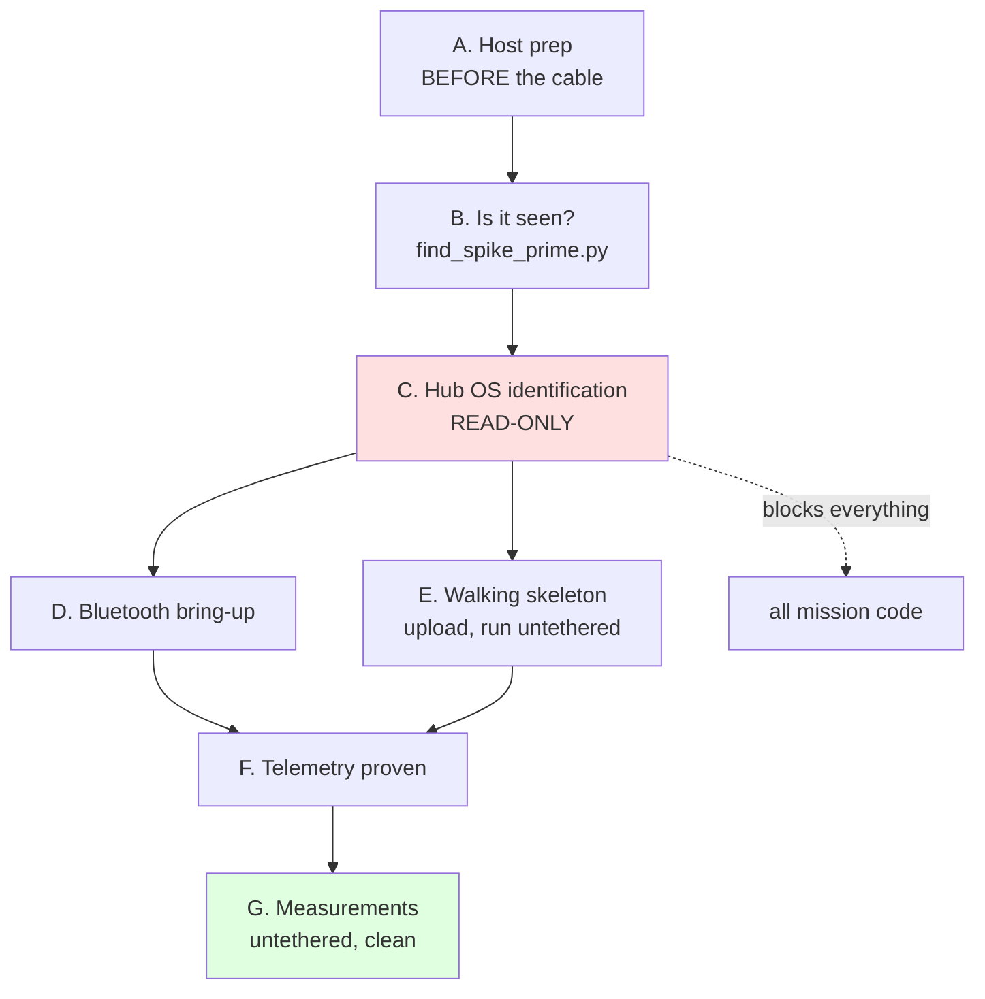

# First hardware session — the order things must happen in

**Type:** ACTIVE-SPEC · **Created:** 2026-08-26 · **Status:** nothing here has been run

The hub has never been connected. This is the sequence for the moment it is, ordered by **what blocks
what** rather than by what is interesting. Read it before the cable goes in.

> **Nothing in this plan runs without the operator saying the hardware is connected.** Claude treats the
> hub as absent until told otherwise, and never initiates a connection, a pairing, or a hub-touching
> script on its own. See [../lessons_learned/](../lessons_learned/).

---

## The dependency chain



**C gates everything.** Until the API generation is known, every hub-facing call site in `src/hub_*.py`
is a coin flip between two incompatible APIs, and the VS Code uploader version depends on it too.

---

## A — Before the cable goes in

```bash
./scripts/setup-host.sh            # dry run: shows what would change
./scripts/setup-host.sh --apply    # needs sudo
```

**This must happen first.** ModemManager is active on this machine and probes any new `/dev/ttyACM*`
with AT commands, corrupting the first session — and it looks exactly like broken hardware, which is how
a class period gets lost to a non-problem. [../findings/host-environment.md](../findings/host-environment.md)

If it adds you to `dialout`, **log out and back in.** A new terminal is not enough.

## B — Is the hub seen at all?

```bash
./find_spike_prime.py --verbose
```

`READY` means the port opens and permissions are good. It never sends anything to the hub. `NOT FOUND`
most often means a **charge-only USB cable** — try a different one before suspecting the hub.

## C — Hub OS identification ⛔ THE GATE

Follow [../runbooks/hub-identification.md](../runbooks/hub-identification.md) exactly. **Read-only.**

**Do not open the LEGO SPIKE app or the web app before this.** If versions mismatch it demands a Hub OS
update, LEGO states that prompt cannot be disabled, and accepting it is blacklist-level
([ADR-0001](../decisions/0001-stock-lego-firmware-only.md)).

**Record the result as a finding.** Then the API generation stops being a coin flip and the
`hub_*` modules can have their dead branch deleted.

## D — Bluetooth bring-up ⭐ early, and here is why

The operator's call, and the reasoning is sound: **a tethered robot is not the robot we are
measuring.** Cable drag pulls on the chassis and biases heading, so any motion measurement taken over
USB describes a robot with a cable attached to it. Getting BLE working *before* the measurement session
means everything after it is clean.

Order within D:

1. **Confirm the hub advertises.** `bluetoothctl scan on` — is it there? This alone answers whether the
   radio is on and reachable in a room full of other radios.
2. **Install `bleak`** — it is **not currently installed**. `pip install bleak` into a venv. Linux needs
   BlueZ ≥ 5.55; this host has **5.64** ✓.
3. **Connect and read**, using LEGO's own protocol reference and its `bleak` example.
   [../research/bluetooth-control-plane.md](../research/bluetooth-control-plane.md)
4. **Gate G1:** can a file reach a slot and be started over BLE, with no cable? If yes, the dev loop is
   untethered. If no, fall back to USB for upload and BLE for telemetry only.

**What BLE does NOT do:** a program *on the hub* almost certainly cannot open its own BLE socket.
Telemetry leaves as `print()` and the firmware wraps it. So the hub-side code is identical either way —
which is why `src/telemetry.py` could be written before any of this.

## E — Walking skeleton

Edit on Ubuntu → onto the hub → **runs standalone with no laptop attached** → a motor turns a known
amount → a sensor reading comes back. Nothing else.
[2026-08-25-sprint-1-walking-skeleton.md](./2026-08-25-sprint-1-walking-skeleton.md)

**First move is short, slow and cancellable**, and the Builder rehearses the abort *before* needing it.
A runaway from a wrong sign in the port map is the normal first-day failure.

## F — Telemetry proven end to end

One logged run reaching the laptop with its header, records and integrity trailer intact — and the
trailer's `sum_seq` check actually catching a truncation. Until that works, every later measurement has
to be transcribed by hand.

**Decide the rate here, not before:** at 21 columns, 20 Hz is 89% of the modelled BLE ceiling and 10 Hz
is 45%. [telemetry-over-bluetooth.md](./telemetry-over-bluetooth.md)

## G — Measurements

Only now. [bench-measurement-plan.md](./bench-measurement-plan.md) and
[../runbooks/measure-drivetrain.md](../runbooks/measure-drivetrain.md).

**The keystone is BM-3, effective rolling diameter** — almost every other number scales by it.

---

## What does NOT need the hub, and should not wait for it

| Task | Why it is independent |
|---|---|
| Ask the professor Q1/Q2/Q3/Q5 | Free, and Q1×Q2 selects the design off the trade study's decision table |
| Buy **one** colour sensor | Required under every branch; unblocks the colour go/no-go |
| **Colour separability go/no-go** | Needs the sensor and the real note pack — **not the robot**. If the colours do not separate, classification is off the table and the plan changes that day |
| Identify the two motors | Read the part number. One fact closes KU-T3 and firms up every speed figure |

---

## Ordering traps

- **Do not open the LEGO app before C.** The single most expensive mistake available.
- **Do not measure over USB if BLE works.** The cable is part of what you would be measuring.
- **Do not skip B when C fails.** A charge-only cable and a dead hub look identical from the app.
- **Do not tune anything before the professor answers Q1.** Tuning a sweep for the wrong arena size is
  wasted class time, and the arena spans two orders of magnitude
  ([../findings/coverage-time-budget.md](../findings/coverage-time-budget.md)).
