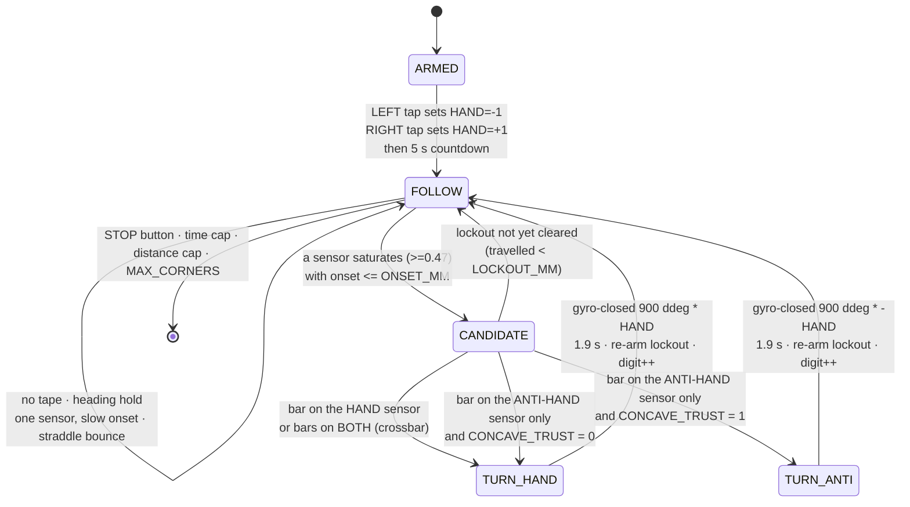
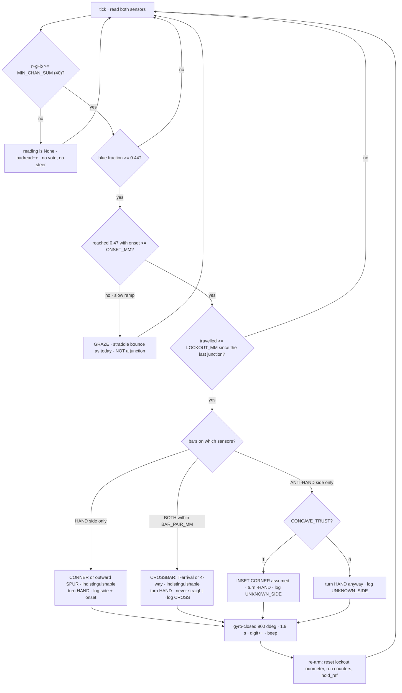
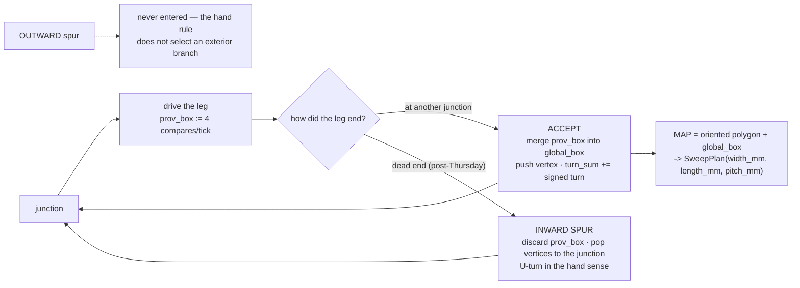

# Junction handling and outer-boundary tracing — 2026-09-08

**Status: ACTIVE-SPEC, two days from Demo Day (10 SEP).** Written for the main session to apply to
[`examples/follow_tape.py`](../../examples/follow_tape.py) directly. Every number below was recomputed
on the host from `tmp/telemetry/` while the operator was demoing; **no hardware was touched and
nothing here has been run.** Companions: [corner-turn-direction-2026-09-08.md](./corner-turn-direction-2026-09-08.md)
(which this supersedes on the direction question — see §2.3) and
[border-trace-and-corners-2026-09-08.md](./border-trace-and-corners-2026-09-08.md) (map value, corner
definition, lane termination — still stands).

---

## 1. TL;DR — the rule for Thursday

**The sensors decide WHEN we are at a junction; the operator decides WHICH WAY we turn.** At arm time
the operator taps LEFT or RIGHT to declare the hand (`HAND = -1` interior-on-left / `+1`
interior-on-right); at every accepted junction the robot turns `CORNER_TURN_DDEG * HAND`, which is
100 % correct at every convex corner of a box walked in the declared direction and — for free — takes
the boundary rather than the spur at the operator's overshoot T. The sensor side is demoted from
*decision* to *override*: only a **sharp-onset bar on the anti-hand sensor with nothing on the hand
sensor** flips the turn, because that is the inset-corner signature, and it is behind one config flag
(`CONCAVE_TRUST`) that can be set to 0 on the day if the arena turns out to be a plain rectangle.

---

## 2. Turn direction at a corner

### 2.1 What the logs actually say

| Fact | Value | Tag |
|---|---|---|
| Forward speed while following | 41.9 mm/s (765 mm in 18.25 s) | [MEASURED] `…121202-followtape-0000153852.csv` |
| Pivot rate | 47.9 °/s (97.2° in 2.03 s) | [MEASURED, N=1] `…121157-followtape-0000043283.csv` seq 94→120 |
| Corner turns ever logged, whole corpus | **1** (`TURN_START_want900_from17` → `TURN_END_at-955_delta-972_want900`) | [MEASURED] `grep TURN_ tmp/telemetry/*followtape*` |
| Turn overshoot | +72 ddeg past a commanded 900 | [MEASURED, N=1] same run |
| Longest single-sensor blue episode with no corner present | **28 ticks / 54.6 mm**, port C, yaw swinging 17.2° across it | [MEASURED] `…0000153852.csv` seq 52–79 |

The last row is the whole problem. `CORNER_SUSTAIN = 4` was chosen on the premise that "ordinary
line-bounce grazes for ONE tick" ([`follow_tape.py`](../../examples/follow_tape.py) L76). That premise
is false: while the straddle steering is pulling the robot off the line it **rides along** the line for
tens of ticks. In run `0000043283` the shipped constant fires at seq 52 — **114 mm before** the seq 89–93
event the program actually turned on. So the operator's "50 % chance of going the right way" is at
least partly a **wrong place**, not only a wrong side.

### 2.2 The chosen mechanism — declared hand, sensor override

1. **`HAND` is declared, not inferred.** `wait_tap()` already returns `True` for LEFT *or* RIGHT and
   throws away which. Capture it. This is the repo's own standing ruling — `examples/find_corner.py`:
   *"THE OPERATOR SETS THIS BEFORE THE RUN. The program must not guess which way round the box to walk."*
2. **Every accepted junction turns `CORNER_TURN_DDEG * HAND`.** On a convex box walked in one
   direction, every corner turns the same way, so the decision is deterministic and cannot be inverted
   by drift, by the [UNMEASURED] sensor spacing, or by a fore-aft mounting bias.
3. **The operator's live T is handled by the same rule with no T classifier.** "A rectangle but one of
   the sides does not stop at the corner": walking that side, the boundary leaves on the **hand** side
   and the spur continues **straight**. Turning `HAND` takes the boundary. The spur is never entered.
4. **Override, off by one flag:** a sharp bar on the *anti-hand* sensor with **no** bar on the hand
   sensor is the **inset-corner** signature (at a concave corner the outgoing leg extends to the
   anti-hand side, so only that sensor crosses it). `CONCAVE_TRUST = 1` turns anti-hand there;
   `CONCAVE_TRUST = 0` makes the program 100 % deterministic for a plain rectangle. One value.

### 2.3 Why not "turn toward the sensor with the longer run" (the shipped rule)

It is refuted by the two newest logs. In `0000153852` port C held tape for **28 consecutive ticks**
with no corner: the long run is the **ride-along caused by drift**, and which sensor rides along
depends only on which way the robot happened to be drifting when it met the corner — that *is* the coin
flip. In `0000043283`, C alone was blue (D never exceeded 0.36 all run), the program latched R and
turned 97° clockwise, and the operator saw it turn "into the void". Sensor ordering / run-length is
therefore **logged, never obeyed** — this retracts the recommendation in
[corner-turn-direction-2026-09-08.md](./corner-turn-direction-2026-09-08.md) §2.

### 2.4 Cost

| Item | Cost | Tag |
|---|---|---|
| The direction decision | **0 s** — one integer read at arm time | [COMPUTED] |
| The 90° gyro-closed turn itself | **1.9 s** (900 ddeg at 47.9 °/s), unchanged from today | [MEASURED, N=1] |
| Anti-hand override | 0 s — same turn, opposite sign | [COMPUTED] |
| Recovery when a turn is wrong | not attempted for Thursday (see §5.3) | — |

---

## 3. Junction classification — and what is genuinely indistinguishable

### 3.1 What each junction looks like to two downward sensors

The robot straddles: the tape sits in the gap and **both sensors normally read carpet**. A junction is
tape that reaches out to one side or both.

| Reality | What the pair sees | Distinguishing evidence |
|---|---|---|
| Straight leg, drifting | ONE sensor, **slow** onset, long episode | onset 17.5 mm over 28 ticks [MEASURED, `0000153852` seq 48→54] |
| Convex corner | ONE sensor (the hand side), **sharp** onset | ground-truth perpendicular crossing 5.3 / 8.3 mm [MEASURED, `…drivetape-0000077369.csv` seq 45→48] |
| Inset (concave) corner | ONE sensor (the **anti-hand** side), sharp onset | same signature, opposite sensor |
| Spur leaving one side (T) | ONE sensor, sharp onset | **identical to a corner on that side** |
| Crossbar / 4-way (arriving perpendicular onto a run of tape) | **BOTH** sensors, sharp, within `BAR_PAIR_MM` | both crossed within **1 tick** on the ground-truthed head-on approach [MEASURED, drivetape seq 47 (D), 48 (C)] |

### 3.2 The indistinguishable pairs — state them, do not design past them

* **Convex corner vs. outward-spur root** — identical at the instant of crossing. *Not a problem:* both
  want the same action, `turn HAND`.
* **Inset corner vs. inward spur / anti-hand spur** — identical. `CONCAVE_TRUST` picks which one we bet
  on; the loser costs one wrong 90° turn, logged as `UNKNOWN_SIDE`.
* **T-with-crossbar vs. 4-way crossing** — identical. Both turn `HAND`; **never straight**, because
  straight is the only choice that can put the robot outside the enclosed area.
* **On the line vs. lost in open carpet** — identical while straddling (both sensors carpet). This is
  why no forward probe, nudge-and-test or "did I reacquire?" test can work here, and why line-loss
  detection is deliberately absent. Ports E and F are empty and the distance sensor was rejected
  ([distance-sensor-evaluation-2026-09-08.md](../research/distance-sensor-evaluation-2026-09-08.md)).

### 3.3 The trigger — sharpness, not duration

Per sensor, remember the odometer at the last valid sample below 0.41; when the fraction first reaches
0.47, `onset_mm` is the travel between them. **A junction candidate needs a sharp onset; a long run
proves nothing.**

| Event | onset | ground truth |
|---|---|---|
| drivetape head-on crossing, port C | 5.3 mm | **known perpendicular** [MEASURED] |
| drivetape head-on crossing, port D | 8.3 mm | **known perpendicular** [MEASURED] |
| `0000153852` seq 213→215 / 255→259 (port D) | 7.8 / 8.6 mm | unlabelled |
| `0000043283` seq 87→90 — the event the program turned on | 12.2 mm | **unlabelled — open question Q1** |
| `0000153852` seq 48→54 — the 28-tick ride-along | 17.5 mm | ride-along, near-certain |

`ONSET_MM = 15` sits in the 12.2 → 17.5 gap. **Say this out loud: the separation is 1.4×, not the 3–5×
claimed elsewhere, and the reject class is N = 1.** It is the best discriminator available from data
we own, and **BM-C1** closes it in 60 s (§7).

---

## 4. Outer boundary only

### 4.1 The exclusion is a path rule, not a map filter

A consistently-handed walk **is** a planar face traversal: keep the enclosed area on the declared side
and you are walking the boundary of the enclosed face. An **outward** spur — the operator's, whose tip
lies *outside* the rectangle — hangs off the exterior face, so the hand rule **never enters it**.
Nothing has to be detected, filtered or subtracted, which is why this beats both a convex hull (it
fills the inset corners the operator says may exist, and would claim ground outside the tape) and a
bounding box of all tape sightings (the outward spur inflates it permanently: a 300 mm overshoot on a
3048 mm side is +9.8 % area, ~4 lanes **outside** the arena [COMPUTED]).

**Interior tape is a non-problem** and needs no code: the mine rule is `reflection >= 30`, and blue tape
reads **7–9**, entirely inside the carpet band 3–9 — the mine detector *cannot see tape at all*
[MEASURED, [surface-survey-2026-09-08.txt](../findings/runs/surface-survey-2026-09-08.txt)]. ⚠ That
holds only for the reflectance rule; `src/mission_config.py` still ships `DETECT_MODE = "anomaly"`, under which
blue tape is the most conspicuous object on the floor. Fixing that outranks everything in this document
([carpet-detection-and-blue-boundary-2026-09-08.md](./carpet-detection-and-blue-boundary-2026-09-08.md)).

### 4.2 The representation, and its memory cost

**For Thursday: a junction log, not a polygon.** One row per accepted junction is the deliverable and
the Intro Report's results section. The polygon and the two-tier box are specified here so they are a
value change later, not an architecture change.

| Item | Content | Bytes | Tag |
|---|---|---|---|
| junction log | `(seq, odo_mm, x, y, yaw, side, onset_mm, kind, achieved_ddeg)` per junction, 12 max | ~0 — written to the CSV `note` field, not held | [COMPUTED] |
| `prov_box` | min/max x,y for the **current leg only**, reset at each junction | ~32 | [COMPUTED] |
| `global_box` | merged from `prov_box` **only when the leg is accepted** | ~32 | [COMPUTED] |
| vertices | `array('f')`, 12 × (x, y) | ~112 | [COMPUTED] |
| turn sum, counters, flags | scalars | ~40 | [COMPUTED] |
| **total** | | **~216 B** | vs 12.7–208 KB for a stored raw path ([border-trace §5.2](./border-trace-and-corners-2026-09-08.md)) |

Two-tier is the load-bearing detail: a single unconditional box **cannot un-see** a spur once recorded.
Integrate pose in a frame rotated to the measured heading of the first accepted edge (`yaw - yaw_edge0`
inside the sin/cos — zero extra cost), so the box comes out **oriented**: a 10° misalignment inflates an
axis-aligned box by +34 % area [COMPUTED].

---

## 5. Lap completion, and the bounded fallback

### 5.1 The schedule arithmetic, first — because it decides whether to try at all

Perimeter of the operator-stated 10 ft arena = **12192 mm**; at the MEASURED 41.9 mm/s that is
**291 s** of driving before a single turn [COMPUTED]. `RUN_CAP_MS` is now 150 000 and `MAX_DEG` 40 000
(~22 m), so the caps no longer forbid a lap — **the clock does**. A lap of the 10 ft arena is
affordable only near ~160 mm/s, which is the tape detector's own measured cap
(`tape_width × f / (CONSEC+1)`, [line-following-viability-2026-09-08.md](../findings/line-following-viability-2026-09-08.md) §4.3),
and only with `flush_every >= 25`. **Recommendation for Thursday: lap the small test rectangle, not a
10 ft arena, and do not raise `BASE_DPS` on demo morning** — every tick-based threshold in the program
(`CORNER_SUSTAIN`, `BOTH_TICKS`, the hold) is calibrated at 41.9 mm/s and a speed change silently
re-scales all of them.

### 5.2 Closure test, cheapest and most trustworthy first

1. **Cumulative signed gyro turn** in **[300°, 420°]**. Spur-invariant (an out-and-back excursion with
   a consistently-handed U-turn nets zero) and the gyro is our best channel. Window derived from the
   1 ft square's MEASURED four-turn sum of −389.7° against −360°.
2. **≥ 3 accepted vertices** — stops a two-touch wobble declaring a lap.
3. **Position within `R_CLOSE = 400 mm`** of the origin. Not 250 mm: the repo's own Monte Carlo says a
   corrected 10 ft lap closes at *"about 100–400 mm"*, so 250 mm rejects genuinely closed laps.
4. **Same heading as departure, ±45°** (Jacob's criterion). One `norm_ddeg()`; it is what stops a
   one-tape-wide branch from ending the trace at a point merely revisited.

⚠ **Odometry drift over a full lap with turns is [UNMEASURED].** The only closed traverse we own is
1277 mm of 1 ft square, which misclosed **108.3 mm (8.5 %) with 30° of final heading error**
([border-trace §4.2](./border-trace-and-corners-2026-09-08.md)). 8.5 % of a 10 ft perimeter is ~1 m —
which is exactly why closure must be led by the turn sum and never by position.

### 5.3 Bounded fallback when the boundary is not closed

Bounds, all armed, first to fire ends the trace: `RUN_CAP_MS` · `MAX_DEG` · `MAX_CORNERS` ·
`|turn_sum| > 500°`. Then report the rung reached, and **never invent the missing part**:

| Rung | Have | Report |
|---|---|---|
| L4 | closed lap | oriented polygon + box; sweep the polygon |
| L3 | 3 accepted corners | infer the 4th by parallelogram closure, flag `INFERRED_CORNER` |
| L2 | 1 corner (2 edges) | one span measured, one [ASSUMED]; flag `SPAN_ASSUMED` |
| L1 | 1 edge heading | `theta_axis` only — still the single most valuable output, because it stops the lane grid rotating |
| L0 | nothing | FAULT glyph, no map, fall back to the Builder's hand-measured rectangle |

**Not attempted for Thursday: recovery after a wrong turn.** Off the boundary, "on the line" and "lost"
are the same reading (§3.2), so any recovery is a new unproven primitive. A wrong turn ends as
`time_cap` with the junction log intact, which is an honest demo answer.

---

## 6. The exact changes to `examples/follow_tape.py`

Line numbers are the file as of 2026-09-08 12:20 (`TURN_SIGN = 1`, `MAX_DEG = 40000`,
`RUN_CAP_MS = 150000`). **Total ≈ 60 lines net; no new module, no new import, no new hub call site.**
Apply in this order — 1 first, because everything else is fed by `on_tape()`.

| # | Where | Change | Lines |
|---|---|---|---|
| 1 | `on_tape()` L179–189 | Add `MIN_CHAN_SUM = 40` and `SAT_MAX = 1000` (ported verbatim from `examples/find_corner.py` L70–73). Return **`None`** — not `False` — when `tot < MIN_CHAN_SUM`, and make every caller treat `None` as "no vote, no steer". Count them in `box["badread"]`. **MEASURED justification:** 31 of 305 rows in `…0000153852.csv` are below the floor, and in its dark stretch (seq 188–202) port D reports blue fractions of 0.500, 0.667 and **1.000** on channel totals of **1–4** — pure quantisation, today allowed to command a 90° turn. Every confident tape sample in these logs totals 80–145, so the floor cannot cost a real detection. | ~6 |
| 2 | new consts near L68 | `MIN_CHAN_SUM = 40` · `ONSET_MM = 15` · `SAT_FRAC = 0.47` · `BAND_LOW = 0.41` · `BAR_PAIR_MM = 40` · `LOCKOUT_MM = 250` · `CONCAVE_TRUST = 1` · `MARGIN_NOTE = ""`. Every one is a value the operator can change on the day. | ~10 |
| 3 | `sample()` L217 | Accumulate `box["odo_mm"] += ((-dA) + dB) / 2 * 199.49/360` per tick from the encoder deltas. **MEASURED property that makes this the right metric:** across the whole 97° pivot in `0000043283` (seq 94→120) both wheels moved −147 deg, so the signed mean is ≈ 0 — a slow turn cannot eat a distance lockout, whereas the 1.5 s clock protects only 63 mm at 41.9 mm/s. | ~5 |
| 4 | follow loop L306–310 | **Replace the run-length latch.** Per sensor keep `low_odo` (odometer at the last valid sample with fraction < `BAND_LOW`); when the fraction first reaches `SAT_FRAC`, `onset = odo - low_odo`, and set `bar_c` / `bar_d` **only if** `onset <= ONSET_MM`. Keep `run_c`/`run_d` **for the log only**. Delete `first_side` as a decision input. | ~12 |
| 5 | `wait_tap()` L192 | Return **which** button was tapped (`-1` LEFT = interior on the left, `+1` RIGHT = interior on the right) instead of `True`; store it as `HAND`. Print it and show `LEFTA`/`RIGHTA` for 1 s so the operator can see what the robot heard. | ~8 |
| 6 | corner block L313–341 | Trigger on `bar_c or bar_d` **and** `odo - last_junction_odo >= LOCKOUT_MM`. Direction: `way = HAND`, except `way = -HAND` when the bar is on the anti-hand sensor alone **and** `CONCAVE_TRUST`. Both bars within `BAR_PAIR_MM` → `way = HAND`, kind `CROSS`. Replace the `CORNER_LOCKOUT_MS` re-arm with `box["last_junction_odo"] = box["odo_mm"]`. | ~14 |
| 7 | corner block, note | Log the evidence: `"J%d_%s_kind%s_onset%d_runC%d_runD%d_odo%d"`. Keep separate counters `corners` / `crosses` / `unknown_side` / `badread`, and add them plus `hand=` to the `#end` trailer at L401. **This is the Demo Day evidence and the report's results section** — the entire corpus currently contains exactly one logged corner turn. | ~6 |
| 8 | `gyro_turn()` L253 | Nothing changes in the turn mechanism. Only append the achieved delta to the junction note (it already computes `TURN_END_at…delta…`), so `achieved_ddeg` lands in the junction record. | ~2 |

### Do **NOT** touch — these are working and were paid for in runs

* **Straddle-and-bounce steering** (L344–362): `drive(TURN_DPS, BASE_DPS)` on port D, the mirror on
  port C, and `hold_ref = yaw` on a sighting. The polarity is confirmed against `docs/hardware/port-map.md`.
* **`HOLD_SIGN = -1`** and the heading hold. `+1` drove the robot in circles for a whole 40 s run
  (`…114003-followtape-0000102164.csv`, left encoder 3807° against right 1490°). Do not "tidy" it.
* **`HOLD_DIVERGE_TICKS` divergence guard** and its 220 Hz beep — the reason a bad run degrades to
  straight-line driving instead of a spiral.
* **`TURN_SIGN = 1`** and the `LEFT_FWD`/`RIGHT_FWD` pairing — operator-watched via
  `examples/calibrate_directions.py`. A `-1` here re-inverts every turn.
* **`TURN_LEAD_DDEG = 70`**, the gyro-closed turn loop and its 6 s bound.
* **`BLUE_FRAC_MIN = 0.44`** — sits inside the MEASURED carpet/tape gap and was proven by
  `drive_to_tape.py` on hardware.
* **The corner digit on the 5×5 matrix**, the `DIGITS` font, the beeps, `CsvLog` and the `#end`
  trailer format (the decoder and every analysis script read it).
* **`BASE_DPS = 80`** — see §5.1: raising it silently re-scales every tick-based threshold.

---

## 7. Open questions and risks

1. **Q1, and it is the cheapest thing on this page: what was actually on the floor at
   `0000043283` seq 89–93?** Was there a corner there, and which way did the outgoing leg run? That one
   answer labels the only turn we own and either confirms or kills `ONSET_MM = 15`. The operator has a
   T-intersection taped down **right now** — one instrumented run over it with change 1+3+4+7 applied
   is worth more than the rest of this document.
2. **BM-C1, 60 s, no new code:** lay one straight strip, drive **square across it 3×**, then 3× with the
   robot rotated 180°. A perpendicular crossing should trip both sensors within a tick (it did on
   drivetape: D seq 47, C seq 48). A consistent same-sensor lead in **both** directions is fore-aft
   mounting bias. It also yields the sensor spacing off the encoder distance between crossings on an
   angled pass. **The hand rule is immune to this bias — that is a large part of why it is the
   recommendation** — but the `CONCAVE_TRUST` override is not.
3. **`SENSOR_SPACING_MM` is [UNMEASURED]** — a lower bound of >76 mm only, and it does not exist in
   `src/mission_config.py`. `BAR_PAIR_MM = 40` is derived from the bound, so its angle tolerance is unknown;
   the lane pitch for the sweep needs the real number regardless.
4. **`SENSOR_AHEAD_MM` (fore-aft offset from the drive axle to the sensor line) is [UNMEASURED]** —
   still the literal placeholder in `docs/hardware/build-record.md`. If it is 40–60 mm, the robot ends a
   correct 90° turn *beside* the new leg rather than straddling it, which is a second, independent
   mechanism for "it turned and then lost the line". One ruler reading; the fix is to advance
   `SENSOR_AHEAD_MM` before pivoting.
5. **Lap odometry drift is [UNMEASURED].** One 1277 mm square, misclosing 8.5 % with 30° of heading
   error, is the entire basis for §5.2's thresholds.
6. **Turn overshoot is systematic and N = 1.** +7.2°/turn × 8 junctions is ~58°, which eats the whole
   ±60° closure window before any random error. Subtract it (`TURN_LEAD_DDEG` already does), do not
   budget it as noise, and re-measure it from the `TURN_END_` lines of the next run.
7. **The biggest risk is not on this page.** `src/main.py` — the graded program — has **never run**:
   there is no `main`/`sweep`/`competition` prefix anywhere in `tmp/telemetry/`. `src/hub_color.py`
   reads only `COLOR_PORT`, so the graded sweep is still a **one-sensor** robot (`SECOND_COLOR_PORT` is
   declared in `src/hub_api.py` and referenced nowhere), and `DETECT_MODE` is still `"anomaly"`, which
   the surface survey MEASURED as detecting 100 % of the tape and 0 % of the yellow notes. Boundary
   tracing is a prerequisite for nothing that is graded. **If there is one hub session left before
   Thursday, spend it on `src/main.py`, not on this.**
8. **Free and unproposed:** the mine rule (`reflection >= 30`) is blind to tape, and `follow_tape.py`
   already reads and discards `reflection()` on both sensors every tick. Counting mines **during** the
   boundary lap is ~4 lines and turns a corner-count diagnostic into a demo.
