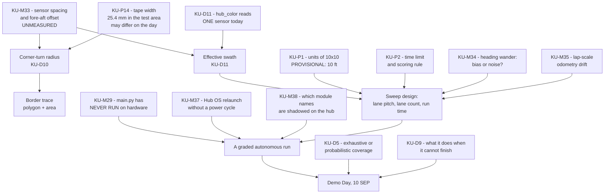

# Known Unknowns — register

**Type:** ACTIVE-SPEC (living register) · **Created:** 2026-08-25 · **Last consolidated:** 2026-09-08
**Status:** **27 rows live** (+15 parked), down from ~50 — the 2026-09-08 hardware day closed 12 and retired 6
**Companions:** [risk-register.md](./risk-register.md) · [conops.md](./conops.md) ·
[requirements-traceability.md](./requirements-traceability.md) · [verification-plan.md](./verification-plan.md)

This is the single place a session looks to find out **what we do not yet know**. It is not a question
list and not a risk list. [questions-for-the-professor.md](./questions-for-the-professor.md) is the
*message* we send; [risk-register.md](./risk-register.md) is what *goes wrong*; this is the *state of our
ignorance*, including the parts nobody has to be asked about.

> **⚠ Consolidated 2026-09-08 at the operator's explicit request — "the known unknowns should be now way
> more minimal for the next session."** The register had grown to ~50 live rows and had stopped being
> readable, which is the failure mode a register like this dies of. It is now three layers:
>
> 1. **LIVE rows** — the only ones a session must read. Something between now and Demo Day depends on each.
> 2. **PARKED rows** — genuinely still unanswered, but **nothing before Demo Day depends on them**. One
>    line each, at the end of each group. They are not closed and must never be quoted as closed.
> 3. **The [CLOSED ledger](#closed-ledger)** — every row ever closed or retired, with its answer, date
>    and evidence, one line each. IDs are permanent; nothing is deleted, only compressed.
>
> **A register that only grows is useless.** Compressing it is part of the work, not tidying done after.

---

## How to use this file

**Reading it.** Before starting any work, check whether the thing you are about to build depends on an
`OPEN` row. If it does, either parameterize around it (preferred — that is the whole strategy in
[../scope.md § How we proceed meanwhile](../scope.md#how-we-proceed-meanwhile)) or stop and close the
unknown first. Do not average two guesses into a design.

**Updating it — every session, as part of the work, not afterwards:**

1. **New unknown discovered** → add a row to the group that matches *how it gets resolved*, not what it
   is about. Give it the next free ID in that group. IDs are never reused, never renumbered.
2. **Unknown resolved** → move it to the [CLOSED ledger](#closed-ledger) with the answer, its **date and
   source**, then **propagate**: the value's real home is [../scope.md](../scope.md) § Assumptions,
   [../../src/mission_config.py](../../src/mission_config.py),
   [../hardware/build-record.md](../hardware/build-record.md), or
   [../hardware/port-map.md](../hardware/port-map.md) — update *there* and strike the `[ASSUMED]` /
   `[UNKNOWN]` marker. A row closed here but not propagated is worse than an open row, because the code
   still holds the guess while the register says we know.
3. **An answer changes the design** → that is an ADR ([../decisions/INDEX.md](../decisions/INDEX.md)),
   and usually a roadmap re-sequence. Say so in the row.
4. **A row turns out to be a risk too** → cross-reference it; do not restate it. Several rows here are
   the *cause* of a risk in [risk-register.md](./risk-register.md).
5. **A row stops blocking anything** → **PARK it**, do not close it and do not leave it live. Move it to
   its group's parked list with a one-line reason. Parking is reversible and is not an answer.

**Closing rules — non-negotiable ([../directives/honest-instrumentation.md](../directives/honest-instrumentation.md)):**

- An unknown is closed by **a person who was asked** (named, dated) or by **a measurement** (value,
  units, conditions, date). Never by inference, never by "it's almost certainly X".
- A best-assumption column entry is **not** an answer. It is what the code currently runs on so that work
  is not blocked, and it stays tagged `[ASSUMED]` everywhere it appears.
- `UNKNOWN` is a legitimate terminal state for Demo Day and for the report. "We did not measure this"
  is a defensible sentence in a verification section; a fabricated number is not.

**Status vocabulary:** `OPEN` (nobody has acted) · `ASKED` (question sent, awaiting reply — record when)
· `SCHEDULED` (a measurement is planned; name the session) · `PARTIAL` (something came back, but it does
not close the row; say which half is answered and re-ask the rest) · `PROVISIONAL` (an answer exists and
we are building on it, but its own source says it may change) · `PARKED` (**still unanswered**; nothing
before Demo Day depends on it — revisit after 10 SEP) · `CLOSED` (answer + source + date recorded, and
propagated).

---

## What gates what

Only the rows that actually block a milestone, redrawn 2026-09-08. Everything else is uncertainty we
can carry.

Read it as: **the detection problem is solved and the delivery problem is not.** GATE 1 closed on
2026-09-08 — a real mine, on the real carpet, found and correctly named while moving, untethered, twice
([../findings/colour-survey-and-first-detection-2026-09-08.md § 6b](../findings/colour-survey-and-first-detection-2026-09-08.md)).
What now stands between us and a graded run is: one **ruler measurement** (KU-M33), one **code defect**
(KU-D11), and a program that **has never executed** (KU-M29).

---

## Group A — Ask the professor

These cannot be closed any other way. They are the content of
[questions-for-the-professor.md](./questions-for-the-professor.md); that page is the ranked message, this
is the state. **Do not default any of them silently** — where a default exists it is named below and it
is tagged `[ASSUMED]` at every point of use.

| ID | Unknown | Why it matters / what it blocks | How it resolves | Best assumption now | Status |
|---|---|---|---|---|---|
| **KU-P1** | **"10×10" — ten *what*?** | Sets lane count, path length and run time. **ANSWERED PROVISIONALLY 2026-09-08 by the operator: the competition expectation is a 10 FOOT square (3048 mm) — explicitly "not set in stone", so it is not closed.** ⚠ The answer is the **expensive** end of the range and it converts two optimisations into requirements: [COMPUTED at today's MEASURED speeds] a **one-sensor** sweep at 55 mm/s is **75 lanes / 229 m / ~69 min** and fits no plausible slot; a **two-sensor** sweep at 300 mm/s is **38 lanes / 116 m / ~6.4 min**. So KU-D11 (read both sensors) and a higher traverse speed are now on the critical path, not the wish list | Confirm with the professor; a Builder tape-measure across the demo arena is an equally good close and needs nobody's permission | `ARENA_WIDTH_MM = ARENA_LENGTH_MM = 3048.0` in [config.py](../../src/mission_config.py) — the **planning value**, parameterised so a change on the day edits two numbers and nothing else | `PROVISIONAL` 2026-09-08 |
| **KU-P2** | **Demo run time limit, scoring rule, and any robot size/parts constraint.** Attempts allowed? May the Builder intervene mid-run? Is finding *all* required, or the most in the time? *(**KU-P8** merged in here 2026-09-08 — it was the same question asked twice)* | Decides the objective function, and at 10 ft it decides whether the run is even attemptable. "Found all" → tight lanes, slow, exhaustive. "Most in the time" → wide lanes, fast, accept misses. **These optimise in opposite directions.** Directly gates KU-D5 and KU-D9 | Q2 + Q8 | None. Not defaultable | `OPEN` |
| **KU-P4** | **What "finds" means as a deliverable** — a count, locations, stopping on each, retrieving them? | A count is what is built. A location map needs trustworthy dead reckoning (KU-M35). Retrieval is a mechanical redesign. Sets FR-4 | Q4 | `[ASSUMED]` a count reported on the hub, laptop-free (scope FR-4) | `OPEN` |
| **KU-P5** | **Are there decoy colours, and does the mine colour change on the day?** | **Mine-colour half re-answered 2026-09-08 (operator): the mines are yellow *and* pink, the colour MAY CHANGE on demo day, and the standing guarantee is that mines are NEVER BLUE.** ⚠ **De-fanged, not closed:** the shipped detection rule is now `reflection() >= 30`, which is **colour-agnostic** — a decoy of any colour bright enough to clear 30 would be counted whatever hue it is, and classification is report-only and never gates the count. So decoys change the *reported* class, not the *count* | Q5. The count-level answer would only change if a decoy were both bright and required to be excluded | `[ASSUMED]` decoys may exist; classification stays an optional reporting layer over presence detection, never a prerequisite | `PARTIAL` — colours re-answered 2026-09-08; decoys still open |
| **KU-P6** | **How many mines, and how placed.** Fixed count? Can two be adjacent or touching? On or across the boundary? | Adjacent notes are the classic double-count / merge failure and FR-3 says *exactly once*. A known fixed count is also a free end-of-run sanity check. ⚠ **Now compounded by KU-D11:** with two sensors reading, one note can be seen by both, which is a *second* double-count mechanism the event-width gate was never designed for | Q6 | `[ASSUMED]` count varies and notes may be adjacent — the harder case; the event-width gate in [config.py](../../src/mission_config.py) exists for it | `OPEN` |
| **KU-P9** | **Intro Report logistics** — point value, `.docx` or PDF or both, one per team or one per student, page limit | Sets how much report work is individual vs shared, and therefore the 18 SEP plan | Ask with Q8 | `[ASSUMED]` one report per team, `.docx` **and** PDF | `OPEN` |
| **KU-P12** | **When the communications record is actually due** — "at the end of this project" (instructions p.1) | Collected **in full**; if it is due 15 SEP with the journal, collection has to start now ([../course/team/communications.md](../course/team/communications.md)) | Ask with Q8 | `[ASSUMED]` 15 SEP, with the journal and peer review | `OPEN` |
| **KU-P14** | **Is crossing the boundary tape a scored failure**, or is the tape only a marker? | **Tape-width half ANSWERED 2026-09-08 (operator): the test area's tape is 1 inch = 25.4 mm, and it MAY DIFFER on demo day** — so it is a config value, never a literal. That width is now the numerator of the corner-turn radius (KU-D10) and of the detector's speed cap (`v ≤ W·f/N` → 240 mm/s at N=2, 20 Hz). **Still open: whether crossing is scored**, which sets how much stopping margin the design must buy — against a MEASURED **~3 mm coast**, which is almost none | Q3c; the width itself closes with a ruler on the day | `[ASSUMED]` crossing is a failure — the pessimistic reading. Width `25.4 mm [OPERATOR-STATED]`, carried as config | `PARTIAL` 2026-09-08 |

**PARKED — still unanswered, nothing before Demo Day depends on them:**

| ID | Unknown | Why it is parked |
|---|---|---|
| **KU-P0** | Must the robot be autonomous, or may a human drive it? | The 2026-08-27 answer contradicts itself and was never resolved. **We are building autonomous and there is no time to build anything else**, and [blind-teleoperation.md](./blind-teleoperation.md) shows a blind operator would refund no navigation work anyway. Re-ask for the report, not for the build |
| **KU-P10** | Who owns a Hub OS update decision | It is a **standing prohibition**, not a pending experiment — `STOP and ask` never expires ([ADR-0001](../decisions/0001-stock-lego-firmware-only.md), blacklist item 3). Nothing is waiting on an answer |
| **KU-P11** | Is there a spare hub? | Changes the contingency, not the plan. `[ASSUMED]` no spare — treat the hub as irreplaceable |
| **KU-P15** | If a blind operator is allowed, what may they use, and does it cost points? | Rides entirely on KU-P0. Do not design around a permission we do not have |

---

## Group B — Measure it (hub, robot, or host)

Nobody can tell us these. They close with **a number, its units, and the conditions it was taken under**,
written into `docs/findings/` on the day ([../directives/documentation-discipline.md](../directives/documentation-discipline.md)).

| ID | Unknown | Why it matters / what it blocks | How it resolves | Best assumption now | Status |
|---|---|---|---|---|---|
| **KU-M33** | ⚠ **`SENSOR_SPACING_MM` — the centre-to-centre spacing of the C and D colour sensors, and their fore-aft offset.** *(Absorbs the live remainder of **KU-T7**, chassis geometry.)* | **THE HIGHEST-PRIORITY MEASUREMENT IN THE PROJECT** ([operator briefing § 6](./2026-09-08-operator-briefing-corner-turns-to-competition.md)). It is the numerator of the **corner-turn radius** (KU-D10) — the turn must carry the *outside* sensor across the perpendicular tape's full width, and that radius cannot be computed without it. It also sets the **effective swath** (KU-D11) and therefore the lane pitch and the whole run time. ⚠ **The fore-aft offset is separately [UNMEASURED] and can silently invert the corner-turn direction decision** ([corner-turn-direction-2026-09-08 § BM-C1](./corner-turn-direction-2026-09-08.md)) | **A ruler, off the robot, by the Builder.** 60 seconds, no hub, no code, no permission. Then write `SENSOR_SPACING_MM` into [config.py](../../src/mission_config.py) — the constant **does not exist there today** | **> 76 mm — a MEASURED lower bound only** (2026-09-08: one 76 mm sticky note could never be made to cover both sensors at once, [port-map](../hardware/port-map.md)). Every deadband figure quoted anywhere uses that floor, so real geometry is *at least* as good as quoted — but no design may use a specific number until this is read | `OPEN` — opened 2026-09-08 |
| **KU-M34** | ⚠ **Is the observed heading wander a systematic BIAS or zero-mean NOISE?** | **Load-bearing and unresolved.** A *bias* integrates: at 1.6° it costs **85 mm of cross-track drift over 3048 mm** — wider than a 76 mm note, so a mine inside the lane is missed and no lane pitch saves it. Zero-mean *noise* does not integrate and costs almost nothing over a lane. **The same measured numbers are consistent with both**, and the two demand opposite responses (bias → calibrate it out or re-datum every lane; noise → ignore it). Until this is settled, no honest lane-pitch or coverage claim can be made, and the operator's target — *less than a sticky-note width of deflection over 10 ft*, ≈ **1.4°** — cannot be said to be met or missed. *(Supersedes the live half of **KU-M9** and **KU-M28**.)* | Drive one long straight lane on the real carpet, logging absolute gyro yaw against encoder distance, **five times**. Bias shows as a consistent same-sign slope across runs; noise shows as slope that changes sign. The data is one `motor_poc`-style run, no new code | **MEASURED inputs, both real, neither decisive:** ~**2.6° of total yaw wander** over the 155 mm `drive_to_tape` run, left/right encoders within **0.4 %** (281° vs 282°) · ~**1.6° over ~100 mm** (operator) · but the 1 ft square misclosed **108.3 mm on 1277 mm (8.5 %) with 30° of final heading error** and its four turns summed **−389.7° against a commanded −360°**, which looks like bias. `[UNRESOLVED]` | `OPEN` — opened 2026-09-08 |
| **KU-M35** | **Lap-scale odometry drift** — the error that accumulates over a whole perimeter or a multi-lane sweep, not over one 1 ft side | Everything measured so far is at the **1 ft / 155 mm** scale. The mission is **3048 mm** sides and **38–75 lanes**. Extrapolating a 300 mm measurement by 10× and a 38-lane sweep by 38× is exactly the modelling this project forbids ([model-only-to-the-next-decision](../lessons_learned/model-only-to-the-next-decision.md)). Sets whether the sweep needs absolute re-fixes (the PROVEN perpendicular tape touch) every lane, every few lanes, or not at all | One perimeter lap, or one long multi-lane run, with start and end pose recorded against a floor mark. Closes with KU-M34 on the same data | None. The **1 ft square's 8.5 % misclosure** is the only lap-scale datum we own, and it is one run at one tenth of mission scale | `OPEN` — opened 2026-09-08 |
| **KU-M36** | ⚠ **What unit does `motor.velocity()` actually return?** | [../findings/hub-api-surface-2026-09-01.md](../findings/hub-api-surface-2026-09-01.md) records it as deg/s. **It is not deg/s on our logs.** [COMPUTED 2026-09-08 by `scripts/analyse-run.py` over **25 telemetry files** from today] the encoder-derived rate is a consistent **11.7× to 12.6×** the logged `velL` — 11.7 on `motor_poc`, 11.8 on `drive_to_tape`/`find_note`, 12.3 on `follow_tape`, 12.6 on one `find_note` variant. ⚠ **It matches no conversion we recognise** — not 6× (rpm), not 9.3× (% of the MEASURED 930 dps ceiling) — and it **varies with the program**, which argues against a fixed unit constant and towards a sampling or averaging artefact. Consequence today: **every speed this project quotes is derived from ENCODERS**, which are measured, and no design may read `velocity()` | Log `velocity()` beside an encoder delta at three commanded speeds on a lifted wheel. If the ratio tracks speed it is a filter/averaging artefact, not a unit | **Do not use `motor.velocity()` for anything.** `[UNRESOLVED]`. `analyse-run.py` already flags the disagreement rather than reconciling it, which is correct | `OPEN` — opened 2026-09-08 |
| **KU-M37** | ⚠ **Can the Hub OS be brought back without a power cycle?** | **MEASURED constraint 2026-09-08: `hub_programmer/run.py`, `probes/` and `download.py` send Ctrl-C to get a MicroPython REPL, and Ctrl-C KILLS the Hub OS** — which is the program serving the binary protocol `slot_upload.py` needs. A slot upload after any REPL tool aborts at `[2] identity` (that abort is the identity guard working correctly — **nothing is written**). The fix today is a **hub power-cycle** between REPL work and a slot upload, and on 2026-09-08 that cost ~20 power cycles. **A Ctrl-D soft reset was properly tested — protocol verification and 25 s of retries — and does NOT work.** What is unknown is whether *anything* does | Two testable branches, neither run: **E1** Ctrl-D genuinely does not relaunch the Hub OS (the launcher is below Python in a frozen `_system/*` module) vs **E2** it does but `slot_upload` never retries long enough. `machine.reset()` is ranked as the next candidate and is an **OPERATOR DECISION + ADR**, not something to try — [../findings/stopping-and-restarting-the-hub-2026-09-08.md § 3](../findings/stopping-and-restarting-the-hub-2026-09-08.md) | **Plan around it, do not fight it.** Procedure of record: **do all REPL/survey work first, then power-cycle, then upload the competition program.** Free mitigations already available: batch every `download.py` retrieve into one call at end of session, and run `slot_upload.py` **alone** when only the entry program changed (`/flash/lib` persists across boots). `scripts/scan-surface.py` was re-plumbed through the slot/console path and no longer kills it | `OPEN` — opened 2026-09-08 |
| **KU-M38** | ⚠ **Which module names are SHADOWED on the hub, and by what?** | **MEASURED 2026-09-08: `import config` in an on-hub program does NOT resolve to `/flash/lib/config.py`** — it resolves to something in the LEGO firmware, and the program dies at import (`AttributeError: 'module' object has no attribute 'WHEEL_DIAMETER_MM'`) **even though the upload hash-verified on the hub**. The failure is in the NAME, not the transfer, and it is silent until run time. **The blast radius is every other `src/` module name we might upload** — `result`, `telemetry`, `classify`, `calibration` are all plausible collisions and none has been tested. This is a direct first-run risk for `main.py` (KU-M29) | One line at the REPL with the hub free: `import sys; print(sorted(sys.modules))` plus a `help('modules')`, then import each of our names and compare `__file__`. Read-only, cheap | **Assume any short generic name may collide.** Current workaround, and it is a good one: [`src/hub_drive.py`](../../src/hub_drive.py) **declares its geometry locally and asserts it against `config.py` on the HOST**, where `./scripts/check-docs.py` imports every module — so a drift fails loudly on the host instead of silently on the robot | `OPEN` — opened 2026-09-08 |
| **KU-M29** | ⚠ **`src/main.py` has STILL NEVER RUN on hardware.** Its whole `hub_motors`/`hub_ui`/`hub_imu`/`hub_color` call path is `[UNVERIFIED]` | **The single largest risk in the project with two days left.** The LOGIC is reviewed (no motor-safety or crash defect found); it is the **hardware call sites** that are unrun — and KU-M38 has just demonstrated that an upload can hash-verify and still die at import. Everything else on this page is a refinement of a robot that works; this is whether the graded program starts at all | The first `main.py` run — [../runbooks/first-main-run.md](../runbooks/first-main-run.md). Needs the hub, a power cycle before the slot upload (KU-M37), and a clear floor | None. **Do not report `main.py` as working, ready, or verified in any form.** Every proven behaviour to date belongs to a program in `examples/`, not to `main.py` | `OPEN` — carried since 2026-09-03 |
| **KU-M30** | **`deploy_deps.py --apply` — the multi-module deploy orchestration** | The AST resolver is host-proven (15 modules for `main.py`); the **orchestration is unrun on hardware**, and 2026-09-08 showed it **cannot succeed as written**: it uploads *N* dependencies over the REPL (Ctrl-C each, killing the Hub OS) and *then* asks the now-dead Hub OS to prove its identity, so step *N*+1 must abort at `[2] identity`, deterministically [COMPUTED from `deploy_deps.py:152-176`] | Either insert an operator power-cycle prompt between the two phases, or upload dependencies once and thereafter run `slot_upload.py` alone. **Narrowed, not closed 2026-09-08** | `[UNVERIFIED]`. Practical route for the demo: `/flash/lib` persists across boots, so deploy the deps once, power-cycle, then upload only the entry program | `PARTIAL` 2026-09-08 |
| **KU-M4** | **Cross-track error over one lane** — how far off line the robot really ends up | Sets the maximum lane pitch, and therefore total path length and run time. It is a *multiplier* on KU-P1. ⚠ **Now largely a restatement of KU-M34** — whether the error is bias or noise decides whether "cross-track error" is even a single number | UMBmark square-path run on the demo carpet, then set `CROSS_TRACK_ERROR_MM` from the result. Same run as KU-M34/M35 | `[ASSUMED]` 15 mm, explicitly flagged **optimistic** in both [config.py](../../src/mission_config.py) and [../findings/coverage-time-budget.md](../findings/coverage-time-budget.md) | `OPEN` |
| **KU-M7** | **The real sticky notes — physical dimensions**, and the pack's full colour set | 76 mm is the assumption the entire lane-pitch arithmetic rests on; a 51 mm note shrinks the usable pitch to ~21 mm and makes the coverage problem much worse. **Colour half CLOSED 2026-09-08** — yellow and pink, both MEASURED on the real pack (§ 3 of the survey) and both correctly classified in motion | A ruler on the real pack, **in the same 60 seconds as KU-M33** | `TARGET_SIZE_MM = 76.0` `[ASSUMED]` standard 3 in note. Bounded above by KU-M33's lower bound: the notes are narrower than the sensor spacing (MEASURED — one note cannot cover both sensors) | `PARTIAL` 2026-09-08 |
| **KU-M10** | **Does the robot displace the notes it drives over?** | If it does, the mission needs a mechanical change, and a second pass counts a note that has moved. Cheap to check, catastrophic to discover late. ⚠ **Still genuinely untested:** `find_note.py` STOPPED at the notes, it never swept across them | Sweep over placed notes; photograph before and after. Ten minutes on the real carpet | `[ASSUMED]` no — untested, and the assumption is doing real work | `OPEN` |
| **KU-M31** | **Track width 95 mm is a slight over-estimate** — one run, and the gyro delta read ~5° short because the turn loop broke *after* the last logged sample | A few percent on every turn angle. Real, but small against KU-M34's open question | Re-measure with the segment-boundary log row already added to `examples/motor_poc.py` | `TRACK_WIDTH_MM = 95` MEASURED 2026-09-03 — use it; it is right to within a few percent | `OPEN` — low |

**PARKED — still unanswered, nothing before Demo Day depends on them:**

| ID | Unknown | Why it is parked |
|---|---|---|
| **KU-M5** (spot half) | Colour-sensor **spot diameter** at the mounted height | The half that governed — the achieved **loop rate** — is CLOSED (20 Hz MEASURED while driving *and* logging *and* reading both sensors). Spot diameter now only refines the event-width gate, and the brightness rule's 43-point margin swamps it |
| **KU-M11** | What battery voltage counts as "enough charge for a run" | The call is known (`hub.battery_voltage()`); the threshold needs load data we will only get from mission-length runs we are not going to do before 10 SEP. Runbook gate stays qualitative |
| **KU-M14** | Why three IMU calls cost 4× more together than separately | **Overtaken by events:** we now have an end-to-end **20 Hz MEASURED** loop while driving, which is the number the design actually uses. ⚠ The standing warning survives: **never quote 0.054 / 0.110 / 0.164 ms as read rates** |
| **KU-M17** | When the hub advertises over BLE, and for how long | Telemetry is log-to-`/flash`-and-retrieve (PROVEN). BLE is not on the Demo Day path at all |
| **KU-M18** | May a hub program call `bluetooth.BLE().active(True)`? | A **standing prohibition**, not a pending experiment. Do not call it |
| **KU-M19** | Why does `angular_velocity()` read exactly `0,0,0` on a stationary hub? | Gyro-closed turns work in practice (four of them in the 1 ft square). Revisit only if `STUCK_YAW_TICKS` ever fires falsely |

---

## Group C — Ask a teammate

Closed by a person on this team, usually in one written message. **Several of these are things the
Programmer is not permitted to find out alone**: reading a part number off a motor means handling
supplies, which is a −2 SB role violation ([../course/team/roles.md](../course/team/roles.md)). Ask;
do not go and look.

| ID | Unknown | Why it matters / what it blocks | How it resolves | Best assumption now | Status |
|---|---|---|---|---|---|
| **KU-T1** | **Who the four team members are, and who holds which role** | Every recommendation in this repo is addressed to a role. The journal, the peer evaluation and the **Intro Report author list (due 18 SEP)** cannot be written without it. **The register must never invent a name** | Ask the team; fill in [../course/team/roles.md](../course/team/roles.md) | None. All four are `TBD` and stay `TBD` | `OPEN` |
| **KU-T6** | **What the 10 SB "Project budget reallocation" line on 2026-08-25 was for** | 23 % of the spend, and the report's resource section has to explain it ([../course/budget.md](../course/budget.md)) | Ask the **Supplier** or the operator; expand the description in the ledger | None | `OPEN` |
| **KU-T8** | **Which channel the team's written communication happens on**, and who exports it | All written communication is a graded deliverable submitted **in full**, and the export tooling in [../course/team/communications.md](../course/team/communications.md) is entirely UNVERIFIED | Ask the team; test the export **once, early**, on a throwaway thread | None | `OPEN` |

**PARKED:** **KU-T2** (is the operator the Programmer — assumed yes; no decision hangs on it) ·
**KU-T5** (actual store prices — no purchase is planned before Demo Day; 56 SB unspent).

---

## Group D — Decide ourselves

Nobody is going to answer these. They are open because the *inputs* are open or because nobody has yet
done the work. Each closes as a decision — and the ones marked **ADR** close as a written
[decision record](../decisions/INDEX.md), not as a line in a chat.

| ID | Unknown | Why it matters / what it blocks | How it resolves | Current leaning | Status |
|---|---|---|---|---|---|
| **KU-D10** | ⚠ **The corner-turn radius law** — what radius, as a function of what | **The corner turn is wrong today in a specific, diagnosable way** ([operator briefing § 1](./2026-09-08-operator-briefing-corner-turns-to-competition.md)): the robot detects the corner correctly and turns the correct way, but executes a **zero-radius skid-steer pivot**. A pivot keeps the robot's centre fixed, so the perpendicular tape ends up **outside** the sensor pair and the line is lost. Acquiring the perpendicular leg requires **translation as well as rotation** — one wheel must travel further than the other | The radius must be large enough that the **OUTSIDE** sensor (relative to the turn — turning left, that is port C / RIGHT) crosses the perpendicular tape and continues until it has passed the tape's **full width**; the inside sensor may need to run up against the tape to complete the turn. So the code must resolve **outside/inside sensor from the turn direction**, never fix them to a port. ⚠ **Blocked on KU-M33 (spacing) and KU-P14 (tape width) — it cannot be computed from either alone** | **Radius as a computed function of `SENSOR_SPACING_MM` and `TAPE_WIDTH_MM`, never a constant.** The 180° dead-end turn is the one place the existing zero-radius pivot is **correct** and must be kept. A corner is `[ASSUMED PROVISIONAL]` any turn over **45°**; under that is border curvature, not a junction | `OPEN` — opened 2026-09-08 |
| **KU-D11** | ⚠ **The shipped mission code is a ONE-SENSOR robot** — is that fixed and verified before Demo Day? | **KNOWN BUG, 2026-09-08:** [`src/hub_color.py`](../../src/hub_color.py) reads only `hub_api.COLOR_PORT`. **`SECOND_COLOR_PORT` is declared in [`src/hub_api.py`](../../src/hub_api.py) (line 70, `_port.D`) and read NOWHERE in `src/`** — so the graded sweep has a one-sensor swath while two sensors are physically mounted and both are read fine by the `examples/` programs. [COMPUTED] the difference at 10 ft is **75 lanes / 229 m** versus **38 lanes / 116 m** — the difference between a run that cannot finish and one that can | A code change in `src/hub_color.py` (this workflow does not edit `src/`), then a hardware run. ⚠ **Do NOT raise the lane pitch until both ports are genuinely read every tick** — that is the one change that silently loses mines. And see KU-P6: two sensors create a *second* double-count path when one note passes under both | **Read both.** It is ranked the #1 action for the remaining two days by [../findings/line-following-viability-2026-09-08.md § 7](../findings/line-following-viability-2026-09-08.md), ahead of any controller work | `OPEN` — opened 2026-09-08 |
| **KU-D5** | **Exhaustive coverage, or accept probabilistic coverage?** **ADR** | ⚠ **No longer hypothetical.** With KU-P1 provisionally at 10 ft, a one-sensor exhaustive sweep is **~69 min** [COMPUTED] and arithmetically off the table; even the two-sensor 300 mm/s case at **~6.4 min** assumes a traverse speed we have never driven (every run to date has been **80–100 dps ≈ 44–55 mm/s**, against a MEASURED `max_speed` of **930 dps** — ~9× headroom unexploited). If we cannot hit the speed, the choice is forced and must be made deliberately and **reported honestly as a coverage fraction**, not disguised | Decide when KU-P2 lands, or by 10 SEP, whichever comes first. Options costed in [2026-08-25-coverage-strategy-trade-study.md](./2026-08-25-coverage-strategy-trade-study.md) | Exhaustive, because FR-3 says "all" — abandon it only on evidence. The evidence is now close to sufficient | `OPEN` — the decision most likely to change the architecture |
| **KU-D9** | **What the robot does when it cannot finish the sweep** — stop on a clock and report a partial honestly, sweep however long it takes, or widen the lanes so it always "finishes" | **Un-deferred 2026-09-08.** At 10 ft the robot *will* hit this, so this is now a Demo Day decision rather than a future one. The three options score differently under "found all" versus "most found in the time" (KU-P2) | Decide alongside KU-D5. `MissionResult` already supports honest partial reporting (`status`, `lanes_completed/lanes_planned`), so **no code depends on this being settled** — only the policy is open | None ratified. Leaning: **stop on a clock and report the coverage fraction**, because a claimed completion we cannot substantiate is the one outcome that damages the report | `OPEN` — was `DEFERRED` |

**PARKED:** **KU-D4** (what to spend the remaining 56 SB on — no purchase before Demo Day) ·
**KU-D7** (gear down or fit smaller wheels — a mechanical change two days out is not on the table) ·
**KU-D8** (`tio` vs `screen` — `screen` is installed and works; listed only so it stops being re-litigated).

---

## Opened, closed and retired 2026-09-08 (the heavy hardware day)

**Closed by measurement** — every one on the real carpet, with the real notes and the real tape:

- **GATE 1 — KU-M22 + KU-M32 + KU-M6, all CLOSED together.** `examples/find_note.py` found a real
  sticky note **while moving, untethered on battery, twice**: `NOTE_FOUND colour=PINK refl=99` (109 mm)
  and `NOTE_FOUND colour=YELLOW refl=62` (88 mm), **both correctly classified**. Open since August.
- **KU-P7 — the floor — CLOSED: multicolour classroom carpet**, MEASURED: `reflection()` **3–9**,
  `r+g+b` **49–107** (median 79), chromaticity 30.5 / 33.6 / 35.8.
- **KU-P13 — which tape — CLOSED: blue painters tape.** Blue fraction **0.476–0.496** against a carpet
  maximum of **0.408**; the built-in `color()` returned `BLUE` on **149 of 149** samples and never once
  on carpet. Rule of record: `b/(r+g+b) >= 0.44`, **PROVEN in motion** — `drive_to_tape.py` stopped on
  the tape correctly, untethered.
- **KU-D2 — the detection scalar — CLOSED: `reflection()`**, and better than decided — MEASURED
  `reflection() == (100 * i) // 1024` **exactly**, 0 mismatches in 3412 rows, so `read_rgb()` already
  carries reflectance and **no new hub call site is needed**.
- **KU-M23 — sensor standoff — CLOSED as a usable range.** Both ends destroy information: at contact
  every channel **pins at 1018–1024** and chromaticity collapses to 33/33/33 (**any channel ≥ 1000 must
  be discarded, not classified**); at the old ~51 mm mount the signal is dark neutral and useless;
  ~**16 mm** (the middle of the three Technic holes, 8 mm per step) is the working height. Chromaticity
  itself is height-independent — yellow held 35.5 / 35.0 / 29.4 while brightness swung **6×**.
- **KU-M13 + KU-M26 — stopping/coast distance — CLOSED, and they were the same row: ~3 mm** after the
  trigger (439° → 444°). The boundary needs almost no stopping margin.
- **KU-M8 — degrees-to-mm and slip on the actual surface — CLOSED for carpet.** Left Δ281° vs right
  Δ282° = **<0.4 % divergence**; the wheel Ø 63.5 mm holds. **Carpet slip is not the problem we feared.**
- **KU-M5 (loop-rate half) — CLOSED: 20 Hz sustained** while driving **and** logging **and** reading
  both colour sensors — **double the 10 Hz the sweep assumed**.

**⚠ Refuted by measurement — the detection rule CHANGED:**

The shipped chromaticity anomaly detector [`src/floor_anomaly.py`](../../src/floor_anomaly.py) **FAILS
on this carpet, and fails silently.** Run unmodified over the real captures: **yellow cleared the
derived threshold on 0 % of samples — INVISIBLE — while blue tape tripped it 100 %.** As shipped, the
robot would arm cleanly, sweep, **miss every yellow mine and count the boundary tape as mines.** The
mechanism is **quantisation, not hue collision**: carpet totals only ~79 ADC counts, so the fitted band
sigma is **0.00953 — less than a single ADC count** — and that is what the sigma-normalised rule divides
by. Raising `K_MAX` would not have helped; it never overflowed.

**Replaced by a brightness rule: `reflection() >= 30`.** Carpet **3–9** · blue tape **7–9** · yellow
**51–73** · pink **97+** — **zero overlap, a 43-point gap**, threshold dead centre. It is
**colour-agnostic**, so it survives the mine colour changing on the day; and **the blue tape sits INSIDE
the carpet band, so the mine detector cannot see tape at all** — the blue-veto problem dissolves rather
than being solved. Anything in this repo tuned to the chromaticity front-end is **SUPERSEDED**;
`DETECT_MODE` in [config.py](../../src/mission_config.py) still defaults to `"anomaly"` and `main.py` still
early-returns for anything else, which is part of KU-D11's code change.

**Also settled by watching, not by inference:** colour sensor **C = RIGHT, D = LEFT** ([port-map](../hardware/port-map.md));
forward = **A negative / B positive**; **POSITIVE YAW = PHYSICALLY LEFT**. Three separate direction bugs
occurred on 2026-09-08 from *inferring* signs out of another program's convention, so
[`src/hub_drive.py`](../../src/hub_drive.py) now owns direction in **one place** with the evidence beside
it. **Encoder signs and yaw signs are conventions, not directions** — only a human watching the robot can
settle one.

**Retired without being answered** (merged, superseded, or overtaken):

| ID | Disposition |
|---|---|
| **KU-P8** | **MERGED into KU-P2** — the scoring rubric and the time limit are one question |
| **KU-M3** | **RETIRED as a duplicate** — answered by KU-M21 (wheel Ø 63.5 mm) and KU-M27 (track width 95 mm) on 2026-09-03 |
| **KU-M9**, **KU-M28** | **SUPERSEDED by KU-M34 and KU-M35** — the useful question is not "how much drift" but *bias or noise*, and *at what scale* |
| **KU-T7** | **ABSORBED into KU-M33** — the only live part of chassis geometry is the sensor spacing and fore-aft offset |
| **KU-D3** | **OVERTAKEN BY EVENTS** — the sensors are built and mounted at the middle hole; the recommendation has nothing left to inform |
| **KU-D6** | **CLOSED: FR-2b stays, and is demonstrated.** The red-fraction rule (≥ 0.41 = PINK) named both real notes correctly in motion. It is **reporting only and never gates the count**, which is why it is now free to keep |

**Newly open** (full rows above): **KU-M33** sensor spacing · **KU-M34** heading wander, bias or noise ·
**KU-M35** lap-scale odometry drift · **KU-M36** `motor.velocity()` unit · **KU-M37** Hub OS relaunch
without a power cycle · **KU-M38** module-name shadowing on the hub · **KU-D10** corner-turn radius law ·
**KU-D11** the one-sensor swath bug.

---

## CLOSED ledger

Every row ever closed or retired, one line each. **IDs are permanent and are never reused.** Full
evidence is in the linked finding; this table exists so the live register above can stay short.

| ID | Answer | Date | Evidence |
|---|---|---|---|
| **KU-P3** | Boundary is **tape on the floor, no walls** | 2026-08-27 | Professor, relayed — [mission-answers](../findings/mission-answers-2026-08-27.md) |
| **KU-P7** | Floor is **multicolour classroom carpet**; `reflection()` 3–9, totals 49–107 | 2026-09-08 | [colour survey § 3](../findings/colour-survey-and-first-detection-2026-09-08.md) |
| **KU-P13** | **Blue painters tape**; `b/(r+g+b)` 0.476–0.496 vs carpet ≤ 0.408 | 2026-09-08 | [colour survey § 3](../findings/colour-survey-and-first-detection-2026-09-08.md) |
| **KU-P8** | Merged into **KU-P2** | 2026-09-08 | this file |
| **KU-M1** | **SPIKE 3** / MicroPython 1.24.0, no `spike` module | 2026-08-27 | [hub-first-contact](../findings/hub-first-contact-2026-08-27.md) |
| **KU-M2** | Enumerates as `0694:0009`, stable symlink `/dev/spike` | 2026-08-27 | [hub-first-contact](../findings/hub-first-contact-2026-08-27.md) |
| **KU-M3** | Retired — duplicate of KU-M21 + KU-M27 | 2026-09-08 | this file |
| **KU-M5** | **Loop rate 20 Hz** driving + logging + both sensors. *(Spot diameter parked.)* | 2026-09-08 | [colour survey § 6](../findings/colour-survey-and-first-detection-2026-09-08.md) |
| **KU-M6** | Carpet 3–9 · blue tape 7–9 · yellow 51–73 · pink 97+ `reflection()` | 2026-09-08 | [colour survey § 5](../findings/colour-survey-and-first-detection-2026-09-08.md) |
| **KU-M8** | Carpet holds: L/R encoders within **0.4 %**; wheel Ø 63.5 mm confirmed | 2026-09-08 | [colour survey § 6](../findings/colour-survey-and-first-detection-2026-09-08.md) |
| **KU-M9** | Superseded by **KU-M34** (bias or noise) | 2026-09-08 | this file |
| **KU-M12** | CSER `.docx` **survives** LibreOffice — 20 styles + trim intact | 2026-08-26 | [round-trip finding](../findings/cser-template-libreoffice-roundtrip.md) |
| **KU-M13** | **Coast ~3 mm** after the stop trigger | 2026-09-08 | [colour survey § 6](../findings/colour-survey-and-first-detection-2026-09-08.md) |
| **KU-M15** | `motor.status()`: **DISCONNECTED = 5**, CANCELLED = CONTINUE = 3 | 2026-09-01 | [drive checkpoint](../findings/drive-checkpoint-2026-09-01.md) |
| **KU-M16** | `/flash/main.py` does **not** autorun — and the slot route made it moot | 2026-09-01 / 09-03 | [standalone run](../findings/standalone-run-and-retrieve-2026-09-03.md) |
| **KU-M20** | `rgbi()` channel range **0–1024** | 2026-09-01 | [colour first look](../findings/colour-first-look-2026-09-01.md) |
| **KU-M21** | **Wheel Ø 63.5 mm** (2.5 in), confirmed by the 1 ft square | 2026-09-03 | [square drive](../findings/square-drive-fusion-2026-09-03.md) |
| **KU-M22** | **GATE 1** — real note found while moving, untethered, twice | 2026-09-08 | [colour survey § 6b](../findings/colour-survey-and-first-detection-2026-09-08.md) |
| **KU-M23** | Usable range bracketed: saturates at contact, dead at ~51 mm, ~16 mm works | 2026-09-08 | [colour survey § 2](../findings/colour-survey-and-first-detection-2026-09-08.md) |
| **KU-M24** | Slot program drives, `print()`s **and** logs to `/flash` untethered | 2026-09-03 | [standalone run](../findings/standalone-run-and-retrieve-2026-09-03.md) |
| **KU-M25** | `slot_upload.py --apply` works; the slot entry must be named `program.py` | 2026-09-03 | [square drive](../findings/square-drive-fusion-2026-09-03.md) |
| **KU-M26** | Same measurement as KU-M13 — **~3 mm** | 2026-09-08 | [colour survey § 6](../findings/colour-survey-and-first-detection-2026-09-08.md) |
| **KU-M27** | **Effective track width 95 mm** (was `[ASSUMED]` 176) | 2026-09-03 | [square drive](../findings/square-drive-fusion-2026-09-03.md) |
| **KU-M28** | Superseded by **KU-M34** / **KU-M35** | 2026-09-08 | this file |
| **KU-M32** | **True-positive detection PROVEN** — 2 real notes, both named correctly | 2026-09-08 | [colour survey § 6b](../findings/colour-survey-and-first-detection-2026-09-08.md) |
| **KU-T3** | Both motors are **Medium Angular 45603**; device id 48 on A/B | 2026-08-27 / 09-01 | [drive checkpoint](../findings/drive-checkpoint-2026-09-01.md) |
| **KU-T4** | **Two** colour sensors, device id 61, on ports C and D | 2026-09-01 | [drive checkpoint](../findings/drive-checkpoint-2026-09-01.md) |
| **KU-T7** | Absorbed into **KU-M33** | 2026-09-08 | this file |
| **KU-D1** | Deploy route **PROVEN**: base64 over the REPL into `/flash/lib`, hub-computed SHA-256 | 2026-08-27 | [ADR-0007](../decisions/0007-deploy-by-writing-modules-to-flash-lib.md) |
| **KU-D2** | Detection scalar is **`reflection()`**; `== (100*i)//1024` exactly | 2026-09-08 | [colour survey § 5](../findings/colour-survey-and-first-detection-2026-09-08.md) |
| **KU-D3** | Overtaken — sensors mounted at the middle hole | 2026-09-08 | [port-map](../hardware/port-map.md) |
| **KU-D6** | **FR-2b stays** — both real notes classified correctly in motion, report-only | 2026-09-08 | [colour survey § 6b](../findings/colour-survey-and-first-detection-2026-09-08.md) |

---

## What to close first

Ranked by *consequence × cost to close*, with **two days to Demo Day (10 SEP)**.

1. **KU-M33 — sensor spacing and fore-aft offset. A ruler. Sixty seconds.** It is the only thing on this
   page that costs nothing, needs nobody's permission, and unblocks two other rows (KU-D10 the corner
   radius, KU-D11 the swath). Measure the sticky note with the same ruler and KU-M7 goes with it.
   **Nothing on this page has that ratio.**
2. **KU-D11 — make `src/hub_color.py` read `SECOND_COLOR_PORT`.** A known defect with a known fix, and
   at 10 ft a wider pitch would be the difference between 75 lanes and 38. ⚠ **CORRECTED 2026-09-09: reading both ports does NOT by itself halve the lane count.** `lane_pitch_mm()` is `TARGET_SIZE_MM - 2*CROSS_TRACK_ERROR_MM - LANE_OVERLAP_MM` = 41 mm and does not reference the sensors at all, so `SweepPlan` still plans **75 lanes** with both ports read. What the two-sensor fix buys is **REDUNDANCY** — either sensor can catch a mine, so one dropping out no longer loses it. Halving the lanes needs the PITCH widened, which needs the **[UNMEASURED]** sensor spacing (KU-M33). Say redundancy, not coverage. Then KU-M29.
3. **KU-M29 — run `src/main.py` on hardware, once, for real.** Everything proven so far belongs to
   `examples/`. With two days left, the first run of the graded program is the largest single risk in
   the project — and KU-M38 has just shown an upload can hash-verify and still die at import.
   Power-cycle first (KU-M37).
4. **KU-P2 + the decoy half of KU-P5 — one written message, no hardware, no money.** They gate KU-D5 and
   KU-D9, which are the only decisions left that can still change what Demo Day shows.
   *(**KU-P1** is provisionally answered at 10 ft; a Builder with a tape measure closes it outright and
   needs to ask nobody.)*
5. **KU-M34 + KU-M35 — bias or noise, and at what scale — one long drive, logged.** Not needed to *run*
   the demo; needed to make any honest coverage claim in the Intro Report on 18 SEP.
6. **KU-T1 — the four names and roles.** The report cannot have an author list without it, and that is a
   graded artifact with a hard date.

---

## Revision History

| Date | Change | By |
|---|---|---|
| 2026-09-08 | **Heavy hardware day, then consolidated at the operator's request.** CLOSED by measurement: **KU-M22 / KU-M32 / KU-M6 (GATE 1 — a real mine found while moving, untethered, twice, both colours named correctly)**, KU-P7 (multicolour carpet), KU-P13 (blue painters tape), KU-D2 (`reflection()`), KU-M23 (usable range), KU-M13 + KU-M26 (~3 mm coast), KU-M8 (carpet slip), KU-M5 loop-rate half (20 Hz), KU-D6 (FR-2b demonstrated). RETIRED: KU-P8→P2, KU-M3 (dup), KU-M9/M28→M34/M35, KU-T7→M33, KU-D3 (overtaken). PARTIAL: KU-P5 (mines are yellow **and** pink, may change, never blue), KU-P14 (tape 25.4 mm), KU-M7 (colours), KU-M30. ⚠ **The chromaticity anomaly detector was REFUTED on the real carpet** — yellow invisible at 0 %, blue tape 100 % false-positive, cause = quantisation — and **replaced by `reflection() >= 30`** (zero overlap, 43-point gap, colour-agnostic). OPENED: **KU-M33** (sensor spacing — now the highest-priority measurement), **KU-M34** (heading wander: bias or noise), **KU-M35** (lap-scale drift), **KU-M36** (`motor.velocity()` unit, 11.7–12.6× off), **KU-M37** (Ctrl-C kills the Hub OS; Ctrl-D does not recover it), **KU-M38** (`config` is shadowed on the hub), **KU-D10** (corner-turn radius law), **KU-D11** (the shipped code is a one-sensor robot). KU-D9 un-deferred. Register restructured into LIVE / PARKED / CLOSED-ledger: **~50 live rows → 27**. | Claude |
| 2026-09-03 | Square drive + `main.py` session. Closed **KU-M21** (wheel Ø 63.5 mm), **KU-M25** (slot upload works; `program.py` name fix + auto-minify + multi-chunk), **KU-M27** (track width 95 mm), **KU-M24** (slot telemetry + untethered logging). **KU-M16** Demo-Day role mooted by the proven slot route. Opened **KU-M29**–**KU-M32**. `src/main.py` written + reviewed. | Claude |
| 2026-09-01 | Drive checkpoint: robot drives, port map + mirror sign locked. Closed KU-M15/M16/M20/T3/T4. Opened KU-M21–M28. Telemetry architecture decided (log-and-retrieve). | Claude |
| 2026-08-27 | Mission answers relayed by a teammate: **KU-P3 CLOSED**, **KU-P5 PARTIAL**, **KU-P0 PARTIAL** (the autonomy answer contradicts itself). Added KU-P13, KU-P14, KU-P15. Hub first contact closed KU-M1, KU-M2, KU-D1. | Claude |
| 2026-08-25 | Created. 12 professor unknowns, 13 measurement unknowns, 8 teammate unknowns, 8 decisions — mined from `scope.md`, `questions-for-the-professor.md`, the research documents' open-question sections, the runbooks' UNVERIFIED markers, and `config.py`'s `[ASSUMED]` values. | Claude |
| 2026-08-25 | Adversarial audit: corrected the KU-M7 lane-pitch figure, the KU-T6 share of spend, KU-D4's leaning, and marked KU-D7's encoder figures as resting on the assumed 56 mm wheel. | Claude (audit) |

## Added 2026-09-09 — demo scope and arming

| ID | The unknown | Why it matters | How it closes | State |
|---|---|---|---|---|
| **KU-D12** | **What area does the demo actually sweep?** Full coverage of the 10 ft arena is UNREACHABLE — [COMPUTED] 75 lanes / 232 m / ~1618 s against a `RUN_TIMEBOX_S` of 300 s, i.e. **~17% coverage**. The alternative is to sweep a **declared smaller region completely** and say so. `mission_config.SWEEP_WIDTH_MM/SWEEP_LENGTH_MM` are currently set to **914 mm (3 ft)** — 23 lanes, ~168 s — as a placeholder, NOT a decision. | This is what the instructor sees and what the count *means*. A bare tally after a 17% sweep is a number we cannot defend; a complete sweep of a declared 3 ft square is. It also interacts with KU-P1 (arena size) and KU-T? (slot length). | **Operator decision, deferred 2026-09-09 and flagged PRIORITY.** Needs either a ruling or the professor's actual demo-slot length, which `RUN_TIMEBOX_S = 300` still only ASSUMES. Scaling up is a two-constant change, so the architecture does not depend on the answer. | `OPEN — PRIORITY` |
| **KU-M39** | **Will the floor burst let the robot ARM on the day?** `brightness.derive_thresholds()` refuses when the 90th-percentile floor exceeds `MINE_REFL_ON - MINE_FLOOR_MARGIN` (30 − 15 = 15). MEASURED on the 2026-09-08 hand-held `FLOOR` capture it **REFUSES** (p90 = 24, 9.4% of samples ≥ 30), while the clean `CARPET_MIDHOLE` capture **arms**. | A refusal is a correct outcome, but a refusal *on demo morning* is a robot that will not start. ⚠ `calibrate_floor()` **DRIVES ~450 mm while sampling** (`CALIBRATION_FLOOR_MS` 3000 ms at 150 mm/s), so anything bright in that path — including a mine — poisons the burst. | Run `./scripts/scan-surface.py FLOOR` then `./scripts/analyse-survey.py` on the actual arena carpet before the graded run; the ARMING GATE line answers it in two minutes. Give the ARMED tap on clean carpet with **500 mm clear ahead**. No driven floor burst has ever been logged — that is the gap. | `OPEN` |

