# Known Unknowns — register

**Type:** ACTIVE-SPEC (living register) · **Created:** 2026-08-25 · **Status:** open, and expected to stay open until
Demo Day
**Companions:** [risk-register.md](./risk-register.md) · [conops.md](./conops.md) ·
[requirements-traceability.md](./requirements-traceability.md) · [verification-plan.md](./verification-plan.md)

This is the single place a session looks to find out **what we do not yet know**. It is not a question
list and not a risk list. [questions-for-the-professor.md](./questions-for-the-professor.md) is the
*message* we send; [risk-register.md](./risk-register.md) is what *goes wrong*; this is the *state of our
ignorance*, including the parts nobody has to be asked about.

The register exists because this project has an unusual amount of it: the mission was briefed verbally
and captured in one sentence, and its follow-up answers arrived second-hand through a teammate
(2026-08-27) with one of them contradicting itself. *(The hub has now been connected over USB, first
read-only and then written to once with the firmware proved untouched, and the motors identified — see
KU-M1, KU-M2, KU-D1 and KU-T3. That session closed or half-closed six rows and **opened seven new
ones**, KU-M14 to KU-M20: measuring things is not a monotonic reduction in ignorance — and two of the seven
changed answer twice within the same day, which is why each row says *when* it was measured.)* Every number in [../../src/config.py](../../src/config.py) marked `[ASSUMED]` is a
row here.

---

## How to use this file

**Reading it.** Before starting any work, check whether the thing you are about to build depends on an
`OPEN` row. If it does, either parameterize around it (preferred — that is the whole strategy in
[../scope.md § How we proceed meanwhile](../scope.md#how-we-proceed-meanwhile)) or stop and close the
unknown first. Do not average two guesses into a design.

**Updating it — every session, as part of the work, not afterwards:**

1. **New unknown discovered** → add a row to the group that matches *how it gets resolved*, not what it
   is about. Give it the next free ID in that group. IDs are never reused, never renumbered.
2. **Unknown resolved** → set Status to `CLOSED`, put the answer and its **date and source** in the row,
   then **propagate**: the value's real home is [../scope.md](../scope.md) § Assumptions,
   [../../src/config.py](../../src/config.py),
   [../hardware/build-record.md](../hardware/build-record.md), or
   [../hardware/port-map.md](../hardware/port-map.md) — update *there* and strike the `[ASSUMED]` /
   `[UNKNOWN]` marker. A row closed here but not propagated is worse than an open row, because the code
   still holds the guess while the register says we know.
3. **An answer changes the design** → that is an ADR ([../decisions/INDEX.md](../decisions/INDEX.md)),
   and usually a roadmap re-sequence. Say so in the row.
4. **A row turns out to be a risk too** → cross-reference it; do not restate it. Several rows here are
   the *cause* of a risk in [risk-register.md](./risk-register.md).

**Closing rules — non-negotiable ([../directives/honest-instrumentation.md](../directives/honest-instrumentation.md)):**

- An unknown is closed by **a person who was asked** (named, dated) or by **a measurement** (value,
  units, conditions, date). Never by inference, never by "it's almost certainly X".
- A best-assumption column entry is **not** an answer. It is what the code currently runs on so that work
  is not blocked, and it stays tagged `[ASSUMED]` everywhere it appears.
- `UNKNOWN` is a legitimate terminal state for Demo Day and for the report. "We did not measure this"
  is a defensible sentence in a verification section; a fabricated number is not.

**Status vocabulary:** `OPEN` (nobody has acted) · `ASKED` (question sent, awaiting reply — record when)
· `SCHEDULED` (a measurement is planned; name the session) · `PARTIAL` (something came back, but it does
not close the row — an answer that only covers half the question, or one that contradicts itself; say
which half is answered and re-ask the rest) · `CLOSED` (answer + source + date recorded, and propagated).

---

## What gates what

Only the rows that actually block a milestone. Everything else is uncertainty we can carry.

```mermaid
flowchart TD
    P1["KU-P1 — units of 10x10"] --> SWEEP["Sweep design:<br/>lane pitch, lane count, run time"]
    P2["KU-P2 — demo time limit<br/>and scoring rule"] --> SWEEP
    M4["KU-M4 — cross-track error<br/>(UMBmark)"] --> SWEEP
    T3["KU-T3 — which two motors<br/>ANSWERED: 2x Medium 45603"] -.->|answered| ODO["Odometry constants<br/>and speed ceiling"]
    M3["KU-M3 — wheel diameter,<br/>track width"] --> ODO
    ODO --> SWEEP
    P3["KU-P3 — boundary type<br/>CLOSED: no walls, floor tape"] -.->|answered| BUY["Sensor purchase<br/>56 SB remaining"]
    P13["KU-P13 — which tape:<br/>blue or silver"] --> CLS
    P7["KU-P7 — floor surface<br/>never observed"] --> CLS
    T4["KU-T4 — does the yellow box<br/>already hold a colour sensor"] --> BUY
    T5["KU-T5 — actual store prices"] --> BUY
    P5["KU-P5 — decoys?<br/>mine colour answered"] --> CLS["FR-2b classification:<br/>keep or drop"]
    M5["KU-M5 — achieved LOOP rate,<br/>spot diameter"] --> CLS
    CLS --> SWEEP
    M1["KU-M1 — Hub OS / API<br/>CLOSED: SPIKE 3"] -.->|answered| HUBIO["src/ — which API"]
    D1["KU-D1 — deploy route<br/>PROVEN: REPL to /flash/lib"] -.->|answered| HUBIO
    M16["KU-M16 — does /flash/main.py<br/>autorun at boot?"] --> DEMO["Robot runs with<br/>no laptop attached"]
    DEMO --> MS3
    HUBIO --> MS1["M1 — Sprint 1, 27 AUG"]
    BUY --> MS2["M2 — Sprint 2, 1-8 SEP"]
    SWEEP --> MS3["M3 — Demo Day, 10 SEP"]
    P4["KU-P4 — what 'finds' means"] --> MS3
```

Read it as: **KU-P1 is now the one that gates the most, and it is still free to close.** KU-M1 closed
on 2026-08-27 (SPIKE 3, measured) and KU-P3 closed the same day (no walls, floor tape) — but KU-P3's
closure spawned KU-P13 (which tape) and KU-P7 (the floor) into the classification path, so the
detection side did not get simpler, it got more specific.

---

## Group A — Ask the professor

These cannot be closed any other way. They are the content of
[questions-for-the-professor.md](./questions-for-the-professor.md); that page is the ranked message, this
is the state. **Do not default any of them silently** — where a default exists it is named below and it
is tagged `[ASSUMED]` at every point of use.

| ID | Unknown | Why it matters / what it blocks | How it resolves | Best assumption now | Status |
|---|---|---|---|---|---|
| **KU-P1** | **"10×10" — ten *what*?** Feet, inches, tiles, grid cells? | The single highest-leverage unknown in the project. Sets lane count, path length and run time across **two orders of magnitude** — 1 m of driving at 10 in, 125–204 m at 10 ft ([../findings/coverage-time-budget.md](../findings/coverage-time-budget.md)). At the top of that range exhaustive single-sensor coverage does not fit a demo slot and the **design** changes, not the tuning. Blocks M2 sweep parameters and every purchase justified by them | Q1 to the professor, in writing, first | `ARENA_WIDTH_MM = ARENA_LENGTH_MM = 1000.0` in [config.py](../../src/config.py) — a **placeholder chosen to make the code run**, not an estimate | `OPEN` |
| **KU-P0** | **Must the robot be autonomous, or may a human drive it?** | ⚠ **ANSWER RECEIVED 2026-08-27 AND IT CONTRADICTS ITSELF — NOT CLOSED.** As relayed: *"you can't have a human operator... if you do have a human operator, they cannot be looking at the arena."* The first clause forbids what the second permits, and the ellipsis is in the transcription. Source: the professor, verbally, **relayed by a teammate** — one hop further from the source than the briefing. The closing rules on this page forbid closing a row by inference, so it stays open pending **Q0b** (*"is a human operator allowed at all?"*). **⚠ And the simplification this row promised DOES NOT MATERIALISE under the permissive reading either:** an operator who may not look at the arena cannot cover it by eye, cannot see the boundary tape, and dead-reckons off the same encoders and gyro the hub reads — **later**. Sweep planning, odometry, heading hold, re-squaring and the coverage-time problem all survive intact, and a control link this project has never exercised is added on top. Full argument: [blind-teleoperation.md](./blind-teleoperation.md). **Everything below this line is the SUPERSEDED original reasoning, kept because it is what we acted on:** ⭐⭐ **Potentially the largest simplification available.** "Autonomous" appears **nowhere** in the course instructions (full text extracted and scanned 2026-08-26); the verbal briefing says only *"a robot that finds all the mines"*. **The one relevant sentence leans away from autonomy** — the instructions call the Builder *"your operator (the only one who can operate the robot)"*, and an autonomous robot needs a starter rather than an operator. Suggestive, not conclusive. We inferred it and built to it. If teleoperation is allowed, **sweep planning, odometry accuracy, heading hold, re-squaring and the entire coverage-time problem become optional** — roughly half the navigation risk in [risk-register.md](./risk-register.md) evaporates. Detection and counting survive either way, and that is the real engineering problem | **Q0 to the professor — ask it first.** Follow-up if yes: driven by what (SPIKE app / controller / our own BLE link)? That decides whether a human-pilot control path gets researched at all | `[ASSUMED]` autonomous — the **narrowest defensible reading** of a contradictory answer, and also our engineering choice regardless of how Q0b lands (see [blind-teleoperation.md](./blind-teleoperation.md)) | `PARTIAL` — answered contradictorily 2026-08-27; re-asked as Q0b |
| **KU-P2** | **Demo run time limit, and whether finding *all* is required.** Attempts allowed? May the Builder intervene mid-run? | Decides the objective function. "Found all of them" → tight lanes, slow, exhaustive. "Found the most in the time" → wide lanes, fast, accept misses. **These optimize in opposite directions**, so we cannot tune before we know which one scores. Compounds KU-P1 | Q2 | None. Not defaultable — building for the wrong objective wastes a class session out of five | `OPEN` |
| **KU-P3** | **What bounds the arena** — walls, tape, coloured border, or nothing? | **CLOSED 2026-08-27** — professor, verbally, **relayed by a teammate**: **no walls; the boundary is tape on the floor.** Propagated: [../scope.md](../scope.md) § Mission and FR-6; the **Distance Sensor 45604 has no boundary role left** (floor tape has ~0.1–0.3 mm of vertical extent against ±20 mm accuracy and a 50 mm blind zone) and the **Force Sensor 45606 has nothing to bump** — *both are DEFERRED, not permanently excluded: an obstacle-stop role and a team-supplied reference beam would revive them, and neither has been asked about.* FR-6 gains its first possible design element. **New consequence:** to a presence-only detector, tape and a mine are the same event; cheapest mitigation is the event-width gate already in [`../../src/detector.py`](../../src/detector.py). Spawns **KU-P13** (which tape) and **KU-P14** (tape width / is crossing scored) | — | Answered. `BOUNDARY_MODE` values `"distance"` and `"wall"` in [config.py](../../src/config.py) are now unreachable | `CLOSED` 2026-08-27 |
| **KU-P4** | **What "finds" means as a deliverable** — a count, locations, stopping on each, retrieving them? | A count is a two-day build. A location map needs trustworthy dead reckoning and is a substantially larger project (parked on the roadmap FRONTIER). Retrieval is a mechanical redesign. Sets FR-4 and possibly FR-3 | Q4 | `[ASSUMED]` a count reported on the hub, laptop-free — the narrowest defensible reading (scope FR-4) | `OPEN` |
| **KU-P5** | **Yellow only, or are there decoy colours?** If other colours exist, ignore them or classify them? | Two separate consequences. (a) Robustness: if yellow is the only thing on the floor, reflected-light presence detection suffices and FR-2b goes away. (b) **Run time**: classification needs several *pure* samples inside a note, capping traverse speed at ~160 mm/s at a 20 mm chord vs ~360 mm/s at 30 mm ([../research/color-discrimination.md](../research/color-discrimination.md)). So it compounds KU-P1 and KU-P2 | Q5 — ask alongside Q1/Q2, not after. **Half answered 2026-08-27** (professor, relayed): the mines are yellow — *"we expect yellow"*, **hedged in the source**, and the second hedge on this fact after *"I think"*. **Still open: whether decoys of other colours exist.** ⚠ The (a) consequence no longer follows — the boundary tape puts a second non-floor colour on the floor **with certainty**, so FR-2b cannot be retired on a "yellow only" answer alone | `[ASSUMED]` decoys may exist, so classification is built as an **optional layer on top of** presence detection and never a prerequisite for counting. Mine colour is carried as a **configured value**, never a constant | `PARTIAL` — mine colour answered (hedged) 2026-08-27; decoys still `OPEN` |
| **KU-P6** | **How many mines, and how placed.** Fixed count or varying? Can two be adjacent or touching? On or across the boundary? | Adjacent notes are the classic double-count / merge-into-one failure and FR-3 says *exactly once*. A known fixed count is also a free end-of-run sanity check we would otherwise not have | Q6 | `[ASSUMED]` count varies and notes may be adjacent — the harder case; the event-width gate in [config.py](../../src/config.py) exists for it | `OPEN` |
| **KU-P7** | **Arena floor surface, and whether we can practise on it.** Carpet, tile, poster board? Same arena for every team? | Calibration is floor- and lighting-specific: the surface sets reflected-light contrast, wheel slip, and therefore both detection and odometry. Tuning on the wrong surface is wasted class time out of five sessions | Q7. Partly also KU-M6/KU-M8 once we can see it | `[ASSUMED]` classroom carpet **or** tile — recorded as a range, not a value ([../scope.md § Assumptions](../scope.md#assumptions)) | `OPEN` |
| **KU-P8** | **Demo Day scoring rubric in writing; any size or parts constraint on the robot beyond the budget** | We are optimizing against a rubric we have not read. A size limit would also constrain the multi-sensor fallback for KU-P1 | Q8 | `[ASSUMED]` no constraint beyond the 100 SB budget | `OPEN` |
| **KU-P9** | **Intro Report logistics** — point value, `.docx` or PDF or both, one per team or one per student, page limit | Sets how much report work is individual vs shared, and therefore the 18 SEP plan. Template §1.6 says "submit both source and PDF", but that is the *conference's* instruction, not necessarily the course's ([../course/report/INDEX.md](../course/report/INDEX.md)) | Ask with Q8 | `[ASSUMED]` one report per team, submitted as `.docx` **and** PDF | `OPEN` |
| **KU-P10** | **Who owns a Hub OS update decision**, if a tool demands one | It is a one-way door on shared equipment and it stops hub identification dead. Currently blacklisted ([ADR-0001](../decisions/0001-stock-lego-firmware-only.md)); we need to know whether the course would even permit it | Ask before the first hub session | **STOP and ask.** Never accepted unattended, ever — this is blacklist-level and the default does not expire | `OPEN` |
| **KU-P11** | **Is there a spare hub** if ours fails or is bricked? | Decides whether a dead hub is a delay or a project-ender, and how much schedule slack M1 needs | Ask the professor or TA | `[ASSUMED]` no spare — treat the hub as irreplaceable | `OPEN` |
| **KU-P13** | **Which tape — blue painters or silver/grey duct?** Both were named 2026-08-27 and neither was chosen | Decides whether boundary sensing by colour is easy or needs work. Our hub has **no `GREY` and no `SILVER` colour constant** ([../findings/hub-first-contact-2026-08-27.md](../findings/hub-first-contact-2026-08-27.md)), so silver lands in `WHITE`/`UNKNOWN` and needs `rgbi()` rather than the built-in ID. **But the separation that matters is tape-against-FLOOR, not tape-against-white, and the floor is KU-P7 — unobserved.** So this cannot be sized on theory, only measured | Q3b, plus a bench separability measurement once a colour sensor exists and the tape is known (Q3d: ask for an offcut) | None. **Do not assume either.** Calibrate whichever is present as its own class, and report an unresolvable one as UNKNOWN | `OPEN` |
| **KU-P14** | **Tape width, and whether crossing the tape is a scored failure** or the tape is only a marker | 24 mm and 48 mm are both standard; a 24 mm line is only about twice a colour sensor's measurement spot, so boundary dwell cannot be tuned from the mine dwell. Whether crossing is *scored* decides how much stopping margin the design has to buy | Q3c | `[ASSUMED]` crossing is a failure — the pessimistic reading | `OPEN` |
| **KU-P15** | **If a human operator is allowed, does it cost points, and what may the operator use** — hub sound, a laptop telemetry screen, a spotter? | *"May not look at the arena"* does not settle instrument-mediated feedback. It also collides with FR-4: an operator turned away **cannot read the hub's 5×5 matrix**, which [../scope.md](../scope.md) makes the numeric reporting channel. Decides whether a teleop fallback is worth anything, and whether FR-4 needs re-deriving | Q0c and Q0d, in the same round as Q0b | `[ASSUMED]` autonomy, so this does not bite. **Do not design around a permission we do not have** | `OPEN` |
| **KU-P12** | **When the communications record is actually due** — "at the end of this project" (instructions p.1) | It is a graded submission collected **in full**; if it is due 15 SEP with the journal, collection has to start now, not on the 18th ([../course/team/communications.md](../course/team/communications.md)) | Ask with Q8 | `[ASSUMED]` 15 SEP, with the journal and peer review ([../course/deliverables.md](../course/deliverables.md)) | `OPEN` |

---

## Group B — Measure it (hub, robot, or host)

Nobody can tell us these. They close with **a number, its units, and the conditions it was taken under**,
written into `docs/findings/` on the day ([../directives/documentation-discipline.md](../directives/documentation-discipline.md)).
Most of them need the hub. **The hub was connected over USB on 2026-08-27** and the first block of
these closed; what remains needs either the robot built, sensors bought, or a longer/cleaner run.

| ID | Unknown | Why it matters / what it blocks | How it resolves | Best assumption now | Status |
|---|---|---|---|---|---|
| **KU-M1** | **Hub OS / API generation — SPIKE 2 or SPIKE 3.** `from spike import PrimeHub` vs `import motor` / `from hub import port` / `import runloop` | Blocks **all** hub-side code. The two APIs are mutually incompatible, and most tutorials online target the obsolete SPIKE 2 one, so a stale search result fails in a way that reads like a hardware fault. Also determines which sensor modes and which battery call exist | [../runbooks/hub-identification.md](../runbooks/hub-identification.md) — **read-only**, must not trigger an update. Record the version string **verbatim** | **CLOSED 2026-08-27 — MEASURED on our own hub over USB, read-only: SPIKE 3 / current API.** `sys.implementation` MicroPython **1.24.0**, machine *"SPIKE Prime with STM32F413"*; `motor`, `motor_pair`, `runloop`, `color_sensor`, `distance_sensor`, `force_sensor` present; **no `spike` module**, so SPIKE 2 material is inapplicable outright. Nothing was written to the hub and its software state is unchanged. Evidence: [../findings/hub-first-contact-2026-08-27.md](../findings/hub-first-contact-2026-08-27.md) | `CLOSED` 2026-08-27 |
| **KU-M2** | **Whether the hub enumerates on this host at all**, and at what VID:PID | Everything hardware sits behind it. Research expects LEGO `0694` and cites `0694:0009` — *sourced, not confirmed against our unit*. The VID:PID is also what the ModemManager suppression rule keys on | `lsusb` + `dmesg` at first plug-in, after `scripts/setup-host.sh` has run. Record the line verbatim | **CLOSED 2026-08-27.** It enumerates: `/dev/ttyACM0` appeared, the REPL answered at 115200 8N1, and `scripts/setup-host.sh --apply` gave it the stable symlink **`/dev/spike`**, which is what everything now opens. **VID:PID `0694:0009` — confirmed against our unit *by inference, not by a transcribed `lsusb` line*:** `/etc/udev/rules.d/99-lego-spike.rules` matches `idVendor 0694` + `idProduct 0009` and nothing else, and its `SYMLINK+="spike"` fired. **Still worth transcribing the real `lsusb` line** to upgrade this from *confirmed against the udev rule* to *measured* — [../lessons_learned/say-which-kind-of-verified.md](../lessons_learned/say-which-kind-of-verified.md). Evidence: [../findings/hub-first-contact-2026-08-27.md](../findings/hub-first-contact-2026-08-27.md) | `CLOSED` 2026-08-27 |
| **KU-M3** | **Wheel diameter, effective rolling circumference, and track width** as actually built | Required for *every* odometry conversion: degrees→mm, lane length, turn angle. The nominal figure is not the loaded figure, and the loaded figure is surface-dependent | Builder measures the built robot; effective diameter comes from a commanded-vs-actual test drive. Record in [../hardware/build-record.md](../hardware/build-record.md) | `[ASSUMED]` LEGO's own wheel, 56 mm diameter / 176 mm per revolution ([LEGO lesson figure, via ../research/color-discrimination.md](../research/color-discrimination.md)) — **we have not confirmed our wheels are that wheel** | `OPEN` |
| **KU-M4** | **Cross-track error over one lane** — how far off line the robot really ends up | Sets the maximum lane pitch, and therefore the total path length and run time. At 15 mm the usable pitch falls from 76 mm to 46 mm and the 10 ft case goes from 125 m to 204 m. It is a *multiplier* on KU-P1 | UMBmark square-path run on the demo surface, then set `CROSS_TRACK_ERROR_MM` from the result | `[ASSUMED]` 15 mm, explicitly flagged **optimistic** in both [config.py](../../src/config.py) and [../findings/coverage-time-budget.md](../findings/coverage-time-budget.md) | `OPEN` |
| **KU-M5** | **The achieved Python LOOP rate and the colour sensor's spot diameter at the mounted height** | **Corrected 2026-08-26 — these are two different numbers and the smaller one governs.** The sensor's *device* rate is a LEGO spec figure (100 Hz); the rate a MicroPython loop actually achieves on this hub is a separate, unmeasured, and probably lower quantity ([../research/hub-compute-limits.md](../research/hub-compute-limits.md) §3.2). **The effective rate is whichever is lower**, and it is that one that sets the traverse-speed ceiling — the number the whole time budget rests on. Spot diameter sets the smallest resolvable feature and the width of the hysteresis-flicker zone | Timestamp 1000 reads in a tight loop — that measures the LOOP rate, which is the one we need, not the device rate; slide the sensor across a sharp black/white boundary in 1 mm steps for the spot ([../research/detection-and-sweep-techniques.md](../research/detection-and-sweep-techniques.md) Open Q1, Q5) | `SAMPLE_RATE_HZ = 100.0` — the **LEGO spec figure, UNVERIFIED** for what a Python loop actually achieves, and `TRAVERSE_SPEED_MMS = 150.0` `[ASSUMED]` beneath the ceiling this row sets. Spot diameter: no assumption. **Partial input, MEASURED 2026-08-27:** one full IMU tick (tilt + accel + gyro read together) costs **1.350 ms** over 300 iterations = **14 % of a 10 ms budget**, so 100 Hz is plausible **from the IMU side alone**. ⚠ That is a *component cost*, **not a loop rate** — it excludes driving, detecting and logging, and it must not be written into [../research/hub-compute-limits.md](../research/hub-compute-limits.md) § 3.4's speed-ceiling table. ⚠ It also arrives with **KU-M14's unresolved timing anomaly** attached | `OPEN` — narrowed 2026-08-27, not closed |
| **KU-M6** | **Reflected-light values of the real floor and the real target**, at the real height, under the real lighting | This separation *is* the feasibility argument for detection, and it is the first row of the report's results section. If contrast is under `MIN_CONTRAST`, calibration is designed to fail loud rather than proceed | Two readings with units, height, surface, lighting, and date — Sprint 1 item 9 ([2026-08-25-sprint-1-walking-skeleton.md](./2026-08-25-sprint-1-walking-skeleton.md)) | None. Deliberately no assumed value: thresholds are derived by run-start calibration (TR-4), never hard-coded | `SCHEDULED` — Sprint 1, **blocked on owning a sensor** |
| **KU-M7** | **The real sticky notes** — dimensions, colours in the pack, matte/gloss | 76 mm is the assumption the entire lane-pitch arithmetic is built on. A 51 mm note shrinks the usable pitch from 46 mm to **~21 mm** on the finding's formula (16 mm once `config.py`'s extra 5 mm `LANE_OVERLAP_MM` margin is applied) and the coverage problem becomes much worse; a larger note makes it easier. The colour set decides whether FR-2b is even attemptable | Physically measure the pack the course uses. Ties to KU-P5 — the professor may supply the notes | `TARGET_SIZE_MM = 76.0`, `[ASSUMED]` standard 3 in note, **never seen or measured** | `OPEN` |
| **KU-M8** | **Degrees-to-mm constant and wheel slip on the actual surface** | The single most important odometry constant, and it is surface-dependent — carpet and tile give different answers with the same code | Drive a commanded 1000 mm, measure actual, 10 runs per surface | None | `OPEN` |
| **KU-M9** | **Gyro yaw drift, and 90° turn repeatability** | Sets how often lanes must be re-squared and feeds directly into KU-M4. SPIKE has a documented pathology of the gyro reading stuck at 0 or drifting from boot — worth a pre-run health check either way | Stationary yaw log over 180 s ×5; then 10 turns, measure final heading error. **The disturbance check is not optional** — see the discarded run below | **MEASURED 2026-08-27, one clean 30 s stationary window: net 1 ddeg = `DRIFT RATE 0.0033 °/s`**, worst accelerometer deviation 2.2 mg against a 25 mg threshold (`examples/gyro_drift.py`, raw output in [../findings/runs/INDEX.md](../findings/runs/INDEX.md)). Two shorter windows also showed zero drift (100 samples / 5.004 s, yaw −39 → −39; and the first 10 s of the same run). **Why this is PARTIAL and not CLOSED:** n=1, 30 s not 180 s ×5, on USB power, and — the one that bites — **with no motors attached, so drift while driving is genuinely unmeasured**. Turn repeatability is untouched. ⚠ **A separate 30 s run showing 98.7° / 3.29 °/s was DISCARDED**, because the drift reversed sign (+7.6, −22.2, +96.6) while the operator was handling the robot; `gyro_drift.py` independently flagged `CONTAMINATED` at t=14106 ms with the gravity vector off by up to 2534 mg and refused to print a figure. **Do not quote 3.29 °/s from anywhere.** [../findings/imu-characterisation-2026-08-27.md](../findings/imu-characterisation-2026-08-27.md) | `PARTIAL` 2026-08-27 |
| **KU-M10** | **Does the robot displace the notes it drives over?** | If it does, the mission needs a mechanical redesign, and any second pass over a lane counts a note that has moved. This is cheap to check and catastrophic to discover late | Sweep over placed notes; photograph before and after | `[ASSUMED]` no — untested, and the assumption is doing real work | `OPEN` |
| **KU-M11** | **Which battery call this hub supports, and what "enough charge for a run" is in volts or percent** | [../runbooks/demo-day.md](../runbooks/demo-day.md) has a pre-run battery gate with no number in it. Motor speed sags with battery state, which shifts the traverse speed and therefore the event-width gate | Read it from the hub during dry runs, not from the app; write the number into the runbook | **Half CLOSED 2026-08-27 — which call:** `hub.battery_voltage()`, `hub.battery_current()`, `hub.battery_temperature()`, plus the attribute `hub.usb_charge_current`. ❌ Both forms the runbook predicted (`hub.battery.voltage()` and `from hub import battery`) are **WRONG** — there is no `hub.battery` object. Readings so far: **7882 mV charging at 364 mA**, and **7942 → 8001 mV** over one session while charging on USB. **Still OPEN — the threshold:** what counts as "enough charge for a run", in volts, and it cannot be answered until the robot drives, because the number that matters is the sag under motor load | `PARTIAL` 2026-08-27 |
| **KU-M12** | **Does the CSER 2022 `.docx` survive a LibreOffice round trip?** — 20 `Els-*` styles, 192×262 mm trim, two WMF images, one OLE equation object | The report is due 18 SEP and our only office suite is LibreOffice. Discovering this on the 17th is unrecoverable; discovering it now costs 15 minutes | The scripted procedure already exists in [../course/report/INDEX.md](../course/report/INDEX.md) — run it, record the result as a finding with the LibreOffice version and date | **CLOSED 2026-08-26 — it survives.** All 20 `Els-*` styles and the 192×262 mm trim intact; one sample image and the OLE equation object lost, both replaced anyway. The `[ASSUMED]` pessimism was wrong, which is the cheapest way to be wrong. [../findings/cser-template-libreoffice-roundtrip.md](../findings/cser-template-libreoffice-roundtrip.md) | `CLOSED` 2026-08-26 |
| **KU-M13** | **Stopping distance at sweep speed** | Only matters if KU-P4 comes back as "stop on each mine" — but if it does, the sensor's forward offset must exceed it, and that is a *mechanical* constraint on the Designer, not a code fix | Five trials at sweep speed once the robot drives | None | `OPEN` — deferred until KU-P4 lands |
| **KU-M14** | ⚠ **Why do three IMU calls cost 4× more together than they do separately?** | It decides whether *any* per-call micro-benchmark on this hub can be trusted, and therefore whether the sensor-cost half of KU-M5 has a method at all. It also invalidates the "(b) − (a) = the sensor's cost" subtraction that [../research/hub-compute-limits.md](../research/hub-compute-limits.md) § 7 row D-2 prescribes | Timed on the hub 2026-08-27, 500 calls each: `tilt_angles()` 0.054 ms · `acceleration()` 0.110 ms · `angular_velocity()` 0.164 ms — **summing to 0.328 ms**, against **1.350 ms** measured for all three in one loop over 300 iterations. The individual figures imply 6,000–45,000 Hz, which is not plausible for real sensor traffic. **The decisive test:** count bit-identical consecutive reads in a tight loop — if a repeated call returns a *cached* value, the individual figures are measuring the cache, not the sensor | **Plan with 1.350 ms per full IMU tick.** `[INFERRED, UNVERIFIED]` that a repeated call is cached. **Never quote 0.054 / 0.110 / 0.164 ms as read rates** | `OPEN` — opened 2026-08-27 |
| **KU-M15** | **The numeric values of the `motor` status constants** — `READY`, `RUNNING`, `STALLED`, `ERROR`, `DISCONNECTED`, `CANCELLED`, `CONTINUE` | `motor.status()` returns an integer, and stall detection ([../plans/mission-algorithm.md](./mission-algorithm.md)) has to compare it against *something*. Guessing the mapping is exactly the kind of error that reads as a hardware fault | One read-only line at the REPL: print each constant. Cheap — do it at the next hub session, before the motors are wired | **MEASURED 2026-08-27: an *unoccupied* port returns `5`**, on all six ports, while `device.id(port)` raises `OSError`. Which *named* constant equals 5 is **unread inference** — do not write `DISCONNECTED == 5` anywhere until it has been printed | `OPEN` — opened 2026-08-27 |
| **KU-M16** | **Does `/flash/main.py` autorun at boot, and does the Hub OS pre-empt it?** | This is the *unclosed half* of KU-D1. Deploying a **module** to `/flash/lib` and importing it is proven; launching a **program** without a laptop attached is not. Demo Day plausibly needs the second one | Write a trivial `main.py` (with `--force`, and only after the stock 34-byte file is preserved in [../archives/hub-baseline/05-stock-files.txt](../archives/hub-baseline/05-stock-files.txt)), power-cycle on battery, watch the light matrix. Operator decision — it changes boot behaviour on shared equipment | `[ASSUMED]` unknown. `/flash/README.txt` asserts the plain MicroPython convention, but `boot.py` sets `hub.config["hub_os_enable"] = True` and LEGO's layer may own the slot | `OPEN` — opened 2026-08-27 |
| **KU-M17** | **When does the hub advertise, and for how long is the window open?** | Every wireless-telemetry and blind-teleoperation plan assumes a client can *find* the hub on the day. Whether that is reliable decides whether BLE is a demo dependency or a bench convenience | Time the window: press `hub.button.CONNECT`, start a continuous scan, record time-to-first-advert and time-to-last. Repeat on battery and on USB — **one variable at a time**, which is exactly what the retracted claim below got wrong | **PARTIAL, and the story changed twice on 2026-08-27.** An early passive scan saw **581 advertisers and zero LEGO** (company ID `0x0397`, service UUID `0xFD02`, name — all three), with USB connected and no light on the button press. **Later the same day the hub was found, connected and queried** from Linux with `bleak`, and identified by matching `DeviceUuidResponse` to the USB-read UUID: [../findings/ble-protocol-2026-08-27.md](../findings/ble-protocol-2026-08-27.md). What is now known: **the window is short and self-terminating** — after one successful discovery, a 12 s scan and then a **120 s scan with nothing holding the serial port** both saw nothing. **A client must wait-and-pounce, never scan-then-connect.** ⚠ **The "USB suppresses advertising" claim is RETRACTED** — that discovery changed two variables at once. `[UNVERIFIED]`: the window's actual length | `PARTIAL` 2026-08-27 |
| **KU-M18** | **May a hub program call `bluetooth.BLE().active(True)` while the Hub OS owns the radio?** | ⚠ **OPERATOR-GATED — deliberately not run**, and the recommendation has hardened from *"unknown"* to **"must not"**. Instantiating the radio is a state change on shared course equipment | The hub's `bluetooth` module is the **full standard MicroPython `ubluetooth` stack** — `BLE`, `gap_advertise`, `gap_scan`, `gatts_*`, `gattc_*`, `irq` — measured 2026-08-27, which **overturns** this project's earlier inference that a hub program cannot drive its own radio. **But API presence is not firmware permission**, and [../research/ble-bring-up.md](../research/ble-bring-up.md) § 4.4 argues from the MicroPython source that `BLE()` returns a **process-wide singleton** — we would get LEGO's own stack — so `active(True)` risks a double-init underneath a C-level owner of the CC2564C. **No reading of the probe makes it safe** | **Do not call it.** [../../src/telemetry.py](../../src/telemetry.py) leaves telemetry over `print()`, which is correct regardless — and BLE from the *host* side already works without it | `OPEN` — a **standing prohibition**, not a pending experiment |
| **KU-M19** | **Why does `angular_velocity()` read exactly `0,0,0` on a stationary hub?** | A deadband or filter would explain why integrated yaw does not wander (KU-M9) — and if the same filtering reaches `tilt_angles()`, it could make a **healthy** gyro look stuck during a slow turn and trip `STUCK_YAW_TICKS` in [../../src/config.py](../../src/config.py) | Rotate the hub very slowly by hand and log `angular_velocity()` against `tilt_angles()`; find the rate at which it stops reading zero | `[INFERRED, UNVERIFIED]` a deadband or filtering. Exactly `0,0,0` — not small numbers — is what makes it look deliberate rather than quiet | `OPEN` — opened 2026-08-27 |
| **KU-M20** | **The channel range of `color_sensor.rgbi()`** — 0–255, 0–1024, or something else | Every threshold and channel-*ratio* rule in the detection design is expressed against this scale. Ratios survive a wrong guess; absolute thresholds do not | One bench reading once a colour sensor is owned (KU-T4/KU-D4): point it at white paper and at the floor, print the tuple | None. `rgbi()` **exists** on this hub — measured 2026-08-27 — which is what takes us off the built-in colour classifier | `OPEN` — opened 2026-08-27 |

---

## Group C — Ask a teammate

Closed by a person on this team, usually in one written message. **Several of these are things the
Programmer is not permitted to find out alone**: reading the part number off a motor means handling
supplies, which is a −2 SB role violation ([../course/team/roles.md](../course/team/roles.md)). Ask;
do not go and look.

| ID | Unknown | Why it matters / what it blocks | How it resolves | Best assumption now | Status |
|---|---|---|---|---|---|
| **KU-T1** | **Who the four team members are, and who holds which role** | Every recommendation in this repo is addressed to a role. If the names behind the roles are unknown, requests go nowhere, the journal and peer evaluation cannot name anyone, and the report has no author list. Also: **the register must never invent a name** | Ask the team; fill in [../course/team/roles.md](../course/team/roles.md) | None. All four are `TBD` and stay `TBD` | `OPEN` |
| **KU-T2** | **Is the operator the Programmer?** | If not, most of this repo's advice is pointed at the wrong person, and following it could cost 2 SB a time. Sprint 1 assigns items on this basis | Confirm with the team | `[ASSUMED]` Programmer — inferred from the operator's own notes, recorded as an assumption in [../scope.md](../scope.md) | `OPEN` |
| **KU-T3** | **Which two motors we own — Large Angular 45602, Medium Angular 45603, or Small Angular 45607** | They differ in speed, torque, and control accuracy, and both appear on the ledger as just "Motors" at 10 SB. The large motor sits at 29–49 % of no-load in the 150–250 mm/s classification band with torque headroom for carpet; the small one sits at **46–77 %**, close enough to its ceiling that a carpet seam or a sagging battery becomes a speed dip — which becomes a wrong event-width gate and a variable sample pitch. Research recommends the large one for drive ([../research/color-discrimination.md](../research/color-discrimination.md) §5.3) | **Builder** reads the part number or compares physical bulk. **A no-load spin test cannot separate Large from Medium** — 1050 vs 1110 deg/s is 5.7 % apart, inside LEGO's own ±15 % tolerance — and the "crosshole on the output face" test excludes only the Small. Record in [../hardware/build-record.md](../hardware/build-record.md) | **ANSWERED 2026-08-27 — both are Medium Angular 45603**, reported by the **operator**. This is what the 2026-08-25 revision predicted (set 45678 ships 2 Medium + 1 Large). RELAYED, **not inspected by anyone in this repo** — the definitive close is the motor device type ID read at bring-up, so treat a speed figure as provisional until then. The Medium is the *fastest* of the three (1110 vs 1050 large vs 660 small deg/s), which **retires** the [../research/color-discrimination.md](../research/color-discrimination.md) §5.3 recommendation to *"use the large 45602 for drive"* — we own no large motor, and that recommendation's concern (a motor near its ceiling turning a carpet seam into a speed dip) needs re-judging against the Medium's curve, not dropped | `CLOSED` 2026-08-27 — pending the device-ID confirmation |
| **KU-T4** | **Does the yellow box already contain a Colour Sensor 45605** (or any sensor from the course kit)? | The ledger shows **no sensor owned**, and detection is the whole mission. If the kit supplies one, the 56 SB stays available for the KU-P1 fallback designs; if not, this is Sprint 1's one anticipated purchase | **Builder** checks the box and reports before anything is bought | `[ASSUMED]` no sensor in the box — the ledger is the source of truth ([../../inventory.py](../../inventory.py)) | `OPEN` |
| **KU-T5** | **Actual current store prices** for Colour 45605, Distance 45604, Force 45606, mounting blocks, axles | 56 SB remaining, prices may change during the project (RR-5), and sell-back returns only 90 % rounded down — so a wrong purchase is a permanent ~10 % loss. We cannot size the KU-P1 fallback ("more sensors") without them | **Supplier** reports — they are the only person who may approach the store. Record the price actually paid per line in [../../inventory.py](../../inventory.py) | None. There is deliberately no price list in the repo to go stale | `OPEN` |
| **KU-T6** | **What the 10 SB "Project budget reallocation" line on 2026-08-25 was for** | It is 23 % of the 44 SB spent so far (`./inventory.py --verbose`) and the ledger does not say what it bought or why. The report's resource section has to explain it, and if it is reversible it is 10 SB back toward a sensor | Ask the **Supplier** or the operator; expand the description in [../../inventory.py](../../inventory.py) | None | `OPEN` |
| **KU-T7** | **The built chassis geometry** — sensor mounting height and forward offset, track width, where the sensor sits relative to the wheels | Sensor height sets the optical spot and the usable contrast; forward offset is the budget for any "stop on the target" behaviour and multiplies heading error into lateral error during turns. All of it is the **Designer's** decision, and this repo records rather than authors it | Written request to the **Designer**, with the research recommendation attached, **before** the Supplier buys mounting blocks | None. LEGO's ~16 mm optimal sensing distance is a spec figure, UNVERIFIED against our build | `OPEN` |
| **KU-T8** | **Which channel the team's written communication actually happens on**, and who exports it | All written communication is a graded deliverable submitted **in full**. Whatever the channel is, the export has to be possible — and the export tooling in [../course/team/communications.md](../course/team/communications.md) is entirely UNVERIFIED because nothing is installed here | Ask the team; then test the export **once, early**, with a throwaway thread | None | `OPEN` |

---

## Group D — Decide ourselves

Nobody is going to answer these. They are open because the *inputs* are open or because nobody has yet
done the work. Each closes as a decision — and the ones marked **ADR** close as a written
[decision record](../decisions/INDEX.md), not as a line in a chat.

| ID | Unknown | Why it matters / what it blocks | How it resolves | Current leaning | Status |
|---|---|---|---|---|---|
| **KU-D1** | **The deploy route from Ubuntu to the hub**, primary and named fallback | LEGO ships no Linux desktop app. This sits between us and *every* hardware result, and it is the least certain thing in the project | ❌ *This cell used to say "ADR-0004", which is wrong — 0004 is the flat-`src/` decision.* The route was **demonstrated on 2026-08-27** and is recorded as **[ADR-0007](../decisions/0007-deploy-by-writing-modules-to-flash-lib.md)**, with the operator procedure in [../runbooks/deploy-to-hub.md](../runbooks/deploy-to-hub.md) | **PRIMARY, PROVEN 2026-08-27:** base64 chunks over the MicroPython REPL on `/dev/spike` into **`/flash/lib`**, verified by a **SHA-256 the hub computes on itself**, then an import check. One module went up in 3.6 s (13262 B, 70 chunks) and imported (`OK config`). No LEGO app, no `mpy-cross`, no GCC, no Windows. **FALLBACK:** Chrome + WebSerial. **What is NOT decided:** how a *program* is launched — see **KU-M16** | `PARTIAL` 2026-08-27 — module deploy closed, program launch open |
| **KU-D2** | **The detection scalar: `reflection()` or `rgbi()[3]`** | Decides the input to the whole edge-counting chain. It is not knowable from documentation — it is a contrast-to-noise comparison on our floor | Log both simultaneously across a floor/note boundary, compare CNR. Depends on KU-M1 (which calls exist) and KU-M6 | `reflection()`, because colour mode spatially averages at target edges, which is fatal for edge counting | `OPEN` |
| **KU-D3** | **Sensor mounting height, angle, and forward offset — the *recommendation* we hand the Designer** | Must be settled **before** the Supplier buys mounting blocks, because sell-back costs 10 % permanently. Ours to research, the Designer's to decide (KU-T7) | Derived from [../research/color-discrimination.md](../research/color-discrimination.md) and [../research/detection-and-sweep-techniques.md](../research/detection-and-sweep-techniques.md), sent in writing | ~16 mm sensing height, modest forward offset, symmetric shroud | `OPEN` |
| **KU-D4** | **What to spend the remaining 56 SB on** | Sensor count is the main lever on the KU-P1 coverage problem: more colour sensors across the robot's width multiply the effective swath. Also the Distance Sensor decision (KU-P3) | [2026-08-25-coverage-strategy-trade-study.md](./2026-08-25-coverage-strategy-trade-study.md) § 1 already carries a standing pre-answer recommendation; the *rest* of the spend waits for KU-P1, KU-P2, KU-P3, KU-T4, KU-T5. **ADR** | **One** colour sensor — the trade study finds it needed under every cell of the Q1 × Q2 table, so that need is demonstrated, not speculative (subject to KU-T4). The 2nd and 3rd sensors, and anything else, wait for evidence | `OPEN` — the first sensor is decidable now; the remainder is blocked |
| **KU-D5** | **Exhaustive coverage, or accept probabilistic coverage?** | If KU-P1 is feet and KU-P2 is a short slot, exhaustive coverage is arithmetically off the table and we must choose deliberately — and *report the coverage fraction honestly* rather than claiming completeness. **ADR** | Decide the moment KU-P1 and KU-P2 land. The options are costed and cross-tabulated against Q1 × Q2 in [2026-08-25-coverage-strategy-trade-study.md](./2026-08-25-coverage-strategy-trade-study.md) | Exhaustive, because FR-3 says "all" — abandon it only on evidence | `OPEN` — blocked, and this is the decision most likely to change the architecture |
| **KU-D6** | **Does FR-2b (colour classification) stay a requirement?** | It caps traverse speed, which compounds the coverage problem. Dropping it costs nothing already built, because classification is layered on top of presence detection by design | Follows KU-P5, plus a go/no-go bench separability test on the real pack ([../research/color-discrimination.md](../research/color-discrimination.md) §8) | Keep it optional and layered; drop it without regret if the professor says yellow-only or the colours do not separate | `OPEN` |
| **KU-D7** | **Whether to gear the drive down or fit smaller wheels** for encoder resolution | Direct drive gives 0.489 mm/count and ±1.5 mm control accuracy — figures that rest on the `[ASSUMED]` 56 mm / 176 mm wheel of KU-M3 and the motors' ±3° spec, so they move if either closes differently; 2:1 halves both. Buys precision, costs top speed — which trades directly against the KU-P1 time budget, and adds backlash | Decide only if KU-M4 shows cross-track error is dominated by resolution rather than by heading drift. Requires the Designer | Direct drive. Do not add mechanism to solve a problem we have not measured | `OPEN` |
| **KU-D9** | **What the robot does when it cannot finish the sweep** — stop on a clock and report a partial honestly, sweep to completion however long it takes, or widen the lanes so it always "finishes" | Decides what Demo Day actually shows. At 10 ft an exhaustive single-sensor sweep is 8–23 min ([../findings/coverage-time-budget.md](../findings/coverage-time-budget.md)), so under most answers the robot *will* hit this. The three options score differently under "found all" versus "most found in the time" ([KU-P2](#the-professors-answers)) | **DEFERRED by the operator 2026-08-26 — re-raise when Q1+Q2 are answered, or during Demo Day prep, whichever comes first.** Not dropped | None ratified. `MissionResult` already supports honest partial reporting (`status`, `lanes_completed/lanes_planned`, `PARTIAL total>=N`), so **no code depends on this being settled** — the mechanism exists, only the policy is open | `DEFERRED` |
| **KU-D8** | **Serial terminal: `tio` or the already-installed `screen`** | Trivial, and listed only so it stops being re-litigated every session. `screen` is present; `tio` is not ([../findings/host-environment.md](../findings/host-environment.md)) | Pick one in `scripts/setup-host.sh` and stop thinking about it | Either. Install `tio` if the network cooperates, otherwise `screen` works | `OPEN` |

---

## Opened and closed 2026-09-01 (drive checkpoint + research session)

**Closed this session** (measured or decided): KU-M15 (motor status constants — DISCONNECTED=5,
CANCELLED=CONTINUE=3), KU-M16 (`/flash/main.py` does **not** autorun), KU-T3/KU-T4 (2 motors id 48 on
A/B, 2 colour sensors id 61 on C/D — we own two, not one), KU-M20 (`rgbi()` range 0–1024), and the
drive-direction/mirror-sign convention (A=left, B=right, forward `A:-v B:+v`, direct drive 360
enc-deg/rev).

**Newly open, ranked into [next-session.md](./next-session.md):**

| ID | Unknown | How it resolves |
|---|---|---|
| **KU-M21** | **Wheel diameter (mm)** — turns every encoder degree into real distance (`π·D·enc/360`). | Ruler, off-hub. Operator. |
| **KU-M22** | **Real GATE-1 optical signatures** — `rgbi()`+`reflection()` for matte yellow / real blue tape / real silver tape / floor / air, at ~16 mm on both sensors. Unblocks colour fusion, boundary detection, matched-sensor coverage. | Lower the sensors, then a bench optical burst. Needs no wheel diameter and no units answer. |
| **KU-M23** | **Sensor standoff** — the actual mounted height, and the usable range (gloss saturates close, signal dies far; 16 mm optimal). | Measure after lowering; height sweep. |
| **KU-M24** | **Telemetry concurrency (G4)** — does `print()` from a driving slot program reach the host as a `ConsoleNotification`, and does it finish with no listener? Proves "BLE while driving". | Upload a 5-line slot program that spins a motor + prints; watch notifications. Clean-boot window. |
| **KU-M25** | **Slot upload works** — `hub_programmer/slot_upload.py` is built but unrun; does the real upload+start sequence succeed on our hub? | Run it `--apply` first thing after a power cycle (no REPL first). |
| **KU-M26** | **Stopping/coast distance** — the ~9° datum is a *startup* ramp, not a decel coast; no coast datum exists. Gates stop-before-boundary. | One KU-M13-style stop test with the offset. |
| **KU-M27** | **Fault-detection thresholds** (slip/stuck, lifted/pushed) and the turn-scale + track width — all from one calibration drive. | Gyro-vs-encoder calibration drive (design in flight, `docs/research/`). Needs KU-M21 first. |
| **KU-M28** | **Driving yaw drift** — stationary drift is ≤0.0033 °/s; drift *while accelerating/turning* is unmeasured and is what heading-hold actually depends on. | Measure during the calibration drive. |

---

## What to close first

Ranked by *consequence × cost to close*, not by how interesting they are.

1. **KU-P1 + KU-P2 + the decoy half of KU-P5 + KU-P13 + Q0b** — one written message, no hardware, no
   money, and they gate the architecture. Nothing else on this page has that ratio.
   See [risk-register.md § R-01](./risk-register.md).
2. **KU-T4** — one question to the Builder: does the yellow box already hold a colour sensor? It decides
   whether Sprint 1's first measurement can happen at all. *(KU-T3, which two motors, was answered by the
   operator on 2026-08-27 — both Medium Angular 45603.)*
3. ~~**KU-M1**~~ — **CLOSED 2026-08-27**: SPIKE 3 / MicroPython 1.24.0, read off the hub over USB
   ([../findings/hub-first-contact-2026-08-27.md](../findings/hub-first-contact-2026-08-27.md)). All
   hub-side code is unblocked on the API question. ~~**KU-D1**~~ (deploy route) and ~~**KU-M2**~~
   (enumeration) went with it — [ADR-0007](../decisions/0007-deploy-by-writing-modules-to-flash-lib.md).
4. **KU-M16** — *does `/flash/main.py` autorun?* — is the cheapest of the seven rows this session
   opened and the only one that gates Demo Day: it is the difference between a robot that runs and a
   robot tethered to a laptop. It needs the operator, because it changes boot behaviour on shared
   equipment. **KU-M15** (the motor status constants) is cheaper still — one read-only line — and
   should ride along on the same session. **KU-M14** (the timing anomaly) is worth closing before
   anyone quotes a loop rate, because until it is closed *no* per-call benchmark on this hub means
   anything.
4. **KU-M12** — 15 minutes at a keyboard, and the only alternative is discovering it the night before the
   report is due.

---

## Revision History

| Date | Change | By |
|---|---|---|
| 2026-09-01 | Drive checkpoint: robot drives, port map + mirror sign locked. Closed KU-M15/M16/M20/T3/T4. Opened KU-M21–M28 (wheel diameter, real GATE-1 optics, telemetry G4, slot upload, coast distance, fault thresholds, driving drift). Telemetry architecture decided (log-and-retrieve). Colour method characterised on substitute surfaces. | Claude |
| 2026-08-25 | Created. 12 professor unknowns, 13 measurement unknowns, 8 teammate unknowns, 8 decisions — mined from `scope.md`, `questions-for-the-professor.md`, the three research documents' open-question sections, the runbooks' UNVERIFIED markers, and `config.py`'s `[ASSUMED]` values. | Claude |
| 2026-08-27 | Mission answers relayed by a teammate: **KU-P3 CLOSED** (no walls, floor tape), **KU-P5 PARTIAL** (mines yellow, hedged — decoys still open), **KU-P0 PARTIAL, not closed** — the autonomy answer contradicts itself, and the simplification it promised is retracted regardless of how it resolves. Added KU-P13 (which tape), KU-P14 (tape width / is crossing scored), KU-P15 (what a blind operator may use, and does it cost points). Re-ranked what to close first: KU-P1 is now the single biggest free win. | Claude |
| 2026-08-25 | Adversarial audit: corrected the KU-M7 lane-pitch figure (~16 mm → ~21 mm on the finding's formula), the KU-T6 share of spend (18 % → 23 % of 44 SB), KU-D4's leaning (it contradicted the trade study's standing recommendation to buy one colour sensor now), and marked KU-D7's encoder figures as resting on the assumed 56 mm wheel. | Claude (audit) |
