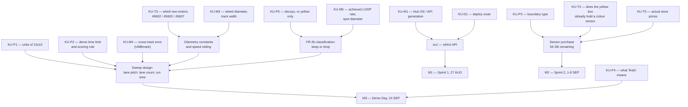

# Known Unknowns — register

**Type:** ACTIVE-SPEC (living register) · **Created:** 2026-08-25 · **Status:** open, and expected to stay open until
Demo Day
**Companions:** [risk-register.md](./risk-register.md) · [conops.md](./conops.md) ·
[requirements-traceability.md](./requirements-traceability.md) · [verification-plan.md](./verification-plan.md)

This is the single place a session looks to find out **what we do not yet know**. It is not a question
list and not a risk list. [questions-for-the-professor.md](./questions-for-the-professor.md) is the
*message* we send; [risk-register.md](./risk-register.md) is what *goes wrong*; this is the *state of our
ignorance*, including the parts nobody has to be asked about.

The register exists because this project has an unusual amount of it: the mission was briefed verbally
and captured in one sentence, the hub has never been connected, and we do not know which two motors we
own. Every number in [../../src/config.py](../../src/config.py) marked `[ASSUMED]` is a
row here.

---

## How to use this file

**Reading it.** Before starting any work, check whether the thing you are about to build depends on an
`OPEN` row. If it does, either parameterize around it (preferred — that is the whole strategy in
[../scope.md § How we proceed meanwhile](../scope.md#how-we-proceed-meanwhile)) or stop and close the
unknown first. Do not average two guesses into a design.

**Updating it — every session, as part of the work, not afterwards:**

1. **New unknown discovered** → add a row to the group that matches *how it gets resolved*, not what it
   is about. Give it the next free ID in that group. IDs are never reused, never renumbered.
2. **Unknown resolved** → set Status to `CLOSED`, put the answer and its **date and source** in the row,
   then **propagate**: the value's real home is [../scope.md](../scope.md) § Assumptions,
   [../../src/config.py](../../src/config.py),
   [../hardware/build-record.md](../hardware/build-record.md), or
   [../hardware/port-map.md](../hardware/port-map.md) — update *there* and strike the `[ASSUMED]` /
   `[UNKNOWN]` marker. A row closed here but not propagated is worse than an open row, because the code
   still holds the guess while the register says we know.
3. **An answer changes the design** → that is an ADR ([../decisions/INDEX.md](../decisions/INDEX.md)),
   and usually a roadmap re-sequence. Say so in the row.
4. **A row turns out to be a risk too** → cross-reference it; do not restate it. Several rows here are
   the *cause* of a risk in [risk-register.md](./risk-register.md).

**Closing rules — non-negotiable ([../directives/honest-instrumentation.md](../directives/honest-instrumentation.md)):**

- An unknown is closed by **a person who was asked** (named, dated) or by **a measurement** (value,
  units, conditions, date). Never by inference, never by "it's almost certainly X".
- A best-assumption column entry is **not** an answer. It is what the code currently runs on so that work
  is not blocked, and it stays tagged `[ASSUMED]` everywhere it appears.
- `UNKNOWN` is a legitimate terminal state for Demo Day and for the report. "We did not measure this"
  is a defensible sentence in a verification section; a fabricated number is not.

**Status vocabulary:** `OPEN` (nobody has acted) · `ASKED` (question sent, awaiting reply — record when)
· `SCHEDULED` (a measurement is planned; name the session) · `CLOSED` (answer + source + date recorded,
and propagated).

---

## What gates what

Only the rows that actually block a milestone. Everything else is uncertainty we can carry.

Read it as: **KU-P1 and KU-M1 are the two that gate the most.** One is free to close (ask a question);
the other needs the hub in hand on 27 AUG.

---

## Group A — Ask the professor

These cannot be closed any other way. They are the content of
[questions-for-the-professor.md](./questions-for-the-professor.md); that page is the ranked message, this
is the state. **Do not default any of them silently** — where a default exists it is named below and it
is tagged `[ASSUMED]` at every point of use.

| ID | Unknown | Why it matters / what it blocks | How it resolves | Best assumption now | Status |
|---|---|---|---|---|---|
| **KU-P1** | **"10×10" — ten *what*?** Feet, inches, tiles, grid cells? | The single highest-leverage unknown in the project. Sets lane count, path length and run time across **two orders of magnitude** — 1 m of driving at 10 in, 125–204 m at 10 ft ([../findings/coverage-time-budget.md](../findings/coverage-time-budget.md)). At the top of that range exhaustive single-sensor coverage does not fit a demo slot and the **design** changes, not the tuning. Blocks M2 sweep parameters and every purchase justified by them | Q1 to the professor, in writing, first | `ARENA_WIDTH_MM = ARENA_LENGTH_MM = 1000.0` in [config.py](../../src/config.py) — a **placeholder chosen to make the code run**, not an estimate | `OPEN` |
| **KU-P2** | **Demo run time limit, and whether finding *all* is required.** Attempts allowed? May the Builder intervene mid-run? | Decides the objective function. "Found all of them" → tight lanes, slow, exhaustive. "Found the most in the time" → wide lanes, fast, accept misses. **These optimize in opposite directions**, so we cannot tune before we know which one scores. Compounds KU-P1 | Q2 | None. Not defaultable — building for the wrong objective wastes a class session out of five | `OPEN` |
| **KU-P3** | **What bounds the arena** — walls, tape, coloured border, or nothing? | The largest *purchase* consequence with 56 SB left: walls → Distance Sensor 45604; tape/colour border → a second colour channel; nothing → pure odometry, and drift becomes the dominant failure mode (FR-6). Blocks the sensor buy and the boundary-handling code | Q3 | `[ASSUMED]` nothing — pure odometry, the most pessimistic case, so a real boundary can only help | `OPEN` |
| **KU-P4** | **What "finds" means as a deliverable** — a count, locations, stopping on each, retrieving them? | A count is a two-day build. A location map needs trustworthy dead reckoning and is a substantially larger project (parked on the roadmap FRONTIER). Retrieval is a mechanical redesign. Sets FR-4 and possibly FR-3 | Q4 | `[ASSUMED]` a count reported on the hub, laptop-free — the narrowest defensible reading (scope FR-4) | `OPEN` |
| **KU-P5** | **Yellow only, or are there decoy colours?** If other colours exist, ignore them or classify them? | Two separate consequences. (a) Robustness: if yellow is the only thing on the floor, reflected-light presence detection suffices and FR-2b goes away. (b) **Run time**: classification needs several *pure* samples inside a note, capping traverse speed at ~160 mm/s at a 20 mm chord vs ~360 mm/s at 30 mm ([../research/color-discrimination.md](../research/color-discrimination.md)). So it compounds KU-P1 and KU-P2 | Q5 — ask alongside Q1/Q2, not after | `[ASSUMED]` decoys may exist, so classification is built as an **optional layer on top of** presence detection and never a prerequisite for counting | `OPEN` |
| **KU-P6** | **How many mines, and how placed.** Fixed count or varying? Can two be adjacent or touching? On or across the boundary? | Adjacent notes are the classic double-count / merge-into-one failure and FR-3 says *exactly once*. A known fixed count is also a free end-of-run sanity check we would otherwise not have | Q6 | `[ASSUMED]` count varies and notes may be adjacent — the harder case; the event-width gate in [config.py](../../src/config.py) exists for it | `OPEN` |
| **KU-P7** | **Arena floor surface, and whether we can practise on it.** Carpet, tile, poster board? Same arena for every team? | Calibration is floor- and lighting-specific: the surface sets reflected-light contrast, wheel slip, and therefore both detection and odometry. Tuning on the wrong surface is wasted class time out of five sessions | Q7. Partly also KU-M6/KU-M8 once we can see it | `[ASSUMED]` classroom carpet **or** tile — recorded as a range, not a value ([../scope.md § Assumptions](../scope.md#assumptions)) | `OPEN` |
| **KU-P8** | **Demo Day scoring rubric in writing; any size or parts constraint on the robot beyond the budget** | We are optimizing against a rubric we have not read. A size limit would also constrain the multi-sensor fallback for KU-P1 | Q8 | `[ASSUMED]` no constraint beyond the 100 SB budget | `OPEN` |
| **KU-P9** | **Intro Report logistics** — point value, `.docx` or PDF or both, one per team or one per student, page limit | Sets how much report work is individual vs shared, and therefore the 18 SEP plan. Template §1.6 says "submit both source and PDF", but that is the *conference's* instruction, not necessarily the course's ([../course/report/INDEX.md](../course/report/INDEX.md)) | Ask with Q8 | `[ASSUMED]` one report per team, submitted as `.docx` **and** PDF | `OPEN` |
| **KU-P10** | **Who owns a Hub OS update decision**, if a tool demands one | It is a one-way door on shared equipment and it stops hub identification dead. Currently blacklisted ([ADR-0001](../decisions/0001-stock-lego-firmware-only.md)); we need to know whether the course would even permit it | Ask before the first hub session | **STOP and ask.** Never accepted unattended, ever — this is blacklist-level and the default does not expire | `OPEN` |
| **KU-P11** | **Is there a spare hub** if ours fails or is bricked? | Decides whether a dead hub is a delay or a project-ender, and how much schedule slack M1 needs | Ask the professor or TA | `[ASSUMED]` no spare — treat the hub as irreplaceable | `OPEN` |
| **KU-P12** | **When the communications record is actually due** — "at the end of this project" (instructions p.1) | It is a graded submission collected **in full**; if it is due 15 SEP with the journal, collection has to start now, not on the 18th ([../course/team/communications.md](../course/team/communications.md)) | Ask with Q8 | `[ASSUMED]` 15 SEP, with the journal and peer review ([../course/deliverables.md](../course/deliverables.md)) | `OPEN` |

---

## Group B — Measure it (hub, robot, or host)

Nobody can tell us these. They close with **a number, its units, and the conditions it was taken under**,
written into `docs/findings/` on the day ([../directives/documentation-discipline.md](../directives/documentation-discipline.md)).
Most of them need the hub, which has never been connected — so most of them are gated on the 27 AUG
session.

| ID | Unknown | Why it matters / what it blocks | How it resolves | Best assumption now | Status |
|---|---|---|---|---|---|
| **KU-M1** | **Hub OS / API generation — SPIKE 2 or SPIKE 3.** `from spike import PrimeHub` vs `import motor` / `from hub import port` / `import runloop` | Blocks **all** hub-side code. The two APIs are mutually incompatible, and most tutorials online target the obsolete SPIKE 2 one, so a stale search result fails in a way that reads like a hardware fault. Also determines which sensor modes and which battery call exist | [../runbooks/hub-identification.md](../runbooks/hub-identification.md) — **read-only**, must not trigger an update. Record the version string **verbatim** | None. Explicitly `[UNKNOWN]` in [../scope.md](../scope.md); no code is written against a guess | `SCHEDULED` — Sprint 1, 27 AUG |
| **KU-M2** | **Whether the hub enumerates on this host at all**, and at what VID:PID | Everything hardware sits behind it. Research expects LEGO `0694` and cites `0694:0009` — *sourced, not confirmed against our unit*. The VID:PID is also what the ModemManager suppression rule keys on | `lsusb` + `dmesg` at first plug-in, after `scripts/setup-host.sh` has run. Record the line verbatim | `[ASSUMED]` it appears as `/dev/ttyACM0` | `SCHEDULED` — Sprint 1 |
| **KU-M3** | **Wheel diameter, effective rolling circumference, and track width** as actually built | Required for *every* odometry conversion: degrees→mm, lane length, turn angle. The nominal figure is not the loaded figure, and the loaded figure is surface-dependent | Builder measures the built robot; effective diameter comes from a commanded-vs-actual test drive. Record in [../hardware/build-record.md](../hardware/build-record.md) | `[ASSUMED]` LEGO's own wheel, 56 mm diameter / 176 mm per revolution ([LEGO lesson figure, via ../research/color-discrimination.md](../research/color-discrimination.md)) — **we have not confirmed our wheels are that wheel** | `OPEN` |
| **KU-M4** | **Cross-track error over one lane** — how far off line the robot really ends up | Sets the maximum lane pitch, and therefore the total path length and run time. At 15 mm the usable pitch falls from 76 mm to 46 mm and the 10 ft case goes from 125 m to 204 m. It is a *multiplier* on KU-P1 | UMBmark square-path run on the demo surface, then set `CROSS_TRACK_ERROR_MM` from the result | `[ASSUMED]` 15 mm, explicitly flagged **optimistic** in both [config.py](../../src/config.py) and [../findings/coverage-time-budget.md](../findings/coverage-time-budget.md) | `OPEN` |
| **KU-M5** | **The achieved Python LOOP rate and the colour sensor's spot diameter at the mounted height** | **Corrected 2026-08-26 — these are two different numbers and the smaller one governs.** The sensor's *device* rate is a LEGO spec figure (100 Hz); the rate a MicroPython loop actually achieves on this hub is a separate, unmeasured, and probably lower quantity ([../research/hub-compute-limits.md](../research/hub-compute-limits.md) §3.2). **The effective rate is whichever is lower**, and it is that one that sets the traverse-speed ceiling — the number the whole time budget rests on. Spot diameter sets the smallest resolvable feature and the width of the hysteresis-flicker zone | Timestamp 1000 reads in a tight loop — that measures the LOOP rate, which is the one we need, not the device rate; slide the sensor across a sharp black/white boundary in 1 mm steps for the spot ([../research/detection-and-sweep-techniques.md](../research/detection-and-sweep-techniques.md) Open Q1, Q5) | `SAMPLE_RATE_HZ = 100.0` — the **LEGO spec figure, UNVERIFIED** for what a Python loop actually achieves, and `TRAVERSE_SPEED_MMS = 150.0` `[ASSUMED]` beneath the ceiling this row sets. Spot diameter: no assumption | `OPEN` |
| **KU-M6** | **Reflected-light values of the real floor and the real target**, at the real height, under the real lighting | This separation *is* the feasibility argument for detection, and it is the first row of the report's results section. If contrast is under `MIN_CONTRAST`, calibration is designed to fail loud rather than proceed | Two readings with units, height, surface, lighting, and date — Sprint 1 item 9 ([2026-08-25-sprint-1-walking-skeleton.md](./2026-08-25-sprint-1-walking-skeleton.md)) | None. Deliberately no assumed value: thresholds are derived by run-start calibration (TR-4), never hard-coded | `SCHEDULED` — Sprint 1, **blocked on owning a sensor** |
| **KU-M7** | **The real sticky notes** — dimensions, colours in the pack, matte/gloss | 76 mm is the assumption the entire lane-pitch arithmetic is built on. A 51 mm note shrinks the usable pitch from 46 mm to **~21 mm** on the finding's formula (16 mm once `config.py`'s extra 5 mm `LANE_OVERLAP_MM` margin is applied) and the coverage problem becomes much worse; a larger note makes it easier. The colour set decides whether FR-2b is even attemptable | Physically measure the pack the course uses. Ties to KU-P5 — the professor may supply the notes | `TARGET_SIZE_MM = 76.0`, `[ASSUMED]` standard 3 in note, **never seen or measured** | `OPEN` |
| **KU-M8** | **Degrees-to-mm constant and wheel slip on the actual surface** | The single most important odometry constant, and it is surface-dependent — carpet and tile give different answers with the same code | Drive a commanded 1000 mm, measure actual, 10 runs per surface | None | `OPEN` |
| **KU-M9** | **Gyro yaw drift, and 90° turn repeatability** | Sets how often lanes must be re-squared and feeds directly into KU-M4. SPIKE has a documented pathology of the gyro reading stuck at 0 or drifting from boot — worth a pre-run health check either way | Stationary yaw log over 180 s ×5; then 10 turns, measure final heading error | None. Community drift figures exist but no LEGO spec — treat every quoted number as UNVERIFIED | `OPEN` |
| **KU-M10** | **Does the robot displace the notes it drives over?** | If it does, the mission needs a mechanical redesign, and any second pass over a lane counts a note that has moved. This is cheap to check and catastrophic to discover late | Sweep over placed notes; photograph before and after | `[ASSUMED]` no — untested, and the assumption is doing real work | `OPEN` |
| **KU-M11** | **Which battery call this hub supports, and what "enough charge for a run" is in volts or percent** | [../runbooks/demo-day.md](../runbooks/demo-day.md) has a pre-run battery gate with no number in it. Motor speed sags with battery state, which shifts the traverse speed and therefore the event-width gate | Read it from the hub during dry runs, not from the app; write the number into the runbook | None. Which call works is itself a KU-M1 clue | `OPEN` |
| **KU-M12** | **Does the CSER 2022 `.docx` survive a LibreOffice round trip?** — 20 `Els-*` styles, 192×262 mm trim, two WMF images, one OLE equation object | The report is due 18 SEP and our only office suite is LibreOffice. Discovering this on the 17th is unrecoverable; discovering it now costs 15 minutes | The scripted procedure already exists in [../course/report/INDEX.md](../course/report/INDEX.md) — run it, record the result as a finding with the LibreOffice version and date | `[ASSUMED]` it fails on the WMF/OLE objects — pessimistic on purpose, because that is the assumption that makes us test early | `OPEN` |
| **KU-M13** | **Stopping distance at sweep speed** | Only matters if KU-P4 comes back as "stop on each mine" — but if it does, the sensor's forward offset must exceed it, and that is a *mechanical* constraint on the Designer, not a code fix | Five trials at sweep speed once the robot drives | None | `OPEN` — deferred until KU-P4 lands |

---

## Group C — Ask a teammate

Closed by a person on this team, usually in one written message. **Several of these are things the
Programmer is not permitted to find out alone**: reading the part number off a motor means handling
supplies, which is a −2 SB role violation ([../course/team/roles.md](../course/team/roles.md)). Ask;
do not go and look.

| ID | Unknown | Why it matters / what it blocks | How it resolves | Best assumption now | Status |
|---|---|---|---|---|---|
| **KU-T1** | **Who the four team members are, and who holds which role** | Every recommendation in this repo is addressed to a role. If the names behind the roles are unknown, requests go nowhere, the journal and peer evaluation cannot name anyone, and the report has no author list. Also: **the register must never invent a name** | Ask the team; fill in [../course/team/roles.md](../course/team/roles.md) | None. All four are `TBD` and stay `TBD` | `OPEN` |
| **KU-T2** | **Is the operator the Programmer?** | If not, most of this repo's advice is pointed at the wrong person, and following it could cost 2 SB a time. Sprint 1 assigns items on this basis | Confirm with the team | `[ASSUMED]` Programmer — inferred from the operator's own notes, recorded as an assumption in [../scope.md](../scope.md) | `OPEN` |
| **KU-T3** | **Which two motors we own — Large Angular 45602, Medium Angular 45603, or Small Angular 45607** | They differ in speed, torque, and control accuracy, and both appear on the ledger as just "Motors" at 10 SB. The large motor sits at 29–49 % of no-load in the 150–250 mm/s classification band with torque headroom for carpet; the small one sits at **46–77 %**, close enough to its ceiling that a carpet seam or a sagging battery becomes a speed dip — which becomes a wrong event-width gate and a variable sample pitch. Research recommends the large one for drive ([../research/color-discrimination.md](../research/color-discrimination.md) §5.3) | **Builder** reads the part number or compares physical bulk. **A no-load spin test cannot separate Large from Medium** — 1050 vs 1110 deg/s is 5.7 % apart, inside LEGO's own ±15 % tolerance — and the "crosshole on the output face" test excludes only the Small. Record in [../hardware/build-record.md](../hardware/build-record.md) | **Revised 2026-08-25:** there are **three** candidates, not two, and set 45678 ships **2 Medium + 1 Large**, so `[ASSUMED]` **both are Medium 45603** is now the likeliest case. The Medium is the *fastest* of the three (1110 vs 1050 large vs 660 small deg/s). No speed figure may be quoted as fact until this closes — [../research/speed-envelope.md](../research/speed-envelope.md) | `OPEN` |
| **KU-T4** | **Does the yellow box already contain a Colour Sensor 45605** (or any sensor from the course kit)? | The ledger shows **no sensor owned**, and detection is the whole mission. If the kit supplies one, the 56 SB stays available for the KU-P1 fallback designs; if not, this is Sprint 1's one anticipated purchase | **Builder** checks the box and reports before anything is bought | `[ASSUMED]` no sensor in the box — the ledger is the source of truth ([../../inventory.py](../../inventory.py)) | `OPEN` |
| **KU-T5** | **Actual current store prices** for Colour 45605, Distance 45604, Force 45606, mounting blocks, axles | 56 SB remaining, prices may change during the project (RR-5), and sell-back returns only 90 % rounded down — so a wrong purchase is a permanent ~10 % loss. We cannot size the KU-P1 fallback ("more sensors") without them | **Supplier** reports — they are the only person who may approach the store. Record the price actually paid per line in [../../inventory.py](../../inventory.py) | None. There is deliberately no price list in the repo to go stale | `OPEN` |
| **KU-T6** | **What the 10 SB "Project budget reallocation" line on 2026-08-25 was for** | It is 23 % of the 44 SB spent so far (`./inventory.py --verbose`) and the ledger does not say what it bought or why. The report's resource section has to explain it, and if it is reversible it is 10 SB back toward a sensor | Ask the **Supplier** or the operator; expand the description in [../../inventory.py](../../inventory.py) | None | `OPEN` |
| **KU-T7** | **The built chassis geometry** — sensor mounting height and forward offset, track width, where the sensor sits relative to the wheels | Sensor height sets the optical spot and the usable contrast; forward offset is the budget for any "stop on the target" behaviour and multiplies heading error into lateral error during turns. All of it is the **Designer's** decision, and this repo records rather than authors it | Written request to the **Designer**, with the research recommendation attached, **before** the Supplier buys mounting blocks | None. LEGO's ~16 mm optimal sensing distance is a spec figure, UNVERIFIED against our build | `OPEN` |
| **KU-T8** | **Which channel the team's written communication actually happens on**, and who exports it | All written communication is a graded deliverable submitted **in full**. Whatever the channel is, the export has to be possible — and the export tooling in [../course/team/communications.md](../course/team/communications.md) is entirely UNVERIFIED because nothing is installed here | Ask the team; then test the export **once, early**, with a throwaway thread | None | `OPEN` |

---

## Group D — Decide ourselves

Nobody is going to answer these. They are open because the *inputs* are open or because nobody has yet
done the work. Each closes as a decision — and the ones marked **ADR** close as a written
[decision record](../decisions/INDEX.md), not as a line in a chat.

| ID | Unknown | Why it matters / what it blocks | How it resolves | Current leaning | Status |
|---|---|---|---|---|---|
| **KU-D1** | **The deploy route from Ubuntu to the hub**, primary and named fallback | LEGO ships no Linux desktop app. This sits between us and *every* hardware result, and it is the least certain thing in the project | **ADR-0004**, written after the Sprint 1 walking skeleton actually puts a file on the hub — not before ([../research/spike-prime-linux-toolchain.md](../research/spike-prime-linux-toolchain.md)) | Undecided. Chrome + WebSerial is the known fallback since google-chrome is installed | `OPEN` |
| **KU-D2** | **The detection scalar: `reflection()` or `rgbi()[3]`** | Decides the input to the whole edge-counting chain. It is not knowable from documentation — it is a contrast-to-noise comparison on our floor | Log both simultaneously across a floor/note boundary, compare CNR. Depends on KU-M1 (which calls exist) and KU-M6 | `reflection()`, because colour mode spatially averages at target edges, which is fatal for edge counting | `OPEN` |
| **KU-D3** | **Sensor mounting height, angle, and forward offset — the *recommendation* we hand the Designer** | Must be settled **before** the Supplier buys mounting blocks, because sell-back costs 10 % permanently. Ours to research, the Designer's to decide (KU-T7) | Derived from [../research/color-discrimination.md](../research/color-discrimination.md) and [../research/detection-and-sweep-techniques.md](../research/detection-and-sweep-techniques.md), sent in writing | ~16 mm sensing height, modest forward offset, symmetric shroud | `OPEN` |
| **KU-D4** | **What to spend the remaining 56 SB on** | Sensor count is the main lever on the KU-P1 coverage problem: more colour sensors across the robot's width multiply the effective swath. Also the Distance Sensor decision (KU-P3) | [2026-08-25-coverage-strategy-trade-study.md](./2026-08-25-coverage-strategy-trade-study.md) § 1 already carries a standing pre-answer recommendation; the *rest* of the spend waits for KU-P1, KU-P2, KU-P3, KU-T4, KU-T5. **ADR** | **One** colour sensor — the trade study finds it needed under every cell of the Q1 × Q2 table, so that need is demonstrated, not speculative (subject to KU-T4). The 2nd and 3rd sensors, and anything else, wait for evidence | `OPEN` — the first sensor is decidable now; the remainder is blocked |
| **KU-D5** | **Exhaustive coverage, or accept probabilistic coverage?** | If KU-P1 is feet and KU-P2 is a short slot, exhaustive coverage is arithmetically off the table and we must choose deliberately — and *report the coverage fraction honestly* rather than claiming completeness. **ADR** | Decide the moment KU-P1 and KU-P2 land. The options are costed and cross-tabulated against Q1 × Q2 in [2026-08-25-coverage-strategy-trade-study.md](./2026-08-25-coverage-strategy-trade-study.md) | Exhaustive, because FR-3 says "all" — abandon it only on evidence | `OPEN` — blocked, and this is the decision most likely to change the architecture |
| **KU-D6** | **Does FR-2b (colour classification) stay a requirement?** | It caps traverse speed, which compounds the coverage problem. Dropping it costs nothing already built, because classification is layered on top of presence detection by design | Follows KU-P5, plus a go/no-go bench separability test on the real pack ([../research/color-discrimination.md](../research/color-discrimination.md) §8) | Keep it optional and layered; drop it without regret if the professor says yellow-only or the colours do not separate | `OPEN` |
| **KU-D7** | **Whether to gear the drive down or fit smaller wheels** for encoder resolution | Direct drive gives 0.489 mm/count and ±1.5 mm control accuracy — figures that rest on the `[ASSUMED]` 56 mm / 176 mm wheel of KU-M3 and the motors' ±3° spec, so they move if either closes differently; 2:1 halves both. Buys precision, costs top speed — which trades directly against the KU-P1 time budget, and adds backlash | Decide only if KU-M4 shows cross-track error is dominated by resolution rather than by heading drift. Requires the Designer | Direct drive. Do not add mechanism to solve a problem we have not measured | `OPEN` |
| **KU-D8** | **Serial terminal: `tio` or the already-installed `screen`** | Trivial, and listed only so it stops being re-litigated every session. `screen` is present; `tio` is not ([../findings/host-environment.md](../findings/host-environment.md)) | Pick one in `scripts/setup-host.sh` and stop thinking about it | Either. Install `tio` if the network cooperates, otherwise `screen` works | `OPEN` |

---

## What to close first

Ranked by *consequence × cost to close*, not by how interesting they are.

1. **KU-P1 + KU-P2 + KU-P5** — one written message, no hardware, no money, and they gate the architecture.
   Nothing else on this page has that ratio. See [risk-register.md § R-01](./risk-register.md).
2. **KU-T3 + KU-T4** — two questions to the Builder. One decides whether our speed arithmetic is even
   using the right motor curve; the other decides whether Sprint 1's first measurement can happen at all.
3. **KU-M1** — the 27 AUG hub session's whole purpose. Read-only, and it unblocks all hub-side code.
4. **KU-M12** — 15 minutes at a keyboard, and the only alternative is discovering it the night before the
   report is due.

---

## Revision History

| Date | Change | By |
|---|---|---|
| 2026-08-25 | Created. 12 professor unknowns, 13 measurement unknowns, 8 teammate unknowns, 8 decisions — mined from `scope.md`, `questions-for-the-professor.md`, the three research documents' open-question sections, the runbooks' UNVERIFIED markers, and `config.py`'s `[ASSUMED]` values. | Claude |
| 2026-08-25 | Adversarial audit: corrected the KU-M7 lane-pitch figure (~16 mm → ~21 mm on the finding's formula), the KU-T6 share of spend (18 % → 23 % of 44 SB), KU-D4's leaning (it contradicted the trade study's standing recommendation to buy one colour sensor now), and marked KU-D7's encoder figures as resting on the assumed 56 mm wheel. | Claude (audit) |
