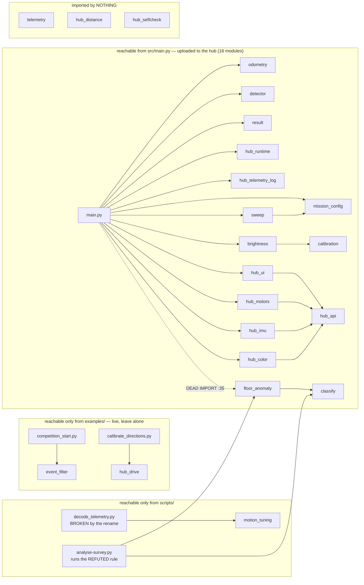

# Minimalism and conformance review — 2026-09-09

**Status:** ACTIVE-SPEC · host-only · **the hub was never touched** · nothing in `src/`, `examples/`
or `scripts/` was edited — every change below is a specification for the operator. Measured against
`~/llm-project-bootstrap/` (`code-discipline`, `dead-code-cleanup`, `documentation-pruning`,
`scope-discipline`, `automation-first`, `honest-instrumentation`) and this repo's own
[CLAUDE.md](../../CLAUDE.md) / ADRs. Cuts belong in `src/` and `scripts/`; **`examples/` are
experiments and the default is LEAVE THEM ALONE**. Companion, not duplicate:
[competition-program-readiness-2026-09-09.md](./competition-program-readiness-2026-09-09.md) owns
the *defect* list for `src/main.py`; this owns *what is dead, duplicated and non-conformant*.

## 1. TL;DR

### Cut NOW (all host-side, none of it on the robot's execution path)

| # | Cut | Why it cannot wait |
|---|---|---|
| 1 | **`scripts/analyse-survey.py` — the final "WHAT THIS MEANS FOR THE RUN" block, incl. the `if tape:` blue-veto advice** | It is the **demo-day site-survey tool** and it prints the **opposite of the measurement**. [MEASURED, I ran it] |
| 2 | `scripts/decode_telemetry.py:23` `import config` → `import mission_config as config` | The script is **broken today**: `AttributeError` at :156 |
| 3 | `probes/import_check.py:30` `"config"` → `"mission_config"` in `DEFAULT` | Would report `FAIL config` against a healthy hub |
| 4 | `src/main.py:35` `import floor_anomaly`, `:91`/`:255`/`:263` `floor_model` | Dead, and drags **15.1 KB / 2 upload round-trips** onto the pre-demo deploy |

Items 1–3 are pure host tooling: zero hardware, zero risk to the graded program. Item 4 touches the
graded program, so it goes in **one review pass with the readiness plan's other `main.py` edits**.

### Cut AFTER the demo
`src/telemetry.py` · `src/hub_distance.py` · `src/hub_selfcheck.py` (all genuinely dead, all blocked
on a **markdown-link migration** — §3) · the `decode_telemetry` → `runlog` decoder merge ·
`runlog.py`'s unasserted geometry copy · the `main.py` → `hub_drive` motion merge.

### Do NOT cut, on minimalism grounds, ever
`src/floor_anomaly.py` **the file** (recorded refutation evidence; the Intro Report is written from
it) · `motion_tuning.py`'s nine uncalled functions (the *derivations* behind MEASURED constants) ·
`hub_drive.py`'s geometry mirror · any long MEASURED comment block. Aggressive minimalism here means
deleting the dead *import*, the lying *knob* and the duplicated *decoder* — never the evidence.

## 2. The import graph

Built with `ast` over **99 `.py` files** in all five code directories, resolving `Import`,
`ImportFrom` and string-literal `__import__`/`import_module`, then transitively closed from
`src/main.py` [MEASURED today]. Cross-checked against `deploy_deps.py src/main.py`, which
independently resolves **16 local deps** — the same closure.

**6 of 23 `src/` modules are unreachable from `main.py`; 3 of those are reachable from nothing.**

## 3. Dead code — the cut list

`dead-code-cleanup.md`: *detect and report, never auto-delete; require multiple signals.* Each entry
below passed three: the static `ast` graph, a textual grep across `.py`/`.sh`/`.json`, and a
dynamic-reference check (`probes/import_check.py`'s string list, `deploy_deps.py`'s resolver, and no
`importlib`/`getattr` dispatch anywhere in the repo).

| Module | ast evidence | Doc links that would break | Verdict |
|---|---|---|---|
| `src/main.py:35 import floor_anomaly` | `pyflakes`: *imported but unused*; zero attribute uses in the file | none (the **file** stays) | **DELETE the import** — see §1 |
| `src/main.py` `floor_model` (:91, :255, :263) | 2 writes, 0 reads; `model` is hard-coded `None` at :255 | none | **DELETE** |
| `src/floor_anomaly.py` (the file) | reachable in `main.py` only via the dead import; live consumer `scripts/analyse-survey.py` | **12** files link it | **KEEP AS EVIDENCE** |
| `src/classify.py` | after the import cut: host-only, used by `analyse-survey.py` | 9 | **KEEP** (stops being deployed — that is the win) |
| `src/telemetry.py` | **0 of 5** public symbols (`header_lines`, `record_line`, `trailer_lines`, `expected_sum_seq`, `Recorder`) referenced anywhere; superseded in fact by `hub_telemetry_log.CsvLog` | **16** files, incl. 2 in `docs/findings/` and 2 session records | **DELETE — AFTER Thursday**, and only with a link-migration decision first |
| `src/hub_distance.py` | imported by nobody; device formally REJECTED (`docs/research/distance-sensor-evaluation-2026-09-08.md`: "SKIP. Buy nothing"); `hub_api.DISTANCE_PORT` is `None` on every branch | 1 | **DELETE — AFTER Thursday** |
| `src/hub_selfcheck.py` | imported by nobody; `SELFCHECK` was collapsed into `CALIBRATE_FLOOR` | 1 | **DECIDE AFTER Thursday** — repair or retire, see below |
| `src/event_filter.py` | `examples/competition_start.py` | — | **KEEP** (live example consumer) |
| `src/motion_tuning.py` | `scripts/decode_telemetry.py`; only 2 of 11 public functions ever called | — | **KEEP ALL OF IT** — recorded method, not dead code |
| `src/calibration.py` | reachable via `brightness` (`median`, `median_absolute_deviation`, `CalibrationError`) | — | **KEEP** — genuinely deployed |

**The link fan-out is why nothing gets deleted this week.** `check_links()` resolves relative links
against the filesystem and passes over **202 markdown files** [MEASURED]. Deleting *or* archiving
`telemetry.py` turns the repo's **only standing guard** red, and two of its 16 links live in dated
`docs/findings/` that `documentation-pruning.md` puts off-limits. That turns "three clean deletes"
into "needs a link-migration plan" — not a Wednesday-night job.

**Both dead hub modules also carry a real defect — and it must NOT be drive-by-fixed this week.**
`pyflakes` finds 6 undefined names in `src/`: `hub_distance.py:26` (`_distance`, which lives in
`hub_api`) and `hub_selfcheck.py:48-52` (`read_motor_degrees` ×2, `read_yaw_deg`, `read_reflection`,
`read_distance_mm`) — this morning's `hub_color._color` class. Both are **unreachable**, so neither
bug can fire, and a competition-path fix with zero behaviour change is churn one day out. `hub_selfcheck`'s `except Exception` at :59 additionally
files a `NameError` as *empty port* to the Builder — an honest-instrumentation violation that argues
for **repair, not retirement**, once the readiness plan's arming check exists. **Never prune into a
gap.** Retirement is a documented decision: archive the file or record the git SHA and add a status
line.

## 4. Duplication — every fact with more than one authority

### 4a. The analysis-script decoder — the abstraction already exists

**`scripts/runlog.py` IS the shared decoder** — well built, it names its own duplication out loud in
its docstring, and `analyse-run.py` (:34) and `compare-runs.py` (:26) both use it (both exit 0). The
problem is **two non-adopters**, which is why the same near-zero-total guard was independently
rediscovered twice in one day:

| Constant | Copy A | Copy B | Note |
|---|---|---|---|
| saturation `1000` | `runlog.py:80 SATURATED_AT` | `analyse-survey.py:43 SATURATED_AT` | same value, same comment |
| near-zero total `30` | `runlog.py:87 MIN_CHROMA_TOTAL` | `analyse-survey.py:44 MIN_TOTAL` | **different name**, both landed in commit `ccdab17` |

`runlog.py`'s own comment even names the other copy. Stating a duplication is honest; it does not
resolve it. **Fix:** `analyse-survey.py` imports `runlog` and uses `runlog.SATURATED_AT` /
`runlog.MIN_CHROMA_TOTAL` (verified importable from that script's path context) — ~4 lines, fold
into the §5.1 pass. `decode_telemetry.py`'s local `load()` (:31-46) is strictly weaker than
`runlog.load` (drops `#end reason=` lines, no schema detection, no malformed-row count) and should
adopt it **after Thursday** — its unique value is entirely in the sections, not the loader.

The **loaders themselves must stay separate**: `analyse-survey` reads `scan-surface`'s `SV,`
labelled-sample format, `runlog` the 24-column mission CSV — forcing one over both would be worse.

### 4b. Geometry — one guarded mirror, several unguarded copies

| Value | Definitions | Guarded? |
|---|---|---|
| `WHEEL_DIAMETER_MM = 63.5` | `mission_config:142` · `hub_drive:60` · `runlog:51` (+`WHEEL_CIRCUM_MM 199.49` at :52) | `hub_drive` **yes**, `runlog` **no** |
| `TRACK_WIDTH_MM = 95.0` | `mission_config:146` · `hub_drive:61` | yes |
| encoder counts `360.0` | `mission_config:156` · `hub_drive:62` · `runlog:53` | `hub_drive` yes, `runlog` no |
| motor mirror signs `-1/+1` | `hub_api:292-293` · `hub_drive:86-87` · `runlog:54-55` | **no** |
| mine threshold `30` | `mission_config:69 MINE_REFL_ON` · `runlog:59 RULES` | no |
| blue fraction `0.44` | `runlog:61` · three files in `examples/` | no |

**`hub_drive`'s mirror KEEPS its justification** even after the rename: `import mission_config`
**has never executed on the hub** (`main.py` has never run), and the hazard demonstrably still
exists on **this host** — with `src/` on the path, `import config` binds
`/home/devel/ros2_ws/build/lidar_mapping/config`, a ROS2 namespace package, returning
`__file__ = None` [MEASURED today]. Generic short module names collide, and this repo has now been
bitten on two platforms. Cost of carry: 3 constants and a loud host check. Cost of being wrong: the
mission program dies at import. Keep the mechanism, **fix the comment** (`hub_drive.py:46-59` still
calls `src/config.py` the source of truth; that file does not exist), and add one sentence at
`:76-77`: `except ImportError: pass` means a wrong-module resolution degrades to a silent no-op
rather than crashing a run — deliberate, but it reads like a bug.

### 4c. The three lane-pitch models — one implemented, blocked on a ruler

1. **`mission_config.lane_pitch_mm()` = 41.0 mm** [COMPUTED, verified today] — `TARGET_SIZE_MM −
   2·CROSS_TRACK_ERROR_MM − LANE_OVERLAP_MM`. **No sensor-count and no spacing term.** This is what
   the robot runs; `lane_count(3048) = 75`.
2. **`docs/findings/coverage-time-budget.md`: `P(S) = S + (W − 2e − m)`** — the two-sensor model.
   Implemented **nowhere** in `src/`.
3. **`docs/plans/competition-program-design.md`: `pass_pitch = lane_pitch + SENSOR_SPACING`** — the
   same idea in a third notation.

One model at two sensor counts; (2) and (3) are blocked on the same missing number —
**`SENSOR_SPACING_MM` is `[UNMEASURED]` (KU-M33)**. Reading both ports (fixed 2026-09-09) changed
**nothing** about the pitch. **Do not implement `P(S)` with a guessed `S`** — that is the one change
that silently loses mines.

### 4d. Loop rate — four stated values for one measured fact

`CLAUDE.md:78` (median 54 ms / mean 75 ms = 13.3 Hz) · `docs/todo.md` ("20 Hz") ·
`mission_config.py:191-193` ("9.18 Hz … ALREADY TOO FAST", against a superseded `TICK_MS`) ·
`coverage-time-budget.md:357` ("unmeasured, KU-M5"). Load-bearing: `max_safe_speed_mms(13.3) = 161.7`
vs `(9.18) = 111.6` mm/s [COMPUTED today] against a shipped `TRAVERSE_SPEED_MMS = 150.0`. **Make
`CLAUDE.md` the single authority and cite it from the other three** — but `coverage-time-budget.md`
is a finding, so add a dated header note rather than editing its body.

## 5. Doctrine violations — ordered by what would actually bite

### 5.1 `scripts/analyse-survey.py` prints the opposite of the measurement — on demo morning
`honest-instrumentation.md`: *"One accountable path per concern. Two verdict paths WILL drift and
disagree."* `scan-surface.py`'s own header calls this pair *"the demo-day site-survey tool …
characterise the real arena in a couple of minutes before a run."* I ran it: **exit 0, no warning**,
and its closing section tells the operator

> `MINES NOT RELIABLY DETECTED: CARPET_MIDHOLE, YELLOW_MIDHOLE, YELLOW_NOTE, YELLOW_SWEEP`
> `BOUNDARY TAPE ALSO TRIPS THE DETECTOR … -> needs the blue veto`

Both are the exact opposite of what `CLAUDE.md` and `src/brightness.py` ship. **Two compounding
causes:** it runs the REFUTED chromaticity rule via `floor_anomaly`, *and* its `load()` drops any
saturated or `r+g+b<30` sample at `:62`/`:65` **before anything is scored** — correct hygiene for
chromaticity, fatal for a reflectance question: it discards **298 of 497** `YELLOW_NOTE` samples per
port, precisely the **brightest** ones (reflectance 98-99), then scores the dim survivors.

Scoring the **shipped** rule (`reflection >= mission_config.MINE_REFL_ON = 30`) on the identical
file, all samples, no chroma filter [MEASURED — replayed today]:

| label | C | D | | label | C | D |
|---|---|---|---|---|---|---|
| `BLUE_TAPE` (+`_MIDHOLE`) | **0.0 %** | **0.0 %** | | `YELLOW_NOTE` | 95.8 % | 60.6 % |
| `CARPET_MIDHOLE` | **0.0 %** | **0.0 %** | | `YELLOW_SWEEP` | 90.3 % | 82.7 % |
| `YELLOW_MIDHOLE` | 100.0 % | 100.0 % | | `PINK_NOTE` | 79.3 % | 78.8 % |

Total separation. (The sub-100 % mine figures are the hand-held capture's on/off-note transitions.)

**Fix, in minimalism order.** *(a) CUT, mandatory, ~15 lines:* delete the whole "WHAT THIS MEANS FOR
THE RUN" block including the `if tape:` blue-veto branch. *(b) CUT, 2 lines:* retitle the anomaly
section **"REFUTED chromaticity rule (2026-09-08, real carpet) — kept for comparison, NOT what the
robot runs"**, citing `../findings/colour-survey-and-first-detection-2026-09-08.md`, and correct the
`:7` docstring claim that it *"Runs the REAL detection code"* — it does not. *(c) ADD, ~25 lines:* a
new **first** section "THE SHIPPED RULE (reflection >= 30)" — in `load()`, collect field index 6
into `by_refl[label][port]` **before** the two `continue`s; print n / min / median / p90 / max and
`% >= config.MINE_REFL_ON`, then `brightness.derive_thresholds(by_refl['FLOOR'][port])` as ARM or
REFUSE with its reason string.

**(c) pays off immediately, and this is the sharpest thing this review found.** Replaying
`brightness.derive_thresholds()` on that file's `FLOOR` label **REFUSES on both ports** — *"90th
percentile floor 24 [C] / 28 [D] against an on-threshold of 30"* — while the `CARPET_MIDHOLE`
control **ARMS cleanly on both**. `FLOOR` holds 27 saturated samples per port and **9.4 % of its
samples ≥ 30**: something bright crossed the sensor during that hand-held capture. Honestly: this is
**[COMPUTED] from a hand-held survey, not [MEASURED] from a driven floor burst — no driven burst has
ever been logged.** But `main.py`'s `calibrate_floor()` **drives while sampling**
(`CALIBRATION_FLOOR_MS = 3000` at 150 mm/s ≈ 450 mm of creep, detector off), so the failure is free
to prevent: **give the ARMED tap on clean carpet with a clear 500 mm ahead** — worth a line in
`../runbooks/demo-day.md`. Once (c) lands, the two-minute site survey answers this on Thursday
morning instead of the arena answering it during the graded run.

### 5.2 Two rename orphans, and the guard that cannot see them
`automation-first.md`: *a re-typed pipeline drifts from the tested one.* `scripts/decode_telemetry.py:23`
still does `import config`; the import **does not fail** (it binds the ROS2 namespace package, §4b)
and the script dies at `:156` with `AttributeError: module 'config' has no attribute
'WHEEL_DIAMETER_MM'` [MEASURED]. `probes/import_check.py:30` still lists `"config"` first in
`DEFAULT`, so it would report `FAIL config` against a healthy hub. **Both are one-line fixes (§1).**

Why nobody caught them: `check_src_purity()` and `check_src_imports()` are scoped to `src/` only —
`scripts/`, `probes/`, `hub_programmer/` and the repo root have **no standing check at all**.

**The guard extension is worth doing, and it is not a test suite** — ADR-0005 is untouched: this
extends the one standing check the project already blesses, executes nothing hub-touching, creates
no `tests/`. Two candidates, catching different things. **(i) static import resolution:** for every
`.py` doing `sys.path.insert(…, "src")`, `ast`-parse it and assert each plain import name is stdlib,
a sibling, or `src/<name>.py` — **this is the one that would have caught `decode_telemetry`, which
`pyflakes` would not, because `config` does resolve.** **(ii) `pyflakes` undefined names** over all
four code dirs — would have caught the `hub_color._color` showstopper.

**Sequencing:** `pyflakes` goes **red immediately** on offenders nothing calls, and it changes the
tool the operator trusts to say the repo is green, the night before a graded demo — add it **after**
those are fixed. The static-import check is safe to add today. Operator's call.

### 5.3 The record still asserts a bug that was fixed this morning
`CLAUDE.md:183`: *"⚠ **KNOWN BUG, still present:** `src/hub_color.py` reads only
`hub_api.COLOR_PORT`. `SECOND_COLOR_PORT` … read NOWHERE in `src/`."* **False.**
`hub_color.read_reflection_second()` (:35) and `read_reflection_pair()` (:55) exist and `main.py`
calls the pair at `:119` and `:243`. Repeated in `docs/todo.md`, `docs/roadmap.md` and
`docs/findings/INDEX.md`. An engineering record that loudly asserts a defect that no longer exists
trains everyone to distrust it.

**Fix `CLAUDE.md:183-186` to:** *"✅ CLOSED 2026-09-09: `read_reflection_pair()` reads both ports and
`main.py` fuses them with `brightness.fuse()`. ⚠ **The swath is still ONE lane pitch wide in the
plan** — `lane_pitch_mm()` has no spacing term, so nothing can raise the pitch until
`SENSOR_SPACING_MM` is MEASURED (KU-M33)."* Same correction in the three other documents — but
*finding* files are durable evidence: edit only their index summaries.

### 5.4 ADR-0004 was edited in place, and the edit shipped a broken glob
`documentation-pruning.md`: *immutable records are OFF-LIMITS.* `docs/decisions/0004-…md` was
modified in commit `aad9fa6`, and the amended filter `grep -v '^src/hub_*.py'` is a shell glob
meaning "hub followed by zero-or-more underscores" — it matches nothing. **The ADR's own
verification command prints 17 lines today, every one a false violation** of the boundary it exists
to verify; the correct filter `grep -v '^src/hub_'` prints **zero** [MEASURED, both run today].

**Fix:** do **not** edit ADR-0004 again. Prepend a dated header note in the **ADR-0006 style** (this
repo's own correct pattern — *"the decision stands; … recorded here rather than by editing the
decision below"*), stating the lapse, the broken glob, the correct filter, and that
`./scripts/check-docs.py` is authoritative.

### 5.5 `src/main.py` cannot be walked on the host
ADR-0005 leaves a never-run program three verification surfaces: the interpreter, throwaway
one-liners, and the robot. `main.py:30` imports `time` and `:58-63` define `_now`/`_since` on
`time.ticks_ms`, MicroPython-only — `main._now()` raises `AttributeError` on the host [MEASURED] —
while `hub_api.now_ms()` exists for precisely this and its docstring says it *"MUST work on the
host — the state machine is walked there"*. Two paths for one concern, and the cost is that the
graded deliverable cannot be exercised on a keyboard the night before the demo. **Fix (~6 lines):**
`_now()` → `hub_api.now_ms()`, `_since(t0)` → `hub_api.now_ms() - t0`, drop `import time`. **Bundle
with the readiness plan's `main.py` pass.**

### 5.6 A knob that lies, and 7 knobs that do nothing
`main.py:231` gates on `DETECT_MODE not in ("brightness", "anomaly")` and then calls
`brightness.derive_thresholds()` unconditionally — setting `"anomaly"` **silently runs the
brightness front end**. Tighten to `!= "brightness"` and mark `"anomaly"` REFUTED-AND-REMOVED in the
`mission_config.py:56-61` comment block. (Behaviour change → readiness-plan pass, not tonight.)

Separately, **seven `mission_config` constants are read by nothing** — not by any of the five code
dirs, nor by `mission_config` itself [MEASURED, 0 hits each]: `BOUNDARY_MARGIN_MM` (:28) ·
`CALIBRATION_SAMPLES` (:103) · `CALIBRATION_PLACEMENTS` (:104) · `CALIBRATION_PROMPT_TIMEOUT_S`
(:120) · `MAX_CONSECUTIVE_NONE` (:208) · `HEADING_DISAGREE_LIMIT_DEG` (:211) · `STUCK_YAW_TICKS`
(:214). An operator under demo pressure turning `MAX_CONSECUTIVE_NONE` expects a behaviour change
and gets none. **Fix: comment only** — tag each `# NOT WIRED 2026-09-09 — read by no code.` **Do not
delete them:** each carries recorded design intent, and two become live if the readiness plan's
D9b/D9e land.

### 5.7 `main.py`'s motion duplicates `hub_drive` — and it is CORRECT. Do not merge this week
Derived to the raw `motor.run` calls rather than assumed:
`main.turn_degrees(deg>0)` → `hub_motors.drive(+s,−s)` → `LEFT_MOTOR_FORWARD_SIGN=−1` /
`RIGHT_MOTOR_FORWARD_SIGN=+1` → `motor.run(A,−v)`, `motor.run(B,−v)`.
`hub_drive.spin_right(dps)` → `_run(LEFT_FWD·dps·TURN_SIGN, −RIGHT_FWD·dps·TURN_SIGN)` with
`LEFT_FWD=−1`, `TURN_SIGN=+1` → `motor.run(A,−dps)`, `motor.run(B,−dps)`. **Identical.**
`main.py`'s `deg > 0 = right` is corroborated by the one direction measurement a human actually
**watched** (`examples/calibrate_directions.py`, 2026-09-08). **There is no latent direction bug.**

The divergences are behavioural, not directional: `main.py` has **no coast lead** (`hub_drive`'s
`TURN_LEAD_DDEG = 28`, MEASURED n=6) and the two use different units (percent vs deg/s). Merging
buys correctness the program **already has**, at the price of **two simultaneous behaviour changes
in a program that has never executed one instruction on hardware**, one day out.

**Today, comment only** — above `main.py:185`: *"Duplicates `src/hub_drive.turn_by()`. VERIFIED
EQUIVALENT by derivation 2026-09-09 … divergences: no `TURN_LEAD_DDEG` coast lead, and
percent-vs-dps units. Fold into `hub_drive` after the first successful hardware run."* That converts
silent duplication into **recorded, bounded** duplication — exactly what `runlog.py` already does
for its own copies. **One exception pre-decided:** if the first bench run overshoots its turns,
**adopt `hub_drive.turn_by`** (which owns the measured lead) — do **not** hand-tune a new constant
in `main.py`. Re-deriving a measured number in a second place is how the corner rule got re-tuned
against noise.

### 5.8 Smaller, still real
* **`main.py:261` swallows the calibration diagnostic.** `brightness.py:108-118` raises
  `CalibrationError` with quantified messages; `:252-262` catches bare `Exception` and returns
  `False`, and `:391-394` shows a bare `x` covering *five* distinct causes. Bind the exception and
  print `CALIBRATION_FAILED: <reason>` — a slot program's stdout is retrievable, so it is free.
* **`hub_programmer/upload.py:8-12`** tells the operator to run `./scripts/hub_upload.py
  src/config.py --apply --to /flash/lib/config.py`: the invocation path does not exist, the source
  file does not exist, and the destination is **precisely the name MEASURED to be hijacked**.
  Rewrite the four lines and add *"NEVER upload anything as `/flash/lib/config.py`."*
* **`CLAUDE.md` presents a boundary rule the graded program does not have.** `b/(r+g+b) >= 0.44`
  appears **nowhere in `src/`** — it lives in `examples/` and `runlog.py`, while `main.py` runs
  `BOUNDARY_MODE = "odometry"` with `CMD_RESQUARE` a documented no-op (`:320`). Add one clause:
  *"— PROVEN in `examples/` only; `src/main.py` has no boundary detection at all."*
* **`mission_config.py` disagrees with itself.** `:18-19` says 229 m for the 3048 mm arena and
  `:36-40` says 231.6 m for the same case; all three rows of that table quote a path computed from
  *n+1* lanes — the functions give 914 mm → 23 lanes / **21.02 m** (comment: 21.9) and 762 mm → 19
  lanes / **14.48 m** (comment: 15.2) [COMPUTED today]. Its docstring also opens *"Nothing here is a
  measurement"*, now untrue of `MINE_REFL_ON/_OFF/_MARGIN`. Replace the hand-typed table with a
  pointer to `./scripts/coverage-budget.py`, which already owns that arithmetic.
* **`docs/plans/` is where scope discipline is slipping** — 38 files, ~1.1 MB, nine written in 48 h,
  five on one topic (corner turns / boundary tracing), one self-labelled *"post-demo work"* and
  another conceding *"tracing is a prerequisite for nothing that is graded"*; `INDEX.md` is 35 KB.
  **Before Thursday change nothing but the labels** — mark those five plus `blind-teleoperation.md`
  and `telemetry-over-bluetooth.md` **DEFERRED — POST-DEMO** in `INDEX.md` so tomorrow morning's
  session cannot pick one up. Prune after the report ships, with a dry-run manifest, never into
  findings, session records or ADRs.
* **Missing local distillations.** `docs/directives/` has 14 files against upstream's 21; the absent
  ones are the passes now overdue — `dead-code-cleanup`, `documentation-pruning` (and
  `testing-pruning`, genuinely N/A under ADR-0005 and worth recording as **deliberately not
  adopted** rather than silently missing). Add the first two after the demo.

## 6. Deferred — named out loud, so it is deferred and not half-finished

| Deferred | Trigger to revisit |
|---|---|
| Deleting `telemetry.py`, `hub_distance.py`, `hub_selfcheck.py` | after the demo, **after** a link-migration decision (16 + 1 + 1 markdown links) |
| Fixing the `hub_selfcheck` / `hub_distance` undefined names | with the repair-or-retire decision; both are unreachable, so nothing can fire |
| `decode_telemetry.py` → `runlog.load()` merge | after the demo (today it gets only the one-line import fix) |
| `runlog.py`'s drift assertion against `mission_config` | after the demo |
| `main.py` → `hub_drive` motion merge | the first working day **after** `main.py` completes one sweep on hardware — that is the known-good baseline the swap currently lacks |
| `pyflakes` check in `check-docs.py` | after §3's undefined names are fixed, so its first run is green |
| Two-sensor lane pitch `P(S)` | after `SENSOR_SPACING_MM` is MEASURED (KU-M33, a ruler) |
| De-duplicating `0.44` / `MIN_CHAN_SUM` into `examples/` | when each example is next touched on hardware — `examples/` is off-limits |
| ADR-0008 for the slot-upload deploy route (ADR-0007 still describes the superseded one) | after the Intro Report |
| `docs/plans/` prune; the two missing local directives | after the Intro Report |

## 7. Open questions for the operator

1. **Does `import mission_config` actually resolve correctly on the hub?** It has never executed
   there — it is the assumption `hub_drive`'s mirror exists to survive, and one line closes it:
   after deploy, `import mission_config; print(mission_config.WHEEL_DIAMETER_MM)`, the **very
   first** thing in the staged bring-up, before any motion.
2. **Add the static `scripts/`-import check to `check-docs.py` today, or is any change to the one
   standing guard too much churn before a graded demo?** My read: do it — read-only, executes
   nothing, and it is the guard that would have caught `decode_telemetry`. But it touches the tool
   you trust to say the repo is green, so it is your call.
3. **Is the `FLOOR` capture contaminated, or is the arena carpet genuinely that variable?** A
   3-second capture on Thursday's actual carpet settles it — and §5.1(c) makes the survey say so.
4. **`hub_selfcheck.py`: repair as the pre-run diagnostic, or retire?** Its docstring says *"A
   DIAGNOSTIC, not a test"* — the one category of verification ADR-0005 keeps, which argues for
   fixing. But if the readiness plan's arming check inside `calibrate_floor()` is the intended
   replacement, that check must exist **first**.
5. **Retiring the three dead modules after Thursday: ADR, or a session-record note with the git
   SHA?** `hub_distance` looks ADR-shaped (it encodes the distance-sensor SKIP); the other two look
   like a note.
6. **`hub_api.py:230-240` keeps the whole SPIKE 2 branch**, which its own comment calls known-dead
   on our hub and defers as *"an ADR-shaped call … Raised, not done."* It is the largest remaining
   block of provably unreachable code in `src/`. Retire by ADR after the demo, or keep?
7. **`CLAUDE.md` declares 300 mm/s a REQUIREMENT while `max_safe_speed_mms(13.3)` computes a hard
   ceiling of 162 mm/s** at the measured loop rate. Both cannot hold. The demo path resolves it by
   sweeping a declared 914 mm region at 150 mm/s — defensible and documented — but nothing in
   `CLAUDE.md` says the 300 mm/s requirement is currently unreachable. That belongs in your hands.

**Method note.** Every number came off this host today from the tree as it stands, and [MEASURED]
means *I ran it*: the `ast` import graph (99 files), `pyflakes`, `check-docs.py`,
`analyse-survey.py`, `decode_telemetry.py`, `deploy_deps.py --dry-run`, the shipped-rule replay
against `../findings/runs/surface-survey-2026-09-08.txt`, and both forms of ADR-0004's grep. **The
hub was never touched; no hardware result is reported.**
