# Minimalism Contract for `src/main.py` — 2026-09-03

**Type:** ACTIVE-SPEC · **Owner:** the **Programmer** · **Refines, does not replace:**
[mission-algorithm.md](./mission-algorithm.md) · [competition-operations-2026-09-03.md](./competition-operations-2026-09-03.md).

Operator steer, 2026-09-03: *"keep things open… perhaps we don't need as much code as we thought… stick
with the basics so we can modify on competition day… some parameters we cannot know until competition day
and even then we might have to skip over some parameters."*

This is the contract that lets `src/main.py` stay unwritten as a **framework** and be written as a
**switchboard**. Every open unknown is bound to ONE config knob and classified **REQUIRED / OPTIONAL /
SKIPPABLE**. On the day the team changes a **value** or **disables a stage** — never a state, never a line
of logic. Nothing here is measured; every value is `[ASSUMED]` and every call site `[UNVERIFIED]`.

---

## 1. The unknown → knob → degradation table

| Open unknown | Class | The ONE knob (`config.py`) | If we SKIP / can't answer it on the day |
|---|---|---|---|
| **Time box** (Q2) | **REQUIRED** | `RUN_TIMEBOX_S` | Cannot skip — it is the safety net. Unknown → set it **short**; a partial sweep with an honest `lanes_completed` beats a run the instructor cuts off. |
| **Floor** (may change / be the multicolour carpet) | **REQUIRED** | learned at `CALIBRATE_FLOOR`; gated by `MAX_FLOOR_MAD`, `K_MAX` | Cannot skip — `floor_anomaly.build_floor_model()` learns it at run start. Too busy/noisy → `CALIBRATION_FAILED`. **Refusing to arm is a correct outcome** (mission-algorithm C1/C2). |
| **Arena units / size** (Q1) | **REQUIRED** *(value only)* | `ARENA_WIDTH_MM`, `ARENA_LENGTH_MM` | Cannot skip the value; can skip *knowing it*. Set generous and let `RUN_TIMEBOX_S` bound the run — [coverage-time-budget](../findings/coverage-time-budget.md). Wrong-low silently short-counts, so bias **large + timebox**. |
| **Drivetrain geometry** | **REQUIRED** *(value only)* | `WHEEL_DIAMETER_MM`, `TRACK_WIDTH_MM`, `CROSS_TRACK_ERROR_MM` | Cannot skip; carried as config (BM-3/4/8). Unmeasured → lanes wrong length, in proportion; the machine is unchanged. |
| **Mine colour** (verbal "I think yellow") | **OPTIONAL** | `DETECT_MODE` *(RECOMMENDED knob, below)* + `TARGET_COLOUR_NAME` | Default `DETECT_MODE="anomaly"` needs **no sample and no colour**: `floor_anomaly` flags anything unlike the learned floor. `"target"` (known exemplar, [calibration.py](../../src/calibration.py)) is the bolt-on and needs OC-9 "yes". |
| **Boundary type** (Q3: tape / wall / none) | **OPTIONAL** | `BOUNDARY_MODE` (`"odometry"` default) | Skip → dead-reckon lanes, no boundary stop; `RESQUARE` stays a **no-op** (mission-algorithm §Functions). `"distance"`/`"wall"` need hardware we do not own. |
| **Decoy colours** (Q5) | **SKIPPABLE** | `CLASSES` (len 1) | Skip → presence-only: no RGB classification, one class, **higher speed ceiling**. Len>1 loads `classify.py` and the §4.4 separability gate. |
| **Compound mine** (e.g. yellow+blue sticker) | **SKIPPABLE** | `CLASSES` / `classify.py` | Skip → the compound still reads as a strong anomaly and is **counted once**, booked UNKNOWN, never split, never forced into a class (mission commitment 1). |
| **Mines ADDED / REMOVED mid-run** | **REQUIRED behaviour, NO knob** | — (architectural) | Guaranteed by **count-on-falling-edge, report-as-you-go**: each crossing is booked when seen; a removed mine is simply not seen; a new one is counted when swept. **Completion = coverage, not a tally.** The only code that assumes persistence is the OPTIONAL mine-map de-dup (`MineLedger`, not in tree) — leave it off. |
| **Traverse speed** | **OPTIONAL** *(tuning)* | `TRAVERSE_SPEED_MMS` | Slower is always safe; presence/anomaly tolerates more speed than classification. Start slow. |
| **Telemetry / SLAM offload** | **SKIPPABLE** | `TELEMETRY_LIVE_ENABLED=False`, `LOG_EVENTS_ONLY` | Skip live BLE and even the event log — the autonomous count is unaffected. The map is a laptop-side, after-the-run bonus (competition-operations Part 2). |
| **Line-following** (M2/M3/M5) | **SKIPPABLE** | movement-mode select | The ~25 mm sensor **wobble swamps the steering signal** ([mounting-wobble](../findings/colour-sensor-mounting-wobble-2026-09-03.md)). Odometry lawnmower (M4) is the default; do not wire line-following. |

`DETECT_MODE` is a **RECOMMENDED** new knob (not yet in `config.py`): `"anomaly"` selects the
[floor_anomaly.py](../../src/floor_anomaly.py) front-end (learn floor, flag deviations, **no target
sample**); `"target"` selects [calibration.py](../../src/calibration.py) (known exemplar, needs
`CALIBRATE_TARGET` and OC-9). Both feed `detector.EdgeCounter` **unchanged** — one counter, two front
ends — so the switch is a value, not a rewrite.

---

## 2. The irreducible core

The smallest machine that still competes when **everything OPTIONAL is skipped**: anomaly presence-only,
odometry lanes, timebox, count aloud as you go. It needs no target sample, no colour, no boundary sensor,
no classifier, no telemetry. State names are the machine of record's — this is a **subset**, not a fork.

```mermaid
stateDiagram-v2
    [*] --> ARMED : slot upload auto-Starts; motors HELD (does NOT calibrate on the bench)
    ARMED --> CALIBRATE_FLOOR : operator tap — ON THE ARENA
    CALIBRATE_FLOOR --> READY : floor model learned + tick rate measured
    CALIBRATE_FLOOR --> CALIBRATION_FAILED : floor too noisy / too busy — refusing to arm is CORRECT
    READY --> SWEEP : operator tap, then the 10 s COUNTDOWN loop reaches 0
    SWEEP --> SWEEP : odometry lane / turn / step — count on each falling edge, beep as you go
    SWEEP --> REPORT : last planned lane swept [COMPLETE]
    SWEEP --> REPORT : RUN_TIMEBOX_S elapsed [TIMEBOX]
    SWEEP --> ABORT : operator side-button press
    ABORT --> REPORT : motors stopped FIRST, partial count kept [ABORTED]
    REPORT --> [*] : operator stops the program
    CALIBRATION_FAILED --> [*] : operator stops the program
    note right of READY
      COUNTDOWN is a LOOP on this edge, not a state.
      SELFCHECK and DERIVE collapse INTO CALIBRATE_FLOOR here:
      port check + threshold-build are steps, not extra boxes.
    end note
```

**The core, as a list:** `ARMED → (tap) → CALIBRATE_FLOOR → READY → (tap + 10 s countdown) → SWEEP
(odometry + timebox, report-as-you-go) → REPORT → stop`, with `CALIBRATION_FAILED` and `ABORT` as the two
honest exits. Every OPTIONAL feature is a **bolt-on toggled by one knob**, and each one only *adds* a
transition or a step to this same skeleton:

- `CALIBRATE_TARGET` + `DERIVE` (known exemplar) — inserted before `READY` when `DETECT_MODE="target"`.
- `classify.py` (decoys / compound) — a call inside step 8 of the tick when `len(CLASSES)>1`.
- Boundary stop / `RESQUARE` — a degraded-mode check + a no-op command when `BOUNDARY_MODE≠"odometry"`.
- Event log + BLE telemetry — output-only writes when `LOG_EVENTS_ONLY` / `TELEMETRY_LIVE_ENABLED`.

None of them changes the core. An answer from the professor moves a value; it never moves a box.

---

## 3. Competition-day tuning card

The **only** knobs the operator edits in the field, with safe defaults. Edit **values**, never logic.

| # | Knob | Safe default | Change it when… |
|---|---|---|---|
| 1 | `RUN_TIMEBOX_S` | `300` | The demo slot is known — set it, always. When unsure, go **short**. |
| 2 | `ARENA_WIDTH_MM`, `ARENA_LENGTH_MM` | `1000`, `1000` | Q1 answered. Unsure → set **generous**; the timebox protects you. |
| 3 | `DETECT_MODE` | `"anomaly"` | A sample mine **may** be placed (OC-9 yes) and you want colour — then `"target"`. |
| 4 | `TARGET_SIZE_MM` | `76` | Measure the real note; it sets `lane_pitch_mm()`. |
| 5 | `TRAVERSE_SPEED_MMS` | `150` | Counts look noisy/short → **lower it**. Never raise under pressure. |
| 6 | `BOUNDARY_MODE` | `"odometry"` | Only if a tape/wall boundary is **confirmed** and its sensor is fitted. |
| 7 | `CLASSES` | `("target",)` | Decoys confirmed (Q5) — add one name per colour; expect the separability gate to bite. |
| 8 | `COUNTDOWN_S` / `START_SLOT` | `10` / `0` | Operational preference only. |

**DO NOT hand-edit on the day** (structural — they are set as *pairs* and a lone edit silently arms a run
our own research says to refuse): `MIN_CONTRAST`, `MAX_FLOOR_MAD`, `MIN_SNR_MAD`, `HYSTERESIS_FRACTION`,
`MIN_DWELL_SAMPLES`, `MIN_EVENT_SAMPLES` / `MAX_EVENT_SAMPLES` (**derived at run start**), and
`floor_anomaly`'s `K_MAX` / `MERGE_SIGMAS` / `MIN_DEV_MAD`. If detection is wrong, change speed (5) or
re-run calibration — not a gate.

---

## 4. What we deliberately do NOT write

Over-engineering to refuse, precisely because the day may throw the parameter away:

1. **No persistent mine MAP / `MineLedger` de-dup in `main.py`.** Mines move mid-run; the count is
   on-encounter. A map that assumes fixed mines would mis-handle the one thing the operator flagged. The
   map is a laptop-side, after-the-run bonus — never a run dependency.
2. **No default `CALIBRATE_TARGET` / classifier path.** Gate it behind `DETECT_MODE="target"` and OC-9.
   The irreducible core learns the floor and flags anomalies — it needs no sample and no known colour.
3. **No compound-signature ("yellow+blue") detector.** SKIPPABLE — a compound reads as one strong anomaly
   and is counted once as UNKNOWN. Building a two-colour signature is machinery for an unconfirmed rule.
4. **No line-following control law** (M2/M3/M5). The ~25 mm mount wobble makes the two-sensor error signal
   unusable; the code would be dead weight.
5. **No BLE host→motor command / live SLAM engine.** BLE is **output-only** and secondary; the PoC is a
   working autonomous count. `TELEMETRY_LIVE_ENABLED=False` by default.
6. **No slot/program picker, no tap-vs-hold ms discrimination.** One slot, re-upload to swap; STOP is a
   **press**, not a hold (competition-operations D3).
7. **No auto-retry or threshold-lowering after `CALIBRATION_FAILED`.** Refusing to arm is the correct
   outcome; a lowered gate reads phantom counts aloud to the instructor.
8. **No `TARGET_COLOUR_HINT` / tolerance gate.** `calibrate()` already raises on low contrast/SNR;
   re-catching it with a new `[ASSUMED]` number is redundant (competition-operations §3.5).

The rule underneath all eight: **build the narrowest defensible run, parameterised.** A clarified answer
on Demo Day changes a value in §3 or disables a §1 stage — it never sends anyone into the logic.

---

## Sources

- [mission-algorithm.md](./mission-algorithm.md) — the run machine of record, the parameter table, the 15
  degraded modes · [competition-operations-2026-09-03.md](./competition-operations-2026-09-03.md) — `ARMED`,
  the countdown loop, retargetable colour, the recommended config additions
- [competition-movement-options-2026-09-03.md](./competition-movement-options-2026-09-03.md) — movement
  modes M0–M5 · [colour-sensor-mounting-wobble-2026-09-03.md](../findings/colour-sensor-mounting-wobble-2026-09-03.md)
  — why line-following is dropped
- [../../src/config.py](../../src/config.py) · [../../src/floor_anomaly.py](../../src/floor_anomaly.py)
  (anomaly front-end) · [../../src/calibration.py](../../src/calibration.py) (target front-end) ·
  [../../src/detector.py](../../src/detector.py) (the one counter both feed) ·
  [../../src/classify.py](../../src/classify.py) · [conops.md](./conops.md) — OC-9 (may a sample be placed)
