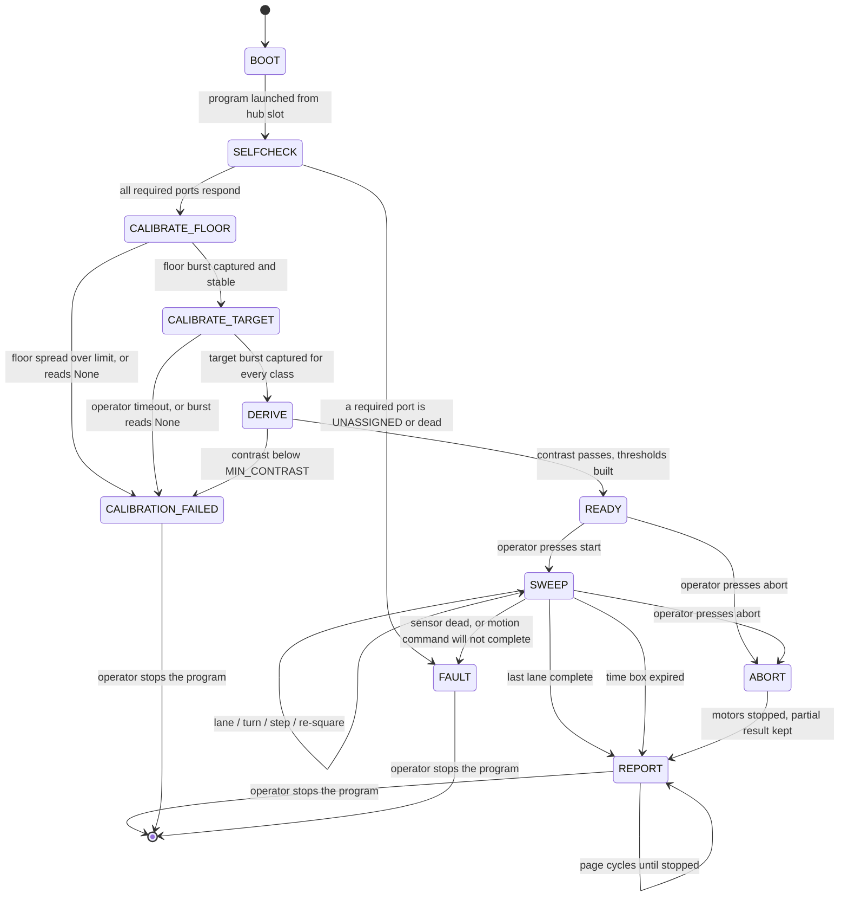
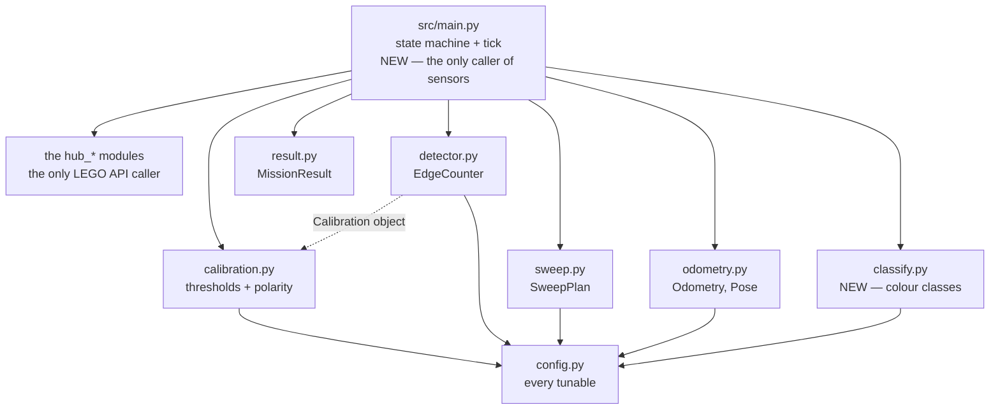

# Mission Algorithm — the program the robot runs, start to finish

> **Type:** ACTIVE-SPEC · **Created:** 2026-08-26 · **Owner:** the **Programmer**
> **Implements:** FR-1 · FR-2 · FR-3 · FR-4 · FR-5 · TR-2 · TR-4 —
> [requirements-traceability.md](./requirements-traceability.md)
> **Executed by:** [../runbooks/demo-day.md](../runbooks/demo-day.md) · operated per
> [conops.md](./conops.md) (this is the design CONOPS § 9 defers to)
> **Numbers come from:** [bench-measurement-plan.md](./bench-measurement-plan.md) ·
> **Techniques come from:** [../research/detection-and-sweep-techniques.md](../research/detection-and-sweep-techniques.md) ·
> [../research/color-discrimination.md](../research/color-discrimination.md) ·
> [../research/hub-compute-limits.md](../research/hub-compute-limits.md)

**This is the specification the mission code is written from.** It exists so that one programmer can
open it and write `src/main.py` without re-reading nine research documents. It **cites** those
documents and never restates them: where a number, a threshold or a technique is justified elsewhere,
this document links to it and moves on. Reproducing a trade study here would be a defect
([../directives/documentation-discipline.md](../directives/documentation-discipline.md)).

**Nothing below has run.** The hub has never been connected, no sensor is owned, and no number here is
a measurement. Every value is `[ASSUMED]` or `UNVERIFIED` unless it cites a measurement that exists.

---

## Summary

The robot runs **one program, one press, no laptop**. It boots, checks its ports, drives a short
stretch of bare floor to learn what "floor" reads as, is shown a target, derives its own thresholds,
waits for the operator, sweeps the arena in boustrophedon lanes counting targets on confirmed falling
edges, and then stands still and steps a result through its 5×5 matrix and speaker until it is stopped.

Six design commitments hold the whole thing together:

1. **Presence detection is the mission; classification is a layer on top.** A detection is counted
   whether or not it can be classified. This is already decided (CONOPS OS-4) and is honoured
   structurally: `detector.py` never sees a colour, and `result.py` books an unclassifiable detection
   as UNKNOWN-with-a-reason rather than dropping it or guessing.
2. **Exactly one sensor call per tick, and one detection scalar for the whole run.** Compute headroom
   on this hub is an order-of-magnitude estimate at best
   ([hub-compute-limits.md § 3.2](../research/hub-compute-limits.md)), so the tick calls
   `hub_color.read_rgb()` **or** `hub_color.read_reflection()` — never both. **Which one is chosen once, at
   BOOT, from `len(config.CLASSES)`**: 1 → `read_reflection()`, more → `read_rgb()`. That choice is
   bound to a module-level `READ_DETECTION` in `main.py` and **CALIBRATE_FLOOR and CALIBRATE_TARGET call
   the same one**. Calibrating in reflection space and running in `rgbi` space would put every threshold
   in the wrong units and fail silently — the single easiest way to lose a run.
   **`UNVERIFIED`, and it gates the RGB path:** `config.MIN_CONTRAST = 12.0` is in *reflectance points*
   (0–100). The scale of `read_rgb()[3]` is unknown on both API generations (`hub_color.read_rgb()`
   docstring; Q5 below), so `MIN_CONTRAST` **may not be carried across**. Until BM-0(a) is run on the
   RGB path, presence-only is the only calibrated path.
3. **The robot measures its own tick rate during calibration** and derives the event-width gates from
   the measured rate, not from `config.SAMPLE_RATE_HZ`. Calibration is already driving and already
   sampling; the rate is free, and it is the one parameter whose wrongness silently converts targets
   into rejected noise.
4. **Refusing to run is a correct outcome.** CALIBRATION_FAILED is a first-class terminal state, not
   an exception path.
5. **Every terminal state reports.** ABORT, time-box expiry and fault all route through REPORT with a
   status. A run that stops without saying what it found is a lost class session.
6. **An answer from the professor changes a value in `config.py`, never a state in this machine.**
   § 6 is the list of those values; if a question's answer would change the architecture instead,
   that is a defect in this spec and is called out in § 9.

---

## The run as a state machine



| State | What it does | Moves on when | Failure exit |
|---|---|---|---|
| **BOOT** | Nothing but bind. `hub_api.api_generation()` is read and shown, because the API generation is still unknown ([../runbooks/hub-identification.md](../runbooks/hub-identification.md)) | Immediately | — |
| **SELFCHECK** | `hub_selfcheck.selfcheck()`. An UNKNOWN result is **not** a pass | Every **required** probe is `OK` — see below | → FAULT, with the failing probe's name shown |
| **CALIBRATE_FLOOR** | Drives slowly forward over bare floor, sampling. Also counts its own ticks to measure the achieved rate | Burst complete and spread within `MAX_FLOOR_MAD` | → CALIBRATION_FAILED |
| **CALIBRATE_TARGET** | Stationary. Operator presents a target under the sensor and presses; one burst per placement, per class | All placements captured | → CALIBRATION_FAILED (including operator timeout) |
| **DERIVE** | `calibration.calibrate()`, then the width gates from the measured rate | A `Calibration` object exists | → CALIBRATION_FAILED |
| **READY** | Motors held stopped. Waits. **The only state that accepts a start** | Start button | → ABORT |
| **SWEEP** | The main loop (§ Main loop). Owns `SweepPlan`, `Odometry`, `EdgeCounter`, `MissionResult` | `SweepPlan.is_done()` | → REPORT (time box) · → ABORT · → FAULT |
| **REPORT** | Motors stopped, then cycles result pages on matrix and speaker, forever | Never — the operator stops the program (FR-5) | — |
| **ABORT** | Motors stopped **first**, then falls through to REPORT with `status = ABORTED` | Immediately | — |
| **CALIBRATION_FAILED** | Motors stopped. Shows which check failed and the two levels that were not separable. **Never sweeps** | Never | — |
| **FAULT** | Motors stopped. X pattern, descending tone, a fault code | Never | — |

**Do not gate SELFCHECK on `report["verdict"]`.** `hub_selfcheck.selfcheck()` probes five devices including
`distance`, and **no distance sensor is owned** — its probe will report `UNASSIGNED`, which drives the
whole-report verdict to `NOT_OK` and would fault every run. `main.py` reads `report["checks"]` and
requires `OK` only for the names in a `REQUIRED_PROBES` tuple: `("left_motor", "right_motor", "yaw",
"color_reflection")`, plus `"distance"` only when `config.BOUNDARY_MODE == "distance"`. Two further
shapes the caller must handle, both real: on the host `selfcheck()` returns **no `"checks"` key at all**
(verdict `UNKNOWN`), and a probe dict carries `"detail"` rather than `"value"` when it failed — so read
it with `.get()`, never `[]`.

**ABORT and CALIBRATION_FAILED are the two states people leave out**, and both are real: CONOPS
[OS-5](./conops.md) is calibration refusing to arm, and every entry in the failure drill
([../runbooks/demo-day.md § 6](../runbooks/demo-day.md)) ends in the operator stopping a program that
should still have something to say.

**Careful with the drill codes — they are not this document's codes.** The runbook's **A1 STOP** is
*"press the hub's centre button once"*, i.e. the **hard** stop, which maps to degraded mode **AB2**
below, not AB1. Nothing in demo-day § 6 currently presses a *side* button, because the soft abort is new
here. **Action for the Programmer:** once the button behaviour is confirmed on the first hub session, add
the soft abort to demo-day § 6 as its own drill row. Until that row exists, the Builder has not been told
it can do anything but the centre button.

**Two different aborts, and the difference matters.** The hub's centre button stopping a running
program is stock firmware behaviour and is **`UNVERIFIED`** — the hub has never been connected. It
almost certainly kills the program outright, which would skip REPORT. So the program provides a
**soft abort on a side hub button**, polled in the tick, which routes through ABORT → REPORT and keeps
the partial count. The centre button remains the hard stop of last resort; a `try/finally` around the
whole run guarantees motors stop either way. Confirm both behaviours on the first hub session and
write what actually happened into the demo-day runbook.

---

## Calibration

The technique — floor characterisation rather than sensor calibration, medians rather than means,
thresholds from a midpoint plus a band, polarity detected rather than assumed — is established in
[detection-and-sweep-techniques.md § 1](../research/detection-and-sweep-techniques.md) and
[color-discrimination.md § 4](../research/color-discrimination.md). It is not repeated. What follows
is only what the program does.

### CALIBRATE_FLOOR — moving

The robot **drives** for this burst; it does not sample one spot. A stationary burst measures one
square centimetre of floor and lies about the spread.

- Motion: straight, at `TRAVERSE_SPEED_MMS`, for `CALIBRATION_FLOOR_MS`. The operator's job is to
  guarantee that stretch is bare (CONOPS P3).
- Sampling: one call to `READ_DETECTION()` per tick into a list — **the same reader the sweep will
  use** (commitment 2). **`None` readings are counted, never stored** — a None is the absence of a
  reading and must not enter a median.
- **The tick rate is measured here.** `achieved_hz = len(samples) / elapsed_s`. This is the same
  quantity as **BM-5** in [bench-measurement-plan.md](./bench-measurement-plan.md), taken for free at
  run start, and it is what the width gates use.
- Combination: `calibration.median()` for the level, `calibration.median_absolute_deviation()` for the
  spread. Both already exist.
- **Fails** if: fewer than `0.5 × CALIBRATION_SAMPLES` valid samples arrived (the loop is not running
  at the rate anything assumes — the sample-count check from
  [color-discrimination.md § 4.4](../research/color-discrimination.md)); or floor MAD exceeds
  `MAX_FLOOR_MAD`; or every sample was None.

### CALIBRATE_TARGET — stationary, operator-driven

Stationary and prompted, because the robot cannot place a note on itself. Per
[color-discrimination.md § 4.2](../research/color-discrimination.md): `CALIBRATION_PLACEMENTS`
placements × `CALIBRATION_SAMPLES` samples per class, the operator moving the sample between
placements. Placements buy the accuracy; samples past ~20 do not.

- Matrix shows a **class prompt glyph**; the operator presents the sample and presses the side button.
- Each press captures one burst of `CALIBRATION_SAMPLES` readings with no motion.
- With `CLASSES = ("target",)` — the narrowest defensible reading of the mission — this is one class,
  three presses, under 30 s. With decoy colours (Q5), it is one class per colour and nothing else in
  the flow changes.
- **Fails** on: operator timeout (`CALIBRATION_PROMPT_TIMEOUT_S` with no press — the robot must not
  wait forever with motors live), or a burst with fewer than `0.5 × CALIBRATION_SAMPLES` valid readings
  (the same sample-count gate as the floor, so an all-None burst is just its limiting case).
- **What the samples are then used for, and it is two different things.** `calibration.calibrate()` takes
  **one** target list, not a dict, so the presence layer is fed the **concatenation of every class's
  scalars** — presence detection is colour-blind by design (commitment 1) and one floor/target contrast
  is all it needs. The **per-class** lists stay separate and go only to `classify.build_classes()`. With
  `CLASSES = ("target",)` the two are the same list and nothing branches.

### DERIVE

`calibration.calibrate(floor_samples, target_samples)` already does the work and already raises
`CalibrationError` when contrast is below `config.MIN_CONTRAST`. **That exception is the
CALIBRATION_FAILED transition** — the program catches it, shows the failure, and stops. It does not
retry, and it does not lower the threshold.

Then the width gates, from the measured rate:

```
min_samples, max_samples = config.event_width_gates(
    achieved_hz, config.TRAVERSE_SPEED_MMS, config.TARGET_SIZE_MM)
counter = detector.EdgeCounter(cal, min_width=min_samples, max_width=max_samples)
```

The second line is the point of the first. `EdgeCounter.__init__` falls back to
`config.MIN_EVENT_SAMPLES` / `config.MAX_EVENT_SAMPLES` when the keywords are omitted, and those are the
**unmeasured** constants this whole mechanism exists to bypass — an `EdgeCounter(cal)` built without them
silently reinstates the guess. `min_dwell` is left at its default.

**What the operator sees.** The vocabulary comes from
[../runbooks/demo-day.md § 5](../runbooks/demo-day.md), which is explicitly marked there as
`PROPOSED, NOT YET IMPLEMENTED` and *"must be re-checked against the actual program"* — so it is a
proposal this spec adopts, **not something already agreed**. Two rows below are genuinely new and the
runbook has to be updated to match before the first dry run: the split of CALIBRATING into a moving floor
burst and a prompted target burst, and CALIBRATION_FAILED, which § 5 has no row for at all.

| Stage | Matrix | Sound |
|---|---|---|
| SELF-CHECK | Single centre pixel | — |
| CALIBRATING (floor) | Blinking border | Rising two-tone at the start |
| CALIBRATING (target prompt) | Class prompt glyph, steady | One short beep when a burst is captured |
| READY | Solid square outline | One short beep |
| CALIBRATION_FAILED | **X** pattern | Descending tone, then **two** short beeps repeating |

The repeating two-beep code is the one addition, and it exists to separate CALIBRATION_FAILED from a
generic FAULT (one beep) across a noisy classroom. Both show the X.

---

## Main loop

One tick, in this order. The invariant that matters for compute is **exactly one colour-sensor call per
tick** (commitment 2) — the LPF2 round trip is the unpriced cost in
[hub-compute-limits.md § 3.3](../research/hub-compute-limits.md). The tick also takes motion state and
polls a button; those are cheap, but they are still `sensors` calls, and this document previously
undercounted them.

**Every reader can return `None`, including the motion readers.** `read_motor_degrees()` returns `None`
— *not* a pair — when it cannot read, and it returns `None` on the host in simulated mode. So
`left, right = hub_motors.read_motor_degrees()` raises `TypeError` before any degraded-mode rule can fire.
**Bind first, test for `None`, then unpack.** The same applies to `read_rgb()`: it returns `None` as a
whole, so `read_rgb()[3]` is a crash, not a reading.

| # | Step | Call | Touches LEGO API |
|---|---|---|---|
| 1 | `t = hub_api.now_ms()` | `hub_api.now_ms()` → `int` | time only |
| 2 | `mot = hub_motors.read_motor_degrees()`; `yaw = hub_imu.read_yaw_deg()` | → `(l, r)` **or `None`**; → `float` **or `None`** | **yes**, 2 reads |
| 3 | If `mot is None` → rule **N3**, skip steps 4–10 for this tick. Else `left, right = mot` and `odo.update(left, right, yaw)` — `yaw=None` is a *legal argument*, `odometry` falls back to encoder heading itself | `odometry.Odometry.update(l, r, gyro_heading_deg)` → `Pose` | no |
| 4 | `raw = READ_DETECTION()` — the reader bound at BOOT, not re-decided here | `hub_color.read_reflection()` → `0–100`, **or** `hub_color.read_rgb()` → `(r,g,b,i)`; either **or `None`** | **yes**, 1 read |
| 5 | If `raw is None` → rule **N1** and **skip steps 6–8**. Else `reading = raw if RGB is off else raw[3]` | runner | no |
| 6 | `event = counter.update(reading)` | `detector.EdgeCounter.update(reading)` → `Event` or `None` | no |
| 7 | Classification only: if `counter.state in (detector.ON, detector.MAYBE_OFF)`, append `raw` to a buffer capped at `MAX_EVENT_SAMPLES`. **`MAYBE_OFF` is not optional** — the sensor is still over the note there, and dropping those samples throws away the trailing third of every crossing | runner | no |
| 8 | If `event is not None`: `event.accepted` → `result.add_detection(color, reason)`, one beep, one flash frame. `not event.accepted` → `result.add_rejected()`, **silent**. The beep is the Builder's independent tally (CONOPS § 5); beeping on a rejection would corrupt it | `result` (pure) + `hub_ui.beep()` / `hub_ui.show_frame()` | **display only** |
| 9 | Motion: heading hold toward the lane's target heading, then `hub_motors.drive(l_pct, r_pct)`. Completion is `odo.distance_mm - cmd_start_distance >= cmd.value` for `CMD_DRIVE`, and `abs(normalize_angle(pose.heading_deg - cmd_start_heading)) >= abs(cmd.value)` for `CMD_TURN` — **`Odometry.distance_mm` is cumulative for the whole run, so the per-command baseline must be latched when the command is issued** | runner + `odometry` | **motor write** |
| 10 | On completion → `plan.next_command()`, re-latch the baselines; if the completed command had `detect=True`, call `counter.finish()` **first** and book its returned `Event` through step 8 | `sweep.SweepPlan`, `detector` | no |
| 11 | Degraded checks: time box, heading disagreement, boundary, `hub_ui.button_pressed("left")` | runner | **button read** |

Steps 1, 2, 4, 8, 9 and 11 are the hub-touching ones and they all go through the `hub_*.py` modules. Everything
between is pure and runs on the host against a recorded or synthetic CSV.

**Where `sensors` is deliberately NOT called:** inside `detector`, `sweep`, `odometry`, `calibration`,
`result` or `config` — ever. Those six modules are the host-testable floor
([ADR-0004](../decisions/0004-flat-src-supersedes-package-split.md)) and `scripts/check-docs.py` enforces it.

### The tick budget, and what breaks if it is slow

**The achieved loop rate is UNMEASURED.** `config.SAMPLE_RATE_HZ = 100.0` is the colour sensor's spec
figure, not a loop rate; the two are different quantities and the effective rate is the lower
([hub-compute-limits.md § 3](../research/hub-compute-limits.md),
[known-unknowns.md](./known-unknowns.md) KU-M5).

If the real rate is much lower than assumed, the failure is **silent and specific**: a target crossing
produces fewer samples, `detector.EdgeCounter` sees a run shorter than `MIN_EVENT_SAMPLES`, and the
event is rejected as `too_narrow`. **The robot drives over a mine, sees it, and does not count it.**
Nothing on the matrix says so — the count is simply low.

Three protections, in order of how much they cost:

1. **Measure the rate at run start** (§ Calibration) and derive the gates from it. Free, and it is why
   `event_width_gates()` takes a rate argument instead of reading the config constant.
2. **Report rejections.** `MissionResult.rejected` already counts them; the REPORT pages show it. A
   run with `total=3 rejected=11` is a diagnosable result, not a mystery.
3. **Drop classification before dropping speed.** Presence-only uses `read_reflection()` and no RGB
   buffer, and it removes the pure-samples-inside-the-note constraint that caps traverse speed
   ([color-discrimination.md § 5.2](../research/color-discrimination.md)).

No animation during the sweep — a static arrow, changed only on a state change, plus a single-frame
flash on a counted target. Animation costs ticks and buys nothing
([detection-and-sweep-techniques.md § The recommended hybrid](../research/detection-and-sweep-techniques.md) step 5).

---

## Module composition



### What crosses each boundary

| Boundary | Data | Direction |
|---|---|---|
| `sensors` → `main` | `int/float` reflection 0–100, `(r,g,b,i)` tuple, `(left_deg, right_deg)`, yaw degrees, button bool — **or `None`** | up |
| `main` → `sensors` | motor velocity pair, stop, matrix frame, tone | down |
| `main` → `calibration` | two lists of raw scalars | down |
| `calibration` → `main` | one `Calibration` (levels, thresholds, polarity, floor noise) | up |
| `main` → `detector` | one raw scalar per tick, plus the `Calibration` at construction | down |
| `detector` → `main` | `Event` or `None`; `Event` carries start/end index, peak, accepted, reason | up |
| `main` → `sweep` | completion of the previous command | down |
| `sweep` → `main` | `Command(kind, value, detect)` — mm or degrees, never a motor call | up |
| `main` → `odometry` | absolute encoder degrees + gyro yaw | down |
| `odometry` → `main` | `Pose`, cumulative distance, heading disagreement | up |
| `main` → `result` | one detection or rejection at a time, plus a terminal status | down |
| `result` → `main` | display pages, and the accounting invariant check | up |

### Implemented 2026-08-26 — and three spec changes the implementation forced

All seventeen are written. `src/` is now: pure modules `config` · `calibration` · `detector` · `sweep` ·
`result` · `odometry` · `classify` · `telemetry`, and hub-facing `hub_api` · `hub_color` · `hub_distance`
· `hub_motors` · `hub_imu` · `hub_ui` · `hub_selfcheck` — **one file per device**, split from a 520-line
`sensors.py` at the operator's direction. `main.py` is deliberately still unwritten: it is where every
open unknown converges, so writing it now means writing it twice.

Three changes the implementation and its audits forced, which this spec did **not** anticipate:

1. **`calibrate()` gained a second raise — a contrast-to-noise RATIO gate.** The spec defined its only
   failure as contrast-vs-`MIN_CONTRAST`. But `MIN_CONTRAST` and `MAX_FLOOR_MAD` are absolute proxies
   for the research rule `contrast >= 6*SD`, and they only pair correctly at their shipped values — a
   hand-edit of either silently re-opened a gap that arms a run at 2.7 SD when the rule demands 6.
   `config.MIN_SNR_MAD = 8.90` now checks the ratio directly (6 SD = 8.90 MAD; the SD↔MAD conversion is
   the same 1.48× unit error that has bitten this project three times, so it is named in the code).
2. **`event_width_gates()` raises rather than returning an impossible gate.** Below ~`speed/chord` Hz
   the min and max invert and the detector can never accept anything — it would sweep the whole arena
   counting zero with nothing on the matrix to say why. Clamping would hide a tick rate that has already
   lost the mission; it raises at DERIVE, on a bench.
3. **`Event.width()` was off by one against its own gate** (`end-start` versus the `end-start+1` that
   `_close()` uses). Corrected — anyone reading it to reason about a rejection was getting a number that
   did not match the rule that rejected it.

### Functions that do not exist yet — named, not written

Everything below is a gap found by walking this spec against the code as it stands on 2026-08-26.

| Module | Signature | Returns | Why |
|---|---|---|---|
| `config.py` | `event_width_gates(rate_hz, speed_mms, chord_mm)` | `(min_samples, max_samples)` | Turns the **measured** tick rate into the detector's gates. It cannot call `expected_width_samples()` as that stands: **that function takes only `chord_mm` and reads `TRAVERSE_SPEED_MMS` and `SAMPLE_RATE_HZ` off the module**, which is exactly the pair of guesses this is meant to displace. Either give `expected_width_samples()` optional `speed_mms` / `rate_hz` keywords defaulting to the module values (preferred — one function, existing callers unaffected) or do the division here. `full = chord_mm / speed_mms * rate_hz`; `min = max(2, int(EDGE_CHORD_FRACTION * full))`; `max = int(WIDTH_GATE_SLACK * full)` |
| `calibration.py` | `check_floor_stability(floor_samples, max_mad)` | `None`, raises `CalibrationError` | The floor-noise gate. `calibrate()` checks contrast but never checks that the floor alone is stable |
| `result.py` | `MissionResult.set_status(status)` | `None` | Constants `STATUS_COMPLETE`, `STATUS_TIMEBOX`, `STATUS_ABORTED`, `STATUS_DEGRADED`, `STATUS_FAULT`. **Today a truncated run reports a count with no sign it was truncated** — the single most dangerous honesty gap in the current code |
| `result.py` | `MissionResult.display_pages()` | list of `(glyph_name, number)` | Makes the DONE page order a data structure. **Closes gap G-3** in [requirements-traceability.md](./requirements-traceability.md). Calls `check()` itself, so REPORT has exactly one place to catch `ResultAccountingError` — see degraded mode **C3** |
| `result.py` | fields `duration_s`, `lanes_completed`, `lanes_planned`, `none_samples` | — | Coverage is unreportable without them |
| `sweep.py` | `CMD_RESQUARE` + a `RESQUARE` state between `LANE` and `TURN_A` | `Command(CMD_RESQUARE)` | Per-lane re-squaring is what stops open-loop fan-out ([detection-and-sweep-techniques.md](../research/detection-and-sweep-techniques.md), step 4d). `SweepPlan` currently has no such state. **Emit it now, no-op it until Q3 says what to square against.** Insert it **after** the `lane_index >= total_lanes` test that already sits in the `LANE` branch, so the final lane still returns `CMD_STOP` and the robot does not re-square into a wall it is finished with. `detect=False` |
| `sweep.py` | `SweepPlan.stop_after_current_lane()` | `None` | The time box needs a clean stop at a lane boundary |
| `sweep.py` | `SweepPlan.estimated_lane_seconds(speed_mms=None)` | `float` | **The existing `estimated_seconds()` is the whole sweep, not one lane** — `path_length_mm() / speed`. Degraded mode T1 needs the cost of the *next* lane plus its turn-and-step, and would over-trigger by a factor of `total_lanes` if handed `estimated_seconds()`. `(length_mm + pitch_mm) / speed`, turn time excluded and flagged as excluded |
| `classify.py` | `build_classes(samples_by_name)` | `dict name → ColorClass` | Centroid + spread per class, in chromaticity — **the method is [color-discrimination.md § 4.3](../research/color-discrimination.md); do not re-derive it** |
| `classify.py` | `classify(classes, rgb_samples)` | `(name_or_None, reason)` | Reasons are `result.REASON_LOW_SIGNAL` / `REASON_NO_MATCH` / `REASON_AMBIGUOUS`, which already exist |
| `classify.py` | `separability_report(classes)` | list of failing pairs | The § 4.4 pairwise gate. Must run at DERIVE and can fail calibration |
| the `hub_*.py` modules | `show_frame(rows)`, `show_glyph(name)`, `show_digit(d)` | `None` | Matrix. `rows` = 5 lists of 5 brightness ints |
| the `hub_*.py` modules | `beep(freq_hz, ms)`, `tone_rising()`, `tone_falling()` | `None` | Speaker |
| the `hub_*.py` modules | `button_pressed(which)` | `bool` or `None` | `which` in `("left", "right", "center")`. Start and soft abort |
| the `hub_*.py` modules | `drive(left_pct, right_pct)`, `stop_motors()` | `None` | The only motor writes. Velocity pair, so heading hold lives in `main.py` as pure arithmetic |
| the `hub_*.py` modules | `reset_yaw()` | `None` | Once, stationary, before SWEEP |
| the `hub_*.py` modules | `now_ms()` | `int` | Monotonic ms. Host and hub differ; this hides it |
| `src/main.py` | the whole file | — | The state machine, the tick, and the heading-hold arithmetic. Imports `sensors` but **no hub module directly**, so it still imports on the host |

`odometry.py` needs nothing new. `detector.py` needs nothing new — `finish()` already flushes a lane.

---

## Reporting on the hub

FR-4 wants per-colour counts, a total, and the unclassified count, on 25 monochrome pixels and a
speaker, readable across a room. **`UNVERIFIED`: whether the 45601 matrix is monochrome or colour** —
design for monochrome brightness only, and treat colour as a bonus if the hub turns out to have it.

**Digits, not dots.** A dot-tally asks the reader to count lit pixels across a room and out of a photo;
a 3×5 digit font inside the 5×5 grid asks them to read a numeral. **`UNVERIFIED` — neither has been
looked at on a real hub**, and which is legible at demo distance is a Stage 1 eyeball test, not a claim
this document gets to make. Digits are chosen because they degrade better: a misread digit is obviously a
misread, a miscounted tally looks like an answer. A two-digit number is shown as **digit, blank frame,
digit** — the blank is what stops 1 then 2 reading as 12 when the number is 1 and then 2 on the next
page.

**REPORT cycles pages forever until the operator stops the program.** A Builder who looked away just
waits for the number to come round again — that is worth more than any density trick.

With `n = len(config.CLASSES)`, the cycle is **n + 4** pages — the class pages occupy 2 … n+1, so
everything after them starts at n+2:

| Page | Glyph | Then | Beeps before the page |
|---|---|---|---|
| 1 | Full border | total detected, as digits | 1 |
| 2 … n+1 | one distinct glyph per class (class 1 = solid block) | that class's count | the page number |
| n+2 | Checkerboard | UNKNOWN total | n+2 |
| n+3 | Two vertical bars | rejected events | n+3 |
| n+4 | Status glyph — border / hourglass / X / diagonal | lanes completed | n+4 |

The **beep count before each page is the page number**, so the Builder identifies the page without
watching the matrix, and the run record's fields can be filled in order
([../runbooks/demo-day.md § 7](../runbooks/demo-day.md)). With yellow-only (Q5 answers "no decoys")
`n = 1` and the cycle is **five** pages. **No cycle duration is stated here, because none has been
measured** — it is `sum(beeps) × BEEP_MS + pages × frames × REPORT_PAGE_DWELL_MS`, and neither the frame
count per page nor a legible dwell is known until Stage 1 puts a matrix in front of a person. Set
`REPORT_PAGE_DWELL_MS` there, then write the measured cycle length into demo-day § 7 so the Builder knows
how long to wait for a number to come round again.

**During the run**, what the operator sees is already agreed in
[demo-day.md § 5](../runbooks/demo-day.md) and this spec implements it unchanged: arrow while
sweeping, arrow rotating on a turn, whole-matrix flash plus **one beep per counted target**. The
per-target beep is the point of the whole instrument panel — it gives the Builder a tally independent
of the number the robot prints, and a disagreement between the two is the most valuable observation of
the run (CONOPS § 5).

**Diagnosable from across the room** means the three questions a watcher asks are answerable without
touching anything: *is it running?* (arrow moving) · *is it seeing anything?* (beeps) · *did it fail
or finish?* (X and a descending tone, versus digits and a long tone).

---

## Parameters

Everything that changes when the professor answers, or a bench measurement lands. **An answer changes a
value in this table; it does not change a state in § The run as a state machine.**

| `config.py` name | Set by | What breaks if it is wrong |
|---|---|---|
| `ARENA_WIDTH_MM`, `ARENA_LENGTH_MM` | **Q1** (units) | Two orders of magnitude in path length. At 10 ft the sweep is 125–204 m — [../findings/coverage-time-budget.md](../findings/coverage-time-budget.md). Wrong-low: the robot stops before covering the arena and reports a confident short count |
| `RUN_TIMEBOX_S` **(new)** | **Q2** (demo slot) | Too long: the run is cut off by the instructor with no result. Too short: STATUS_TIMEBOX on every run |
| `BOUNDARY_MODE` **(new)** — `"odometry"` / `"distance"` / `"wall"` | **Q3** (what bounds the area) | Selects the lane-termination rule and whether `RESQUARE` is a no-op. Wrong: the robot drives out of the arena (failure drill **A1 STOP**) |
| `REPORT_PAGES` order | **Q4** (what "finds" delivers) | The Builder reads the wrong number aloud to the instructor — gap G-3 |
| `CLASSES` **(new)** — tuple of class names | **Q5** (decoys) | Length 1 means presence-only, no RGB buffer, higher speed ceiling. Longer means the § 4.4 pairwise gate can fail calibration |
| `TARGET_SIZE_MM` | Measure the real pack | Feeds `lane_pitch_mm()` and the width gates. Too large: lanes too far apart, notes fall between them |
| `CROSS_TRACK_ERROR_MM` | **BM-8** | The multiplier on everything. At 15 mm usable pitch falls from 76 to 46 mm and the 10 ft case goes 125 m → 204 m |
| `WHEEL_DIAMETER_MM` | **BM-3** (effective rolling diameter under load, not the moulded number) | Every distance in `odometry.py`. Wrong: lanes the wrong length, in proportion |
| `TRACK_WIDTH_MM` | **BM-4** (spin turn that closes) | Turn geometry and the encoder heading cross-check. Wrong: the disagreement check fires on a healthy robot |
| `SAMPLE_RATE_HZ` | **BM-5** — and **overridden at run start** by the measured rate | Fallback only. Its wrongness is what `event_width_gates()` exists to neutralise |
| `TRAVERSE_SPEED_MMS` | **BM-7** ceiling, **BM-8** heading-hold limit, capped by classification | Too fast: too few samples per note, everything rejected as `too_narrow` |
| `MIN_CONTRAST` | **BM-0(a)** — the gate | Too low: thresholds inside the noise, phantom counts. Too high: calibration refuses a workable floor |
| `MAX_FLOOR_MAD` **(new)** | **BM-0(a)** floor spread | The floor-stability gate. Too tight: never arms on carpet |
| `HYSTERESIS_FRACTION`, `MIN_DWELL_SAMPLES` | Replay of recorded runs | Too small: one note counted twice. Too large: two notes merged |
| `MIN_EVENT_SAMPLES`, `MAX_EVENT_SAMPLES` | **Derived at run start**, never edited by hand | The silent-miss path of § Main loop |
| `WIDTH_GATE_SLACK` **(new)** | Replay | Too tight: a note crossed near its centre is rejected as `too_wide` |
| `MAX_CONSECUTIVE_NONE` **(new)** | First hub session | Too low: a healthy run faults on one dropped read. Too high: the robot sweeps blind for seconds |
| `HEADING_DISAGREE_LIMIT_DEG` **(new)** | **BM-9** + a lane run | Too low: DEGRADED on every run and the flag stops meaning anything |
| `CALIBRATION_SAMPLES`, `CALIBRATION_PLACEMENTS` | [color-discrimination.md § 4.2](../research/color-discrimination.md) | Too few placements: a tight cluster that lies about the spread |
| `CALIBRATION_FLOOR_MS` **(new)** | § Calibration | Too short: too few samples, and the measured rate is noisy |
| `CALIBRATION_PROMPT_TIMEOUT_S` **(new)** | Operator | Without it the robot waits forever with motors live |
| `BOUNDARY_MARGIN_MM` **(new)** | **Q3** + `CROSS_TRACK_ERROR_MM` | Used by degraded mode **B1**. Too tight: healthy odometry noise ends every lane early and coverage collapses |
| `STUCK_YAW_TICKS` **(new)** | **BM-9** + the measured tick rate | Used by **G2**. Too low: a genuinely straight run looks like a stuck gyro. It is a *tick* count, so the measured rate changes what it means — express it as seconds × `achieved_hz` at DERIVE |
| `EDGE_CHORD_FRACTION` **(new)** | Replay | The fraction of a full chord a *grazing* crossing may be and still count. Sets the `min` half of `event_width_gates()`. Too high: notes clipped by a lane edge are all rejected as `too_narrow` |
| `TURN_RATE_DPS` **(new)** | **BM-4** / **BM-7** | The expected-time estimate **M1** compares against for a `CMD_TURN`. Without it M1 has no expected time for half the commands it guards |
| `REPORT_PAGE_DWELL_MS`, `BEEP_MS` **(new)** | Stage 1, by eye | Report legibility and the cycle length quoted to the Builder |

---

## Degraded modes

Each of these is **decided now**. Deciding one in a classroom is how demos are lost
([../runbooks/demo-day.md § 6](../runbooks/demo-day.md)).

| # | Condition | Detected by | **Decided response** |
|---|---|---|---|
| **C1** | Calibration fails — floor and target not separable | `CalibrationError` from `calibrate()` | → CALIBRATION_FAILED. Motors stopped, X pattern, two-beep code, both levels shown as digits. **Never sweeps, never retries, never lowers the threshold.** CONOPS OS-5 |
| **C2** | Floor itself too noisy | `check_floor_stability()` | → CALIBRATION_FAILED, distinct code. Almost always sensor height or a loose mount — a Builder fix, not a Programmer fix |
| **C3** | The result does not add up — `classified + unknown != detected` | `ResultAccountingError` from `MissionResult.check()`, raised inside `display_pages()` | **Catch it. Do not let it escape.** An uncaught raise in REPORT means the run ends with a dark matrix and nothing said, which breaks commitment 5 for the one failure that matters most. Show the FAULT X **and then still cycle the raw counters** — `detected`, `classified_total()`, `unknown_total()` — as separate pages, labelled. A visibly inconsistent set of numbers the Programmer can debug beats a blank screen. This is a bug in our code, so it must be loud, but it must not be silent |
| **N1** | The **colour** read returns `None` mid-run | `READ_DETECTION()` returns `None` | **Do not feed the detector.** A None is not a reading and 0 would be a fabrication. Increment `none_samples`, hold the detector's state, continue. The tick is otherwise normal |
| **N3** | The **motion** read returns `None` — `read_motor_degrees()` gives `None` instead of a pair | binding before unpacking, § Main loop step 3 | **Skip the whole tick body**, do not call `odometry.update()`, and count it against the same `MAX_CONSECUTIVE_NONE` budget as N1. Feeding odometry a stale or invented pair would corrupt the pose silently — and the pose is what B1 and the lane-completion test both depend on. A `yaw` of `None` is **not** N3: `Odometry.update()` accepts `gyro_heading_deg=None` and falls back to encoder heading by design — set `STATUS_DEGRADED` and carry on |
| **N2** | `MAX_CONSECUTIVE_NONE` Nones in a row | counter in the tick | → FAULT. Stop the motors and route through REPORT with `STATUS_FAULT`. The partial count is still shown, labelled |
| **G1** | Gyro and encoders disagree past `HEADING_DISAGREE_LIMIT_DEG` | `odometry.heading_disagreement_deg()` | **Keep sweeping.** Set `STATUS_DEGRADED`, keep the gyro as the heading of record. Drift is data and a finished drifted run is a real coverage measurement; an aborted one is nothing (CONOPS OS-3) |
| **G2** | Gyro appears stuck — yaw unchanged for `STUCK_YAW_TICKS` while encoders show a turn | tick comparison | Fall back to encoder heading, set `STATUS_DEGRADED`, keep sweeping. This is a known pathology, not a hypothetical — **BM-9** |
| **B1** | Odometry says the pose has left the arena rectangle by more than `BOUNDARY_MARGIN_MM` | `Odometry.pose` vs arena | End the lane **now**: `counter.finish()`, then `plan.next_command()`. Do not drive further down that lane |
| **B2** | B1 fires on three or more lanes | counter | End the sweep. → REPORT with `STATUS_DEGRADED`. Something is systematically wrong and more lanes only add wrong data |
| **T1** | `elapsed + plan.estimated_lane_seconds() > RUN_TIMEBOX_S`, checked at each lane start | `SweepPlan.estimated_lane_seconds()` — **not `estimated_seconds()`**, which is the whole remaining sweep and would trip T1 on lane 1 of every run | `stop_after_current_lane()`, finish the lane, → REPORT with `STATUS_TIMEBOX` and `lanes_completed`. **Clean lane boundaries keep coverage reportable** |
| **T2** | `elapsed > 1.25 × RUN_TIMEBOX_S` mid-lane | tick | Hard stop where it stands. Flush the detector, → REPORT, `STATUS_TIMEBOX` |
| **AB1** | Operator presses the soft-abort **side** button | `hub_ui.button_pressed("left")` | → ABORT. **Motors stopped first**, then REPORT with `STATUS_ABORTED`. Partial count kept and labelled partial. **Not yet a row in the demo-day drill** — add it once the button is confirmed |
| **AB2** | Hard stop or power loss — including the drill's **A1 STOP** (centre button) and **A4 POWER CYCLE** | — | `try/finally` stops the motors. **No report is possible**, and that is the accepted cost of the hard stop. Then restart the attempt and **re-calibrate, do not resume** ([../runbooks/demo-day.md § 6](../runbooks/demo-day.md)) |
| **M1** | A motion command does not complete within `1.5 ×` its expected time | tick timer | → FAULT. Almost always a stall or a wheel off the ground. A degrees-based command that never completes hangs the program — this is the guard against that |

Two rules run through all of them: **never substitute a value for a missing reading**
([../directives/honest-instrumentation.md](../directives/honest-instrumentation.md)), and **every
non-nominal ending still reports, labelled**. `MissionResult.check()` runs before the first page is
shown, so a broken accounting raises on the bench rather than being read aloud to an instructor.

---

## Build order

**Stage 0 — host only, no hardware, verifiable today.** All of it runs against a **synthetic** CSV
generated on the host — a floor level, a target level, some noise, a few plateaus of known width — fed
through `scripts/replay-run.py`, a diagnostic, **not** a test.
**Do not read this as depending on telemetry.** [telemetry-and-analysis.md](./telemetry-and-analysis.md)
is explicitly parked: it plans `analyse-run.py` and `plot-run.py` in `./data_analysis/` *after* a
transport is proven, and no transport is proven. `replay-run.py` is new here and owes that plan nothing —
it reads a CSV the host wrote. Real recorded runs replace the synthetic file later if a transport works,
and Stage 0 is finished either way.

1. `config.py` additions and `event_width_gates()`
2. `calibration.check_floor_stability()`
3. `result.py` status, counters and `display_pages()`
4. `sweep.py` `RESQUARE` state and `stop_after_current_lane()`
5. `src/main.py` state machine and tick, with `sensors` in its simulated mode. **This only walks the
   whole state machine once the `None` guards of § Main loop steps 3 and 5 are in** — in simulated mode
   every reader returns `None`, so an unguarded tick raises `TypeError` on the first unpack and never
   reaches a state. Guarded, the same fact becomes the free test: the host run exercises N1, N2 and N3
   end to end, and SELFCHECK's host shape (verdict `UNKNOWN`, no `"checks"` key) is exercised on the way
   in. Drive the sweep off a synthetic reader that replays the CSV instead of returning `None`, and the
   detection path is covered too
6. `classify.py`, **only if Q5 says decoys exist**

**Stage 1 — hub on a desk, no robot.** the `hub_*.py` modules display, sound and button primitives; confirm the
API generation ([../runbooks/hub-identification.md](../runbooks/hub-identification.md)); confirm which
button does what; confirm the yaw scale. Glyphs and the digit font get eyeballed here.

**Stage 2 — robot on the floor.** `hub_motors.drive()`, the heading-hold arithmetic, and the motion
executor. Gated on **BM-1, BM-3, BM-4** from [bench-measurement-plan.md](./bench-measurement-plan.md);
run by [../runbooks/measure-drivetrain.md](../runbooks/measure-drivetrain.md). First move is short,
slow and cancellable — never a mission run as a first test.

**Stage 3 — sensor mounted, real floor.** **BM-0** is the gate: if floor-to-note contrast fails, the
mission needs a different note colour or a different floor, and no amount of code fixes it. Then
**BM-5** (achieved rate) and **BM-6** (spot size), which retire the last `[ASSUMED]` numbers in the
width gates.

**Stage 4 — end to end.** Full runs on the real arena, one written run record each, per
[../runbooks/demo-day.md § 7](../runbooks/demo-day.md).

**The ordering rule:** nothing in stages 1–4 is allowed to change the state machine. If it does, this
spec was wrong and gets revised — the code does not quietly diverge from it.

---

## Open questions

| # | Question | Blocks | Default if unanswered |
|---|---|---|---|
| 1 | **Q1/Q2** — do the arena and the time box permit an exhaustive sweep at all? | The premise of `sweep.py` | Sweep as many lanes as fit the time box and report `lanes_completed` honestly. A partial sweep with an honest denominator beats a full sweep that never finishes |
| 2 | **Q3** — what does `RESQUARE` square against? | Whether per-lane re-squaring exists | Emit the command, no-op it, and accept open-loop fan-out. **The state stays in the machine either way**, so the answer changes a handler, not the architecture |
| 3 | Does the centre button stop the program, and can the program catch it? `UNVERIFIED` | Whether ABORT can report | Soft abort on a side button; centre button is the hard stop of last resort |
| 4 | Is the 5×5 matrix monochrome? `UNVERIFIED` | Glyph design | Assume monochrome brightness only |
| 5 | Is raw RGB exposed on our Hub OS, and on what scale? `UNVERIFIED` — noted in `hub_color.read_rgb()` | `classify.py` entirely | Presence-only. FR-2b is already the requirement most at risk of withdrawal |
| 6 | What is the achieved tick rate with motors running **and** the sensor polled? | The width gates | Measure it at every run start and use the measured value. This is the mitigation, not a guess |

---

## Sources

Every technique here is drawn from work already in this repo; none of it is re-derived.

- [../research/detection-and-sweep-techniques.md](../research/detection-and-sweep-techniques.md) — run-start
  calibration, hysteresis, exit-edge counting, the boustrophedon hybrid, re-squaring
- [../research/color-discrimination.md](../research/color-discrimination.md) — calibration procedure,
  chromaticity classification, the § 4.4 failure gates, the speed arithmetic
- [../research/hub-compute-limits.md](../research/hub-compute-limits.md) — the loop-rate unknown
- [../research/motion-control-and-odometry.md](../research/motion-control-and-odometry.md) — gyro over
  encoders for heading
- [../findings/coverage-time-budget.md](../findings/coverage-time-budget.md) — path length and run time
- [./conops.md](./conops.md) · [../runbooks/demo-day.md](../runbooks/demo-day.md) — operations and the
  stage vocabulary this spec implements
- [./requirements-traceability.md](./requirements-traceability.md) · [./verification-plan.md](./verification-plan.md)
  · [./bench-measurement-plan.md](./bench-measurement-plan.md) · [./known-unknowns.md](./known-unknowns.md)
- [./questions-for-the-professor.md](./questions-for-the-professor.md) — Q1–Q8 (this spec uses Q1–Q5)

---

## Revision History

| Date | Change |
|---|---|
| 2026-08-26 | Created. First end-to-end program specification. Names the functions that do not yet exist, with signatures; closes gap G-3 (DONE page order); adds run-start tick-rate measurement as the mitigation for KU-M5 |
| 2026-08-26 | **Adversarial audit, fixes applied.** Detection scalar bound once at BOOT and shared with calibration (calibrating in one space and running in another was a silent total failure); `None` guards added before every unpack, since `read_motor_degrees()` and `read_rgb()` return `None` *whole* and the host walk would have raised `TypeError` on tick 1 — new degraded mode **N3**; SELFCHECK no longer gated on `selfcheck()["verdict"]`, which the unowned distance probe would have driven to `NOT_OK` on every run; **C3** added for `ResultAccountingError`, previously an uncaught raise in REPORT; T1 corrected from `estimated_seconds()` (whole sweep) to a new `estimated_lane_seconds()`; `event_width_gates()` no longer claims to wrap `expected_width_samples()`, which takes neither a rate nor a speed; report-page numbering corrected (`n+4` pages, not `n+3`) and the unmeasured "fifteen seconds" and three-metre legibility claims removed; abort codes renamed **AB1/AB2** after the runbook's **A1 STOP** was found to be the *hard* stop this document had cited as proof the *soft* abort was already drilled; demo-day § 5 vocabulary re-labelled `PROPOSED` rather than "already agreed"; Stage 0 detached from the parked telemetry plan; `BOUNDARY_MARGIN_MM`, `STUCK_YAW_TICKS`, `EDGE_CHORD_FRACTION`, `TURN_RATE_DPS`, `REPORT_PAGE_DWELL_MS`, `BEEP_MS` added to the parameter table, having been used in the text but never declared |
