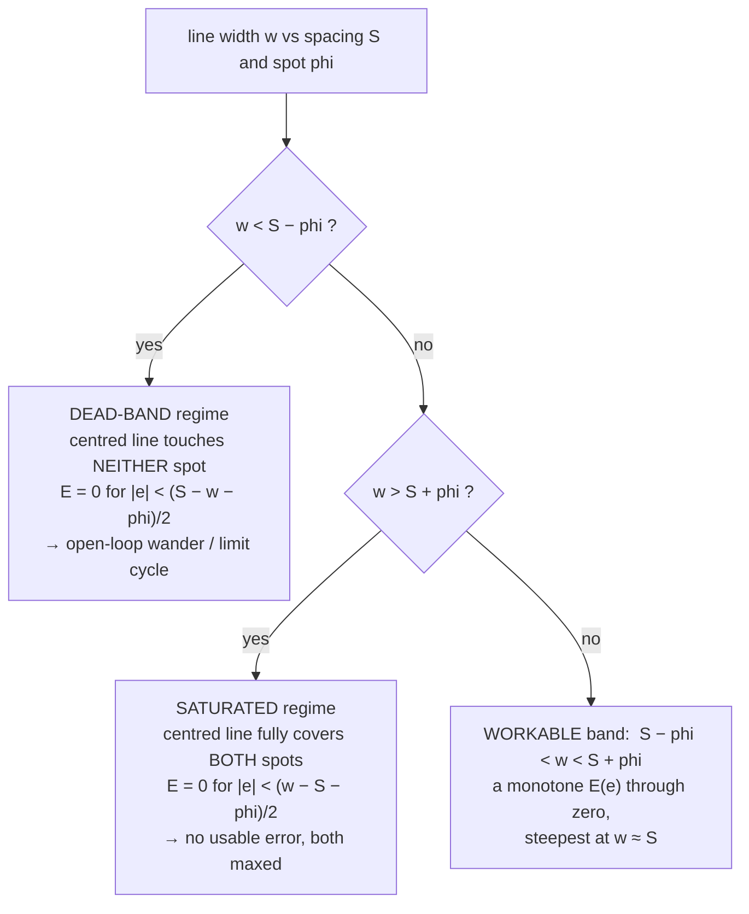
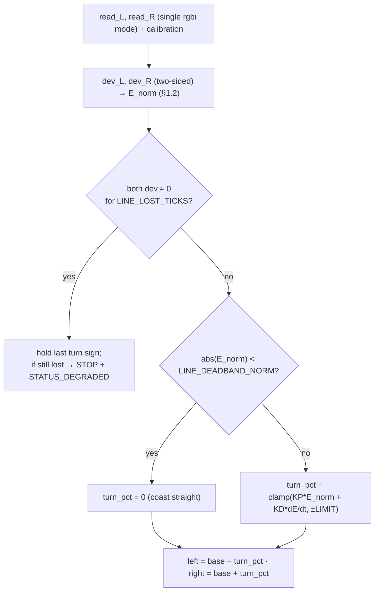

# Movement Control Laws — 2026-09-03

**Type:** SIDE-CAR PLAN — the control-law detail behind two of the movement modes, not a finalized
competition design.
**Companion to (does not replace):**
[competition-movement-options-2026-09-03.md](./competition-movement-options-2026-09-03.md) — that note
enumerates modes M0–M5 and the bounded-test ladder; this note works out the actual **control laws** for
its two most promising modes so a programmer could implement them:

- **Law 1 — the two-sensor line straddle/follow** (the operator's "keep the line between the two front
  sensors" idea = M2, and the corrective half of the M5 hybrid).
- **Law 2 — the corner-start lawnmower with corner mapping** (M3 square-up + M4 boustrophedon, plus the
  online discovery of the arena rectangle).

**Refines, never replaces:** the coverage/boundary design in
[../research/detection-odometry-coverage-2026-09-01.md](../research/detection-odometry-coverage-2026-09-01.md)
(§C coverage, §D boundary) and the turn/heading kinematics in
[../research/odometry-fusion-and-health-2026-09-01.md](../research/odometry-fusion-and-health-2026-09-01.md).
Every function named here is **additive** and **pure** (host-runnable, no hub import) unless tagged
HUB-FACING; nothing here edits `src/` — the code changes are collected in
[RECOMMENDED CHANGES](#recommended-changes-to-other-files-none-applied-here).

**This note does NOT write `src/main.py` and does NOT edit any other file.** It is a specification.

---

## Measured facts this law is built on (do not contradict)

From [../hardware/port-map.md](../hardware/port-map.md),
[../findings/drive-checkpoint-2026-09-01.md](../findings/drive-checkpoint-2026-09-01.md),
[../findings/colour-first-look-2026-09-01.md](../findings/colour-first-look-2026-09-01.md), and
[../../src/config.py](../../src/config.py):

| Fact | Value | Status |
|---|---|---|
| Drive | differential; **A = LEFT, B = RIGHT** (`device.id` 48) | MEASURED 2026-09-01 |
| Forward sign | `A: −v, B: +v` (motors mirror-mounted); `drive()`/`read_motor_degrees()` apply signs, callers use **forward-positive** wheel percents/degrees | MEASURED 2026-09-01 |
| Encoder scale | direct drive, **1 wheel rev = 360 enc-deg**; ceiling **930 dps** | MEASURED 2026-09-01 |
| Caster | single rear **unidirectional** roller: rolls fore/aft, **scrubs sideways on every in-place turn** | MEASURED (build) 2026-09-01 |
| Colour sensors | **two**, **C = LEFT, D = RIGHT** (`device.id` 61), on one rigid front bar **between the wheels**, matched pair; each gives `color()`/`reflection()`/`rgbi()` (channels **0–1024**) | MEASURED 2026-09-01 |
| IMU | `tilt_angles()` decidegrees, **yaw wraps ±180** (route every delta through `odometry.normalize_angle`), `acceleration()` milli-g | MEASURED 2026-08-27 |
| Wheel diameter | `WHEEL_DIAMETER_MM = 63.5` (2.5 in) | **OPERATOR-REPORTED**; effective rolling diameter still **[UNVERIFIED]** — BM-3 |

**The deg↔mm scale, now usable but provisional.** With the operator-reported 63.5 mm wheel:

```
mm_per_enc_deg   = pi * 63.5 / 360        = 0.5541 mm/deg     [ASSUMED — BM-3 replaces with D_eff]
one_wheel_rev    = pi * 63.5              = 199.5 mm
930 dps ceiling  = 930 * 0.5541          = 515 mm/s   (per wheel, straight)
150 mm/s traverse= 150 / 0.5541          = 271 dps
50 mm/s creep    = 50 / 0.5541           =  90 dps
```

Every mm figure below inherits the `[ASSUMED]` tag on that scale until BM-3 measures the **effective
rolling** diameter under load per surface. The **laws themselves are scale-free** — they are written so a
BM-3 number changes a value, never a line — and the odometry-only quantities (lane index, turn closure)
are diameter-free outright.

**Mission context (PARTIAL):** mines are matte yellow sticky notes; boundary is floor **tape** (blue
painters OR silver/grey duct, **unresolved**); NO walls; arena "10×10" **units unknown**; a known start
corner is **plausible but unconfirmed** ([ASSUMED] for Law 2, which is why Law 2 *discovers* the arena
rather than assuming its size).

---

## Contents

- [Law 1 — Two-sensor line straddle / follow](#law-1--two-sensor-line-straddle--follow)
  - [1.0 What "straddle" is, and how it differs from classic centering](#10-what-straddle-is-and-how-it-differs-from-classic-centering)
  - [1.1 The geometry that decides if it works at all](#11-the-geometry-that-decides-if-it-works-at-all)
  - [1.2 The error signal](#12-the-error-signal)
  - [1.3 The PD steering law → (left_pct, right_pct)](#13-the-pd-steering-law--left_pct-right_pct)
  - [1.4 Named constants](#14-named-constants)
  - [1.5 Pure function signatures and where they map](#15-pure-function-signatures-and-where-they-map)
  - [1.6 Failure modes and guards](#16-failure-modes-and-guards)
  - [1.7 The one bench test that confirms Law 1](#17-the-one-bench-test-that-confirms-law-1)
- [Law 2 — Corner-start lawnmower with corner mapping](#law-2--corner-start-lawnmower-with-corner-mapping)
  - [2.1 The square-up ritual](#21-the-square-up-ritual)
  - [2.2 Setting the origin](#22-setting-the-origin)
  - [2.3 The boustrophedon lane law](#23-the-boustrophedon-lane-law)
  - [2.4 Mapping the corners: discovering the rectangle](#24-mapping-the-corners-discovering-the-rectangle)
  - [2.5 The state machine](#25-the-state-machine)
  - [2.6 Named parameters](#26-named-parameters)
  - [2.7 The one bench test that confirms Law 2](#27-the-one-bench-test-that-confirms-law-2)
- [How the two laws compose](#how-the-two-laws-compose)
- [RECOMMENDED CHANGES to other files (none applied here)](#recommended-changes-to-other-files-none-applied-here)
- [Sources](#sources)

---

# Law 1 — Two-sensor line straddle / follow

## 1.0 What "straddle" is, and how it differs from classic centering

The operator's idea is to keep a tape line **in the gap between** sensors C and D and use the two as a
direct left/right error. This is **not** the textbook two-sensor line follower, and the difference is the
whole ballgame:

- **Classic two-sensor centering** puts both sensors **on a wide line** (or straddling one edge) and
  balances them — the line is *wider* than the sensor spacing, both sensors always see some line, and the
  error comes from the *imbalance* ([XRP proportional-2-sensor](https://introduction-to-robotics.readthedocs.io/en/latest/course/line_following/pcontrol2s.html):
  `error = left − right`).
- **The operator's straddle** puts the line **between** the sensors — when centred, ideally **neither**
  sensor is on the line, and the error appears only when the line drifts far enough to touch one spot.

Both reduce to the same primitive — **`error = left_presence − right_presence`, steer toward the side
that sees more line** — but they live at **opposite ends of the line-width-vs-spacing axis**, and only a
narrow middle band works for *either*. §1.1 is that band. The literature consensus is that any
single-sensor scheme cannot tell which side of the line it is on and "turns past the point of no return"
([XRP](https://introduction-to-robotics.readthedocs.io/en/latest/course/line_following/pcontrol2s.html);
[ThinkRobotics line-follower guide](https://thinkrobotics.com/blogs/tutorials/how-does-a-line-following-robot-work-complete-technical-guide)) —
the two-sensor difference is what removes that ambiguity, which is exactly why the operator's instinct is
sound *if the geometry lands in the workable band*.

**Coverage role.** A line-straddle law follows *one* straight tape line; it does **not** cover an area by
itself (boundary-following covers only the perimeter ring — Gabriely & Rimon STC, cited in the coverage
brief). So Law 1 earns its place as **(a)** a perimeter-follow / spiral-inward primitive, and **(b)** the
corrective inside the M5 hybrid and the `RESQUARE` step of Law 2 — a way to ride a boundary edge for a
short, controlled distance. It is specified here as a general straight-line follower; the mode that calls
it decides the path.

## 1.1 The geometry that decides if it works at all

Define, all in mm, in the robot's lateral frame (x to the right, 0 at the robot centreline):

| Symbol | Meaning | Nominal | Status |
|---|---|---|---|
| `S` | sensor **spacing**, C-to-D spot centre-to-centre | ~57 | **[UNVERIFIED] — MEASURE (BM: sensor-bar)** |
| `phi` | colour-sensor **spot diameter** (footprint) at the mounted height | ~12 | **[UNVERIFIED]** (color-discrimination §5.1 gives ~12 mm at the 16 mm optimum; the as-built height is unconfirmed) |
| `w` | tape **line width** | 24 or 48 | **[UNVERIFIED] — MEASURE the real tape** (1-in painters ≈ 24, 2-in duct ≈ 48) |
| `e` | lateral offset of the line centre from the robot centreline (the controlled variable, drive to 0) | — | state |

Model each spot and the tape as across-track windows (widths `phi` and `w`). As a spot slides across a
tape edge, the overlap length changes **1:1** with lateral offset over a transition of length `phi`, so
the per-sensor tape **coverage fraction** `c ∈ [0,1]` has slope `|dc/dδ| = 1/phi` in the transition and
saturates at 0 or 1 outside it. There are **three regimes**, set purely by `w` versus `S ± phi`:



**The workable window is `S − phi < w < S + phi`.** With the nominals above (`S≈57`, `phi≈12`):

| Tape | `w` | In `45 < w < 69`? | Verdict |
|---|---|---|---|
| 1-inch painters | ~24 mm | **No** (below 45) | **DEAD-BAND** — line vanishes between the spots; straddle limit-cycles |
| 2-inch duct/painters | ~48 mm | **Yes** | **WORKABLE** — usable proportional error |
| 3-inch+ | ~76 mm | **No** (above 69) | **SATURATED** — both spots ride the tape; error collapses |

This is a **decision, not a tuning**: at the *measured* `S` and `phi`, Law 1 works only for a tape whose
width sits in the window. The cheap fixes are all geometric — **narrow `S`** to lower the window (bring
the sensors closer), or **request/choose a tape width** near `S`. **Recommendation:** measure `S`, `phi`,
and the real tape width first (they gate everything below); if the arena tape is 1-inch, either narrow
the sensor bar to `S ≲ w + phi` or fall back to a single-sensor edge-follow (M1-style) rather than the
straddle.

## 1.2 The error signal

Per sensor, work in **two-sided deviation from floor** (tape polarity is unknown — silver duct reads
*brighter* than floor, blue painters may read *darker* — so a polarity-locked signal could miss the tape;
this mirrors the coverage brief's `BOUNDARY_DEVIATION_MIN`, §D.2-6):

```
dev_L = max(0, abs(read_L − floor_level) − BOUNDARY_DEVIATION_MIN)     # left  presence, C
dev_R = max(0, abs(read_R − floor_level) − BOUNDARY_DEVIATION_MIN)     # right presence, D
C_contrast = abs(tape_level − floor_level)                            # from calibration, > 0

E      = dev_L − dev_R                    # raw error (signal units)
E_norm = clamp(E / C_contrast, −1, +1)    # dimensionless, sign = which side sees more line
```

- `floor_level`, `tape_level`, `C_contrast`, `BOUNDARY_DEVIATION_MIN` all come from **run-start
  calibration** on the real surfaces (`calibration.calibrate` / a two-sided boundary threshold), never
  hard-coded — same rule as detection (scope TR-4). The two sensors are a **matched pair** (MEASURED), so
  one calibration serves both; keep per-sensor floors if a bench check shows any offset.
- **Sign:** `E_norm > 0` ⇒ more line under **LEFT (C)** ⇒ the line is to the robot's left ⇒ the robot has
  drifted **right** ⇒ steer **left (CCW)**. `E_norm < 0` ⇒ steer right (CW). (Verify this sign on the
  bench before any driving — a flipped steering sign fans out instead of converging, the standing warning
  in the odometry brief §0.)
- **Position gain.** In the workable band both edges are active, so `|dE_norm/de| ≈ 2/phi` (≈ 0.17 per mm
  at `phi≈12`). The linear region is roughly `|e| ≲ phi/2 ≈ 6 mm` on each side of centre; past it one
  sensor saturates and the law degrades to bang-bang toward the last-seen side. **The gain is set by the
  spot size, not chosen freely** — this is why `phi` must be measured.

## 1.3 The PD steering law → (left_pct, right_pct)

Same output convention as `odometry.heading_hold_pair` (odometry brief §3A.1) so it drops into the
existing `hub_motors.drive(left_pct, right_pct)` contract (forward-positive percents; positive `turn_pct`
= CCW/left):

```
# per tick, dt_s = 1 / measured loop rate
derr    = (E_norm − prev_E_norm) / dt_s
turn_pct = clamp(LINE_KP_PCT * E_norm + LINE_KD_PCT_S * derr,
                 −LINE_CORR_LIMIT_PCT, +LINE_CORR_LIMIT_PCT)

left_pct  = clamp(base_pct − turn_pct, −100, 100)     # positive turn ⇒ left slows  ⇒ CCW
right_pct = clamp(base_pct + turn_pct, −100, 100)     # ...right speeds ⇒ CCW
```

- **Start P-only** (`LINE_KD_PCT_S = 0`); add D only once P is stable and the measured loop period
  supports a clean derivative — the same discipline the heading-hold law uses. No integral term: a line
  follower has no standing bias to integrate out (unlike gyro heading-hold), and I-windup on a line that
  briefly disappears is a known failure.
- **Dead-band guard:** if `abs(E_norm) < LINE_DEADBAND_NORM`, set `turn_pct = 0` (ignore sensor jitter at
  centre; do **not** hunt).
- **Lost-line recovery:** if `dev_L ≈ 0` and `dev_R ≈ 0` for `LINE_LOST_TICKS` consecutive ticks, the
  line has left the bar entirely → **hold the last non-zero `turn_pct` sign** (steer back toward where the
  line was) and, if it does not reappear within `LINE_LOST_TICKS`, stop and flag `STATUS_DEGRADED`. This
  is the recoverable failure; driving straight blind is not.
- **`base_pct`** is the forward speed; keep it low (creep-class) while a line-square is being taken, faster
  on a long perimeter follow. Speed trades against the linear region: the faster the base, the more mm the
  robot travels per tick, so the `|e| ≲ phi/2` linear region is crossed in fewer samples.



## 1.4 Named constants

All new, all `[ASSUMED]` until the bench numbers land; propose them in `config.py` under a "Line straddle"
block. Nothing is hard-coded into the law — every one is a function argument defaulting to config.

| Constant | Seed | Units | Derivation / replacement |
|---|---:|---|---|
| `SENSOR_SPACING_MM` (`S`) | 57.0 | mm | **MEASURE** the C↔D spot centres at mounted height (also used by Law 2 pass pitch). Already proposed by the coverage brief. |
| `SENSOR_SPOT_MM` (`phi`) | 12.0 | mm | **MEASURE** the footprint at the built height; sets the position gain `2/phi`. |
| `LINE_KP_PCT` | 25.0 | pct / unit `E_norm` | P-only bench seed; raise until the robot tracks without weaving, back off ~30%. |
| `LINE_KD_PCT_S` | 0.0 | pct·s / unit `E_norm` | enable only after P is stable and loop period is measured. |
| `LINE_CORR_LIMIT_PCT` | 30.0 | pct | clamp; below a violent-weave threshold, above the correction the base speed can absorb. |
| `LINE_BASE_PCT` | ~ traverse | pct | forward speed during a follow; low while squaring. |
| `LINE_DEADBAND_NORM` | 0.05 | — | ignore `E_norm` below this (centre jitter). |
| `LINE_LOST_TICKS` | 5 | ticks | consecutive both-floor ticks before "line lost". Rescale by the measured loop rate. |
| `BOUNDARY_DEVIATION_MIN` | — | signal | two-sided floor-deviation floor; **derived at calibration** (shared with the coverage/boundary design). |

## 1.5 Pure function signatures and where they map

Both are **pure and host-runnable** — they take numbers and return numbers, so they are verified by replay
against a logged lateral-sweep CSV (§1.7), the only verification ADR-0005 allows without the robot. They
compose the existing calibration/detector/odometry split rather than adding a module (a new `src/` module
is an architecture change needing an ADR — avoided).

| Module | Signature | Purpose |
|---|---|---|
| `detector.py` | `straddle_error(dev_left, dev_right, contrast, deadband=None) -> (error_norm, regime)` | the §1.2 error: `(dev_L − dev_R)/contrast` clamped, plus `regime ∈ {STRADDLE_CENTER, STRADDLE_LEFT, STRADDLE_RIGHT, STRADDLE_LOST}`. Pure; sits beside the boundary/skew helpers the coverage brief already proposes for `detector.py`. |
| `detector.py` | `straddle_deviations(read_left, read_right, floor_level, min_dev=None) -> (dev_left, dev_right)` | two-sided `max(0, abs(read − floor) − min_dev)` per sensor; the polarity-free presence used by `straddle_error`. |
| `odometry.py` | `line_straddle_pair(base_pct, read_left, read_right, floor_level, contrast, state, kp=None, kd=None, corr_limit_pct=None, dt_s=None) -> (left_pct, right_pct, new_state)` | **the maps-two-readings-plus-state-to-command law.** Calls `straddle_error`, applies the PD + guards of §1.3, returns forward-positive wheel percents for `hub_motors.drive()`. `state` carries `prev_error_norm`, `lost_ticks`, and `last_turn_sign`. Sits beside `heading_hold_pair`, whose output convention it matches exactly. |

`state` is a small mutable/record bundle (mirror `heading_hold_pair`'s tuple-return style: return the new
state rather than mutating, to stay pure). The **executor** (a HUB-FACING `examples/line_follow.py`,
bench-first, **not** written by this task) is the only place that reads the sensors and calls
`hub_motors.drive`.

## 1.6 Failure modes and guards

| Failure | Cause | Guard |
|---|---|---|
| **Line invisible at centre** (dead-band) | `w < S − phi`: line falls between the spots | Geometry gate §1.1 — refuse/adapt at design time (narrow `S` or pick tape); at run time the lost-line recovery keeps it from driving off. |
| **Both sensors always on line** (saturated) | `w > S + phi`: line covers both spots | Geometry gate §1.1. `regime = STRADDLE_*` never resolves a side → treat as "no usable straddle", fall back to single-sensor edge-follow. |
| **Steering sign flipped** | mirror-mount / convention error | Bench-verify §1.2 sign before driving (odometry brief §0 standing warning). |
| **Limit-cycle weave** | `LINE_KP_PCT` too high or dead-band too small | Lower `KP`, widen `LINE_DEADBAND_NORM`, add `KD`. |
| **Line lost off the end of the bar** | drift beyond `±(S+phi)/2`, or line ends | `LINE_LOST_TICKS` recovery: hold last turn sign, then STOP + `STATUS_DEGRADED`. Never coast straight blind. |
| **Tape/floor not separable** | pale tape on pale floor | `calibration.calibrate` **fails loud** (contrast/SNR gate); Law 1 is disabled, not run on a bad threshold. |
| **Polarity opposite the mine's** | silver bright vs painters dark | Two-sided deviation (§1.2) — never a polarity-locked signal. |
| **Sensors not matched** | build tolerance | Keep per-sensor floors from calibration; a residual offset biases `E`, correct it in `floor_level` per side. |

## 1.7 The one bench test that confirms Law 1

**Lateral-offset transfer curve.** Motors idle (or hand-guided, sub-mm), at the built mount height, on the
real arena floor: lay a real boundary-tape strip parallel under the C–D bar and translate the robot (or
the tape) laterally in **known steps** (e.g. 2 mm) across the full `±(S+phi)/2` range; log `read_L`,
`read_R`, `floor_level`, and compute `E_norm(e)`.

**PASS** iff `E_norm(e)` is **monotone through a single zero crossing** with slope magnitude
`≥ ~0.05/mm`, **with no central flat region wider than `LINE_DEADBAND_NORM`** (rules out the dead-band
regime) **and no saturated plateau** at `±1` around centre (rules out the saturated regime). This is one
curve, and it simultaneously (a) confirms the geometry lands in the workable band **for the real tape**,
(b) measures the actual position gain that sets `LINE_KP_PCT`, and (c) fixes the steering sign. It is the
colleague's bounded test **T3** upgraded to *record the transfer curve instead of just the left/right/both
labels*, and it needs **no driving and no wheel-diameter number**.

---

# Law 2 — Corner-start lawnmower with corner mapping

A boustrophedon ("lawnmower") sweep that **starts squared in a known corner**, seeds a clean pose, and
then **discovers the arena rectangle as it drives** — because the units of "10×10" are unknown, so the
robot cannot be told how big the arena is. It combines the pieces the two research briefs already
specify — gyro-closed profiled turns, two-sensor line-squaring, `pass_pitch`, boundary-triggered lane ends
— into one executable plan and adds the online mapping.

## 2.1 The square-up ritual

The corner start is a **calibration ritual, not magic localization** (competition-movement-options §
Corner-Start). Sequence:

1. Place the robot just inside the corner, front bar roughly facing the first boundary tape line.
2. **Log a stationary pre-roll** (both sensors' `reflection()`/`rgbi()`, yaw, `stable()` flag, motor
   degrees) — the baseline the run replays against.
3. **Creep forward** at `BOUNDARY_CREEP_DPS` until the two sensors cross the tape edge. **Record the
   along-track odometry position where each sensor trips**: `left_trip_mm` when C crosses, `right_trip_mm`
   when D crosses (this is the `detector.BoundaryWatch` rising-edge trip from the coverage brief §D.3).
4. **Approach-angle from edge order.** The lag between the two trips is the skew:

   ```
   dS   = right_trip_mm − left_trip_mm            # signed along-track lag, C vs D
   skew = atan(dS / SENSOR_SPACING_MM)            # radians → deg via math.degrees
   ```

   `skew_sign_from_crossings()` (which corner tripped first → which way skewed) is **diameter-free and
   works now**; the magnitude `skew_deg_from_crossings(left_trip_mm, right_trip_mm, S)` needs `S` and the
   deg→mm scale. Both are already named in the coverage brief §D.3.
5. **Rotate to square** by `−skew`, gyro-closed (§2.3 turn law), then re-check; iterate until
   `abs(skew) ≤ SQUARE_SKEW_TOL_DEG`.
6. **Reset yaw once**, stationary, gated on `motion_sensor.stable()` — this is the single global yaw frame
   for the whole run (coverage brief §C.1-5: never re-zero to a doubted heading mid-run).

**⚠ The load-bearing unknown.** The coverage brief §C.1-6 shows the *accuracy* of this square-up is
**un-quantified and may be too coarse**: at `S≈57 mm`, an `[ASSUMED]` 100 Hz loop and `v≈200 mm/s`, one
sample is ~2 mm along-track, so crossing-time quantization alone caps skew resolution near
`atan(2/57) ≈ 2.0°` — worse than the ~0.3° a 10-ft lane needs. So the ritual is **the only candidate**
absolute heading reference in a wall-less arena, **not** a proven one; its viability is gated on §2.7,
sub-sample edge interpolation, and a slow approach. State this in the record; never present the square as
exact.

## 2.2 Setting the origin

After the square-up:

```
pose = Pose(x_mm=0.0, y_mm=0.0, heading_deg=0.0)     # corner is the origin; +y = first lane direction
```

Seed `odometry.Odometry(pose=pose)` and zero its `distance_mm`. The corner removes the *initial-pose
guess*; it does not remove odometry calibration (BM-3 diameter, BM-4 track). The arena extent
(`x_far`, `y_far`) is **unknown** at this point and filled in by §2.4.

## 2.3 The boustrophedon lane law

Reuses `sweep.SweepPlan`'s lane sequence, with these control laws bound to its commands:

- **Lane length — by odometry, boundary-confirmed.** Drive `CMD_DRIVE` on **gyro heading-hold**
  (`odometry.heading_hold_pair`, odometry brief §3A.1) with the detector active. The lane does **not** end
  on a fixed distance; it ends when `detector.BoundaryWatch` trips on the perpendicular far tape
  (boundary-triggered lane end, coverage brief §C.1-7-4). Odometry `distance_mm` is the *record* of the
  lane length, not its terminator — on the first lane it *defines* `y_far` (§2.4).
- **Stop-before-cross.** As `distance_mm` enters `BOUNDARY_APPROACH_BAND_DEG` of the expected far edge
  (once `y_far` is known), drop from `TRAVERSE_DPS` to `BOUNDARY_CREEP_DPS` and command an **active brake**
  on the trip (coverage brief §D.2-4: creep-on-approach, not a big forward sensor offset). Coast is
  bounded by `STOP_MARGIN_MM` (odometry brief §3A.4) — **[UNVERIFIED], no coast datum exists yet**.
- **90° turns — gyro-closed, caster-aware.** Turns are closed on the **gyro**, not encoder geometry,
  because the unidirectional caster **scrubs on every in-place turn** and makes an encoder-geometry turn
  under-rotate by a systematic, surface-dependent, **[UNVERIFIED]** amount (bracketed *several to >10° per
  90°*; **never quote downstream**). Use the ease-in/cruise/ease-out `turn_speed_profile` +
  settle-and-verify executor (odometry brief §1.3–1.4): arrive at `TURN_CREEP_DPS` so momentum overshoot
  is small by construction, settle `TURN_SETTLE_MS`, correct until `abs(err) ≤ TURN_TOL_DDEG`, cap retries
  and record `TURN_UNCONVERGED`. The mirror mount makes an in-place spin drive **both** motors the **same**
  sign (odometry brief §1.5): CW = `A:−,B:−`; CCW = `A:+,B:+`.
- **Lane pitch — from the two-sensor spacing.** The sideways `STEP` drives `pass_pitch_mm(S)`, **not**
  `lane_pitch_mm()`:

  ```
  lane_pitch_mm()      = TARGET_SIZE_MM − 2*CROSS_TRACK_ERROR_MM − LANE_OVERLAP_MM
                       = 76 − 30 − 5 = 41 mm       [ASSUMED constants]
  pass_pitch_mm(S)     = lane_pitch_mm() + S       (coverage brief §C.1-1, its S=0 case is lane_pitch)
                       ≈ 41 + 57 = 98 mm           [ASSUMED]
  ```

  The two sensors add `S` to the pitch **at build tolerance (~3 mm), not odometry error (~15 mm)**,
  because both ride one rigid bar — the ~2.6× lane-count reduction that also cuts cumulative turn drift
  (coverage brief §C.1-1,2,10). `pass_pitch_mm` **raises** past its validity edge `S ≤ W − 2b − m` rather
  than silently returning a pitch that leaks coverage.
- **Re-square every lane end.** Dead-reckoned **heading** is never trusted past ~one lane (coverage brief
  §C.1-7-3). At each far boundary, before turning out, take a **two-sensor line-square** off that
  perpendicular edge (`skew_deg_from_crossings`, §2.1 step 4) as an **absolute** heading fix, then re-zero
  to the lane frame. `sweep.CMD_RESQUARE` (today a no-op placeholder) is where this binds. If a lane end
  does **not** land on tape, fall back to the continuous gyro frame and set `STATUS_DEGRADED` if it
  persists. Dead-reckoning is trusted only for **lane index** (a discrete integer per turn) and **local
  along-track** de-dup within one lane pair — never long-lane heading (coverage brief §C.1-8).

## 2.4 Mapping the corners: discovering the rectangle

The robot does not know the arena size, so it **builds the rectangle from four detected edges** — this is
sensor-based / incremental boustrophedon decomposition (Choset boustrophedon cellular decomposition;
Acar & Choset "drive the boundaries"; confirmed by ResearchHub, "Sensor-Based Incremental Boustrophedon
Decomposition"):

| Edge | How it is found | Sets |
|---|---|---|
| **near-Y** (start line, `y = 0`) | squared against at start (§2.1) | origin |
| **far-Y** (`y = y_far`) | **first lane's** far boundary trip → `y_far = distance_mm` at the trip | arena **LENGTH**; every later lane now has an expected `y_far` for creep-on-approach |
| **near-X** (start side, `x = 0`) | the corner's side tape (if the corner has two tapes, square against it too; else implicit at the origin) | lane-index origin |
| **far-X** (`x = x_far`) | the `STEP` or the next lane detects side tape → `x_far = accumulated pitch` | arena **WIDTH** → total lanes `= ceil(x_far / pass_pitch_mm(S))` |

So the rectangle is `[0, x_far] × [0, y_far]`, discovered by lane 1 (length) and by whichever step first
hits the far side (width). Until `x_far` is known the plan keeps stepping and sweeping; the run ends when a
step detects the far side boundary and there is no room for another pass. **Fail-safe backstop (degraded
mode B1):** if a far boundary is *not* detected by `y_far + BOUNDARY_MARGIN_MM` (odometry expectation),
end the lane on odometry alone and flag `STATUS_DEGRADED` — a missed boundary in a wall-less arena is the
catastrophic case (robot drives out), so odometry is the guaranteed backstop to the tape trip, never the
other way round.

**Units caveat.** `x_far`/`y_far` come out in **mm via the `[ASSUMED]` 0.5541 mm/deg scale**; the
*counts* (lane index, "did we hit tape") are diameter-free and correct regardless. The professor's Q1
(units) is **not** needed to run this — the robot measures the arena itself — but a wildly wrong deg→mm
scale would mis-place the creep-on-approach band, so BM-3 still matters for the *stop margin*, not for the
*coverage*.

## 2.5 The state machine

```mermaid
stateDiagram-v2
    [*] --> SquareUp
    SquareUp: creep to first tape; skew = atan(dS/S)
    SquareUp --> SquareUp: abs(skew) > SQUARE_SKEW_TOL_DEG → rotate −skew (gyro-closed), recheck
    SquareUp --> SetOrigin: abs(skew) <= tol and motion_sensor.stable() → reset yaw ONCE

    SetOrigin: pose=(0,0,0); distance=0; x_far,y_far UNKNOWN
    SetOrigin --> DriveLane

    DriveLane: gyro heading-hold; detector ON; integrate distance
    DriveLane --> Creep: y_far known and distance in BOUNDARY_APPROACH_BAND of y_far
    DriveLane --> BoundaryTrip: BoundaryWatch rising edge (far tape)
    DriveLane --> Degraded: distance > y_far + BOUNDARY_MARGIN_MM and no trip
    Creep: BOUNDARY_CREEP_DPS toward far edge
    Creep --> BoundaryTrip: BoundaryWatch rising edge

    BoundaryTrip: active brake
    BoundaryTrip --> RecordEdge
    RecordEdge: first lane sets y_far = distance; store trip (left_mm,right_mm)
    RecordEdge --> ReSquare

    ReSquare: two-sensor line-square θ=atan(dS/S); correct heading; re-zero lane frame
    ReSquare --> Done: last lane (x_far reached, no room for another pass)
    ReSquare --> TurnA: more lanes (x_far unknown or x_cursor+pitch < x_far)

    TurnA: gyro-closed 90° * turn_dir (profiled, settle-verify)
    TurnA --> StepPitch
    StepPitch: drive pass_pitch_mm(S); detector ON (watch for side tape)
    StepPitch --> Done: side tape detected → x_far = x_cursor; width known, no room
    StepPitch --> TurnB: floor ahead, room remains
    TurnB: gyro-closed 90° * turn_dir
    TurnB --> DriveLane: turn_dir = −turn_dir; x_cursor += pass_pitch

    Degraded: STATUS_DEGRADED; end lane on odometry; continue if safe else Done
    Degraded --> ReSquare: recovered (tape re-found)
    Degraded --> Done: persists

    Done --> [*]
```

## 2.6 Named parameters

Most already exist or are proposed by the two briefs; the **new** ones are the square-up tolerance and the
mapping cursors.

| Parameter | Seed | Status | Role |
|---|---:|---|---|
| `SENSOR_SPACING_MM` (`S`) | 57.0 | **[UNVERIFIED] — MEASURE** | pass pitch and skew magnitude |
| `pass_pitch_mm(S)` | ≈98 | derived | sideways `STEP` distance (coverage brief) |
| `SQUARE_SKEW_TOL_DEG` | 2.0 | **[ASSUMED]** — **new** | accept the square-up below this skew; can't beat the §2.1 resolution floor |
| `BOUNDARY_APPROACH_BAND_DEG` | — | [ASSUMED] | creep-on-approach band (coverage brief §D) |
| `BOUNDARY_CREEP_DPS` / `TRAVERSE_DPS` | ~90 / ~271 | [ASSUMED] | fractions of the MEASURED 930 dps |
| `TURN_CRUISE_DPS` / `TURN_CREEP_DPS` | ~200 / ~80 | [ASSUMED] | gyro-closed turn profile (odometry brief §1.3) |
| `TURN_TOL_DDEG` | ~20 | [ASSUMED] | turn closure; derive from lane length via `cross_track_error_mm` |
| `TURN_SETTLE_MS` | ~200 | **[UNVERIFIED]** — MEASURE knee | capture coast before reading yaw |
| `STOP_MARGIN_MM` | — | **[UNVERIFIED]** — no coast datum | boundary-safe stop (odometry brief §3A.4) |
| `BOUNDARY_MARGIN_MM` | 100 | [ASSUMED] | B1 odometry backstop past the expected edge |
| `x_far`, `y_far`, `x_cursor`, `lane_index`, `turn_dir` | — | run state | the discovered rectangle and sweep bookkeeping |
| `TURN_ENC_SCALE` | 1.0 | **[UNVERIFIED]** | degraded encoder-only turn + the G1 turn-suppression, not a healthy turn |

## 2.7 The one bench test that confirms Law 2

**Known-angle skew-recovery (line-square accuracy) test.** On the real floor with the real perpendicular
tape edge, at the built mount height: drive the two-sensor bar into the edge at **several set skew angles**
(e.g. 0°, ±10°, ±20°, both CW and CCW) at `BOUNDARY_CREEP_DPS`; log the along-track odometry position at
which C then D trip (`left_trip_mm`, `right_trip_mm`); compute
`skew_meas = degrees(atan((right_trip_mm − left_trip_mm)/S))`.

**PASS** iff `skew_meas` tracks the set angle within the **per-lane heading budget** derived from the lane
length (`θ_max = atan(CROSS_TRACK_ERROR_MM / lane_length)`; the odometry brief's `cross_track_error_mm`
inverted) across CW and CCW. This directly closes the **one load-bearing unknown** for the corner-start
lawnmower — whether two-sensor line-squaring is accurate enough to be the absolute heading reference (the
coverage brief §C.1-6 un-quantified accuracy gap) — and it tells you whether sub-sample edge interpolation
and a slower creep are required. Pair it with a **lane-length odometry-vs-tape-measure** check (BM-3
dependent) so the discovered `y_far` is trustworthy. This is the colleague's **T6** corner-ritual dry run
made quantitative.

---

## How the two laws compose

They are not competitors; the coverage brief §C.1-8 synthesis is **"boustrophedon with tape line-squaring
as the per-lane absolute fix"** — which is Law 2 *using a short segment of Law 1's primitive* at each lane
end:

- **Law 2 is the coverage strategy** (it sweeps the whole area) and is the recommended competition
  baseline. It survives the units-unknown blocker because it discovers the arena.
- **Law 1 is a primitive** Law 2 (and the M5 hybrid) calls: the `ReSquare` state can ride the boundary
  edge briefly under `line_straddle_pair` to sharpen the heading fix, and a perimeter-follow with Law 1 is
  a fallback coverage mode if odometry drift proves too large at the measured scale.
- **Shared gate:** both depend on **the same three unmeasured optical/geometry numbers** — `S`, `phi`, and
  the real tape width and separability. The single highest-leverage bench action for *both* laws is the
  GATE-1 real-surface optical burst + the sensor-bar geometry measurement (coverage brief "single bench
  measurement that unblocks the most"): it decides whether Law 1's geometry lands in the workable band and
  whether Law 2's boundary trips are reliable, and it needs no wheel diameter and no answer to Q1.

**Recommendation (unchanged from the companion note):** run the telemetry ladder T1–T3 first (T3 upgraded
to the §1.7 transfer curve); then the §2.7 skew-recovery / T6 dry run. Law 2 is the design of record to
build toward; Law 1 is implemented as the shared primitive and the fallback. Neither is committed until
its bench test above passes — both are **structurally specified and empirically at zero**.

---

## RECOMMENDED CHANGES to other files (none applied here)

**Collision safety: I have edited nothing but this file.** These are recommendations; every one is
**additive** (no existing signature or state changes). They overlap deliberately with the two research
briefs' recommended-changes tables — where they do, this is the same change, not a competing one.

| File | Change | Why |
|---|---|---|
| [../../src/detector.py](../../src/detector.py) | Add pure `straddle_deviations(...)` and `straddle_error(...)` (§1.5) beside the boundary/skew helpers the coverage brief already proposes. Add `STRADDLE_*` regime string constants. **Do not touch `EdgeCounter`.** | The two-sensor error signal is a detection concern; keeps it pure and replayable. |
| [../../src/odometry.py](../../src/odometry.py) | Add pure `line_straddle_pair(...)` (§1.5) beside `heading_hold_pair`, same output convention. No hub import; no `Odometry` change. | The steering output is a motion concern and must match the `hub_motors.drive` contract. |
| [../../src/config.py](../../src/config.py) | Add the "Line straddle" block (§1.4); reuse `SENSOR_SPACING_MM`, `pass_pitch_mm`, `BOUNDARY_DEVIATION_MIN` proposed by the coverage brief; add `SQUARE_SKEW_TOL_DEG`. Keep `CLASSES=('target',)`. | A clarified answer or bench number changes a value here, never a state. |
| [../../src/calibration.py](../../src/calibration.py) | The two-sided `boundary_deviation_threshold(...)` the coverage brief proposes is what `straddle_deviations` consumes — one shared helper. | Tape polarity is unknown; a polarity-locked signal could miss it. |
| [../../src/sweep.py](../../src/sweep.py) | Bind `CMD_RESQUARE` to the two-sensor line-square (§2.3); `STEP` drives `pass_pitch_mm(S)`; add boundary-triggered lane end and the online `x_far`/`y_far` mapping (§2.4). Same corrections the coverage brief §C.2 lists. | The lane law and the mapping live in the sweep sequencer. |
| [../../src/result.py](../../src/result.py) | `add_boundary()`/`boundary_hits`, a `skew_deg` field, `note_relocalized(source, residual_deg)`, `STATUS_DEGRADED` — as the coverage brief already lists; the four discovered edges are recorded here. | The mapping and each absolute re-square are logged, out of the `detected == classified + unknown` invariant. |
| `examples/line_follow.py`, `examples/turn_to_heading.py` (new, HUB-FACING, **bench-first, NOT this task**) | The executors that read sensors and call `hub_motors.drive` — Law 1 follow loop and the Law 2 profiled-turn/square-up. Same safety scaffolding as `drive_moves.py` (port-present abort, arm countdown, try/finally stop, timeouts, raw streaming); output filed under `docs/findings/runs/` before it becomes mission code (ADR-0005). | Keeps all hub I/O out of the pure laws. |
| [./bench-measurement-plan.md](./bench-measurement-plan.md) | Add: the **sensor-bar geometry** (`S`, `phi`) measurement; the §1.7 **lateral-offset transfer curve**; the §2.7 **known-angle skew-recovery** test; the real tape **width**. These are what every `[ASSUMED]`/`[UNVERIFIED]` above waits on. | These bench numbers close the two laws. |

---

## Sources

- [./competition-movement-options-2026-09-03.md](./competition-movement-options-2026-09-03.md) — the
  companion note this deepens: modes M0–M5, the line-state table, the corner-start ritual, tests T1–T6.
- [../research/detection-odometry-coverage-2026-09-01.md](../research/detection-odometry-coverage-2026-09-01.md)
  §C (pass pitch `P(S)=S+(W−2e−m)`, `r_max=2ev/L²`, one-global-yaw-frame, line-squaring as the only
  candidate absolute reference and its un-quantified accuracy), §D (`BoundaryWatch` rising-edge trip,
  creep-on-approach, `skew_*_from_crossings`, two-sided `BOUNDARY_DEVIATION_MIN`, B1 backstop).
- [../research/odometry-fusion-and-health-2026-09-01.md](../research/odometry-fusion-and-health-2026-09-01.md)
  §0 (applied sign convention, forward-positive contract), §1.3–1.5 (`turn_speed_profile`,
  settle-and-verify, spin-sign seam), §3A.1 (`heading_hold_pair` PD, the output convention Law 1 matches),
  §3A.4 (`STOP_MARGIN_MM`, no coast datum).
- [../hardware/port-map.md](../hardware/port-map.md) — A=LEFT/B=RIGHT, C=LEFT/D=RIGHT, ids, mirror signs.
- [../findings/drive-checkpoint-2026-09-01.md](../findings/drive-checkpoint-2026-09-01.md) — forward
  `A:−v,B:+v`, 1 rev = 360 enc-deg, 930 dps, the ~9° startup-ramp shortfall (**not** a decel-coast datum).
- [../findings/colour-first-look-2026-09-01.md](../findings/colour-first-look-2026-09-01.md) — `rgbi`
  0–1024, matched sensors C and D, `reflection()` surface-vs-air separation.
- [../../src/config.py](../../src/config.py), [../../src/odometry.py](../../src/odometry.py),
  [../../src/detector.py](../../src/detector.py), [../../src/sweep.py](../../src/sweep.py),
  [../../src/calibration.py](../../src/calibration.py), [../../src/classify.py](../../src/classify.py) —
  the code every law maps onto: `heading_hold_pair`, `cross_track_error_mm`, `normalize_angle`,
  `lane_pitch_mm`, `pass_pitch_mm`, `EdgeCounter`, `calibrate`, `Calibration.signal`.
- ResearchHub 2026-09-03 — "Design and Development of a Line Following Robot using PID"; "A differential
  steering control with proportional controller for an autonomous mobile robot" (the `error = L − R` →
  differential-speed law); "Coverage Path Planning: The Boustrophedon Cellular Decomposition" (Choset);
  "Sensor-Based Incremental Boustrophedon Decomposition for Coverage Path Planning" (online rectangle
  discovery); "The CLAPPER: internal correction of dead-reckoning errors" (Borenstein).
- Web 2026-09-03 — [XRP: Proportional control with 2 sensors](https://introduction-to-robotics.readthedocs.io/en/latest/course/line_following/pcontrol2s.html)
  (`error = left − right`, why one sensor can't tell which side it's on);
  [ThinkRobotics line-follower technical guide](https://thinkrobotics.com/blogs/tutorials/how-does-a-line-following-robot-work-complete-technical-guide)
  (bang-bang oscillation vs graduated proportional response).
</content>
</invoke>
