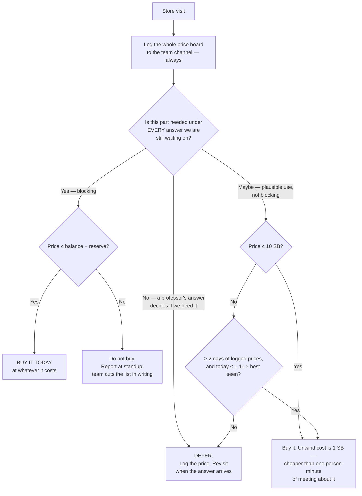

# Purchasing Strategy — the Schrute Buck economy

**Type:** ACTIVE-SPEC · **Created:** 2026-08-26 · **Owner role:** **Supplier** (the only person who may
handle money, approach the store, or transact — course instructions p.1)
**Decides:** the buy/defer rule, the buy order, and the reserve floor
**Does not decide:** which sensors the design needs — that is the coverage trade study
([2026-08-25-coverage-strategy-trade-study.md](./2026-08-25-coverage-strategy-trade-study.md)) and the
sensor suite architecture (`docs/plans/sensor-suite-architecture.md`, being written in parallel; cited by
path rather than linked because it may not be on disk yet)
**Mitigates:** **R-05** "56 SB does not cover the sensors the design needs" ([risk-register.md](./risk-register.md))

Every figure below is checked against `./inventory.py --verbose` and the course instructions PDF
(`../course/source-material/Introduction Project Student Instructions.pdf`, p.1–4). **No store price is invented anywhere in
this document.** The only two prices we have ever observed are the ones the ledger recorded on 2026-08-25.

The one-page card the Supplier carries to the store is **[§1](#1-the-card)**. Everything after it is the
reasoning, for the Intro Report.

---

## 1. The card

> **SUPPLIER'S STORE CARD — SYS 301 minesweeper**
> Balance: run `./inventory.py` before you leave the table. On 2026-08-26 it is **56 SB**.
> **RESERVE FLOOR: 14 SB.** Never let a purchase take the balance below it. (Drops to 10 SB on 8 SEP.)
> **Spendable today = balance − 14.** On 2026-08-26 that is **42 SB**.
>
> **Step 1 — before you buy anything, read the whole price board and write every price into the team
> channel.** Takes under a minute, costs 0 SB, and it is the only way we will ever know what "expensive"
> means. Do this even on a day you buy nothing.
>
> **Step 2 — buy in this order, stopping when the reserve floor is reached:**
>
> | # | Item | Condition | If it is expensive today |
> |---|---|---|---|
> | 1 | **Colour Sensor 45605 × 1** | **Unconditional.** Buy on sight. Only precondition: the Builder has confirmed the yellow box does not already contain one | Buy it anyway, at any price ≤ spendable. Waiting costs a class period, which we cannot buy back |
> | 2 | **Mounting blocks + axles** to fix that sensor at a fixed height | Only if the **Designer** has produced the mount sketch. The Builder may only assemble what was designed | Log the price, buy next class day. Not blocking until the sketch exists |
> | 3 | 2nd Colour Sensor 45605 | **Wait for the professor's Q1 + Q2.** Only "find *all* mines *and* a time limit" justifies it | Do not buy |
> | 4 | Distance Sensor 45604 | **Wait for Q3** (what bounds the arena). No walls → it buys nothing | Do not buy |
> | 5 | 3rd Colour Sensor 45605 | Q1 = large **and** Q2 = hard limit, **and** the reserve survives | Do not buy |
> | — | Force Sensor 45606 | Only if Q3 says walls **and** the Distance 45604 is out of reach — it is a *fallback* for it, never bought as well as it ([§5.3](#53-deferred-each-waiting-on-a-specific-answer)) | Do not buy |
> | ✗ | A 3rd motor · a 2nd hub · anything not on the Designer's sketch | **Never.** 2 motors + 4 sensors already fills all 6 ports | — |
>
> **Step 3 — the buy/defer rule, in one line:**
> **Buy it if the design needs it under every answer we are still waiting on. Defer it if a professor's
> answer decides whether we need it at all.** Price is not the tiebreaker; *blocking* is.
>
> **Step 4 — the "is it expensive today?" test.** Once you have two or more days of logged prices:
> buy if **today ≤ 1.11 × the lowest price you have ever logged** for that item. Inside that band,
> waiting and re-buying cheaper would cost more in sell-back haircut than it saves.
> With no price history yet, this test does not apply — item 1 is bought regardless.
>
> **Never do these:**
> - Never call a paid face-to-face meeting to decide a purchase. 4 people × 1 minute = **4 SB**; unwinding
>   a wrong purchase costs **1 SB** below 10 SB. Decide in the channel or at the free standup.
> - Never let the balance reach 0. If we cannot pay a bill, the rule is that **we return materials** —
>   which on 9 SEP means dismantling the demo robot.
> - Never buy a part the Designer has not drawn. The Builder cannot legally assemble it.
> - Do not stand within 5 feet of the store unless you are the Supplier, and do not touch supplies after
>   they go in the shoebox except to sell them back.

---

## 2. What we actually know about the economy

Sourced from the course instructions p.1–2 and verified line by line against the ledger.

### 2.1 The ledger, verified

`./inventory.py --verbose`, 2026-08-26:

```
DATE         DESCRIPTION                           QTY   UNIT   AMOUNT  BALANCE
             Starting budget                                                100
2026-08-25   Motors                                  2     10      -20       80
2026-08-25   Wheels                                  2      7      -14       66
2026-08-25   Project budget reallocation             1     10      -10       56
             Total spent                                           -44       56
```

**56 SB.** Two observed prices in the history of this project: **motor 10 SB** and **wheel 7 SB**, both on
2026-08-25 only. The 10 SB "Project budget reallocation" is **unexplained** — it is 23 % of everything
spent and it is [KU-T6](./known-unknowns.md) in the known-unknowns register, still `OPEN`. The report's
resource section has to account for it, and **if it turns out to be reversible it is 10 SB back toward a
sensor** — 18 % of the 56 SB balance, and more than the whole role-violation provision of
[§6.2](#62-how-14-sb-is-derived). Ask the Supplier what it was; do not guess in writing.

### 2.2 The rules that move money

| Mechanism | Rate | Source | Who pays |
|---|---|---|---|
| Starting budget | 100 SB | p.1 | — |
| Store purchase | the displayed price | p.1 | Supplier only |
| Displayed prices **change during the project** | — | **not stated in the PDF** — [../scope.md RR-5](../scope.md#resource-rr) | — |
| **Sell-back** | **90 % of the *listed* price, rounded down** | p.1 | Supplier only |
| Role violation | **−2 SB each** | p.1 | any of the four roles |
| Face-to-face beyond the daily standup | **1 SB per person per minute**, rounded down to the minute | p.2 | Supplier pays the bill |
| An outsider in that meeting | **2 SB/min** (1 to the bank, 1 to their team) | p.2 | Supplier pays the bill |
| Sprint planning (20 min) and daily standup (5 min) | **free** | p.1 | — |
| Written communication, unlimited | **free** — and it is a graded deliverable | p.1 | — |
| Cannot pay a bill | **return materials to cover the difference** | p.2 | the robot |

Two details in that table are usually misread and both matter:

1. **Sell-back is 90 % of the *listed* price, not of what we paid.** With prices changing daily, the
   unwind value of a part we own is a *floating* number we do not control. If a price falls after we buy,
   the haircut is worse than 10 %. We cannot bound this yet — it is `UNVERIFIED` until the price log in
   [§4](#4-price-volatility-is-a-measurement-problem-first) has two or more observations.
2. **The last clause is the only genuinely catastrophic rule in the economy.** Every other penalty costs
   Schrute Bucks. That one costs *the robot*, and it triggers at exactly the moment we are least able to
   absorb it. It is also **narrower than it looks** — it is step 7 of the *meeting* procedure, so it is an
   unpayable meeting bill that forces a return of materials. The reserve in [§6](#6-the-reserve) covers it
   and one other thing: keeping enough balance to replace a broken part on the last build day.

### 2.3 The calendar is a harder constraint than the balance

Purchases happen only in class, and the course calendar (p.4) leaves exactly this:

| Date | Store visits left | Notes |
|---|---|---|
| 27 AUG | 4 | Sprint 1 |
| 1 SEP | 3 | Begin Sprint 2, mid-project |
| 3 SEP | 2 | Sprint 2 |
| 8 SEP | 1 | **Last day anything bought can still be mounted, programmed, and tested** |
| 10 SEP | 0 | Demo Day — a purchase here is an emergency replacement, not a plan |

**Four buying opportunities remain, and only three of them leave time to recover from a mistake.** This is
the fact that decides the whole strategy: a Schrute Buck can be re-earned by selling something back at a
10 % haircut; a class period cannot be re-earned at any price. Everywhere the two trade against each
other, spend the Buck.

---

## 3. The rounding asymmetry, worked out

Sell-back pays `floor(0.9 × P)`. So buying an item at price `P` and selling it back at the same listed
price loses:

```
loss(P) = P − floor(0.9 × P) = ceil(P / 10)
```

That identity is exact — `floor(0.9P) = P − ceil(0.1P)` — and was re-checked on 2026-08-26 against the
ledger's own `sellback()` for every integer price from 1 to 1000 — zero mismatches. (`sellback()` returns
a **negative** number, because it is a ledger credit; compare against `-sellback(P)` or the loss comes out
absurd.) It is worth stating in closed form because it makes
the whole question answerable in the Supplier's head at the store: **the round-trip cost of being wrong is
one Schrute Buck per ten Schrute Bucks of price, rounded up.**

| `P` | sell-back | loss | loss % |
|---|---|---|---|
| 5 | 4 | **1** | 20.0 % |
| 7 (a wheel, on 25 AUG) | 6 | **1** | 14.3 % |
| 9 | 8 | **1** | 11.1 % |
| 10 (a motor, on 25 AUG) | 9 | **1** | 10.0 % |
| **11** | 9 | **2** | **18.2 % ← worst case above 10 SB** |
| 15 | 13 | **2** | 13.3 % |
| 20 | 18 | **2** | 10.0 % |
| 21 | 18 | **3** | 14.3 % |
| 30 | 27 | **3** | 10.0 % |

**Where the rounding actually bites.** The extra loss caused by rounding — over and above the flat 10 % —
is never more than **0.9 SB**, at any price. It is worst at prices ending in 1 (11, 21, 31…) and vanishes at
multiples of 10. So the rounding is a rounding error in the literal sense: **it is the flat 10 % haircut
that costs real money, not the floor.** The trade study's [§8.2](./2026-08-25-coverage-strategy-trade-study.md#82-schrute-bucks)
quotes a "realistic band of 10–13 %"; the correct band is **10–18.2 % for prices above 10 SB** (worst at
`P` = 11, exactly as the table above shows), and 11.1–100 % below it. This document supersedes that band;
the trade study's conclusion drawn from it is unaffected.

### 3.1 At what price does the loss stop being trivial?

Answer it by comparison, not by feel. Here is what 1, 2 and 3 SB actually buy elsewhere in this economy:

| Loss | Item price band | Equivalent to |
|---|---|---|
| **1 SB** | `P` ≤ 10 | one person-minute of a paid meeting · half a role violation |
| **2 SB** | 11 ≤ `P` ≤ 20 | **one role violation** · a 1-minute meeting of **2** people |
| **3 SB** | 21 ≤ `P` ≤ 30 | a 1-minute meeting of **3** people |
| **4 SB** | 31 ≤ `P` ≤ 40 | **a 1-minute meeting of the whole 4-person team** |

Meeting bills **round down to the whole minute** (p.2 step 6 — the instructions' own worked example bills
3 people × 3:55 as 9 SB, not 11), so the right-hand column has no sub-minute entries: a 4-person meeting
costs 0, 4, 8, 12 … SB and nothing in between. There is no such thing as a 2 SB four-person meeting.

**The threshold is around 20 SB**, and it is set by *opportunity cost* — not by the loss, and not by the
reserve. The reserve is not what binds here: spendable is 42 SB, so a single 21 SB item still clears the
floor with 21 SB to spare, and only an item above **42 SB** breaches the floor outright. What a 21+ SB item
does is consume **half or more of everything we can spend** (21/42 = 50 %), foreclosing the trade study's
2- and 3-sensor options in one transaction. *That* is the reason to stop and write it down, not the 3 SB
unwind. Below 10 SB the round-trip is 1 SB and is best thought of as *free* — **a quarter** of what the
same decision costs if the four of us stand around discussing it for one billable minute.

**The operational consequence, and it is the single most useful line in this document:**

> **Deliberating about a purchase is more expensive than getting it wrong.**
> A wrong buy costs `ceil(P/10)` to unwind: **1 SB at either price this project has ever actually paid**,
> and at most **5 SB** even at the 42 SB spendable ceiling. One minute of four people meeting about it
> costs 4 SB and buys no part. Decide in writing, which is free and graded, or at the
> free standup — and if it is under 10 SB and plausibly useful, just buy it.

This is the same reasoning [../course/team/communications.md](../course/team/communications.md) applies to
meetings, arriving from the other side of the ledger.

### 3.2 Is a speculative buy ever correct?

Two different things get called "speculative". They have opposite answers.

**As a flip for profit — no, effectively never.** To break even, the item's *listed* price must rise
enough that `floor(0.9 × P_later) ≥ P_paid`:

| Bought at | Needs a later listed price of | i.e. a rise of |
|---|---|---|
| 5 SB | 6 SB | +20 % |
| 7 SB | 8 SB | +14 % |
| 10 SB | 12 SB | +20 % |
| 15 SB | 17 SB | +13 % |
| 20 SB | 23 SB | +15 % |

We would need a **13–20 % price rise just to break even**, we have zero observations of how prices move,
we get four more chances to transact, and every Buck tied up in inventory is a Buck not available for the
reserve. There is no edge here and no data with which to find one. **Do not trade the store.**

**As an option on availability — yes, and this is the correct reason to buy early.** The question is never
"will this appreciate", it is "what does it cost to hold a part I might not need?" The answer is
`ceil(P/10)`: **1 SB under 10 SB, 2 SB under 20 SB.** Against that, not having the part on a class day
costs a whole class period out of four, and it blocks the Builder and the Programmer simultaneously.

So the rule is:

- `P` ≤ 10 SB **and** the part has a plausible use in the current design → **buy it.** The option is worth
  more than 1 SB by a wide margin.
- 11 ≤ `P` ≤ 20 SB → buy it **only if it is blocking**, i.e. work stops without it. 2 SB is still cheap,
  but at this price it is competing with a second sensor.
- `P` > 20 SB, or the purchase would breach the reserve → **do not buy speculatively.** Log the price,
  report at standup, and let the team drop something off the list in writing.

One honest caveat: all of the above assumes the listed price on the day we sell back equals the price we
paid. It may not. That is exactly what the price log measures.

---

## 4. Price volatility is a measurement problem first

We are told prices change and we cannot see tomorrow's. The temptation is to build a model of that. Per
[../lessons_learned/model-only-to-the-next-decision.md](../lessons_learned/model-only-to-the-next-decision.md)
and the operator's standing guidance, we do not: **we deliver the instrument that measures it.**

### 4.1 The price log — the instrument

**Every class day, before buying anything, the Supplier reads the entire price board and posts it to the
team channel.** Item, price, date. All of it, not just what we intend to buy.

- Cost: **0 SB** and under a minute, inside the free standup window.
- It is written communication, which is unlimited, free, **and a graded deliverable** — so the log scores
  points twice.
- It runs even on days we buy nothing. A day with no purchase is still an observation.

After **one** class day we have a price list. After **two** we know whether prices move at all. After
**three** we have a band, and only then does any threshold rule mean anything. Until then, phrases like
"unexpectedly expensive" are unfalsifiable and must not drive a decision — which is precisely why item 1
on the card is unconditional.

### 4.2 The rule the Supplier can execute in a 5-minute standup



**Where the 1.11 comes from, honestly.** It is `1 / 0.9` — the haircut inverted — and it sets the *scale*
of the band. It is **not** a break-even derivation, and an earlier draft of this section claimed it was.
The claim it made ("buy now, swap later if it gets cheaper") does not survive being written out: swapping
an item for an identical cheaper one means selling at `floor(0.9L)` and re-buying at `L`, a flat
`ceil(L/10)` loss for the same part. **Once we own it, a later lower price is unreachable — there is no
swap trade at any price.**

So the only question the price log can ever answer is *buy today, or wait one more class day*, and the
most that waiting can save is `today − best-ever-seen`. One class day of idle Builder and Programmer is
worth more than that for any price we have grounds to expect. **1.11 is therefore an `[ASSUMED]`
threshold, not a result** — it is deliberately loose so that it almost always says "buy", and the price
log exists to replace it with a number once we have three observations ([§4.1](#41-the-price-log--the-instrument)).

### 4.3 When a needed part is unexpectedly expensive today

The Supplier is standing at the store with the balance in their head. Three cases, in priority order:

1. **Blocking, and it fits above the reserve** → **buy it.** Do not wait for a better day. There are at
   most four days left, the price may rise instead of fall, and a deferred blocking part costs a class
   period of Builder *and* Programmer time. The unwind, if we were wrong about needing it, is 1–2 SB.
2. **Blocking, and it would breach the reserve** → **do not buy.** This is the one case where the answer
   is no even though work is blocked. Log the price, say so at the standup, and the team cuts something
   else off the buy list in writing (free). Breaching the reserve to unblock today is how we end up
   dismantling the robot on 9 SEP to pay a meeting bill.
3. **Not blocking** → the flowchart above. Default is defer, and defer is cheap for non-blocking parts by
   definition.

**Never "wait and see" on a blocking part.** That is the expensive mistake in this economy, because its
cost is denominated in class periods and the ledger will never show it.

---

## 5. The buy order — sequenced by what it unblocks

Not by importance. A part is bought early because work stops without it, not because it is central to the
design. Sensor *selection* rationale lives in the trade study and in
`docs/plans/sensor-suite-architecture.md`; this section only orders and gates the spend.

### 5.1 Bought unconditionally

**1 × Colour Sensor 45605** — the first purchase, on the next store visit.

- **Why unconditional:** the coverage trade study
  [§1](./2026-08-25-coverage-strategy-trade-study.md#1-read-this-cell-and-start-building) finds one colour
  sensor required in **every cell** of the Q1 × Q2 decision table. That need is demonstrated across all
  open answers, not contingent on any of them. Detection is the mission; without it there is no demo.
- **What it unblocks:** GATE 1 (the colour-separability go/no-go in
  [verification-plan.md](./verification-plan.md)), the bench measurements in
  [bench-measurement-plan.md](./bench-measurement-plan.md) that need a real sensor, and the Programmer's
  first hub-touching diagnostic. Nearly everything downstream is waiting on it.
- **Cost of being wrong:** `ceil(P/10)` — 1 SB if it is priced like a motor was.
- **The one precondition, and it is free:** the **Builder** confirms the yellow shoebox does not already
  contain a sensor from the course kit ([KU-T4](./known-unknowns.md)). Check the box before walking to the
  store; it costs nothing and might save the whole purchase.

### 5.2 Bought as soon as a precondition inside the team is met

**Mounting blocks and axles** to hold that sensor at a fixed, repeatable height and angle.

- **Gated on the Designer, not the professor.** The Builder may only assemble what the Designer has
  drawn (p.1). Buying mount hardware before the sketch exists spends both a Buck and a store visit on a
  guess about geometry.
- Sensor height and angle are still **free variables** because we own no mounting hardware at all. That
  freedom disappears the moment we buy the wrong bracket, so the sketch genuinely comes first.
- If the sketch exists on the day, buy on the same visit as the sensor — one visit, both items.
- Prices `UNKNOWN`; the store may not even stock them separately. The price log settles that on the
  first visit.

### 5.3 Deferred, each waiting on a specific answer

| Item | Waits for | What flips it to "buy" | What flips it to "never" |
|---|---|---|---|
| **2nd Colour Sensor 45605** | **Q1 + Q2** | Q2 = find *all* mines **and** a hard time limit, at Q1 = mid — trade study option **O3** | Any "loose limit" or "most found in the time" answer: one sensor is sufficient in every such cell |
| **3rd Colour Sensor 45605** | **Q1 + Q2** | Q1 = large (≈3 m) **and** Q2 = hard limit — option **O4**, and the study calls it "tight" | Anything else, or the reserve not surviving it |
| **Distance Sensor 45604** | **Q3** — what bounds the arena | Walls exist and boundary detection is needed ([KU-P3](./known-unknowns.md)) | Tape, a colour border, or no boundary at all — then it detects nothing we need |
| **Force Sensor 45606** | **Q3** | Walls exist **and** the Distance 45604 is unaffordable that day — see the note below, this is not a pure price comparison | Q3 says tape / colour border / nothing. **No requirement traces to it today** ([requirements-traceability.md](./requirements-traceability.md)) |

**The Force sensor is not dismissed on price, and it is not simply a cheaper Distance sensor.** The two
fail differently, and [../hardware/port-map.md](../hardware/port-map.md) records the fact that decides it:
the Distance 45604 is ultrasonic with a **50 mm blind zone**, so it stops seeing a wall exactly when the
robot is about to hit it, while the Force 45606 has **8 mm of plunger travel** and reports only *after*
contact. For a wall-bounded arena, detecting a boundary before touching it is the requirement, so the
Distance sensor wins when both are affordable — the price clause is the tie-break, not the argument.
Two other candidate roles were checked and neither pays for a port: **run-start button** (scope **FR-1**,
"a single operator start action") is already served by the hub's own buttons, which cost **0 SB and no
port**; and **stall/collision detection** is already available from the motors' encoders, also free. If
Q3 comes back "walls" and the price log shows the Distance 45604 out of reach, the Force sensor becomes a
degraded-but-real fallback rather than nothing — that is the only branch on which it is bought.

**Port arithmetic on that branch:** 2 motors + 3 colour sensors (O4) + one boundary sensor = **6 ports,
full**. Distance and Force are therefore **alternatives, never both**, on any build that reaches three
colour sensors.

**Q1, Q2 and Q3 are the three questions in [questions-for-the-professor.md](./questions-for-the-professor.md)
that carry a price tag.** Asking them is free and unblocks between 0 and 3 sensor purchases. Ask them at
the first opportunity; every day they stay open is a day the deferred list cannot move.

### 5.4 Never bought

- **A 3rd or 4th motor.** Differential drive is decided, and 2 motors + 4 sensors already fills all six
  ports ([../hardware/port-map.md](../hardware/port-map.md)).
- **Anything for a firmware-modified hub.** The hub keeps stock LEGO firmware — blacklisted, not open.
- **Anything the Designer has not drawn.** The Builder cannot assemble it, so it is a pure loss minus the
  sell-back haircut.
- **A second hub, or decorative parts.** Nothing in [../scope.md](../scope.md) traces to them.

### 5.5 The ceiling nobody can spend past

The hub has 6 ports; the drive takes 2; **at most 4 sensors can ever be connected**
([../hardware/port-map.md](../hardware/port-map.md)). With a 14 SB reserve, **42 SB is spendable**. Two
different ceilings therefore apply, and they must not be confused with each other:

| Build | Sensors | Budget per sensor, before mounts | Which ceiling binds |
|---|---|---|---|
| Fill every port | 4 | 42 / 4 = **10.5 SB** | ports, if sensors are ≤ 10.5 SB |
| Trade study **O4** | 3 | 42 / 3 = **14 SB** | budget, above 14 SB |
| Trade study **O3** | 2 | 42 / 2 = **21 SB** | budget, above 21 SB |
| Standing recommendation | 1 | **42 SB** | neither |

**The port ceiling binds only if sensors come in at 10.5 SB or less; above that the budget binds first.**
O4 survives up to **14 SB** per sensor, not 10.5 — an earlier draft used the 4-sensor average as O4's
limit and killed O4 about 25 % too early.

**Both columns are before mounting blocks and axles**, which §5.2 says we must also buy and whose price is
`UNKNOWN`. Every figure above is an upper bound that the mount price eats into, so treat 14 SB per sensor
as *at most* 14, not as 14. **The Supplier's first price report decides which of these three regimes we
are actually in**, and that is the highest-value minute of the Supplier's whole project.

---

## 6. The reserve

**Reserve floor: 14 SB now, dropping to 10 SB on 8 SEP.** Spendable today = 56 − 14 = **42 SB**.

### 6.1 What the reserve is for

Not thrift. The reserve exists for exactly one clause: *"If you are unable to pay the bill, then you shall
return materials to cover the difference"* (p.2). Every other penalty in this economy costs Schrute Bucks;
that one costs **parts off the robot**, at a 10 % haircut, at whatever moment we happen to be broke. On
9 SEP that is not a budget event, it is a mission failure.

Note the scope of that clause precisely: in the instructions it is **step 7 of the meeting procedure**, so
it is triggered by an unpayable *meeting bill*. Since §6.2 budgets meetings at **0 SB by policy**, the
reserve is doing two jobs, not one, and it is worth saying so rather than asserting a single purpose:

1. **Insurance** against the forced-liquidation clause, on the branch where the team overrides the
   no-paid-meetings policy — small, because that branch is ours to refuse.
2. **Retained capability**: enough balance left on the last build day to replace a part that breaks or
   turns out wrong. This is not insurance, it is an option, and it is the larger of the two.

Both are sized against liabilities we can actually name, below.

### 6.2 How 14 SB is derived

| Liability | Rate (verified) | Provision | Reasoning |
|---|---|---|---|
| Role violations | −2 SB each, p.1 | **4 SB** | Two violations across the project. Roles were assigned on 25 AUG and are new to everyone; the rules on who may touch what are easy to break by reflex. `[ASSUMED]` count — the rate is a hard fact, the count is a guess |
| Replacement of one broken or wrong part | — | **10 SB** | The highest price we have **ever observed** in this project is the 10 SB motor of 2026-08-25. We refuse to invent a sensor price, so we provision the largest number the ledger actually contains |
| Paid face-to-face meetings | 1 SB/person/min, p.2 | **0 SB** | Budgeted at zero *by policy*, because they are entirely avoidable: written comms are unlimited, free, and graded, and the daily standup and sprint planning are free. If the team chooses to hold a paid meeting, it is funded by **cutting the buy list**, never by drawing down the reserve |
| | | **= 14 SB** | |

**Why not the ~20 SB the trade study assumed.** Trade study
[§8.2](./2026-08-25-coverage-strategy-trade-study.md#82-schrute-bucks) held back an `[ASSUMED]` 20 SB and
concluded that sensors had to come in under ≈12 SB each for a 3-sensor build. That 20 SB was a round
number, not a derivation. Building the reserve from named liabilities gives 14 SB, which raises the
arithmetic ceiling for a 3-sensor build from ≈12 SB to **14 SB** per sensor. That difference is
decision-relevant, so it is stated here rather than left as a silent disagreement.

**But the two numbers are not measuring the same thing, and the 14 SB is the more optimistic of the two.**
The trade study's 20 SB was explicitly held back for *mounting blocks, axles and a boundary sensor* —
parts we still have to buy. The 14 SB here is held back for *penalties and a replacement*, and it does
**not** contain the mounts. So 42 SB has to cover three sensors **and** the mount hardware of §5.2, and
14 SB per sensor is an upper bound that shrinks by whatever the mounts cost. Mount prices are `UNKNOWN`
([KU-T5](./known-unknowns.md)) and the price log settles it on the first visit; until then, **do not treat
14 SB per sensor as spendable.** The 3-sensor build is gated on Q1 + Q2 in any case.

### 6.3 Why it steps down

| From | Floor | Why |
|---|---|---|
| now → 3 SEP | **14 SB** | All liabilities live: most role-violation exposure ahead, most build ahead, most purchase decisions ahead |
| 8 SEP | **10 SB** | Last build day. Two class days of role-violation exposure remain (8 and 10 SEP) out of the five that were ahead of us on 26 AUG, so the 4 SB violation provision retires — a violation after this point is a flat debit against a 10 SB balance we can pay, not a forced liquidation. The replacement provision does not retire: this is the day a broken part is most damaging |
| 10 SEP (Demo Day) | **10 SB held until the demo is complete** | An emergency replacement is the only thing left that money can fix. After the demo, the reserve has no remaining purpose |

### 6.4 The question that could change this whole section

**Does an unspent budget count for anything in the grade?** The instructions (p.1–4) describe grading for
the journal (80 pts), the mid-project survey (20 pts) and peer evaluations (50 pts), and **say nothing
about leftover Schrute Bucks.** If leftovers score nothing, then a Buck unspent on 10 SEP is a Buck
wasted, and the correct policy is to convert every Buck above the reserve into demo capability. If
leftovers *do* score, thrift becomes a goal in itself and the buy order in [§5](#5-the-buy-order--sequenced-by-what-it-unblocks)
should tighten considerably.

**This is `UNVERIFIED` and it is cheap to resolve — one line at a standup.** It belongs in
[questions-for-the-professor.md](./questions-for-the-professor.md), whose owner should add it; this
document is not the place for it. Until it is answered, this strategy assumes leftovers score **nothing**
and treats the reserve as pure insurance. That is the assumption under which the reserve is smallest and
the robot is best equipped, and it is the one we would rather be wrong about, because being wrong costs
grade points on a rubric line that may not exist, while the reverse error costs the demo.

---

## 7. What this hands to the Intro Report

Section 6 of the report outline is "Budget and Resource Management" ([../course/report/outline.md](../course/report/outline.md)).
The reusable content here is the reasoning, not the balance:

- **The closed form.** `loss(P) = ceil(P/10)` — a two-line derivation of the exact cost of reversing a
  decision in this economy, and therefore of how much analysis a decision deserves.
- **The comparison that drives the policy.** Deliberation costs **4 SB per 4-person minute, billed in
  whole minutes**; reversing a purchase costs **1 SB at either price this project has actually paid**, and
  at most 5 SB anywhere in reach. So the team decides in writing and buys cheap parts on sight. That is a
  resource-allocation conclusion reached by arithmetic, not by preference.
- **The binding constraint is time, not money.** Four store visits remain, three of them recoverable. The
  buy order is sequenced by what unblocks work rather than by what matters most, and that is the
  systems-engineering move worth writing up.
- **The reserve is derived from named liabilities**, and where that derivation disagreed with an earlier
  round-number assumption, the disagreement is recorded rather than smoothed over.
- **The measurement, not the model.** Faced with unknown volatility we built a price log, not a forecast —
  and where a threshold was needed before the log had data, it is marked `[ASSUMED]` and set loose on
  purpose ([§4.2](#42-the-rule-the-supplier-can-execute-in-a-5-minute-standup)) rather than derived from
  numbers we do not have.

## 8. Related

- [2026-08-25-coverage-strategy-trade-study.md](./2026-08-25-coverage-strategy-trade-study.md) — what the sensors are *for*, and the standing one-sensor recommendation this strategy executes
- `docs/plans/sensor-suite-architecture.md` — the sensor selection and port allocation (in progress)
- [known-unknowns.md](./known-unknowns.md) — KU-T4 (sensor in the box), KU-T5 (actual prices), KU-T6 (the 10 SB reallocation), KU-D4 (what to spend the rest on)
- [risk-register.md](./risk-register.md) — **R-05**, the budget risk this plan mitigates
- [questions-for-the-professor.md](./questions-for-the-professor.md) — Q1, Q2, Q3 are the three questions with a price tag
- [../hardware/port-map.md](../hardware/port-map.md) — the 4-sensor ceiling
- [../course/team/communications.md](../course/team/communications.md) — the meeting tax from the communications side
- [../directives/course-compliance.md](../directives/course-compliance.md) — the role rules the −2 SB penalty enforces
- [../../inventory.py](../../inventory.py) — the ledger, and the single source of truth for every number above
