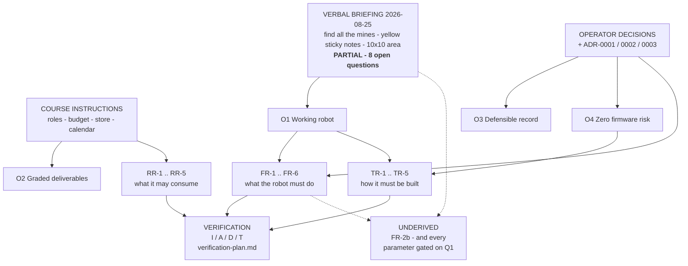

# Requirements Traceability Matrix

> **Type:** ACTIVE-SPEC · **Created:** 2026-08-25
> **Feeds:** Intro Report §2 (Problem Statement and Requirements) — the derivation chain *is* the
> systems-engineering content of that section ([../course/report/outline.md](../course/report/outline.md))
> **Requirements of record:** [../scope.md § Requirements](../scope.md#requirements). This file traces
> them; it does not define them. **No requirement ID appears here that is not in scope.md** — proposed
> additions are quarantined in § 6.
> **Companions:** [conops.md](./conops.md) · [verification-plan.md](./verification-plan.md) ·
> [known-unknowns.md](./known-unknowns.md) · [risk-register.md](./risk-register.md)

---

## 1. How to read this

Every requirement is traced **up** to where it came from and **down** to what satisfies it and how that
will be proven. Two columns carry the marks:

- **Derivation** — `DERIVED` (traceable to the briefing or a course rule) · `PARTIAL` (part of the
  requirement is traceable, part is an assumption) · **`UNDERIVED`** (traceable to nothing but an
  assumption or a team preference).
- **V-method** — the standard four: **I**nspection · **A**nalysis · **D**emonstration · **T**est.
  `—` means **no verification method exists yet**, which is a finding, not a formatting gap.

**The holes are the point.** This project's requirements were derived from a *verbal, partial* briefing
([../scope.md § Mission](../scope.md#mission--partial-verbal-briefing-captured-2026-08-25)). A matrix
with no gaps would be a fabricated matrix. §4 and §5 list the gaps explicitly.

### Sources referenced in the "Traces to" column

| Tag | Meaning |
|---|---|
| `BRIEF` | The verbal design briefing, 2026-08-25 — the requirement of record |
| `COURSE` | Course instructions PDF (roles, budget, store, calendar) — see [../course/deliverables.md](../course/deliverables.md) |
| `OP` | An operator decision, dated, recorded in scope.md or a session record |
| `ADR-000n` | An accepted architecture decision — [../decisions/INDEX.md](../decisions/INDEX.md) |
| `DIR` | A project directive — [../directives/INDEX.md](../directives/INDEX.md) |
| `O1..O4` | Project objective — [../scope.md § Objectives](../scope.md#objectives) |
| `Qn` | Open question to the professor — [questions-for-the-professor.md](./questions-for-the-professor.md) |

---

## 2. Functional requirements

| ID | Requirement (abbrev — full text in scope.md) | Traces to | Derivation | Satisfied by | V-method | V-case | Status |
|---|---|---|---|---|---|---|---|
| **FR-1** | Traverse the arena autonomously after a **single** operator start action | `BRIEF` ("robot… finds") · `COURSE` (Builder is sole operator) · CONOPS **OC-3** | **PARTIAL** — autonomy is briefed; *"single start action"* and hands-off are `[ASSUMED]`, gated on **Q2** | `src/sweep.py` `SweepPlan` state machine; hub start hook **not written** (`src/` is empty) | A, D | VC-FR-1 | Logic drafted, never run on hardware |
| **FR-2** | Detect a target on the floor and distinguish it from the floor | `BRIEF` ("finds the mines") | **DERIVED** | `src/calibration.py` (`calibrate`, `MIN_CONTRAST`) + `src/detector.py` (`EdgeCounter`, hysteresis + min-dwell) | T (host), T (bench) | VC-FR-2, VC-TR-4a | Logic drafted; **no colour sensor owned**; contrast never measured |
| **FR-2b** | Classify a target by **colour**; report unclassifiable as UNKNOWN | `OP` 2026-08-25 (*the team wants classification*) — **not in the briefing** | **UNDERIVED** ⚠ | `src/result.py` UNKNOWN buckets. **The classifier itself does not exist.** | T (gate), D | **VC-G1**, VC-FR-2b | **At risk of deletion** — if **Q5** answers "yellow only", this requirement should be withdrawn, not implemented |
| **FR-3** | Count each distinct target exactly once — no double-count, no miss | `BRIEF` ("finds **all** the mines") | **DERIVED** — though the *deliverable form* (a count) is `[ASSUMED]`, gated on **Q4** | `detector.py` hysteresis + `MAYBE_OFF` dropout absorption + event-width gate; `sweep.py` structural single-visit de-duplication | T (host), D (arena) | VC-FR-3a–g | Logic drafted; **`tests/persistent/` is empty — there is no floor test yet** |
| **FR-4** | Report the result with no laptop attached — per-colour counts, total, UNKNOWN count | `BRIEF` (implied deliverable, **Q4**) · `OP`/TR-3 (untethered) · CONOPS **OC-2/OC-6** | **PARTIAL** — untethered reporting is decided; the *content* rides on FR-2b and Q4 | `result.py` `MissionResult.describe()`; hub matrix/speaker vocabulary is **`PROPOSED` only** ([../runbooks/demo-day.md § 5](../runbooks/demo-day.md)) | I, D | VC-FR-4a/b | **Not implemented.** Display ordering unagreed — see §5 G-3 |
| **FR-5** | Stop cleanly at end-of-run or on operator stop | `OP` (safety) · CONOPS **OC-1** · briefing is silent | **PARTIAL** — end-of-run stop follows from FR-1; *operator stop* is an assumed hub behaviour | `sweep.py` `CMD_STOP` / `DONE`; hub centre-button stop **`UNVERIFIED`** | T (host), D (hub) | VC-FR-5a/b | Host side drafted; **every hub button behaviour is unverified** |
| **FR-6** | Remain inside the arena boundary | `BRIEF` ("in a 10×10 area") | **PARTIAL** — the constraint is briefed; *how the boundary is perceived* is unknown, gated on **Q3** | **Nothing.** Currently the boundary exists only in dead reckoning — no distance sensor, no line sensing, no purchase made | A, D | VC-FR-6a/b | ⚠ **No design element. Verification method is provisional** — see §5 G-1 |

## 3. Technical and resource requirements

| ID | Requirement (abbrev) | Traces to | Derivation | Satisfied by | V-method | V-case | Status |
|---|---|---|---|---|---|---|---|
| **TR-1** | Stock LEGO MicroPython only; no third-party firmware | `ADR-0001` · `O4` · `COURSE` (shared equipment) | **DERIVED** | The whole toolchain choice; blacklist enforcement in [../scope.md](../scope.md) and `CLAUDE.md` | I | VC-TR-1 | Not yet inspected — **the hub has never been connected** |
| **TR-2** | Mission logic pure Python, host-testable; hub I/O in a thin adapter | `ADR-0002` · `O3` | **DERIVED** | `src/__init__.py` hard import rule; `src/` (empty) | I, T | VC-TR-2 | Rule stated in a docstring; **not machine-enforced** — no boundary test exists |
| **TR-3** | Runs standalone from the hub, not tethered | `OP` · Demo Day risk · CONOPS **OC-2** | **DERIVED** | Download-mode deploy route — **route not yet chosen**, [../research/spike-prime-linux-toolchain.md](../research/spike-prime-linux-toolchain.md) | D | VC-TR-3 | Blocked on Sprint 1 item 10 — [2026-08-25-sprint-1-walking-skeleton.md](./2026-08-25-sprint-1-walking-skeleton.md) |
| **TR-4** | Thresholds calibrated at run start, never hard-coded | `DIR` honest-instrumentation · floor/lighting variability (research) | **DERIVED** | `calibration.py calibrate()`; `config.py` bounds only (`MIN_CONTRAST`, `HYSTERESIS_FRACTION`) | I, T, D | VC-TR-4a–d | Implemented in pure logic; never exercised against a real sensor |
| **TR-5** | Port assignments in ONE place, referenced by code | `DIR` honest-instrumentation ("one accountable path per concern") | **DERIVED** | [../hardware/port-map.md](../hardware/port-map.md) — **currently unfilled**; no code reads it | I | VC-TR-5 | Not satisfied. Blocked on the build existing |
| **RR-1** | Build within the 100 SB budget; no real money | `COURSE` p.1 | **DERIVED** | [`inventory.py`](../../inventory.py) ledger — 44 SB spent, **56 SB remaining** | I | VC-RR-1 | Satisfied to date |
| **RR-2** | Host is native Ubuntu 22.04; free/open tooling only | `OP` (operator's machine) | **DERIVED** | [../findings/host-environment.md](../findings/host-environment.md) | I | VC-RR-2 | Audited; ModemManager remediation outstanding |
| **RR-3** | Sensors limited to the course store list | `COURSE` (store) | **DERIVED** | Purchase decisions; BOM in `inventory.py` | I | VC-RR-3 | Trivially satisfied — **no sensor has been bought at all** |
| **RR-4** | Motors limited to 45602 / 45607 | `COURSE` (store) | **DERIVED** | The two motors already owned | I | VC-RR-4 | ⚠ **Cannot be verified today: which two motors we own is UNKNOWN.** Ask the Supplier/Builder |
| **RR-5** | Ledger records the price actually paid, never a price list | `COURSE` (prices change) · `OP` | **DERIVED** | `inventory.py` `ENTRIES` — per-line unit price | I | VC-RR-5 | Satisfied |

---

## 4. Requirements that are UNDERIVED

A requirement is underived when nothing but an assumption connects it to the mission. The assumptions
themselves are registered in [known-unknowns.md](./known-unknowns.md); this section names the
**requirements they hold up**. Each one is a candidate for deletion, not just for clarification — building an underived requirement is the most
expensive mistake available on a five-session project.

| ID | What it is actually traceable to | Cost if it is wrong | Settled by |
|---|---|---|---|
| **FR-2b** (whole requirement) | A **team preference** recorded 2026-08-25. The briefing says "*I think* yellow sticky notes" — it never says other colours are present. | Highest in the document. Classification caps traverse speed (~160 mm/s at a 20 mm chord vs ~360 mm/s at 30 mm), which compounds the coverage problem, and needs a classifier nobody has written — [../findings/coverage-time-budget.md](../findings/coverage-time-budget.md) | **Q5** |
| **FR-1** — "single start action", hands-off | Assumed demo etiquette; the briefing and the instructions are both silent | Low to build, but it defines the failure drill's boundaries (CONOPS OC-8) | **Q2** |
| **FR-4** — per-colour reporting | Rides entirely on FR-2b | Wasted display design; a 5×5 matrix showing three quantities is a real design problem | **Q5**, **Q4** |
| **FR-5** — "or on operator stop" | Assumed stock hub behaviour; never observed | The failure drill assumes A1 STOP works | First hub session |
| **FR-3** — that the deliverable is a **count** | Assumed. "Finds" could mean locations, stopping on each, or retrieval | A location map is a different project, not a bigger version of this one | **Q4** |
| **Every sweep parameter** (arena size, lane pitch, run time) | `config.py` placeholders explicitly marked `[ASSUMED]`. Not requirements themselves, but FR-1/FR-3/FR-6 are unverifiable without them | Two orders of magnitude in path length | **Q1** |

## 5. Gaps in verification coverage

| # | Gap | Why it is a gap | What would close it |
|---|---|---|---|
| **G-1** | **FR-6 has no design element and only a provisional verification method.** | Boundary containment is currently an *emergent property of odometry accuracy*, not a designed function. "Demonstrate it stayed inside" verifies the arena it was demonstrated on, and nothing else. | **Q3** (boundary type) → a purchase decision (distance sensor 45604, 56 SB available) → then a real verification case. Until then, VC-FR-6 is an **analysis** of the error budget, and it will not pass a demanding reading. |
| **G-2** | **FR-3's "no miss" clause is unverifiable by the robot.** | The robot cannot report what it failed to see. Only ground truth held by a human can. | Every run record captures the robot's count **and** the true count **and** the operator's independent beep tally — three numbers, recorded before they are compared ([../runbooks/demo-day.md § 7](../runbooks/demo-day.md)). This is already procedural; it is not yet a stated requirement. |
| **G-3** | **FR-4 has no agreed pass criterion.** | "Report per-colour counts, a total, and the UNKNOWN count" on a 5×5 matrix is ambiguous about *sequence*, and the Builder reads whatever appears aloud to the instructor. | The Programmer writes down the DONE display sequence and the Builder countersigns it, before the first dry run. Then VC-FR-4 becomes an inspection with an observable. |
| **G-4** | **TR-2's import boundary is a docstring, not a check.** | A hub-only import can be added to `src/` and nothing fails. The one requirement that protects host-side testability is unenforced. | A floor test in `tests/persistent/` that imports every pure `src/` module with the hub-only names poisoned. Host-runnable **today**, no hardware. |
| **G-5** | **TR-5 has nothing to inspect.** | The port map is empty and no code reads it. The requirement is neither satisfied nor violated. | The build exists → operator describes it → port map filled → the `hub_*.py` modules reads it → grep-based inspection becomes meaningful. |
| **G-6** | **No requirement bounds run time**, yet run time is the project's largest known risk. | If "10×10" means feet, exhaustive coverage takes 8–23 minutes and no requirement says that is a failure. | **Q2**, then adopt **PR-1** below. |
| **G-7** | **No requirement states coverage completeness.** | FR-3 constrains *counting*; nothing constrains *where the robot went*. A robot that sweeps half the arena and correctly counts everything in that half satisfies FR-3. | Adopt **PR-2** below. |

## 6. PROPOSED requirements — NOT adopted, NOT in scope.md

**These are proposals for the operator, not requirements.** They are listed separately precisely so that
nothing here can be mistaken for the requirement of record. Adopting one means editing
[../scope.md § Requirements](../scope.md#requirements) — which is the operator's call, not an agent's.

| Proposed ID | Statement | Why it should exist | Blocked by |
|---|---|---|---|
| **PR-1** | The robot shall complete a full sweep of the arena within the demo time limit. | Closes G-6. The single largest risk in the project has no requirement attached to it. Unwritable until the limit is known. | **Q2** |
| **PR-2** | The robot shall traverse a path whose lane pitch guarantees no target of the specified size can lie between two lanes. | Closes G-7 and makes coverage — not just counting — a stated, analysable obligation. Note this is *analysis-verifiable today* from `config.lane_pitch_mm()` once the target size and cross-track error are **measured**. | **Q1**, plus a UMBmark cross-track measurement |
| **PR-3** | The robot shall refuse to begin a run, and shall annunciate a fault, when run-start calibration cannot separate floor from target. | Already implemented behaviour (`CalibrationError`) with no requirement behind it. CONOPS **OS-5** depends on it, and an unarmed robot at the demo table needs a documented reason. | Nothing — adoptable now |
| **PR-4** | The robot shall annunciate its current operating stage on the hub light matrix and speaker, distinguishable at the arena's edge without a laptop. | The entire failure drill and the independent beep tally depend on it, yet the vocabulary is `PROPOSED` in a runbook with no requirement above it. | Nothing — adoptable now |
| **PR-5** | Each run shall be recorded with its measured conditions — surface, lighting, calibration bands, robot count, true count, duration — before the robot is packed up. | O3 (defensible record) is an *objective* with no requirement implementing it, and the run record is unrepeatable evidence. | Nothing — adoptable now |

**Recommendation to the operator:** adopt PR-3, PR-4, PR-5 now — all three describe behaviour or practice
the project already relies on, and all three are cheap. Hold PR-1 and PR-2 until Q1/Q2 land, then adopt
them with real numbers rather than placeholders.

---

## 7. Status summary

| | Count | IDs |
|---|---|---|
| Requirements of record | **17** | FR-1…FR-6 (incl. FR-2b), TR-1…TR-5, RR-1…RR-5 |
| Fully `DERIVED` | 12 | FR-2, FR-3, TR-1…TR-5, RR-1…RR-5 |
| `PARTIAL` | 4 | FR-1, FR-4, FR-5, FR-6 |
| **`UNDERIVED`** | **1** | **FR-2b** |
| Verified against hardware | **0** | — the hub has never been connected |
| Verifiable on the host today (logic) | 5 | FR-2, FR-3, FR-5 (partly), TR-2, TR-4 — see [verification-plan.md § 4](./verification-plan.md) |
| Verifiable today by inspection, no hardware | 4 | RR-1, RR-2, RR-3, RR-5 — ledger and host audits. RR-4 is blocked on which two motors we own, not on hardware |
| No design element at all | 1 | **FR-6** |
| No agreed pass criterion | 2 | FR-4, FR-6 |

**Revision rule:** when a professor answer lands, update
[questions-for-the-professor.md](./questions-for-the-professor.md) and
[../scope.md § Mission](../scope.md#mission--partial-verbal-briefing-captured-2026-08-25) first, then
**re-derive** the affected rows here — do not bolt a real answer onto a guessed requirement.
