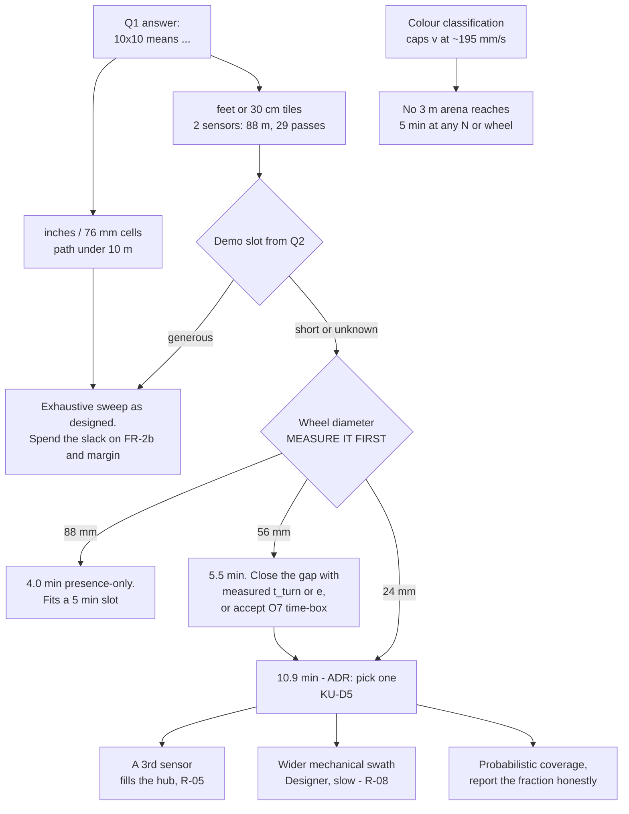

# Risk Register

**Type:** ACTIVE-SPEC (living register) · **Created:** 2026-08-25 · **Horizon:** Demo Day 10 SEP, Intro Report 18 SEP
**Companions:** [known-unknowns.md](./known-unknowns.md) · [conops.md](./conops.md) ·
[requirements-traceability.md](./requirements-traceability.md) · [verification-plan.md](./verification-plan.md) ·
[2026-08-25-coverage-strategy-trade-study.md](./2026-08-25-coverage-strategy-trade-study.md)

Risks specific to **this** project — a four-person SYS 301 team, **two days to Demo Day**, 56 Schrute
Bucks, a robot that drives and detects, and a one-sentence verbal mission. No generic "requirements may
change" entries; every row below is traceable to something in this repo.

> **Updated 2026-09-08 (evening).** The heavy hardware day **retired five risks** (R-04, R-06, R-07,
> R-09, R-12 — all `CLOSED`, kept in place with their reason), **re-scored three** (R-01 up, R-05 down,
> R-17 up) and **opened two** (**R-18** the first `main.py` run, **R-19** the one-sensor swath). The
> shape of the project's risk has moved wholesale from *"can we detect anything"* — now answered, GATE 1
> closed twice on the real carpet — to *"can the graded program run at all, and can it finish in time."*

**Relationship to the other registers.** [known-unknowns.md](./known-unknowns.md) is what we *do not
know*; many of those unknowns are the **cause** of a risk here, and are cited by ID rather than
restated. [2026-08-25-sprint-1-walking-skeleton.md § Risks](./2026-08-25-sprint-1-walking-skeleton.md#risks)
holds R1–R8 scoped to **Sprint 1 only**; this file is the project-level register and supersedes them in
scope — the mapping is at the bottom so neither is silently duplicated.

---

## How this file lives

- **Every session:** scan the Trigger column. A trigger that has fired is not a risk any more — it is a
  problem, and the Contingency is what happens next, today, not "eventually".
- **New risk** → add a row with the next free ID, score it, and re-sort the summary table. **IDs are
  permanent and are never renumbered when the ranking changes** — only the Rank column moves.
- **Risk realized** → mark it `REALIZED`, record the date and what the contingency actually cost, and
  write the outcome once in a session record. A realized risk with an honest cost recorded is a
  *verification result* for the Intro Report; a quietly deleted row is a hole in the engineering record.
- **Risk retired** → mark it `CLOSED` with the reason (usually: the unknown behind it was answered). Do
  not delete it. The report's risk section needs the ones that did *not* happen and why.
- **Scores are re-judged, not recalculated.** When new information lands, change L or I and say in one
  line what changed it.

### Scoring

Likelihood and impact are **[JUDGED], not measured** — there is no historical data for a four-person
team's first robot. They exist to force ranking, and the ranking is the useful output, not the number.

| | Likelihood (L) | Impact (I) |
|---|---|---|
| **5** | Near certain unless we act | Mission or a graded deliverable fails |
| **4** | More likely than not | A milestone slips with no recovery time |
| **3** | Realistic | Costs a class session out of five, or a redesign |
| **2** | Possible | Costs hours and some Schrute Bucks |
| **1** | Unlikely | Absorbed without a plan change |

**Exposure = L × I.** Status: `OPEN` · `WATCHING` (trigger armed, mitigation running) · `REALIZED` ·
`CLOSED`.

---

## Ranked summary

| Rank | ID | Risk | L | I | Exp | Threatens | Owner | Status |
|---:|---|---|:-:|:-:|:-:|---|---|---|
| 1 | **R-01** | Exhaustive coverage does not fit the demo slot | 5 | 5 | **25** | Demo Day | Programmer → professor | `REALIZED` — 2026-09-08, at 10 ft |
| 2 | **R-18** | **`src/main.py` has never run; its first run would be on Demo Day** | 4 | 5 | **20** | Demo Day | Programmer | `OPEN` — new 2026-09-08 |
| 3 | **R-02** | Lane drift makes the sweep miss mines a working detector would have seen | 4 | 4 | **16** | Demo Day | Programmer + Designer | `OPEN` |
| 3 | **R-03** | Only ~2 days and ~1 hardware session remain; one lost is most of the schedule | 4 | 4 | **16** | Demo Day | Whole team | `WATCHING` |
| 3 | **R-19** | **The mission code sweeps a ONE-sensor swath while two sensors are mounted** | 4 | 4 | **16** | Demo Day | Programmer | `OPEN` — new 2026-09-08 |
| 6 | **R-08** | Role separation makes every physical iteration slow and expensive | 4 | 3 | **12** | Demo Day | Whole team | `WATCHING` |
| 7 | **R-10** | We built to the wrong reading of the verbal mission | 2 | 5 | **10** | Demo Day | Programmer → professor | `OPEN` |
| 7 | **R-11** | Hub firmware is changed — accepted update, or worse | 2 | 5 | **10** | The whole project | Programmer (plug/unplug), Builder | `WATCHING` |
| 9 | **R-13** | Journal days are missed — 80 points at −5/day | 3 | 3 | **9** | 15 SEP | Every member, individually | `WATCHING` |
| 9 | **R-14** | Hub flat, or the robot is not in the yellow box at class start | 3 | 3 | **9** | Any session | Builder | `WATCHING` |
| 9 | **R-17** | Adjacent notes are double-counted or merged; FR-3 fails | 3 | 3 | **9** | Demo Day | Programmer | `OPEN` — re-scored up 2026-09-08 |
| 12 | **R-15** | A teammate is absent and roles may not be reassigned | 2 | 4 | **8** | Any session | Whole team | `OPEN` |
| 12 | **R-16** | Observations get remembered instead of written down | 2 | 4 | **8** | Intro Report | Whoever measures | `WATCHING` |
| 14 | **R-05** | 56 SB does not cover the sensors the design needs | 2 | 3 | **6** | — | Supplier | `OPEN` — re-scored down 2026-09-08 |
| — | ~~R-04~~ | ~~No deploy route from Ubuntu to the hub ever works~~ | — | — | — | — | — | **`CLOSED` 2026-08-27** |
| — | ~~R-06~~ | ~~Hub is SPIKE 2 generation; most online material is for the wrong API~~ | — | — | — | — | — | **`CLOSED` 2026-08-27** |
| — | ~~R-07~~ | ~~ModemManager corrupts first hub contact and it is misdiagnosed~~ | — | — | — | — | — | **`CLOSED` 2026-08-27** |
| — | ~~R-09~~ | ~~The CSER `.docx` does not survive LibreOffice~~ | — | — | — | — | — | **`CLOSED` 2026-08-26** |
| — | ~~R-12~~ | ~~Sticky-note colours are not separable; FR-2b is unachievable~~ | — | — | — | — | — | **`CLOSED` 2026-09-08** |

**Closed rows are kept, never deleted** — the report's risk section needs the ones that did *not* happen
and why (see § How this file lives).

---

## R-01 — Exhaustive coverage does not fit the demo slot

**L 5 × I 5 = 25 · Threatens: Demo Day (10 SEP) · Owner: Programmer, via a question to the professor ·
Status `REALIZED` — 2026-09-08**

> ### ⚠ RE-SCORED 2026-09-08, L 3 → 5, exposure 15 → 25, rank 3 → 1. This risk has REALIZED.
>
> **What changed it:** the operator stated the competition expectation is a **10 FOOT square (3048 mm)** —
> the expensive end of the whole range, and it is now the planning value in
> [`config.py`](../../src/config.py) (`PROVISIONAL`, "not set in stone", KU-P1). Against the speeds
> actually MEASURED, [COMPUTED]:
>
> | Configuration | Lanes | Path | Time |
> |---|---:|---:|---:|
> | **One sensor at 55 mm/s** — *what the mission code does today* | 75 | 229 m | **~69 min** |
> | Two sensors at 300 mm/s | 38 | 116 m | **~6.4 min** |
>
> **~69 minutes fits no plausible demo slot**, and every run to date has been driven at **80–100 dps
> (44–55 mm/s)** against a MEASURED `max_speed` of **930 dps** — ~9× headroom that has never been used.
> So the two things that used to be optimisations are now **requirements**: read **both** colour sensors
> (**R-19**, KU-D11) and raise the traverse speed. The detector's own ceiling is not the obstacle —
> `v ≤ W·f/N` allows **240 mm/s** at N=2 on 24 mm tape at 20 Hz.
>
> **Contingency, ranked, if the speed does not come:** (1) fix R-19 and take the 2× for free; (2) widen
> the lane pitch — but **only after** both sensors are genuinely read every tick, because widening a
> one-sensor swath silently loses mines; (3) accept probabilistic coverage deliberately and **report the
> coverage fraction honestly** (KU-D5, KU-D9) — `MissionResult` already supports it
> (`status`, `lanes_completed/lanes_planned`). A claimed completion we cannot substantiate is the one
> outcome that damages the Intro Report.
>
> **This risk is no longer reducible by a question.** KU-P2 (the time limit and scoring rule) still
> decides *how* it is absorbed, but the arithmetic problem exists whatever the answer.

**Re-judged 2026-09-01, L 4 → 3. What changed it: we own TWO colour sensors, not one** (MEASURED on the
hub, ports C and D), and two sensors on one bar multiply the pass pitch by **2.59×**, which brings the
10-foot arena in **under 5 minutes on Ø88 wheels (4.0 min) and to 5.5 min on Ø56** — where the
single-sensor design needed an unreachable 2003 mm/s. Most cells of the Q1 × Q2 table now fit a plausible
slot. **The impact is unchanged at 5** and the risk is not closed: the units are still unanswered, the
**wheel diameter is unmeasured and by itself swings the 10-foot answer 2.7× (4.0–10.9 min)**, and colour
classification still does not reach 5 minutes at 3 m under *any* configuration we can build.
Full arithmetic, redone: [../findings/coverage-time-budget.md](../findings/coverage-time-budget.md).

A downward colour sensor traces a **line, not a swath** — that has not changed, and it is still the root
of this risk. What changed is how many lines we have and what each one costs: the gap *between* two
sensors on a rigid bar is charged **build tolerance**, not odometry error, so the second line is cheaper
than the first and the gain exceeds 2×. The exact gain depends on the sensor spacing `S`, which the
**Designer has not chosen** — 41 mm spacing gives 2.00×, 65 mm gives 2.59×, and above ~71 mm coverage is
no longer guaranteed at all.

- **Cause:** [KU-P1](./known-unknowns.md) (units unknown) × [KU-P2](./known-unknowns.md) (time limit
  unknown) × [KU-M3](./known-unknowns.md) (**wheel diameter unmeasured — new to this product as of
  2026-09-01, and now the largest of the three multipliers**). [KU-M4](./known-unknowns.md) (cross-track
  error) has **largely dropped out**: with two sensors, `e` doubling from 15 to 25 mm costs 24 % more run
  time instead of 95 %, and the single-sensor design's cliff — at `e` ≥ 38 mm *no* lane pitch guarantees
  coverage — does not exist for two. It is still a product of three unknowns, but one of the three is now
  closable **today, with a ruler, by the Builder, at no cost**.
- **Mitigation:** Ask Q1, Q2 and Q5 **in one written message, first** — they are free to ask and they
  gate the architecture. Meanwhile keep arena size, lane pitch, and speed as parameters in
  [config.py](../../src/config.py), never as constants, so an answer changes a value and not the
  design — and **add `N_SENSORS` and `SENSOR_SPACING_MM` to that list**, with the pitch computed from
  the spacing rather than hard-coded. Do **not** tune a sweep before the units are known; tuning for the
  wrong arena is a wasted class session. **New and cheapest of all: measure the wheel diameter.** It is
  a ruler, it needs no hub and no purchase, and it collapses a 2.7× spread in every run time this risk
  turns on ([KU-M3](./known-unknowns.md)).
- **Contingency (if it is 10 ft and the slot is short):** the options are costed and cross-tabulated
  against Q1 × Q2 in [2026-08-25-coverage-strategy-trade-study.md](./2026-08-25-coverage-strategy-trade-study.md),
  which exists as this risk's mitigation artifact — more colour sensors across the robot's width (money: R-05), a wider mechanical swath (the Designer's,
  and slow to iterate: R-08), or **deliberately probabilistic coverage with the coverage fraction
  reported honestly**. The third is the cheapest and is defensible in a systems-engineering report
  *provided we say so*, which is exactly what [../directives/honest-instrumentation.md](../directives/honest-instrumentation.md)
  requires. Which one is right depends on the scoring rule — "found all" and "found the most, fastest"
  choose differently. **Revised 2026-09-01:** the first option has already been taken — we have the two
  sensors — so the contingency ladder is now (a) **space them at 60–65 mm** rather than at the lane
  pitch, which is free and worth 2.59× against 2.00×; (b) measure the wheel and `e`, either of which can
  close the remaining 0.5 min on the Ø56 10-foot cell; (c) a **third** sensor, which would fill the hub
  and foreclose the boundary sensor, and should not be bought before (a) and (b) are done; (d)
  probabilistic coverage, unchanged and still the honest floor.
- **Trigger — ⚠ FIRED 2026-09-01.** The second condition was *"1 SEP arrives with Q1 still unanswered,
  at which point we commit to the pessimistic reading and design for it rather than waiting."* **1 SEP
  has arrived and Q1 is still unanswered** ([questions-for-the-professor.md](./questions-for-the-professor.md)
  §1). Per this file's own rule, that is no longer a risk but a problem with a response due today:
  **design to the 10-foot reading**, presence-first with classification layered on top, two sensors at
  60–65 mm, and the O7 time-box carried regardless. The first condition — the professor answers "feet"
  or names a slot under ~10 minutes — remains armed and would only confirm what we are now building.

Redrawn 2026-09-01 for two sensors. Path lengths are the two-sensor figures at 65 mm spacing.

## R-02 — Lane drift makes the sweep miss mines a working detector would have seen

> **Sharpened 2026-09-08, score unchanged (L 4 × I 4 = 16).** The robot demonstrably drives straight at
> short range — left/right encoders within **0.4 %** and ~**2.6°** of total yaw wander over the 155 mm
> `drive_to_tape` run [MEASURED] — but the 1 ft square misclosed **108.3 mm on 1277 mm (8.5 %)** with
> **30°** of final heading error, and its four turns summed **−389.7°** against a commanded −360°.
> **Those two datasets do not agree, and the disagreement is the risk:** if the wander is a *systematic
> bias* it integrates to **85 mm of cross-track drift over 3048 mm** — wider than a 76 mm note, so mines
> inside the lane are missed and no lane pitch saves it; if it is *zero-mean noise* it costs almost
> nothing. **KU-M34 is exactly this question and it is open.** The mitigation that does not depend on the
> answer: command every lane to an **absolute** gyro heading rather than a relative ±90°, so error
> **cancels** instead of accumulating, and terminate each lane on the PROVEN perpendicular tape touch —
> an absolute fix. [../findings/line-following-viability-2026-09-08.md § 6](../findings/line-following-viability-2026-09-08.md).

**L 4 × I 4 = 16 · Threatens: Demo Day · Owner: Programmer (heading hold) + Designer (geometry)**

- **Cause:** heading error integrates into lateral error — **1° over a 1.2 m lane is already 21 mm**
  ([../research/detection-and-sweep-techniques.md](../research/detection-and-sweep-techniques.md)) — and
  is compounded by gyro drift, wheel slip on carpet, unequal effective wheel diameters, and encoder
  resolution. Every one of the inputs is currently an assumption: [KU-M3](./known-unknowns.md),
  [KU-M4](./known-unknowns.md), [KU-M8](./known-unknowns.md), [KU-M9](./known-unknowns.md).
- **Why it is nastier than R-01:** it fails **silently**. The robot completes a clean-looking run and
  reports a confident count that is simply wrong, and nothing on the hub says so.
- **Mitigation:** gyro heading hold with a per-lane re-square; set lane pitch from a **measured**
  cross-track error (UMBmark square-path), not from the assumed 15 mm; pre-run gyro health check, because
  a SPIKE gyro stuck at 0 from boot is a documented pathology.
- **Contingency:** reduce lane pitch — which costs run time and pushes straight back into R-01 — or
  re-reference off a boundary if [KU-P3](./known-unknowns.md) gives us one. If neither fits the slot,
  the count becomes an explicitly stated *lower bound with a coverage fraction*, not a claim of
  completeness.
- **Trigger:** the UMBmark run shows cross-track error above 15 mm, **or** any dry run's counted total
  varies between two passes over an identical layout.
- **Note 2026-09-01 — the two-sensor build softens the *time* consequence, not the *miss* consequence.**
  The contingency "reduce lane pitch, which costs run time and pushes back into R-01" is now much
  cheaper: with two sensors an `e` of 25 mm instead of 15 mm costs 24 % more run time rather than 95 %
  ([../findings/coverage-time-budget.md](../findings/coverage-time-budget.md)). This does **not** reduce
  L or I here — a note missed is still missed silently, and the pair of sensors shares the same heading
  error, so nothing about the drift itself improves. It only means we can afford to respond.

## R-03 — Only about five hardware sessions remain; one lost is 20 % of the schedule

**L 4 × I 4 = 16 · Threatens: M1, M2, Demo Day · Owner: whole team · Status `WATCHING`**

- **Cause:** 25, 27 AUG · 1, 3, 8 SEP, demo on the 10th. Physical assembly, purchases, and robot
  operation may only happen in class with roles enforced, and a lost session **cannot be made up by
  working harder at home**.
- **Mitigation:** every hub session runs a **written runbook**, never improvisation
  ([../runbooks/INDEX.md](../runbooks/INDEX.md)). Everything that does not need the hub —
  `src/` logic, its test floor, host setup, all analysis — is done off-hardware so class time
  buys only things class time can buy ([ADR-0002](../decisions/0002-split-mission-logic-from-hub-io.md)).
  Batch iterations: deploy once, run the whole sequence, observe everything, then edit.
- **Contingency:** cut scope to something demonstrably working — presence detection and a count over a
  smaller area — and state the reduction as a deliberate engineering decision with its reason, which
  scores better in a systems-engineering report than an ambitious robot that did not run.
- **Trigger:** any session that ends without the written observable its plan named. That is the signal
  to re-plan the next one, not to hope.

## R-04 — No deploy route from Ubuntu to the hub ever works

**✅ `CLOSED` 2026-08-27 — the trigger did not fire.** A file reached the hub on the day this risk was
scheduled to be failed fast: base64 chunks over the MicroPython REPL into `/flash/lib`, verified by a
**SHA-256 the hub computes on itself** ([ADR-0007](../decisions/0007-deploy-by-writing-modules-to-flash-lib.md)),
and since hardened into the Hub OS slot route, which runs a program **untethered on battery** (proven
2026-09-03 and again 2026-09-08). No LEGO app, no `mpy-cross`, no GCC, no Windows, no Pybricks. Kept for
the report: this was scored 15 and it cost nothing. *(A residual — deploy **tooling** now has an
operational constraint, Ctrl-C kills the Hub OS — is tracked as KU-M37, not as this risk.)*

~~**L 3 × I 5 = 15 · Threatens: M1 and everything downstream · Owner: Programmer**~~

- **Cause:** LEGO publishes no Linux desktop app — Windows, macOS, iPad, Android, Chromebook only. Our
  only host is native Ubuntu 22.04. Every hardware result in the project sits behind this one step, and
  it has never been attempted ([../research/spike-prime-linux-toolchain.md](../research/spike-prime-linux-toolchain.md),
  [KU-D1](./known-unknowns.md)).
- **Mitigation:** the Sprint 1 walking skeleton exists precisely to fail this **fast, on 27 AUG**, while
  there is still time to switch routes; the route ADR must name a **primary and a fallback** before the
  session that depends on it. google-chrome is installed, so the WebSerial path is available without a
  new install.
- **Contingency:** deploy from a teammate's Windows/macOS machine or a Chromebook — the Programmer still
  authors everything here, and only the upload moves. That route runs the LEGO app against our hub, which
  is exactly where the non-dismissible Hub OS update prompt lives (**R-11**): identify the Hub OS first and
  brief whoever holds the machine that the prompt is refused, not accepted. **The forbidden answer is Pybricks**: it is the
  best-supported Linux route and it replaces the hub's firmware, so it will be re-proposed by every
  tutorial we read and is permanently blacklisted ([ADR-0001](../decisions/0001-stock-lego-firmware-only.md)).
- **Trigger:** 27 AUG ends without a file having reached the hub.

## R-05 — 56 Schrute Bucks does not cover the sensors the design needs

**L 2 × I 3 = 6 · Threatens: nothing before Demo Day · Owner: Supplier · Re-scored down 2026-09-08**

> **Re-scored 2026-09-08, L 3 → 2, I 4 → 3, exposure 12 → 6.** Two colour sensors are mounted and
> working, the design needs no third, and **no purchase is planned before 10 SEP** — so the budget can
> no longer take the demo down. The 56 SB is unspent. ⚠ **The ledger reconciliation below is still owed
> and is now a *report* problem, not a *demo* problem:** [../course/budget.md](../course/budget.md)
> records no sensor owned while two are on the hub.

- **Cause:** the ledger shows **no sensor owned** — no colour sensor, no distance sensor, no mounting
  blocks, no axles ([../course/budget.md](../course/budget.md)). Store prices may change (RR-5) and are
  currently unknown to us ([KU-T5](./known-unknowns.md)). Meanwhile R-01's best contingency is *more
  sensors*, R-02 may want a boundary reference, and [KU-P3](./known-unknowns.md) may require a distance
  sensor. Sell-back returns 90 % rounded down, so a wrong purchase is a permanent ~10 % loss.
- **Mitigation:** buy against a **demonstrated** need, never speculation — the trade study demonstrates the need for the *first* colour sensor (it is required under every cell of its Q1 × Q2 table) and defers the 2nd and 3rd to the answers ([2026-08-25-coverage-strategy-trade-study.md § 1](./2026-08-25-coverage-strategy-trade-study.md), [KU-D4](./known-unknowns.md)). Settle sensor mounting geometry
  *before* the Supplier buys mounting blocks ([KU-D3](./known-unknowns.md)). Get real prices from the
  Supplier before committing to any design that assumes a second sensor. Check the yellow box first
  ([KU-T4](./known-unknowns.md)) — the kit may already supply one.
- **Contingency:** single-sensor design with a narrower arena or probabilistic coverage; use the hub's
  own gyro and motor encoders in place of a purchased sensor wherever possible, since they are free.
- **Trigger:** the Supplier's price report shows the design's sensor set costing more than **46 SB**
  (56 minus a 10 SB reserve for meeting bills and role-violation penalties, which come out of the same
  budget).
- ⚠ **Unreconciled 2026-09-01 — the Supplier must answer this before the row can be re-scored.** The
  cause above says *"the ledger shows no sensor owned"*. That is still what
  [../course/budget.md](../course/budget.md) says, and **two colour sensors are physically on the hub**
  (ports C and D, MEASURED). Either they came from the yellow box — which answers
  [KU-T4](./known-unknowns.md) *yes*, costs 0 SB, and drops this risk sharply — or they were bought and
  the ledger is stale. **No price is guessed here.** Note also that the coverage redo removes the *need*
  for a third sensor in most cells ([../findings/coverage-time-budget.md](../findings/coverage-time-budget.md)),
  which is the other half of what made this risk bite.

## R-06 — The hub is the SPIKE 2 generation and most online material is for the wrong API

**✅ `CLOSED` 2026-08-27 — the trigger did not fire.** Read-only identification returned **SPIKE 3** /
MicroPython 1.24.0, *"SPIKE Prime with STM32F413"*, with `motor` / `motor_pair` / `runloop` /
`color_sensor` present and **no `spike` module**
([../findings/hub-first-contact-2026-08-27.md](../findings/hub-first-contact-2026-08-27.md)). The
*standing* discipline survives the risk closing: **most material online is SPIKE 2 and is inapplicable
outright** — check what generation a source targets before believing it.

~~**L 3 × I 4 = 12 · Threatens: M1, M2 · Owner: Programmer**~~

- **Cause:** `from spike import PrimeHub` (SPIKE 2) and `import motor` / `from hub import port` /
  `import runloop` (SPIKE 3) are mutually incompatible, and the generation on our unit is
  [KU-M1](./known-unknowns.md) — unknown, because the hub has never been connected. Most tutorials
  online target the obsolete generation, and code written against the wrong one **fails in a way that
  reads like a hardware fault**, which is how a class session gets burned.
- **Mitigation:** read-only identification **before any hub code is written**
  ([../runbooks/hub-identification.md](../runbooks/hub-identification.md)), recording the version string
  verbatim. Every external source is checked for which generation it targets before it is believed.
  `src/` imports nothing hub-specific, so the blast radius is confined to `src/`.
- **Contingency:** rewrite the adapter only — the mission logic and its tests are unaffected by design.
  **Never** resolve this by updating the hub (see R-11).
- **Trigger:** the identification session returns a SPIKE 2 version string, or returns nothing at all.

## R-07 — ModemManager corrupts first hub contact and the team misdiagnoses it

**✅ `CLOSED` 2026-08-27 — mitigated before first contact, and the fault never materialised.**
`scripts/setup-host.sh --apply` stopped and disabled ModemManager and wrote the udev rule that gives the
stable `/dev/spike` symlink, **before the hub was ever plugged in**. ⚠ **Honest footnote:** with the hub
attached, `mmcli -L` returned *"No modems were found"* — so ModemManager had **not** in fact grabbed the
device. **The mitigation is a kept precaution, not a fixed fault**, and it must be re-applied on any new
host ([../findings/host-environment.md](../findings/host-environment.md)).

~~**L 4 × I 3 = 12 · Threatens: M1 · Owner: Programmer · Status `WATCHING`**~~

- **Cause:** ModemManager is **`active` and `enabled` on this host — measured, not assumed**
  ([../findings/host-environment.md](../findings/host-environment.md)). It probes newly appearing
  `/dev/ttyACM*` devices with AT commands, which injects garbage into the hub's serial stream. Likelihood
  is 4 because the mechanism is confirmed present; only the timing is uncertain.
- **Why the impact is bigger than "one bad session":** a garbled first connection looks exactly like
  "Linux doesn't work with LEGO", which sends the team down a dead end and straight into R-04's
  contingency for no reason.
- **Mitigation:** `scripts/setup-host.sh` neutralizes it **before the hub is ever plugged in** —
  idempotent, and reporting what it changed versus what was already in place. **The script does not exist
  yet** — it is an open M1 item ([../roadmap.md](../roadmap.md)), so until it is written this mitigation is
  planned, not in place.
- **Contingency:** if the hub is plugged in first and the session looks broken, stop; do not conclude
  anything about the hub. Disable ModemManager, unplug, replug, check `dmesg`, retry.
- **Trigger:** anyone reaches for the USB cable before `setup-host.sh` has run on this machine.

## R-08 — Role separation makes every physical iteration slow and expensive

**L 4 × I 3 = 12 · Threatens: M2, M3 · Owner: whole team · Status `WATCHING`**

- **Cause:** the course rules, enforced at **−2 SB per violation**. The Programmer may not touch the
  robot except to plug and unplug; the Builder is the only operator; the Designer may not touch supplies;
  the Supplier may not touch supplies again after buying them
  ([../course/team/roles.md](../course/team/roles.md)). A one-character fix costs an edit, a redeploy, a
  handoff, and a Builder-run test — and the tempting shortcut costs money out of the same 56 SB that
  buys sensors (R-05).
- **Mitigation:** fixed, rehearsed choreography rather than re-deriving who does what each time. Batch
  iterations. **Instrument the hub so a run is diagnosable from across the room** — a matrix character
  per state and a speaker cue — so the Builder can report what happened without the Programmer touching
  anything.
- **Contingency:** accept the tempo and plan around it; budget class time in handoffs, not in edits.
  Never "just adjust it myself" — the penalty is larger than the delay.
- **Trigger:** any change that needs more than two handoffs to alter one number. That is a signal to
  make the number run-time configurable instead.

## R-09 — The CSER `.docx` does not survive LibreOffice

**✅ `CLOSED` 2026-08-26 — it survives.** All 20 `Els-*` styles and the 192 × 262 mm trim intact; one
sample image and the OLE equation object lost, both of which are replaced anyway
([../findings/cser-template-libreoffice-roundtrip.md](../findings/cser-template-libreoffice-roundtrip.md),
KU-M12). The `[ASSUMED]` pessimism was wrong, which is the cheapest way to be wrong — 15 minutes spent
against an unrecoverable failure on the 17th.

~~**L 3 × I 4 = 12 · Threatens: the Intro Report, 18 SEP · Owner: Programmer**~~

- **Cause:** the required template carries 20 `Els-*` paragraph styles, a 192 × 262 mm trim, two WMF
  images and an OLE equation object — the objects most likely to be mangled by a non-Word editor — and
  our only office suite is LibreOffice 7.3.7.2 ([../course/report/INDEX.md](../course/report/INDEX.md),
  [KU-M12](./known-unknowns.md)). The instructor probably grades it in Word, where our file would look
  wrong to them and fine to us.
- **Mitigation:** run the scripted round-trip test **now**. It takes about 15 minutes, the exact commands
  already exist, and the result is recorded as a finding with the LibreOffice version and date.
- **Contingency:** final assembly on a machine with real Word (a teammate's or a lab's), or Word for the
  web in the installed Chrome; draft everything in markdown here so the Word session is one
  paste-and-style pass rather than authoring. If neither is available: LibreOffice plus a **visual diff
  of the exported PDF** against `../course/source-material/cser_template_cser2022 (7).pdf` before submitting.
- **Trigger:** the style, page-size, or media diff comes back non-empty — or 10 SEP arrives with the test
  still not run.

## R-10 — We built to the wrong reading of the verbal mission

**L 2 × I 5 = 10 · Threatens: Demo Day · Owner: Programmer, via a question to the professor**

- **Cause:** the requirement of record is one sentence, delivered verbally, and "finds" is undefined
  ([KU-P4](./known-unknowns.md)). If it means *locations* or *retrieval* rather than a count, a
  substantial part of the build is aimed at the wrong deliverable.
- **Mitigation:** build to the **narrowest defensible reading** and parameterize; keep target *mapping*
  parked on the roadmap FRONTIER rather than half-built; tag everything derived from the guess
  `[ASSUMED]` at its point of use, so the blast radius is visible before it detonates.
- **Contingency:** counting is a strict subset of mapping and of stop-on-target, so the sweep and
  detection layers survive any of the answers — only the reporting layer (FR-4) is rewritten. Retrieval
  would be a mechanical redesign and would have to be negotiated on scope, not absorbed.
- **Trigger:** the professor's answer to Q4 is anything other than "a count".

## R-11 — The hub's firmware is changed

**L 2 × I 5 = 10 · Threatens: the whole project · Owner: Programmer (plug/unplug), Builder (operation) · Status `WATCHING`**

- **Cause:** the hub is **shared course equipment** and there may be no spare
  ([KU-P11](./known-unknowns.md)). LEGO's own apps prompt for a Hub OS update in a way the vendor
  describes as not disableable; a DFU, format, or factory reset is irreversible; and the best-supported
  Linux toolchain is the one that replaces LEGO firmware entirely. **The most convenient answer is the
  forbidden one**, and it will keep being suggested by every tutorial.
- **Mitigation:** permanent blacklist ([ADR-0001](../decisions/0001-stock-lego-firmware-only.md),
  [../scope.md](../scope.md), `CLAUDE.md`). Identification is read-only. An update prompt is **never**
  accepted unattended — it stops the session and becomes an operator decision recorded as an ADR.
- **Contingency:** if it happens anyway, stop all work, tell the instructor immediately, record exactly
  what was done and when, and do not attempt a repair that could compound it. A downgrade path exists
  and is a **one-way, last-resort** action that LEGO and community guidance caution may damage the hub
  ([../research/spike-prime-linux-toolchain.md](../research/spike-prime-linux-toolchain.md)).
- **Trigger:** any dialog mentioning an update, a firmware version, or "hub not supported". Stop there.

## R-12 — The sticky-note colours are not separable; FR-2b is unachievable

**✅ `CLOSED` 2026-09-08 — measured on the real pack, on the real carpet, and it passed by ~6×.**
`reflection()`: carpet **3–9** · blue tape **7–9** · yellow **51–73** · pink **97+** — **zero overlap, a
43-point gap**, contrast-to-noise 51–57 MAD against the project's own 8.90-MAD arming rule. FR-2b is
**kept and demonstrated**: the red-fraction rule (≥ 0.41 = PINK, below = YELLOW) named **both** real
notes correctly *while the robot was moving, untethered on battery*
([../findings/colour-survey-and-first-detection-2026-09-08.md § 6b](../findings/colour-survey-and-first-detection-2026-09-08.md)).

⚠ **But the mitigation this row prescribed found a different failure than the one it was scored for, and
that failure was real:** the *chromaticity* front-end [`src/floor_anomaly.py`](../../src/floor_anomaly.py)
**FAILS on this carpet and fails silently** — yellow cleared its derived threshold on **0 %** of samples
(INVISIBLE) while blue tape tripped it **100 %**, because the carpet totals only ~79 ADC counts and its
fitted band sigma is **under one count**. As shipped, the robot would have armed cleanly, swept, missed
every yellow mine and counted the boundary as mines. **The go/no-go bench test this row demanded is what
caught it** — that is the row doing its job, and it belongs in the report's verification section.

~~**L 3 × I 3 = 9 · Threatens: M2 · Owner: Programmer**~~

- **Cause:** sticky notes are **matte and pastel** — the worst case for the sensor's built-in colour ID —
  and the classification margin depends on the floor's own chromaticity, the robot's moving shadow, and
  mains lighting flicker. We have never seen the real pack ([KU-M7](./known-unknowns.md)).
- **Mitigation:** a **go/no-go bench separability test on the real notes and the real floor, before any
  classification code is written** ([../research/color-discrimination.md](../research/color-discrimination.md) §8).
  Architecturally, classification is a layer **on top of** presence detection and never a prerequisite
  for counting — so this risk cannot take the count down with it.
- **Contingency:** drop to presence detection and report unclassifiable readings as `UNKNOWN` rather than
  forcing a class (already FR-2b's own wording). Record the separability measurement as a **verification
  result** in the report — "we measured it and it did not separate" is a legitimate finding, and it also
  buys back the traverse speed that R-01 needs.
- **Trigger:** pairwise separation in the bench test falls below the classifier's margin, **or**
  [KU-P5](./known-unknowns.md) comes back "yellow only" — in which case the requirement simply retires.

## R-13 — Journal days are missed

**L 3 × I 3 = 9 · Threatens: 15 SEP · Owner: every member, individually · Status `WATCHING`**

- **Cause:** 80 points, **−5 per missing day**, one entry per person per class day. It is the cheapest
  guaranteed score in the project and the easiest to lose to a busy session, because nothing blocks on it
  and nobody notices on the day ([../course/journal/INDEX.md](../course/journal/INDEX.md)).
- **Mitigation:** write the entry **on the day**, from the session record, using the existing template.
  Journal writing is explicitly part of closing a session, not an afterthought.
- **Contingency:** **none.** Those points are unrecoverable once the day passes — which is exactly why
  the trigger is same-day and the mitigation is trivial.
- **Trigger:** a class day ends with no entry written.

## R-14 — Hub flat, or the robot is not in the yellow box at class start

**L 3 × I 3 = 9 · Threatens: any session · Owner: Builder · Status `WATCHING`**

- **Cause:** supplies live in the team's yellow box between classes; a flat battery or a missing part
  costs an entire session out of five (R-03). We also do not yet know what battery level is sufficient
  for a full sweep ([KU-M11](./known-unknowns.md)), and motor speed sags as the battery does — which
  shifts the traverse speed the detector's timing assumes.
- **Mitigation:** the Builder charges the hub and confirms the box contents at the **end** of each
  session, not the start of the next one. Battery is read from the hub and **recorded, not guessed**.
- **Contingency:** reorder the session to host-side work that needs no hub; run tethered if the hub will
  hold a session but not a standalone run, accepting that TR-3 (standalone) goes untested that day.
- **Trigger:** battery below the level measured during dry runs, or any item missing at session close.

## R-15 — A teammate is absent and roles may not be reassigned

**L 2 × I 4 = 8 · Threatens: any session · Owner: whole team**

- **Cause:** the course rule is explicit — *if a team member is late or absent, you may NOT change
  roles*. **A missing Builder means nobody in the room may operate the robot**, and a missing Supplier
  means nothing can be bought. Prolonged absence goes through the professor as an exception.
- **Mitigation:** keep the written record good enough that a session can be run by whoever is present
  from the runbook alone; front-load purchases so a Supplier absence is not a blocker; do not schedule
  the only chance at a critical measurement into a single session.
- **Contingency:** convert the session to work the present roles may legally do, record why, and raise a
  prolonged absence with the professor rather than quietly working around it.
- **Trigger:** any absence on a session where that role's action is on the critical path.

## R-16 — Observations get remembered instead of written down

**L 2 × I 4 = 8 · Threatens: the Intro Report · Owner: whoever takes the measurement · Status `WATCHING`**

- **Cause:** the report is written **from this repo** on 18 SEP. A reflected-light number without its
  surface, sensor height, lighting, and date is unusable three weeks later, and re-taking it costs class
  time that R-03 says we do not have.
- **Mitigation:** every plan item names **what gets written and where**. Measurements go to
  `docs/findings/` with units and conditions, on the day
  ([../directives/documentation-discipline.md](../directives/documentation-discipline.md)).
- **Contingency:** if a number's conditions were not recorded, it is treated as **UNKNOWN and re-taken**
   — never reconstructed from memory and never presented in the report as if it had been.
- **Trigger:** any number appearing in a doc without its units, conditions, or date.

## R-17 — Adjacent notes are double-counted or merged; FR-3 fails

**L 3 × I 3 = 9 · Threatens: Demo Day · Owner: Programmer · Re-scored up 2026-09-08**

> **Re-scored 2026-09-08, L 2 → 3.** Fixing **R-19** introduces a *second, new* double-count mechanism
> the event-width gate was never designed for: **with both sensors read every tick, one note passing
> under both C and D is two events, not one.** That is a different failure from two adjacent notes
> merging, it appears the moment the swath change lands, and it has never been tested. Whatever
> de-duplication is added must key on **position**, not on event order.

- **Cause:** FR-3 requires each target counted **exactly once**. Two notes touching read as one wide
  event; one note clipped at a glancing chord across two lanes reads as two. Whether the layout even
  allows adjacency is [KU-P6](./known-unknowns.md).
- **Mitigation:** the event-width gate already in [config.py](../../src/config.py) — too narrow
  is noise, too wide is a seam or two merged notes — plus hysteresis and a dwell requirement on state
  changes. Ask Q6 so the gate is tuned to a real layout rather than a guessed one.
- **Contingency:** report the count **with** the number of out-of-gate events rather than silently
  folding them in, so the failure is visible in the result instead of hidden inside it.
- **Trigger:** the professor confirms notes may touch, **or** a dry run produces an event wider than
  `MAX_EVENT_SAMPLES`.

---

## R-18 — `src/main.py` has never run, and its first run would be on Demo Day

**L 4 × I 5 = 20 · Threatens: Demo Day (10 SEP) · Owner: Programmer · Status `OPEN` — new 2026-09-08**

- **Cause:** [`src/main.py`](../../src/main.py) is written and its **logic** is reviewed (no motor-safety
  or crash defect found, 2026-09-03) — but **its entire hub call path has never executed**:
  `hub_motors`, `hub_ui`, `hub_imu`, `hub_color` are all `[UNVERIFIED]` at their call sites (KU-M29).
  **Every behaviour this project has actually proven belongs to a program in `examples/`.** With two days
  left, the realistic worst case is that the first execution of the graded program happens in front of
  the instructor.
- **Why the impact is 5 and not 4:** the failure mode is *not* a bad sweep, it is **no run at all**. Two
  mechanisms are already demonstrated on this hub, and neither is visible before run time:
  **(a) name shadowing** — `import config` resolves to something in the LEGO firmware, not
  `/flash/lib/config.py`, and the program dies at import **even though the upload hash-verified on the
  hub** (KU-M38); **(b) the Hub OS conflict** — any REPL or probe tool sends Ctrl-C, which kills the Hub
  OS, so the subsequent slot upload aborts at its identity check (KU-M37).
- **Mitigation:** run it, on the bench, before the day — [../runbooks/first-main-run.md](../runbooks/first-main-run.md).
  **Power-cycle the hub between REPL work and the slot upload.** Deploy dependencies once (`/flash/lib`
  persists across boots) and thereafter upload only the entry program with `slot_upload.py` **alone**,
  which sends no Ctrl-C. Keep the `hub_drive.py` pattern for any new shared constants: declare locally,
  assert against `config.py` on the **host**, where `./scripts/check-docs.py` catches drift loudly —
  a hub import that can be hijacked cannot.
- **Contingency, and it is a good one:** the `examples/` programs **already work untethered on battery**
  and are the honest fallback demo — `find_note.py` found a real mine twice and named its colour, and
  `drive_to_tape.py` drove and stopped on the boundary. **Demonstrating a proven `examples/` program is
  a better outcome than a `main.py` that does not start**, and the Intro Report can say exactly that.
- **Trigger:** 9 SEP ends with `main.py` still never having executed on the robot.

## R-19 — The mission code sweeps a ONE-sensor swath while two sensors are mounted

**L 4 × I 4 = 16 · Threatens: Demo Day (10 SEP) · Owner: Programmer · Status `OPEN` — new 2026-09-08**

- **Cause — a known defect, not a hypothesis.** [`src/hub_color.py`](../../src/hub_color.py) reads only
  `hub_api.COLOR_PORT`. **`SECOND_COLOR_PORT` is declared in [`src/hub_api.py`](../../src/hub_api.py)
  (line 70, `_port.D`) and is read *nowhere* in `src/`.** Two colour sensors are physically mounted and
  both are read correctly by the `examples/` programs — the shortfall is only in the reusable mission
  layer, which is the one that gets graded (KU-D11).
- **Why it matters at 10 ft:** [COMPUTED] one sensor is **75 lanes / 229 m / ~69 min**; two sensors are
  **38 lanes / 116 m / ~6.4 min**. This defect is, on its own, the difference between a run that cannot
  finish and one that can — which is why **R-01 cannot be reduced without fixing it first**.
- **Mitigation:** make `hub_color.py` read both ports every tick, then **verify on hardware** before
  changing anything else. It is ranked the single highest-value code change for the remaining two days
  ([../findings/line-following-viability-2026-09-08.md § 7](../findings/line-following-viability-2026-09-08.md)),
  ahead of any controller work.
- ⚠ **The dangerous half-fix:** raising the lane pitch to claim the wider swath **before** both ports are
  genuinely read every tick. That converts a slow-but-correct sweep into a fast one that **silently
  misses mines** — the worst outcome available, because it looks like success. Pitch changes only after
  a two-sensor run is observed. And see **R-17**: two sensors introduce a *new* double-count path when
  one note passes under both.
- **Contingency:** if the change cannot be verified in time, **run one sensor at the honest lane pitch**
  and report the coverage fraction (KU-D5, KU-D9). Slow and correct beats fast and wrong.
- **Trigger:** 9 SEP ends with `SECOND_COLOR_PORT` still unread in `src/`.

---

## What I would spend the next hour on

> ### ⚠ REWRITTEN 2026-09-08 — two days out, the answer has changed.
>
> **Spend the hour on R-19, then R-18. Not on a question, and not on a controller.**
>
> 1. **A ruler, sixty seconds, no hub, nobody's permission:** the **sensor spacing**, the **fore-aft
>    sensor offset**, a **sticky note**, and the **tape width** (KU-M33 / KU-M7 / KU-P14). Four
>    `[UNMEASURED]`s deleted, and it unblocks the corner-turn radius (KU-D10).
> 2. **R-19 — make `src/hub_color.py` read both sensors**, and wire the brightness rule
>    (`reflection() >= 30`) into `main.py`; `src/calibration.py` is already written, pure and
>    host-runnable, so it is ~12–15 lines. **Do not touch the lane pitch yet.**
> 3. **R-18 — run `src/main.py` on the robot, once, for real.** Power-cycle before the slot upload.
>
> **Why not the professor?** Q2 (time limit + scoring) is still worth sending and still free — but R-01
> has already **realized**, and no answer to Q2 makes ~69 minutes fit a demo slot. The arithmetic problem
> exists whatever comes back; only *how we absorb it* is still open (KU-D5, KU-D9).
>
> **Everything below this line is the SUPERSEDED 2026-08-25 reasoning**, kept because it is what we acted
> on, and because it turned out to be right about the ordering at the time.

**R-01 — and specifically, sending the professor Q1, Q2 and Q5 in one written message, then spending
what is left of the hour on the fallback trade study before the answer arrives.**

Why that and not something else:

- **Highest exposure, and the only top-ranked risk that is free to reduce.** R-02, R-04 and R-06 all need
  the hub, which cannot be reached from a keyboard right now; they are already scheduled for 27 AUG and
  the hour cannot advance them. R-01's cheapest mitigation is a question, and questions cost nothing but
  the writing.
- **It changes the architecture, not the tuning.** Every other open item alters a value. If "10×10" is
  feet and the slot is short, exhaustive coverage is arithmetically off the table and we need a different
  robot — more sensors, a wider swath, or a deliberate decision to sweep probabilistically. That is a
  purchase decision (R-05) and possibly a mechanical one (R-08), and both have long lead times measured
  in class sessions we do not have.
- **The deadline for the answer is earlier than it looks.** With roughly five hardware sessions left
  (R-03), a design change decided on 8 SEP cannot be built. The last useful moment for this answer is
  around 1 SEP, which means the question has to go out now to survive a slow reply.
- **The second half of the hour is not idle waiting.** The costed options already exist in
  [2026-08-25-coverage-strategy-trade-study.md](./2026-08-25-coverage-strategy-trade-study.md); the hour
  ends by pulling its standing pre-answer recommendation to the **Supplier** so the sensor decision is
  staged rather than improvised on 1 SEP, and by checking its decision table against the current
  56 SB balance. That work is not wasted in any branch: if the answer is generous, the trade study
  becomes the report's design-alternatives section.

The honest caveat: **R-02 is the one most likely to be underestimated here.** It fails silently, its
likelihood is judged rather than measured, and unlike R-01 no single question can close it — only a
UMBmark run on the real floor can. It is the first thing to attack once the hub is in hand.

---

## Mapping to the Sprint 1 plan's risks

[2026-08-25-sprint-1-walking-skeleton.md § Risks](./2026-08-25-sprint-1-walking-skeleton.md#risks)
scores R1–R8 for **Sprint 1 only**. They are not restated above; this is the correspondence, so neither
file drifts from the other.

| Sprint 1 | Here | Note |
|---|---|---|
| R1 mission unknown | **R-10** (+ [KU-P1…P6](./known-unknowns.md)) | Project-level, and split: the *mission reading* is R-10, the *coverage consequence* is R-01 |
| R2 Hub OS generation | **R-06** | Same risk, wider horizon |
| R3 no Linux support | **R-04** | Same |
| R4 five class sessions | **R-03** | Same |
| R5 role separation | **R-08** | Same |
| R6 shared-equipment firmware risk | **R-11** | Same |
| R7 battery / yellow box | **R-14** | Same |
| R8 observations not written down | **R-16** | Same |
| — | **R-01, R-02, R-05, R-09, R-12, R-13, R-15, R-17, R-18, R-19** | New here: these are beyond Sprint 1's horizon. **R-18** (`main.py` has never run) and **R-19** (one-sensor swath) were opened 2026-09-08, long after Sprint 1 closed |

When the Sprint 1 plan is archived, this file carries the whole set forward.

---

## Revision History

| Date | Change | By |
|---|---|---|
| 2026-09-08 | **Heavy hardware day.** **R-01 REALIZED and re-scored L 3 → 5, exposure 15 → 25, rank 1** — the arena is provisionally 10 ft and a one-sensor sweep at the MEASURED 55 mm/s is ~69 min [COMPUTED]; no question can reduce it any more. **Opened R-18** (`src/main.py` has never run; two demonstrated import-time failure modes) and **R-19** (`src/hub_color.py` reads one sensor; `SECOND_COLOR_PORT` unread in `src/` — 75 lanes vs 38). **Closed R-04** (deploy route proven, ADR-0007 + untethered slot route), **R-06** (SPIKE 3, measured), **R-07** (mitigated before first contact; honest footnote kept), **R-09** (template survives LibreOffice), **R-12** (separability measured, passed by ~6× — ⚠ and the same test refuted the chromaticity front-end, which is the row doing its job). **Re-scored R-05 down** 12 → 6 (no purchase before Demo Day) and **R-17 up** 6 → 9 (two sensors add a new double-count path). Dated note on **R-02**: the short-range and lap-scale drift datasets disagree, and KU-M34 is exactly that question. "What I would spend the next hour on" rewritten; the 2026-08-25 version kept as superseded. | Claude |
| 2026-08-25 | Created. 17 risks scored and ranked; Sprint 1's R1–R8 mapped in rather than duplicated. All L/I values are `[JUDGED]` — no historical data exists for this team. | Claude |
| 2026-09-01 | **R-01 re-judged L 4 → 3, exposure 20 → 15, rank 1 → 3, status `OPEN` → `WATCHING`.** What changed it: we own **two** colour sensors, MEASURED on ports C and D, and the redone budget shows two sensors on one bar multiply the pass pitch by 2.59× — bringing 10 feet under 5 minutes on Ø88 and to 5.5 min on Ø56, against an unreachable 2003 mm/s for one sensor. Impact stays 5. **R-01's 1 SEP trigger is recorded as FIRED** — Q1 is still unanswered, so the response is due today, not eventually. Cause updated: KU-M4 (cross-track error) largely drops out of the product and **KU-M3 (wheel diameter) enters it**, now the largest multiplier at 2.7×. Contingency ladder rewritten, diagram redrawn. Dated notes added to **R-02** (the time consequence softens; the silent-miss consequence does not) and **R-05** (two sensors are on the hub and the ledger records none — Supplier to reconcile; no price guessed). | Claude |
| 2026-08-25 | Adversarial audit: R-03 status aligned with the summary table; R-04 contingency now flags the Hub OS update prompt on a teammate's machine; R-05 mitigation reconciled with the trade study's standing recommendation; R-07 no longer implies `scripts/setup-host.sh` exists; R-11's downgrade caution re-attributed; R-01 diagram range corrected to 120–204 m. | Claude (audit) |
