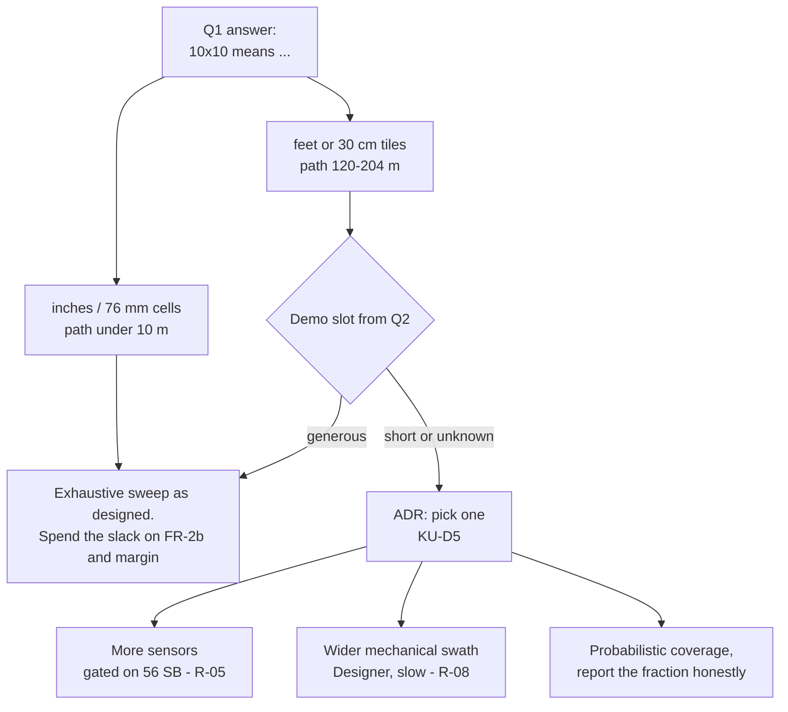

# Risk Register

**Type:** ACTIVE-SPEC (living register) · **Created:** 2026-08-25 · **Horizon:** Demo Day 10 SEP, Intro Report 18 SEP
**Companions:** [known-unknowns.md](./known-unknowns.md) · [conops.md](./conops.md) ·
[requirements-traceability.md](./requirements-traceability.md) · [verification-plan.md](./verification-plan.md) ·
[2026-08-25-coverage-strategy-trade-study.md](./2026-08-25-coverage-strategy-trade-study.md)

Risks specific to **this** project — a four-person SYS 301 team, five remaining class sessions with the
hardware, 56 Schrute Bucks, a hub that has never been connected, and a one-sentence verbal mission. No
generic "requirements may change" entries; every row below is traceable to something in this repo.

**Relationship to the other registers.** [known-unknowns.md](./known-unknowns.md) is what we *do not
know*; many of those unknowns are the **cause** of a risk here, and are cited by ID rather than
restated. [2026-08-25-sprint-1-walking-skeleton.md § Risks](./2026-08-25-sprint-1-walking-skeleton.md#risks)
holds R1–R8 scoped to **Sprint 1 only**; this file is the project-level register and supersedes them in
scope — the mapping is at the bottom so neither is silently duplicated.

---

## How this file lives

- **Every session:** scan the Trigger column. A trigger that has fired is not a risk any more — it is a
  problem, and the Contingency is what happens next, today, not "eventually".
- **New risk** → add a row with the next free ID, score it, and re-sort the summary table. **IDs are
  permanent and are never renumbered when the ranking changes** — only the Rank column moves.
- **Risk realized** → mark it `REALIZED`, record the date and what the contingency actually cost, and
  write the outcome once in a session record. A realized risk with an honest cost recorded is a
  *verification result* for the Intro Report; a quietly deleted row is a hole in the engineering record.
- **Risk retired** → mark it `CLOSED` with the reason (usually: the unknown behind it was answered). Do
  not delete it. The report's risk section needs the ones that did *not* happen and why.
- **Scores are re-judged, not recalculated.** When new information lands, change L or I and say in one
  line what changed it.

### Scoring

Likelihood and impact are **[JUDGED], not measured** — there is no historical data for a four-person
team's first robot. They exist to force ranking, and the ranking is the useful output, not the number.

| | Likelihood (L) | Impact (I) |
|---|---|---|
| **5** | Near certain unless we act | Mission or a graded deliverable fails |
| **4** | More likely than not | A milestone slips with no recovery time |
| **3** | Realistic | Costs a class session out of five, or a redesign |
| **2** | Possible | Costs hours and some Schrute Bucks |
| **1** | Unlikely | Absorbed without a plan change |

**Exposure = L × I.** Status: `OPEN` · `WATCHING` (trigger armed, mitigation running) · `REALIZED` ·
`CLOSED`.

---

## Ranked summary

| Rank | ID | Risk | L | I | Exp | Threatens | Owner | Status |
|---:|---|---|:-:|:-:|:-:|---|---|---|
| 1 | **R-01** | Exhaustive coverage does not fit the demo slot | 4 | 5 | **20** | Demo Day | Programmer → professor | `OPEN` |
| 2 | **R-02** | Lane drift makes the sweep miss mines a working detector would have seen | 4 | 4 | **16** | Demo Day | Programmer + Designer | `OPEN` |
| 3 | **R-03** | Only ~5 hardware sessions; one lost is 20 % of the schedule | 4 | 4 | **16** | M1, M2, Demo Day | Whole team | `WATCHING` |
| 4 | **R-04** | No deploy route from Ubuntu to the hub ever works | 3 | 5 | **15** | M1 and everything after | Programmer | `OPEN` |
| 5 | **R-05** | 56 SB does not cover the sensors the design needs | 3 | 4 | **12** | M2, M3 | Supplier | `OPEN` |
| 6 | **R-06** | Hub is SPIKE 2 generation; most online material is for the wrong API | 3 | 4 | **12** | M1, M2 | Programmer | `OPEN` |
| 7 | **R-07** | ModemManager corrupts first hub contact and it is misdiagnosed | 4 | 3 | **12** | M1 | Programmer | `WATCHING` |
| 8 | **R-08** | Role separation makes every physical iteration slow and expensive | 4 | 3 | **12** | M2, M3 | Whole team | `WATCHING` |
| 9 | **R-09** | The CSER `.docx` does not survive LibreOffice | 3 | 4 | **12** | Intro Report, 18 SEP | Programmer | `OPEN` |
| 10 | **R-10** | We built to the wrong reading of the verbal mission | 2 | 5 | **10** | Demo Day | Programmer → professor | `OPEN` |
| 11 | **R-11** | Hub firmware is changed — accepted update, or worse | 2 | 5 | **10** | The whole project | Programmer (plug/unplug), Builder | `WATCHING` |
| 12 | **R-12** | Sticky-note colours are not separable; FR-2b is unachievable | 3 | 3 | **9** | M2 | Programmer | `OPEN` |
| 13 | **R-13** | Journal days are missed — 80 points at −5/day | 3 | 3 | **9** | 15 SEP | Every member, individually | `WATCHING` |
| 14 | **R-14** | Hub flat, or the robot is not in the yellow box at class start | 3 | 3 | **9** | Any session | Builder | `WATCHING` |
| 15 | **R-15** | A teammate is absent and roles may not be reassigned | 2 | 4 | **8** | Any session | Whole team | `OPEN` |
| 16 | **R-16** | Observations get remembered instead of written down | 2 | 4 | **8** | Intro Report | Whoever measures | `WATCHING` |
| 17 | **R-17** | Adjacent notes are double-counted or merged; FR-3 fails | 2 | 3 | **6** | Demo Day | Programmer | `OPEN` |

---

## R-01 — Exhaustive coverage does not fit the demo slot

**L 4 × I 5 = 20 · Threatens: Demo Day (10 SEP) · Owner: Programmer, via a question to the professor**

A downward colour sensor traces a **line, not a swath**. To guarantee a 76 mm note is not missed, lanes
must be under 76 mm apart — under ~46 mm once realistic cross-track error is allowed. If "10×10" means
feet, that is **125–204 m of driving, 8–23 minutes**, before turn overhead, and classification pushes it
toward the upper half by capping traverse speed at ~160 mm/s.
Full arithmetic: [../findings/coverage-time-budget.md](../findings/coverage-time-budget.md).

- **Cause:** [KU-P1](./known-unknowns.md) (units unknown) × [KU-P2](./known-unknowns.md) (time limit
  unknown) × [KU-M4](./known-unknowns.md) (cross-track error assumed, not measured). It is a product of
  three unknowns, which is why its likelihood is high even though no single input is known to be bad.
- **Mitigation:** Ask Q1, Q2 and Q5 **in one written message, first** — they are free to ask and they
  gate the architecture. Meanwhile keep arena size, lane pitch, and speed as parameters in
  [config.py](../../src/config.py), never as constants, so an answer changes a value and not the
  design. Do **not** tune a sweep before the units are known; tuning for the wrong arena is a wasted
  class session.
- **Contingency (if it is 10 ft and the slot is short):** the options are costed and cross-tabulated
  against Q1 × Q2 in [2026-08-25-coverage-strategy-trade-study.md](./2026-08-25-coverage-strategy-trade-study.md),
  which exists as this risk's mitigation artifact — more colour sensors across the robot's width (money: R-05), a wider mechanical swath (the Designer's,
  and slow to iterate: R-08), or **deliberately probabilistic coverage with the coverage fraction
  reported honestly**. The third is the cheapest and is defensible in a systems-engineering report
  *provided we say so*, which is exactly what [../directives/honest-instrumentation.md](../directives/honest-instrumentation.md)
  requires. Which one is right depends on the scoring rule — "found all" and "found the most, fastest"
  choose differently.
- **Trigger — act when either fires:** the professor answers "feet" or gives a slot under ~10 minutes;
  **or** 1 SEP arrives with Q1 still unanswered, at which point we commit to the pessimistic reading and
  design for it rather than waiting.

## R-02 — Lane drift makes the sweep miss mines a working detector would have seen

**L 4 × I 4 = 16 · Threatens: Demo Day · Owner: Programmer (heading hold) + Designer (geometry)**

- **Cause:** heading error integrates into lateral error — **1° over a 1.2 m lane is already 21 mm**
  ([../research/detection-and-sweep-techniques.md](../research/detection-and-sweep-techniques.md)) — and
  is compounded by gyro drift, wheel slip on carpet, unequal effective wheel diameters, and encoder
  resolution. Every one of the inputs is currently an assumption: [KU-M3](./known-unknowns.md),
  [KU-M4](./known-unknowns.md), [KU-M8](./known-unknowns.md), [KU-M9](./known-unknowns.md).
- **Why it is nastier than R-01:** it fails **silently**. The robot completes a clean-looking run and
  reports a confident count that is simply wrong, and nothing on the hub says so.
- **Mitigation:** gyro heading hold with a per-lane re-square; set lane pitch from a **measured**
  cross-track error (UMBmark square-path), not from the assumed 15 mm; pre-run gyro health check, because
  a SPIKE gyro stuck at 0 from boot is a documented pathology.
- **Contingency:** reduce lane pitch — which costs run time and pushes straight back into R-01 — or
  re-reference off a boundary if [KU-P3](./known-unknowns.md) gives us one. If neither fits the slot,
  the count becomes an explicitly stated *lower bound with a coverage fraction*, not a claim of
  completeness.
- **Trigger:** the UMBmark run shows cross-track error above 15 mm, **or** any dry run's counted total
  varies between two passes over an identical layout.

## R-03 — Only about five hardware sessions remain; one lost is 20 % of the schedule

**L 4 × I 4 = 16 · Threatens: M1, M2, Demo Day · Owner: whole team · Status `WATCHING`**

- **Cause:** 25, 27 AUG · 1, 3, 8 SEP, demo on the 10th. Physical assembly, purchases, and robot
  operation may only happen in class with roles enforced, and a lost session **cannot be made up by
  working harder at home**.
- **Mitigation:** every hub session runs a **written runbook**, never improvisation
  ([../runbooks/INDEX.md](../runbooks/INDEX.md)). Everything that does not need the hub —
  `src/` logic, its test floor, host setup, all analysis — is done off-hardware so class time
  buys only things class time can buy ([ADR-0002](../decisions/0002-split-mission-logic-from-hub-io.md)).
  Batch iterations: deploy once, run the whole sequence, observe everything, then edit.
- **Contingency:** cut scope to something demonstrably working — presence detection and a count over a
  smaller area — and state the reduction as a deliberate engineering decision with its reason, which
  scores better in a systems-engineering report than an ambitious robot that did not run.
- **Trigger:** any session that ends without the written observable its plan named. That is the signal
  to re-plan the next one, not to hope.

## R-04 — No deploy route from Ubuntu to the hub ever works

**L 3 × I 5 = 15 · Threatens: M1 and everything downstream · Owner: Programmer**

- **Cause:** LEGO publishes no Linux desktop app — Windows, macOS, iPad, Android, Chromebook only. Our
  only host is native Ubuntu 22.04. Every hardware result in the project sits behind this one step, and
  it has never been attempted ([../research/spike-prime-linux-toolchain.md](../research/spike-prime-linux-toolchain.md),
  [KU-D1](./known-unknowns.md)).
- **Mitigation:** the Sprint 1 walking skeleton exists precisely to fail this **fast, on 27 AUG**, while
  there is still time to switch routes; the route ADR must name a **primary and a fallback** before the
  session that depends on it. google-chrome is installed, so the WebSerial path is available without a
  new install.
- **Contingency:** deploy from a teammate's Windows/macOS machine or a Chromebook — the Programmer still
  authors everything here, and only the upload moves. That route runs the LEGO app against our hub, which
  is exactly where the non-dismissible Hub OS update prompt lives (**R-11**): identify the Hub OS first and
  brief whoever holds the machine that the prompt is refused, not accepted. **The forbidden answer is Pybricks**: it is the
  best-supported Linux route and it replaces the hub's firmware, so it will be re-proposed by every
  tutorial we read and is permanently blacklisted ([ADR-0001](../decisions/0001-stock-lego-firmware-only.md)).
- **Trigger:** 27 AUG ends without a file having reached the hub.

## R-05 — 56 Schrute Bucks does not cover the sensors the design needs

**L 3 × I 4 = 12 · Threatens: M2, M3 · Owner: Supplier**

- **Cause:** the ledger shows **no sensor owned** — no colour sensor, no distance sensor, no mounting
  blocks, no axles ([../../inventory.py](../../inventory.py)). Store prices may change (RR-5) and are
  currently unknown to us ([KU-T5](./known-unknowns.md)). Meanwhile R-01's best contingency is *more
  sensors*, R-02 may want a boundary reference, and [KU-P3](./known-unknowns.md) may require a distance
  sensor. Sell-back returns 90 % rounded down, so a wrong purchase is a permanent ~10 % loss.
- **Mitigation:** buy against a **demonstrated** need, never speculation — the trade study demonstrates the need for the *first* colour sensor (it is required under every cell of its Q1 × Q2 table) and defers the 2nd and 3rd to the answers ([2026-08-25-coverage-strategy-trade-study.md § 1](./2026-08-25-coverage-strategy-trade-study.md), [KU-D4](./known-unknowns.md)). Settle sensor mounting geometry
  *before* the Supplier buys mounting blocks ([KU-D3](./known-unknowns.md)). Get real prices from the
  Supplier before committing to any design that assumes a second sensor. Check the yellow box first
  ([KU-T4](./known-unknowns.md)) — the kit may already supply one.
- **Contingency:** single-sensor design with a narrower arena or probabilistic coverage; use the hub's
  own gyro and motor encoders in place of a purchased sensor wherever possible, since they are free.
- **Trigger:** the Supplier's price report shows the design's sensor set costing more than **46 SB**
  (56 minus a 10 SB reserve for meeting bills and role-violation penalties, which come out of the same
  budget).

## R-06 — The hub is the SPIKE 2 generation and most online material is for the wrong API

**L 3 × I 4 = 12 · Threatens: M1, M2 · Owner: Programmer**

- **Cause:** `from spike import PrimeHub` (SPIKE 2) and `import motor` / `from hub import port` /
  `import runloop` (SPIKE 3) are mutually incompatible, and the generation on our unit is
  [KU-M1](./known-unknowns.md) — unknown, because the hub has never been connected. Most tutorials
  online target the obsolete generation, and code written against the wrong one **fails in a way that
  reads like a hardware fault**, which is how a class session gets burned.
- **Mitigation:** read-only identification **before any hub code is written**
  ([../runbooks/hub-identification.md](../runbooks/hub-identification.md)), recording the version string
  verbatim. Every external source is checked for which generation it targets before it is believed.
  `src/` imports nothing hub-specific, so the blast radius is confined to `src/`.
- **Contingency:** rewrite the adapter only — the mission logic and its tests are unaffected by design.
  **Never** resolve this by updating the hub (see R-11).
- **Trigger:** the identification session returns a SPIKE 2 version string, or returns nothing at all.

## R-07 — ModemManager corrupts first hub contact and the team misdiagnoses it

**L 4 × I 3 = 12 · Threatens: M1 · Owner: Programmer · Status `WATCHING`**

- **Cause:** ModemManager is **`active` and `enabled` on this host — measured, not assumed**
  ([../findings/host-environment.md](../findings/host-environment.md)). It probes newly appearing
  `/dev/ttyACM*` devices with AT commands, which injects garbage into the hub's serial stream. Likelihood
  is 4 because the mechanism is confirmed present; only the timing is uncertain.
- **Why the impact is bigger than "one bad session":** a garbled first connection looks exactly like
  "Linux doesn't work with LEGO", which sends the team down a dead end and straight into R-04's
  contingency for no reason.
- **Mitigation:** `scripts/setup-host.sh` neutralizes it **before the hub is ever plugged in** —
  idempotent, and reporting what it changed versus what was already in place. **The script does not exist
  yet** — it is an open M1 item ([../roadmap.md](../roadmap.md)), so until it is written this mitigation is
  planned, not in place.
- **Contingency:** if the hub is plugged in first and the session looks broken, stop; do not conclude
  anything about the hub. Disable ModemManager, unplug, replug, check `dmesg`, retry.
- **Trigger:** anyone reaches for the USB cable before `setup-host.sh` has run on this machine.

## R-08 — Role separation makes every physical iteration slow and expensive

**L 4 × I 3 = 12 · Threatens: M2, M3 · Owner: whole team · Status `WATCHING`**

- **Cause:** the course rules, enforced at **−2 SB per violation**. The Programmer may not touch the
  robot except to plug and unplug; the Builder is the only operator; the Designer may not touch supplies;
  the Supplier may not touch supplies again after buying them
  ([../course/team/roles.md](../course/team/roles.md)). A one-character fix costs an edit, a redeploy, a
  handoff, and a Builder-run test — and the tempting shortcut costs money out of the same 56 SB that
  buys sensors (R-05).
- **Mitigation:** fixed, rehearsed choreography rather than re-deriving who does what each time. Batch
  iterations. **Instrument the hub so a run is diagnosable from across the room** — a matrix character
  per state and a speaker cue — so the Builder can report what happened without the Programmer touching
  anything.
- **Contingency:** accept the tempo and plan around it; budget class time in handoffs, not in edits.
  Never "just adjust it myself" — the penalty is larger than the delay.
- **Trigger:** any change that needs more than two handoffs to alter one number. That is a signal to
  make the number run-time configurable instead.

## R-09 — The CSER `.docx` does not survive LibreOffice

**L 3 × I 4 = 12 · Threatens: the Intro Report, 18 SEP · Owner: Programmer**

- **Cause:** the required template carries 20 `Els-*` paragraph styles, a 192 × 262 mm trim, two WMF
  images and an OLE equation object — the objects most likely to be mangled by a non-Word editor — and
  our only office suite is LibreOffice 7.3.7.2 ([../course/report/INDEX.md](../course/report/INDEX.md),
  [KU-M12](./known-unknowns.md)). The instructor probably grades it in Word, where our file would look
  wrong to them and fine to us.
- **Mitigation:** run the scripted round-trip test **now**. It takes about 15 minutes, the exact commands
  already exist, and the result is recorded as a finding with the LibreOffice version and date.
- **Contingency:** final assembly on a machine with real Word (a teammate's or a lab's), or Word for the
  web in the installed Chrome; draft everything in markdown here so the Word session is one
  paste-and-style pass rather than authoring. If neither is available: LibreOffice plus a **visual diff
  of the exported PDF** against `../course/source-material/cser_template_cser2022 (7).pdf` before submitting.
- **Trigger:** the style, page-size, or media diff comes back non-empty — or 10 SEP arrives with the test
  still not run.

## R-10 — We built to the wrong reading of the verbal mission

**L 2 × I 5 = 10 · Threatens: Demo Day · Owner: Programmer, via a question to the professor**

- **Cause:** the requirement of record is one sentence, delivered verbally, and "finds" is undefined
  ([KU-P4](./known-unknowns.md)). If it means *locations* or *retrieval* rather than a count, a
  substantial part of the build is aimed at the wrong deliverable.
- **Mitigation:** build to the **narrowest defensible reading** and parameterize; keep target *mapping*
  parked on the roadmap FRONTIER rather than half-built; tag everything derived from the guess
  `[ASSUMED]` at its point of use, so the blast radius is visible before it detonates.
- **Contingency:** counting is a strict subset of mapping and of stop-on-target, so the sweep and
  detection layers survive any of the answers — only the reporting layer (FR-4) is rewritten. Retrieval
  would be a mechanical redesign and would have to be negotiated on scope, not absorbed.
- **Trigger:** the professor's answer to Q4 is anything other than "a count".

## R-11 — The hub's firmware is changed

**L 2 × I 5 = 10 · Threatens: the whole project · Owner: Programmer (plug/unplug), Builder (operation) · Status `WATCHING`**

- **Cause:** the hub is **shared course equipment** and there may be no spare
  ([KU-P11](./known-unknowns.md)). LEGO's own apps prompt for a Hub OS update in a way the vendor
  describes as not disableable; a DFU, format, or factory reset is irreversible; and the best-supported
  Linux toolchain is the one that replaces LEGO firmware entirely. **The most convenient answer is the
  forbidden one**, and it will keep being suggested by every tutorial.
- **Mitigation:** permanent blacklist ([ADR-0001](../decisions/0001-stock-lego-firmware-only.md),
  [../scope.md](../scope.md), `CLAUDE.md`). Identification is read-only. An update prompt is **never**
  accepted unattended — it stops the session and becomes an operator decision recorded as an ADR.
- **Contingency:** if it happens anyway, stop all work, tell the instructor immediately, record exactly
  what was done and when, and do not attempt a repair that could compound it. A downgrade path exists
  and is a **one-way, last-resort** action that LEGO and community guidance caution may damage the hub
  ([../research/spike-prime-linux-toolchain.md](../research/spike-prime-linux-toolchain.md)).
- **Trigger:** any dialog mentioning an update, a firmware version, or "hub not supported". Stop there.

## R-12 — The sticky-note colours are not separable; FR-2b is unachievable

**L 3 × I 3 = 9 · Threatens: M2 · Owner: Programmer**

- **Cause:** sticky notes are **matte and pastel** — the worst case for the sensor's built-in colour ID —
  and the classification margin depends on the floor's own chromaticity, the robot's moving shadow, and
  mains lighting flicker. We have never seen the real pack ([KU-M7](./known-unknowns.md)).
- **Mitigation:** a **go/no-go bench separability test on the real notes and the real floor, before any
  classification code is written** ([../research/color-discrimination.md](../research/color-discrimination.md) §8).
  Architecturally, classification is a layer **on top of** presence detection and never a prerequisite
  for counting — so this risk cannot take the count down with it.
- **Contingency:** drop to presence detection and report unclassifiable readings as `UNKNOWN` rather than
  forcing a class (already FR-2b's own wording). Record the separability measurement as a **verification
  result** in the report — "we measured it and it did not separate" is a legitimate finding, and it also
  buys back the traverse speed that R-01 needs.
- **Trigger:** pairwise separation in the bench test falls below the classifier's margin, **or**
  [KU-P5](./known-unknowns.md) comes back "yellow only" — in which case the requirement simply retires.

## R-13 — Journal days are missed

**L 3 × I 3 = 9 · Threatens: 15 SEP · Owner: every member, individually · Status `WATCHING`**

- **Cause:** 80 points, **−5 per missing day**, one entry per person per class day. It is the cheapest
  guaranteed score in the project and the easiest to lose to a busy session, because nothing blocks on it
  and nobody notices on the day ([../course/journal/INDEX.md](../course/journal/INDEX.md)).
- **Mitigation:** write the entry **on the day**, from the session record, using the existing template.
  Journal writing is explicitly part of closing a session, not an afterthought.
- **Contingency:** **none.** Those points are unrecoverable once the day passes — which is exactly why
  the trigger is same-day and the mitigation is trivial.
- **Trigger:** a class day ends with no entry written.

## R-14 — Hub flat, or the robot is not in the yellow box at class start

**L 3 × I 3 = 9 · Threatens: any session · Owner: Builder · Status `WATCHING`**

- **Cause:** supplies live in the team's yellow box between classes; a flat battery or a missing part
  costs an entire session out of five (R-03). We also do not yet know what battery level is sufficient
  for a full sweep ([KU-M11](./known-unknowns.md)), and motor speed sags as the battery does — which
  shifts the traverse speed the detector's timing assumes.
- **Mitigation:** the Builder charges the hub and confirms the box contents at the **end** of each
  session, not the start of the next one. Battery is read from the hub and **recorded, not guessed**.
- **Contingency:** reorder the session to host-side work that needs no hub; run tethered if the hub will
  hold a session but not a standalone run, accepting that TR-3 (standalone) goes untested that day.
- **Trigger:** battery below the level measured during dry runs, or any item missing at session close.

## R-15 — A teammate is absent and roles may not be reassigned

**L 2 × I 4 = 8 · Threatens: any session · Owner: whole team**

- **Cause:** the course rule is explicit — *if a team member is late or absent, you may NOT change
  roles*. **A missing Builder means nobody in the room may operate the robot**, and a missing Supplier
  means nothing can be bought. Prolonged absence goes through the professor as an exception.
- **Mitigation:** keep the written record good enough that a session can be run by whoever is present
  from the runbook alone; front-load purchases so a Supplier absence is not a blocker; do not schedule
  the only chance at a critical measurement into a single session.
- **Contingency:** convert the session to work the present roles may legally do, record why, and raise a
  prolonged absence with the professor rather than quietly working around it.
- **Trigger:** any absence on a session where that role's action is on the critical path.

## R-16 — Observations get remembered instead of written down

**L 2 × I 4 = 8 · Threatens: the Intro Report · Owner: whoever takes the measurement · Status `WATCHING`**

- **Cause:** the report is written **from this repo** on 18 SEP. A reflected-light number without its
  surface, sensor height, lighting, and date is unusable three weeks later, and re-taking it costs class
  time that R-03 says we do not have.
- **Mitigation:** every plan item names **what gets written and where**. Measurements go to
  `docs/findings/` with units and conditions, on the day
  ([../directives/documentation-discipline.md](../directives/documentation-discipline.md)).
- **Contingency:** if a number's conditions were not recorded, it is treated as **UNKNOWN and re-taken**
   — never reconstructed from memory and never presented in the report as if it had been.
- **Trigger:** any number appearing in a doc without its units, conditions, or date.

## R-17 — Adjacent notes are double-counted or merged; FR-3 fails

**L 2 × I 3 = 6 · Threatens: Demo Day · Owner: Programmer**

- **Cause:** FR-3 requires each target counted **exactly once**. Two notes touching read as one wide
  event; one note clipped at a glancing chord across two lanes reads as two. Whether the layout even
  allows adjacency is [KU-P6](./known-unknowns.md).
- **Mitigation:** the event-width gate already in [config.py](../../src/config.py) — too narrow
  is noise, too wide is a seam or two merged notes — plus hysteresis and a dwell requirement on state
  changes. Ask Q6 so the gate is tuned to a real layout rather than a guessed one.
- **Contingency:** report the count **with** the number of out-of-gate events rather than silently
  folding them in, so the failure is visible in the result instead of hidden inside it.
- **Trigger:** the professor confirms notes may touch, **or** a dry run produces an event wider than
  `MAX_EVENT_SAMPLES`.

---

## What I would spend the next hour on

**R-01 — and specifically, sending the professor Q1, Q2 and Q5 in one written message, then spending
what is left of the hour on the fallback trade study before the answer arrives.**

Why that and not something else:

- **Highest exposure, and the only top-ranked risk that is free to reduce.** R-02, R-04 and R-06 all need
  the hub, which cannot be reached from a keyboard right now; they are already scheduled for 27 AUG and
  the hour cannot advance them. R-01's cheapest mitigation is a question, and questions cost nothing but
  the writing.
- **It changes the architecture, not the tuning.** Every other open item alters a value. If "10×10" is
  feet and the slot is short, exhaustive coverage is arithmetically off the table and we need a different
  robot — more sensors, a wider swath, or a deliberate decision to sweep probabilistically. That is a
  purchase decision (R-05) and possibly a mechanical one (R-08), and both have long lead times measured
  in class sessions we do not have.
- **The deadline for the answer is earlier than it looks.** With roughly five hardware sessions left
  (R-03), a design change decided on 8 SEP cannot be built. The last useful moment for this answer is
  around 1 SEP, which means the question has to go out now to survive a slow reply.
- **The second half of the hour is not idle waiting.** The costed options already exist in
  [2026-08-25-coverage-strategy-trade-study.md](./2026-08-25-coverage-strategy-trade-study.md); the hour
  ends by pulling its standing pre-answer recommendation to the **Supplier** so the sensor decision is
  staged rather than improvised on 1 SEP, and by checking its decision table against the current
  56 SB balance. That work is not wasted in any branch: if the answer is generous, the trade study
  becomes the report's design-alternatives section.

The honest caveat: **R-02 is the one most likely to be underestimated here.** It fails silently, its
likelihood is judged rather than measured, and unlike R-01 no single question can close it — only a
UMBmark run on the real floor can. It is the first thing to attack once the hub is in hand.

---

## Mapping to the Sprint 1 plan's risks

[2026-08-25-sprint-1-walking-skeleton.md § Risks](./2026-08-25-sprint-1-walking-skeleton.md#risks)
scores R1–R8 for **Sprint 1 only**. They are not restated above; this is the correspondence, so neither
file drifts from the other.

| Sprint 1 | Here | Note |
|---|---|---|
| R1 mission unknown | **R-10** (+ [KU-P1…P6](./known-unknowns.md)) | Project-level, and split: the *mission reading* is R-10, the *coverage consequence* is R-01 |
| R2 Hub OS generation | **R-06** | Same risk, wider horizon |
| R3 no Linux support | **R-04** | Same |
| R4 five class sessions | **R-03** | Same |
| R5 role separation | **R-08** | Same |
| R6 shared-equipment firmware risk | **R-11** | Same |
| R7 battery / yellow box | **R-14** | Same |
| R8 observations not written down | **R-16** | Same |
| — | **R-01, R-02, R-05, R-09, R-12, R-13, R-15, R-17** | New here: these are beyond Sprint 1's horizon |

When the Sprint 1 plan is archived, this file carries the whole set forward.

---

## Revision History

| Date | Change | By |
|---|---|---|
| 2026-08-25 | Created. 17 risks scored and ranked; Sprint 1's R1–R8 mapped in rather than duplicated. All L/I values are `[JUDGED]` — no historical data exists for this team. | Claude |
| 2026-08-25 | Adversarial audit: R-03 status aligned with the summary table; R-04 contingency now flags the Hub OS update prompt on a teammate's machine; R-05 mitigation reconciled with the trade study's standing recommendation; R-07 no longer implies `scripts/setup-host.sh` exists; R-11's downgrade caution re-attributed; R-01 diagram range corrected to 120–204 m. | Claude (audit) |
