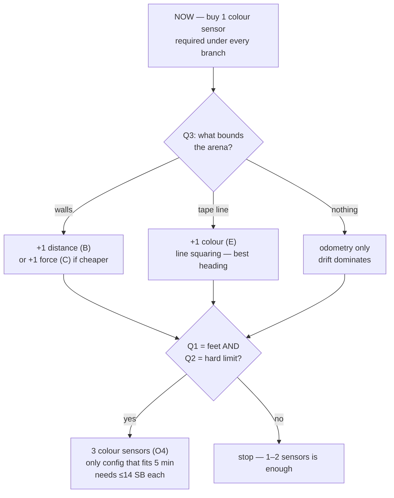

# Sensor Decision Matrix — one table, count and orientation together

**Type:** ACTIVE-SPEC · **Created:** 2026-08-26 · **Audience:** Supplier and Designer, in class

The operator asked for sensor **count and orientation tracked together, so we can budget for it.** Four
documents each answer part of that. This is the single table that joins them. It **cites** them; it does
not restate their reasoning or re-derive their arithmetic — follow a link when you need the why.

| Source | What it settles |
|---|---|
| [sensor-suite-architecture.md](./sensor-suite-architecture.md) | Which sensor *mix*, what each unlocks, the port budget, the decision tree |
| [../research/sensor-mounting-geometry.md](../research/sensor-mounting-geometry.md) | Where each sensor physically goes, and how hard it is to build |
| [../research/spin-scan-localization.md](../research/spin-scan-localization.md) | Whether spinning buys localization (mostly no — two pieces survive) |
| [purchasing-strategy.md](./purchasing-strategy.md) | The reserve, the buy rule, the sell-back asymmetry |
| [2026-08-25-coverage-strategy-trade-study.md](./2026-08-25-coverage-strategy-trade-study.md) | How many *colour* sensors the coverage time budget needs |

---

## The answer to the question as asked

> *"Do we need 1 colour sensor and 2 distance sensors?"*

**No.** That configuration is `I` in
[sensor-suite-architecture.md § 3](./sensor-suite-architecture.md), and the study's verdict is blunt:

> *"The branch that is never taken: two distance sensors. There is no answer to Q1, Q2, Q3 or Q5 that
> makes config I or J the right buy."*

The reason is that the second distance sensor **buys no heading** — the geometry is in
[§ 5.2](./sensor-suite-architecture.md), and squaring against a *line* with a colour sensor beats two
distance sensors by a wide margin. The intuition that navigation means distance sensors is the thing this
project's research most consistently contradicts.

---

## The matrix

Ports: **6 total, 2 spent on motors, 4 free.** Prices are **UNKNOWN and change daily** — `Pc` = colour,
`Pd` = distance, `Pf` = force; the Supplier checks on the day and records what was *paid* in
[`inventory.py`](../../inventory.py). Reserve is **14 SB**, so **42 SB is spendable**
([purchasing-strategy.md § 6.2](./purchasing-strategy.md)).

| Config | Sensors | Ports used / free | Cost | Orientation required | Build difficulty | What it unlocks | Gated on |
|---|---|---|---|---|---|---|---|
| **A** | 1C | 3 / 3 | `Pc` | Downward, ~16 mm standoff, close to the drive axle | Low–moderate (rigid mount, ~6–10 parts) | Detection + counting. The baseline everything else builds on | — **buy now** |
| **B** | 1C + 1D | 4 / 2 | `Pc+Pd` | + forward-facing, raised, tilted off the floor | Moderate | Wall detection, per-lane re-square, obstacle stop | **Q3 = walls** |
| **C** | 1C + 1F | 4 / 2 | `Pc+Pf` | + bumper linkage to the plunger | Moderate–high (linkage is fiddly) | Contact boundary. Cheap if the border is rigid | **Q3 = walls**, and only if `Pf < Pd` |
| **E** | 2C wide baseline | 4 / 2 | `2·Pc` | Both downward; spacing sets what it does | Moderate | Line squaring on a tape border **or** double swath — [not both](./sensor-suite-architecture.md) | **Q3 = tape line** |
| **I** | 1C + 2D | 5 / 1 | `Pc+2·Pd` | Forward + side | High | Corner detection, corridor keeping — **no heading** | ❌ never |
| **O4** | 3C across width | 5 / 1 | `3·Pc` | Three downward, at lane pitch | High — physical floor is **24 mm** centre-to-centre | Triples swath. The only config that clears a 5-min limit at 10 ft | **Q1 = feet AND Q2 = hard limit** |

**Affordability screen:** three sensors fit only at ≤ 14 SB each, four only at ≤ 10 SB. Above 14 SB per
sensor the three-sensor rows breach the reserve floor and the real choice collapses to **A, B, C, E**
([sensor-suite-architecture.md § 3](./sensor-suite-architecture.md)).

---

## What is unconditional

**Buy one Colour Sensor 45605 now**, plus whatever mounting blocks and axles the Designer's mount needs.

It is required under every cell above, it unblocks the two measurements everything else depends on
(achieved loop rate, sensor spot size — [bench-measurement-plan.md](./bench-measurement-plan.md)), and
sell-back costs 10–18.2% if we are wrong. That band is worse than the "~10%" it looks like, because
rounding is per-item and **11 SB is the worst case** — you pay 11 and get 9 back
([purchasing-strategy.md § 3](./purchasing-strategy.md)).

Everything else waits for an answer.

---

## Orientation, because it drives mounting cost

The mount is bought parts and Builder time, and we own **no mounting blocks or axles**.
Full geometry and the per-role difficulty table:
[sensor-mounting-geometry.md § 6](../research/sensor-mounting-geometry.md).

The three constraints that actually bite:

- **Downward colour wants ~16 mm standoff and a position close to the drive axle.** Distance from the
  axle couples robot pitch into standoff *and* costs heading error on turns — two independent arguments
  for the same placement.
- **Three colour sensors have a physical floor of 24 mm centre-to-centre.** If the lane pitch the
  coverage design needs is tighter than the sensors physically fit, O4 is not buildable at that pitch —
  a constraint that lives in the *mount*, not the algorithm.
- **Rigid vs floating mount** is a real choice on carpet: rigid is ~6–10 parts and simple; floating
  follows an uneven surface but costs parts and build time.
- **You cannot tilt a sensor a few degrees.** A rigidly double-pinned beam only reaches Pythagorean-triple
  angles (36.87°, 28.07°, 22.62°, 16.26°) and the set's angle connectors are 0/90/135/180°. **Raise the
  distance sensor, don't angle it** — and the floor echoes back at slant range `1.74h`, so the boundary
  threshold must satisfy `h > 0.57 × threshold` or the floor spoofs it. This corrected an
  earlier recommendation of "tilt up 5–10°", which is not buildable.

**Before buying a second distance sensor**, run measurement **MG-6** — ~15 minutes, no hub needed. The
two-sensor heading trick works geometrically, but it needs a **one-off differential zero against a square
wall**: a per-unit bias does *not* cancel in the difference, and ±20 mm each way at a 120 mm baseline is a
fixed **19° heading error that no repeatability measurement would reveal**.

---

## What spinning adds

[spin-scan-localization.md](../research/spin-scan-localization.md) assessed turning the robot into a
scanner. Two pieces survived and neither needs a purchase:

- **Forward range reads during a lane** — nearly free, and bounds *along-track* position, which a wall
  bump does not. Requires config B.
- **One run-start spin-scan** — a cross-check on arena size and a pose fix. Not a way to discover an
  unknown arena; the centre window it needs cannot be reached without already knowing the size.

Rejected: per-lane spin re-squaring (~±3.5° against the mechanical bump's 0.6°, for 15–25% of the run).

---

## Open

Everything above is conditional on answers we do not have — [questions-for-the-professor.md](./questions-for-the-professor.md).
**Q3 (boundary type) is the one that decides the second purchase**, and it is currently ranked third on
the ask list behind Q1 and Q2. That ordering is right — Q1 and Q2 decide whether we need *three* colour
sensors, which is the larger commitment — but Q3 should be asked in the same conversation.

No sensor price has ever been observed. The only prices this project has recorded are 10 SB (motor) and
7 SB (wheel), both on 25 AUG ([`inventory.py`](../../inventory.py)).
