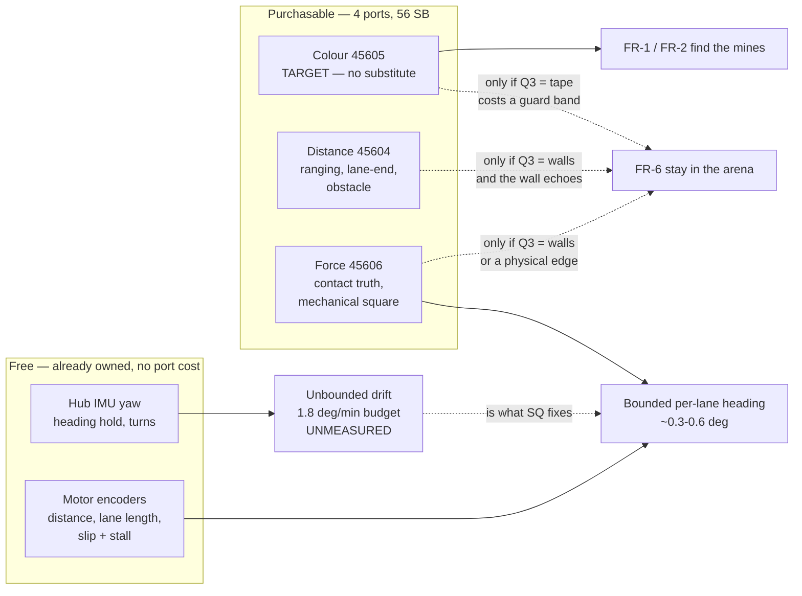
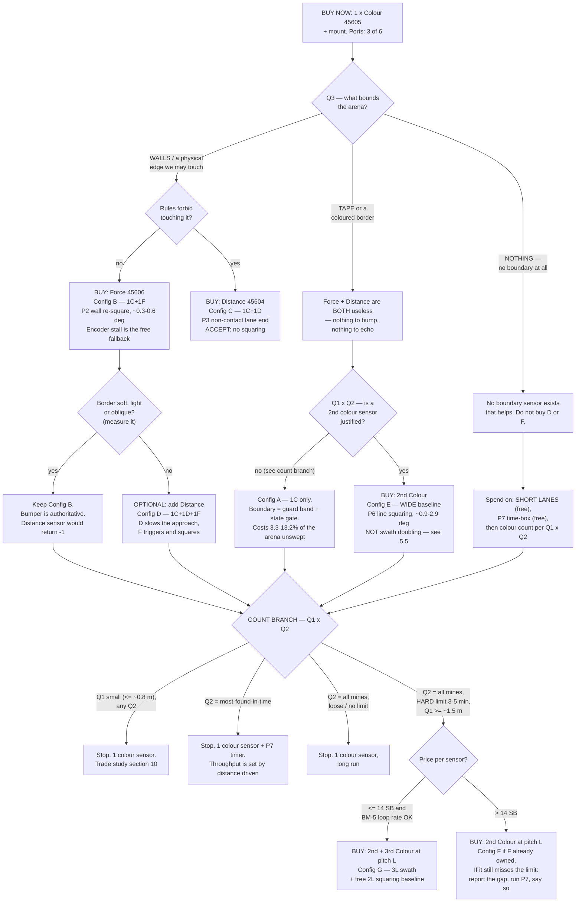

# Sensor Suite Architecture — what mix of sensor *types* the mission needs

**Type:** ACTIVE-SPEC · **Created:** 2026-08-26 · **Owner role:** Designer (build), Supplier (buy),
Programmer (this document)

**The operator's question:** *"do we need 1 colour sensor and 2 distance sensors? are there movement
patterns that are more thorough but need more sensors?"*

**Short answer, up front.** No — **1 colour + 2 distance is not the right suite under any branch of the
open questions**, and a second distance sensor is the single worst marginal Schrute Buck in the
enumeration below ([§5.2](#52-the-second-distance-sensor-what-it-does-and-does-not-buy)). Yes, there are
more thorough patterns that need more sensors — but the extra sensor they need is a **force bumper** or a
**second/third colour sensor**, not a second distance sensor. And the thing that decides *which* is
**Q3 (what bounds the arena)**, which is not answered yet.

**The one structural insight this document adds:**

> **Q3 chooses the sensor *type mix*. Q1 × Q2 choose the colour-sensor *count*.**
> They are separable decisions and can be bought in that order.

The count question is already settled by
[2026-08-25-coverage-strategy-trade-study.md](./2026-08-25-coverage-strategy-trade-study.md) — this
document does not restate or re-derive it, and every "how many colour sensors" cell below is that study's
answer, cited.

---

## 1. What each sensor type can actually do for *this* mission

Specs are quoted from [../research/detection-and-sweep-techniques.md § Verified hardware facts](../research/detection-and-sweep-techniques.md#verified-hardware-facts),
which cites the LEGO techspec PDFs. Nothing here is measured on our hardware — **we own no sensors**
([`inventory.py`](../../inventory.py): 56 SB, 2 motors + 2 wheels).

### 1.1 Colour Sensor 45605 — the only target detector, and there is no substitute

| Capability | What it gives the mission |
|---|---|
| `reflection()` — 100 Hz, 4000 K white illuminant, optimal height 16 mm | **FR-1/FR-2 presence detection.** Threshold on *difference from floor*, not an absolute number |
| `color()` — 8 LEGO colours + "no object" | **FR-2b classification.** Worst case for matte pastel notes; gated by BM-0(b) ([bench-measurement-plan.md](./bench-measurement-plan.md)) |
| Same sensor, pointed down, crossing a tape line | Boundary detection **if** Q3 = tape — see the cost below |

**Neither of the other two sensors can detect a flat sticky note.** The force sensor's plunger travels
8 mm and triggers at 1 mm ± 0.5 mm against 0.5–1.0 N — a sheet of paper on the floor will never move it.
The distance sensor is a forward beam with ±20 mm accuracy and a 50 mm blind zone; note thickness is
~0.1 mm. So **FR-1 and FR-2 hard-depend on the 45605 and on nothing else**, which is why the standing "buy one
colour sensor now" recommendation already exists in
[2026-08-25-coverage-strategy-trade-study.md § 1](./2026-08-25-coverage-strategy-trade-study.md#1-read-this-cell-and-start-building)
and [verification-plan.md § 3](./verification-plan.md#3-gate-1--colour-separability-gono-go-run-this-before-any-sweep-tuning).
That is not re-litigated here.

#### Double duty as a boundary-line detector — possible, and it is not free

Three costs, in order of how much they hurt:

1. **Conflation.** In presence-only mode a tape line and a yellow note are the same event: *not floor*.
   Every lane end produces a false mine. There are only three fixes and all cost something:
   - **Classify the tape colour.** Needs FR-2b to survive BM-0(b) — the very thing that may be withdrawn.
   - **Suppress detection in a guard band** of width `g` at each lane end. This is the honest default, and
     it converts the perimeter into a **coverage hole**:

     | Arena side `S` | Guard `g` = 50 mm | Unswept perimeter band | Fraction of arena |
     |---|---|---|---|
     | 0.76 m | 2 × 50 mm strips | 0.076 m² of 0.578 m² | **13.2 %** |
     | 1.52 m | " | 0.152 m² of 2.31 m² | **6.6 %** |
     | 3.05 m | " | 0.305 m² of 9.30 m² | **3.3 %** |

     Derived arithmetic (`2·g·S / S²`), not measured. **The guard band costs proportionally *more* in a
     small arena** — the opposite of the usual intuition — and it deletes exactly the region where the
     conops "mine on the boundary" scenario puts a mine ([conops.md](./conops.md)).
   - **State-gate it:** any detection while the sweep state machine is *expecting* a boundary is a
     boundary. Cheapest in Schrute Bucks, and it fails silently when odometry error means the robot is not
     where the state machine thinks it is — i.e. it fails exactly when it is needed.

2. **Stopping distance dictates the sensor's forward offset.** The sensor must see the line while the
   *wheels* are still inside. Required forward offset `x > v·t_react + v²/(2a)`. We know `v` (250 mm/s
   presence-only) and `t_react` ≥ one sample (10 ms at 100 Hz), but **`a` — the achievable braking
   deceleration on the real floor — has never been measured.** This is a new measurement, not an estimate
   ([§7](#7-what-must-be-measured-before-the-second-purchase)).

3. **A large forward offset hurts the sweep.** A sensor mounted far ahead of the drive axis swings wide
   through every lane-end turn, adding cross-track error at exactly the point where the pattern depends on
   it being small ([../research/detection-and-sweep-techniques.md § Mounting geometry](../research/detection-and-sweep-techniques.md#mounting-geometry)).

**Verdict:** viable, and it is the *only* boundary channel available if Q3 = tape. It is not a free
capability bolted onto a sensor we were buying anyway.

### 1.2 Distance Sensor 45604 — one fixed-axis beam, not a scanner

| Property | Official value |
|---|---|
| Technology / rate | Ultrasonic, 100 Hz |
| Normal range | **50–2000 mm, ±20 mm** |
| Fast-range mode | 50–300 mm, ±15 mm |
| Entrance angle | **±35°** cone (varies with distance) |
| Output resolution | 1 mm · returns **−1** when it cannot read |

The marketing page claims ±10 mm; the engineering sheet says ±20 mm. **Design to ±20 mm**
([../research/detection-and-sweep-techniques.md](../research/detection-and-sweep-techniques.md#distance-sensor-45604--techspecs-pdf)).

**What one can genuinely do:**

- **End-of-lane trigger** against a wall. Trigger at 100–150 mm, never at 50 mm — the blind zone is
  inherent to ultrasound (the transducer is still ringing).
- **Obstacle stop** — anything unexpected in the lane.
- **Coarse arena ranging** at run start: point down a lane, read the far wall, size the sweep. Useful
  precisely because Q1 is unanswered — but ±20 mm on a 3 m reading is 0.7 %, fine for choosing a lane
  count and useless for anything else.
- **Coarse pre-alignment** before a mechanical square.

**Blind spots, stated honestly:**

- **Nothing inside 50 mm.** Blind for the last 50 mm before contact — the whole approach where a turn
  actually gets committed.
- **Soft or porous borders absorb the pulse.** Cardboard, cloth, foam, carpet. A classroom arena border is
  quite likely to be one of these. **`distance()` returns −1, not an exception, and −1 means "no boundary
  in range" — the robot drives straight out of the arena.** This is failure mode 7 in
  [../research/detection-and-sweep-techniques.md § Failure modes](../research/detection-and-sweep-techniques.md#failure-modes-to-expect-run-level).
- **Tilted flat surfaces are the worst case.** The ±35° figure is a cone of *emission*, not a promise of
  detection against an oblique wall.
- **Mounting height fights itself.** At ±35° a sensor `h` above the floor first illuminates the floor about
  `1.43·h` ahead, so keeping the floor out of the beam for 200 mm wants `h ≥ 140 mm` — tall and top-heavy
  on a small SPIKE chassis. Practical compromise: 60–80 mm, tilted up 5–10°.

**What it cannot do, in principle and not merely noisily: square the robot.** Detail and the derivation
are in [../research/motion-control-and-odometry.md § Re-squaring](../research/motion-control-and-odometry.md#re-squaring-against-a-reference);
the consequence for a *second* sensor is quantified in [§5.2](#52-the-second-distance-sensor-what-it-does-and-does-not-buy).

### 1.3 Force Sensor 45606 — argue it honestly, not by reflex

| Property | Official value |
|---|---|
| Rate | 100 Hz (1 kHz internal in peak mode) |
| Touch | zone 0–2 mm, threshold 1 mm ± 0.5 mm, **0.5–1.0 N ± 10 %**, binary |
| Force | zone 2–8 mm, 2.5–10 N, 0.1 N steps, ±0.65 N |
| Plunger travel | **8 mm total** — the entire mechanical budget for a bumper |

**The case for it.** For a *slow* robot it is the best boundary sensor we can buy, for one reason the
distance sensor cannot match: **a physical bumper cannot be fooled by a soft or angled border.** It is
ground truth. And it is the only purchasable route to the thing that actually governs coverage quality:

> **Mechanical squaring is the only adequate heading reference we can afford.** A flat contact face of
> width `w` seating against a wall with contact slop `δ` bounds residual heading at about `atan(δ/w)`:

| Contact face `w` | `δ` = 0.5 mm | `δ` = 1 mm | `δ` = 2 mm |
|---|---|---|---|
| 100 mm | 0.29° | **0.57°** | 1.15° |
| 150 mm | 0.19° | 0.38° | 0.76° |
| 200 mm | 0.14° | 0.29° | 0.57° |

Derived from the geometry in [../research/motion-control-and-odometry.md](../research/motion-control-and-odometry.md#with-walls-mechanically--the-only-adequate-reference);
**`δ` MUST BE MEASURED on the real chassis.** Compare against the budget that document derives: a 3.05 m
lane needs mean heading error under **0.28°**, a 1.2 m lane allows 0.72°, a 0.76 m lane allows 1.13°. So a
100 mm contact face squares well enough for a sub-metre arena at `δ` ≤ 1 mm (it only just misses at
`δ` = 2 mm), and a 150–200 mm face plus shorter lanes reaches the 10 ft case. **It is the best purchasable
squaring reference by a factor of 1.5–5× over two-colour-sensor line squaring ([§5.1](#51-two-colour-sensors-the-spacing-conflict-nobody-mentions))
and 14–57× over two distance sensors ([§5.2](#52-the-second-distance-sensor-what-it-does-and-does-not-buy))** —
and it is the only one that clears any of the three lane budgets.

**The case against it — and it is real.** *Encoder stall detection is free and does the same job on a
rigid wall.* We already own the encoders; inferring a stall from successive `relative_position()` reads
costs zero ports and zero Schrute Bucks. The force sensor earns its port only where stall detection
fails, which is:

- **Carpet.** The robot skids or climbs rather than stalling cleanly — and climbing corrupts the encoder
  count *and* defeats detection ([../research/detection-and-sweep-techniques.md § Re-squaring techniques](../research/detection-and-sweep-techniques.md#re-squaring-techniques-all-workable-on-stock-firmware)).
- **A light or non-rigid border** that moves before the drive stalls.
- **Seating gently.** Squaring wants the lowest power that still moves the robot; that is also the power at
  which a stall is hardest to distinguish from normal load. A bumper triggering at 0.5–1.0 N reads clean at
  exactly that power.

Plus two free extras: a **start button** the operator can reach, and **collision detection**.

**Design constraint, non-negotiable:** 8 mm of travel and a 1 mm trigger means the bumper must be a
**light, free-sliding assembly, not a rigid beam** — a stiff bumper triggers nothing and stalls the drive
instead. That is a Designer task with a real failure mode, not a bracket.

**Where it is worthless:** Q3 = tape, or Q3 = nothing. There is nothing to bump. This is the whole reason
the type mix is keyed on Q3.

### 1.4 The IMU and the encoders — free, already there, and they delete several purchases

| Free channel | What it makes unnecessary |
|---|---|
| Hub 6-axis IMU (yaw) | Any heading/compass purchase; heading hold on the straight legs; turn control; pick-up/tip detection. **It does not give absolute position, and LEGO publishes no drift figure at all** ([../research/motion-control-and-odometry.md § LEGO documents essentially nothing](../research/motion-control-and-odometry.md#lego-documents-essentially-nothing)) |
| Motor encoders (360 counts/rev, ±3°) | Along-track distance, lane length, arena width by driving it, lane-advance hop. **A distance sensor is not needed to measure how far we went.** Also slip detection (commanded vs achieved) and free stall detection on a rigid wall |

**Consequence that matters for the buy:** the only jobs left for a purchased sensor are (a) **see the
target**, (b) **know where the boundary is**, and (c) **re-zero heading against something physical**.
That is the entire shopping list. Anything a candidate sensor does that is not on it is already covered
for free.

**The gap the free channels leave:** gyro drift. The drift budget is **1.8 °/min** for a 3.05 m lane at
classification speed, and the two reported drift figures for this class of part are ~30 °/min and
~60 °/min — *17× to 33× over budget*, though neither is a measurement of our hub and one is UNVERIFIED
([../research/motion-control-and-odometry.md § How much drift can we tolerate](../research/motion-control-and-odometry.md#how-much-drift-can-we-tolerate)).
**This gap is the entire justification for spending money on a squaring reference.** If BM-9 measures our
hub's drift comfortably under budget, half of this document's recommendations get cheaper.

---

## 2. Sensing roles, as a picture

---

## 3. The port budget — 6 ports, 2 spent, 4 left

Prices are **UNKNOWN and change day to day**; the Supplier checks them in class on the day, and records
what was *paid* per line in [`inventory.py`](../../inventory.py) ([KU-T5](./known-unknowns.md)). Costs
below are parametric: `Pc` colour, `Pd` distance, `Pf` force.

The reserve floor is **14 SB**, derived from named liabilities in
[purchasing-strategy.md § 6.2](./purchasing-strategy.md#62-how-14-sb-is-derived) — that document explicitly
supersedes the round `[ASSUMED]` ~20 SB the trade study held back, and the 20 SB figure must not be reused
here in any case because it was sized to cover *mounting blocks, axles **and a boundary sensor***, which
would count the boundary sensor twice against a table whose whole subject is boundary sensors.

Sell-back is 90 % of the ***listed*** price, rounded down — **not** of what we paid, so with prices moving
daily the unwind value floats. The exact loss is `loss(P) = ceil(P/10)`: **10–18 % across a 10–25 SB band,
worst at `P` = 11 (18.2 %)**, not the ~10–13 % the trade study quoted
([purchasing-strategy.md § 3](./purchasing-strategy.md#3-the-rounding-asymmetry-worked-out) supersedes that
band). 1–3 SB in absolute terms either way, which is why buying early is cheap.

| # | Config | Ports used / free | Cost | Enables | Forecloses |
|---|---|---|---|---|---|
| **A** | **1C** | 3 / 3 | `Pc` | Target detection. Boustrophedon on pure odometry. Time-boxed run (O7) | Any per-lane re-square. Heading error accumulates over all lanes |
| **B** | **1C + 1F** | 4 / 2 | `Pc+Pf` | + **mechanical square every lane** (~0.3–0.6°); soft-border-proof lane end; free start button | Non-contact boundary handling. Useless if Q3 = tape/nothing |
| **C** | **1C + 1D** | 4 / 2 | `Pc+Pd` | + non-contact lane end, obstacle stop, run-start arena ranging | **Still no squaring.** Fails on soft/angled borders (−1) |
| **D** | **1C + 1D + 1F** | 5 / 1 | `Pc+Pd+Pf` | + D slows the approach, F is the authoritative trigger and the square. The robust walled-arena suite | 1 port left; a 3rd colour sensor is now impossible |
| **E** | **2C** (wide baseline) | 4 / 2 | `2·Pc` | Line squaring on a tape border **or** double swath — **not both**, see [§5.1](#51-two-colour-sensors-the-spacing-conflict-nobody-mentions) | Contact/non-contact boundary handling |
| **F** | **2C + 1F** | 5 / 1 | `2·Pc+Pf` | Double swath *and* mechanical squaring, no spacing conflict | 3rd colour sensor |
| **G** | **3C** (pitch `L`) | 5 / 1 | `3·Pc` | Triple swath **and** a ~92–112 mm outer-pair baseline — a drift *indicator* at 1.7–5.7°, **not** a square ([§5.1](#51-two-colour-sensors-the-spacing-conflict-nobody-mentions)) | Loop rate at 3×100 Hz is UNVERIFIED — the trade study's O4 risk |
| **H** | **3C + 1D** | 6 / 0 | `3·Pc+Pd` | The trade study's O4 with a boundary sensor | **No spare port at all.** No diagnostic port, no recovery from a dead port |
| **I** | **1C + 2D** ← *the question asked* | 5 / 1 | `Pc+2·Pd` | Front + side ranging: corner detection, wall-following corridor keeping, dropout redundancy | **Buys no heading** ([§5.2](#52-the-second-distance-sensor-what-it-does-and-does-not-buy)). Spends `Pd` on the lowest-value marginal capability in the table |
| **J** | **1C + 2D + 1F** | 6 / 0 | `Pc+2·Pd+Pf` | Everything a walled arena could want | Full ports, ~4 sensors of an unknown-price budget, and one of them (the 2nd D) earns nothing |

**Affordability screen.** Spendable today = 56 − 14 = **42 SB**. Per-sensor band `[ASSUMED]` 10–25 SB —
the only prices this project has ever observed are **10 SB for a motor and 7 SB for a wheel, both on
25 AUG** ([`inventory.py`](../../inventory.py)); no sensor price has ever been collected. Cells are SB left
above the reserve floor:

| If a sensor costs… | 2 sensors | 3 sensors | 4 sensors |
|---|---|---|---|
| 10 SB | 22 SB clear | 12 SB clear | 2 SB clear |
| 15 SB | 12 SB clear | −3 **breaches the floor** | −18 **breaches** |
| 20 SB | 2 SB clear | −18 **breaches** | — |

**This is the constraint that actually decides the question.** Three sensors fit only at **≤ 14 SB each**
(3 × 14 = 42) and four only at **≤ 10 SB**. Above 14 SB, *every* three-sensor config breaches the reserve —
**D and F exactly as much as G**, they are all three sensors at the same price — and so does every
four-sensor config, **H, I and J**. The real choice then collapses to **A, B, C and E**: *one or two
sensors total*. Configs I and J spend one of those slots on the second distance sensor.

---

## 4. Which movement patterns each configuration unlocks

Coverage geometry (`L = W − 2e`, lane counts, run times) is **not** re-derived here — see
[2026-08-25-coverage-strategy-trade-study.md § 2 and § 5](./2026-08-25-coverage-strategy-trade-study.md#2-the-problem-in-one-equation).
What follows is the *sensing* requirement of each pattern and how it fails.

### P1 — Boustrophedon, pure odometry (config A)

Straight lanes, gyro heading hold, encoder lane length, point turn, advance `L`, repeat.

- **Requires:** colour sensor + free channels only.
- **Thoroughness:** complete *if the motion is exact*. It is not. Cross-track error accumulates lane over
  lane — this is rung 2 of the five localization rungs in
  [../research/hub-compute-limits.md](../research/hub-compute-limits.md#5-what-is-feasible-in-ascending-order-of-ambition).
- **Fails by:** gyro drift walking the lanes into each other (double coverage) or apart (missed strips), and
  by walking out of the arena entirely. With drift 17–33× over budget as reported, **a 3.05 m lane is not
  holdable on gyro alone** — but that is reported, not measured, and BM-9 is the arbiter.
- **Mitigation with no purchase:** shorten the lanes. Halving lane length halves accumulated cross-track
  for twice the turns. Always available, always works.

### P2 — Boustrophedon with per-lane re-square (config B, D, F)

Same, but each lane ends by seating the robot against the boundary, re-zeroing yaw while pressed and
stationary, then hopping `L`.

- **Requires:** a **physical** reference and a contact sensor (or encoder stall on a rigid wall — free).
  Q3 must be walls or a pushable edge.
- **Thoroughness:** this is the rung that changes the coverage budget. Error carried into lane *n+1* is the
  squaring error (~0.3–0.6°), **not** the accumulated error of lanes 1…*n*. It is the single largest
  thoroughness gain available for money in this project.
- **Fails by:** slipping instead of seating (use the lowest power that moves the robot); climbing the wall;
  a `move_for_degrees` command that never completes because the motor cannot turn — **use a timed drive
  into the wall, never a degrees-based one**; and by the lane-advance hop, which is the one distance you
  cannot square against.
- **Cost of the turn:** `t_turn` = 3.0 s `[ASSUMED]` for the full square→turn→advance→turn cycle, ~20 % of
  a 10 ft run. Unmeasured.

### P3 — Boustrophedon with a distance-triggered lane end (config C)

Drive until the front beam reads < 100–150 mm, then turn.

- **Requires:** a wall that echoes.
- **Thoroughness:** bounds *along-track* error per lane (you always turn at the same place) but **not
  heading**. Half of P2's benefit. The lanes stay parallel to whatever heading error already exists.
- **Fails by:** −1 on a soft or oblique border → the robot never turns and leaves the arena; and by the
  50 mm blind zone if the trigger is set too tight.
- **Honest comparison:** on a rigid wall, free encoder-stall detection delivers P2 outright and P3 delivers
  less. **Config C is dominated by config B unless the rules forbid touching the boundary.**

### P4 — Perimeter wall-follow first, then inward spiral (config C or I, side-facing D)

Follow the boundary once to establish the arena and cover the perimeter band, then spiral inward.

- **Requires:** a side-facing distance sensor (corridor keeping) and ideally a front-facing one (corner
  detection) — this is the one pattern that genuinely wants two.
- **Thoroughness:** **worse than P1/P2 for our robot, and the literature says so.** An inward spiral has
  *nowhere to re-square* — radius error accumulates lap over lap with no observation to correct it
  ([../research/detection-and-sweep-techniques.md § The four candidate patterns](../research/detection-and-sweep-techniques.md#the-four-candidate-patterns)).
  Galceran's survey uses **wall-following as a motion primitive inside a decomposition — to catch critical
  points and close laps — not as a coverage pattern in its own right** ([papers/galceran2013](../research/papers/galceran2013-coverage-path-planning-survey.txt),
  sidecar §5, §6.2).
- **Where it does earn its keep:** as a **run-start arena survey** when Q1 is unanswered — one perimeter lap
  measures the arena with the encoders and hands the sweep planner a real lane count. That is a genuine use
  for a side-facing distance sensor, and it needs *one*, not two.
- **Fails by:** losing the wall on an inside corner; −1 dropouts; and by accumulating spiral radius error
  with no correction available.

### P5 — Contact-only complete coverage (config B, force sensor as the primary boundary channel)

Butler et al.'s **CCR** — an exact cellular decomposition for robots **with contact sensing only, no range
sensing**, guaranteeing complete on-line coverage of an *unknown rectilinear* environment. Summarised in
[papers/galceran2013 § 5](../research/papers/galceran2013-coverage-path-planning-survey.txt) (sidecar
lines ~803–860, "Contact Sensor-based Coverage of Rectilinear Environments"). We do not hold the primary
paper — the claim is carried at survey level and should be cited that way.

- **Requires:** contact sensing and a rectilinear arena. That is *exactly* a bumper and a "10×10 area".
- **Why it matters here:** it is the formal answer to "is a bump sensor a real boundary sensor?" — **yes,
  and completeness is provable on it.** This is a much stronger argument for the force sensor than
  "it's a cheap fallback", and it is worth a line in the Intro Report's background.
- **What we should NOT do:** implement CCR. It needs a topological map and a state machine we have no
  reason to build for a bounded rectangle we can measure once. **Take the licence, not the algorithm** —
  it licenses P2 with the bumper as the authoritative boundary signal.
- **Fails by:** the arena not being rectilinear, and by every mechanical bumper failure mode in §1.3.

### P6 — Two colour sensors, wide baseline, line squaring on a tape border (config E)

Rotate until both sensors cross the border line simultaneously; that nulls heading against the tape.

- **Requires:** Q3 = tape or a coloured border, and **two colour sensors spaced well apart** — Prime
  Lessons is explicit that they must not be adjacent, because a short baseline amplifies angular error
  ([../research/motion-control-and-odometry.md § Without walls](../research/motion-control-and-odometry.md#without-walls)).
- **Thoroughness:** delivers P2's per-lane bounded error in an arena with no wall to push. It is the
  **only** way to get a re-square when Q3 = tape.
- **Accuracy:** residual ≈ `atan(u/b)` for line-crossing position uncertainty `u` and baseline `b`. `u` is
  at least one sample of travel (2.5 mm at 250 mm/s and 100 Hz) plus spot-diameter effects; **bracket it
  at 3–10 mm `[ASSUMED]`, and measure it (BM-6 gives `D_spot`)**:

  | Baseline `b` | `u` = 3 mm | `u` = 10 mm |
  |---|---|---|
  | 50 mm | 3.4° | 11.3° |
  | 100 mm | 1.7° | 5.7° |
  | 200 mm | **0.86°** | 2.9° |

  Derived. Compare the mechanical square at 0.29–0.57°: **line squaring is 1.5–5× worse than a bumper**,
  and only reaches a sub-metre arena's 1.13° budget at a wide baseline and a good `u`.
- **Fails by:** the tape being read as a mine (§1.1), and by tape reflectance being too close to the floor
  — a BM-0-class gate that has never been run on real tape.

### P7 — Time-boxed fine-pitch sweep (any config, O7 in the trade study)

Run P1/P2 geometry, stop on a timer, report count **and** the coverage fraction actually swept.

- **Requires:** nothing extra. It is a run-time policy.
- **Thoroughness:** exhaustive *within the swept region* and honest about the rest. The trade study shows
  it dominates coarsening the lanes ([§7.3](./2026-08-25-coverage-strategy-trade-study.md#73-o7-dominates-o6-coarsening-the-lanes-buys-nothing)).
- **Belongs in every config** as the fallback behaviour. Cheapest thoroughness in the project.

## 5. Cross-cutting results

### 5.1 Two colour sensors: the spacing conflict nobody mentions

**Swath widening and line squaring want opposite spacings from the same two sensors.**

- Swath doubling needs spacing ≈ `L` = **46–56 mm** (so the two traces are adjacent lanes).
- Line squaring needs a **wide** baseline; at 50 mm the table above gives 3.4–11.3° — useless.
- Interleaving (spacing = `k·L`, covering lanes `i` and `i+k`) only halves the pass count when
  `k ≈ n/2`, which for a 10 ft arena means a **1518 mm** sensor baseline. Not a robot.

> **You cannot buy both capabilities with two colour sensors.** Config E is *either* O3's double swath
> *or* a tape squarer. The Supplier must know which one they are buying.

**Three colour sensors relax it, but do not resolve it.** At pitch `L`, sensors at 0 / `L` / `2L` give a
**3L swath** *and* an outer-pair baseline of `2L` = **92–112 mm** — but the table above puts that at
**1.7–5.7°**, which clears **none** of the three lane budgets (0.28° / 0.72° / 1.13°). So the third sensor
buys a coarse **drift indicator**, not a square: it can tell you the heading is wrong, it cannot re-zero it.
That is still a synergy the coverage trade study does not name, and it is the one argument for O4 that is
not about speed — but it does not substitute for a bumper, and it does not rescue O4's affordability or its
unverified 3×100 Hz loop rate.

### 5.2 The second distance sensor: what it does and does not buy

**The question was: does a second distance sensor give heading against a wall — squaring without a turn?**

The two-point method: read perpendicular distances `d1`, `d2` at two points separated by baseline `s`;
heading relative to the wall is `asin((d2−d1)/s)`, with angular uncertainty ≈ `20√2 / s` for ±20 mm
readings ([../research/motion-control-and-odometry.md](../research/motion-control-and-odometry.md#with-walls-using-the-distance-sensor--not-accurate-enough)).
The method is sound — the ±35° cone returning the perpendicular foot is what makes each reading a clean
perpendicular distance. **It dies on the accuracy figure, and a second sensor makes it worse, because the
baseline is now the robot instead of the drive:**

| Baseline | How you get it | Angular uncertainty | vs 0.28° (3.05 m lane) | vs 1.13° (0.76 m lane) |
|---|---|---|---|---|
| 100 mm | 2 sensors on the chassis | **16.4°** | 59× too coarse | 15× |
| 150 mm | 2 sensors, generous chassis | **10.9°** | 39× | 10× |
| 200 mm | 2 sensors, the widest we could build | **8.1°** | 29× | 7× |
| 500 mm | **1 sensor, drive the baseline** | 3.2° | 11× | 3× |
| 1000 mm | **1 sensor, drive the baseline** | 1.6° | 6× | 1.4× |
| ~100–200 mm contact face | **1 force sensor, seat mechanically** | **0.29–0.57°** | ✅ ~1–2× | ✅ passes |

Derived from the ±20 mm spec; the 200/500/1000 mm rows are the cited document's own table.

**Conclusion, stated plainly:**

1. **A second distance sensor buys heading at 8–16°.** That is not squaring. Across the six two-sensor
   cells above it is **7–59× outside the budget** (7× is the widest chassis against the loosest 0.76 m
   lane; 59× is a 100 mm baseline against a 3.05 m lane).
2. **It is strictly worse than the sensor we would already own**, because one sensor plus 500–1000 mm of
   driving gives 1.6–3.2° for free. The second sensor buys *instantaneity*, at **2.5–10× worse resolution**.
3. **A force sensor at the same price buys 0.29–0.57°** — **14–57× better** than the two-sensor estimate,
   and the only option in the table that clears the budget.
4. Averaging could in principle beat the ±20 mm figure at 100 Hz, **but only if the error is random rather
   than a per-unit systematic bias, and LEGO does not say which it is.** Per the operator's standing
   guidance this is a measurement, not an argument — see [§7](#7-what-must-be-measured-before-the-second-purchase).

**What a second distance sensor does honestly buy:** front + side simultaneously → corner detection (front
closes while side stays open = wall ahead; both close = corner), wall-following corridor keeping without
turning, and redundancy against −1 dropouts. All real. **None of them is a coverage-thoroughness gain**,
which is what the mission is graded on.

### 5.3 Ranking — thoroughness per Schrute Buck

Ranked by *marginal* coverage-completeness gain per SB spent, given prices are unknown and roughly equal
per sensor. **"Blocked on"** names the question that must be answered before that Buck can be spent.

| Rank | Marginal purchase | What the money buys, in coverage terms | Blocked on |
|---|---|---|---|
| **1** | **1st colour sensor** | Everything. Without it there is no mission. Infinite ratio | **Nothing** — buy now |
| **2** | **Force sensor** (bumper) | Rung 2 → rung 3: per-lane **bounded** heading error at ~0.3–0.6°, vs unbounded accumulation. The largest thoroughness step available for money | **Q3 = walls / physical edge** |
| **3** | **2nd colour sensor** — *as a tape squarer* | The same rung-2 → rung-3 step, in an arena with no wall. Only route to it if Q3 = tape | **Q3 = tape** |
| **4** | **2nd colour sensor** — *as swath doubling* | Halves the pass count → halves run time. Thoroughness only converts to score under a hard time limit | **Q1 ≥ ~1.5 m AND Q2 = "all mines" AND a hard limit** |
| **5** | **3rd colour sensor** | Thirds the passes; adds a `2L` baseline good for 1.7–5.7° — a drift indicator, **not** a square (§5.1). Loop rate at 3×100 Hz UNVERIFIED | **Same as 4, plus price ≤ 14 SB, plus BM-5** |
| **6** | **1st distance sensor** | Non-contact lane end + obstacle stop + run-start arena survey. Bounds along-track, **not heading**. Dominated by the force sensor on a rigid wall | **Q3 = walls, and the border echoes** |
| **7** | **2nd distance sensor** | Corner detection and dropout redundancy. **No heading, no coverage gain** | Nothing would unblock it — it is last on merit |

**Q1/Q3 dependency, explicitly:** ranks **2, 3 and 6 cannot be chosen without Q3**. Ranks **4 and 5 cannot
be chosen without Q1 and Q2**. Rank 1 is unblocked under every answer. Rank 7 is never chosen.

---

## 6. The recommendation

### (a) Buy FIRST — defensible under every plausible answer

> **One Colour Sensor 45605, plus whatever mounting blocks and axles the Designer's mount needs.
> Nothing else. This class period.**

Defensible because: it is the only target detector and no answer to Q1/Q2/Q3/Q5 changes that; it is
required under every cell of the trade study's decision table; it is the *only* purchase that unblocks
**BM-0**, the colour-separability gate that everything else waits on; and reversing it costs `ceil(P/10)` — 1–3 SB at any
plausible price ([purchasing-strategy.md § 3](./purchasing-strategy.md#3-the-rounding-asymmetry-worked-out))
— so being wrong is cheap while being late is not recoverable before 10 SEP.

**And bring back three prices**, which cost nothing to ask: Colour 45605, Distance 45604, **Force 45606**.
The force sensor's price has never been collected and it is now rank 2 in the buy order.

**Designer, at zero cost:** the mount must accept a **2nd and 3rd colour sensor at pitch `L` without a
rebuild** (a rigid, short, braced cross-member at 16 mm nominal) — already the trade study's ask — and it
must **reserve the front face for a light, free-sliding bumper**. Those two decisions keep configs B, E, F
and G alive for free. A rigid front beam forecloses rank 2 permanently.

### (b) The decision tree for the rest

Read one branch in class, buy from it. **Q3 first — it picks the type. Then Q1 × Q2 — they pick the count.**

**The branch that is never taken:** two distance sensors. There is no answer to Q1, Q2, Q3 or Q5 that
makes config I or J the right buy.

---

## 7. What must be measured before the second purchase

The second purchase is **rank 2, 3 or 6** — a boundary/squaring channel — and every one of them is gated
on evidence we do not have. Ordered by what unblocks what. The existing items are owned by
[bench-measurement-plan.md](./bench-measurement-plan.md) and are cited, not restated; the last three are
**proposed additions to that plan**, and that file's owner decides whether to adopt them.

| Measurement | Status | Gates which purchase | Why it decides it |
|---|---|---|---|
| **BM-0(a)** floor-vs-note contrast | In the plan — **the gate**. Needs the 1st colour sensor | *All of them* | If the robot cannot see the target, no boundary sensor matters. Stop the bench |
| **BM-0(b)** pairwise colour separability | In the plan | Rank 3 (tape squarer) | If FR-2b is withdrawn, a tape line and a note become the same event and §1.1's guard-band cost becomes unavoidable |
| **BM-9** gyro drift at rest, minute-1 vs minute-8 | In the plan, ~1 min, nearly free | **Rank 2, 3 and 6 — all of them** | **This is the keystone for this document.** Pass criterion is already written: **> 1.8 °/min means long lanes are not viable on gyro alone.** If our hub measures *well under* budget, the whole squaring-reference argument weakens and the second purchase may be a colour sensor instead |
| **BM-8** cross-track error over a real lane, 3 speeds, both directions | In the plan | Rank 2, 3 | Measures `e` directly — the thing squaring exists to bound. Run it **before** and **after** any squaring scheme to price the benefit in millimetres |
| **BM-5** achieved loop rate | In the plan, free from any CSV | Rank 5 (3rd colour sensor) | 3×100 Hz polling is UNVERIFIED and is O4's principal risk |
| **BM-6** `D_spot` at the mounted height | In the plan | Rank 3 | Feeds `u` in the P6 line-squaring table (§P6) |
| **⊕ Does the arena border echo?** Point the distance sensor at the real border, perpendicular and at 20°/30°, from 100/300/1000 mm; log the −1 rate | **Proposed.** Already open question 10 in [../research/detection-and-sweep-techniques.md § Open questions](../research/detection-and-sweep-techniques.md#open-questions--measure-these-before-committing-to-a-design). Needs the border in the room, so it is a **class-period** measurement, not a bench one | **Rank 6** — the entire case for a distance sensor | A soft or oblique border returns −1 and the robot leaves the arena. This single test decides whether the distance sensor is primary, fallback, or a waste of `Pd` |
| **⊕ Bumper-square residual heading**, 10 trials: drive in, back off, measure against the wall | **Proposed.** Test 13 in [../research/motion-control-and-odometry.md § What must be measured on real hardware](../research/motion-control-and-odometry.md#what-must-be-measured-on-real-hardware) | **Rank 2** | Measures `δ` and therefore whether `atan(δ/w)` really lands at 0.3–0.6°. The whole rank-2 argument rests on a derived number with an unmeasured input |
| **⊕ Braking distance at sweep speed**, on the real floor | **Proposed. New — nothing measures this anywhere in the repo** | §1.1 (colour-as-boundary) and P3's trigger distance | Sets the colour sensor's minimum forward offset `x > v·t_react + v²/(2a)`, and confirms 100–150 mm is the right distance-sensor trigger rather than a borrowed FLL number |

**Standing rule for all three proposed items:** they need the *arena*, not the bench. Ask the professor to
see the border material at the same time Q1/Q2/Q3 are asked — that is one request, not four.

---

## 8. Actions, by role

- **Supplier.** Buy **one Colour Sensor 45605** at the first class opportunity. Bring back three prices —
  Colour 45605, Distance 45604, **and Force 45606 (never collected)**. Record what was *paid* per line in
  [`inventory.py`](../../inventory.py); do not create a price list. **Buy nothing else until Q3 is
  answered** — §6(b) tells you which branch you are on.
- **Designer.** Two zero-cost decisions that keep four configurations alive: the sensor cross-member must
  take a 2nd and 3rd colour sensor at pitch `L` without a rebuild, and **the front face must be reserved
  for a light, free-sliding bumper — not a rigid beam**. §1.3 is the constraint sheet.
- **Builder.** Nothing yet. When a bumper lands, it is 8 mm of travel and a 1 mm trigger; build it to slide.
- **Programmer.** Carry **Q3** into class with the same weight as Q1 and Q2 — this document is the reason
  it is a purchase-blocking question and not a detail
  ([questions-for-the-professor.md § 3](./questions-for-the-professor.md)). Keep the boundary channel
  behind one interface in `src/mission/` so that "wall bumper", "tape line" and "dead reckoning only" are
  three implementations of one thing ([ADR-0002](../decisions/0002-split-mission-logic-from-hub-io.md)).
  Implement the §1.1 guard band as a config value from day one — it is needed under the tape branch and is
  harmless under the others.

---

## 9. What would overturn this document

- **BM-9 measures our hub's yaw drift well under 1.8 °/min.** Then per-lane re-squaring stops being
  load-bearing, ranks 2/3/6 all fall, and the second purchase becomes a colour sensor under every branch.
  **This is the cheapest experiment in the project and it can invalidate half of §5.3.**
- **Q3 = "nothing bounds it".** Then no boundary sensor is buyable at all, and the 56 SB goes to colour
  count and short lanes. The trade study already notes this frees a port but raises `e`.
- **The professor allows a team-supplied reference** — a beam the robot backs into at each lane end. That
  converts a tape or unbounded arena into a walled one at one point and makes the force sensor useful again
  under branches where it currently is not. **It is a question we have not asked.**
- **The store does not stock the Force Sensor 45606.** Rank 2 vanishes and rank 6 inherits the walled
  branch by default, at **8–16° of heading instead of 0.3–0.6° — 14–57× worse**, not a tuning difference. Worth confirming it exists before building §6(b) around it.
- **Targets turn out to be 3D objects tall enough to bump.** Then the force sensor becomes the *primary
  target detector* and the colour sensor is demoted to boundary duty — a completely different architecture
  ([../research/detection-and-sweep-techniques.md § Force sensor](../research/detection-and-sweep-techniques.md#force-sensor-yes-it-has-a-real-role)).
  Q5 and Q6 bound this; the briefing says sticky notes, so it is remote but not zero.

---

**Related:** [2026-08-25-coverage-strategy-trade-study.md](./2026-08-25-coverage-strategy-trade-study.md)
(how many colour sensors) · [known-unknowns.md](./known-unknowns.md) (KU-P3, KU-T5, KU-D4, KU-M9) ·
[requirements-traceability.md § 5 G-1](./requirements-traceability.md) (FR-6 has no design element — this
document is the input to closing that) · [../hardware/port-map.md](../hardware/port-map.md) (where the
ports are actually recorded)
