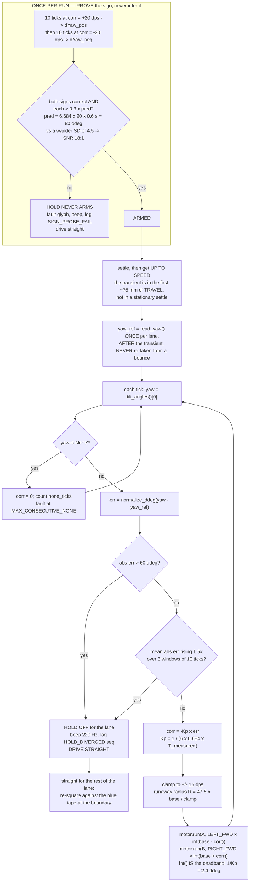

# Plan — Speed envelope and heading precision

**Written:** 2026-09-08, hub NOT connected · **Demo Day:** 2026-09-10 · **Answers** the two problems in
[the operator briefing § 6](./2026-09-08-operator-briefing-corner-turns-to-competition.md).
**Nothing here was run.** Every `[MEASURED]` figure is recomputed by the author from CSVs already in
`tmp/telemetry/`; everything beyond 305 mm of travel or 250 dps commanded is `[COMPUTED]`.

---

## 1. TL;DR

**Speeds.** Drive **SEARCH 150 mm/s (271 dps)**, **FOLLOW 100 mm/s (181 dps)**, **TRANSIT 300 mm/s
(541 dps)** — 2.7×, 2.3× and 5.5× what has ever been driven. The motors were never the limit: `motor.run()`
takes deg/s and delivers it to 99.3 % `[MEASURED]`; the robot crawled because nine example files each
hard-code their own bench-safety constant.
**Heading.** Hold heading with a **P-only gyro loop, `Kp = 1/(6 · 6.684 · T)` ≈ 0.42 dps/ddeg at the
`[MEASURED]` 60 ms tick** — which is what `examples/follow_tape.py` already has (`HOLD_KP = 0.4`), so the
*gain needs no change*; what must change is the **clamp (30 → 15 dps)**, the **guard (saturation-count → an
error trip that no datum reset can hide)** and a **once-per-run sign probe**.
**Verdict on 1.43°/3048 mm.** Achievable closed-loop `[COMPUTED]`, **not** open-loop — but the bias-vs-noise
question is **NOT answered** (with n = 4 the 95 % CI on accumulated bias is ±7.3°, five times the budget), so
**BM-A — a ten-foot chalk line and a tape measure — is the one experiment that must run.**

---

## 2. Why the robot has been slow

### 2.1 Root cause: a copied bench-safety constant, not a bug and not a unit error

`motor.run(port, velocity)` takes **deg/s** and the firmware's closed-loop controller delivers it.
Recomputed by the author by differencing `relA_deg`/`relB_deg` over each steady phase of
`tmp/telemetry/20260908T123234-motorpoc-0000609431.csv`:

| Leg (commanded 120 dps) | side0 | side1 | side2 | side3 |
|---|---|---|---|---|
| achieved L / R (dps) | 119.1 / 119.3 | 119.5 / 119.3 | 119.2 / 119.0 | 119.2 / 119.2 |
| distance | 302.3 mm | 299.0 mm | 304.5 mm | 293.7 mm |

`[MEASURED]` 99.3 %, the 0.7 % shortfall being the acceleration ramp inside each leg. **There is nothing to
figure out about making the motors turn faster: pass a bigger number.** Nobody did because every program owns
its own constant, each with a bring-up justification that expired when the robot left the desk —
`motor_safe_spin.py:50` 100 ("LOW on purpose"), `follow_tape.py:56` 80, `motor_poc.py:18` 120,
`find_note.py:48` 100, `find_corner.py:61` 100, `drive_to_tape.py:36` 100, `fusion_capture.py:24` 150,
`g4_spin_and_print.py:27` 150, `sweep_skeleton.py:56` 200, `drive_moves.py:36` 250 — against
`src/config.py:139 TRAVERSE_SPEED_MMS = 150.0`, **which no example reads.** Raising the speed means editing
nine files; that is why it never happened.

### 2.2 `motor.velocity()` is percent of rated speed — CLOSED today, from disk, no hub

The unit confusion the operator suspected is real, but it lives on the **read** side and never throttled
anything. `examples/motor_encoder_verbose.py` never commands motion — a human hand-turns the wheel — so the
2026-09-03 verbose logs reach speeds no program has ever commanded. Ratio of encoder-derived dps to
`velocity()`, recomputed by the author over
`tmp/telemetry/20260903T104407-verbose-0002543799.csv` and `…104627-verbose-0002701538.csv`:

| encoder dps band | 200–250 (n=8) | 250–300 (n=12) | 300–350 (n=15) | 450–600 (n=6) |
|---|---|---|---|---|
| **median dps / `velocity()`** | 11.50 | 11.30 | **11.11** | 11.25 |

Truncation-corrected over all 38 pairs ≥ 250 dps: **11.13**, against **1110 / 100 = 11.10** — the Medium
Angular 45603's rated no-load speed, and both ports report `device_id 48`. So `velocity()` returns a **signed
integer percent of rated speed**, truncated. `[MEASURED + COMPUTED]` This excludes *k* ≈ 12; the ~12 seen at
80–150 dps is pure floor() bias, which is why `scripts/analyse-run.py` reports a 12.3× discrepancy.

**Consequences.** (a) `hub-api-surface-2026-09-01.md:115` ("`int deg/s`") is **wrong** — read on a stationary
hub, where the call returns 0. (b) Every log understates speed 11×, a plausible reason nobody noticed the
headroom. (c) **Verify motor speed only from `Δrelative_position / Δt`, never from `velocity()`**: at a genuine
930 dps it reads ~84 and looks like catastrophic failure. Closes **KU-M36**.

---

## 3. The speed envelope

### 3.1 The hard geometric ceiling — 36.48 mm, and the cross-track error cancels

A sticky note is a 76 mm **square**, so the along-track chord depends on rotation and on how far off-centre
the lane passes. Worst case the nearest sensor track passes at `pitch/2 + XTE`; substituting
`config.lane_pitch_mm()` (`pitch = S − 2·XTE − overlap`) gives `(S − overlap)/2 = (76 − 5)/2 = 35.5 mm` —
**XTE cancels**, changing how many lanes you drive but never the worst-case chord. Scanning that chord over
all rotations `[COMPUTED, recomputed by the author]` gives a minimum of **36.48 mm at exactly 45°**. Design
against 36.48, never 76.

### 3.2 The tick rate is NOT 20 Hz — measured, and main.py is at 9.2 Hz

"20 Hz" is a chosen `sleep_ms`, not an achieved rate. Tick-period statistics recomputed by the author from
the `t_ms` column of every *unique* log (112 files collapse to 22 by md5):

| loop family | `TICK_MS` | p50 | p90 | **mean** | **achieved** |
|---|---|---|---|---|---|
| `followtape` / `drivetape` | 50 | 54 | 91 | 60.3 ms | **16.6 Hz** `[MEASURED]` |
| `motorpoc` / `fusion` / `standalone` | 100 | 103 | 140 | 108.9 ms | **9.18 Hz** `[MEASURED]` |

`src/main.py:45` sets `TICK_MS = 100`. **The mission program samples at 9.2 Hz.** The p90 step of +37 ms in
*both* families is the flash flush: of 82 slow ticks in `…114003-followtape-0000102164.csv`, **67 follow a row
with `seq % 10 == 0`** and the modal gap between slow ticks is exactly **10** — matching
`src/hub_telemetry_log.py:43 flush_every=10`. `[MEASURED]` ⚠ Separately, stalls the flush cannot explain
appear inside the detection-active `follow` phase: **594, 628, 813, 358 and 253 ms** `[MEASURED, UNEXPLAINED]`.
At 150 mm/s a 628 ms stall is 94 mm of blind travel against a 36.48 mm chord — a whole note, silently.

### 3.3 Detection is a blend problem too, not only a sample count

`reflection() == (100 * i) // 1024` exactly, 0 mismatches in 3412 rows
([colour-survey § 3](../findings/colour-survey-and-first-detection-2026-09-08.md)) — it is derived from
**integrated** intensity, so a tick straddling a note's edge returns a blend. With carpet 6 and a mid-yellow
62 against a threshold of 30, a tick must spend **f ≥ (30−6)/(62−6) = 43 %** of its travel on the note to
trip, so each crossing loses ≈ `2f · (v/R)` of detected chord. ⚠ **Yellow is the marginal colour** (21 points
of margin); pink at 97+ needs 22 % and is barely affected — the failure mode is a **missed yellow mine with
no telemetry signature**, and demo day may be yellow only. ⚠ Whether the blend is spatial (aperture) or
temporal (exposure) is `[UNVERIFIED]`; both shrink the chord and `2f·v/R` is the conservative reading.

### 3.4 Samples per note — the table that sets the speeds

Worst-case chord 36.48 mm; raw `n = chord·R/v`; **[blend-derated]** `n = (chord − 0.86·v/R)·R/v`. `[COMPUTED]`

| v (mm/s) | dps | R = 9.18 Hz (main.py) | R = 16.6 Hz (examples) | R = 30 Hz | R = 50 Hz |
|---|---|---|---|---|---|
| 50 | 90 | 6.7 [5.8] | 12.1 [11.3] | 21.9 [21.0] | 36.5 [35.6] |
| 100 | 181 | 3.3 [2.5] | 6.1 [**5.2**] | 10.9 [10.1] | 18.2 [17.4] |
| **150** | **271** | 2.2 [1.4] | 4.0 [**3.2**] | 7.3 [6.4] | 12.2 [11.3] |
| 243 | 439 | 1.4 [0.5] | 2.5 [1.6] | 4.5 [3.6] | 7.5 [6.6] |
| **300** | **541** | 1.1 [0.3] ⚠ | 2.0 [1.2] ⚠ | 3.6 [**2.8**] | 6.1 [5.2] |
| 400 | 722 | 0.8 [0.0] ⚠ | 1.5 [0.7] ⚠ | 2.7 [1.9] | 4.6 [3.7] |

**Max safe search speed**, taking 3 blend-derated samples (2 for `config.MIN_DWELL_SAMPLES` + 1 for the
hysteresis transition), `v_max = 36.48·R / 3.86`: **at the MEASURED 16.6 Hz, 157 mm/s** ← the number that
governs Demo Day · at 9.18 Hz (`main.py` as shipped) **87 mm/s**, ⚠ **below `config.TRAVERSE_SPEED_MMS = 150.0`
already** · at 30 Hz 284 mm/s · at 50 Hz 473 mm/s.

### 3.5 The three speeds

| Mode | Recommended | dps | Binding constraint | Justification |
|---|---|---|---|---|
| **SEARCH** | **150 mm/s** | 271 | sampling, 3.2 derated samples at 16.6 Hz | ceiling is 157; 150 leaves 5 % margin. **2.7× today's 55 mm/s** |
| **FOLLOW** | **100 mm/s** | 181 | reaction time: the bang-bang corrector acts once per tick, so hold `v/R ≤ ¼ · 25.4 mm tape = 6.35 mm` → **105 mm/s at 16.6 Hz**. Today's 44 mm/s is 2.4× more conservative than its own criterion |
| **TRANSIT** | **300 mm/s** | 541 | no detection, so no sampling bound. Straightness and stopping distance at speed are both `[UNMEASURED]` — **ladder-proven only** (§ 5) |

⚠ **Do not raise SEARCH above 157 mm/s until the loop rate is raised AND the colour sensor's own update rate
is measured.** Indirect evidence it may itself cap the rate: at a 54 ms tick **28.1 %** of consecutive raw
`rC` values are byte-identical, with runs up to **10** (540 ms frozen); at 103 ms that collapses to **1.3 %**,
longest run 2 `[MEASURED, indirect]` — what an internal refresh of ~10–20 Hz looks like. If real, raising
`TICK_MS` buys **zero** extra detection samples. BM-B settles it in 5 minutes with no motion.

⚠ **Silent clamp in `src/main.py:64-70`.** `_traverse_pct()` returns `max(12.0, min(60.0, pct))`; 60 % of
`hub_motors.DRIVE_MAX_DPS = 930.0` is 558 dps = **309 mm/s**. It does not bite at 150 mm/s (29 %), but any
future raise past 309 makes the robot drive 309 while `config.event_width_gates()` computes gates for the
larger number and rejects real notes as `too_narrow`.

---

## 4. Heading precision

### 4.1 Bias or noise? — NOT ANSWERED, and that is the finding

`examples/motor_poc.py` drives a 1 ft square = four independent ~300 mm straights under identical
conditions. Per-leg net yaw change, recomputed by the author:

| leg | side0 (302.3 mm) | side1 (299.0 mm) | side2 (304.5 mm) | side3 (293.7 mm) |
|---|---|---|---|---|
| **net yaw** · peak-to-peak | **−3** · 16 ddeg | **−1** · 20 | **−4** · 16 | **+6** · 22 |

Mean −0.50 ddeg, SD 4.509, SE 2.255. **Signs are mixed and the nets do not scale with distance**, which
refutes a *large* body-fixed bias. But with n = 4 the t-based 95 % CI on the per-300 mm mean is
**±7.18 ddeg**, which scales ×10.16 to **±7.3° over 3048 mm** — five times the 1.43° budget, and a
budget-breaking bias of 0.14°/300 mm sits at 0.6 SE, completely invisible. **Zero-mean is the point estimate,
not the result.**

Three further corrections to the record:

1. ⚠ **Provenance.** `motorpoc` and `fusion` are **2026-09-03** runs: all 9 `motorpoc` files share one md5
   (`f42bf38a…`) and all 11 `fusion` files share another. The 2026-09-08 filenames are *download* times.
   This dataset **predates the 09-08 sensor remount.**
2. ⚠ **It ticked at 103 ms, not 54** (`examples/motor_poc.py:25 TICK_MS = 100`), so the 16–22 ddeg
   peak-to-peak is sampled at 9.7 Hz — a **lower bound**, not a measurement.
3. ⚠ **Part of the "wander" is a repeatable start-of-leg transient.** Against travelled distance, three of
   four legs lurch the same way in the first 17–50 mm: side1 +16 ddeg @ 31 mm, side2 +10 @ 25 mm, side3 +17
   @ 17 mm, side0 +10 @ 50 mm. Nets over the last ~225 mm are −5, 0, −4, +2 — SD 3.20 against 4.51 for the
   full leg. **A stationary settle does not remove it: it is in the first ~75 mm of *travel*.** The datum
   must be taken **after the robot is at speed.**

**Extrapolation, marked honestly.** Treating σ = 0.451°/300 mm as a random walk gives a final-heading 1σ of
**1.44°** and a cross-track 1σ of **44 mm** over 3048 mm, so ~8.6 % of open-loop lanes exceed the 76 mm budget
`[COMPUTED]`. ⚠ σ from n = 4 has a χ² 95 % interval of 0.256–1.68°, so the honest cross-track range is
**25–165 mm**. Either way: **open loop does not meet the budget.**

### 4.2 The plant, and the gain derived from it

One motor-degree of differential `(dR − dL)` advances each wheel by `π·63.5/360 = 0.5541 mm` in opposition,
rotating the robot by `0.5541/95 rad`:
`YAW_DDEG_PER_MOTORDEG = (pi * 63.5 / 360) / 95 * 572.9578 = `**`3.3421 ddeg`**.
`forward(base − corr, base + corr)` makes the differential `2·corr` dps, so the yaw rate is
**6.684 ddeg/s per dps of corr**, and over one tick of period `T` one dps of `corr` buys
**`g = 6.684·T` ddeg** — 0.401 at the `[MEASURED]` 60 ms, 0.334 at a nominal 50 ms.

With `corr = −Kp·err` and the one tick of actuation delay the loop really has (sample, then command, which
acts over the *next* interval): `e[k+1] = e[k] − g·Kp·e[k−1]`, characteristic `z² − z + g·Kp = 0`.

| `g·Kp` | 0.167 → roots 0.789/0.211, τ = 0.25 s | 0.25 → double root 0.5 | 1.0 → ‖z‖ = 1 |
|---|---|---|---|
| meaning · `Kp` at T = 60 ms | **RECOMMENDED · 0.416** | critically damped · 0.623 | **UNSTABLE** · 2.49 |

⚠ Express it as a *function of the measured tick*, not a constant, because the p90 tick is 91 ms — a doubled
tick doubles `g`, and at `g·Kp = 1/6` that only reaches 1/3 (‖z‖ = 0.577, still damped).

**The gain in `examples/follow_tape.py:115` — `HOLD_KP = 0.4` — is already right.** The 40-second circle was
purely the sign. Do not restructure the controller.

**P only, no I, no D.** Heading is already the integral of the wheel differential, so the plant is type-1
and P has zero steady-state error to a step. Against the largest rate disturbance measured — the 0.18 %
encoder mismatch (545/546, 540/539, 550/549, 530/530) = 1 dps differential = 3.34 ddeg/s — the steady-state
error is `3.34/(6.684·0.416) = 1.2 ddeg = 0.12°`, **12× inside budget**. An I term buys nothing measurable
and adds windup; D differentiates a signal quantised at 1 ddeg with SD 4.5.

**Deadband: do not add one — it is already free.** `motor.run()` takes an integer, so `|corr| < 1 dps`
truncates to zero: a built-in deadband of `1/Kp = 2.4 ddeg = 0.24°`, an order of magnitude inside budget.

**Clamp: express it as a runaway radius.** Saturated, `R = (track/2)·base/C = 47.5·base/C` mm — today's
`HOLD_MAX_DPS = 30` on an 80 dps base is **R = 127 mm**, a 0.8 m circle, exactly the observed failure. Size it
from authority instead: the largest legitimate error is 3σ of the within-leg wander ≈ 13.5 ddeg, asking for
5.7 dps at Kp = 0.42. **`HOLD_MAX_DPS = 15`** gives 2.6× headroom and a 858 mm runaway radius at the 271 dps
search base. ⚠ A clamp never makes an inverted loop safe — only the guard does.

**Guard: trip on the ERROR, not on saturation.** `HOLD_DIVERGE_TICKS` **could not have fired**:
`examples/follow_tape.py:361,369` re-take `hold_ref` from the current yaw on every tape sighting (89 in 670
rows on the circle run), re-zeroing the error and resetting the counter. Trip on `|err| > 60 ddeg` (6°, 4.4×
the measured 3σ): at base 271 / clamp 15 the saturated yaw rate is 100 ddeg/s, bounding the worst runaway to
~0.6 s ≈ **90 mm of arc**. Second net: mean `|err|` over the last 10 ticks exceeding the previous 10 by 1.5×,
three windows running. On either trip **hold OFF for the lane, beep, log, drive straight** — a robot going
straight is recoverable.

### 4.3 The loop

⚠ **The sign probe is not lateral-neutral.** Net *heading* returns to zero, but the S-curve's two halves
displace the same way: `y = v·ω·T²/2` per half = **6.3 mm each, 12.6 mm total at 150 mm/s** `[COMPUTED]`.
Run it **once at the start of the run**, before the first lane datum — not per lane.

### 4.4 Is the 1.43° budget met?

| cross-track 1σ over 3048 mm | open loop | P hold, Kp = 0.42, 150 mm/s (`λ = v·τ` = 38 mm) |
|---|---|---|
| | **44 mm** (CI 25–165) — ❌ ~8.6 % of lanes exceed 76 mm | **~1–5 mm** — ✅ ≥15× inside budget |

`[COMPUTED]` **Contingent on two unmeasured things.** (a) BM-A must show the wander is zero-mean, or a
wheel-trim constant must remove the bias — a hold *locks in* a biased datum. (b) **Gyro drift while driving
is `[UNMEASURED]`:** the only figure, 0.0033 °/s, is from a *bare, stationary, motorless, USB-powered* hub,
and the same finding's § 5 records a discarded window in which yaw wandered +7.6, −22.2, +96.6°
([imu-characterisation § 5](../findings/imu-characterisation-2026-08-27.md)). Per lane the budget is
generous — `r_max = 2ε·v/L²` = **8.4 °/min at 150 mm/s** `[COMPUTED]`, 42× the bench figure — but over a
sweep the datum rotates, which is why lane-end **re-squaring against the blue tape** stays in the design.
⚠ Two budgets differ: the operator's 76 mm is *absolute deflection from a line*, while
`config.CROSS_TRACK_ERROR_MM` is *lane-placement* error — a common-mode rotation of the sweep frame skews the
pattern without opening gaps between adjacent lanes.

---

## 5. The bench tests

All follow the [`examples/motor_poc.py`](../../examples/motor_poc.py) pattern: `runloop.run(main())` at
module level (a bare top-level `motor.run` does **not** turn in a slot program, `[MEASURED]` 2026-09-03) →
`wait_tap(ARM_TIMEOUT_MS)` showing `S_GLYPH` → 5 s countdown → work → `finally: motor.stop(PL);
motor.stop(PR)` + `#end` trailer + `log.close()`. **`HEADER` must be byte-identical to
`examples/motor_poc.py:30-31`** so `scripts/decode_telemetry.py` and `scripts/analyse-run.py` need no change;
extra data goes in the per-row **`reason`** column or `#end key=value` fields. `CsvLog(…, flush_every=25)`.
Guards on every program: `RUN_CAP_MS`, `tapped()` → `raise StopRun`, abort if `|yaw − datum| > 300 ddeg` or
`motor.status()` returns 2 (stalled) / 5 (disconnected). MicroPython subset — **no f-strings**.

### BM-A — `examples/straight_line.py` · the one that must run · ~35 min

**Preflight, 60 s, no hub:** the Builder rulers `SENSOR_SPACING_MM` and the fore-aft offset into
`docs/hardware/` — it blocks the corner radius, the re-squaring maths and every two-sensor figure (KU-M33).

**Phase 0 — wheels OFF the ground, on blocks, ~90 s.** `motor.info(port.A)`/`(port.B)`; abort unless both read
`device_id 48` and `max_speed 930`. Ladder commanded velocity **120, 300, 500, 800, 930, 1100 dps**, 1.5 s
each + 0.5 s settle, logging `relative_position`, `velocity()`, `status()` and `hub.battery_voltage()` into
`reason` as `"batt=8306 cmd=800"`. Gives the no-load achieved-vs-commanded curve, whether the 930 clamp is
real (1100 should be indistinguishable from 930), and a high-speed `velocity()` check against § 2.2's 11.13.
**Phase 0 must pass before Phase 1** — the ceiling gets discovered on blocks, not on the floor.

**Phase 1 — on the floor. This is the experiment.** Chalk a 3048 mm reference line, mark start and end,
square the robot's centreline onto it by eye the same way each time. Arm on a tap, 5 s countdown,
`HEADING_HOLD = False` (a flag at the top), drive open loop until the **mean** encoder distance reaches
3048 mm, stop, settle 500 ms, log 4 stopped rows. `#end` carries `reason, cmd_dps, dL_deg, dR_deg, dist_mm,
net_yaw, max_abs_yaw, tick_p50, tick_p90, batt_start, batt_end`.
**Matrix, 12 runs: 2 speeds × 2 directions × 3 repeats** — **120 dps** (66.5 mm/s, the control arm) and
**450 dps** (249 mm/s, the first straightness test above 66 mm/s ever). DIRECTION means the robot traverses
*the same chalk line the opposite way*; **that is the discriminator, and the reason for a chalk line.**

**The operator writes on paper after each run** — neither number exists in any telemetry:
(1) signed lateral offset of the robot's centre from the line at the stop point, mm;
(2) tape-measured distance actually travelled, mm.

**Read-out, stated in advance so the answer is not argued afterwards:**

| Observation | Diagnosis | Action |
|---|---|---|
| offsets same sign, similar size, **flip on reversal**, gyro net agrees | mechanical asymmetry (unequal effective rolling diameter / drag) | a one-number wheel-trim constant may beat a control loop |
| offsets same sign **in the room**, do **not** flip, gyro net ≈ 0 | gyro bias or a sloping floor | ⚠ a heading hold would **lock the error in**; tape re-squaring becomes mandatory |
| offsets scatter about zero | zero-mean, as the four 300 mm legs hint | build the hold as specified in § 4 |
| the 450 dps arm differs in character from 120 dps | straightness is speed-dependent | ladder before any config change |
| gyro net vs ruler differs by > 1° · tape distance ≠ 3048 mm | **free absolute gyro-error measurement**; effective rolling diameter | sets the re-squaring cadence; closes the odometry scale factor |

⚠ **Power, honestly:** with n = 3 per cell a bias separates from scatter at ~2 SE — near the predicted 44 mm
SD that resolves a mean offset above ~50 mm, and what it cannot see is inside what the hold removes. If
3048 mm of clear floor is unavailable, run the longest straight the room allows and **record that length**:
sensitivity falls as L², so a 1 m run has a tenth the leverage and the question stays open.

### BM-B — `examples/sensor_rate.py` · 5 min, no motion, no floor · run it in any spare minute

Hold a note still under one sensor; read `color_sensor.rgbi(PC)` in a tight loop with no sleep for 5 s,
logging `t_ms` and the four channels; count **distinct** consecutive values and the achieved read rate. The
only test that can justify — or kill — raising `TICK_MS`, and § 3.5's repeat asymmetry says it may kill it.

### BM-C — `examples/heading_hold.py` · the gain sweep · **post-demo unless BM-A finishes early**

Same 3048 mm line, `HEADING_HOLD = True`, sign probe → settle → up to speed → datum → hold. Sweep
`HOLD_KP ∈ {0.25, 0.4, 0.5, 0.75, 1.0}`, one run each at 150 mm/s; `#end` adds `kp, base, clamp, probe_pred,
probe_pos, probe_neg, sign_ok, rms_err, max_abs_err, diverged_at_seq`. Pick the Kp minimising `rms_err`;
ringing (err changing sign every 4–6 ticks) should appear near Kp = 1.0, validating § 4.2. If `rms_err` does
**not** fall as Kp rises the loop has no authority — a finding, not a tuning failure.

---

## 6. Exact changes

**Do not edit anything below before BM-A Phase 1 has run**, except the three marked FREE.

| File | Change | ~lines |
|---|---|---|
| `src/config.py` | **FREE.** Add one speed block: `SEARCH_SPEED_MMS = 150.0` · `FOLLOW_SPEED_MMS = 100.0` · `TRANSIT_SPEED_MMS = 300.0` · `TICK_PERIOD_MS = 50` · `SENSOR_SPACING_MM = None` (until rulered) · `BLEND_FRACTION = 0.43` · a `max_search_speed_mms(rate_hz)` helper returning `36.48 * rate_hz / 3.86`. Keep `TRAVERSE_SPEED_MMS` as the mission value and set it from `SEARCH_SPEED_MMS`. Comment every number with its evidence. | ~30 |
| `src/hub_drive.py` | **FREE.** Add `YAW_DDEG_PER_MOTORDEG = MM_PER_REV / COUNTS_PER_REV / TRACK_WIDTH_MM * 572.9577951308232` (= 3.3421), `yaw_ddeg_per_dps_of_corr(tick_ms)` returning `2.0 * YAW_DDEG_PER_MOTORDEG * tick_ms/1000.0`, and `hold_kp(tick_ms, damping)` returning `1.0 / (damping * yaw_ddeg_per_dps_of_corr(tick_ms))` with the stability table in the docstring. Pure arithmetic on existing MEASURED constants — no new call sites, still host-importable. | ~25 |
| `src/main.py` | `TICK_MS = 100 → 50` (**this is what makes 150 mm/s legal at all** — at 9.18 Hz the ceiling is 87 mm/s). Then either delete the `min(60.0, …)` clamp in `_traverse_pct():64-70` or make it **raise** when it bites. | ~4 |
| `src/hub_telemetry_log.py` | `flush_every` default `10 → 25`, plus an explicit `flush()` at each lane end. ⚠ **Do NOT buffer a whole lane in RAM** — an untethered run that dies mid-lane must still yield its log, which is how the 09-08 session recovered data. | ~3 |
| `examples/follow_tape.py` | `HOLD_MAX_DPS 30 → 15` (runaway radius, § 4.2) · replace the `HOLD_DIVERGE_TICKS` saturation counter with an `abs(err) > 60` trip + trend net · `BASE_DPS 80 → 181`. **Keep `HOLD_KP = 0.4`** (now derived, not assumed) and **keep `HOLD_SIGN = -1`** — § 4.2 confirms it; update the comment to cite the derivation as well as the crash. | ~20 |
| `examples/*` (9 files) | Replace each hard-coded `SPEED_DPS` with a read of the config block via `hub_drive.forward_mms()`, so demo-day tuning is one edit instead of nine. | ~2 each |
| `docs/findings/hub-api-surface-2026-09-01.md:115` | **FREE.** Correct "`int deg/s`" → percent of rated speed (×11.1); note it was read on a stationary hub. Closes **KU-M36**. New programs: `examples/straight_line.py` (~200), `examples/sensor_rate.py` (~70), `examples/heading_hold.py` (~230). | ~3 |

**MUST NOT be touched:** `hub_drive.FORWARD_SIGN`, `TURN_SIGN`, `LEFT_FWD`/`RIGHT_FWD` (eyes-measured;
`TURN_SIGN = +1` has never been captured in a log — the only `caldir` log on disk is of the rejected −1) ·
`src/detector.py`, `src/sweep.py`, `src/result.py`, `src/calibration.py` · `config.WHEEL_DIAMETER_MM`,
`TRACK_WIDTH_MM`, `ENCODER_COUNTS_PER_REV` · the `motor_poc.py` `HEADER` string · `motor_pair` (offers nothing
for straight driving, and switching would invalidate every straightness number the project owns).

---

## 7. Open questions and risks, ranked

⚠ **Above both of the operator's problems sit three items the repo ranks higher, and one bench session
remains.** (1) **`src/main.py` has never executed on hardware** — KU-M29, "the single largest risk in the
project", compounded by KU-M38 (`import config` resolves to LEGO firmware). (2) **`SENSOR_SPACING_MM`** — a
60-second ruler, KU-M33. (3) **KU-D11:** `src/hub_color.py` reads only `COLOR_PORT`; `SECOND_COLOR_PORT` is
read nowhere in `src/`, so every two-sensor coverage-time win is gated on **code that does not exist.**
Between the operator's two problems, **speed first** — measurement, bounded, reversible — and heading second,
because it is a new feedback loop the day before a graded demo.

| # | Risk / question | Status |
|---|---|---|
| 1 | Does zero-mean survive at 3048 mm? Everything rests on four 300 mm legs from **one 2026-09-03 run, pre-remount, sampled at 9.7 Hz**. The 95 % CI admits a bias 5× the budget. | `[UNMEASURED]` — BM-A |
| 2 | **Colour sensor's own update rate.** If it is ~10–20 Hz, raising `TICK_MS` buys zero detection samples and every speed above ~157 mm/s is unsafe regardless of loop rate. | `[UNMEASURED]` — BM-B, 5 min, free |
| 3 | **Battery sag under load — zero data at any load, any speed, any duration.** `hub.battery_voltage()` is already logged by `examples/standalone_log.py:59` (8306 → 8315 mV over 45 s **stationary**), and by no drive program. ⚠ Because `motor.run()` is closed-loop, sag does **not** slow the robot — it silently eats torque margin until the controller can no longer hold speed, and at 930 dps (155 RPM, past the 45603's 135 RPM max-efficiency point) there is almost none to lose. **A second, independent reason not to run near the ceiling.** | `[UNMEASURED]` — add `batt_mv` to every drive log |
| 4 | **Gyro drift while driving, on battery.** Range between the bench best case and a plausible bad case is three orders of magnitude, and § 5.5 warns the clean figure may be a firmware deadband artefact. Decides whether re-squaring costs 16 s or 2.5 min. | `[UNMEASURED]` — wheels-up, 6 min |
| 5 | **Unexplained 253–813 ms stalls** inside the detection-active phase. At 150 mm/s a 628 ms stall is 94 mm of blind travel against a 36.48 mm chord. Until diagnosed, "the loop is idle, just raise the rate" is not established. | `[MEASURED, UNEXPLAINED]` |
| 6 | ⚠ **Is `SENSOR_SPACING_MM` above 76 mm?** The `[MEASURED]` lower bound says it is (one note could never cover both sensors), but `coverage-time-budget.md`'s guarantee `S_max = W − 2e − m` stops at ~71 mm. **If the built spacing exceeds the note width, a note can pass BETWEEN the two sensors** and the two-sensor coverage guarantee does not exist. Also: both the 2.00× (38 lanes / 116 m) and 2.59× (29 lanes / 88 m) rows of that table are quoted interchangeably in the analysis; they are different geometries. | `[UNMEASURED]` — KU-M33 |
| 7 | **Stopping distance at speed.** The "~3 mm coast" figure is a comment in `examples/find_note.py:48` with no logged run behind it. ⚠ And the *mechanism is a setting*: `motor.stop()` takes `COAST/BRAKE/HOLD/SMART_*` and the default is `[UNVERIFIED]` (`hub-api-surface-2026-09-01.md:134`). Name the stop mode explicitly rather than relying on it. | `[UNVERIFIED]` |
| 8 | **The demo time limit is formally `PENDING`** (`docs/runbooks/demo-day.md:159`, Q2/Q8, still unasked). Every "this makes the demo fit" claim anywhere is scored against `coverage-time-budget.md`'s own 5:00 **assumption**. Costs one written message and no bench time — put it in today's batch. | `OPEN` |
| 9 | **KU-M34 must stay OPEN.** The register cites a 108.3 mm misclosure / 30° final heading error / four turns summing −389.7° from a square; the author's phase-sum over `…motorpoc-0000609431.csv` gives ~−356.4° against a commanded −360. Either it is a different run (`square_odometry.py`?) or one analysis has an unwrap error. **Resolve before KU-M34 is touched.** | `OPEN` |
| 10 | Is achieved-vs-commanded still ~99 % under load at 450+ dps (every measurement is 100–250 dps for ≤ 30 s)? And would a **wheel-trim constant** — one number in `config.py` — beat a control loop? **Decide from BM-A's read-out, not pre-emptively.** | `[UNMEASURED]` — BM-A |
| 12 | ⚠ **Scope note:** line following was analysed and **dropped for Demo Day** (`docs/findings/line-following-viability-2026-09-08.md § 7`). The heading hold is still needed — the lawnmower sweep needs it with or without a line — so specify it **against the sweep**, and treat the `follow_tape.py` edits as post-demo. | — |

**Two things are closed today, with the hub unplugged:** `motor.run()` takes deg/s and delivers it to within
1 % `[MEASURED]`, and `motor.velocity()` is percent of rated speed, ×11.1 `[MEASURED]`. **Nothing else in
this document should be written as closed.**
