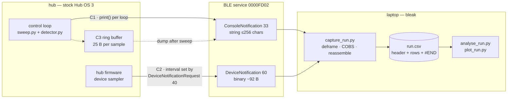
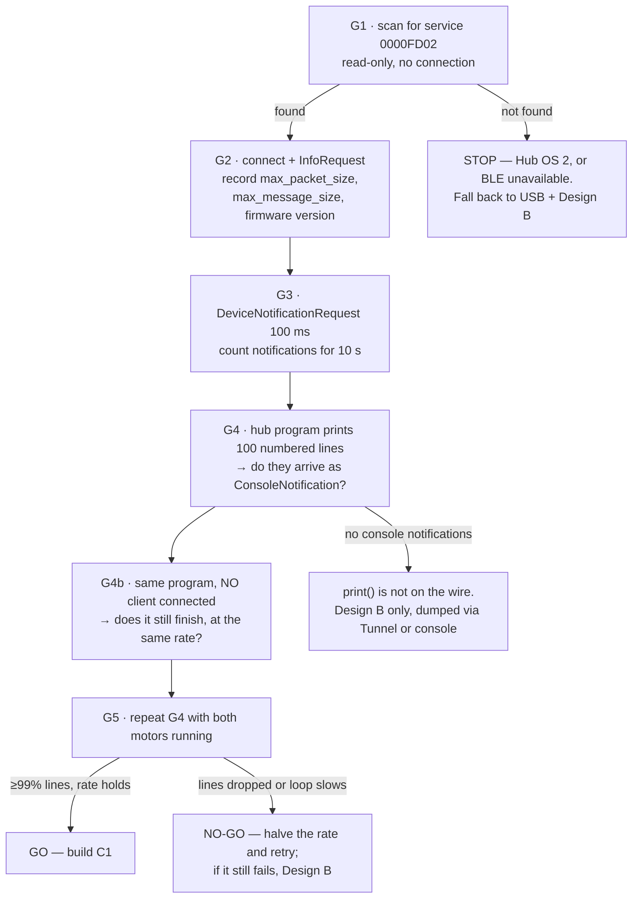

# Telemetry over Bluetooth Low Energy — FORWARD-PLAN

**Type:** FORWARD-PLAN · **Status:** designed, nothing attempted — **the hub has never been connected** · 2026-08-26

Extends [telemetry-and-analysis.md](./telemetry-and-analysis.md), which ranked four transports and parked
the choice. That document's Bluetooth row says *"**UNVERIFIED** whether stock firmware exposes a usable BT
data channel to a user program, and at what rate. This is the operator's suggestion and it is the right
ambition — it needs research before it is a plan."* This is that research, and the plan it produced.
Everything that document already says — the field list, and the rule **log the RAW samples, not the
decisions** — still stands and is not restated here.

**Nothing below has been run.** There is no hub, no sensor, and no BLE link. Every number is either
quoted from LEGO's own published protocol reference, computed from it, or marked `[ASSUMED]` /
`UNVERIFIED`.

---

## 1. Summary and recommendation

Four findings changed the shape of the answer:

1. **LEGO publishes the BLE protocol.** Service `0000FD02-0000-1000-8000-00805F9B34FB`, RX
   `0000FD02-0001-1000-8000-00805F9B34FB` for host→hub **write-without-response**, TX
   `0000FD02-0002-1000-8000-00805F9B34FB` which notifies hub→host, plus a working `bleak` reference
   client. First-party documentation, not a blog reconstruction. All three UUIDs are copied from LEGO's
   `connect.rst` and `examples/python/app.py` (§10) — **not from memory**.
2. **The hub will stream sensor data on its own, with no code from us.** `DeviceNotificationRequest`
   (id 40) takes *"Desired notification interval in milliseconds"*, and the hub then pushes
   `DeviceNotification` (id 60) containing IMU yaw/pitch/roll + accelerometer + gyro, both motors'
   positions and speeds, the colour sensor's detected colour **and raw R/G/B**, and the distance sensor's
   millimetres. That is most of our record, for free, off the control loop.
3. **`print()` has a documented wire representation.** `ConsoleNotification` (id 33) carries a
   null-terminated `string[256]` — 256 **bytes**, not characters. If the hub's `print()` emits it —
   **UNVERIFIED; gate G4 exists to prove it** — the tethered "print a CSV line per loop" workflow works
   untethered, unchanged. The only supporting evidence is circumstantial: the program LEGO's own `app.py`
   uploads is four lines long and one of them is `print("Console message from hub.")`. That is suggestive,
   not proof, and nobody here has run it.
4. **There is no file-download message.** The protocol has `StartFileUploadRequest` and
   `TransferChunkRequest` (host→hub) and nothing in the other direction. **"Log to a file on the hub and
   pull it off afterwards" has no documented BLE path at all.** Anything that leaves the hub leaves it as
   a `ConsoleNotification` or a `DeviceNotification`.

**Recommendation: the hybrid (Design C), built in the order C1 → C2 → C3.**

- **C1 — live CSV over `ConsoleNotification`** at a rate set by measurement, one line per control loop,
  each line carrying a sequence number and the hub's own clock. This is the record of account.
- **C2 — `DeviceNotification` at a slow interval** (`[ASSUMED]` 200 ms) running concurrently, as an
  independent witness: it comes from the hub firmware rather than our code, so a disagreement between the
  two channels is a bug in our instrumentation, not in the physics.
- **C3 — a small fixed on-hub ring buffer** (`[ASSUMED]` 2 000 samples, 50 KB) dumped after the sweep
  finishes, so a mid-run dropout costs the tail of the live stream and not the whole run.

**What would change this.** If gate G2 reports a small maximum packet size *and* G4 shows the console
string padded to its full 256 bytes, the live channel cannot carry the loop rate: the answer becomes
Design B — buffer on the hub, dump at the end, accept a run length bounded by heap (§4.2), and downsample
the live channel to a 2 Hz heartbeat that only proves the robot is alive. If G1 finds no `0000FD02`
advertisement, the likeliest cause is Hub OS 2 — but a hub that is off, out of range, or already connected
to another client will not advertise either, so rule those out before concluding anything. If it really is
Hub OS 2 then none of this protocol exists and telemetry goes back over USB — where, note, *post-run*
retrieval still leaves the run itself untethered (§4.2).

---

## 2. Why untethered matters — and the number that makes it matter

The operator's reasoning: *"having a cable connected might mess up the accelerometer data."* That is
correct, and the project's own arithmetic says how much correctness there is to lose. From
[../findings/coverage-time-budget.md](../findings/coverage-time-budget.md): a note is `[ASSUMED]` 76 mm,
lane pitch is `76 mm − 2 × cross-track error`, and **1° of heading error over a 1.2 m lane costs 21 mm of
cross-track error**, against the `[ASSUMED]`-optimistic `CROSS_TRACK_ERROR_MM = 15.0` in
[../../src/config.py](../../src/config.py). Rearranged, that budget is a threshold of concern:

```
15 mm budget ÷ 21 mm per degree per lane  =  0.71°
```

**A systematic heading bias of about seven tenths of one degree consumes the entire cross-track budget**,
and every millimetre it takes comes out of lane pitch, which multiplies into lane count and run time. A
USB cable trailing off a differential-drive robot applies a lateral force varying with how much cable is
paid out and which way the robot faces — the signature of a systematic, direction-dependent bias, not
random noise.

**We do not know the magnitude and this document will not invent one.** No drag figure for this chassis,
cable or floor could be sourced. What is defensible is the threshold: the number that would matter is
*below one degree*, which is small enough that "it's probably fine" is not an engineering statement.

**Procedure that would measure it** — add to [bench-measurement-plan.md](./bench-measurement-plan.md) as a
new measurement, roughly 10 minutes:

1. Lay a 1.2 m reference line on the run surface; tape a start pose at the wheels.
2. Drive a fixed command to the far end **with gyro hold disabled** — open-loop, so the drift is not
   corrected away — and measure lateral offset from the line with a ruler. **5× untethered.**
3. **5× tethered**, cable dressed exactly as it would be for a real bench session.
4. **5× tethered with the cable off the other side**, to separate cable-side bias from a chassis or
   wheel-diameter asymmetry that would be present either way.
5. Report all three as mean ± range in mm, converted to degrees at 21 mm/°.

**Pass:** tethered and untethered means differ by less than 5 mm (≈0.24°) — the cable is not the problem
and BLE is a convenience. **Fail:** they differ by more — the cable is a measurement error, every tethered
figure in the Intro Report inherits it, and BLE is a requirement. Either outcome is a sourced sentence in
the report's methodology section, which is worth more than the assumption it replaces.

And a second reason independent of drag: **a tethered run is not the run being demonstrated.** Demo Day is
untethered, so tuning against tethered data means tuning against a different vehicle.

---

## 3. What BLE can actually carry

### 3.1 What the wire format costs

Device message sizes, counted field by field from LEGO's `messages.rst` (all fields little-endian;
`int16` = 2 B, `int32` = 4 B):

| Device message | id | Fields | Bytes |
|---|---|---|---|
| `DeviceBattery` | 0 | type + percent | **2** |
| `DeviceImuValues` | 1 | type + up-face + yaw-face + 9 × int16 | **21** |
| `Device5x5MatrixDisplay` | 2 | type + 25 pixels | **26** |
| `DeviceMotor` | 10 | type + port + motor type + int16 abs pos + int16 power + int8 speed + int32 pos | **12** |
| `DeviceForceSensor` | 11 | type + port + value + pressed | **4** |
| `DeviceColorSensor` | 12 | type + port + int8 colour + 3 × uint16 raw RGB | **9** |
| `DeviceDistanceSensor` | 13 | type + port + int16 mm | **4** |
| `Device3x3ColorMatrix` | 14 | type + port + 9 pixels | **11** |

Our expected configuration — 2 motors, 1 colour sensor, 1 distance sensor, plus the hub's own battery,
IMU and 5×5 matrix:

```
battery  2 + imu 21 + matrix 26 + motor 12 + motor 12 + colour 9 + distance 4  =  86 B payload
DeviceNotification header (uint8 type + uint16 size)                          =   3 B
COBS code words: 1 typical, 2 worst case (measured, below)                    = 1–2 B
trailing 0x02 delimiter                                                       =   1 B
                                                                    total     ≈  91–92 B per frame
```

**The framing figure was not estimated — LEGO's `examples/python/cobs.py` was downloaded and run on a
realistic 89-byte frame**, with `decode(encode(x)) == x` asserted. SPIKE's COBS is not the textbook
variety: a delimiter byte is *consumed* into the code word rather than escaped, so each `0x00`/`0x01`/`0x02`
in the payload costs nothing net. `MAX_BLOCK_SIZE = 84` is **inclusive of the code word**, so a block
carries at most 83 data bytes, and overhead is driven by block splits, not by content. Measured: a
realistic notification (46 of its 89 bytes are delimiter values, mostly the blank 5×5 matrix) frames to
**91 B**; an 89-byte payload containing no delimiter at all — the worst case — frames to **92 B**. §3.2
uses 92 B. Do not reuse the older "one code word per 84 bytes of payload" shortcut: it is the wrong
mechanism, even though it happens to land within a byte here.

Also worth noticing: **the 5×5 display costs 26 of those 86 bytes — 30% of the payload for a telemetry
field of zero value**, with no documented way to filter individual device messages out.

`[ASSUMED]` that the hub emits a message for every attached device every interval — the documentation does
not say whether unchanged devices are omitted. If they are, everything below gets easier.

### 3.2 What the link can carry

**Neither the negotiated ATT MTU nor the connection interval is published by LEGO, and `InfoResponse`
reports neither.** Read `connect.rst` closely: *"Max. packet size: The largest amount of data that can be
**written to the RX characteristic** in a single operation"* — that is the **host→hub** direction, and
LEGO's `app.py` uses it for exactly that, to chunk its own writes. It is at best an indirect hint at the
negotiated MTU and it says nothing about how fast notifications come back; `max_message_size` bounds a
whole message, not a radio packet. **The hub→host rate is not derivable from any published field. Only
gate G3 measures it.**

The honest form of this section is therefore a bracket, not a number. General BLE parameters from the
Memfault throughput primer (§10): default ATT MTU **23 B** (20 B of application payload after the 3-byte
notification header), connection intervals **7.5 ms–4 s**, *"some older devices only support one packet per
connection interval"*, and a worked iOS example at 7 packets per interval.

Application throughput = `packets_per_event × (MTU − 3) ÷ interval`:

| Scenario | MTU | Pkts/event | Interval | Bytes/s |
|---|---|---|---|---|
| Pessimistic — no MTU exchange, 1 packet | 23 | 1 | 30 ms | **667** |
| Conservative | 23 | 4 | 30 ms | **2 667** |
| Typical | 23 | 4 | 15 ms | **5 333** |
| With Data Length Extension — `[ASSUMED]`, **no evidence this hub supports DLE** | 247 | 4 | 15 ms | **65 067** |

**⚠ These four rows are a bracket, not a ranking, and must not be read across.** The same primer warns
that packets-per-event and interval are *not* independent: a stack that fills the connection event gets
*"the same throughput … even if you are using a 30ms interval instead of a 15ms interval"*, because the
longer event carries proportionally more packets. Holding "4 packets" fixed while halving the interval, as
the two middle rows do, therefore overstates what the shorter interval buys. DLE is optional in the
Bluetooth spec and the primer notes not all devices implement it, so the bottom row is a ceiling nobody has
shown this hub can reach. The rows bound the plausible range; they do not predict where in it we land.

Against the 92 B/notification of §3.1:

| Rate | Bytes/s needed | Pessimistic | Conservative | Typical | With DLE |
|---|---|---|---|---|---|
| 10 Hz | 920 | ✗ | ✓ 35% | ✓ 17% | ✓ |
| 20 Hz | 1 840 | ✗ | ⚠ 69% | ✓ 35% | ✓ |
| 50 Hz | 4 600 | ✗ | ✗ | ⚠ 86% | ✓ |
| 100 Hz | 9 200 | ✗ | ✗ | ✗ | ✓ |

**This is the crux, and it does not resolve comfortably.** The `SAMPLE_RATE_HZ = 100.0` in
[../../src/config.py](../../src/config.py) is annotated in that file as *"UNVERIFIED: LEGO spec figure for
the colour sensor"* — a datasheet number, not a measured Python loop rate — and 100 Hz of full telemetry
needs a link we have no evidence we will get.

Note also that the 20 Hz row above (1 840 B/s) is a load **the recommended design never asks for**: Design
C runs the *console* channel at the loop rate and the *binary* channel at 200 ms, not both at 20 Hz. The
figure that actually applies is the sum of the two:

```
C1 console  20 Hz × 60 B  = 1 200 B/s
C2 notifs    5 Hz × 91 B  =   455 B/s
                    total = 1 655 B/s   →  62% of the conservative row, 31% of the typical row
```

**20 Hz is the rate to design for**, on that arithmetic and because it is well above the rate a control
loop is likely to achieve anyway. But 62% of a *modeled* ceiling is not headroom: nothing above accounts
for link-layer retransmission, the classroom's 2.4 GHz neighbours (§7), or the console field turning out to
be padded (§3.3). **If G3 measures below the conservative row, halve the rate before changing anything
else.**

### 3.3 The console channel, and the one unknown that dominates it

A CSV line for the record in §5, at typical field widths, is **53 characters**:

```
1186,178430,15230,15198,-372,68,412,398,201,-1,lane,7
```

```
message = uint8 type (1) + 53-char string + NUL  = 55 B ; framed by LEGO's cobs.pack()  =  57 B
widest plausible line (68 chars, every field at full width)                             =  72 B
design budget                                                                           ≈  60 B per line
   10 Hz →   600 B/s        20 Hz → 1 200 B/s        50 Hz → 3 000 B/s
```

Both framed lengths were produced by running LEGO's own `cobs.pack()`, not estimated; 60 B is a rounded
budget between them. At the 72 B worst case, 20 Hz costs 1 440 B/s.

That is **about a third cheaper than the binary `DeviceNotification`** (60 B against 92 B) — because the
notification insists on sending the 5×5 matrix and the accelerometer whether we want them or not — and it
carries the two fields the binary channel cannot: the sweep state (`lane`, `turn_a`, `step`, `turn_b`, from
[../../src/sweep.py](../../src/sweep.py)) and the running count, which exist only inside our program.

**The unknown that dominates:** `messages.rst` declares the field as `string[256]`, and the preamble says
strings are null-terminated. If `256` is a maximum for a variable-length string, the arithmetic above
holds. **If the field is padded to a fixed 256 bytes, every line frames to 262 B — measured through
`cobs.pack()` — and 20 Hz needs 5 240 B/s, a 4.4× swing that moves the design out of the conservative
column entirely.** Gate G4 resolves it in about thirty
seconds by comparing the received frame length for a short line and a long one. Until then, **UNVERIFIED**.

---

## 4. Three designs



### 4.1 Design A — live stream during the run

One `print()` of a CSV line per control loop; the laptop captures `ConsoleNotification`s and writes the
file. The simplest thing that works, and the only design where the operator watches numbers while the
robot runs.

**For:** no hub RAM cost beyond the format string · the file is complete the instant the run ends ·
**run length is unbounded**, which matters because [../findings/coverage-time-budget.md](../findings/coverage-time-budget.md)
puts an arena-in-feet sweep at 8–23 minutes · the operator sees a failure with class time left to react.

**Against:** bounded by §3.3 and its unresolved 4.3× uncertainty · **a dropout loses those samples
permanently** · `print()` costs loop time, and if the console blocks with no listener it could stall the
robot (**UNVERIFIED — gate G4b**).

### 4.2 Design B — log to hub memory, download after

Pack each sample into a preallocated `bytearray` with `struct.pack_into`; emit the buffer after the sweep.
**"Download" is a misnomer *over BLE***: the protocol has no file-download message (§1), so a BLE dump
still leaves over `ConsoleNotification` — but as one uninterrupted burst, with no control loop competing
for time.

**The BLE-only qualifier matters.** [telemetry-and-analysis.md](./telemetry-and-analysis.md) ranks *"write
to a file on the hub, pull it after"* over USB as its likely first choice, and **plugging the cable in
after the robot has stopped puts no cable drag into the run at all** — which is the entire concern of §2.
If G4 fails, that route is a better fallback than a BLE console dump, not a worse one. It is untested and
depends on hub filesystem access nobody here has established (that sibling plan flags the same gap), so it
is a fallback to *evaluate*, not to assume.

Record `'<IiihBHHHhBB'` = `t_ms` u32 + `enc_l` i32 + `enc_r` i32 + `yaw` i16 + `refl` u8 + `r`,`g`,`b` u16
+ `dist` i16 + `state` u8 + `count` u8 = **25 bytes**, no padding under `<`. Against the heap budget in
[../research/hub-compute-limits.md](../research/hub-compute-limits.md) §1.3 — **≈250 KiB is the
*optimistic* ceiling**, measured on Pybricks, and stock Hub OS carries `hub_runtime.mpy`, the app
streaming protocol, the sound engine and the slot manager in the same heap, so the real figure is lower
and **UNMEASURED**:

| Run length | Rate | Samples | Bytes | vs ≈250 KiB optimistic |
|---|---|---|---|---|
| 3 min | 20 Hz | 3 600 | 88 KiB | 35% — workable |
| 10 min | 10 Hz | 6 000 | 146 KiB | 58% — risky against a fragmenting heap |
| 10 min | 20 Hz | 12 000 | 293 KiB | **exceeds even the optimistic ceiling** |
| 20 min | 10 Hz | 12 000 | 293 KiB | **exceeds** — this is the arena-in-feet case |

**For:** loses nothing to a dropout · zero per-sample link cost · does not compete with the control loop.

**Against:** **it does not scale to the run length the mission may require.** The realistic failure is
`MemoryError` mid-run, which [../research/hub-compute-limits.md](../research/hub-compute-limits.md) §2.3
warns can fire while `gc.mem_free()` still reports plenty because the heap is fragmented — on Demo Day
that looks like the robot stopping dead. And nothing is visible until the run ends, so a misconfigured run
is discovered only after it is over.

### 4.3 Design C — hybrid (recommended)

C1 live console CSV at the loop rate · C2 `DeviceNotification` at 200 ms as an independent witness · C3 a
**fixed-size** ring buffer of the last 2 000 samples (50 KB, preallocated once, never grows) dumped after
the sweep.

**For:** C3 caps the RAM risk at a *constant* instead of growing with run length, and turns a dropout from
"lost forever" into "recovered from the black box" for the last ~100 s at 20 Hz · C2 costs no hub code and
independently confirms the encoder and colour values our own code reports.

**Against:** three moving parts, and two channels on one link need reassembling. Mitigated by building
strictly in order — **C1 alone is a working system**, so if the schedule runs out before C2 and C3,
nothing is lost.

---

## 4b. What is already built, and why it was safe to build

**`src/telemetry.py` exists** — pure formatting, no hub imports, no I/O, no transport. It produces the
header, the CSV records, and the integrity trailer defined in §5, and it is exercised on the host.

**This did not violate "don't build ahead of an unproven dependency"**, and the reason is worth stating:
the hub side is **identical under every transport**. A program on the hub almost certainly cannot open
its own Bluetooth socket (§4.1), so telemetry leaves as ordinary `print()` and the firmware wraps it —
over USB serial or over BLE, unchanged:

```
hub -> telemetry.record_line(...) -> print() -> [ USB serial | BLE ] -> laptop capture
```

Choosing a transport later changes the **laptop-side receiver** and nothing in `src/`. So the format was
the transport-independent half, and deciding it is also what tells any future receiver what to expect.

**What is deliberately NOT built:** the laptop-side BLE receiver, which is exactly the part that depends
on hardware nobody has connected. That waits for gate G1.

**No GUI, ever** (operator, 2026-08-26): raw Python scripts only. Telemetry exists so analysis can run
offline; visualisation for the report is a separate script that reads a logged file, never a live view.

## 4c. Log every axis we have — widened 2026-08-26

The first schema logged **yaw only**. The hub carries a **six-axis IMU** — three-axis gyroscope *and*
three-axis accelerometer (`docs/course/lego-reference/LegoTechnicalSpecifications.txt` lines 35-41) —
so five of six axes were being thrown away. Operator's direction: *"it would be good to stream all
telemetry associated with what we are doing, including sensors when we have them."*

The record now carries **21 columns**. What the extra ones buy:

| Added | Diagnoses what nothing else can |
|---|---|
| `pitch_ddeg`, `roll_ddeg` | The robot tilting — a wheel riding a cable, a wobbling chassis. **Also the only confirmation the robot was FLAT**, which every odometry assumption silently depends on |
| `accx/y/z` | **Impacts and stalls.** Hitting the arena wall is a spike here and *nothing at all* in the encoders, which keep turning against a stopped robot |
| `cmdL_pct`, `cmdR_pct` | Commanded versus achieved. The pair with the encoders is what reveals a stall or a slipping wheel |
| `r`, `g`, `b` | Re-run classification offline against different thresholds without re-running the robot |
| `lane`, `det_state` | Ties a count change to the lane and detector state that produced it |

**Columns for hardware we do not own stay in the schema and write empty.** A stable column order means
one analysis script reads every run this project ever produces, instead of branching on which sensors
happened to be fitted that day. A field costs a few bytes per sample; a field nobody logged costs a
whole re-run of a class session to recover — and class time is the scarce resource, not bytes.

`record_line()` takes grouped arguments matching the shape the readers return (`enc`, `cmd`, `tilt`,
`accel`, `rgb`), and **any group may be `None`** — it writes empty fields rather than raising, which is
what a partially-fitted robot or a mid-run sensor failure actually looks like.

### Throughput, recomputed against the 21-column record

I said this needed re-checking before committing to a rate. **It did, and it changed the recommendation.**

Measured by formatting a fully-populated record: **89 B typical, 119 B worst case**, against ~53–60 B at
9 columns. Against §3.2's **conservative** 2666 B/s ceiling:

| Rate | Typical | Worst case | |
|---|---|---|---|
| 5 Hz | 445 B/s (17%) | 595 B/s (22%) | comfortable |
| **10 Hz** | **890 B/s (33%)** | **1190 B/s (45%)** | **recommended — real headroom** |
| 20 Hz | 1780 B/s (67%) | 2380 B/s (**89%**) | too close to the edge |
| 50 Hz | 4450 B/s (167%) | 5950 B/s (223%) | impossible |

**The earlier recommendation of 20 Hz live no longer holds.** At 89% of a *modelled* ceiling there is no
allowance for BLE retransmission or a classroom full of 2.4 GHz traffic, and the notification stream has
to share the same link. Two options, and the choice is genuinely open:

1. **10 Hz live** — 45% worst case, leaves room for retransmits and notifications. Costs sample
   resolution: at 150 mm/s that is a sample every 15 mm, against a 76 mm note. Adequate for motion
   diagnosis, **marginal for edge counting** — cross-check against the detector's width gates.
2. **Full rate on the hub, low-rate live heartbeat** — nothing is lost, and the live link only has to
   carry enough to watch the run. Bounded by hub RAM instead ([../research/hub-compute-limits.md](../research/hub-compute-limits.md)).

**Option 2 is the safer default** and it is what §4.2 already leaned toward — the widened record
strengthens that lean rather than changing it. **Both remain UNVERIFIED**: the 2666 B/s ceiling is
modelled, not measured, and no hub has ever been connected. Gate G3 settles it.

## 4d. BLE latency — why the design already survives it

**The concern is right and the design already answers most of it.** Recording the answer so it does not
get re-litigated, and naming the one piece that was missing.

**Every sample is timestamped ON THE HUB, at the moment it is taken.** `t_ms` is the first data column,
filled from `hub_api.now_ms()` inside the tick — *before* the line is queued, before it is framed, before
the radio sees it. **BLE delay cannot corrupt it**, because the number is already fixed by the time any
delay happens. Whatever the link does afterwards — buffer, retransmit, stall for a second — the sample
still says when it was taken.

**Sequence is guaranteed independently of delivery.** `seq` increments per sample on the hub. Records can
arrive late, bunched, or out of order and post-processing sorts them by `seq` to recover the exact order
of transmission. **Completeness is separately checked**: the trailer's `sum_seq` against `n(n−1)/2`
detects loss, including loss at the very end that a line count would miss.

So the operator's condition — *"as long as we get all telemetry, in the sequence it was transmitted, we
can do adequate post-processing"* — **is already met by `seq` + `sum_seq` + hub-side `t_ms`.**

### The one thing that was missing: receiver-side arrival time

Add `rx_ms` **at the receiver**, not on the hub — laptop monotonic milliseconds stamped when each line is
read off the link. It costs nothing on the hub and buys three things nothing else can:

| `rx_ms − t_ms` tells you | Why it matters |
|---|---|
| **The actual BLE latency**, sample by sample | Currently modelled, never measured. This measures it for free during a real run |
| **Where the link stalled** | A gap in `rx_ms` with no gap in `t_ms` is a transport stall, not a robot pause. Without both, they look identical |
| **Whether live-streaming is viable at all** | If latency grows monotonically, the hub is producing faster than the link drains — which decides between live streaming and log-on-hub |

The header already carries `#clock_sync hub_ms_at_start / laptop_utc_at_start`, so the two clocks can be
related to wall time afterwards. **Do not try to correct the hub clock live** — record both and reconcile
offline. A live correction bakes in an assumption you cannot revisit; two honest columns can always be
re-analysed.

### Why none of this needs to be solved before hardware

Live telemetry is **not** on the control path — nothing steers the robot from the laptop
([Q0](./questions-for-the-professor.md) is open on whether a human may drive at all, but even then the
pilot watches the robot, not a data stream). Telemetry exists for **post-processing**, and post-processing
does not care about latency provided order and completeness survive. They do.

## 5. The record format

**CSV, with `#` header lines.** At ~60 B/line a 3-minute 20 Hz run is ~216 KB — laptop disk is not a
constraint, so there is no case for binary here. A human can `grep` it, `less` it, or open it in a
spreadsheet, and `csv.reader`/`numpy.loadtxt` both skip `#` for free. **Rule: the unit is part of the
column name**, so nobody has to guess degrees from millimetres.

```
#spike-telemetry v1
#run_id=2026-09-03T14:22:07Z-a91c
#code_version=<git rev-parse --short HEAD>  code_dirty=no
#hub_os=?.?.?  rpc=?.?.?  max_packet_size=?  max_message_size=?  notify_interval_ms=200
#clock_sync  hub_ms_at_start=1204  laptop_utc_at_start=2026-09-03T14:22:07.412Z
#arena=classroom-2B  surface=low-pile-carpet-grey  lighting=overhead-fluorescent-on
#arena_w_mm=1000  arena_l_mm=1000  lane_pitch_mm=46  traverse_speed_mms=150
#wheel_diameter_mm=56.0  track_width_mm=176.0  counts_per_rev=360
#cal_floor=20.4  cal_target=68.1  cal_on=45.0  cal_off=39.0  min_dwell=2
#yaw_units=decidegrees  yaw_sign=ccw_positive
#operator=<builder>  notes=first run after re-squaring change
seq,t_ms,rx_ms,enc_l_deg,enc_r_deg,yaw_ddeg,refl,r,g,b,dist_mm,state,count
0,1204,0,0,0,0,21,198,201,193,-1,idle,0
1,1253,51,14,14,-2,20,195,199,190,-1,lane,0
...
#END samples=1187 seq_last=1186 count_final=7 hub_ms_at_end=178430 laptop_utc_at_end=2026-09-03T14:25:05.109Z sum_seq=703891
```

| Column | Unit | Source | Why it is here |
|---|---|---|---|
| `seq` | count | hub, monotonic | **Gap detection.** Without it a dropout is invisible |
| `t_ms` | ms since program start | hub clock | The authoritative time base; loop rate comes from this |
| `rx_ms` | ms since capture start | laptop clock | Arrival time. `rx_ms` minus `t_ms` is link latency and jitter, measured for free |
| `enc_l_deg`, `enc_r_deg` | degrees, cumulative | motor encoders | Odometry, and wheel slip when they disagree with the gyro |
| `yaw_ddeg` | decidegrees | hub IMU | Heading truth. **Unit and sign are `[ASSUMED]` and recorded in the header** because the protocol document does not state the unit of its `int16` yaw — G6 establishes it |
| `refl` | 0–100 | colour sensor | The detection signal |
| `r`, `g`, `b` | 0–1023 raw | colour sensor | **Makes offline re-classification possible.** FR-2b wants classification, not presence |
| `dist_mm` | mm, `-1` = nothing | distance sensor | Boundary events. range **50–2000 mm** with `-1` for no object — a wall closer than the minimum reads as *nothing*, not as *near*. ⚠ LEGO's `messages.rst` says 40 mm and its techspec sheet says 50 mm; **use 50**, the safe reading ([../course/lego-reference/INDEX.md](../course/lego-reference/INDEX.md)) |
| `state` | enum | `src/sweep.py` | `idle`/`lane`/`turn_a`/`step`/`turn_b`/`done` — segments the run into lanes |
| `count` | count | `src/result.py` | Ties a count change to the samples that caused it |

**The header is not decoration.** *A run whose conditions were not recorded cannot be compared to another
run*, and the Intro Report's results section is exactly that comparison. `surface`, `lighting` and the four
calibration values are the difference between "threshold 45" and a result; `code_version` is what stops
"we changed something and it got better" from being the whole finding.

---

## 6. Analysis tools — specifications, not implementations

Plain Python in the spirit of [../../inventory.py](../../inventory.py): **a script anyone can open and
edit, one output, at most one flag, constants at the top.** Verified on this host today: `numpy` 2.2.6 and
`matplotlib` 3.10.3 are installed; `pandas` is **not** and is not needed. `analyse_run.py` should use the
standard library only — `csv`, `statistics`, `math` — so it runs on a teammate's Windows machine with a
bare Python.

**Scope note.** [telemetry-and-analysis.md](./telemetry-and-analysis.md) now defers implementation to two
companion plans and a `data_analysis/` directory. This section is not a competing home for that code — it
is the **transport-facing contract**: what the record must carry for those analyses to be possible at all.
On file layout those plans win; on *fields*, §5 wins, because the fields are what the link has to carry.

### 6.1 `analyse_run.py`

**In:** one positional path to a run CSV. **One flag:** `--threshold N` (omit the value to sweep the whole
range). **Out:** one text block on stdout.

**The question it answers: "what did that run actually do, and would a different threshold have changed
the answer?"**

Seven blocks, in this order:

1. **INTEGRITY — first, loud, unconditional.** `#END` trailer present · `seq` contiguous · no duplicate
   `seq` · row count matches `samples=` · `sum_seq` matches — for a complete run of *n* samples starting at 0, `sum_seq` = *n*(*n*−1)/2, i.e.
   703 891 for the 1 187-sample example above. Any failure prints
   `*** TRUNCATED — 812 of an expected 1187 samples, 47 gaps, no #END trailer ***` **and stamps
   `[TRUNCATED]` on every heading below it.** See §7.
2. **HEADER ECHO.** Reprint the run context — two analyses side by side must be distinguishable without
   scrolling up.
3. **LOOP RATE.** Median, p5, p95 and max of `diff(t_ms)` — the achieved rate, which
   [../../src/config.py](../../src/config.py) currently only guesses at `SAMPLE_RATE_HZ = 100.0`. The same
   statistics on `diff(rx_ms)` give link jitter, and on `rx_ms − t_ms` give clock skew (§7).
4. **HEADING DIVERGENCE.** Feed `enc_l_deg`/`enc_r_deg` to
   [../../src/odometry.py](../../src/odometry.py) `heading_from_encoders()`, compare against `yaw_ddeg`,
   report `Odometry.heading_disagreement_deg()` at every lane boundary plus max and end-of-run. **A
   divergence that grows monotonically is wheel slip or a wrong `TRACK_WIDTH_MM`; one that jumps at turns
   is gyro turn error.** Different fixes — the shape of the curve says which.
5. **CROSS-TRACK PER LANE.** Segment on `state == "lane"`; per segment take lane length from encoder
   distance and the mean heading error, and call `odometry.cross_track_error_mm()`. One row per lane, the
   worst flagged against `config.CROSS_TRACK_ERROR_MM = 15.0`. **This is the single number the whole
   coverage budget rests on, and it is currently `[ASSUMED]`.**
6. **DETECTION EVENTS.** Replay the `refl` column through
   [../../src/detector.py](../../src/detector.py) `count_stream(calibration, readings)` with a
   `Calibration` rebuilt from the header's four values. One row per `Event`: sample range, width in
   samples **and** in millimetres, peak signal, accepted or rejected with `Event.reason`. **A rejected
   event is more interesting than an accepted one** — it is either a note we missed or a false positive we
   correctly refused, and `MIN_EVENT_SAMPLES`/`MAX_EVENT_SAMPLES` decided which.
7. **THRESHOLD SWEEP.** Rebuild `Calibration` at each threshold across the plausible range, re-run
   `count_stream`, print `threshold → count → accepted / rejected`. **This is the point of the exercise.**
   A count of 7 holding from threshold 38 to 54 is a robust choice the report can defend with a number; a
   count reading 5, 7, 9 across three adjacent thresholds means **the count is an artefact of the
   threshold**, and the honest report says the measurement is not yet trustworthy. One run, many
   questions — no robot, no class time, and repeatable against a log from last week.

Blocks 4–7 run against `src/` modules that already exist and import nothing hub-only, per
[../decisions/0002-split-mission-logic-from-hub-io.md](../decisions/0002-split-mission-logic-from-hub-io.md).
**The analysis tool and the robot run the same detector**, so a re-analysis is not a model of what the
robot would have done — it is what the robot would have done.

### 6.2 `plot_run.py`

**In:** one positional path. **One flag:** `--out PATH`. **Out:** one PNG beside the CSV.

**Does a picture beat a table here? For two things, decisively; for everything else, no.** Loop rate,
divergence and event lists are numbers, and charting them makes a worse table. Two panels earn their place:

1. **Reflectance against distance along the lane, with `cal_on` and `cal_off` as horizontal lines and
   accepted events shaded.** A threshold set too close to the floor shows up instantly as a line grazing
   the noise band; the same fact takes a careful reading of forty numbers. **This is the strong Intro
   Report figure** — measurement, decision rule, and the margin between them, in one image.
2. **The XY path from odometry, with detections marked and lane pitch drawn to scale.** Coverage gaps are
   a spatial property; a table cannot show a gap. Two panels, no dashboard — a third panel is a sign the
   answer belonged in `analyse_run.py`.

### 6.3 `capture_run.py` — the BLE client (specification)

**In:** one positional output path. **One flag:** `--interval MS` for the `DeviceNotificationRequest`.
Timeouts are constants at the top of the file. **Out:** the CSV of §5.

Sequence: scan filtering on service `0000FD02-0000-1000-8000-00805F9B34FB` (the hub advertises it) →
connect → `start_notify` on TX → `InfoRequest`, **recording every `InfoResponse` field into the CSV
header** → `DeviceNotificationRequest(interval)` → write rows until `#END` or a deadline → rename `.part`
to `.csv`. Three requirements that are not obvious:

- **It must buffer and reassemble — and "buffer until `0x02`" is not enough.** LEGO's own example carries
  the comment that it *"does not implement buffering and is therefore unable to handle fragmented
  messages"*, printing `Received incomplete message` when one arrives, and at a 23-byte MTU notifications
  **will** fragment across BLE packets. But `encoding.rst` defines **two** priority streams: `0x02` ends a
  message, while a `0x01` arriving mid-stream *pauses* a low-priority message and begins a high-priority
  one, terminated by its own `0x02`. A single flat "append until `0x02`" buffer would splice a
  high-priority message into the middle of a telemetry line and hand the reader a corrupt row. Keep the two
  queues `encoding.rst` describes, then un-XOR and COBS-decode with LEGO's `cobs.py` rather than writing
  our own. (Nobody here has seen the hub interleave anything — this is the documented protocol, not an
  observed failure.)
- **It must never block without a deadline** — [../directives/hardware-safety.md](../directives/hardware-safety.md).
  `bleak` is async; wrap every await in `asyncio.wait_for` and carry a global run deadline that exits.
  **LEGO's `app.py` is not a safe template on this point**: its `await pending_response[1]` waits on a bare
  `Future` and its `await stop_event.wait()` waits forever, neither with a timeout. Copy its framing, not
  its waits.
- **It must not contain the firmware messages at all.** Ids **10/11
  `StartFirmwareUploadRequest`/`Response`** and **20/21 `BeginFirmwareUpdateRequest`/`Response`** are
  firmware operations, forbidden by
  [../decisions/0001-stock-lego-firmware-only.md](../decisions/0001-stock-lego-firmware-only.md). Do not
  implement them: code that does not exist cannot be sent by mistake. *(These are **top-level message
  ids** — a different id space from the device-message ids of §3.1, where 10 and 11 are `DeviceMotor` and
  `DeviceForceSensor`. Do not conflate the two tables.)*
- **It should omit everything else that writes to the hub, too.** LEGO's `app.py` clears a program slot
  (`ClearSlotRequest` 70), uploads a file (`StartFileUploadRequest` 12, `TransferChunkRequest` 16) and
  starts a program (`ProgramFlowRequest` 30). `capture_run.py` is a *listener*: `InfoRequest` and
  `DeviceNotificationRequest` are the only two messages it ever needs to send. Anyone adapting `app.py`
  should delete the rest rather than leave it sitting there unreachable.

**A safety advantage worth stating in the report:** our own BLE client is not the LEGO app, so it performs
no Hub-OS compatibility check and therefore **cannot raise the "Hub update required" prompt** that
[../research/spike-prime-linux-toolchain.md](../research/spike-prime-linux-toolchain.md) documents as
non-dismissible. Rolling our own client is the *safer* option here, not the riskier one.

---

## 7. Failure modes

| Failure | How it shows up | Defence |
|---|---|---|
| **BLE drops mid-run** | `seq` jumps; `rx_ms` gap | `seq` makes it countable rather than invisible. `capture_run.py` reconnects and keeps appending; the hub program **must not block on `print()`** — telemetry is fire-and-forget, the sweep continues. C3's ring buffer recovers the last ~100 s |
| **Console blocks when nobody is listening** | Robot stalls mid-lane with no error | **UNVERIFIED and the most dangerous unknown here.** Gate G4b tests it explicitly: run the hub program with no BLE client connected and confirm it completes at the same loop rate |
| **Clock skew, hub vs laptop** | Two logs from one session will not align | **Two time columns.** `t_ms` from the hub is authoritative for rate and ordering; `rx_ms` is only ever used for latency and jitter. The header stamps both clocks at start, the trailer stamps both at end, so drift over the run is computable rather than assumed away |
| **Partial file** — laptop closed, battery died, `Ctrl-C` | A CSV that looks fine | Write to `run-….csv.part`; rename to `.csv` **only** after the `#END` trailer is seen. A `.part` extension is visible in `ls` |
| **Analysis silently reads a truncated log** | A confident wrong number in the report | **Four independent checks, and they never fail silently.** (1) no `#END` trailer; (2) a `seq` gap; (3) row count ≠ `samples=`; (4) `sum_seq` mismatch. Any failure prints a banner *and* stamps `[TRUNCATED]` on every heading below it, so a pasted excerpt carries the warning with it. **`analyse_run.py` still analyses** — a truncated run is often still useful — **but it is impossible to read the output and not know** |
| **A line exceeds the 256-byte `string[256]`** | Presumed truncation and a row loses its last fields — **UNVERIFIED, LEGO's document states the field width but not the overflow behaviour** | Keep the line under 120 chars. The reader asserts the field count on every row and reports a short row as corrupt, not as a zero |
| **Notification fragmentation not handled** | `Received incomplete message`, sparse data, no error | Reassembly in `capture_run.py` (§6.3). Gate G3 catches it: a measured rate far below the requested one is the symptom |
| **A busy control loop starves the console** | Loop rate falls, or lines are dropped, only when motors run | Gate G5 measures it with motors running, which is the only condition that matters |
| **2.4 GHz congestion in a classroom** | Intermittent gaps that do not reproduce at home | **UNVERIFIED** — no figure for this room. The `seq` gap count in block 1 makes it a measurement instead of a suspicion; run G3 in the actual classroom |
| **Battery drain from BLE + logging** | A run that ends early | **UNVERIFIED**, no figure available. `DeviceBattery` is in every notification for free — log it and find out |

---

## 8. Prerequisites and the bench go/no-go

### What has to be true first

1. **The Hub OS generation is known.** *Everything in this document is Hub OS 3 only.* On Hub OS 2 the
   protocol above does not exist, and the fallback is RFCOMM SPP, which
   [../research/spike-prime-linux-toolchain.md](../research/spike-prime-linux-toolchain.md) records as
   documented-working on OS 2 but *"not able to get a reliable connection"* on 3.4.3. Identify read-only
   first: [../runbooks/hub-identification.md](../runbooks/hub-identification.md).
2. **`bleak` is installed.** Verified on this host today: **`import bleak` fails — it is not installed.**
   `numpy` 2.2.6, `matplotlib` 3.10.3 and `pyserial` 3.5 are present. `pip install bleak`, ideally into a
   venv rather than system Python.
3. **BlueZ is running.** Verified today: `bluetoothctl` **5.64**, `systemctl is-active bluetooth` →
   **active**. Adequate. **Teammates on Windows:** `bleak` uses WinRT there and needs Windows 10 1709 or
   later; no BlueZ, no `dialout`, and none of the ModemManager problem from
   [../findings/host-environment.md](../findings/host-environment.md) — the BLE path is actually *easier*
   on Windows than the USB path is.
4. **The colour sensor exists.** Not yet purchased. Gates G1–G5 can all run without it; only the `refl`
   and RGB columns are empty until it arrives.

### Go/no-go — the smallest test that proves telemetry end to end

Roughly 15 minutes, in order, each gate cheap and each failure informative. **G1 and G2 are read-only.**



| Gate | What it proves | What it measures — **these are the missing inputs to §3** |
|---|---|---|
| **G1** | Hub OS 3 and BLE reachable | Advertised name and RSSI |
| **G2** | The handshake works | RPC and firmware version, `max_packet_size`, `max_message_size`, `max_chunk_size` — every `InfoResponse` field, straight into the CSV header. **Note what it does *not* give:** `max_packet_size` bounds *our writes to the hub*, so G2 does **not** resolve the §3.2 bracket |
| **G3** | The hub streams unprompted | Achieved notifications/s and bytes/s at a requested 100 ms. **This is the gate that resolves the §3.2 bracket** — the only measurement of hub→host rate available to us |
| **G4** | **`print()` reaches the laptop over BLE** | Lines received of 100; and short-line vs long-line frame length, which resolves the padding question of §3.3 |
| **G4b** | Telemetry cannot stall the robot | Completion and loop rate with no listener |
| **G5** | It survives a real control loop | Line loss and loop-rate change with motors running |
| **G6** | The IMU's units are known | Rotate the hub 90° by hand; the `yaw_ddeg` delta gives scale and sign for the header |

**PASS = G1 through G5 all succeed with ≥99% of lines arriving at the target rate.** **G4 is the crux
gate** — it alone decides live-stream versus store-and-dump, and it is five lines of hub code.

---

## 9. Open questions

| # | Question | Why it matters | How it gets answered |
|---|---|---|---|
| T-1 | Is the hub Hub OS 2 or 3? | Decides whether this document applies at all | [../runbooks/hub-identification.md](../runbooks/hub-identification.md) |
| T-2 | Does `print()` in a SPIKE 3 program emit `ConsoleNotification`? | Decides Design A/C vs Design B | G4 |
| T-3 | Is the console string padded to 256 B or variable-length? | 4.3× swing in the throughput arithmetic (§3.3) | G4, frame-length comparison |
| T-4 | What hub→host rate does the link actually sustain? | The missing input to every number in §3.2. `max_packet_size` from `InfoResponse` will **not** answer it — that field bounds host→hub writes — and no message reports the negotiated MTU or connection interval | G3 measures the rate; on Linux `btmon` shows the negotiated MTU and interval, `[ASSUMED]` untried |
| T-5 | Does `print()` block when no client is listening? | A robot that stalls on Demo Day | G4b |
| T-6 | Does the hub emit a device message for every device every interval, or only changed ones? | 86 B/notification vs less | G3, by inspecting payload sizes |
| T-7 | What are the units and sign of the protocol's `int16` yaw? | Not stated in LEGO's document. Decidegrees is the `[ASSUMED]` value only because the *on-hub Python* API is decidegrees — a 90° turn is `900`, per [../research/spike-prime-linux-toolchain.md](../research/spike-prime-linux-toolchain.md) — but that is the API, not the BLE field, and they need not agree | G6 |
| T-8 | Is `TunnelMessage` (id 50) reachable from a user program? | Would give a binary channel without console string overhead — the best of both designs | Ask; then probe |
| T-9 | Can a BLE client connect while a slot program is already running, and does connecting disturb it? | Decides whether the demo run and the logged run are the same run | Bench |
| T-10 | Does a cable measurably bias heading? | §2 — decides whether BLE is a convenience or a requirement | The 3-way lane comparison in §2 |

T-1, T-2 and T-4 belong in [known-unknowns.md](./known-unknowns.md) under *measure*. **None of them is a
question for the professor** — every one is answered by fifteen minutes with the hub.

---

## 10. Sources

**LEGO first-party — the SPIKE Prime protocol reference (Hub OS 3, BLE).** All fetched 2026-08-26; the
rendered pages *and* the reStructuredText sources they are generated from were both read, and the byte
counts in §3.1 are counted from the sources rather than taken from a summary.

| Page | Carries | Source `.rst` |
|---|---|---|
| <https://lego.github.io/spike-prime-docs/> | index | — |
| <https://lego.github.io/spike-prime-docs/connect.html> | UUIDs, write-without-response on RX, notify on TX, `InfoRequest`/`InfoResponse`, max packet & chunk size | [connect.rst](https://raw.githubusercontent.com/LEGO/spike-prime-docs/main/docs/source/connect.rst) |
| <https://lego.github.io/spike-prime-docs/messages.html> | every message id and field layout — `ConsoleNotification` 33, `DeviceNotificationRequest` 40, `DeviceNotification` 60, all device messages; and the **absence** of any file-download message | [messages.rst](https://raw.githubusercontent.com/LEGO/spike-prime-docs/main/docs/source/messages.rst) |
| <https://lego.github.io/spike-prime-docs/encoding.html> | COBS escaping 0x00/0x01/0x02, XOR 0x03, max block 84, framing | [encoding.rst](https://raw.githubusercontent.com/LEGO/spike-prime-docs/main/docs/source/encoding.rst) |
| [`examples/python/app.py`](https://raw.githubusercontent.com/LEGO/spike-prime-docs/main/examples/python/app.py) | reference `bleak` client, incl. the "does not implement buffering" comment; alongside `cobs.py`, `crc.py`, `messages.py` | — |

**BLE general parameters**, fetched 2026-08-26 — Memfault Interrupt, *A Practical Guide to BLE
Throughput*: <https://interrupt.memfault.com/blog/ble-throughput-primer>. Specifically: default ATT MTU
23 B, negotiable via Exchange MTU Request; connection intervals 7.5 ms–4 s; *"some older devices only
support one packet per connection interval"*; a worked iOS example at 185-byte MTU and 7 packets per
interval; DLE raising the link-layer payload from 27 to 251 bytes, described as *optional* and not
universally supported; and the caveat quoted in §3.2 that a stack filling the connection event achieves
*"the same throughput … even if you are using a 30ms interval instead of a 15ms interval"*.

**Executed on this host, 2026-08-26 — not estimated.** `examples/python/cobs.py` was downloaded from the
repository above and run against a hand-built 89-byte `DeviceNotification` and against the console lines of
§3.3, with `decode(encode(x)) == x` asserted. Every framed byte count in §3.1 and §3.3 comes from that run.
**This is host-side arithmetic over LEGO's reference code. It is not contact with a hub**, and it validates
the framing overhead only — not that the hub emits any of these messages, at any rate, at all.

**Measured on this host, 2026-08-26** (`python3 -c "import …"`, `bluetoothctl --version`,
`systemctl is-active bluetooth`): Python 3.10.12 · `bleak` **not installed** · `numpy` 2.2.6 ·
`matplotlib` 3.10.3 · `pyserial` 3.5 · `pandas` not installed · BlueZ 5.64 · bluetooth service active.

**Within this repo** — all cited inline above by path, never recopied:
[telemetry-and-analysis.md](./telemetry-and-analysis.md) (the plan this extends),
[../research/hub-compute-limits.md](../research/hub-compute-limits.md) (heap),
[../findings/coverage-time-budget.md](../findings/coverage-time-budget.md) (the 21 mm/° figure),
[../runbooks/upload-to-hub.md](../runbooks/upload-to-hub.md), and `src/` modules
`config` · `detector` · `odometry` · `sweep` · `calibration`.
