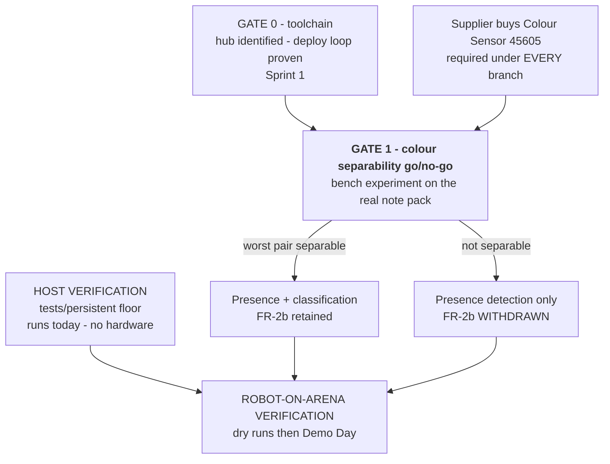

# Verification Plan

> **Type:** ACTIVE-SPEC · **Created:** 2026-08-25
> **Feeds:** Intro Report §5 (Verification and Results) — [../course/report/outline.md](../course/report/outline.md)
> **Requirements of record:** [../scope.md § Requirements](../scope.md#requirements) ·
> **Traceability:** [requirements-traceability.md](./requirements-traceability.md) ·
> **Operations:** [conops.md](./conops.md) · **Risks:** [risk-register.md](./risk-register.md) ·
> **Coverage options if the arena is large:** [2026-08-25-coverage-strategy-trade-study.md](./2026-08-25-coverage-strategy-trade-study.md)

**Nothing in this plan that needs hardware has been executed.** The hub has never been connected, no
sensor has been bought, and `tests/persistent/` is empty. The only cases with evidence today are the
resource-requirement inspections in §5 (VC-RR-1/2/3/5) — they read a ledger and a host, not a robot.
This document says *how* each requirement will be proven and *what observable* counts as passing. Any
number appearing as a pass criterion is a **criterion**, not a measurement — measurements go in `docs/findings/` after they are taken, never here
([../directives/honest-instrumentation.md](../directives/honest-instrumentation.md)).

---

## 1. Methods

The standard four. Every verification case below names exactly one primary method.

| Method | Means | Used here for |
|---|---|---|
| **I — Inspection** | Examine the artifact — code, ledger, port map, firmware identity — without executing the system | TR-1, TR-5, RR-1…RR-5, FR-4 display sequence |
| **A — Analysis** | Reason from measured inputs and geometry to a conclusion the system is not run to prove | FR-1 termination, FR-6 error budget, coverage arithmetic |
| **D — Demonstration** | Operate the system and observe that it does the thing, without instrumenting it | FR-1, FR-4, FR-5, FR-6, TR-3 |
| **T — Test** | Execute against defined inputs and compare to defined expected outputs | FR-2, FR-3, TR-2, TR-4, and the G1 bench experiment |

## 2. Two environments, and only one of them is available

| Environment | What it is | Available? |
|---|---|---|
| **HOST** | Ubuntu 22.04, `python3`, `src/` imported directly, synthetic reading streams. No hub, no sensor, no arena. | **Yes — today** |
| **ROBOT/ARENA** | Assembled robot, hub running the program standalone, real notes on the real floor under the real lights. | **No.** Blocked on: hub never connected · API generation unknown · **no colour sensor owned** · arena undefined (**Q1/Q3/Q7**) |

**Say this plainly in the report:** roughly a third of the requirements can be verified on the host with
no hardware at all, and that is a direct consequence of [ADR-0002](../decisions/0002-split-mission-logic-from-hub-io.md).
Seven of the seventeen — FR-1, FR-2b, FR-4, FR-6, TR-1, TR-3, TR-5 — **cannot begin** until the hub is
connected, the sensor is bought, or the arena is known. RR-4 is blocked on information nobody has looked
up (which two motors we own), not on hardware, and the other four resource requirements are inspections
runnable today. That is not a scheduling excuse; it is the reason ADR-0002 exists, and the reason the
host-side floor is written first rather than last.

---

## 3. GATE 1 — colour separability go/no-go **(run this before any sweep tuning)**

**VC-G1.** Method **T** (bench). Source: [../research/color-discrimination.md § 8](../research/color-discrimination.md)
item 5 — *"this is the go/no-go for the whole colour requirement and belongs before any sweep code,
while the team can still ask for a different pack."*

**Why it is first.** It can **invalidate FR-2b outright**. Sticky notes are matte and pastel — the worst
case for the sensor. If the colours in the actual pack are not separable at the mounting height we can
actually build, then no amount of sweep tuning, threshold work, or classifier code will make FR-2b
achievable, and every hour spent on it before this experiment is at risk. It is also the cheapest
experiment in the project: stationary robot, one sensor, a stack of notes, twenty minutes.

**Classification: this is a `scripts/` diagnostic, not a test** ([../directives/testing-discipline.md](../directives/testing-discipline.md)).
It does not gate a commit; it gates a requirement.

### 3.1 Prerequisites — all currently unmet

| # | Prerequisite | Owner | Status |
|---|---|---|---|
| 1 | **Colour Sensor 45605 purchased** | **Supplier** | ⚠ **Not owned.** 56 SB remaining |
| 2 | Hub OS / API generation identified, read-only | Programmer writes, **Builder operates** | Not done — [../runbooks/hub-identification.md](../runbooks/hub-identification.md) |
| 3 | Sensor mounted at a known, recorded height in running attitude | **Builder** | Blocked on 1; mounting blocks not owned |
| 4 | The **real** note pack, and the closest available approximation of the arena floor | Supplier / Instructor | Note pack unseen; **Q7** unanswered |

> **Recommendation to the Supplier:** buy the Colour Sensor 45605 at the earliest class opportunity.
> It is required under **every** branch of the decision tree above — presence detection needs it just as
> much as classification does — so it is the one purchase no professor answer can make wrong. Defer the
> distance sensor until **Q3** is answered ([requirements-traceability.md § 5](./requirements-traceability.md) G-1).

### 3.2 Procedure

1. **Fix and record the mounting height** `h`. Start inside the range the research analyses (12–24 mm)
   and write the actual value down; it is an input to every number produced here.
   [../research/color-discrimination.md § 5](../research/color-discrimination.md).
2. **Ambient conditions, recorded before any reading:** room, time of day, lighting (overhead / window /
   mixed), floor surface, and whether spectators cast shadow. Take a control set with the room lights off.
3. **Robot stationary, in running attitude** (motors powered, on its wheels — not held in a hand).
4. For **each surface** — bare floor, plus **every** note colour in the pack — capture **N samples**
   (research suggests on the order of the run-start calibration sample count; record the actual N) of the
   sensor's raw channel output, at **four robot headings** 90° apart, to expose directional shadow.
5. Reduce each class to a **median and a MAD spread** per channel, normalised for total intensity
   ([../research/color-discrimination.md § 4](../research/color-discrimination.md)). Median and MAD, not
   mean and stdev — one stray sample must not move the answer. `src/calibration.py` already
   implements both.
6. **Print the full pairwise separation matrix** — every class against every other class, including
   floor-vs-each-colour. Not a summary; the matrix.
7. Repeat steps 4–6 at the other heights in the ladder, and keep the height with the best **worst pair**,
   not the best average.

### 3.3 Pass criterion — stated as an observable

Let `d(A,B)` be the separation between two class medians in the normalised space, and `s(A)` the class's
MAD spread.

| Outcome | Observable | Consequence |
|---|---|---|
| **PASS** | For **every** pair in play, `d(A,B) ≥ M × (s(A) + s(B))` at a single achievable height | FR-2b is viable. Record the height, the matrix, and the classifier bands. |
| **MARGINAL** | The criterion holds for all pairs except one, at every height | Ask the Supplier/Instructor for a pack **without** the offending colour before writing a classifier. That request is only possible *before* Demo Day week. |
| **FAIL** | Any pair fails at every height, **or** floor-vs-target reflected contrast is below `config.MIN_CONTRAST` | ⚠ **FR-2b is withdrawn**, not deferred. Fall back to presence detection. |

- **`M` is a decision, not a measurement.** `M = 3` is proposed `[ASSUMED]` and needs the operator's
  sign-off before the experiment runs — pick it *first*, so the result cannot be argued backwards from
  the data.
- `config.MIN_CONTRAST = 12.0` reflectance points is likewise a **placeholder bound** in
  `src/config.py`, marked as such. Replace it with a value justified by this experiment.

### 3.4 Why a FAIL is cheap

Classification is architected as a **layer on top of** presence detection and never a prerequisite for
counting ([../findings/coverage-time-budget.md](../findings/coverage-time-budget.md)). A FAIL deletes
FR-2b and the unwritten classifier; it deletes **nothing already built**, and it *raises* the achievable
traverse speed. Recording that outcome honestly is worth more in the report than a classifier that
half-works on Demo Day.

### 3.5 Evidence

`docs/findings/color-separability.md` — height, N, lighting, surface, the **full matrix**, the chosen
`M`, and the go/no-go call with the date. Add the row to [../findings/INDEX.md](../findings/INDEX.md).
If the experiment does not run, that file does not exist — no placeholder, no projected numbers.

---

## 4. HOST verification — runnable today, no hardware

Target: `src/` only. Floor lives in `tests/persistent/` (**currently empty — this is the single
largest verification gap that costs nothing to close**). Rules:
[../directives/testing-discipline.md](../directives/testing-discipline.md) — a small protected floor,
never loosened to make a change pass.

| Case | Req | File | Inputs | **Pass criterion (observable)** |
|---|---|---|---|---|
| **VC-TR-2** | TR-2 | `test_import_boundary.py` | Import every module in `src/` with the hub-only names (`hub`, `motor`, `motor_pair`, `color_sensor`, `distance_sensor`, `force_sensor`, `motion_sensor`, `runloop`) poisoned so any import of them raises | Every module imports cleanly; **zero** poisoned names touched. Closes gap **G-4** — turns a docstring rule into an enforced one |
| **VC-TR-4a** | TR-4, FR-2 | `test_calibration.py` | `floor_samples`, `target_samples` with a contrast **below** `MIN_CONTRAST` | Raises `CalibrationError`. It must **fail loud**, never return a threshold |
| **VC-TR-4b** | TR-4 | `test_calibration.py` | Bright-target-on-dark-floor **and** dark-target-on-bright-floor sample sets | `polarity` is `+1` and `−1` respectively; in both cases `on_threshold > off_threshold` and `signal()` puts on-target higher. Polarity is **detected, not configured** |
| **VC-TR-4c** | TR-4 | `test_calibration.py` | A floor sample set containing one extreme outlier | `median`/`median_absolute_deviation` results move by less than the outlier would move a mean — robustness is the reason the code avoids `mean`/`stdev` |
| **VC-FR-2** | FR-2 | `test_calibration.py` | Separable floor/target sets | Derived `on_threshold` lies strictly between the two medians **in signal space** (`signal(x) = x × polarity`; for a dark target on a bright floor both thresholds are negative, so comparing them against the raw medians is meaningless), and `on_threshold − off_threshold` equals `HYSTERESIS_FRACTION × contrast` |
| **VC-FR-3a** | FR-3 | `test_detector.py` | One clean target crossing | `count == 1`, one `ACCEPTED` event |
| **VC-FR-3b** | FR-3 | `test_detector.py` | Two targets, **one with a single-sample dropout in the middle** | `count == 2`, **not 3**. This is the `MAYBE_OFF` absorption behaviour, hand-checked 2026-08-25 and currently protected by nothing |
| **VC-FR-3c** | FR-3 | `test_detector.py` | Two adjacent targets separated by a gap of exactly `MIN_DWELL_SAMPLES` | `count == 2` — the classic merge failure |
| **VC-FR-3d** | FR-3 | `test_detector.py` | A single-sample noise spike above `on_threshold` | `count == 0` **and no `Event` at all** — a blip that never survives `MIN_DWELL_SAMPLES` is discarded in `MAYBE_ON` before an event exists. Assert what the code does, not what the module docstring implies |
| **VC-FR-3d2** | FR-3 | `test_detector.py` | A crossing that clears the dwell but is narrower than the width gate, with `EdgeCounter(min_width=…)` set **above** `min_dwell` | `count == 0`; one rejected event with reason `too_narrow` — **rejected with a reason, never silently dropped**. ⚠ Unreachable at the `config.py` defaults: `MIN_DWELL_SAMPLES` = `MIN_EVENT_SAMPLES` = 2, so every confirmed event is already ≥ 2 samples wide and the `too_narrow` branch can never fire. Either the test sets `min_width` itself, or `config.py` needs a width gate that can actually reject |
| **VC-FR-3e** | FR-3 | `test_detector.py` | A plateau longer than `MAX_EVENT_SAMPLES` (a seam, or two merged notes) | `count == 0`; rejected with reason `too_wide` |
| **VC-FR-3f** | FR-3 | `test_detector.py` | Stream that **ends** while still on-target | `finish()` closes exactly one event; no target is lost at end of stream |
| **VC-FR-1** | FR-1 | `test_sweep.py` | `SweepPlan` driven by repeated `next_command()` | Reaches `DONE` in a **finite** number of commands for any positive arena; every lane is emitted exactly once with `detect=True`; `CMD_STOP` is terminal. **Analysis** of termination, not a demonstration |
| **VC-FR-5a** | FR-5 | `test_sweep.py` | Plan already in `DONE` | Every subsequent `next_command()` returns `CMD_STOP`. No restart, no drift past the end |
| **VC-PR-2** | (PR-2) | `test_sweep.py` | `lane_count()` / `lane_pitch_mm()` over a range of arena widths | `lane_count × pitch ≥ width` always; `lane_pitch_mm()` raises when cross-track error makes guaranteed coverage impossible. **This is the coverage-guarantee analysis, executable** |
| **VC-FR-4a** | FR-4 | `test_result.py` | Detections added with and without a colour | `classified + unknown == detected` holds; `check()` **raises** when it does not. UNKNOWN is never folded into a colour |

**How to run:** the floor is host-only Python over `src/`; no hub, no network, no fixtures.
**It should be runnable on 27 AUG.** Evidence: the runner's output pasted into the Sprint 1 close-out
session record, plus a `docs/findings/` entry the first time a test catches a real defect.

**Honest limitation.** Every case above verifies the logic against **synthetic** streams. It proves the
state machine does what it was designed to do. It proves **nothing** about whether the real sensor,
on the real floor, produces streams of that shape. That is what §5 is for, and the distinction must be
preserved in the report — a green floor is not a working robot.

---

## 5. ROBOT-ON-ARENA verification — cannot begin yet

**Every case that involves the robot is blocked.** Prerequisites: the hub connected and identified · the
deploy route proven · the colour sensor bought and mounted · the arena defined (**Q1**, **Q3**, **Q7**).
The Builder is the only operator for every case that touches the robot ([conops.md § 2](./conops.md));
the Programmer may only plug and unplug. **The exception is the four resource inspections at the foot of
the table** — VC-RR-1, VC-RR-2, VC-RR-3 and VC-RR-5 read the ledger and the host, need no robot and no
operator, and can be run today. VC-RR-4 is blocked on which two motors we own, not on hardware.

| Case | Req | Method | Procedure | **Pass criterion (observable)** | Evidence |
|---|---|---|---|---|---|
| **VC-TR-1** | TR-1 | **I** | Read-only hub identification. **Never accept an update prompt** — [../runbooks/hub-identification.md](../runbooks/hub-identification.md) | Reported firmware identifies as stock LEGO Hub OS; the API generation is named in writing; the hub is in the same software state afterwards as before | `docs/findings/` hub identification entry |
| **VC-TR-3** | TR-3 | **D** | Deploy the program, **unplug the cable**, press run on the hub | The program runs to completion with no cable attached and no host process alive | Sprint 1 close-out — [2026-08-25-sprint-1-walking-skeleton.md](./2026-08-25-sprint-1-walking-skeleton.md) item 10 |
| **VC-TR-5** | TR-5 | **I** | Grep the source for port literals | **Zero** port literals outside `src/`; every one traces to [../hardware/port-map.md](../hardware/port-map.md); the physical build matches the map. Blocked while the map is empty (gap **G-5**) | Port map + inspection note |
| **VC-TR-4d** | TR-4 | **D** | Calibrate on surface A, then move the robot to a materially different surface B and calibrate again — **no code edit, no re-deploy** | Both calibrations arm successfully and produce **different** thresholds. Both pairs of values recorded with their surfaces and lighting | `docs/findings/` calibration entry |
| **VC-FR-2b** | FR-2b | **D** | Only if **VC-G1 passes.** Present each colour in the pack under the sensor in running attitude | Each presented colour is reported as itself; a deliberately off-pack colour is reported **UNKNOWN with a reason**, never forced into a class | Run record |
| **VC-FR-3g** | FR-3 | **D** | Timed run over a **known** layout placed by someone other than the operator | Robot count == true count, over ≥3 consecutive runs. The operator's independent beep tally is recorded **before** comparison — three numbers, written down separately (gap **G-2**) | Run record, [../runbooks/demo-day.md § 7](../runbooks/demo-day.md) |
| **VC-FR-1** | FR-1 | **D** | One press; hands off for the whole run | The run starts, completes, and stops with **exactly one** operator input. Any second input is a failure of this case even if the run succeeds | Run record |
| **VC-FR-4b** | FR-4 | **I + D** | Compare the DONE display against the sequence the Programmer wrote down and the Builder countersigned (gap **G-3**) | Total, per-colour counts, and the UNKNOWN count are **all** readable from the matrix, in the agreed order, with no laptop, by someone standing at the arena edge | Signed display sequence + run record |
| **VC-FR-5b** | FR-5 | **D** | Press the stop input mid-run | Motors stop within one command; the hub does not fault; the robot is safe to pick up. **`UNVERIFIED`** — the button behaviour itself has never been observed | Run record |
| **VC-PR-1** | (PR-1) | **A** | Compute predicted sweep duration from the **measured** traverse speed and the arena size once **Q1** lands — `sweep.py estimated_seconds()`. Strategy options if it does not fit: [2026-08-25-coverage-strategy-trade-study.md](./2026-08-25-coverage-strategy-trade-study.md) | Predicted duration ≤ the demo time limit (**Q2**). If it is not, this is a **design** change, not a tuning one — [../findings/coverage-time-budget.md](../findings/coverage-time-budget.md), risk **R-01** | `docs/findings/` timing entry |
| **VC-FR-6a** | FR-6 | **A** | Error-budget analysis: measured cross-track error (UMBmark square-path run) × lane count vs arena size — [../research/detection-and-sweep-techniques.md](../research/detection-and-sweep-techniques.md) | Predicted worst-case lateral excursion at the last lane is **less than** the distance from the last lane to the boundary. Requires a **measured** cross-track error, not the `[ASSUMED]` 15 mm in `config.py` | `docs/findings/` odometry entry |
| **VC-FR-6b** | FR-6 | **D** | Full-arena run, observed | The robot does not cross the boundary in ≥3 consecutive runs. ⚠ **Weak evidence** — it verifies the arena it ran on and nothing more, because there is no boundary-sensing design element (gap **G-1**) | Run record |
| **VC-RR-1** | RR-1 | **I** | `./inventory.py --verbose` | Balance ≥ 0 and every line has a price actually paid | Report §6 table |
| **VC-RR-2** | RR-2 | **I** | Host audit | Toolchain is free/open and runs natively on Ubuntu 22.04 | [../findings/host-environment.md](../findings/host-environment.md) |
| **VC-RR-3** | RR-3 | **I** | BOM review | Every sensor is on the store list | `inventory.py` |
| **VC-RR-4** | RR-4 | **I** | Identify the two motors already owned | Each is a 45602 or 45607, named in the build record. ⚠ **Cannot run today — which two we own is UNKNOWN.** Ask the Supplier/Builder | [../hardware/build-record.md](../hardware/build-record.md) |
| **VC-RR-5** | RR-5 | **I** | Ledger review | Each entry's unit price is the price paid on that date; no price list is hard-coded anywhere | `inventory.py` |

## 6. Evidence ledger

Verification evidence goes to **`docs/findings/`**, one file per experiment, each with the measurement,
its units, and its conditions — never the conclusion alone. Add every file to
[../findings/INDEX.md](../findings/INDEX.md).

| Expected file | Produced by | Exists? |
|---|---|---|
| `color-separability.md` | VC-G1 | No |
| hub identification entry | VC-TR-1 | No |
| calibration values per surface | VC-TR-4d, [../runbooks/demo-day.md § 4](../runbooks/demo-day.md) | No |
| odometry / cross-track error | VC-FR-6a (UMBmark) | No |
| one run record per dry run and for Demo Day | VC-FR-1/3g/4b/5b/6b | No |
| [host-environment.md](../findings/host-environment.md) | RR-2 | **Yes** |
| [coverage-time-budget.md](../findings/coverage-time-budget.md) | Coverage analysis | **Yes** |

**Demo Day (10 SEP) is unrepeatable.** Assign someone to fill the run record on the spot, before the next
team's turn. A remembered number is not evidence.

## 7. Sequence against the calendar

| Date | Verification work that is actually possible | Gate |
|---|---|---|
| **27 AUG** | Whole §4 host floor written and run. VC-TR-1 if the hub gets connected. Ask **Q1–Q5**. Supplier buys the colour sensor. | GATE 0 |
| **1 SEP** | **VC-G1 runs** as soon as sensor + hub exist. VC-TR-3 standalone run. | **GATE 1** |
| **3 SEP** | VC-TR-4d, VC-FR-6a odometry measurement, first timed dry runs. Re-tune from measured data only. | — |
| **8 SEP** | **Last chance.** Full VC-FR-1/3g/4b/5b/6b dry runs; the real readiness check is the *end* of this class — the robot goes back in the box afterwards ([../runbooks/demo-day.md § 2](../runbooks/demo-day.md)). | — |
| **10 SEP** | Demo Day. Record everything on the spot. | — |
| **18 SEP** | Report §5 written **from `docs/findings/`**, with the unverified requirements named as unverified. | — |

## 8. What this plan does not promise

- **Nothing that needs hardware has run.** Zero requirements are verified against hardware
  ([requirements-traceability.md § 7](./requirements-traceability.md)); the resource inspections are the
  only cases with evidence today, and what they verify is paperwork.
- **The host floor cannot verify FR-1, FR-4, FR-6, TR-1, TR-3, TR-5, or any RR.** It verifies logic.
- **VC-G1 has an unmet purchase prerequisite** and may slip past the point where a different note pack
  can still be requested. That is a schedule risk owned by the Supplier, and it should be raised in
  writing rather than discovered on 8 SEP.
- **If a case cannot run, its result is `UNKNOWN` — never `PASS`.** A verification matrix full of green
  on an unconnected hub is the exact failure this project has blacklisted.
