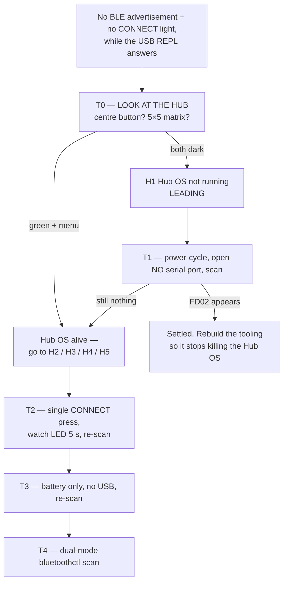
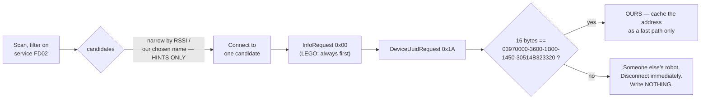
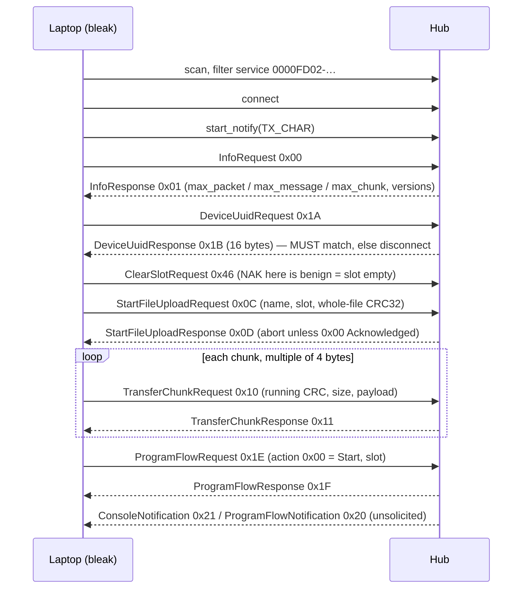

# BLE bring-up — why the hub is not advertising, how to find OUR hub, and how to connect

**Type:** EXTERNAL research · **Created:** 2026-08-27 · **Status:** open — **nothing here was run on the
hub.** The hub was live on `/dev/spike` for another session throughout; no serial port was opened, no
scan was run, no BLE call was made by this document.
**Answers the operator's question:** *"I pressed the hub's Bluetooth button and got no light, and a
12-second scan saw 581 devices and zero LEGO. What is going on?"*
**Supersedes** parts of [./bluetooth-control-plane.md](./bluetooth-control-plane.md) — see § 6.1 there
and the superseded-claims register in § 7 below.
**Sources:** LEGO's own protocol repository and its issue tracker, the Bluetooth SIG assigned-numbers
file, MicroPython v1.24.0 C source, our own hub's USB-read ground truth
([../findings/hub-first-contact-2026-08-27.md](../findings/hub-first-contact-2026-08-27.md)), and
read-only host facts computed today. Every source is named at the point of use; § 9 is the full list.

---

## ⚠ READ THIS BEFORE TOUCHING THE HUB'S BLUETOOTH BUTTON

**Holding the Bluetooth (CONNECT) button while USB is being plugged in puts the hub into DFU mode.**
That is the documented gesture, verbatim from the `gpdaniels/spike-prime` firmware README:

```
1. Turn the hub off and disconnect the USB wire from your computer.
2. Hold down the bluetooth button and plug in the USB wire to your computer.
3. Keep holding the bluetooth button until it starts flashing in a cycle (pink-green-blue-off).
4. The hub is now in DFU mode.
```

DFU / bootloader entry is item 2 on [../directives/hardware-safety.md](../directives/hardware-safety.md)
and is permanently forbidden by [ADR-0001](../decisions/0001-stock-lego-firmware-only.md). So:

- **Single presses only** on the CONNECT button. Never a press-and-hold.
- **Never hold CONNECT while the hub is powering on, or while USB is being plugged or unplugged.**
- **Colour collision, watch for it.** LEGO documents a *flashing violet/green/blue* connection button as
  "Hub OS was updated, restart the hub". The DFU cycle above is *pink-green-blue-off*. Those are the same
  three colours. **If the hub ever shows a three-colour cycle, stop and unplug it — do not assume it is
  the restart prompt.**

The operator has already reported press-and-holding this button. That was done with USB attached and the
hub already on, which is not the DFU gesture — but the two differ only by timing, so the rule above is
now standing.

---

## ⬛ HARDWARE OBSERVATIONS, 2026-08-27 — and a claim RETRACTED

**The hub WAS made to advertise. What made it do so is NOT established, and an earlier version of
this section over-claimed that it was. That over-claim is retracted here rather than edited away.**

### What was actually observed

| Step | Serial port | CONNECT pressed | Result |
|---|---|---|---|
| Scans during probing | probes had been running | no | 581 devices, **zero LEGO** |
| After power cycle | untouched | **yes** | **hub appeared immediately** |
| Scan, 12 s | untouched | no | nothing |
| Scan, **120 s** | **untouched** | no | **nothing** |

```
64:8C:BB:0A:1C:8C  rssi -49 dBm  "Team 21"
    service   0000fd02-0000-1000-8000-00805f9b34fb
    mfr 0x0397 (LEGO)  0101000a1c8c
```

### The retraction

An earlier version of this section concluded **"USB probing and Bluetooth are mutually exclusive on
this hub"** and wrote it up as an operational rule. **That is not supported by this data.**

The successful run changed **two variables at once** — a power cycle *and* a CONNECT press — so it
cannot attribute the effect to either. And the last two rows refute the probing explanation directly:
**nothing held the serial port for 120 seconds and the hub still did not advertise.** If interrupted
probes were the cause, staying off the port should have been sufficient. It was not.

**The explanation that fits every row is simpler: the hub advertises only for a short window after a
CONNECT button press.** No probe behaviour is needed to explain any of it.

The Ctrl-C mechanism also lacks a plank, per this document's own research: MicroPython does not
de-initialise the BLE stack or clear LEDs on `KeyboardInterrupt`.

**The experiment that would actually settle it** — change one variable at a time:

1. Power-cycle. Touch no serial port. Press CONNECT. Scan. *(expected: appears)*
2. Power-cycle. **Run one probe.** Press CONNECT. Scan. *(appears → probing is irrelevant;
   silent → probing suppresses it)*

Until step 2 is run, treat probing-versus-BLE as **UNKNOWN**, not as a rule.

### What IS supported

- **The hub advertises the FD02 service and LEGO manufacturer data `0x0397`.** The `0x0397` leg of
  `probes/ble_scan.py`'s filter was flagged in research as a possibly-Powered-Up-only convention;
  **our own hub emits it**, so for this hub the filter leg is confirmed by measurement.
- **`device_uuid` is NOT in the advertisement**, and there is a structural reason: `device_uuid` is
  `03970000` + the STM32F413 die ID, whereas the BLE address comes from a **separate TI CC2564C
  radio**. There is no derivation path between them. Identity must be confirmed *after* connecting,
  via `InfoRequest 0x00` → `DeviceUuidRequest 0x1A`, comparing 16 bytes.
- **The advertising window is short and self-terminating** — two later scans, one of them 120 s,
  saw nothing.

### A second retraction: the BLE address may not be stable

An earlier version read the top bits of `0x64` as `01` and concluded a **public** address, therefore
stable. **That reasoning is invalid.** Those bits classify *random* addresses only, and on a random
address `01` means **resolvable private — which rotates.** Nothing observed tells us the address
*type*, and every source claiming "the SPIKE MAC is stable" turned out to describe Bluetooth Classic
RFCOMM or Hub OS 2 tooling, which says nothing about LE.

**So: address type UNKNOWN, and the MAC may rotate.** This costs only a cached fast path, not
correctness, provided any client re-verifies the device UUID over the connection every time —
which the procedure above already does. **Do not build identification on the MAC alone.**

**`"Team 21"` is a user-settable display name and is not evidence the hub is ours.**

---

## Summary — the answer, and how confident it is

**The single most likely explanation is that LEGO's Hub OS application was not running when the scan was
taken, because our own probes stop it.** Every probe in this repo sends `Ctrl-C` (`0x03`) twice at
`/dev/spike` before it does anything else —
[`probes/_hubio.py`](../../probes/_hubio.py) lines 79-83, and `scripts/identify_hub.py` lines 74-78, with
the author's own comment *"a busy loop can eat the first"*. The Hub OS owns the BLE control plane, the
CONNECT button handler and the CONNECT button light. Stop it and there is nothing left in the running
system to advertise, to answer the button, or to light it.

**Confidence: LEADING, NOT PROVEN.** This is `[INFERRED]`. It rests on one verified plank and two
extrapolations, and an earlier draft of this analysis overstated it badly enough that a verifier refuted
it. The honest breakdown:

| | Status |
|---|---|
| The hub exposes exactly **one** USB CDC virtual COM port, and LEGO's COBS protocol runs on that same port at 115200 — so a MicroPython `>>>` on it means the Hub OS is **not** driving it | **Confirmed.** See § 1.2. This is the one solid plank. |
| Therefore the Hub OS was stopped at the moment of the scan | **Inferred.** Follows from the above only if the Hub OS is the only other thing that could own the port. |
| Therefore the radio went silent | **Assumed, and the mechanism is wrong.** A `KeyboardInterrupt` unwinds Python; it does **not** call `gap_advertise(None)` or `BLE.active(False)`. Advertising, once started, is carried by the C stack and the link-layer controller. See § 7.1. |
| Therefore the CONNECT LED went dark | **Assumed.** MicroPython LEDs hold their last written state after an interrupt. Nothing clears them. |
| The "no light" observation happened **after** the `Ctrl-C` | **Not established.** [The finding](../findings/hub-first-contact-2026-08-27.md) records the observation with no timestamp relative to the 10:06:36 probe run. If the button was dark *before* any probe touched the port, this hypothesis is not merely unproven — it is inverted. **Ask the operator. It is free.** |

**So the honest sentence is:** *the Hub OS was probably not running, which is consistent with all three
symptoms; but "our Ctrl-C extinguished the radio and the LED" is an assertion, not a mechanism we can
source.* Six other explanations are alive and ranked in § 1.

**The decisive next step costs nothing and touches nothing: look at the hub.** LEGO documents the centre
button as **solid green** for any powered hub running a compatible Hub OS, and documents **no dark state
at all** for a healthy powered hub. If the centre button and the 5×5 matrix are both dark while the REPL
still answers, the Hub OS is dead and everything else is moot. That is test T0 in § 1.3.

**Two other headline answers, up front:**

- **Our hub IS matchable over BLE — but only after connecting, never from the advertisement.** LEGO
  documents exactly one thing about a SPIKE Prime advertisement: it carries the service UUID. The
  16-byte `device_uuid` we read over USB is a *post-connection message* (`DeviceUuidRequest` 0x1A →
  `DeviceUuidResponse` 0x1B), and it physically cannot be in the advertisement — it is the STM32 die ID,
  while the BLE address comes from a separate TI radio part. Plan: filter on FD02 → connect → ask 0x1A →
  compare 16 bytes. § 2.
- **Do not build our own GATT service on the hub.** The project's earlier inference — *"a hub program
  cannot open its own radio"* — is **dead**; it was drawn from an absence in a third-party module list,
  and our own `dir(bluetooth.BLE)` shows the complete GAP+GATT surface. But the corrected conclusion is
  **"must not", not "can"**, and it costs more than it buys. § 4.

---

## 1. Why is the hub not advertising? Ranked, with the test that settles each

### 1.1 What was actually observed

- `probes/ble_scan.py`, 12 s: **581 advertising devices, zero LEGO** by any of its three filters.
- The hub was **connected via USB** and **powered on with a working REPL** at the time.
- The operator **pressed and press-and-held** the Bluetooth button and saw **no light on it**.
  Ordering relative to the probe run: **unknown**.

### 1.2 What is already confirmed, and what it rules out

**The scan instrument is sound. Stop debugging bleak.**
`probes/ble_scan.py` calls `BleakScanner.discover(timeout=..., return_adv=True)` with no `scanning_mode`
and no BlueZ `or_patterns`. Confirmed on this host: installed **bleak 3.0.2**, and
`BleakScanner.__init__` signature carries `scanning_mode: Literal['active','passive'] = 'active'`. So the
scan was an **ACTIVE, controller-unfiltered** scan — it solicited scan responses too. Seeing 581 devices
proves the adapter, BlueZ and bleak all work.
**Fix the probe's docstring:** it says *"This is a PASSIVE SCAN"* three times, meaning *"it never
connects"*. That is a mislabelled instrument in a graded engineering record — exactly what
[../lessons_learned/say-which-kind-of-verified.md](../lessons_learned/say-which-kind-of-verified.md)
exists to prevent. Reword to "read-only scan; never connects".

**One port, and it cannot be two things at once.** Read from sysfs today, no port opened:

```
/sys/bus/usb/devices/3-6/   idVendor 0694   idProduct 0009   bNumInterfaces 2
                            manufacturer "LEGO System A/S"   product "SPIKE Prime VCP"
/dev/spike -> ttyACM0       (and /dev/ttyACM0 is the only ACM node)
```

`0x0694` = 1684 and `0x0009` = 9 — exactly the VID/PID a LEGO maintainer gives for the hub's serial
interface (`LEGO/spike-prime-docs` issue #11, SteffenLEGO: *"the vendor id is 1684 and that the product id
is 9. We use 115200 for the baud rate"*, and *"it's exactly the same over USB and BLE"*). Two interfaces
is precisely one CDC-ACM function (Communications + CDC-Data), so there is genuinely **one** virtual COM
port, not merely one `/dev/ttyACM*` node. One VCP cannot simultaneously be LEGO's COBS protocol endpoint
and a friendly MicroPython REPL. **We got the REPL. So the Hub OS was not driving that port.**

**Weaker than it was claimed to be:** the transcript
([`docs/findings/_hub-identify-20260827T100636.transcript.txt`](../findings/_hub-identify-20260827T100636.transcript.txt))
shows the MicroPython banner immediately after the `Ctrl-C`, which an earlier draft called *"the signature
of a program having been interrupted"*. It is **suggestive with an unexplained anomaly**: there is no
`Traceback ... KeyboardInterrupt` anywhere in the capture, and MicroPython's `pyexec` prints the exception
before returning to the friendly REPL. The 4096-byte read would have caught it. Do not lean on the banner.

**Only one of the scan's three filters is grounded.** LEGO's `connect.rst` says only: *"The hub includes
the service UUID in the advertisement data, so that it can be used to filter scan results."* It says
**nothing** about manufacturer data or an advertised name for a Hub OS 3 hub. The `0x0397` company-ID leg
and the name-keyword leg of `looks_lego()` are **Powered Up / LWP3 conventions** and may be structurally
vacuous here. Restate the result as: **"no device advertised LEGO's documented FD02 service in 12 s"** —
one grounded negative, not three agreeing tests. (§ 2.4 has the probe fixes.)

### 1.3 The ranked hypotheses



| # | Hypothesis | Rank | Why | Discriminating test |
|---|---|---|---|---|
| **H1** | **The Hub OS application is not running** — stopped by our own double `Ctrl-C`, or never foregrounded | **Leading** `[INFERRED]` | One CDC port cannot serve both the COBS endpoint and a REPL (§ 1.2). Also: `docs/archives/hub-baseline/06-runtime-state.txt` records `mem free 211776 alloc 2048` — a running Hub OS with a live BLE stack, UI and program supervisor does not fit in 2 KB. **But** the mechanism by which an interrupt takes down the radio and the LEDs is unsourced (§ 7.1) | **T0**, then **T1** |
| **H2** | **Advertising is button-gated and the press never reached a running Hub OS** (or the advertising window is bounded and expired) | Medium `[UNVERIFIED]` | LEGO's user-facing instruction is *"Press your Hub's Bluetooth Button to enable Bluetooth"*; LEGO's own developer protocol docs describe scanning for FD02 with **no** button step. Two LEGO sources conflict. Only a bench test on our hub resolves it | **T2** (single press on a hub confirmed alive), then **T1** vs **T2** comparison |
| **H3** | **Already connected to another central** — a connected peripheral stops advertising | Low | Real BLE behaviour, and LEGO's spec allows 4 BLE + 1 BTC connections. Against: LEGO documents a **solid blue** CONNECT LED for exactly this state and the operator saw none; `/flash/program` is empty; no LEGO app on this host | **T0** (solid blue?) and **T1** (a power cycle drops any link) |
| **H4** | **USB presence suppresses advertising on this firmware** | Low `[SPECULATION]` | This is the repo's current `[INFERRED]` guess in [the finding](../findings/hub-first-contact-2026-08-27.md) § 4a. **No primary or secondary source found either way.** LEGO's docs point mildly *against*: USB and BLE are two transports for one identical protocol, and LEGO's support material routinely tells users to compare a working USB connection against a failing Bluetooth one, which presupposes coexistence. **Demoted below H3** from where an earlier draft put it. Also: it is untestable until H1 is cleared, because a REPL owned the port during the scan | **T1** (USB attached throughout — if FD02 appears, H4 is refuted in the same measurement), then **T3** |
| **H5** | **A persisted setting in `/flash/config` disables BLE** | Low | `/flash/config` is a directory (`os.stat` mode 16384) and our record says it was deliberately **not** inspected. That is a genuine gap and it is free to close. **Correction:** an earlier draft cited `pybricks/support#1123` as community evidence that stock BT cannot be turned off. That issue is a **Pybricks feature request** about **Pybricks firmware** — the firmware this project has permanently blacklisted. It says nothing about stock Hub OS 3 and is struck (§ 7.2) | **T5** (read-only listing, from the REPL the operator already owns) |
| **H6** | **LEGO's documented stuck-Bluetooth-stack state**, cleared by a 20-second centre-button restart | Low | LEGO: *"The Connection Button is flashing violet/green/blue. Your Hub OS has been recently updated, and your Hub needs to be restarted"* — by holding the **centre** button ~20 s. Against: the tell is a flashing button and the operator saw nothing. Its remedy is folded into T1 anyway. ⚠ See the DFU colour collision at the top of this file | **T1** first; **T6** only if everything else fails |
| **H7** | **BR/EDR only** — `bleak` is LE-only and would be blind | Very low | The hub is dual-mode (LEGO spec lists BTC 4.2 **and** BLE 4.2). But Hub OS 3 + SPIKE App 3 unambiguously use BLE GATT FD02, and LEGO's web app uses Web Bluetooth, which is BLE-only. [./bluetooth-control-plane.md](./bluetooth-control-plane.md) § 2 already establishes Hub OS 2 = BT Classic RFCOMM + JSON-RPC vs Hub OS 3 = BLE GATT, and that a BLE scan is itself the generation test. Our hub is measured Hub OS 3 | **T4** — one free dual-mode scan closes it permanently |
| **H8** | **Button or radio hardware fault** | Lowest | Only reachable after everything above is eliminated. Cheap partial check: read the button from the REPL | **T7** |

### 1.4 The test sequence — run in this order

**DO NOT RUN, ever, in any of these tests.** Listed first deliberately, so it is read first:

> `hub.config["hub_os_enable"] = False` · `machine.soft_reset()` · `machine.reset()` ·
> `machine.bootloader()` · `bluetooth.BLE().active(True)` · `.irq()` · `.gatts_register_services()` ·
> `.gap_advertise()` · accepting any "Hub update required" prompt · **any press-and-hold of the CONNECT
> button** · **holding CONNECT while USB is plugged in or the hub powers on**.
>
> `hub_os_enable = False` would plausibly remove the LEGO layer entirely on shared course equipment. The
> `machine.*` resets are already forbidden by [ADR-0001](../decisions/0001-stock-lego-firmware-only.md).
> `BLE().active(True)` is a state change on a radio we do not own — see § 4.4 for why its risk is worse
> than it looks. If the Hub OS needs restarting, the sanctioned route is the hub's own power button.

| Test | What to do | Discriminates | Risk |
|---|---|---|---|
| **T0** | **No command at all.** While the REPL session is live, look at the hub and report three things: (1) centre button colour — green, white, or dark; (2) is the 5×5 matrix showing anything or blank; (3) CONNECT button — dark, flashing blue, or solid blue. **Also ask: was the button dark before or after the first probe run?** | Everything. Centre dark + matrix blank + REPL answering → **H1 confirmed**, rest moot. Centre green + menu showing → **H1 refuted**, go to H2/H4/H5. CONNECT solid blue → **H3**. CONNECT flashing blue → the hub *is* advertising and the scan is at fault after all | **read-only** |
| **T1** | **The one that settles it.** Close the serial port completely — no `screen`, no pyserial, no probe holding `/dev/spike`. Leave the USB cable **plugged in**. Power-cycle from the hub's own centre button (hold ~10 s to power off, press to power on). Wait for the light matrix to show the menu. **Send no `Ctrl-C` to anything.** Then run `python3 probes/ble_scan.py 15` | **H1 vs H4 in one shot.** FD02 appears → H1 confirmed **and** H4 refuted in the same measurement, because USB was attached throughout. Nothing, while the matrix is lit → H1 refuted, H2/H4 lead. Record the CONNECT button's colour and blink state at the moment of the scan | **low** (a power-button cycle is a normal LEGO operation; the only cost is the REPL for the duration) |
| **T2** | On a hub confirmed alive (matrix lit): **single press** of CONNECT. Watch the LED for 5 s and record exactly what it does. Scan 15 s. **No press-and-hold.** | **H2.** Flashing blue where there was none → the button arms advertising. Nothing changes and FD02 is already on air → Hub OS 3 advertises unconditionally. Either result is a real measured finding | **low** — but only with the DFU rule at the top of this file in front of the operator |
| **T3** | Only if T1 finds nothing: unplug USB, run on battery, wait for the menu, re-run `probes/ble_scan.py 15` | **H4 alone.** Advertising on battery but not on USB is direct evidence that the open CDC link suppresses BLE | **medium** — the REPL is unavailable for the duration, the hub must be charged first, and the replug afterwards is the moment the DFU rule matters most. Operator decision |
| **T4** | Host-only, hub untouched: a `scripts/` helper with a hard timeout wrapping `bluetoothctl` scanning, then `bluetoothctl devices`. Per [../directives/automation-first.md](../directives/automation-first.md), script it rather than retyping it | **H7.** A LEGO-looking device here but never in `ble_scan.py` → the hub is discoverable over Classic and our instrument was blind. Nothing in either → H7 closed. (Do **not** use `hcitool` — deprecated, not enabled on BlueZ 5.64 / Ubuntu 22.04, needs root, and will just waste a class period) | **read-only** |
| **T5** | From the REPL the main session already owns — **do not open a second port** — list `/flash/config` and `os.stat` each entry for size **first**. Read only entries that are small and plainly text. Write nothing | **H5**, and fills a known gap. May also reveal the hub's advertised BLE name | **low** — with the size check. Without it, `print(open(f).read())` on an unknown binary dumps raw bytes into a live REPL another session is using |
| **T6** | Only if everything above fails: LEGO's own published remedy — hold the **CENTRE** button a full 20 s until the hub powers off, then power on and scan | **H6.** This is a hard restart, not a factory reset, not DFU, not a firmware change. ⚠ **That safety claim is our inference from LEGO's instruction, not a LEGO statement.** Treat it as an operator decision with the DFU colour collision in mind | **medium** |
| **T7** | At the REPL, press CONNECT while evaluating `hub.button.pressed()` a few times | **H8.** If `pressed()` reports CONNECT while the light stays dark and nothing advertises, the button hardware is fine and the missing piece is the Hub OS layer | **read-only** |

**The lesson underneath all of this, worth writing up separately:** *a probe that must kill the application
layer to speak to the machine cannot then be used to measure the application layer's behaviour.* Our
`_hubio.py` sends `Ctrl-C` unconditionally, and every BLE observation taken through it is contaminated by
that. If we adopt the COBS-over-USB control plane (§ 3.5), that unconditional `Ctrl-C` must not run first.

---

## 2. What a SPIKE Prime advertises, and how to pick OUR hub out of a room

### 2.1 LEGO documents exactly one advertising fact

`connect.rst`, complete on the subject:

> *"The hub includes the service UUID in the advertisement data, so that it can be used to filter scan
> results."*

That is all. I have no LEGO statement about manufacturer data, a local name, a hub-kind byte, or an
address type for a Hub OS 3 SPIKE Prime. LEGO's own reference client matches on the service UUID and
nothing else:

```python
# LEGO/spike-prime-docs examples/python/app.py — verbatim
SERVICE = "0000fd02-0000-1000-8000-00805f9b34fb"
RX_CHAR = "0000fd02-0001-1000-8000-00805f9b34fb"   # hub RECEIVES; we write, no response
TX_CHAR = "0000fd02-0002-1000-8000-00805f9b34fb"   # hub TRANSMITS; we subscribe to notify

def match_service_uuid(device, adv):
    return SERVICE.lower() in adv.service_uuids

device = await BleakScanner.find_device_by_filter(match_service_uuid, timeout=10.0)
# ^ In a classroom this returns SOMEONE'S hub, not necessarily ours.
```

`0xFD02` is a Bluetooth SIG **member UUID assigned to LEGO System A/S** (`member_uuids.yaml`:
`uuid: 0xFD02, name: "LEGO System A/S"`). LEGO also holds `0xFC96`; no evidence any SPIKE product uses it,
but it costs nothing to widen a diagnostic scan by it once.

**RX/TX are named from the hub's point of view.** SteffenLEGO, issue #3: *"the documentation is from the
perspective of the hub, so my txChar here uses the characteristic that in the documentation is called rx,
and vice versa."* Getting this backwards builds a client that connects and then goes silent with no error.

### 2.2 The device UUID is **not** in the advertisement — and cannot be

`DeviceUuidRequest` (id 26 / `0x1A`, one byte) → `DeviceUuidResponse` (id 27 / `0x1B`: byte 0 = `0x1B`,
bytes 1..16 = `uint8[16]`). It is exchanged over the FD02 link **after connecting**. Three reasons it
cannot be advertised:

1. LEGO documents no manufacturer data for SPIKE Prime at all.
2. If it were advertised, a request/response pair for it would be pointless.
3. **Hardware.** Confirmed offline today: our `device_uuid` is literally `03 97 00 00` followed by
   `machine.unique_id()` byte for byte —

   ```
   device_uuid   03 97 00 00 36 00 1b 00 14 50 30 51 4b 32 33 20
   unique_id                 36 00 1b 00 14 50 30 51 4b 32 33 20   (equal: True)
   ```

   Those 12 bytes are the **STM32F413's 96-bit factory die ID** (wafer X/Y `0x0036`/`0x001B`, wafer 20,
   lot `P0QK23 ` in ASCII), and `0x0397` = 919 = LEGO's Bluetooth SIG company identifier as a prefix. The
   BLE address comes from a **separate TI CC2564C radio part** and is programmed by TI/LEGO. **There is no
   derivation path from our device UUID to our MAC.** It must be learned once, by connecting.

### 2.3 ⚠ The BLE address type is UNKNOWN, and the "it's stable" evidence has been struck

**Say this loudly, because an earlier draft got it wrong.** The claim was that three third-party projects
cache a fixed SPIKE hub address, so the address must be static-public. **All three are Bluetooth Classic /
Hub OS 2 tools:**

- `smr99/lego-hub-tk` descends from `spikejsonrpc` (JSON-RPC = the Hub OS 2 protocol) and tells the user
  to get the address with `hciconfig` or `system_profiler SPBluetoothDataType` — **Classic inquiry**.
- The HTW Dresden report uses `rfcomm connect /dev/rfcomm0 <MAC>` — **RFCOMM**.
- `RPI-SPIKE-Vuforia` uses `bluetoothctl pair <mac>` / `rfcomm bind 0 <mac>` — **RFCOMM**.

A Bluetooth Classic BD_ADDR **cannot rotate** — Classic has no private-address mechanism. So *"a rotating
RPA would make this impossible"* is vacuous, and none of the three discriminates public-vs-RPA on LE. This
also contradicts [./bluetooth-control-plane.md](./bluetooth-control-plane.md) § 2, which already tabulates
Hub OS 2 and Hub OS 3 as different stacks — SPIKE-2-era material was being cited as if it spoke to the
current one.

**What can honestly be said:** the radio is a dual-mode TI CC2564C ("1 BT and 4 BLE connections"), and a
dual-mode controller must carry a public BD_ADDR for Classic, which LE normally reuses. That is
`[INFERRED]`, nothing more. Note also that MicroPython's own BTstack path *generates a static random
address* and stamps the top bits (`modbluetooth_btstack.c`: `static_addr[0] |= 0xc0`); if LEGO's stack does
anything similar, an address-keyed step breaks silently across reboots.

**Settle it by reading BlueZ's `AddressType` property** (via bleak's
`AdvertisementData.platform_data == (path, props)`) on the first successful scan, and by repeating the scan
on a different day with a power cycle in between.

**Does this break the identification plan? NO — and that is the point of the plan's shape.**
Identification re-verifies the 16-byte device UUID on **every** connect. A rotating address costs us the
fast path, not correctness. Do not let the MAC question block anything.

### 2.4 The procedure, and the probe fixes it implies



**The advertised NAME is worthless as identity.** `SetHubNameRequest` (22 / `0x16`, 30 chars) exists, so
any team can rename any hub — including to ours. LEGO Education: *"If your Hub is brand new, it'll appear
with the default name 'LEGO Hub' until you give it a unique name."* So the classroom default is several
hubs all called "LEGO Hub". Treat the name as a hint that narrows the list, never as proof.

**Endianness guard.** `messages.rst` says *"all message fields are little-endian, and strings are
null-terminated"*, but types the UUID as `uint8[16]`, which normally means raw order. Whether the 16 bytes
arrive in the order `hub.device_uuid()` prints them is **not stated**. `[UNVERIFIED]`. The matcher should
test both the direct and the byte-reversed comparison, log the **raw 16 bytes** on first contact, print
which one hit — and only then hard-code it. Otherwise a byte-order mismatch reads as "wrong hub".

**Fixes `probes/ble_scan.py` needs before it is trusted again:**

1. **Line 29 comment is wrong and is exactly the protocol conflation to watch for.** It reads
   *"LEGO's assigned 16-bit service UUID for the SPIKE/Powered Up hub service."* FD02 is **SPIKE Prime
   only**. Powered Up / BOOST / Control+ / SPIKE Essential use LEGO Wireless Protocol service
   `00001623-1212-EFDE-1623-785FEABCD123` and do **not** advertise FD02. SteffenLEGO makes the same
   distinction in issue #3 (*"the SPIKE Essential actually uses the LEGO Wireless Protocol"*).
2. **Reorder `looks_lego()` to test FD02 first.** Company ID `0x0397` in manufacturer data is the
   **LWP3 advertising convention** — `pybricks/technical-info` lists it under the Powered Up hubs'
   advertising data, and their advertisement carries a hub-kind byte. A Hub OS 3 SPIKE Prime may never
   emit it. Keep it only as a widened net, matching LEGO's own reference client.
3. **The hint list printed after a failed scan omits the leading hypothesis.** Add reason 0: *"the Hub OS
   is not running — our own `Ctrl-C` stops it"*, and re-rank USB suppression below "already connected".
4. **Docstring: "passive" → "read-only; never connects".** It ran an active scan (§ 1.2).
5. **`looks_lego()` matches any name containing `hub`** — on a 581-device campus that drags in noise. Drop
   it or gate it behind a flag.
6. **Delete the closing advice to identify our hub by comparing manufacturer-data bytes against the
   device UUID.** There is no evidence a Hub OS 3 hub advertises manufacturer data at all, let alone the
   die ID. Replace with the § 2.4 procedure.
7. **`address_type()`-style helpers must not swallow every exception into `"?"`** — that conflates
   "property absent" with "lookup crashed", against the project's return-`None`-and-say-so convention.

**⚠ Watch out for a wrong number search engines will hand you.** Several summaries state *"0x80 = SPIKE
Prime"* in LEGO advertisement data. It is not. `pybricks/technical-info` assigned-numbers: **0x80 =
Technic Control+ Hub**, **0x81 = Technic Large Hub (SPIKE Prime, variant 0)**. And even `0x81` is an LWP3
value — it is not established that Hub OS 3 advertises a hub-kind byte at all.

**Classroom courtesy is a real constraint, not a nicety.** `probes/ble_scan.py` deliberately refuses to
connect (*"Connecting to somebody else's hub in a classroom would be rude at best; this cannot do it"*).
Any connect-and-identify loop reverses that decision: it consumes one of that hub's four BLE connection
slots and can drop another team's live app session. On Demo Day that is a way to disrupt another team
mid-run. **Restrict the loop to sessions where our hub is the only one powered on, or gate it behind an
explicit operator confirmation per candidate address.** If that becomes standing practice it wants an ADR.

---

## 3. Connect and upload, concretely

### 3.1 Framing — COBS with escapes, XOR 0x03, `0x02` delimiter

This is **not** textbook COBS. LEGO's `encoding.rst`: COBS-encode escaping `0x00`, `0x01` **and** `0x02`;
code word = `delimiter*84 + block_size + 2`, range 3..254, `0xFF` = no delimiter in block,
`MAX_BLOCK_SIZE = 84`; then XOR every byte of the encoded body with `0x03`; then append a raw `0x02`.
A leading `0x01` marks a high-priority message and is **not** XORed.

The XOR exists for one reason, and it is the reason that matters most to this project — LEGO's own comment
in `cobs.py`:

```python
    # XOR buffer to remove problematic ctrl+C
    for i in range(len(buffer)):
        buffer[i] ^= XOR
```

**`0x03` is Ctrl-C.** The entire XOR step guarantees `0x03` never appears in a frame. Any hand-typed
"framed bytes" that contain `0x03` are wrong by construction — and firing a stray `0x03` at `/dev/spike`
is precisely how the Hub OS gets stopped.

**⚠ There is NO CRC in the transport framing.** `encoding.rst` contains zero occurrences of "crc". CRC32
appears only *inside* file-transfer message payloads. An earlier draft claimed the framing was "already
framed and CRC'd by LEGO" and used that in a cost/benefit argument. It is false, and it is struck (§ 7.4).

**Verified frames.** Computed on this host today by running LEGO's own upstream `examples/python/cobs.py`
(fetched fresh; no hardware involved):

```
InfoRequest        0x00  ->  00 00 02        (round-trips to 00)
GetHubNameRequest  0x18  ->  07 1b 02        (round-trips to 18)
DeviceUuidRequest  0x1A  ->  07 19 02        (round-trips to 1a)
```

**Correction, and it is load-bearing:** an earlier draft prescribed `b'\x02\x03\x02'` for `InfoRequest`.
Those are the wrong bytes **and they contain a raw `0x03`**. Writing them at `/dev/spike` would fire a
`KeyboardInterrupt` into the exact state being measured. **Do not hand-type frames. Use LEGO's `cobs.py`.**

### 3.2 The checksum, and the gotcha that silently breaks uploads

`examples/python/crc.py` is nine lines: `crc(data, seed=0, align=4)` **zero-pads `data` up to a multiple of
4** and returns `binascii.crc32(data, seed)`. It is used twice — once over the **whole file** for
`StartFileUploadRequest`, and once **cumulatively per chunk** (`running = crc(chunk, running)`).

Because `crc()` pads **each call**, a chunk size that is not a multiple of 4 pads every intermediate chunk
and the running CRC can never equal the whole-file CRC. Computed on this host over a 4097-byte payload:

```
chunk_size = 4096  ->  running == whole-file CRC   True
chunk_size = 4095  ->  running == whole-file CRC   False
```

LEGO's example works by luck of the value. **Defend with `size = max_chunk - (max_chunk % 4)`.**
`TransferChunkRequest` carries **no sequence number**, so chunks must arrive in order and each is ACKed
before the next is sent (stop-and-wait).

### 3.3 The sequence



Wire layouts, from `messages.rst`:

```python
# 1. InfoRequest -> InfoResponse; adopt the hub's own limits, never assume them
send(b"\x00")
(_id, rpc_ma, rpc_mi, rpc_b, fw_ma, fw_mi, fw_b,
 max_packet, max_message, max_chunk, product) = struct.unpack("<BBBHBBHHHHH", resp[:17])

# 2. ClearSlotRequest(70) -> ClearSlotResponse(71); NAK = slot already empty, continue
send(struct.pack("<BB", 0x46, slot))

# 3. StartFileUploadRequest(12): NUL-terminated name, slot, whole-file crc32
name = b"program.py"                        # <= 31 bytes + NUL; likely a hard dependency
send(struct.pack(f"<B{len(name)+1}sBI", 0x0C, name, slot, crc(source)))

# 4. TransferChunkRequest(16): stop-and-wait, cumulative CRC, NO sequence number
size = max_chunk - (max_chunk % 4)          # MUST be a multiple of 4 (§ 3.2)
running = 0
for i in range(0, len(source), size):
    chunk = source[i:i + size]
    running = crc(chunk, running)
    send(struct.pack(f"<BIH{len(chunk)}s", 0x10, running, len(chunk), chunk))
    await response(0x11)                    # ack before the next chunk

# 5. ProgramFlowRequest(30): action 0x00 = Start, 0x01 = Stop
send(struct.pack("<BBB", 0x1E, 0x00, slot))
```

**Filename.** SteffenLEGO, issue #3: *"I think there might be a hard dependency on the name `program.py`
or `program.mpy` (depending on if you are sending python text or bytecode)."* LEGO's `app.py` uses
`program.py`. **Hub OS 3 supports multiple files per slot** — issue #12, a user uploaded `test.py` and
`program.py` to one slot and `from test import testfunc` worked; SteffenLEGO: *"It's probably
undocumented, but we use it for the python experience in the app as well, so not unintended."* That is
directly useful to our flat `src/` architecture: upload `hub_*.py` siblings rather than concatenating.
`[UNVERIFIED]` whether order matters or `program.py` must be last.

### 3.4 The four things that will bite

1. **Reassembly. LEGO's own `app.py` is defective here and says so.** Its `on_data` starts
   `if data[-1] != 0x02: ... return`, with the comment *"for simplicity, this example does not implement
   buffering and is therefore unable to handle fragmented messages"*. At a ~182-byte packet size, any
   `print()` longer than ~180 bytes is silently lost. SteffenLEGO's prescription (issue #10): buffer until
   you see a `0x02`, split on it, and carry the remainder. For full correctness he advises **two** buffers,
   one for `0x01`-prefixed high-priority messages and one for low-priority; `encoding.rst` publishes a
   six-row state table including an explicit "Illegal state" resync case. Implement the table before
   relying on console output as telemetry.

   ```python
   def _on_tx(self, _char, data: bytearray) -> None:
       self._buf.extend(data)
       while True:
           i = self._buf.find(0x02)          # 0x02 always ends a message
           if i < 0:
               return                        # incomplete; wait for the next notification
           frame = bytes(self._buf[: i + 1])
           del self._buf[: i + 1]
           if len(frame) < 2:
               continue                      # stray delimiter
           self._dispatch(unpack(frame))
   ```

2. **MTU is never negotiated by the application — the hub tells you.** LEGO's `app.py` does no MTU
   exchange; it splits each framed message into `max_packet_size` pieces and writes each with
   `response=False`. On Linux, `BleakClient.mtu_size` is unreliable — bleak's own docstring says *"The
   BlueZ backend will always return 23 (the minimum MTU size)"*. Use
   `min(hub max_packet_size, characteristic.max_write_without_response_size)`. **And poll that property**:
   bleak warns *"a device may take a long time to update this value, so reading this property may return
   the default value of 20 and reading it again after some time may return the expected higher value"* —
   reading it once immediately after connect can silently cap every write at 20 bytes.

3. **Firmware message IDs ride the same characteristic and the same framing.** `StartFirmwareUploadRequest`
   **10 / 0x0A**, response 11, `BeginFirmwareUpdateRequest` **20 / 0x14**, response 21. Nothing at the
   transport layer separates them from a normal file upload. A typo in a message ID is the plausible route
   to flashing the hub. [./bluetooth-control-plane.md](./bluetooth-control-plane.md) § 4 already sets the
   standing requirement in this repo's own words: *"Our code must be unable to emit these."*
   **Any tool with a generic `ask(client, request: bytes, ...)` must gate it on an explicit allowlist** —
   e.g. `frozenset({0x00, 0x18, 0x1A})` for a read-only identify tool — and raise on anything else, before
   it is ever moved into `probes/`.

4. **Known firmware bugs, both from LEGO's own issue tracker.**
   - **`DeviceNotification` battery record carries an extra byte** that LEGO's published layout lacks, so
     parsing it with LEGO's own `messages.py` raises `struct.error` (issue #9; SteffenLEGO acknowledged a
     related bug and noted that flooding the link with `print()` provokes it). **Do not enable
     `DeviceNotificationRequest` on first contact.** Log `DeviceNotification` unparsed rather than crashing
     the link. `[UNVERIFIED]` whether our build is affected.
   - **`TunnelMessage` can crash / power off the hub.** SteffenLEGO acknowledged *a known issue where the
     hub crashes if it gets a tunnel message while not running a program*; two independent reporters saw it
     shut down **with** a program running too, though both were reading via `input()`/`stdin` rather than
     the callback. Both reports predate our firmware (built 2025-03-27) and a later working implementation
     (2025-07) reports no crashes. Recoverable by a power cycle; **not** a firmware-integrity event and
     not a blacklist matter — but do not run the first tunnel test during a session that matters.

**Other failure modes and how each presents:** hub not advertising → `find_device_by_filter` returns
`None` after the timeout · wrong hub → connects, UUID mismatch, exit without writing · Hub OS 2 hub →
connects but discovery finds fewer than two characteristics · forgot `start_notify` → every request times
out in total silence, no error · RX/TX swapped → identical silent timeout · write over the packet size →
BlueZ rejects or truncates, the hub drops a corrupt frame silently → timeout · no reassembly → lost console
output · chunk not a multiple of 4 → every chunk ACKs until the last, then a CRC mismatch · stale BlueZ
GATT cache after a rename → wrong characteristics, clear with `bluetoothctl remove <MAC>` · disconnect
mid-upload → partial file in the slot, `ClearSlotRequest` before retrying.

### 3.5 The same protocol runs over the USB cable that already works

SteffenLEGO, issue #11: *"I think your instinct is right, that it's exactly the same over USB and BLE. …
the vendor id is 1684 and that the product id is 9. We use 115200 for the baud rate."* And, asked whether
you send the COBS-packed message over serial and get a COBS-packed response back: *"Yes, that is the
idea."* Corroborated by the VS Code extension, which carries `src/clients/usb-client.ts` and
`src/clients/ble-client.ts` over a **shared** `src/cobs.ts` and a shared `src/messages/` directory, with
CHANGELOG `2.1.0` (2025-05-25) *"Add USB connection support for HubOS3"*.

**Consequence for this project:** the entire message set above is reachable **today**, over the cable that
already works, with no radio, no pairing, and no classroom hub-confusion problem. That is how
[KU-M1](../plans/known-unknowns.md) (our real `max_packet_size` / `max_chunk_size` / `max_message_size`
and our real Hub OS + RPC version triples) gets closed without BLE being fixed first.

**Two hard preconditions before anyone tries it, and they are not optional:**

- **`probes/_hubio.py` cannot be used.** It sends `0x03` twice, unconditionally, at lines 79-83. If the
  COBS endpoint is what we are talking to, that stops it. This needs a **new** helper that opens the port,
  writes a framed `InfoRequest`, reads with a hard timeout and **never** sends `0x03` — per BLACKLIST 3,
  with an explicit timeout that exits.
- **It collides with the live REPL session.** One VCP, one owner (§ 1.2). This is an operator go/no-go,
  not something to slip into a session that is already using the port.

**Expectation, not our measurement:** the only real-world `InfoResponse` anyone has published is in issue
#9 — `max_packet_size=182, max_message_size=5000, max_chunk_size=4096`, on **firmware 1.6.62**, roughly two
generations behind current (`jeflem/spremote` targets 3.4.3). At 4096, a 4 KB program is **one** chunk —
one round trip, not the eight the repo's earlier 512-byte estimate implied. **Do not let 4096 become a
constant anywhere in our code.** Read it from `InfoResponse`. KU-M1 stays fully open.

**There is no download message.** I enumerated the whole published set: `StartFileUpload`, `TransferChunk`,
`StartFirmwareUpload`, `BeginFirmwareUpdate` — and **no counterpart in the other direction**. No read, no
get-file, no directory listing. Data comes out of the hub by exactly four channels: `ConsoleNotification`
(33, `string[256]`, i.e. 255 usable chars of text — anything the program `print()`s) · `DeviceNotification`
(60, periodic structured telemetry, no hub-side code) · `TunnelMessage` (50, arbitrary bytes from the
running program) · and the fixed identity replies. **"Downloading a file" means uploading a program that
opens the file and prints it back.**

---

## 4. Can our own code drive the radio? — the earlier inference is dead, the answer is still no

### 4.1 State the reversal plainly

[./bluetooth-control-plane.md](./bluetooth-control-plane.md) § 2.2 is titled *"A hub program cannot open
its own radio"* and concludes it from an **absence** in a third-party mirror of LEGO's SPIKE 3 module list.
**That reasoning was invalid**, and our own hub refutes the premise:

```
dir(bluetooth)     -> BLE UUID FLAG_READ FLAG_WRITE FLAG_NOTIFY FLAG_INDICATE FLAG_WRITE_NO_RESPONSE
dir(bluetooth.BLE) -> active config gap_advertise gap_connect gap_disconnect gap_pair gap_passkey
                      gap_scan gattc_discover_characteristics gattc_discover_descriptors
                      gattc_discover_services gattc_exchange_mtu gattc_read gattc_write
                      gatts_indicate gatts_notify gatts_read gatts_register_services
                      gatts_set_buffer gatts_write irq
```

That is the complete standard MicroPython `ubluetooth` surface — a full GAP + GATT server **and** client.

**But the replacement claim must be narrow.** Presence of the class is not permission to use it, and I
found **no published case of anyone driving the radio from a program on Hub OS 3 firmware**. The § 2.2
heading should become **"A hub program must not open its own radio — and does not need to"**, with the
reason moved from *"the API is missing"* to the mechanisms below. That is a doc correction, not a
capability change.

### 4.2 Why "must not" — four mechanisms, from MicroPython's own C source

All four are read from upstream MicroPython **v1.24.0**, the release line our hub reports.
`[UNVERIFIED]` for our build: the banner is `v1.20.0-1742.gf212bbe83` (a LEGO build; git-describe against a
`v1.20.0` tag is what a fork that merged upstream without fetching tags produces), so this is
**primary-source for upstream v1.24.0, inferred for our firmware.**

1. **`BLE()` returns a process-wide singleton** stored in `MP_STATE_VM(bluetooth)`. We would get **LEGO's
   object**, not our own.
2. **`BLE.irq(handler)` is one slot with no chaining** — `o->irq_handler = handler_in;` and nothing else.
   Registering ours **silently discards** whatever the Hub OS registered, and every subsequent BLE event
   goes to us instead of to LEGO's protocol handler. The app link would stop responding with no error
   anywhere.
3. **`gatts_register_services` replaces the GATT DB.** MicroPython's docs: *"Configures the server with
   the specified services, replacing any existing services"* and *"Advertising must be stopped before
   registering services"*. The BTstack backend's non-append path calls `att_db_util_init()` with the
   comment *"This will reset the DB."* **Registering our service would wipe LEGO's FD02 service.**
4. **`gap_advertise` replaces the advertising payload** — the hub stops being discoverable as a SPIKE hub.

### 4.3 It buys nothing measurable

| | Latency floor | Payload per message | Encoding |
|---|---|---|---|
| `ConsoleNotification` (33) | one connection interval | 255 chars | **text** |
| `TunnelMessage` (50) | one connection interval | `uint16` size, capped near `max_message_size` (observed 5000 elsewhere) | **arbitrary bytes** |
| Hand-rolled `gatts_notify` | one connection interval | **ATT_MTU − 3 = 20 bytes** at MicroPython's default MTU of 23; ~244 only after an MTU exchange | arbitrary bytes |

All three are BLE notifications on the same link, so **the latency floor is identical** — no option can
beat another. (The actual connection interval the hub negotiates is **UNMEASURED**; this host's kernel
*prefers* 30-50 ms for a link that has never existed.) A hand-rolled service **starts smaller than
`ConsoleNotification`** and never exceeds the tunnel. Binary encoding is worth roughly 2-3× on a 12-field
telemetry record (~70-90 bytes as CSV vs ~24-40 packed) — **and the tunnel is already binary**, so that
entire gain is available without touching the radio. What is left is skipping COBS+XOR framing: maybe
15-25% on a 40-byte record. (**Not** "in exchange for LEGO's CRC" — there is no CRC in the framing, § 3.1.)

**And it costs four things this project cannot spare:**

1. **It destroys the property that made BLE telemetry attractive.**
   [./bluetooth-control-plane.md](./bluetooth-control-plane.md)'s argument is that `DeviceNotification`
   *"runs entirely in firmware, so it cannot perturb the Python loop rate it helps us measure."* BLE IRQ
   callbacks are dispatched into the same VM as our control loop and they allocate. We would be injecting
   unmeasured jitter into the exact loop whose rate is already an open unknown.
2. **It costs `DeviceNotification` (60) entirely** — battery, IMU yaw/pitch/roll, raw accel and gyro, every
   motor's position/speed/power, the colour sensor's raw R/G/B 0-1023, distance in mm (int16, range
   40-2000), with **no hub-side code**. That is the best instrument this project has found and it is a
   firmware freebie.
3. **It costs remote start/stop and upload-over-BLE**, which ride the FD02 service we would have wiped.
4. **It means hand-rolling advertising, connection and reconnect logic in MicroPython**, undocumented and
   unsupported, with **no public Hub OS 3 example to copy**, in the days before 10 SEP.

**The one precedent everyone cites does not say what it looks like it says.** `NStrijbosch/hub2hub` does
call `ubluetooth.BLE()` then `.active(True)` and it works — but it is **Hub OS 2** (install guide targets
SPIKE app 1.3.x; source calls `hub.info()['product_variant']`, which does not exist on our hub), and its
UUIDs are `00001623-…` / `00001624-…`, i.e. the **LEGO Wireless Protocol**, with the SPIKE hub acting as a
BLE **central** talking to Powered Up peripherals. That is a different protocol **and** a different GAP
role from the peripheral/advertiser role we would need. Its own README records LEGO firmware **removing**
hub-to-hub BLE, and the companion docs add: *"The latest version of the SPIKE app (2.0.0) includes a
firmware update for the hub that breaks the current version of the hub2hub library."*

### 4.4 If you probe it, read the result correctly — the obvious reading is inverted

`bluetooth.BLE().active()` **with no argument** is read-only: in `modbluetooth.c`, `active()` only calls
`mp_bluetooth_init()`/`deinit()` when a **second** argument is supplied; with none it returns
`mp_obj_new_bool(mp_bluetooth_is_active())` and touches nothing. Two caveats before an operator runs it:
constructing `BLE()` allocates the singleton's ringbuf if the Hub OS has not already made one — a small
persistent VM-level allocation until reboot; and the read-only guarantee is a property of **upstream**
v1.24.0, not of LEGO's fork. Call it *"read-only on the strength of upstream source"*, not *"verified
read-only"*.

**And the interpretation an earlier draft got backwards:**

| Result | What it means | What it does **not** mean |
|---|---|---|
| `True` | The Hub OS's BLE stack **is** the Python-visible singleton. Every displacement risk in § 4.2 is confirmed real | — |
| `False` | **The more dangerous outcome.** For the BTstack backend, `mp_bluetooth_is_active()` is literally `state == ACTIVE`. If that is False, the early return in `mp_bluetooth_init()` does **not** fire and a later `active(True)` proceeds — and `mp_bluetooth_deinit()` early-returns when the root pointers are NULL, so nothing is cleaned up first. That is a **double-init of the controller underneath a C-level Hub OS stack that already owns the CC2564C** | It does **not** mean the radio is free, and it is **not** a green light |

**There is no reading of this probe under which `active(True)` becomes safe.**

Which backend LEGO built on is `[INFERRED]`: NimBLE's `mp_bluetooth_init()` opens with an unconditional
`mp_bluetooth_deinit()` (a full teardown), BTstack's opens with an early return. The hub's radio is a TI
**CC2564C**; Hub OS 2 spoke Bluetooth **Classic** RFCOMM, which NimBLE cannot do and BTstack can; and
BlueKitchen ships an official BTstack port for STM32-F4 + CC256x, essentially this hardware. So BTstack is
the better bet — but it is an inference chain from a part number, not a measurement.

### 4.5 The thing we should chase instead: `hub.config['module_tunnel']`

LEGO ships a **bidirectional, binary** host↔running-program channel that needs **no BLE code on the hub at
all**. It is undocumented in LEGO's published reference — the API exists only in a LEGO engineer's issue
comment (issue #8, SteffenLEGO, verbatim):

```python
# Get the tunnel to send and recieve messages
tunnel = hub.config["module_tunnel"]

def receive_tunnel_message(data):
  print(data)

tunnel.callback(receive_tunnel_message)
tunnel.send(data)     # he assumed bytes, not str, but had not tried it
```

Confirmed working on the **SPIKE 3 API generation** by `etomasfe/SpikeRemoteControl` (2025-07), whose
hub-side program uses `from hub import light_matrix` / `import motor` / `from hub import port` alongside
`hub.config['module_tunnel']`, `tunnel.callback(...)` and `tunnel.send(b'rdy')`. Note its trailing
`while True: pass` — **the program must stay alive for the callback to fire**, which is why an earlier
commenter's tunnel test looked dead. (Prefer a sleep loop to a busy loop in anything we keep.)

**The usual objection to an undocumented API — "it breaks on update" — does not apply to us.** Our firmware
is frozen forever by [ADR-0001](../decisions/0001-stock-lego-firmware-only.md). An undocumented API is
*more* stable for this project than for anyone else.

**Two free read-only probes, for the next hardware session:**

```python
import hub
print(hub.config["module_tunnel"])        # in try/except KeyError — see the caveat below
t = hub.config["module_tunnel"]; print(type(t), dir(t))
```

⚠ `list(hub.config)` assumes `hub.config` is iterable as a dict. Our own measured `dir(hub.config)` returns
only `['__class__']` — it is a native subscriptable object — and our `boot.py` only ever does item
*assignment*. So wrap the direct key access in `try/except KeyError` so a miss is distinguishable from a
`TypeError`.

### 4.6 Verdict

> **Driving the radio ourselves is a distraction. Do not pursue it before 10 SEP — or after, without an
> ADR.**
>
> It is technically probably possible. It buys **zero** latency improvement, **zero** throughput over the
> tunnel, and ~15-25% of framing overhead. It costs `DeviceNotification`, remote start/stop,
> discoverability, and the no-perturbation property that was the whole argument for BLE telemetry. It is
> undocumented, has no Hub OS 3 precedent, and every call that would make it work silently displaces
> LEGO's own registration on a **shared singleton**. Against a 10 SEP demo with **no sensors bought**, **no
> drivetrain measured**, and a mission whose **units are still unknown**, this is not a close call.

**Concretely, what to do instead:**

1. Rewrite [./bluetooth-control-plane.md](./bluetooth-control-plane.md) § 2.2 — the API is present; the
   prohibition is **ours**, on engineering grounds.
2. Open an ADR *"user code does not touch `bluetooth.BLE`"* so the ban is a recorded decision rather than a
   stale inference, and add `bluetooth` to `HUB_MODULES` in `scripts/check-docs.py` as a forbidden import
   in `src/`, alongside the existing `hub_*` boundary.
3. Add `module_tunnel` to [../plans/known-unknowns.md](../plans/known-unknowns.md) as the replacement
   question, and note in `src/telemetry.py` that its *"almost certainly cannot open its own BLE socket"*
   comment is now **wrong in its reasoning but right in its conclusion**.
4. **The telemetry design does not change today.** `print()` → `ConsoleNotification` stays the plan of
   record until a tunnel round-trip is actually observed.
5. **Do not add `hub_ble.py`.** There is nothing for it to do.

---

## 5. What NOT to do — consolidated

| Action | Why not |
|---|---|
| Press-and-hold the CONNECT button; hold it while plugging USB or powering on | **DFU gesture.** [ADR-0001](../decisions/0001-stock-lego-firmware-only.md), [hardware-safety](../directives/hardware-safety.md) item 2 |
| Accept any "Hub update required" prompt | BLACKLIST 2. A Hub OS change is an ADR, never a side effect |
| Open the LEGO SPIKE App to rename the hub | Unsupported on Linux desktop, and the most common route to an update prompt. The point it would prove (names are user-settable → not identity) is already settled by `SetHubNameRequest` 0x16 existing plus LEGO's documented "LEGO Hub" default |
| `SetHubNameRequest` over the link | Writes hub state on shared course equipment for no engineering benefit. [./bluetooth-control-plane.md](./bluetooth-control-plane.md) § 4 already rules "Don't" |
| `bluetooth.BLE().active(True)`, `.irq()`, `.gatts_register_services()`, `.gap_advertise()` | § 4.2, § 4.4 |
| `hub.config["hub_os_enable"] = False` | Would plausibly remove the LEGO layer entirely — the FD02 service, the slots, `print()`→console, `DeviceNotification`, `module_tunnel` itself, the light-matrix menu the Builder uses on Demo Day, and every graphical upload path. Recovery would depend entirely on the raw serial REPL. The documented "hold left button while powering on to bypass the runtime" escape is **Hub OS 2 documentation and UNVERIFIED for Hub OS 3.** A persistent change to shared equipment = an ADR, not an experiment |
| `machine.soft_reset()` / `reset()` / `bootloader()` | ADR-0001 |
| Hand-typed COBS frames | § 3.1 — one of them was wrong and contained a raw `0x03` |
| Connect to candidate hubs indiscriminately in class | § 2.4 — consumes a connection slot and can drop another team's session |
| Write a file to a slot as a casual test step | Persistent change to shared equipment; the valid slot range is `[UNVERIFIED]` (`uint8` in the docs; the app exposes 0-19, which is an assumption); and file upload rides the same characteristic and framing as the firmware messages. Needs its own operator go/no-go, after the allowlist in § 3.4 item 3 is verified **in code** |

---

## 6. Open unknowns, in the order they block us

1. **Was the CONNECT button dark before or after the first probe run?** Free to answer, and it is the
   difference between H1 being leading and H1 being inverted. **Ask.**
2. **What the centre button and 5×5 matrix were showing at the moment of the failed scan.** Not recorded.
   The single most diagnostic observation available. `[UNVERIFIED]`
3. **Does Hub OS 3 stop advertising when a USB CDC port is open (DTR asserted)?** No LEGO or community
   source found either way. `[SPECULATION]`
4. **Does Hub OS 3 advertise unconditionally from boot, or only after a CONNECT press?** LEGO's user
   instruction says press; LEGO's own protocol docs describe scanning for FD02 with no button step. Two
   LEGO sources conflict. `[UNVERIFIED]`
5. **What LEGO's dark/unlit state for the connection button means.** The tech spec enumerates the LED's
   three indications as "Bluetooth on/off", "connected", "out of range" but never says which colour or
   pattern is which. **A dark button is ambiguous, not a positive statement** — see § 7.3.
6. **Our hub's BLE address type** — public / random-static / rotating RPA. Read BlueZ's `AddressType` on
   the first successful scan. Does **not** block identification (§ 2.3). `[UNVERIFIED]`
7. **Does a Hub OS 3 SPIKE Prime emit manufacturer data under `0x0397` at all?** LEGO documents none, and
   I found no primary capture of a real SPIKE Prime advertisement anywhere. `[UNVERIFIED]`
8. **Our own `InfoResponse`** — `max_packet_size`, `max_message_size`, `max_chunk_size`, the RPC triple and
   the Hub OS triple. **KU-M1 stays open.** Reachable over USB (§ 3.5) without fixing BLE first.
9. **Byte order of the 16 bytes in `DeviceUuidResponse`** relative to how `hub.device_uuid()` prints them.
   Test both; log the raw bytes. `[UNVERIFIED]`
10. **Contents of `/flash/config`.** Our record says the directory exists and was deliberately not
    inspected. `[UNVERIFIED]`
11. **Does `hub.config['module_tunnel']` exist on our firmware?** Every observation of it is from other
    people's hubs. `[UNVERIFIED]`
12. **Is the tunnel crash bug fixed in our 2025-03-27 build?** LEGO said a fix was planned; nobody has
    published a confirmation. `[UNVERIFIED]`
13. **Is the `DeviceNotification` battery extra-byte bug present in our firmware?** `[UNVERIFIED]`
14. **Does the hub require pairing/bonding before the FD02 characteristics are usable?** LEGO's example
    performs no pairing step; the docs say nothing about security requirements at all. Already flagged in
    [./bluetooth-control-plane.md](./bluetooth-control-plane.md); nothing new found. `[UNVERIFIED]`
15. **The BLE connection interval the hub negotiates** — the latency floor for every telemetry option
    equally. `[UNVERIFIED]`
16. **Whether the `_system/*` frozen modules (`default`, `menu`, `scratch`, `test_selector`) are the Hub OS
    entry points.** The module names are measured; their roles are inferred from their names. `[UNVERIFIED]`
17. **Whether killing the Hub OS leaves the BLE controller in a clean state**, or whether a power cycle is
    needed before it will advertise again. `[UNVERIFIED]`
18. **Whether LEGO patched `extmod/modbluetooth.c` in their fork.** Everything in § 4.2 and § 4.4 is
    upstream v1.24.0. `[UNVERIFIED]` for our build.

---

## 7. Corrections register — where a verifier overturned an earlier claim

Four topics were researched and each adversarially refuted. Three came back `refuted: true`. The corrected
version is what appears above; here is what was wrong, so the disagreement is not papered over.

### 7.1 "Our Ctrl-C killed the Hub OS, and that one mechanism explains all three symptoms"

**Refuted.** A `KeyboardInterrupt` unwinds Python and returns to the REPL; it does **not** run a port
de-init. `bluetooth.BLE` advertising, once started with `gap_advertise(interval, adv_data)`, is carried by
the C stack and the link-layer controller and continues until something explicitly calls
`gap_advertise(None)`, `BLE.active(False)`, or a **soft reset** (Ctrl-D / `machine.soft_reset`) — none of
which our probes send. LEDs and the 5×5 matrix likewise hold their last written state. **So H1 explains the
REPL and asserts the other two.** Demoted from "dominant explanation" to "leading but unproven, resting on
one verified plank (§ 1.2) plus two extrapolations."

Also downgraded: the MicroPython banner after `Ctrl-C` was called *"the signature of a program having been
interrupted"*. There is **no `KeyboardInterrupt` traceback** in the transcript, which MicroPython's
`pyexec` would have printed. **Suggestive, with an unexplained anomaly.**

### 7.2 Two corroborating sources for H1 fail verification — struck

- **`pybricks/support#1123`** was cited as community evidence that *stock* Hub OS 3 Bluetooth cannot be
  turned off. It is a **Pybricks feature request** ("Support turning on/off Bluetooth on hubs with
  Bluetooth button for use at competitions") and the whole thread is Pybricks-internal. The quoted line
  describes hubs running **Pybricks** — the firmware permanently blacklisted by ADR-0001. **Worthless as
  evidence about stock Hub OS 3. Struck.**
- **The HTW Dresden blog** was cited as corroboration that Ctrl-C stops the hub's program. The page is
  **October 2022**, references the `spike` module, and its signature observation — the hub *"feeds the
  serial interface with status information (lots of numbers)"* — is the **Hub OS 2 JSON telemetry stream**,
  which [./spike-prime-linux-toolchain.md](./spike-prime-linux-toolchain.md) already identifies as a
  different stack. **Our own Hub OS 3 transcript shows no such number stream — the port was silent until
  Ctrl-C.** Cited without flagging its generation, which CLAUDE.md explicitly forbids. **Struck.**
  (`jeflem/spremote`, tested against 3.4.3, survives and carries the same point.)
- **FIRST forums thread 93357** returned HTTP 403 on direct fetch and was reached only via search snippets,
  then used to establish a "community consensus". **An un-fetched source cannot carry a conclusion in a
  graded engineering record. Struck.**
- **The LEGO Technic Large Hub tech-spec PDF** is stamped **©2019** and is Hub OS 2 era — its
  *"Connectivity to smart devices … is only supported with BTC"* line is not true of Hub OS 3. It was being
  treated as obsolete in one finding and authoritative in another. Its statement that the connection button
  *"enables users to turn wireless functionality on/off"* is **answered for 2019, not for our hub.**

### 7.3 "A dark CONNECT button proves the hub is not advertising"

**Refuted, and this one changed an operator instruction.** The claim was tagged primary-source and led to
*"stop debugging bleak"*. The cited LEGO pages document exactly two states — *"The Connection Button is
flashing blue. The Hub is waiting to be connected…"* and *"The Connection Button is blue. The Hub is
connected…"* — and **describe no off/dark state at all**. The LEGO bluetooth-connectivity page contains no
light-state information whatsoever.

**Corrected:** *LEGO documents flashing blue = awaiting BLE and solid blue = connected. LEGO documents
NOTHING about a dark button. A dark button is therefore UNEXPLAINED, not evidence of absence.*
What survives, and is genuinely useful: LEGO documents the **centre** button as **solid green** for a
powered hub running a compatible Hub OS, and documents **no dark state** for a healthy powered hub. That is
why T0 looks at the **centre** button, not the CONNECT button.

### 7.4 Framing claims

- **"Already framed and CRC'd by LEGO" — false.** `encoding.rst` has zero occurrences of "crc". Framing is
  COBS + XOR `0x03` + delimiter. CRC32 lives only inside file-transfer payloads. The cost/benefit argument
  against a hand-rolled service in § 4.3 has been rewritten without it — and still holds.
- **`InfoRequest` framed bytes: `b'\x02\x03\x02'` — wrong.** Correct is `b'\x00\x00\x02'`, computed today
  by running LEGO's own upstream `cobs.py` on this host. The wrong string contains a raw `0x03` = Ctrl-C
  and would have fired an interrupt into the exact state being measured. § 3.1.
- **"The scan was passive, re-run it active"** — no-op. It was already an active, controller-unfiltered
  scan (§ 1.2). And the claim that active scanning made the negative *"MORE conclusive"* overreaches: on
  BlueZ, active is the default discovery behaviour, so this restores the expected baseline rather than
  adding rigour.

### 7.5 Ranking and scope corrections

- **H4 (USB suppresses advertising) demoted below H3.** LEGO's docs point mildly against it and no source
  supports it. It was ranked third; it is now fifth.
- **"Three independent filters agreed there was no LEGO device" — no.** Only the FD02 leg is grounded in
  LEGO documentation (§ 1.2, § 2.4).
- **`hub2hub` mis-framed as "the reference user-driven BLE implementation".** It is a SPIKE hub acting as a
  BLE **central** speaking **LWP3** outward, on **Hub OS 2**. The precedent is "user code can drive the
  radio as a central on Hub OS 2", not "user code can serve a GATT service on Hub OS 3" (§ 4.3).
- **"`dir(hub)` has no bluetooth attribute, confirming BLE is not exposed to user code" — self-contradictory
  and dropped.** The `bluetooth` module **is** present and importable (§ 4.1). The absence of a
  `hub.bluetooth` attribute is a Hub OS 3 fingerprint (Hub OS 2's `dir(hub)` included `ble`, `bluetooth`,
  `BT_VCP`, `display`, `led`, `status`) and is evidence of nothing about who owns the radio.
- **"No `app` module at all" — false.** The SPIKE 3 reference documents `app.sound`, `app.bargraph`,
  `app.linegraph`, `app.display`, `app.music`. The correct nuance is SteffenLEGO's own: the `app` module
  exists but only does anything against LEGO's app — *"you'd have to build things like that yourself using
  the TunnelMessage"*. That is an argument **for** the tunnel.
- **A "verified negative" that was not literally true.** An earlier draft claimed a full-text search of the
  2.8 MB SPIKE 3 reference returned *"zero hits for bluetooth, broadcast, tunnel"*. Re-run: bluetooth = 3,
  broadcast = 1, tunnel = 0 — all the non-zero hits are **CSS class names**. The substance survives (no such
  API surface exists) but the sentence did not, and that is exactly the kind of instrument mislabel
  [../lessons_learned/say-which-kind-of-verified.md](../lessons_learned/say-which-kind-of-verified.md)
  exists to catch.
- **Test-risk re-ratings.** "Press and hold CONNECT for 5 s" was rated **low**; it is the **DFU gesture** and
  is now excluded outright. "Read `/flash/config`" was rated low without a size guard. "Connect to each
  candidate" was rated medium without the classroom-disruption note. The DO-NOT-RUN list has been moved
  from the **bottom** of the test list to the **top** — an agent or script iterating an array named
  `tests_to_run` would otherwise execute its last element.

---

## 8. What to change in the repo

| File | Change |
|---|---|
| `probes/ble_scan.py` | Seven fixes in § 2.4: line-29 comment (FD02 is **not** the Powered Up service), filter order, the hint list, the "passive" docstring, the `hub` name keyword, the manufacturer-data identification advice, exception swallowing |
| [../findings/hub-first-contact-2026-08-27.md](../findings/hub-first-contact-2026-08-27.md) § 4a | Its three candidate explanations do not include the leading one. Add H1; demote USB suppression; record the button-observation ordering once the operator answers; strike the claim that `0x0397` is what a LEGO advertisement is keyed on |
| [./bluetooth-control-plane.md](./bluetooth-control-plane.md) § 2.2 | Superseded — note added at the top of that file pointing here |
| `scripts/check-docs.py` | Add `bluetooth` to `HUB_MODULES` once the ADR in § 4.6 exists |
| `src/telemetry.py` | Its *"almost certainly cannot open its own BLE socket"* comment is wrong in its reasoning, right in its conclusion |
| `probes/_hubio.py` | Document, in the file, that its unconditional double `Ctrl-C` stops the Hub OS — and that it therefore **cannot** be used for any COBS-over-USB work (§ 3.5) |
| New: `docs/lessons_learned/` | *A probe that must kill the application layer to speak to the machine cannot then be used to measure that layer's behaviour.* |

---

## 9. Sources

**LEGO, primary — the protocol**
- <https://github.com/LEGO/spike-prime-docs> — `docs/source/connect.rst` (FD02 service, RX `-0001-`,
  TX `-0002-`, *"The hub includes the service UUID in the advertisement data"*), `encoding.rst` (COBS +
  XOR 0x03 + delimiter; **no CRC**), `messages.rst` (full message set: InfoRequest 0/1, StartFirmwareUpload
  10/11, StartFileUpload 12/13, TransferChunk 16/17, BeginFirmwareUpdate 20/21, SetHubName 22/23,
  GetHubName 24/25, DeviceUuid 26/27, ProgramFlow 30/31, ProgramFlowNotification 32, ConsoleNotification 33,
  DeviceNotificationRequest 40/41, TunnelMessage 50, DeviceNotification 60, ClearSlot 70/71),
  `enums.rst` (Program action 0x00 Start / 0x01 Stop; Response status 0x00 Ack / 0x01 Nak)
- `examples/python/app.py` (reference bleak client and the canonical upload sequence; its own
  no-buffering defect), `examples/python/cobs.py` (**fetched and run on this host today** to produce the
  frames in § 3.1), `examples/python/crc.py` (CRC32 with 4-byte alignment), `examples/python/messages.py`
- <https://lego.github.io/spike-prime-docs/> — rendered

**LEGO, primary — the issue tracker (all quotes verbatim, re-verified via the GitHub API by a verifier)**
- issue #3 — SteffenLEGO on RX/TX naming, *"There are no handles in the protocol to do anything with the
  hardware"*, the `program.py` filename dependency, TunnelMessage, and that SPIKE **Essential** uses LWP
- issue #8 — the `hub.config["module_tunnel"]` API; the acknowledged tunnel crash
- issue #9 — a real `InfoResponse` (182 / 5000 / 4096) on firmware 1.6.62; the `DeviceBattery` extra byte
- issue #10 — SteffenLEGO's prescription for the `0x02` reassembly that `app.py` lacks
- issue #11 — *"exactly the same over USB and BLE… vendor id is 1684… product id is 9… 115200"*
- issue #12 — multiple files per slot on Hub OS 3

**LEGO, primary — product and support**
- LEGO Education SPIKE Prime FAQ / hub status lights — centre button green/white/orange/red/purple;
  connection button flashing blue = waiting for BLE, blue = connected. **No dark state documented.**
- LEGO Education product-info — flashing violet/green/blue = Hub OS updated, restart by holding the centre
  button ~20 s
- LEGO Education bluetooth-connectivity — *"Press your Hub's Bluetooth Button to enable Bluetooth"*;
  default name *"LEGO Hub"*
- Technic Large Hub Technical Specifications PDF — **©2019, Hub OS 2 era**; connection interface button,
  RGB LED indications, BTC 4.2 + BLE 4.2, max 4 BLE + 1 BTC. See § 7.2 for its limits
- <https://developer.chrome.com/blog/lego-education-spike-web-bluetooth-web-serial> — LEGO engineers on
  Web Bluetooth (BLE-only) and Web Serial (`usbVendorId` 1684, 115200)

**Standards and platform**
- Bluetooth SIG `assigned_numbers/uuids/member_uuids.yaml` — `0xFD02` and `0xFC96` = LEGO System A/S
- MicroPython v1.24.0 `extmod/modbluetooth.c` (singleton; single `irq_handler` slot; `active()` read-only
  with no argument), `extmod/nimble/modbluetooth_nimble.c` (unconditional `deinit()` first),
  `extmod/btstack/modbluetooth_btstack.c` (early return when ACTIVE; `att_db_util_init()` *"This will reset
  the DB."*; static-random address generation)
- <https://docs.micropython.org/en/latest/library/bluetooth.html>
- bleak docs + issue #738 — BlueZ `mtu_size` always 23; use
  `BleakGATTCharacteristic.max_write_without_response_size`, and poll it

**Third party — each with its generation named**
- `jeflem/spremote` — **Hub OS 3.4.3**; sends `b'\x03'` to stop the hub's program; reports BLE unreliable
  on 3.4.3
- `etomasfe/SpikeRemoteControl` — **Hub OS 3 / SPIKE 3 API**; working `module_tunnel` implementation
- `gpdaniels/spike-prime` — hardware (STM32F413, TI **CC2564C**, "1 BT and 4 BLE connections") **and the
  DFU gesture quoted at the top of this file**
- `pybricks/technical-info` assigned-numbers — LWP3 hub kinds: **0x80 = Technic Control+**, **0x81 =
  Technic Large Hub (SPIKE Prime)**. Pybricks context; used only as the LWP3 contrast
- `NStrijbosch/hub2hub` — **Hub OS 2**, LWP3 central role. See § 4.3
- `primelessons.org` MicroPython intro PDF — **2020, SPIKE 2**; used only as the `dir(hub)` contrast that
  proves our hub is Hub OS 3. Do **not** follow its API

**Ours**
- [../findings/hub-first-contact-2026-08-27.md](../findings/hub-first-contact-2026-08-27.md) — the measured
  ground truth this whole document is anchored to
- [../findings/_hub-identify-20260827T100636.transcript.txt](../findings/_hub-identify-20260827T100636.transcript.txt)
- `docs/archives/hub-baseline/06-runtime-state.txt` — `mem free 211776 alloc 2048`
- `probes/_hubio.py` lines 79-83 · `scripts/identify_hub.py` lines 74-78 · `probes/ble_scan.py` ·
  `probes/bluetooth_state.py`
- Computed on this host 2026-08-27, no hardware touched: bleak **3.0.2** default `scanning_mode='active'` ·
  sysfs `3-6` `idVendor 0694` `idProduct 0009` `bNumInterfaces 2` "SPIKE Prime VCP" · `/dev/spike ->
  ttyACM0`, the only ACM node · `device_uuid[4:] == machine.unique_id()` → `True` · LEGO `cobs.py` frames ·
  the chunk-size-multiple-of-4 CRC proof
