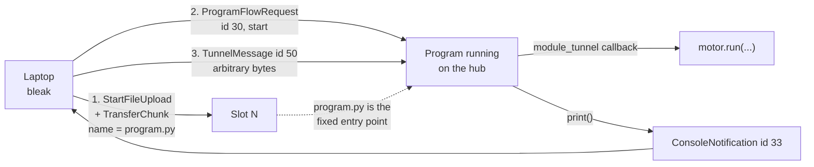

# Research — Driving motors and streaming telemetry over BLE on stock SPIKE 3

**Date:** 2026-09-08 · **Hardware touched:** **NONE.** Every claim below comes from LEGO's published
protocol repo, its issue tracker, the `bleak` and BlueZ sources installed on *this host*, or arithmetic
run on the host. Nothing was sent to the hub.

**Question asked (operator):** *other people are evidently connecting to these hubs over Bluetooth and
driving the motors live — what is actually possible, and should we add live BLE alongside the proven
store-and-download route?*

---

## 1. TL;DR

| Question | Answer |
|---|---|
| Can a laptop command motors over BLE on stock SPIKE 3? | **Yes, but only indirectly.** LEGO's protocol has **no actuation message at all**. You upload a program that listens, start it, then send it bytes. Stated outright by LEGO's own maintainer. |
| Does `print()` on the hub arrive over BLE? | **CONFIRMED.** `ConsoleNotification` id 33 / `0x21`, `string[256]`, fragmented across notifications. Primary-sourced, and a LEGO engineer answers a user question about exactly this. |
| Realistic telemetry rate if the MTU really is 23? | **~6.7 full CSV rows/s** at a 30 ms connection interval, 1 packet/event (computed below). Our full row costs **5 notifications**. |
| Can the MTU be raised? | **It is almost certainly already ~512 and was never 23.** `bleak`'s BlueZ backend **always returns 23** unless `_acquire_mtu()` is called — that is in the installed `bleak` 3.0.2 docstring. Our own hub reported `max_packet_size` **509 = 512 − 3**. |
| Can a hub program open its own radio? | **Don't.** `bluetooth` is present on our hub, but LEGO's sanctioned two-way channel for a program is `hub.config["module_tunnel"]`, and the BLE singleton is already serving the link we want. |
| Demo Day (10 SEP, **2 days**) | **Change nothing.** The store-to-`/flash`-then-download route stays the record of account. |

### Recommendation, split by deadline

**BEFORE DEMO (10 SEP) — do nothing.** No new BLE code, no protocol experiment, no hub-side change.
The proven route ([ADR-0007](../decisions/0007-deploy-by-writing-modules-to-flash-lib.md) +
`slot_upload.py` → unplug → button → CSV on `/flash` → `download.py`) has **zero radio dependency**, and
the two live-control mechanisms both carry first-hand crash or corruption reports (§ 6).

**AFTER DEMO, for the Intro Report — one read-only host script, ~40 lines, no hub-side change.** It
answers three open questions in a single connection and cannot affect a run:

1. Read the **true** MTU via `characteristic.max_write_without_response_size` (§ 4).
2. Subscribe `DeviceNotificationRequest(0x28)` and count `DeviceNotification`s — a live motor/IMU/colour
   stream **with no hub code whatsoever**.
3. Watch for `ConsoleNotification`s while an existing slot program prints, and measure rows/s.

That is a results section for the report ("we measured the link at X bytes/s") bought for no risk.

---

## 2. Driving motors over BLE

### The mechanism — settled by LEGO's own maintainer

There is **no host→hub actuation message in the protocol.** The complete message table
([`messages.rst`](https://github.com/LEGO/spike-prime-docs/blob/main/docs/source/messages.rst)) is
info, firmware upload, file upload, program flow, hub name, device UUID, console, tunnel, and device
notifications. Every `DeviceMotor` / `DeviceColorSensor` / `DeviceDistanceSensor` structure is a
**read-only** record nested inside `DeviceNotification` (id 60). SteffenLEGO, the LEGO maintainer, in
[spike-prime-docs issue #3](https://github.com/LEGO/spike-prime-docs/issues/3) (2024-06-07):

> "There are no handles in the protocol to do anything with the hardware. Running motors, turning on
> lights. Instead what you have to do is transfer a micropython program (either as text or as bytecode)
> using the filetransfer handles in the protocol. I think there might be a hard dependency on the name
> `program.py` or `program.mpy` … Then you need to send a `ProgramFlowRequest` to start the program. …
> you'd have to build things like that yourself using the `TunnelMessage` which allows you to send
> arbitrary data back and forth between the running program and whatever app you create."

That independently confirms
[slot-execution-and-live-motor-control-2026-09-03.md](./slot-execution-and-live-motor-control-2026-09-03.md)
on both points: the **`program.py` filename dependency** and the **absence of any actuation handle**.



### The hub-side receiver, quoted from LEGO

SteffenLEGO, [issue #8](https://github.com/LEGO/spike-prime-docs/issues/8) (2025-02-06) — the only
published description of how a program receives a `TunnelMessage`:

```python
tunnel = hub.config["module_tunnel"]

def receive_tunnel_message(data):
    print(data)

tunnel.callback(receive_tunnel_message)
tunnel.send(data)          # bytes, not str
```

This is **undocumented in the reference itself** — it exists only as a maintainer comment on an open
issue. `tunnel.send()` "requires bytes instead of a string" (same thread, 2025-09-19).

### Latency, command rate, and who has actually done it

**No project we found publishes a latency or command-rate figure.** Not spikerc, not
SpikeRemoteControl, not the LEGO example. Do not quote one. What can be *computed*: a command is one
write-without-response, so its floor is one connection interval (7.5 ms minimum, 30–50 ms typical)
**plus** hub-side callback latency inside a cooperative `runloop`. Both `[UNVERIFIED]` on our link. A
10–30 Hz teleoperation loop is *structurally* plausible; nothing here proves it.

`etomasfe/SpikeRemoteControl` (July 2025, HTML + Web Bluetooth) is the one confirmed **SPIKE 3** live
controller: clear slot 0 → upload → `ProgramFlow` start → send button-name strings the hub program acts
on. Its author needed the maintainer's `module_tunnel` answer to build it. `faisaltameesh/spikerc` does
the same with a gamepad, but its README says **"Use v2 of the Spike Prime app, not V3"** — SPIKE 2.
**The pattern is universal: nobody drives a motor without a hub-side program running.**

---

## 3. Telemetry out over BLE — `print()` → `ConsoleNotification`

### CONFIRMED, not refuted

`ConsoleNotification` is message **id 33 (`0x21`)**, one field, `string[256]`
([`messages.rst`](https://github.com/LEGO/spike-prime-docs/blob/main/docs/source/messages.rst); the
reference client's [`messages.py`](https://github.com/LEGO/spike-prime-docs/blob/main/examples/python/messages.py)
deserializes it as `data[1:].rstrip(b"\0").decode("utf8")`).

Three independent primary confirmations that hub `print()` is what fills it:

1. LEGO's own [`app.py`](https://github.com/LEGO/spike-prime-docs/blob/main/examples/python/app.py)
   uploads a program whose second line is `print("Console message from hub.")`, and the client
   deserializes and prints every received message.
2. [Issue #10](https://github.com/LEGO/spike-prime-docs/issues/10) — a user: *"I am running my python
   program on the hub and it outputs some logging messages that appear to be too long for the code to
   handle."* SteffenLEGO answers with the framing rules, never disputing the premise.
3. [Issue #9](https://github.com/LEGO/spike-prime-docs/issues/9) — SteffenLEGO: *"the biggest offenders
   in this is usually the python `print` and the tunnel messages, where you can pretty easily get the
   hub to try and send data faster than what is possible with the connection."*

**That third quote is the most operationally important sentence in this document.** The overrun failure
mode is **corrupted messages on the wire, not backpressure**. Do not assume `print()` blocks when the
link is saturated; assume it corrupts. (This narrows repo unknown G4b: the answer is "it does not
politely block".)

Long lines **are fragmented across notifications** — LEGO's example says so in a comment, and issue #10
is a user hitting it. A receiver must buffer to the `0x02` delimiter. Our `probes/_cobs.py` already does.

### The throughput arithmetic (computed on this host, not measured on the link)

**Per-notification payload** at ATT MTU `M` is `M − 3` bytes (ATT opcode 1 B + handle 2 B). At `M = 23`
that is **20 B**.

**Framed size of a printed line of `N` characters.** Payload = 1 (msg id `0x21`) + `N` + 1 (NUL
terminator) = `N + 2`. ASCII text contains no byte ≤ `0x02`, so LEGO's COBS adds exactly one code word
per ≤84-byte block, and `pack()` appends one delimiter:

```
framed = N + 4          for N <= 82      (one COBS block)
framed = N + 5          for 83 <= N <= 166
```

Computed by running `probes/_cobs.py` (our host-side implementation of LEGO's published `cobs.py`) over
`bytes([0x21]) + b"x"*N + b"\x00"`. Sample: `N=16 → 20`, `N=82 → 86`, `N=84 → 89`.
**Overhead is 4 bytes per line — negligible. COBS is not the problem.**

**Our actual row.** `src/telemetry.py:record_line()` with realistic values (computed on host):

```
1234,987654,-1234,5678,-40,40,-1795,12,-8,-23,14,989,68,512,431,120,1234,SWEEP,7,3,ON
```

85 characters. `print()` adds `\n` → `N = 86` → **framed 91 B** → `ceil(91 / 20)` = **5 notifications**.

**Rows per second** = (notifications/s) ÷ 5, and notifications/s = (packets per connection event) ÷
(connection interval). **Neither term is measured on our link** — this is a grid, not a result:

| Conn. interval | 1 pkt/event | 4 pkt/event |
|---|---|---|
| 7.5 ms | 133 notif/s → **26.7 rows/s** | 533 → **106.7 rows/s** |
| 15 ms | 66.7 → **13.3 rows/s** | 267 → **53.3 rows/s** |
| 30 ms | 33.3 → **6.7 rows/s** | 133 → **26.7 rows/s** |
| 50 ms | 20 → **4.0 rows/s** | 80 → **16.0 rows/s** |

**In bytes/s:** 20 B × notif/s → 667 B/s at 30 ms × 1, up to 10.7 kB/s at 7.5 ms × 4.

The honest single number to quote until something is measured: **~6.7 rows/s** (30 ms, 1 packet/event).
That matches [telemetry-while-driving.md](./telemetry-while-driving.md)'s ~5–7 rec/s and **is far below
the ~50 Hz control loop the mission log wants** — which is why the log stays on `/flash`.

**The two levers, in order of leverage:**

1. **Make the record fit one notification.** Our live-essential subset
   (`seq,state,det_state,lane,count,yaw_ddeg` = 23 chars → framed 28 B) is **2** notifications at MTU 20
   and **1** at any MTU ≥ 32 — a 5× rate gain for free. Already designed in
   [compact-telemetry-encoding.md](./compact-telemetry-encoding.md).
2. **Raise the MTU** — which, per § 4, may already be done.

---

## 4. The MTU question — 23 vs 509

### Who negotiates

The **GATT client** — our laptop, the central — sends `ATT_EXCHANGE_MTU_REQ`; the server (hub) replies
with its own maximum; the link uses the **minimum of the two**, for **both** directions of that ATT
bearer (so it caps notification payloads too). On Linux this is done automatically by BlueZ at connect;
the value BlueZ requests is `[GATT] ExchangeMTU` in `/etc/bluetooth/main.conf`, **default 517**, range
23–517. Our host's `main.conf` has no `[GATT]` section, so **BlueZ is already asking for 517**.

### Why we recorded 23 — the reporting artifact, HOST-CONFIRMED

From the docstring of `BleakClient.mtu_size` in the **`bleak` 3.0.2 installed on this machine**
(`~/.local/lib/python3.10/site-packages/bleak/__init__.py:617`):

```
Gets the negotiated MTU size in bytes for the active connection.

Consider using BleakGATTCharacteristic.max_write_without_response_size instead.

.. warning:: The BlueZ backend will always return 23 (the minimum MTU size).
    See the ``mtu_size.py`` example for a way to hack around this.
```

and the BlueZ backend itself (`backends/bluezdbus/client.py:643`) returns `23` with a warning whenever
`self._mtu_size is None`. **Our `examples/ble_connect.py` / `ble_info_request.py` read exactly that
property. The "measured MTU 23" in [../findings/ble-protocol-2026-08-27.md](../findings/ble-protocol-2026-08-27.md)
is a bleak default, not a wire measurement, and that finding should be corrected.**

### The corroborating evidence that it is really ~512

LEGO defines `max_packet_size` as *"the largest amount of data that can be written to the RX
characteristic in a single operation"*
([`connect.rst`](https://github.com/LEGO/spike-prime-docs/blob/main/docs/source/connect.rst)) — a
**link property, not a firmware constant**. Two data points:

| Host | Reported `max_packet_size` | + 3 = |
|---|---|---|
| **Ours**, Ubuntu 22.04 / BlueZ 5.64 (MEASURED 2026-08-27) | **509** | **512** |
| macOS Sequoia, Hub OS 1.6.62 ([issue #9](https://github.com/LEGO/spike-prime-docs/issues/9)) | **182** | **185** |

185 is the [well-known ATT MTU Apple centrals negotiate since iOS 10](https://devzone.nordicsemi.com/f/nordic-q-a/44825/ios-mtu-size-why-only-185-bytes).
Both values are exactly `MTU − 3`. `[INFERRED — strong]`: **`max_packet_size` is the hub telling us the
negotiated MTU, and our link negotiated 512.** The competing explanation (a firmware-version constant,
1.6.62 vs 1.8.149) does not explain the −3 landing on a platform-characteristic MTU in both cases.

### How to read the truth without changing anything

Read-only, one connection, no writes to the hub:

```python
ch = client.services.get_characteristic(TX_CHAR)
print(ch.max_write_without_response_size)      # BlueZ D-Bus "MTU" property minus 3
await client._backend._acquire_mtu()           # BlueZ AcquireWrite; then client.mtu_size is real
```

`bleak/backends/bluezdbus/manager.py:165` is `return char_props.get("MTU", 23) - 3` — the `MTU` D-Bus
property exists from BlueZ 5.62, and we run 5.64, so the first line should already be truthful.

### Can it be raised further?

**No, and it does not need to be.** 517 is the ATT MTU ceiling and BlueZ already requests it. If the
link is at 512, the whole 91-byte telemetry row fits in **one** notification — a 5× rate gain over the
23-byte assumption, and **any further MTU increase buys literally nothing** once the record fits.

The remaining throughput levers are then **connection interval** and **LE Data Length Extension**, not
MTU. BlueZ exposes no supported per-connection interval control to an application; the peripheral
requests parameters. `[UNVERIFIED]` — untested, and not worth chasing before something is measured.

⚠ One contrary anecdote to settle: [issue #10](https://github.com/LEGO/spike-prime-docs/issues/10)'s
reporter saw a long console message arrive *"one character at a time"*. If the hub emits a notification
per character regardless of MTU, every number above collapses. `[UNVERIFIED]` for our build; it is the
first thing the post-demo script should count.

---

## 5. Community projects

| Project | What it actually does | Generation | Useful to us |
|---|---|---|---|
| [LEGO/spike-prime-docs](https://github.com/LEGO/spike-prime-docs) | **The primary source.** Message table, COBS/XOR framing, connect procedure, working `bleak` client (`app.py`). Its **issue tracker is where the undocumented answers live.** | **SPIKE 3** | **Yes — the only thing to trust without checking** |
| [etomasfe/SpikeRemoteControl](https://github.com/etomasfe/SpikeRemoteControl) | HTML+JS Web Bluetooth: clears slot 0, uploads a program, starts it, sends button names to it live. | **SPIKE 3** | Yes — proof the live-control pattern works end to end |
| [PeterStaev/lego-spikeprime-mindstorms-vscode](https://github.com/PeterStaev/lego-spikeprime-mindstorms-vscode) | VS Code extension; **v2.x works only with Hub OS 3**; USB + Bluetooth upload/start/stop. | **SPIKE 3** | Reference implementation of the same protocol we wrote |
| [sanjayseshan/spikeprime-tools](https://github.com/sanjayseshan/spikeprime-tools) | JSON-RPC over USB serial: list/upload/start/stop programs, matrix images. | **SPIKE 2** (Hub OS 2 JSON-RPC) | **No** — that RPC does not exist on our hub |
| [gpdaniels/spike-prime](https://github.com/gpdaniels/spike-prime) | Hardware/firmware reverse engineering, REPL dumps, a PC-side mock of the hub modules. | Mixed, mostly **SPIKE 2** | Background only |
| [faisaltameesh/spikerc](https://github.com/faisaltameesh/spikerc) | Gamepad → BLE → hub-side receiver program. README: *"Use v2 of the Spike Prime app, not V3."* | **SPIKE 2** | Pattern only |
| [tuftsceeo/SPIKE-Web-Interface](https://github.com/tuftsceeo/SPIKE-Web-Interface) | JS "ServiceDock" web framework, Web Serial primary. | **SPIKE 2** | No |
| Pybricks | Best protocol reverse-engineering in the ecosystem; its BLE broadcast/observe is genuinely elegant. | Own firmware | **EXCLUDED — it reflashes the hub ([ADR-0001](../decisions/0001-stock-lego-firmware-only.md)). Read it, never run it.** |
| nanoFramework | **No SPIKE Prime hub support found.** Nothing to cite. | — | No |

**Two-thirds of what looks relevant online is SPIKE 2.** Anything speaking JSON-RPC, `from spike
import PrimeHub`, or RFCOMM is a different machine from ours.

---

## 6. Can a hub program open its own BLE socket?

**Module surface (MEASURED, ours):** `bluetooth` **is** in the module list
([harvest run](../findings/runs/harvest-20260901T101832.txt)), and `dir(bluetooth.BLE)` is the full
MicroPython GAP+GATT surface. The earlier "it is absent, therefore impossible" inference is dead — but
the conclusion survives on better grounds:

- **LEGO's answer to this exact question is "use the tunnel".** In [issue #3](https://github.com/LEGO/spike-prime-docs/issues/3),
  a developer guessed `TunnelMessage` involved `bluetooth.BLE` with GATT or L2CAP; the maintainer's
  reply pointed at `hub.config["module_tunnel"]` instead. User BLE code is not the sanctioned path.
- **The radio is already in use.** `BLE()` is a singleton the Hub OS is using to serve `FD02`, and
  MicroPython's `gatts_register_services()` is documented as replacing existing services. Taking it
  over would drop the very link we want. `[INFERRED]`
- **First-hand report that it is blocked anyway:** `import bluetooth` raising `EPERM` on SPIKE 3, with
  every working on-hub BLE library (btbricks, hub2hub, PrimePoweredUP) targeting SPIKE 2 / Robot
  Inventor. `[UNVERIFIED]` for our build — a blog comment, and our `dir()` was taken at the REPL, not
  in a slot program.

**Verdict: for our purposes, yes — `print()` → `ConsoleNotification` (out) and `module_tunnel` (in) are
the only telemetry and command routes, and that is enough.** We never need the radio API. Nothing here
justifies spending a session proving the EPERM question either way.

---

## 7. Risks for a graded demo

| Risk | Evidence | Store-and-download exposure |
|---|---|---|
| **`TunnelMessage` shuts the hub down** | Two independent first-hand SPIKE 3 reports, [issue #8](https://github.com/LEGO/spike-prime-docs/issues/8); one *verified a program was running*. LEGO acknowledged a crash bug and it is still open. | **None** |
| **`print()` outruns the link and corrupts messages** | SteffenLEGO, [issue #9](https://github.com/LEGO/spike-prime-docs/issues/9) | **None** — writes go to `/flash` |
| **Disconnect mid-run** | BLE, a moving robot, a classroom | **None** — the run does not depend on a link |
| **Room full of hubs / picking the wrong one** | Our own finding: identify by `DeviceUuidRequest 0x1A`, never by name or MAC | **None** — no radio in the loop |
| **Advertising window self-terminates** | [../findings/ble-protocol-2026-08-27.md](../findings/ble-protocol-2026-08-27.md) § 5 — must wait-and-pounce | **None** |
| **2.4 GHz congestion from other teams** | Structural; unmeasured | **None** |

**What adopting live BLE would cost us**, if we ever did: a receiver task in the hub program (new,
never-run code), a host-side client that must not become load-bearing, a `main.py` that behaves
correctly when the link is *absent* (the common case), and a demo whose failure modes now include the
laptop. Against that, the entire benefit is *watching* — the CSV already answers every analysis question
the Intro Report needs. **That trade is wrong two days before Demo Day and is not close.**

---

## 8. Open questions, each with the experiment that closes it

| # | Question | Experiment (all read-only, all post-demo) |
|---|---|---|
| B1 | What is the **true** ATT MTU on our link? | Connect with `bleak`; print `ch.max_write_without_response_size`, then `await client._backend._acquire_mtu()` and `client.mtu_size`. No writes. |
| B2 | Is `max_packet_size` really `MTU − 3`? | Same connection: compare `InfoResponse.max_packet_size` to B1's answer. Equal ⇒ inference confirmed. |
| B3 | Does the hub fragment a long `print()` per-character? | Run an existing slot program that prints a known 85-char row; timestamp and log every notification. Count bytes per notification. |
| B4 | Sustained `ConsoleNotification` rows/s and byte/s? | Same capture: `rows_received / elapsed`; compare against the § 3 grid; check the sequence numbers for gaps (`telemetry.trailer_lines` already makes loss detectable). |
| B5 | What is the connection interval? | `btmon` on the host during connect, or `/sys/kernel/debug/bluetooth/hci0/conn_*`. Host-side only. |
| B6 | Does `DeviceNotification` (id 60) work on our firmware, and at what interval floor? | `DeviceNotificationRequest(0x28)` at 1000 ms, then 100 ms, then 20 ms; count arrivals. **Needs no hub-side code** — the safest first BLE test. |
| B7 | Does `print()` block or corrupt when the link saturates? | Print a 200-row burst as fast as the loop allows with a client attached; compare received rows against the `/flash` CSV from the same run. The CSV is ground truth. |
| B8 | Does `import bluetooth` raise `EPERM` in a *slot* program (vs the REPL)? | One-line slot program `import bluetooth; print("ok")`. **Never instantiate `BLE()`** — that is a state change on shared equipment and the operator's call. |

---

**Related:** [../findings/ble-protocol-2026-08-27.md](../findings/ble-protocol-2026-08-27.md) (correct
its MTU claim per § 4) · [slot-execution-and-live-motor-control-2026-09-03.md](./slot-execution-and-live-motor-control-2026-09-03.md) ·
[telemetry-while-driving.md](./telemetry-while-driving.md) · [device-notification-telemetry.md](./device-notification-telemetry.md) ·
[compact-telemetry-encoding.md](./compact-telemetry-encoding.md) · [program-upload-protocol.md](./program-upload-protocol.md) ·
[spike3-deploy-and-radio.md](./spike3-deploy-and-radio.md) · [ADR-0007](../decisions/0007-deploy-by-writing-modules-to-flash-lib.md)
